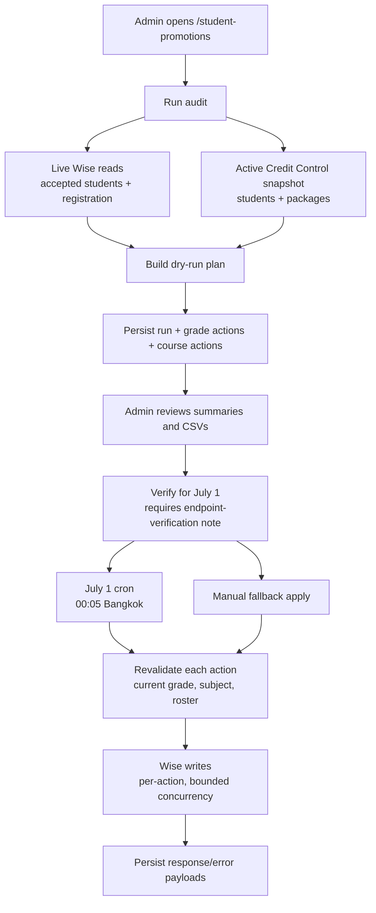

# Student Promotions

**Status: stable, pending first production run**

## Purpose

Student Promotions is an audited July 1, 2026 workflow for moving Wise students up one academic year and, only for the two requested transition bands, updating their Wise class subjects.

It is deliberately not part of the normal Wise snapshot sync. The workflow reads current Wise students and registration data live, cross-checks against the active Credit Control website snapshot for class/package context, stores a dry-run plan, requires an admin verification step, then applies the verified plan through bounded Wise writes on July 1 Bangkok time.

The page is available at `/student-promotions` and is admin-session gated like the rest of the app. Exact endpoint contracts are in [docs/reference/api/student-promotions.md](../reference/api/student-promotions.md); exact table columns are in [docs/reference/database/erd-student-promotions.md](../reference/database/erd-student-promotions.md).

## What It Changes

The workflow can write two Wise surfaces:

- **Student registration field** `if89sblj`, labelled `Current Year/Grade level`, via `PUT /institutes/{instituteId}/students/{studentId}/registration`.
- **Class/course subject** via `PUT /teacher/editClass`, deduped by Wise class id.

Everything else is read-only. Course updates are class-level in Wise, so the service only creates a pending course action when every current student in that class qualifies for the same transition.

## Promotion Rules

### Grade writes

The source of truth for current grade is Wise registration field `if89sblj`.

Accepted input formats are:

- `Year N`, `Y N`, `YN`
- `Grade G`, `G G`, `GG`

Grade labels convert to school year by adding one: `Grade 7` means current `Year 8`. Blank or unparseable values are skipped and reported. The target registration text is always:

```text
Year {currentYear + 1} / Grade {currentYear}
```

Examples: current `Year 8` becomes `Year 9 / Grade 8`; current `Year 11` becomes `Year 12 / Grade 11`.

### Course writes

Year 8 students are eligible for a course move only when their current subject exactly matches one of the requested Y2-8/G1-7 source subjects. Year 11 students are eligible only when their current subject exactly matches one of the requested Y9-11/G8-10 source subjects.

Exact mappings live in `src/lib/student-promotions/rules.ts`. The special case `(3-STU) Y2-8 / G1-7 (Int.) Master` has no requested Y9-11 master target and is therefore review-only if it appears.

Course variants such as `Trial`, `for receipt`, and spacing changes are not inferred. They are reported as unmapped variants unless a future explicit mapping is added.

### Other students

All parseable students outside the two transition course bands receive a grade-only action. Their class/course subjects are not changed.

## Flow



## Safety Rules

- A dry run always recomputes from live Wise plus the active website snapshot. Apply never trusts a stale cached action list without revalidation.
- Verification is blocked until an admin confirms endpoint verification and records a note.
- The cron route is protected by `CRON_SECRET` and hard-blocks itself unless the Bangkok date is exactly `2026-07-01`.
- The service refuses any apply before `2026-07-01 00:05 Asia/Bangkok`.
- Grade actions re-read the student's current registration value before writing.
- Course actions re-read the current class subject and live roster before writing.
- A drift or Wise error marks only that action as skipped/failed; the run continues and ends as `applied_with_errors` if any action did not apply cleanly.
- Re-running an already terminal run is idempotent and returns the stored result.

## UI

The workspace shows summary cards, review tables, and CSV downloads for:

- grade-only actions
- course+grade actions
- skipped blank/unparseable grades
- unmapped course variants
- mixed-class or roster blockers

The primary actions are:

- **Run audit** - create a new dry-run plan.
- **Verify for July 1** - lock a reviewed run after endpoint verification.
- **Apply verified run** - admin fallback; still respects the July 1 apply window.

## Tests

Coverage added for this workflow:

- `src/lib/student-promotions/__tests__/rules.test.ts` - grade parsing, canonical target formatting, exact course mapping, unmapped variants, course+grade action classification.
- `src/lib/wise/__tests__/fetchers.test.ts` - Wise request shapes for accepted students, registration read/write, course read, course subject update, and course roster fetch.
- `src/app/api/student-promotions/__tests__/route.test.ts` - admin auth, verification confirmation, manual apply confirmation, cron secret protection, and the one-shot July 1 Bangkok cron guard.

Service tests cover dry-run generation, deduped class actions, drift revalidation, idempotent apply, partial failure behavior, and skipped blank/unparseable grades.

## First Production Run Checklist

Before July 1, 2026:

1. Deploy code and run the `0040_student_promotions.sql` migration.
2. Open `/student-promotions` and run a fresh audit.
3. Download/review the CSVs and confirm expected counts.
4. Perform the Wise endpoint no-op verification against an approved safe record.
5. Verify the run with the endpoint-verification note.
6. Confirm Data Health lists the `Student Promotions July 1` cron as registered.

On July 1, 2026 Bangkok time:

1. Confirm the cron ran or use the manual fallback after 00:05.
2. Review `applied`, `skipped`, and `failed` action counts.
3. Spot-check Wise readback for selected grade and course updates.
