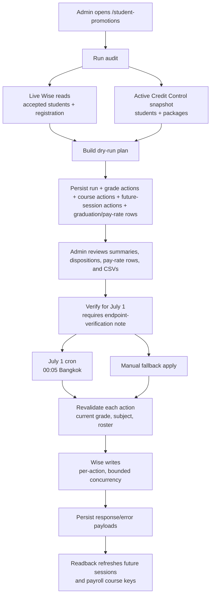

# Student Promotions

**Status: stable, pending first production run**

## Purpose

Student Promotions is an audited July 1, 2026 workflow for moving Wise students up one academic year, explicitly reviewing Year 13 graduates, updating requested Wise class subjects, and checking future school-curriculum session subjects plus payroll pay-rate impact before verification.

It is deliberately not part of the normal Wise snapshot sync. The workflow reads current Wise students and registration data live, cross-checks against the active Credit Control website snapshot for class/package context, stores a dry-run plan, requires an admin verification step, then applies the verified plan through bounded Wise writes on July 1 Bangkok time.

The page is available at `/student-promotions` and is admin-session gated like the rest of the app. Exact endpoint contracts are in [docs/reference/api/student-promotions.md](../reference/api/student-promotions.md); exact table columns are in [docs/reference/database/erd-student-promotions.md](../reference/database/erd-student-promotions.md).

## What It Changes

The workflow can write three Wise surfaces:

- **Student registration field** `if89sblj`, labelled `Current Year/Grade level`, via `PUT /institutes/{instituteId}/students/{studentId}/registration`.
- **Class/course subject** via `PUT /teacher/editClass`, deduped by Wise class id.
- **Single future session subject** via `PUT /teacher/classes/{classId}/sessions/{sessionId}?updateType=SINGLE`, only after `WISE_SESSION_SUBJECT_UPDATE_VERIFIED=true` and exact admin confirmation `apply-future-session-subjects`.

Everything else is read-only. Course updates are class-level in Wise, so the service only creates a pending course action when every current student in that class qualifies for the same transition. Payroll has no separate pay-band field; payroll derives the course band from the Wise session/class subject plus the session student count, so future-session guardrails only touch the session `subject`.

## Promotion Rules

### Grade writes

The source of truth for current grade is Wise registration field `if89sblj`.

Accepted input formats are:

- `Year N`, `Y N`, `YN`
- `Grade G`, `G G`, `GG`

Grade labels convert to school year by adding one: `Grade 7` means current `Year 8`. Blank or unparseable values are skipped and reported. The target registration text is always:

```text
Year {currentYear + 1} / Grade {currentYear}
```

Examples: current `Year 8` becomes `Year 9 / Grade 8`; current `Year 11` becomes `Year 12 / Grade 11`.

### Course writes

Year 8 students are eligible for a course move only when their current subject exactly matches one of the requested Y2-8/G1-7 source subjects. Year 11 students are eligible only when their current subject exactly matches one of the requested Y9-11/G8-10 source subjects.

Exact mappings live in `src/lib/student-promotions/rules.ts`. The special case `(3-STU) Y2-8 / G1-7 (Int.) Master` has no requested Y9-11 master target and is therefore review-only if it appears.

Course variants such as `Trial`, `for receipt`, and spacing changes are not inferred. They are reported as unmapped variants unless a future explicit mapping is added.

### Future session pay-band checks

For mapped UK/US/IB school-curriculum course actions only, the audit also reads live Wise FUTURE sessions and persists future-session actions for sessions starting on or after `2026-07-01T00:00:00+07:00`.

Eligible future sessions must belong to a mapped course action and normalize through payroll to one of:

- `year_9_11_grade_8_10`
- `year_9_11_grade_8_10_master`
- `year_12_13_grade_11_12`
- `year_12_13_grade_11_12_master`
- `university_level`
- `university_level_master`

Thai/EP, exam-prep, trial, and unmapped courses are out of scope. If the live session subject already exactly matches the target, or normalizes to the expected promoted payroll course key, it is marked applied/idempotent and no session write is needed. If the live session still has the source subject, it is pending/manual-required until the gated future-session apply action is used. If it drifted to an unrelated subject, it is reported as an exception.

### Year 13 graduates

Current Year 13 students never receive a `Year 14 / Grade 13` registration action. They are recorded as graduation-review rows and must be assigned one of two dispositions before verification:

- `inactive` writes only the local Credit Control inactive sidecar during apply. It does not call a Wise student deactivation endpoint.
- `university` allows exact Y12-13/G11-12 class subjects to move to matching University subjects, including 1/2/3-STU and Master variants where exact mappings exist.

Year 13 University class actions stay skipped until every qualifying Year 13 student in that class is selected for University. Mixed inactive/university rosters remain review-only.

### Pay-rate impact review

For Year 8, Year 11, and selected Year 13 University course moves, the audit groups future sessions from July 1 Bangkok onward by teacher, Wise class, student band, and current/target course pair. It uses live Wise teacher tags for tutor tier and the active payroll rate card's `expectedRevenuePerHour` for before/after hourly rates.

Missing teacher tier, missing active rate card, unmapped course key, or missing before/after rate rule is a verification blocker. Every non-blocked pay-rate row must be marked `verified_correct`; rows marked `incorrect` also block verification until the mapping/rate-card/tier issue is fixed and the audit is rerun.

### Other students

All parseable students outside the two transition course bands receive a grade-only action. Their class/course subjects are not changed.

## Flow



## Safety Rules

- A dry run always recomputes from live Wise plus the active website snapshot. Apply never trusts a stale cached action list without revalidation.
- Verification and apply are blocked when the run is older than 24 hours or the active Credit Control snapshot is newer than the run's source snapshot.
- Verification is blocked until every Year 13 graduation row has a disposition and every pay-rate impact row is verified correct.
- Apply re-fetches live accepted Wise students and aborts before any write if the verified run is missing any current accepted student.
- Verification is blocked until an admin confirms endpoint verification and records a note.
- The cron route is protected by `CRON_SECRET` and hard-blocks itself unless the Bangkok date is exactly `2026-07-01`.
- The service refuses any apply before `2026-07-01 00:05 Asia/Bangkok`.
- Grade actions re-read the student's current registration value before writing.
- Already-manually-promoted grades/classes are marked applied idempotently instead of being promoted again.
- Future sessions that are already on the promoted subject or promoted payroll course key are marked idempotent instead of being written again.
- Course actions re-read the current class subject and live roster before writing.
- Graduate inactive actions write only `credit_control_inactive_students`; no Wise student deactivation occurs in this version.
- The July 1 cron may refresh future-session actions, but it never performs session-level subject writes. Session subject writes require the separate admin action plus `WISE_SESSION_SUBJECT_UPDATE_VERIFIED=true`.
- A drift or Wise error marks only that action as skipped/failed; the run continues and ends as `applied_with_errors` if any action did not apply cleanly.
- A read-only readback check fetches live Wise state after apply and reports any remaining grade, course, and future-session/payroll-course exceptions.
- Re-running an already terminal run is idempotent and returns the stored result.

## UI

The workspace shows summary cards, review tables, and CSV downloads for:

- grade-only actions
- course+grade actions
- future session subject actions from July 1 Bangkok onward
- Year 13 graduation dispositions
- pay-rate impact review rows with teacher tier, before/after expected rates, session counts, and reviewer status
- skipped blank/unparseable grades
- unmapped course variants
- mixed-class or roster blockers

The primary actions are:

- **Run audit** - create a new dry-run plan.
- **Set graduate disposition** - choose local inactive or University for every Year 13 student.
- **Review pay-rate impact** - mark each pay-rate row correct or incorrect before verification.
- **Verify for July 1** - lock a reviewed run after endpoint verification.
- **Apply verified run** - admin fallback; still respects the July 1 apply window.
- **Apply future session subjects** - separate gated action for pending July 1+ session subjects; the route refuses writes unless the verification env flag is enabled.
- **Run readback check** - read live Wise after apply and export a CSV of grade/course/future-session confirmations and exceptions.

## Tests

Coverage added for this workflow:

- `src/lib/student-promotions/__tests__/rules.test.ts` - grade parsing, canonical target formatting, exact course mapping, unmapped variants, course+grade action classification.
- `src/lib/wise/__tests__/fetchers.test.ts` - Wise request shapes for accepted students, registration read/write, course read, course subject update, single-session subject update, and course roster fetch.
- `src/app/api/student-promotions/__tests__/route.test.ts` - admin auth, verification confirmation, manual apply confirmation, future-session confirmation, cron secret protection, and the one-shot July 1 Bangkok cron guard.

Service tests cover dry-run generation, deduped class actions, drift revalidation, idempotent apply, partial failure behavior, skipped blank/unparseable grades, future-session eligibility, payroll course normalization, and future-session readback classification.

## First Production Run Checklist

Before July 1, 2026:

1. Deploy code and run the `0040_student_promotions.sql`, `0048_student_promotion_future_sessions.sql`, and `0049_student_promotion_graduation_pay_rates.sql` migrations.
2. Open `/student-promotions` and run a fresh audit.
3. Set every Year 13 disposition and review every pay-rate impact row.
4. Download/review the CSVs and confirm expected counts.
5. Perform the Wise endpoint no-op verification against an approved safe record.
6. Verify the run with the endpoint-verification note.
7. Confirm Data Health lists the `Student Promotions July 1` cron as registered.

On July 1, 2026 Bangkok time:

1. Confirm the cron ran or use the manual fallback after 00:05.
2. Review `applied`, `skipped`, and `failed` action counts.
3. Run the readback check and export the exceptions CSV.
4. Spot-check Wise readback for selected grade, course, and future session subject updates.
5. Keep `WISE_SESSION_SUBJECT_UPDATE_VERIFIED` unset until the single-session subject request shape has been verified against an approved safe/no-op record. Only then use the separate future-session apply action.
