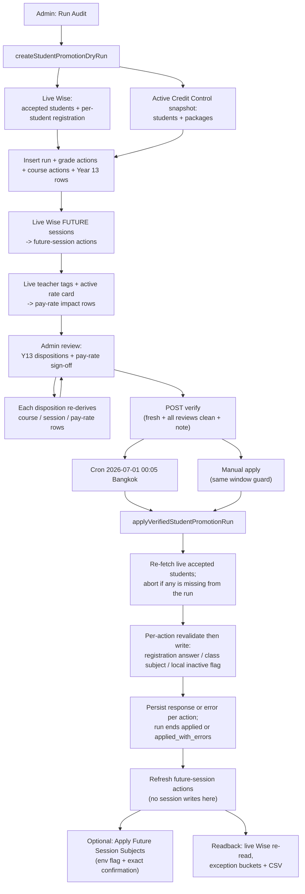

# Student Promotions

**Status: stable**

> This page describes the code at `main@0cd1e81`. `src/lib/student-promotions/`, `src/app/api/student-promotions/`, `src/app/(app)/student-promotions/`, and `src/components/student-promotions/` are all clean against HEAD here, and identical to the same paths at `main` (`fed828d`) — `git diff --stat fed828d 0cd1e81` over them is empty. No in-flight Student Promotions work is observable from the repo.

## Purpose

Student Promotions is the **academic-year rollover** for the Wise tenant: on July 1, 2026 (Asia/Bangkok) every accepted student's `Current Year/Grade level` registration answer moves up one year, classes that sit on a year-band course subject move to the next band, Year 13 students are graduated by explicit human decision instead of being incremented, and the pay-rate consequences of those course moves are reviewed **before** anything is written back to Wise.

What the code enforces is an **audit → review → verify → apply → readback** pipeline: every intended write is persisted as a typed row before anything fires (`src/lib/student-promotions/data.ts:1731-1747`, `:1809-1811`), each write is revalidated against live Wise immediately before it is sent (`data.ts:2088-2158` for grades, `:2160-2237` for courses), and the response or error of every write is stored back on its row. The *motivation* usually given — that a once-a-year, high-blast-radius batch of writes against live student records warrants this over a script someone runs from a laptop — is not recorded anywhere in the repo; it is an inference from the pipeline's shape, not a code-verified claim.

The users are BeGifted admin staff. The page is `/student-promotions`, registered in the nav under the `student-lifecycle` section with no count badge (`src/lib/navigation/tools.ts:191-197`). Full-access admins reach it unconditionally; restricted users need an `allowedPages` entry that prefix-matches it (`src/middleware.ts:36-67`). The API routes gate on session **email presence only** — `requireStudentPromotionSession` (`src/lib/student-promotions/api.ts:9-15`) — with no further capability check.

Two things this feature deliberately is **not**:

- It is **not part of the Wise snapshot sync**. It never touches `snapshots` or the in-memory search index. Its student/class context comes from the active **Credit Control** snapshot, and everything grade-related is read live from Wise at audit time.
- It is **not scheduled maintenance**. The single cron entry is a one-shot business event pinned to one calendar date; outside that date it refuses to run (`src/app/api/internal/student-promotions/july-1/route.ts:27-31`).

Both the target date and the run lookup are hard-coded to `2026-07-01` (`src/lib/student-promotions/rules.ts:1`, used as the run filter in `data.ts:1932` and `:2501`), so a second annual rollover is a code change, not a config change. **As of this revision the target date is in the past**: the cron route now answers `409` on every fire, and the manual apply window — which only checks `now >= 2026-06-30T17:05:00Z` (`rules.ts:2`, `data.ts:2063-2065`) — is permanently open.

## Conceptual data model

The feature owns **six audit tables**, created across three migrations: `drizzle/0040_student_promotions.sql` (both enums, runs, grade actions, course actions), `0048_student_promotion_future_sessions.sql`, and `0049_student_promotion_graduation_pay_rates.sql`. None of them carries a snapshot-scoping column, so they do not rotate with `snapshots`; a run only records the Credit Control snapshot id it read from, for traceability. That id is a real FK (`student_promotion_runs.source_snapshot_id → credit_control_snapshots.id`, `src/lib/db/schema.ts:1350`), and nothing in `src/`, `drizzle/`, or `scripts/` deletes a `credit_control_snapshots` row — neither a Drizzle `delete(...)` nor a raw `DELETE FROM` (grep over all three trees returns nothing) — so "snapshot-independent" holds in practice but rests on a retention behaviour nothing in the repo actively asserts. Every FK in the domain is declared `ON DELETE no action` (`drizzle/0040_student_promotions.sql:73-77`, `0048:22-24`, `0049:56-64`); nothing deletes runs, so this never bites, but it does mean a run cannot be removed while its child rows exist. Columns, types, indexes, enum values, and the ER diagram live in the reference: [docs/reference/database/erd-student-promotions.md](../reference/database/erd-student-promotions.md) (also summarised as sub-area 3 of [erd-core.md](../reference/database/erd-core.md)). Note that the ERD page has drifted from `schema.ts:1346-1515` in several places — see Open questions.

- **`student_promotion_runs`** — one row per audit. Carries the lifecycle status, the source Credit Control snapshot id, headline counts computed at audit time, the verification identity + endpoint-verification note, apply timestamps, and a `metadata` blob (registration field id/label, source-snapshot timestamp, and the last future-session apply attempt). The **reachable** lifecycle is `draft` (`data.ts:1735`) → `verified` (`:1960`) → `applying` (`:2313`) → `applied` / `applied_with_errors` (`:2343-2348`). The enum also declares `failed` (`schema.ts:136-143`), but **no code path ever writes it to a run** — it is an unused enum value.
  - Consequence: if apply throws (or the 800 s function times out) between the `applying` write and the terminal write, the run is **stuck at `applying` with no recovery path**. Nothing sweeps the table — `studentPromotionRuns` is referenced only by `src/lib/student-promotions/data.ts` and `src/lib/db/schema.ts`, so there is no watchdog to fail an abandoned run the way the Wise snapshot sync does (`failStaleRunningSyncs`, `src/lib/sync/run-wise-sync.ts:92`). Re-invoking apply on that run throws `"Only verified student promotion runs can be applied"` (`data.ts:2299-2301`), because the early-return only covers `applied`/`applied_with_errors` (`:2296-2298`). The way out is a fresh audit, or a manual DB status edit. Tracked as DEF-22 in [docs/OPEN-QUESTIONS.md](../OPEN-QUESTIONS.md).
- **`student_promotion_grade_actions`** — one row per **live accepted Wise student**, not just per student being changed. Holds the raw grade text read from Wise, the parsed current year, the canonical target grade text, an `actionType` classification (`grade_increment_only`, `year8_course_and_grade`, `year11_course_and_grade`, `graduation_review`, `missing_grade_review`, `unparsed_grade_review` — `rules.ts:144-153`, `data.ts:1763-1765`), status, skip reason, and the request/response payloads of the actual Wise write.
- **`student_promotion_course_actions`** — one row per **year-band Wise class that has at least one qualifying student or at least one unparseable grade**. Classes whose subject is neither mapped nor a recognisable year-band variant never produce a row (`data.ts:586`), and — importantly — neither does a *mapped* year-band class with zero qualifying students and zero unparseable grades (`data.ts:610-625`), nor an unmapped variant with neither (`:593-607`). Rows record the class roster and the subset of that roster which qualifies for the transition, so a mixed-year class can be refused rather than half-promoted.
- **`student_promotion_future_session_actions`** — one row per **eligible future Wise session** from July 1 Bangkok onward, keyed uniquely by `(runId, wiseSessionId)` so refreshes upsert rather than duplicate (`data.ts:376-408`). Stores both the literal subject text and the normalized **payroll course key** on each side of the move.
- **`student_promotion_graduation_actions`** — one row per current **Year 13** student, awaiting a human disposition of `inactive` or `university`. Its `status` is free text and moves `pending_review` (`data.ts:1800`) → `selected` (`:1992`) → `applied` / `failed` (`:2266`, `:2277`).
- **`student_promotion_pay_rate_impacts`** — one row per (course action × teacher × student band × course pair) group, with before/after expected hourly rates and a `reviewStatus` of `pending_review`, `blocked`, `verified_correct`, or `incorrect` (`data.ts:1326`, `:2048`). This is the money-side sign-off gate.

Tables it **reads but never writes**:

- `credit_control_snapshots` / `credit_control_students` / `credit_control_packages` — the active snapshot supplies student↔class↔subject context and the `studentKey`/parent name used for graduate handling (`data.ts:687-727`). If no active snapshot exists, the audit throws (`data.ts:695`). See [credit-control](./credit-control.md).
- `payroll_rate_card_versions` / `payroll_rate_rules` — the single active rate card supplies `expectedRevenuePerHour` for the before/after comparison (`data.ts:1579-1595`). See [payroll](./payroll.md).

The one table it writes **outside its own domain** is `credit_control_inactive_students`, via `markCreditInactive(..., source: "student-promotion-graduation")` when a graduate is dispositioned `inactive` (`data.ts:2249-2261`, upsert at `src/lib/credit-control/db.ts:258-282`). That is a local sidecar flag only — no Wise student-deactivation endpoint is called.

## API surface

Nine admin endpoints across eight route files under `src/app/api/student-promotions/`, plus one internal cron route. Every admin route gates on `requireStudentPromotionSession()` (`src/lib/student-promotions/api.ts:9-15`) and normalizes errors through `studentPromotionErrorResponse()` (`api.ts:29-56`); bodies are hand-parsed with `request.json().catch(() => ({}))`, not Zod-validated. Full request/response contracts and status codes: [docs/reference/api/student-promotions.md](../reference/api/student-promotions.md).

- **`GET /api/student-promotions/runs`** — latest run detail for target date `2026-07-01` (`null` if none). `runs/route.ts:7-14`
- **`POST /api/student-promotions/runs`** — build a fresh dry-run audit from live Wise + the active Credit Control snapshot. `maxDuration = 800`. `runs/route.ts:5,16-23`
- **`GET /api/student-promotions/runs/[runId]`** — one run with all five action collections, freshness, and summary counts. `runs/[runId]/route.ts`
- **`PATCH /api/student-promotions/runs/[runId]/graduation-actions/[actionId]`** — set a Year 13 graduate's disposition to `inactive` or `university`; re-derives dependent course/future-session/pay-rate rows. `maxDuration = 800`. `graduation-actions/[actionId]/route.ts:34-62`
- **`PATCH /api/student-promotions/runs/[runId]/pay-rate-impacts/[impactId]/review`** — mark one pay-rate group `verified_correct` or `incorrect`, with an optional note. `pay-rate-impacts/[impactId]/review/route.ts:34-62`
- **`POST /api/student-promotions/runs/[runId]/verify`** — lock a reviewed draft for July 1; requires `endpointVerificationConfirmed: true` plus a note. `verify/route.ts:10-37`
- **`POST /api/student-promotions/runs/[runId]/apply`** — admin fallback apply; requires the literal confirmation `apply-student-promotions`. `maxDuration = 800`. `apply/route.ts:20-22`
- **`POST /api/student-promotions/runs/[runId]/future-sessions/apply`** — the separately gated session-subject write path; requires the literal confirmation `apply-future-session-subjects`. `maxDuration = 800`. `future-sessions/apply/route.ts:23-25`
- **`POST /api/student-promotions/runs/[runId]/readback`** — read-only live-Wise verification sweep after apply. `maxDuration = 800`. `readback/route.ts:10-29`
- **`GET|POST /api/internal/student-promotions/july-1`** — the one-shot cron apply, `CRON_SECRET`-authenticated, date-gated. `POST` is a plain alias of `GET` (`route.ts:46-48`). Cron mechanics and the date gate: [docs/reference/api/internal-crons.md](../reference/api/internal-crons.md) and [docs/reference/crons.md](../reference/crons.md) (cron 14).

## UI

- **Page** — `src/app/(app)/student-promotions/page.tsx`: the exported page component is **synchronous** and does nothing but wrap a nested async Server Component in a Suspense boundary (`:38-44`). All the work — `auth()`, the `/login` redirect on a missing session email, and `getLatestStudentPromotionRunDetail()` — happens **inside** `StudentPromotionsBody` (`:7-13`), i.e. inside the boundary, so the skeleton (`:15-36`) covers the auth+data wait rather than only the render.
- **Component** — `src/components/student-promotions/student-promotions-workspace.tsx` (`StudentPromotionsWorkspace`, `"use client"`) holds all state and fetching. Every mutation re-hydrates from the `detail` echoed by the route and clears any stale readback (`:585-599`).

Layout:

- **Header** — target date, run timestamp, status badge, a **Run Audit** button, and five CSV export buttons (grades, courses, future sessions, graduation, pay rates). CSV generation is fully client-side via a Blob download (`:70-83`), and exports are always **full-run**, never the filtered view (`:142-181`).
- **Amber freshness banner** — rendered whenever the run is stale, with the specific reason (`:219-237`).
- **Metric grid** — 14 cards, in order: audit-time Wise accepted count, grade-only, Year 8 course moves, Year 11 course moves, skipped grades, pending courses, skipped courses, pending future sessions, future-session matched, Year 13 unresolved, university graduates, inactive graduates, pay rates pending, and pay rates blocked+incorrect (one card summing both) (`:778-791`).
- **Seven tabs** — Pending Grades, Courses, Future Sessions, Graduation, Pay Rates, Skipped Grades, Skipped Courses (`:795-861`). The Graduation and Pay Rates tables carry the inline decision buttons, disabled unless the run is still `draft`; **Correct** is additionally disabled on any blocked pay-rate row (`:411`, `:496`).
- **Target-grade filter** — a select built from the distinct target grades in the run, sorted by promoted year with a trailing "No target / needs review" bucket (`:93-119`). It filters grade rows directly and course rows transitively, by whether any roster or qualifying student maps to the selected target grade (`:125-140`). Future-session, graduation, and pay-rate tabs are **not** filtered by it.
- **Right rail** — three cards: **Verification** (note textarea + blockers summary + Verify), **Apply** (Apply Verified Run, plus the separate Apply Future Session Subjects), and **Readback** (run the check, see bucket counts, export the CSV).

Client-side button gating mirrors the server rules but does not replace them: verify needs `draft` + a non-blank note + no freshness warning + no pending/blocked/incorrect review rows (`:643-656`); apply needs `verified` + fresh (`:657`); future-session apply needs an applied run with pending session actions (`:678-683`).

## Data flow

An audit reads live Wise and the active Credit Control snapshot, persists an entire intended-write plan, and stops. Review, verification, apply, and readback are separate human-triggered passes over that stored plan — with apply revalidating every action against live Wise before writing.

```mermaid
flowchart TD
  Admin["Admin: Run Audit"] --> Dry["createStudentPromotionDryRun"]
  Dry --> WiseRead["Live Wise:\naccepted students + per-student registration"]
  Dry --> Snap["Active Credit Control snapshot:\nstudents + packages"]
  WiseRead --> Plan["Insert run + grade actions + course actions + Year 13 rows"]
  Snap --> Plan
  Plan --> Sessions["Live Wise FUTURE sessions\n-> future-session actions"]
  Sessions --> Rates["Live teacher tags + active rate card\n-> pay-rate impact rows"]

  Rates --> Review["Admin review:\nY13 dispositions + pay-rate sign-off"]
  Review --> Refresh["Each disposition re-derives\ncourse / session / pay-rate rows"]
  Refresh --> Review

  Review --> Verify["POST verify\n(fresh + all reviews clean + note)"]
  Verify --> Cron["Cron 2026-07-01 00:05 Bangkok"]
  Verify --> Manual["Manual apply\n(same window guard)"]

  Cron --> Apply["applyVerifiedStudentPromotionRun"]
  Manual --> Apply
  Apply --> Recheck["Re-fetch live accepted students;\nabort if any is missing from the run"]
  Recheck --> Writes["Per-action revalidate then write:\nregistration answer / class subject / local inactive flag"]
  Writes --> Persist["Persist response or error per action;\nrun ends applied or applied_with_errors"]
  Persist --> SessRefresh["Refresh future-session actions\n(no session writes here)"]

  SessRefresh --> Gated["Optional: Apply Future Session Subjects\n(env flag + exact confirmation)"]
  SessRefresh --> Readback["Readback: live Wise re-read,\nexception buckets + CSV"]
```

Every Wise call behind those stages goes through a shared fetcher in `src/lib/wise/fetchers.ts` — this feature adds no bespoke HTTP of its own. Which fetcher serves which stage: `fetchWiseAcceptedStudents` (`:269`) supplies the audit's student universe, paged; `fetchWiseStudentRegistrationData` (`:296`) reads one student's grade answer and `updateWiseStudentRegistrationAnswers` (`:308`) writes it back; `fetchWiseCourse` (`:320`) reads a class's live subject, `fetchWiseCourseParticipants` (`:339`) reads its live roster for the apply-time revalidation, and `updateWiseCourseSubject` (`:331`) performs the class-level subject write; `updateSessionSubject` (`:426`) performs the separately gated single-session subject write. Future sessions come from `fetchAllFutureSessions`, which is `fetchAllInstituteSessions` with `status: "FUTURE"` (`:110-115`). HTTP methods, path templates, query parameters, and request bodies for all of these belong to the reference — see the per-fetcher sections and the endpoint summary table in [docs/reference/wise-api.md](../reference/wise-api.md).

Concurrency and pacing are conservative but **not uniform**. The feature uses a dedicated `WiseClient` with `maxConcurrency: 6` (`data.ts:298-306`), 4-way registration reads and 3-way writes (`data.ts:195-196`), and a 130 ms minimum-interval request gate (`data.ts:197`, `:314-324`). That gate is **per-operation, not feature-wide**: `createRateGate` is instantiated separately at `data.ts:1465` (audit registration reads), `:1484` (readback registration reads), `:1509` (readback course reads), `:2321` (apply) and `:2432` (future-session apply). So an apply run does share one gate across its grade and course writes, but a **readback runs two independently-created gates concurrently** (`:1484` and `:1509`, launched together under `Promise.all` at `:2464-2468`) — each pacing itself in ignorance of the other.

The bulk fetchers are not gated at all: `fetchWiseAcceptedStudents`, `fetchAllFutureSessions` and `fetchAllTeachers` page or fetch without touching the gate (called at `data.ts:1540`, `:1638-1639`, `:1722`, `:1825`, `:2007`, `:2307`, `:2423`, `:2463`, `:2467`). Their paging loops are sequential per call, and the only cross-call bound is the client's `maxConcurrency: 6` (`data.ts:305`).

## Business rules & edge cases

### Grade parsing and the canonical target

The source of truth for current grade is Wise registration field `if89sblj` / `Current Year/Grade level` (`rules.ts:3-4`), read out of the registration field list by question id (`data.ts:410-413`).

`parseWiseGrade` accepts `year|yr|y N` and `grade|gr|g N`, tries **year first**, and converts a grade label to a school year by **adding one** — `Grade 7` means `Year 8` (`rules.ts:116-132`). A bare number such as `"11"` is `unparsed`, not a year. Anything blank or unrecognised gets a skipped grade row with reason `missing_grade_review` / `unparsed_grade_review` (`data.ts:1763-1766`, `:1789`) rather than a guessed promotion.

The written value is always the canonical `Year {n+1} / Grade {n}` (`rules.ts:134-136`). Because the year branch wins, an already-promoted `Year 9 / Grade 8` re-parses as year 9, which is what makes the idempotency and readback checks work.

### Course moves are class-level, so the whole roster must qualify

Wise stores the subject on the class, not per student, so `buildCourseActions` refuses anything it cannot promote wholesale (`data.ts:573-685`). A class is skipped with an explicit, persisted reason when:

- the subject is a recognisable year-band variant with no exact mapping → `unmapped_course_variant` (`data.ts:593-607`, detection at `rules.ts:155-159` and `data.ts:542-547`);
- no student in it is in the required source year but some grades are unparseable → `grade_missing_or_unparsed_review` (`data.ts:610-625`);
- the mapping exists but has no target — only `(3-STU) Y2-8 / G1-7 (Int.) Master`, whose target is explicitly `null` (`rules.ts:88-91`) → `unmapped_target_subject` (`data.ts:627-640`);
- the qualifying subset is smaller than the roster → `mixed_class_roster` (`data.ts:642-655`);
- it is a Year 13 → University class → `graduation_disposition_pending` until dispositions are set (`data.ts:657-670`).

There is also a **silent sixth case that produces no row at all**, and therefore no skip reason, no UI row, and no CSV line: a year-band class with **zero qualifying students and zero unparseable grades** is `continue`d without an insert — for mapped subjects at `data.ts:624-625` (guarded by the `unparseableStudentIds.length > 0` check at `:611`), and for recognisably-unmapped variants at `:607` (guarded at `:594`). A Y2-8 class whose whole roster is already Year 9, for example, simply does not appear anywhere in the audit. That is arguably correct — nothing to do — but it means "not in the Courses or Skipped Courses tab" does not mean "not a year-band class".

Mappings are **exact string matches** on the subject (`rules.ts:67-112`, `:40-65`). Trial, "for receipt", and spacing variants are never inferred; when they carry qualifying or unparseable students they surface as `unmapped_course_variant` rows for a human to look at, and otherwise they fall into the silent case above.

### Year 13 never gets Year 14

A student parsed as year 13 is written into `student_promotion_graduation_actions` and gets a **skipped** grade action with a `null` target (`data.ts:1762-1802`). Dispositions:

- **`inactive`** — writes only the local Credit Control sidecar at apply time; a missing `studentKey` (the student was absent from the Credit Control snapshot) fails that one action rather than silently no-oping (`data.ts:2249-2261`).
- **`university`** — allows the class's exact Y12-13/G11-12 subject to move to its University counterpart.

`refreshGraduationCourseActions` re-derives each Year 13 class after every disposition change (`data.ts:1665-1712`). Two structural guards run **before** the disposition buckets and win outright: a `null` `targetSubject` forces skipped `unmapped_target_subject`, and an empty or partial qualifying set (`qualifyingStudentIds.length === 0 || !== studentIds.length`) forces skipped `mixed_class_roster` (`:1686-1691`) — no disposition can rescue either. Only then do the dispositions decide: any undecided → skipped `graduation_disposition_pending` (`:1692-1694`); all-university → `pending`, **unless the row is already `applied`, in which case it stays `applied`** (`status = action.status === "applied" ? "applied" : "pending"`, `:1695-1698`); all-inactive → skipped `graduation_inactive` (`:1699-1701`); anything mixed → skipped `graduation_mixed_disposition` (`:1702-1705`). A disposition change also re-fetches live sessions and rebuilds the future-session and pay-rate rows in the same request (`data.ts:2004-2021`) — which is why that PATCH route carries `maxDuration = 800`.

Dispositions and pay-rate reviews can only be changed while the run is `draft` (`data.ts:1981-1983`, `:2035-2037`); once verified, the plan is frozen.

### Future-session subject checks are payroll-scoped, and their writes are double-gated

`studentPromotionFutureSessionCourseActionEligible` applies **four** conditions to a course action, not just the normalization pair (`data.ts:453-465`): a non-null `targetSubject`, a status of `pending` or `applied`, and both subjects normalizing into the school-curriculum payroll key sets at `:202-217` (`normalizePayrollRateCourse`, `src/lib/payroll/rate-card.ts:52-81`). The status condition matters — any course action skipped for `mixed_class_roster`, `graduation_disposition_pending`, `unmapped_course_variant`, `grade_missing_or_unparsed_review` or `unmapped_target_subject` is ineligible **regardless** of how its subjects normalize.

What the key sets actually exclude is Thai/EP (`grade_1_9`, `grade_10_12`), exam prep and IGCSE (`igcse_pathway`, `admission_exam_prep_*`, `ged`, `sat`, `ielts`) — those keys are simply absent from both sets. **Trial / "for receipt" / spacing variants are not excluded by normalization**: `normalizePayrollRateCourse("Y2-8 / G1-7 (Int.) Trial")` returns `year_2_8_grade_1_7`, which *is* in `SOURCE_SCHOOL_CURRICULUM_PAYROLL_COURSE_KEYS` (the regexes at `rate-card.ts:62-70` ignore the trailing qualifier). They drop out one step earlier: having no exact mapping (`rules.ts:67-112`), their course action is written with `targetSubject: null`, which fails the first condition at `data.ts:456`.

Sessions must additionally belong to that class and start at or after `2026-06-30T17:00:00.000Z` = July 1 00:00 Bangkok (`data.ts:198`, `:467-475`).

`classifyFutureSessionAction` then buckets each session (`data.ts:477-540`): target already matched literally **or by normalized payroll key** → `applied`/idempotent, still on the source subject → `pending`, anything else → skipped `session_subject_drift`, and an unmapped target → skipped `payroll_course_unmapped`.

Actual session writes are gated **twice**: the env flag `WISE_SESSION_SUBJECT_UPDATE_VERIFIED=true` (`data.ts:201`, `:449-451`, throw at `:2411-2413`; inventoried in [docs/reference/env.md](../reference/env.md)) and the exact body confirmation `apply-future-session-subjects` (`data.ts:199`, route check at `future-sessions/apply/route.ts:23-25`). The service also refuses unless the run has already reached `applied`/`applied_with_errors` (`data.ts:2417-2419`). **The July 1 cron never performs session writes** — it only refreshes the session rows after the grade/course apply (`data.ts:2357-2362`). Note the env flag is read by computed property access (`process.env[WISE_SESSION_SUBJECT_UPDATE_VERIFIED_ENV]`), so a literal grep for the variable name finds the `const`, not the read.

Note that the subject a session is judged against is the **populated class subject** when the Wise payload embeds one, falling back to the session's own field only if it is a string (`data.ts:438-443`, `src/lib/wise/types.ts:338-341`; `WiseSession` has no typed `subject`, only an index signature at `types.ts:73`).

### Pay-rate impact is a hard verification gate

Impacts are grouped by course action × teacher × student band × course pair (`data.ts:1285-1291`), priced from live Wise teacher tier tags (`extractTierTag` / `normalizeTierLabel`, `src/lib/payroll/domain.ts:119`, `:109`) and the active rate card's `expectedRevenuePerHour` (`data.ts:1261-1272`). The student band comes from the session's `studentCount`, falling back to the roster size (`:1264`; `payrollStudentBand`, `rate-card.ts:83`). Any of missing active rate card, missing/unassigned teacher tier, unmapped course key, or a missing before/after rule marks the row `blocked` with a typed reason (`data.ts:1176-1191`, `:1326-1327`), and a blocked row **cannot** be marked `verified_correct` — the data must be fixed and the audit rerun (`data.ts:2040-2042`). It *can* still be marked `incorrect`, which also blocks verification.

Refreshes delete and reinsert the impact rows, but a prior human verdict survives if the row's material content is byte-identical and it is not blocked (`data.ts:1607-1627`, key at `:1193-1232`). Verification then refuses while any graduate is undecided or any impact row is pending, blocked, or incorrect (`data.ts:837-860`).

### Staleness, coverage, and the apply window

- A run is stale if it is older than 24 hours or the active Credit Control snapshot is newer than the one it read (`data.ts:774-802`); both **verify and apply** throw on a stale run (`data.ts:808-816`, called at `:1944` and `:2303`). Because Credit Control syncs every 30 minutes (`vercel.json:17-18`, `20,50 * * * *`), a run verified one day is very likely stale by the next — so in practice audit, review, and verify must happen on the day of apply.
- Apply re-fetches live accepted students and aborts **before any write** if the verified run is missing any of them (`data.ts:818-835`, `:2308`).
- Verify requires `draft` status, at least one pending action or selected graduate, and a non-blank endpoint-verification note (`data.ts:1938-1955`).
- No apply is allowed before `2026-06-30T17:05:00.000Z` = July 1 00:05 Bangkok (`rules.ts:2`, `data.ts:2063-2065`, `:2289-2291`). The check is a floor, not a window — nothing closes it. The cron additionally hard-blocks itself with HTTP 409 unless the Bangkok date is exactly `2026-07-01` (`july-1/route.ts:27-31`, using `todayBangkok` from `src/lib/room-capacity/dates.ts:27`) — its Vercel expression `5 17 30 6 *` is annual (`vercel.json:57-58`, pinned by `src/__tests__/vercel-crons.test.ts:31`), so this gate is what prevents a 2027 re-fire.
- `ApplyRunInput.allowBeforeTarget` (`data.ts:161`, honoured at `:2289`) would bypass the floor, but no route, service, or test passes it (DEAD-29 in [docs/OPEN-QUESTIONS.md](../OPEN-QUESTIONS.md)).
- The cron authenticates with a length-checked `timingSafeEqual` comparison of `Bearer $CRON_SECRET` and 500s when the secret is unset (`july-1/route.ts:10-26`). It inlines its own copy of the check rather than importing `src/lib/internal/cron-auth.ts`.
- When the cron fires without a `runId`, it applies the **latest verified** run for the target date, ordered by `verifiedAt` then `createdAt` (`data.ts:2496-2508`), and throws `"No verified student promotion run found"` (→ 400) if there is none.

### Apply is per-action fail-isolated and idempotent

Each grade action re-reads the student's current registration answer and decides: already-target → mark applied with `{ idempotent: true }` and no write; year changed since the audit → skipped `grade_drift`; otherwise write (`data.ts:862-878`, `:2088-2158`). Each course action re-reads the live class subject **and** the live roster: target already set → idempotent applied; subject changed → skipped `course_subject_drift`; roster differs or cannot be read → skipped `course_roster_drift`; otherwise write (`data.ts:2160-2237`). Roster comparison counts a participant as a student unless it carries a **non-empty** `profile` that is not `student` — the guard is `if (profile && profile !== "student") return []`, so a blank or absent `profile` falls through and is kept (`data.ts:2077-2086`, guard at `:2081-2082`).

Grade, course, and graduation actions are applied as three **sequential** phases, each fanned out 3-wide (`data.ts:2326-2340`). Failures are caught per action and stored on that row; the run continues and finishes as `applied_with_errors` if **any** action failed *or* drift-skipped, otherwise `applied` (`data.ts:2341-2355`). Re-invoking apply on an already-terminal run returns the stored detail unchanged (`data.ts:2296-2298`), which makes a cron retry safe.

### Readback

`runStudentPromotionReadback` is read-only against Wise for grades and courses (it does refresh the persisted future-session rows) and classifies everything into typed buckets: grades into promoted-exact / promoted-equivalent / missing-from-run / skipped / wrong / unparseable / fetch-failed (`data.ts:934-1032`), courses into target-matched / subject-drift / roster-drift / skipped / fetch-failed (`data.ts:1034-1093`), and future sessions into **seven** buckets — `target_matched`, `pending_update`, `manual_required`, `subject_drift`, `missing_class_id`, `missing_session_id`, `failed` (`FutureSessionReadbackStatus`, `data.ts:235-242`) — where a still-pending session reads as `pending_update` only if the env gate is on, and `manual_required` otherwise (`data.ts:1344-1458`, branch at `:1413-1419`). `missing_class_id` and `missing_session_id` are distinct buckets from different guards — a session Wise returned without a session id (`data.ts:1377`) versus one returned without a class id (`:1398`) — and are counted separately both in the summary and in the workspace's exception total (`src/components/student-promotions/student-promotions-workspace.tsx:674-675`). Sessions that were audited but no longer come back from live Wise are surfaced as `failed` (`data.ts:1439-1455`, persisted equivalently at `:1550-1571`). Readback results are returned to the client and **not persisted** — only the refreshed future-session rows touch the database.

### Observability

The cron is registered in the Data Health registry as `student_promotions_july_1`, flagged `dangerous: true` with a confirmation label (`src/lib/data-health/cron-registry.ts:306-321`). It is **not** wrapped in the shared cron-invocation audit, and Data Health deliberately reports **no run evidence** for it — failing closed to "unknown" rather than borrowing a fallback that would show a dangerous write cron as healthy without it ever firing (`src/lib/data-health/dashboard.ts:274-286`). `src/lib/data-health/run-job.ts` has no dispatch branch for this key (zero matches for `student_promotions` in that file), so the Data Health "Run now" control cannot invoke it (DEF-3 / OPS-4 in [docs/OPEN-QUESTIONS.md](../OPEN-QUESTIONS.md)).

## Tests

All four feature suites run under the `unit` Vitest project (`vitest.config.ts:29-32`); there are no integration tests for this feature.

- **`src/lib/student-promotions/__tests__/rules.test.ts`** — grade/year parsing (including bare-number rejection), canonical target formatting, exact course mapping including the deliberately unmapped 3-student master target and the Year 13 → University variants, rejection of spacing/receipt/trial variants, and course-vs-grade action classification.
- **`src/lib/student-promotions/__tests__/data.test.ts`** — freshness detection and the stale-run flag; unresolved-graduation summarisation; the missing-live-student pre-apply guard; grade idempotency vs drift; the env-flag refusal for future-session writes; future-session eligibility (mapped school-curriculum courses, July 1 Bangkok cutoff, class match); future-session action building and readback bucketing including payroll-key normalization; pay-rate grouping by teacher/class/band/course pair and the missing-tier blocker; and grade/course readback classification across all buckets. **No test in this suite touches a database.** It is otherwise pure-function coverage; the one service function it invokes is `applyStudentPromotionFutureSessionActions`, and only on its env-gate refusal path — called with `db: {} as never, client: {} as never` precisely because it rejects before reaching either stub (`data.test.ts:10`, `:334-343`). `createStudentPromotionDryRun`, `verifyStudentPromotionRun`, and `applyVerifiedStudentPromotionRun` are never imported.
- **`src/app/api/student-promotions/__tests__/route.test.ts`** — with `data.ts` mocked: admin auth on the latest-run read, dry-run creation as the current admin, single-run load, the endpoint-confirmation requirement on verify, verify with a note, the exact confirmation strings for manual apply and future-session apply, the readback call, graduation-disposition and pay-rate-review PATCHes, `CRON_SECRET` protection, and the one-shot July 1 Bangkok cron date guard (fake timers at `2026-06-30T17:05Z` pass, `2027-06-30T17:05Z` → 409).
- **`src/components/student-promotions/__tests__/target-grade-filter.test.tsx`** — target-grade option building and ordering, grade and course row filtering, the "CSV exports stay full-run" invariant, and workspace rendering via `renderToStaticMarkup`: the filter control, rows beyond the old 500-row cutoff, and the stale-run freshness warnings.
- **`src/lib/wise/__tests__/fetchers.test.ts`** — the Wise request shapes this feature depends on: accepted-student paging flags (`:251`), registration read/write (`:285-286`), course read, participants, and subject update (`:327-329`), and the single-session subject update (`:408`).
- **`src/__tests__/vercel-crons.test.ts:31`** — pins the `5 17 30 6 *` schedule for the July 1 route.

Three further suites mention `/student-promotions` only as an `allowedPages` fixture for page-scoping tests, not as feature coverage: `src/__tests__/middleware.test.ts:210`, `src/lib/navigation/__tests__/tools.test.ts:31,62`, and `src/app/api/home/summary/__tests__/route.test.ts:17,51`.

## Open questions

1. **Did the July 1, 2026 run actually happen, and what is the feature's post-rollover status?** The target date is now two months in the past, which means the cron route permanently returns 409 (`july-1/route.ts:27-31`) while the manual apply window is permanently open (`data.ts:2289-2291`). Whether a run was verified and applied is a production-database fact no code inspection can answer.
2. **Is `2027-07-01` meant to be a code change?** The target date, the run lookup, and the verified-run lookup are all hard-coded to `2026-07-01` (`rules.ts:1`, `data.ts:1932`, `:2501`), and the Vercel cron expression is annual with a date gate that will block every future year (OPS-4). Is the intent to bump the constant each year, or to generalise the workflow to an arbitrary rollover date?
3. **`allowBeforeTarget` and the `targetDate` override look like dead code.** Both are declared (`data.ts:161`, `:142`) and honoured (`:2289`, `:1718`), but no route, service, or test ever passes them (DEAD-29). Were they intended admin escape hatches that got dropped, and should they be removed?
4. **The API reference says run-not-found returns `400`; the code returns `404`.** `getStudentPromotionRunDetail` throws `"Student promotion run not found"` (`data.ts:1850`) and `studentPromotionErrorResponse` matches `/not found/i` **before** the 400 branch (`api.ts:43-45`). [docs/reference/api/student-promotions.md](../reference/api/student-promotions.md) documents `400` for `GET /api/student-promotions/runs/[runId]`. Which is intended — the doc or the handler?
5. **The API reference's "Response Shape" does not match `StudentPromotionRunDetail`.** The reference shows a `summary` carrying `totalAcceptedWiseStudents` / `totalWebsiteSnapshotStudents`; the code's `summary` (`data.ts:74-96`, keys at `:75-95` and built at `:1903-1923`) has twenty-one per-status counters (four grade, four course, four future-session, five graduation, four pay-rate) and no totals at all — those live on the run row as `wiseAcceptedStudentCount` / `websiteSnapshotStudentCount` (`schema.ts:1351-1352`). The reference also omits the `freshness` object (`data.ts:99-108`) that the UI's stale-run banner depends on. Which regeneration owns fixing the reference page?
6. **The ERD reference page does not match the schema.** [erd-student-promotions.md](../reference/database/erd-student-promotions.md) lists `total_wise_students`, `total_snapshot_students`, `summary_json`, and `error_message` on `student_promotion_runs`, where `schema.ts:1346-1377` has `wise_accepted_student_count`, `website_snapshot_student_count`, six per-run count columns, `metadata`, and `error_summary`; it lists `current_grade_text` / `target_grade_text` / `wise_response_json` / `wise_error_json` on grade actions, where `schema.ts:1379-1401` has `current_grade_raw` / `target_grade` / `request_payload` / `response_payload` / `error_message` plus a `student_key`; it lists `class_name`, `transition`, and `blocked_student_ids` on course actions, where `schema.ts:1403-1424` has `transition_type` and `qualifying_student_ids` and no class name; it describes the run FKs as "cascade delete" where the migrations declare `ON DELETE no action` (`drizzle/0040_student_promotions.sql:75,77`); and its `action_type` value list omits `graduation_review`, `missing_grade_review`, and `unparsed_grade_review` (`rules.ts:145`, `data.ts:1763-1765`). `erd-core.md` also cites `schema.ts:1343-1375` for the runs table (now `1346-1377`). Which regeneration owns fixing the reference pages?
7. **Session subject is judged by the populated class subject.** `wiseSessionSubject` prefers `classId.subject` over the session's own `subject` (`data.ts:438-443`). If the Wise FUTURE payload embeds a populated class, then after a class-level subject write every future session of that class would classify as already-promoted and be skipped as idempotent. Is that the intended semantics, or does the per-session `subject` field need to be authoritative here?
8. **No single-flight guard on audits.** Every `POST /api/student-promotions/runs` inserts a new run row (`data.ts:1731-1747`); two concurrent 800-second audits would both hammer Wise and both persist. Consumers just take the latest by `createdAt`. Is the absence of a `running`-row guard (which the Wise snapshot sync has) deliberate?
9. **Graduate `inactive` writes only a local flag.** No Wise student deactivation endpoint is called (`data.ts:2249-2261`). Is deactivating the Wise record a manual follow-up step someone owns, or intentionally out of scope forever?
10. **Data Health cannot prove this cron ran.** The route is not wrapped in `withCronInvocationAudit`, so the dashboard fails closed to "unknown" for a `dangerous: true` write path (`dashboard.ts:274-286`), and `run-job.ts` cannot dispatch it. Deliberate, or an omission worth fixing before the next rollover?
11. **How is a run stuck at `applying` meant to be recovered?** The `failed` run status exists in the enum (`schema.ts:136-143`) but is never written, and nothing sweeps abandoned `applying` rows — unlike the Wise snapshot sync's `failStaleRunningSyncs`. A throw or an 800 s timeout mid-apply therefore leaves a run that cannot be re-applied (`data.ts:2299-2301`). Is the intended remedy a fresh audit, a manual DB edit, or a watchdog that was meant to exist? (DEF-22)
12. **Is email-only auth on nine Wise-mutating endpoints accepted?** `requireStudentPromotionSession` checks only that a session email exists (`api.ts:9-15`); there is no admin-capability or role check beyond the middleware page filter (SEC-10).

_Verified against main@0cd1e81 (clean tree) on 2026-09-02._
