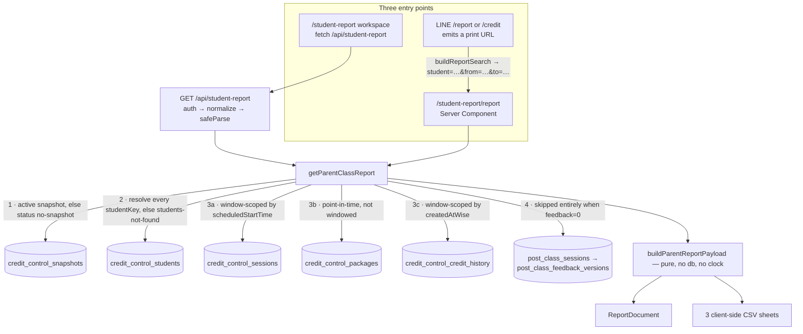

# Parent Class Report

**Status: stable** — the workspace, the A4 print surface, the authenticated API, the three CSV
exports and the LINE `/report` command are all built and unit-tested, and the feature is registered
in the nav as **"Parent Report"** (`src/lib/navigation/tools.ts:177-183`) and in the production
route-surface guard for all three paths
(`docs/reference/production-route-surface.json:189`, `:227-228`). It landed in three commits, all on
`main`: `076c3ed` (2026-08-17, the statement itself), `d812bab` (2026-08-17, ledger backfill plus the
credits-focused layout) and `2607925` (2026-08-28, per-class tutor feedback). Whether it is deployed
to production is a runtime fact the repo cannot attest. There is **no cron, no sync, no feature flag
and no kill switch** — the feature owns no background work of any kind.

## Purpose

The Parent Class Report answers one question for one family: *what did we actually deliver over this
date range, and what credit is left?* An admin picks up to eight students and an inclusive Bangkok
date range, and gets a single statement — every class with its date, time, class name, modality,
teacher, status and credit charge; the tutor's own post-class notes underneath each class; a
per-teacher attendance summary; and the family's package balances as of the last sync.

It exists because three things a parent asks about live in three different places. Attendance and
charges live in the credit-control snapshot; the tutor's written feedback lives in the Post-Class
Feedback tables; package balances live in a third snapshot-scoped table. The report is the join —
and it is a **read-only** one: the loader never writes and never calls Wise
(`src/lib/student-report/db.ts:1-20`).

| Surface | Route | Audience | Renders |
|---|---|---|---|
| Admin workspace | `/student-report` | admin session | setup form + live `ReportDocument` preview + three CSV downloads |
| Print / PDF report | `/student-report/report` | admin session | `ReportDocument` on a portrait A4 sheet |
| LINE `/report` | — | allowlisted admin, staff chat only | a message linking the print surface for a resolved family |

Two of the three ways staff reach it are LINE commands, not the nav. `/report <code>` replies with the
family's print link for a chosen window, and `/credit <code>` appends the same link over a fixed
30-day window (`src/lib/line/report-bot.ts:148-152`, `src/lib/line/credit-bot.ts:359-368`). Both ride
the schedule bot's router; their dispatch and gating are owned by
[LINE Integration § Credit and report command families](./line-integration.md#credit-and-report-command-families)
and [`line-credit-bot.md`](./line-credit-bot.md), and the one gate this feature owns is stated in
[The LINE `/report` command is staff-only and silent](#the-line-report-command-is-staff-only-and-silent-rep-bot-g1).

## Conceptual data model

The feature **owns no table and writes nothing**. Columns, indexes and relationships live in the
reference pages linked below; this section says what each table *means* here.

### Read — the active credit-control snapshot

[`erd-credit-control.md`](../reference/database/erd-credit-control.md) ·
[`index.md`](../reference/database/index.md) · [Credit Control](./credit-control.md)

`getParentClassReport` resolves the single `active` credit-control snapshot first, and every
subsequent query filters on that `snapshotId` before anything else
(`src/lib/student-report/db.ts:103-104`, and `src/lib/credit-control/db.ts:74-83` for the resolver).
The module header states why in blunt terms: `credit_control_sessions` retains every rotated
snapshot, so an unscoped predicate would scan history that is never meant to be queried
(`db.ts:3-8`). No snapshot at all is a distinct, reportable outcome — not an empty report
(`db.ts:104`).

- **`credit_control_students`** — the directory. Every requested `studentKey` must resolve *on that
  snapshot*; the display code and short name are parsed out of the Wise student name
  (`db.ts:107-139`). A single miss fails the whole request with the complete missing list
  (`db.ts:124-125`).
- **`credit_control_sessions`** — the class rows, scoped to the window by `scheduledStartTime` and
  ordered ascending (`db.ts:160-169`). This table is the source rather than the Wise tutor snapshot
  for the same reason [Student Schedule](./student-schedule.md) uses it: its grain is one row per
  (student, session), so it can answer "what did *this child* attend".
- **`credit_control_packages`** — the balances. Deliberately **not** window-scoped
  (`db.ts:184-190`): these are point-in-time figures as of the snapshot, and the document labels them
  that way rather than implying they are as-of the window end
  (`src/components/student-report/report-document.tsx:112-114`).
- **`credit_control_credit_history`** — the billing ledger, scoped to the window by `createdAtWise`
  (`db.ts:207-215`). It serves two jobs: the net-movement line at the foot of each student section,
  and the backfill of classes the snapshot no longer holds. Because a `SESSION`-type charge carries
  its teaching identity and classroom only inside the raw Wise payload, the query reaches into that
  JSON for `userId -> name` and `classroom -> subject` (`db.ts:201-205`).

### Read — tutor feedback, which is not snapshot-versioned

[`erd-post-class-feedback.md` § Evidence collection](../reference/database/erd-post-class-feedback.md#evidence-collection) ·
[Post-Class Feedback](./post-class-feedback.md)

The one query that is *not* snapshot-scoped joins `post_class_sessions` to the row its
`latest_feedback_version_id` points at in `post_class_feedback_versions`, keyed by
`wise_session_id` alone (`db.ts:52-77`). The header explains the exception: the post-class tables are
never rotated, so feedback can be joined by session id — and that is precisely why a class
reconstructed from the billing ledger can still carry its tutor's notes (`db.ts:15-19`).

This is a **read of the latest stored version only**. The report takes no view on whether that
feedback was on time, reviewed, charged or reinstated; none of the Post-Class Feedback policy,
deduction or payout machinery is touched.

### Writes

None. There is no `student_report_*` table, no run ledger and no cache write.

## API surface

Request shape, statuses and the response body are in
[`reference/api/student-schedule-and-report.md § Parent class report`](../reference/api/student-schedule-and-report.md#parent-class-report); this table
carries purpose only.

| Method | Path | Purpose |
|---|---|---|
| `GET` | `/api/student-report` | Build the whole `ParentReportPayload` for 1–8 students over an inclusive Bangkok range — the workspace's only report call (`src/app/api/student-report/route.ts:13-65`). |

The route is a thin shell over the data layer: `auth()` → fold the repeated `student` key →
`safeParse` → try/catch, exactly the repo ladder, with the loader's two typed outcomes mapped to
**503** (no active snapshot) and **404** (students not on the snapshot) rather than a 500
(`route.ts:42-56`).

Two things this feature reaches for that it does not own:

- `GET /api/line/students` — the student typeahead, shared with the LINE tooling so code ranking is
  not reimplemented (`src/components/student-report/student-report-workspace.tsx:160`, `:200-203`;
  [`reference/api/line.md`](../reference/api/line.md)).
- `POST /api/line/webhook` — the only entry point for `/report`, reached through the schedule bot's
  DM and group routers ([LINE Integration](./line-integration.md#api-surface)).

The print surface is **not** an API. `/student-report/report` is a Server Component that calls
`getParentClassReport(getDb(), …)` in process (`src/app/(print)/student-report/report/page.tsx:97-102`),
which is what makes the LINE link work: the recipient's own session renders the page.

## UI

### `/student-report` — the admin workspace

An async Server Component that checks the session and mounts the client workspace behind a Suspense
skeleton (`src/app/(app)/student-report/page.tsx:7-31`). Everything else is client state
(`student-report-workspace.tsx`):

- **Student picker** — a debounced typeahead (200 ms, minimum two characters) against the shared LINE
  student directory, with an `AbortController` per keystroke (`:151-178`).
- **Sibling suggestions** — selecting a student fires a second search on that student's *parent* name
  and offers exact-parent-name matches as "Add sibling" chips, skipping already-selected keys and
  going quiet once the eight-student cap is reached (`:187-234`, `:471-491`). This is what makes a
  family statement one click rather than three searches.
- **Date range** — four presets (This month, Last month, Last 30 days, Last 90 days) computed on the
  Bangkok calendar, plus free `from`/`to` date inputs that clear the active preset
  (`:59-64`, `:93-109`, `:507-556`). The panel says so explicitly: "Dates use the Bangkok calendar"
  (`:502-504`).
- **Include tutor feedback** — a checkbox, default **on** (`:139`, `:564-577`).
- **Generate → preview** — the fetched payload renders through the same `ReportDocument` the print
  page uses, inside a `.begifted` white card (`:705-707`). Changing the selection after generating
  raises a "Selection changed — regenerate to refresh" banner rather than silently showing stale
  numbers (`:364-368`, `:696-703`).
- **Exports** — Classes CSV, Summary CSV, Credits CSV (all client-side) and **Open print view**,
  which opens the print route in a new tab with the *loaded* request's query string, not the current
  form state (`:348-355`, `:644-693`).

### `/student-report/report` — the print / A4 PDF surface

A bare `(print)` route with no app shell, mirroring the learning-plan report (`page.tsx:1-8`). It
reuses that feature's `PrintToolbar` (with its own `backHref`/`backLabel`) and renders the document on
a 210 mm sheet (`:127-131`). Portrait A4 comes from the app-wide default `@page` declared in
`learning-plans.css`, which is why this feature's stylesheet needs almost nothing of its own
(`src/app/student-report.css:1-10`; see [Learning Plans](./learning-plans.md)). The page is
`robots: { index: false, follow: false }` and titles itself with the date range
(`page.tsx:27-46`).

Its stated design rule is that **a statement must never print as a silently empty sheet**
(`page.tsx:6-7`): a malformed link, a missing snapshot and unresolved students each render a visible
`ErrorCard` with a route back to the workspace (`:86-123`).

### The document components

`ReportDocument` (`src/components/student-report/report-document.tsx`) is the single presentational
root shared by preview and print — logo header with the window label and "Data as of" line
(`:36-56`), an optional data-range warning (`:58-67`), then one section per student that
page-breaks before every student after the first (`:79`): a **Credits used** stat tile, the class
table, the by-teacher summary, package balances headed "as of {snapshot time}", and a
credit-ledger movement line (`:92-122`). The footer carries the generation time and an
eight-character snapshot prefix (`:127-131`).

`report-tables.tsx` holds the four table primitives. Two details there are load-bearing rather than
cosmetic: row striping is **index-based, not `nth-child`**, so a class row and its feedback sub-row
share one stripe (`:142-146`), and the feedback sub-row spans all seven columns
(`:70`). The single CSS rule the feature adds pairs with that — `tr[data-feedback-parent]` gets
`break-after: avoid-page`, and the attribute is set only on class rows a feedback row actually
follows, so it stays inert for the learning-plan report that shares `.report-root`
(`src/app/student-report.css:18-23`, `report-tables.tsx:151`).

## Data flow

Steps 3a–3c run in one `Promise.all`; the feedback lookup is a second round trip because its id set
is the union of snapshot session ids and ledger class candidates
(`src/lib/student-report/db.ts:144-249`). Everything after that is pure: `buildParentReportPayload`
reads no database and no clock — the generation instant is passed in
(`src/lib/student-report/build.ts:347-357`), which is what makes the builder's 21 unit cases possible.

## Business rules & edge cases

### The window is an inclusive Bangkok range resolved to half-open UTC

`resolveReportWindow` turns `from`/`to` date keys into `[startUtc, endUtc)` where the end is
**midnight at the start of the day after `to`** (`window.ts:50-61`). Both the session and the ledger
predicates use `gte(start)` + `lt(end)` (`db.ts:165-166`, `:212-213`), so a single-day report is
exactly 24 hours and no session is double-counted at a boundary. The human label adapts: one date
with its year for a single day, a year-less start when both ends share a year, both years otherwise
(`window.ts:33-44`).

### Snapshot bounds are borrowed from Credit Control, and exceeding them warns rather than lies

The report has no window of its own — it inherits the credit-control sync's retention, taking
`PAST_WINDOW_DAYS` (120) and `FUTURE_WINDOW_DAYS` (180) as the floor and ceiling around the
snapshot's `generatedAt` (`window.ts:63-73`; `src/lib/credit-control/sync.ts:61`, `:63`).
`windowWarnings` flags each side independently (`window.ts:76-84`), and the document renders the
banner only when one is set, naming the range that *is* fully covered
(`report-document.tsx:58-67`).

### Classes the snapshot no longer holds are rebuilt from the billing ledger

A `SESSION`-type credit-history entry's Wise id **is** the session id, so any in-window charge whose
id is absent from the session set stands for a class the snapshot cannot show — pre-floor, or deleted
in Wise (`build.ts:366-392`). Only *placeable, non-cancelled* `SESSION` charges qualify; cancellations
are skipped because in-window ones already appear as snapshot rows and pre-floor ones carry no balance
information (`build.ts:170-182`). Reconstructed rows are honest about what they lost: the class label
falls back to the raw classroom subject then the package subject, the modality is fail-closed
`unknown`, the timestamp is the **charge** time flagged `timeApproximate`, and the row renders with a
dagger plus a footnote saying so (`build.ts:184-223`; `report-tables.tsx:158`, `:198-203`). Snapshot
and ledger rows are merged into one chronological list, not two tables (`build.ts:393-395`).

### Unknown statuses stay verbatim; nothing is folded into a known bucket

`classifySession` tests cancellation first — both Wise spellings, single and double L, case-insensitive
(`build.ts:24-25`, `:97`) — then `future` → `upcoming`, then `ENDED` splitting on whether credit was
applied, and anything else becomes the literal string `other:<verbatim status>`, or `other:(blank)`
when the status is empty (`build.ts:91-103`). Those unknown buckets survive into the totals: known
buckets print in a fixed order and every other bucket follows alphabetically
(`build.ts:225-268`), rendered with a neutral outlined chip rather than being coerced into a colour
that implies a meaning (`report-tables.tsx:41-42`).

### A missing teacher renders "Teacher TBC" — never blank, never inferred

`session.teacherName?.trim() || TEACHER_TBC` gives the literal string **"Teacher TBC"**
(`build.ts:158`; `src/lib/student-schedule/types.ts:10`), and ledger rows do the same against the raw
Wise `userId -> name`, which is `NULL` whenever Wise sent a bare id string rather than an expanded
reference (`build.ts:209`; `db.ts:201-205`). The consequence is deliberate and visible: the by-teacher
summary carries a "Teacher TBC" line with real session and credit counts, rather than dropping those
classes out of the totals.

### Tutor feedback is opt-out, and an empty record is not a feedback block

`feedback=1` is the default, so every URL written before feedback existed still means "with feedback";
`feedback=0` is the only value that turns it off, and `buildReportSearch` emits that parameter *only*
when it is explicitly off, keeping default-on URLs byte-identical to the pre-feedback ones
(`params.ts:9-11`, `:35-51`). When it is off, the loader skips the feedback query **entirely** — no
feedback text ever enters the payload, rather than being fetched and hidden (`db.ts:244-249`).

Presentation is equally conservative. Each field is trimmed at the edges while interior newlines are
kept (they are meaningful, and render `whitespace-pre-wrap`), and a record whose four fields are all
blank collapses to `null` so the report never draws an empty feedback block
(`build.ts:105-127`; `report-tables.tsx:75`). Individual blank fields are skipped rather than printed
with an empty value (`report-tables.tsx:71-83`). The `improvement` field is labelled **"Needs work"**
everywhere it appears — document and CSV alike (`report-tables.tsx:57`, `csv.ts:26`).

### The document shows one summary dimension; the CSV shows four

`summarizeAttended` computes **class, teacher, month and modality** summaries over attended rows only,
each sorted by session count descending then key ascending (`build.ts:271-318`). The printed document
renders only the teacher dimension (`report-document.tsx:70-72`, `:104-109`); class, month and modality
reach a human exclusively through the Summary CSV (`csv.ts:99-121`).

### The ledger line counts every movement, not just classes

The per-student `ledger` aggregate sums **all** window-scoped credit-history entries and their net
credit — top-ups and cancellations included, not just the `SESSION` charges that became rows
(`build.ts:404-409`), and prints as "N credit-ledger entries in this period · net ±X credits"
(`report-document.tsx:118-122`).

### CSV export

Three sheets, all built in the browser from the already-loaded payload, using the sales-dashboard
serializer (see [Sales Dashboard](./sales-dashboard.md)): every field quoted, embedded quotes doubled,
CRLF line endings and a UTF-8 BOM so Excel opens Thai names correctly
(`src/lib/sales-dashboard/csv.ts:19`, `:27-32`). Filenames are
`begifted-class-report-{classes|summary|credits}-{from}-to-{to}.csv`, passed through
`sanitizeCsvFilename` (`csv.ts:143-151`). Rows are flattened in payload order and labelled by the
student's bracketed code, falling back to the full Wise name when there is none (`csv.ts:82-93`).

Worth knowing before sharing a file: the **Classes CSV carries the full tutor feedback text** in four
columns — Topics, Performance, Needs work, Homework — plus a `Feedback` yes/no flag and the Wise
session id (`csv.ts:23-30`). The Credits CSV rounds to two decimals and substitutes `(none)` for a
blank subject or class type (`csv.ts:124-140`).

### Package balances are point-in-time, and fractional ones are explained

Balances are as of the snapshot, not the window end, and the heading says so
(`report-document.tsx:112-114`). When any balance is not a whole 0.5-credit step after 2 dp rounding,
a footnote appears attributing it to pro-rated top-ups recorded in Wise, since per-class charges are
always 0.5 steps (`report-tables.tsx:263-273`, `:342-347`). Package rows carry their
`excludedReason` inline when Credit Control excluded them (`report-tables.tsx:315-319`).

### Students keep their requested order, and an empty student still gets a section

Duplicate keys are collapsed once at the loader (`db.ts:106`) and the requested order is preserved
through resolution and assembly (`db.ts:127`, `build.ts:359`). A student with no rows in the window
still renders a section with an explicit "No rows in this period." state rather than vanishing
(`build.ts:397-410`, `report-tables.tsx:46-48`). Sessions are additionally de-duplicated by Wise
session id and sorted chronologically before assembly (`build.ts:320-333`).

### Access: one nav-registered page, two paths, one grant

`/student-report` is an ordinary authenticated page — no capability token, no public route. It is
absent from the middleware public allowlist (`src/middleware.ts:10-25`), so the session check applies,
and a restricted user granted `/student-report` in `allowedPages` reaches the print sub-path and the
API namespace through the same entry, because the matcher covers `${page}/` and `/api${page}`
(`src/middleware.ts:59-65`). Both page surfaces additionally re-check `auth()` in their own Server
Component and redirect to `/login`
(`src/app/(app)/student-report/page.tsx:8-9`, `src/app/(print)/student-report/report/page.tsx:80-81`).

### The LINE `/report` command is staff-only and silent (REP-BOT-G1)

`handleReportCommand` inherits two gates and adds one. The routers dispatch to it only *after* their
own admin gate has passed — SCHED-BOT-01 in a DM (`src/lib/line/schedule-bot.ts:277-287`) and
GRP-BOT-02 in a group (`src/lib/line/schedule-bot-group.ts:344-348`, `:367-377`) — so a non-admin
sender gets no reply and no evidence the command exists.

**REP-BOT-G1** is this feature's own gate, and it is the verbatim mirror of the credit bot's
CRED-BOT-G1: in a group, *every* `/report` use requires the chat's stored audience to be exactly
`"staff"`, read raw (`src/lib/line/report-bot.ts:11-17`, `:112-114`; the reader is
`rawStaffGroup`, `src/lib/line/credit-bot.ts:108-121`). A missing settings row, a `"family"` audience
or any unexpected value produces **no reply at all — the help text included**. The reasoning is in the
header: the reply names every family member, so even the help must never appear where a parent can
read it (`report-bot.ts:14-16`). The linked page is auth-gated anyway and redirects to `/login`, so
the URL itself is safe to send; the gate protects the *reply text*, not the page
(`report-bot.ts:18-19`).

The grammar is three forms — `/report <code>` (trailing 30 days, matching `/credit`'s link and the
workspace's default preset), `/report <code> <days>` bounded 1–365, and
`/report <code> <from> <to>` (`report-bot.ts:38-42`, `:75-91`;
`src/lib/line/schedule-bot-copy.ts:568-572`). Impossible calendar dates are refused rather than
silently shifted: a date is real exactly when it survives an `addBangkokDays(d, 0)` round trip, so
`2026-02-31` is rejected instead of becoming 3 March (`report-bot.ts:68-74`, `:82-83`). All of that
is validated **before any database read**. Family resolution is shared with `/credit`, and its two
failure modes — no active snapshot, and a code that is not an exact match — each get their own copy
rather than a guess (`report-bot.ts:135-143`). The emitted link caps at `REPORT_MAX_STUDENTS` and the
reply says how many members were dropped (`report-bot.ts:145-161`; `schedule-bot-copy.ts:622-624`),
and it never passes `includeFeedback`, so the linked report opens with feedback on
(`report-bot.ts:148-152`).

## Tests

Run with `npm test` (the `unit` Vitest project). Tests sit in sibling `__tests__/` directories; there
are six files dedicated to this feature plus two shared LINE suites.

- **`src/lib/student-report/__tests__/build.test.ts`** (21 cases) — `classifySession` (both
  cancellation spellings before the future check, the ENDED credit split, unknown and blank statuses
  fail-closed); `buildClassRow` (TEACHER_TBC for null *and* whitespace-only teachers, modality
  derivation, a Bangkok midnight rollover); `normalizeReportFeedback` (per-field trimming with
  interior newlines kept, all-blank and undefined collapsing to null, a single non-blank field
  surviving); `collectFeedbackWiseSessionIds`; `summarizeBuckets` ordering and rounding;
  `summarizeAttended` (attended-only, sessions-then-key sort); `isLedgerClassCandidate` and
  `buildLedgerClassRow`; and `buildParentReportPayload` end to end — dedupe by session id, requested
  student order with empty sections, combined totals and bound warnings, ledger backfill of a class
  the snapshot lost, ledger labelling from the package pair, and feedback attaching to snapshot *and*
  ledger rows by id while an empty map leaves every row null.
- **`src/lib/student-report/__tests__/window.test.ts`** — the half-open boundary, a single day being
  exactly 24 hours, all three label shapes, the floor/ceiling derivation from a fixed snapshot
  instant, and a four-way `it.each` over the warning combinations.
- **`src/lib/student-report/__tests__/params.test.ts`** (10 cases) — the single-vs-repeated `student`
  fold, the eight-student ceiling, non-padded dates, inverted ranges, the feedback default, and
  `buildReportSearch` round-tripping encoded keys while keeping default-on URLs byte-identical.
- **`src/lib/student-report/__tests__/csv.test.ts`** (7 cases) — the exact header row of all three
  sheets, one row per class relying on the shared serializer for quoting, status totals plus every
  attended summary line, rounded package rows with their `(none)` fallbacks, and the sanitized
  filename.
- **`src/components/student-report/__tests__/report-document.test.tsx`** (13 cases,
  `renderToStaticMarkup`) — the warning banner appearing only with a warning set, the ledger dagger
  with its banner sentence and footnote, the fractional-balance footnote, verbatim unknown statuses
  and unresolved teachers, two students with an explicit empty state, the point-in-time balance
  heading, exactly one stat card per student, teacher-only summarising, no minutes column, one
  feedback sub-row per feedback-bearing row with blank fields skipped, none at all when every row's
  feedback is null, and feedback on a ledger row alongside its dagger.
- **`src/app/api/student-report/__tests__/route.test.ts`** (11 cases) — the full 401 / 400 / 404 / 503
  / 200 / 500 ladder with the loader mocked, including more-than-eight students, an unrecognized
  `feedback` value, repeated `student` params forwarded in order, and `feedback=0` arriving as
  `includeFeedback: false`.
- **`src/lib/line/__tests__/report-bot.test.ts`** — organised as three describes: admin-gate
  inheritance (a non-admin `/report` looks *nothing* up in a DM and gets no reply at all in a group),
  the DM link path (sibling fan-out, the trailing-30-day default, an explicit range, candidate listing
  instead of guessing, no snapshot, a blank parent name, the eight-student cap with its dropped count,
  and help), and REP-BOT-G1 — where even a bare `/report help` is silent outside a staff chat while a
  staff chat gets both the link and the help.
- **`src/lib/line/__tests__/schedule-bot-copy.test.ts`** pins the reply wording, and
  `src/lib/navigation/__tests__/tools.test.ts:26-34` pins `/student-report`'s position in the Student
  Lifecycle section.

No test renders `src/app/(app)/student-report/page.tsx`, the `(print)` report page or
`StudentReportWorkspace`; their behaviour is covered through `ReportDocument`, the route handler and
the pure builder.

## Open questions

- **`combined.bucketTotals` is computed and never consumed.** `buildParentReportPayload` summarizes
  every student's rows together into `payload.combined` (`build.ts:433`), and nothing reads it —
  `ReportDocument` iterates `payload.students`, and all three CSV flatteners are per-student
  (`csv.ts:88-140`). Was a family-wide totals block intended for the header, or should the field go?
- **`ReportStudent.shortName` and `activated` are resolved and never rendered.** Both are selected and
  parsed at the loader (`db.ts:113`, `:135-137`) and appear nowhere in the document or the CSVs. Is a
  deactivated-student marker planned?
- **`meetingStatus` rides on every row but surfaces nowhere.** The verbatim Wise status is carried on
  `ReportClassRow` (`types.ts:34`) yet is absent from the document (which shows the derived bucket) and
  from `CLASSES_CSV_COLUMNS`. For a known status the bucket already encodes it; for an unknown one the
  bucket embeds it as `other:<status>` — so is the field simply redundant?
- **The out-of-range banner assumes the *floor* side.** It fires on `floorWarning || ceilingWarning`
  but its ledger sentence reads "Earlier classes are reconstructed from the billing ledger"
  (`report-document.tsx:58-66`). A window that only over-runs the ceiling and happens to contain ledger
  rows gets copy about earlier classes. Should the two warnings carry separate sentences?
- **Class, month and modality summaries never reach the printed page.** All four dimensions are
  computed (`build.ts:271-279`) and only teacher is rendered (`report-document.tsx:104-109`). Is
  CSV-only deliberate, or is a second table pending?
- **The workspace keeps the previous preview after a 404 or an error.** `setPayload` is never cleared
  on the not-found or error branches (`student-report-workspace.tsx:311-337`), so an old statement
  stays on screen beneath the red banner. The "Selection changed — regenerate" notice usually appears
  alongside it, which softens this — but is the old preview meant to persist?
- **Eight is the cap in three places at once.** `REPORT_MAX_STUDENTS` bounds the schema, the picker and
  the LINE link, and the LINE reply tells staff how many family members were dropped
  (`params.ts:3`; `report-bot.ts:145-147`). Is eight a real ceiling on family size, or a print-layout
  limit that should move?
- **Ledger rows inherit `durationMinutes` from the charge.** If Wise records a zero or absent duration
  on a credit-history row, that class contributes 0 hours to the summaries while still contributing a
  session and its credit (`build.ts:206`, `:296-299`). Does the ledger always carry a duration?
- **The feature has no cache.** Both surfaces query Postgres on every generate — no `"use cache"`, no
  `cacheTag` (unlike the `src/lib/data/*` helpers). Fine at admin volume; worth revisiting if the LINE
  link ever gets shared widely.
- **`OPEN-QUESTIONS.md` C-1 and C-6 should now close.** Both record that `docs/features/student-report.md`
  does not exist and that `reference/api/index.md` contradicts `misc.md` about whether the endpoint is
  documented ([`OPEN-QUESTIONS.md`](../OPEN-QUESTIONS.md)). This page settles the first; the
  `api/index.md` group table still omits `student-report` and needs a regen pass.

_Verified against main@0cd1e81 (clean tree) on 2026-09-02._
