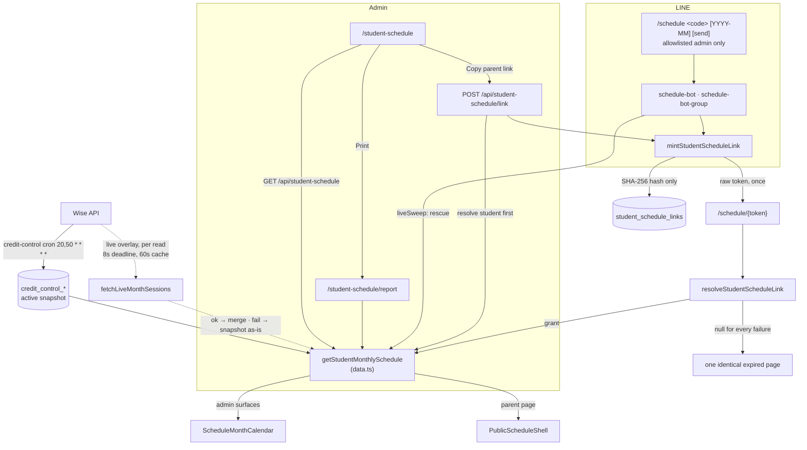

# Student Schedule

**Status: stable** — all three render surfaces, both minting paths and the LINE delivery bot are
built and unit-tested, and the feature landed on `main` in `2a17065` (2026-08-05); whether that is
deployed to production is a runtime fact the repo cannot attest. The last commit touching a
student-schedule-only file is `076c3ed` (2026-08-17), which gave the print report its
`backHref="/student-schedule"` back link; the bot files this feature shares with the LINE credit and
report bots changed later still (`b9c0e19` 2026-08-17, `9bc2b43` 2026-08-19, `8148ac9` 2026-08-29).
The one runtime switch is an *opt-out*: `ENABLE_STUDENT_SCHEDULE_LIVE="false"` turns
off the live Wise overlay and every surface falls back to the snapshot
(`src/lib/student-schedule/live.ts:66-68`). There is no sync, no cron and no feature flag that has
to be turned *on*.

## Purpose

Student Schedule answers one question for one child: *which classes does this student have this
month?* An admin looks a student up by nickname code or name, pages through months, and then either
prints the month as an A4 PDF or hands the parent a link
(`src/components/student-schedule/student-schedule-workspace.tsx:6-10`).
The parent opens that link on their phone — no account, no login, no app
(`src/app/schedule/[token]/page.tsx:2-5`) — and sees the same classes the admin previewed, because
one presentational component renders the same payload on every surface
(`src/components/student-schedule/schedule-month-calendar.tsx:4-8`).

One payload, `StudentSchedulePayload`, feeds every surface. Every display string in it — the Bangkok
calendar day, `HH:mm` labels, the month label — is precomputed on the server so no client ever
re-derives a time from an instant (`src/lib/student-schedule/types.ts:1-7`, `:19-60`).

| Surface | Route | Audience | Renders |
|---|---|---|---|
| Admin workspace | `/student-schedule` | admin session | `ScheduleMonthCalendar` |
| Print / PDF report | `/student-schedule/report` | admin session | `ScheduleMonthCalendar`, landscape A4 |
| Public parent page | `/schedule/{token}` | capability token only | `ParentScheduleAgenda` (phone) · `ScheduleMonthCalendar` (desktop) · `ParentScheduleMiniCalendar` (phone calendar view) |

Delivery has two routes. **Copy parent link** on the workspace mints a token and puts the URL on
the clipboard, for staff to paste wherever they already talk to the family
(`student-schedule-workspace.tsx:131-150`). The **LINE schedule bot** lets an allowlisted admin type
`/schedule <code> [YYYY-MM] [send]` inside LINE — in a 1:1 chat with the Official Account, where the
link comes back to the admin and `send` can push it to a verified parent, or in a group the OA
belongs to, where the link is posted into that same group
(`src/lib/line/schedule-bot-command.ts:21`, `:39`). The bot's gate rules are owned by
[LINE Integration § Schedule bot](./line-integration.md#schedule-bot); this page states only what
the schedule feature itself relies on.

The feature **owns no sync**. Its base rows come from the *active credit-control snapshot*
(`src/lib/student-schedule/data.ts:4-8`), and a **live Wise overlay** corrects them at read time
(`src/lib/student-schedule/live.ts:1-14`). Nothing it fetches from Wise is ever persisted.

## Conceptual data model

Columns, indexes and relationships live in the reference pages linked below; this section says what
each table *means* to this feature.

### Read — the credit-control lineage

[`erd-credit-control.md`](../reference/database/erd-credit-control.md) ·
[Credit Control](./credit-control.md)

`getStudentMonthlySchedule` resolves the single `active` credit-control snapshot, looks the student
up **inside that snapshot**, and reads that snapshot's session rows for the month
(`src/lib/student-schedule/data.ts:322-368`). `credit_control_sessions` is the source rather than
the Wise tutor snapshot because of its grain: one row per (student, session), carrying the student
key, the subject and the package (`src/lib/db/schema.ts:1222-1262`) — the tutor snapshot's session
blocks are keyed by identity group, not by student, and cannot answer "what does *this child* have
this month". The **snapshot's** window is whatever the credit-control sync covers: past 120 /
future 180 days (`src/lib/credit-control/sync.ts:61`, `:63`). A month outside that window
contributes no snapshot rows — but it is not necessarily empty: with the live overlay on (the
default for the parent page, the admin API and the report) the sweep goes straight to Wise for the
requested month and synthesizes live-only rows, so the month is populated from Wise whenever the
overlay runs and succeeds. It renders empty only when the overlay is disabled, fails, or the caller
asked for `"never"` (see [The read path](#the-read-path)).

Two schema additions — four columns across two migrations — widened that table for this feature.
Column names, types and nullability are in
[`erd-credit-control.md`](../reference/database/erd-credit-control.md); what they *mean* here:

- **A teacher identity trio** (`drizzle/0063_student_schedule_links.sql`; `schema.ts:1243-1248`).
  Wise reports the owning teacher on this session feed, but `WiseCreditSessionSchema` did not
  declare the fields, so nothing read them; `2a17065` named them and added `creditSessionTeacher`,
  which accepts both shapes Wise uses (a bare id string or an expanded `{_id, name}` reference) and
  normalizes blanks to `null` (`src/lib/credit-control/wise.ts:24-33`, `:49-51`, `:131-144`; written
  at `sync.ts:437`, `:461-463`). A `null` teacher renders the literal **"Teacher TBC"** — never
  dropped, never inferred from the class or package name (`types.ts:9-10`; `data.ts:198`). The
  `2a17065` diff adds only optional Zod fields and a normalizer, no new fetch, so the sync issues no
  extra Wise request for them; whether Wise in fact populates them on every session is a runtime
  property of the Wise API the repo cannot attest — hence the TBC fallback.
- **The session title** (`drizzle/0066_credit_control_session_title.sql`, commit `659aa7f`;
  `schema.ts:1233-1235`; written at `sync.ts:455`). The Wise session title ("In-Person
  Session-Biology HL") is the only field that names the class: at BeGifted `subject` holds level
  bands ("Y12-13 / G11-12 (Int.)") and `packageName` is the classroom, which is the student's own
  name (`data.ts:78-85`). It drives both the parent-facing class label (`deriveDisplaySubject`) and
  the modality (`deriveSessionModality`) — see [Business rules](#business-rules--edge-cases).

The bot's student directory is the same snapshot: `searchCurrentLineStudentsWithSnapshot` resolves
the active snapshot and searches its students (`src/lib/line/student-links.ts:653-662`), and hands
the snapshot back so the schedule read can skip its own two lookups (`data.ts:299-307`, `:322`,
`:330`).

### Read — live Wise overlay (not a table)

`fetchLiveMonthSessions` sweeps the requested Bangkok month straight from Wise, scoped to one
student, so a reschedule, cancellation or brand-new class is visible on the next read rather than
the next sync (`live.ts:1-9`). The successful, already-student-filtered result is memoized for 60 s
on a `globalThis`-anchored `Map` keyed `wiseStudentId:monthKey` (`live.ts:28`, `:37-46`, `:117-127`,
`:151`); the institute-wide sweep is never cached, so one student's sessions can never leak into
another's request. The map is pruned of expired entries once it passes 500 entries (`live.ts:30`,
`:54-59`). Nothing here is written to Postgres.

### Write — capability tokens

[`erd-core.md` § 9](../reference/database/erd-core.md) ·
[`index.md`](../reference/database/index.md)

`student_schedule_links` is the feature's only owned table (`schema.ts:4635-4656`): one row per
issued parent link, granting read of exactly one `(student_key, month_key)` pair, expiring and
revocable, carrying provenance (admin email or LINE user id) and delivery (a LINE user id *or* a
group id), plus a view count. **Only the SHA-256 hash of the token is stored**
(`src/lib/student-schedule/links.ts:8-9`, `:98`). It has no foreign keys — the student columns are
soft references into Wise.

### Write — LINE bot state

[`erd-line.md`](../reference/database/erd-line.md) ·
[LINE Integration § Conceptual data model](./line-integration.md#conceptual-data-model)

Three tables are written only by the bot and are documented on the LINE page; what matters here:

- `line_schedule_bot_pending` (`schema.ts:4668-4686`) — the outstanding "reply YES" question, one
  row per (admin, conversation). It is the **only** thing a YES acts on; a missing or expired row
  sends nothing.
- `line_group_settings` (`schema.ts:4700-4722`) — a chat's declared `family`/`staff` audience and
  its `skip_confirm` instant-mode flag (`drizzle/0064_line_group_settings.sql`,
  `0065_line_group_settings_skip_confirm.sql`). Audience selects wording only.
- `line_group_schedule_sends` (`schema.ts:4760-4772`) — every link posted into a group; doubles as
  the "has this chat already received this student?" lookup. Its `link_id` is a **real foreign key**
  to `student_schedule_links`, nullable and `ON DELETE SET NULL`, so pruning a link keeps the send
  record (`schema.ts:4767`; `drizzle/0063_student_schedule_links.sql:50`). This is the one relational
  edge the feature has — the student columns elsewhere are genuinely FK-free.

The DM `send` path additionally **reads** `line_contact_student_links` + `line_contacts` to find a
verified recipient (`src/lib/line/schedule-bot.ts:143-174`) and **writes** a mirror of the delivered
message into `line_messages` on a best-effort basis (`:584-616`).

There is no snapshot lineage, no `*_sync_runs` ledger and no `vercel.json` entry for this feature
(all 19 cron paths in `vercel.json` belong to other subsystems). Baseline freshness is inherited
from the credit-control sync; the live overlay corrects it at read time.

## API surface

Request/response shapes, status codes and error bodies are in
[`reference/api/student-schedule-and-report.md § Student monthly schedule`](../reference/api/student-schedule-and-report.md#student-monthly-schedule); this table
carries purpose only.

| Method | Path | Purpose |
|---|---|---|
| `GET` | `/api/student-schedule` | Read one student's Bangkok-month payload — the workspace's only data call (`src/app/api/student-schedule/route.ts`). |
| `POST` | `/api/student-schedule/link` | Mint the parent-facing `/schedule/{token}` link for a student-month (`src/app/api/student-schedule/link/route.ts`). |

Both gate on `auth()` in-handler on top of the middleware session check (`route.ts:14-17`,
`link/route.ts:23-26`), follow the repo's auth → parse → `safeParse` → try/catch ladder, and answer
`404` when the student does not resolve on the active snapshot (`route.ts:35-37`,
`link/route.ts:51-53`).

Two endpoints owned by other features are part of the working surface:

- `GET /api/line/students` — the student directory the workspace searches (typeahead, minimum two
  characters), so code ranking is shared with the LINE tooling rather than reimplemented
  (`student-schedule-workspace.tsx:73`; [`reference/api/line.md`](../reference/api/line.md)).
- `POST /api/line/webhook` — the bot's only entry point. DM text reaches `handleScheduleBotCommand`
  through `processLineMessageForScheduler` *before* the classifier
  (`src/lib/line/review-service.ts:136-148`); group text is collected as a transient
  `LineGroupCommand` and dispatched to `handleScheduleBotGroupCommand` in an `after()` job
  (`src/lib/line/data.ts:38-54`, `:441-461`; `src/lib/line/webhook.ts:52-53`;
  `src/app/api/line/webhook/route.ts:32-43`).

The public parent page is **not** an API: `/schedule/{token}` is a Server Component that resolves
the token and reads the schedule in-process.

## UI

### `/student-schedule` — admin workspace

`src/app/(app)/student-schedule/page.tsx` re-checks the session, redirects to `/login` without one,
and renders the client shell inside `<Suspense>` (`:7-18`). Nav registration is
`src/lib/navigation/tools.ts:170-176` (Student Lifecycle section, no count badge).

`StudentScheduleWorkspace` (`src/components/student-schedule/student-schedule-workspace.tsx`) does
the whole job on one screen: a debounced student search (200 ms, minimum two characters, an
`AbortController` per keystroke — `:65-84`), a month strip with prev / next / "This month"
(`:200-228`), **Copy parent link** (`:131-150`, button `:231-234`) and **Print / Save PDF**, which
opens the report in a new tab (`:122-129`, button `:235-238`). The calendar is `ScheduleMonthCalendar`
with today's Bangkok date passed in for the today ring (`:257`).

There is deliberately **no "send to parent" button**: pushing to a family runs through the bot's
confirm gate so a wrong student cannot be pushed with one click (`:12-14`).

### `/student-schedule/report` — print / PDF

`src/app/(print)/student-schedule/report/page.tsx` is the printable sheet: same session check
(`:80-81`), Zod-validated `studentKey` + `month` query (`:26-29`), `robots: noindex/nofollow`
(`:24`), an A4 sheet wrapper and the shared `PrintToolbar` whose back link points at
`/student-schedule` (`:98`; `src/components/learning-plan/print-toolbar.tsx:8-13`). It lives in the
`(print)` route group, which has no layout of its own, so it renders without `AppNav` — but its URL
stays under the `/student-schedule` namespace, which keeps it inside a restricted user's
`allowedPages` prefix (`src/middleware.ts:59-66`).

Print rules are in `src/app/student-schedule.css` (imported by `globals.css:6`): a **named**
`@page schedule-landscape` so this report prints landscape without flipping the app's other
printable pages, which share a global portrait `@page` (`:1-19`); a reset of the fixed-height
`overflow-hidden` body (`:21-39`); `break-inside: avoid` on day cells, session blocks and week rows
so a class is never split across sheets (`:55-63`); and a print-time swap that forces the month grid
on and the mobile week list off (`:65-72`). The report renders the calendar **without `todayKey`**
(`report/page.tsx:115`), so a printed month carries no today marker even when the preview does.

### `/schedule/{token}` — public parent page

`src/app/schedule/[token]/page.tsx` sits outside every route group and is the only page in the app
that renders student data without a session (`:1-3`). It is built for LINE's in-app browser:
`robots: noindex/nofollow` (`:44-47`), a per-route `viewport` with `viewportFit: "cover"` so
safe-area insets apply on notched phones (`:51-56`), Sarabun via the `font-thai` token
(`src/app/globals.css:17`; `src/app/layout.tsx:31-32`), and a page root that **owns its own
scrolling** because the root layout's body is a fixed-height `overflow-hidden` flex shell
(`layout.tsx:61`; page comment `:15-20`). The Suspense fallback is a skeleton mirroring the loaded
layout rather than a blank screen, because the live Wise merge runs before first byte and is allowed
up to an 8-second deadline (`live.ts:27`) — how long it actually takes is not something the repo
measures (`:76-98`).

Resolution and rendering (`:100-177`): the token is resolved; **any** failure renders
`ExpiredNotice` (`:104-106`); a grant whose student no longer resolves renders the same notice
(`:108-112`); a zero-session month renders a bilingual empty card with no view toggle
(`:117-146`); otherwise `PublicScheduleShell` composes the page. The heading uses the student's
**nickname**, never the legal name (`:114`, `:159`).

`PublicScheduleShell` (`src/components/student-schedule/public-schedule-shell.tsx`) owns the scroll
region, the sticky Thai-first header with a session-count badge, and the **agenda ⇄ calendar
toggle**:

- **Screen-size-aware, JS-free defaults.** View state starts `null` (= auto), rendered as responsive
  class pairs from `resolveViewContainerClasses`, so the SSR HTML alone selects the agenda below
  `lg` and the calendar at `lg`+ — no hydration flash, and resizes keep working through CSS
  (`public-schedule-shell.tsx:7-12`, `:97-99`;
  `schedule-view-preference.ts:59-90`).
- **Two calendar shapes.** At `lg`+ the calendar view is `ScheduleMonthCalendar`'s month grid in a
  `max-w-5xl` column; below `lg` it is `ParentScheduleMiniCalendar` — one micro chip per session
  (truncated subject on that subject's colour tint), Thai weekday initials, and a `+N` marker past
  three chips (`parent-schedule-mini-calendar.tsx:31`, `:64-95`). Tapping a day returns to the
  agenda scrolled to that day via its `data-date`; taps are navigation and never write the
  preference (`public-schedule-shell.tsx:109-113`, `:159-166`).
- **Explicit choices persist** in `localStorage["bgscheduler.schedule.view"]`, read once in a mount
  effect with try/catch and garbage failing closed to auto (`schedule-view-preference.ts:15`,
  `:21-48`; `public-schedule-shell.tsx:65-81`).
- **Scroll-to-today** is a pending-scroll effect that runs after the commit that revealed the
  agenda, because `scrollIntoView` on a `display:none` subtree is a no-op (`:16-18`, `:83-95`).

### Shared components

**`ScheduleMonthCalendar`** (`schedule-month-calendar.tsx`) is presentational — no fetching, no
clock, not `"use client"` — so the workspace, the report and the parent page's desktop view render
exactly the same markup for the same payload (`:3-8`). It draws the Monday-start 6×7 grid at `lg`+
and a week-grouped list below (`:161-232`), colours blocks by **subject** from a six-colour palette
assigned by order of first appearance (`:37-64`), shows the modality as an icon only (`:107-111`),
and renders an explicit empty state instead of a blank grid (`:135-147`). Grid maths comes from
`src/lib/calendar/month-grid.ts`, shared with the admissions calendar (`month-grid.ts:1-12`).

**`ParentScheduleAgenda`** (`parent-schedule-agenda.tsx`) is the phone-first parent view: one
section per day that *has* sessions, headed by the Thai weekday and day number
(`formatThaiDayHeading`), each session a card with time range, subject, teacher, duration and a
modality badge (`:55-108`). With `todayKey` it badges today, dims past days (visual only — never
dropped) and anchors `id="agenda-scroll-target"` on the first day at or after today (`:110-122`,
`:133-135`, `:141-153`). It is a separate component rather than a third branch of the calendar
because the calendar's class names are load-bearing for the print CSS (`:7-16`).

**`modalityDisplay`** (`modality-display.ts:22-33`) maps `online` → video icon + "ออนไลน์" and
`onsite` → pin icon + "ที่สถาบัน"; `unknown` returns `null` and callers render nothing — a parent
document stays silent about what it cannot explain (`:6-9`).

### How the surfaces differ

| | Component | `todayKey` | Empty month |
|---|---|---|---|
| Workspace | `ScheduleMonthCalendar` | passed (`workspace.tsx:257`) | calendar's English empty state |
| Report | `ScheduleMonthCalendar` | **omitted** (`report/page.tsx:115`) | calendar's English empty state |
| Parent page | agenda + grid + mini calendar | passed to all three (`[token]/page.tsx:115`, `:167-168`) | bilingual `PUBLIC_PAGE_COPY.emptyMonth` card, no toggle (`:117-146`) |

One print nuance follows from the classes: in auto view, the parent page prints whatever **paper**
width selects, not screen width — the agenda wrapper is `lg:hidden` and portrait A4 is below `lg`,
so a desktop screen showing the grid still prints the agenda unless the paper is landscape. A forced
calendar always prints the month grid (`print:block` on the grid wrapper, `print:hidden` on the mini
calendar — `public-schedule-shell.tsx:155-166`).

## Data flow

### The read path

`getStudentMonthlySchedule(db, { studentKey, monthKey, liveSweep, preResolved })`
(`data.ts:309-408`):

1. Reject a malformed month key by throwing — never guess a month (`:318-320`).
2. Resolve the active credit-control snapshot, then the student inside it; either missing returns
   `null`, which every caller treats as "not found" with no name-search fallback (`:322-343`,
   `:288-293`).
3. Query the snapshot's session rows for the **Bangkok** month using a half-open instant window
   `[start, end)` (`bangkokMonthInstantWindow`, `:156-160`, `:345-368`).
4. Decide whether to sweep Wise: `"always"` (the default) sweeps every call; `"rescue"` sweeps
   only when the snapshot month has no *visible* session — cancelled rows count as empty, so an
   all-cancelled month still gets a live look; `"never"` skips (`:296`, `:372-379`).
5. If the sweep succeeded, trim it to the same instant window and merge
   (`mergeLiveSessionsIntoRows`, `:235-285`): a matched session takes the live time, end time,
   status and duration but keeps the snapshot's subject, package and teacher; a live-only session is
   synthesized with the session's own teacher; a snapshot-only session is **dropped**, because a
   full successful sweep means Wise no longer has it this month (`:389-391`). If the sweep failed,
   the snapshot rows render unchanged (`:391`).
6. Shape the payload (`buildStudentSchedulePayload`, `:167-215`) and stamp `generatedAt` with now
   when live data was used, otherwise the snapshot's own timestamp (`:406`).

The parent page, the admin API and the report call this with the default `"always"`. Both bot
routers pass `liveSweep: "rescue"` together with the snapshot and student the directory search
already resolved, so a reply normally needs one sessions query and **no** Wise round trip: the
message only needs a session count the snapshot already answers, and the minted link re-fetches live
data when opened (`schedule-bot.ts:371-376`, `:445-450`; `schedule-bot-group.ts:529-534`). The
exception is the empty-month path — when the snapshot month holds no visible session the rescue
sweep *does* hit Wise (`data.ts:379`), so the one reply that costs a Wise round trip is the one that
ends in a refusal.

Two code comments disagree about how stale that snapshot can be: `schedule-bot-group.ts:527` calls
it "≤30-min-old", while `live.ts:4-6` says it "can lag up to ~36 minutes" (a `20,50 * * * *` cron
plus ~6.5 minutes to promote). Nothing in the repo settles which is right; the second is the more
conservative reading.

### Minting and resolving a link

`mintStudentScheduleLink` generates 32 random bytes, stores only their SHA-256 hash with the
`(studentKey, monthKey)` grant and an expiry (`ttlDays`, default 30), and returns the raw token —
the only moment it exists in plaintext (`links.ts:54-112`). `POST /api/student-schedule/link` loads
the schedule **before** minting and mints against `schedule.student.studentKey`, so a token can
never be issued for an arbitrary key (`link/route.ts:45-63`).

`resolveStudentScheduleLink` rejects anything not matching the 40–64-char base64url shape without
touching the database, looks the hash up with expiry and revocation enforced in SQL, re-compares the
stored digest in constant time, then bumps the view count best-effort (`links.ts:121-169`). Every
failure returns `null`.

### The two LINE paths

The **DM path** (`schedule-bot.ts`) answers a bare `/schedule <code>` with the link, in English,
to the admin who asked — no verified contact, no confirmation (`:332-338`, `:348-408`). Only the
trailing `send` verb enters `startSend`: exactly one directory match, exactly one verified
non-phantom contact, a non-empty month, then a 5-minute pending row and a confirm prompt; `YES`
mints, pushes the Thai parent message with a deterministic retry key, clears the row and mirrors the
message into `line_messages` (`:410-578`).

The **group path** (`schedule-bot-group.ts`) posts into the chat the command came from — the
`groupId` arrives on the webhook event, so no identity resolution is involved (`:4-8`). It requires
an exact nickname-code match, a non-empty month, and either an already-seen student, instant mode or
a `YES`; the first command in a chat asks FAMILY or STAFF and that answer doubles as the first
confirmation (`:499-630`, `:639-685`). A trailing `send` here does **not** cross to a parent thread
or demand a verified link — it only clears the already-seen shortcut so the chat must confirm again
(`:445`, `:566`; header comment `:38-40`). Delivery mints with `sentToGroupId`, picks the template by
audience, replies with the free `replyToken` and falls back to a push at the group id when the
one-minute token window has closed, then records the send (`:696-777`, `:151-165`).

## Business rules & edge cases

### The public page is the app's only public page that renders student data

`isPublicRoute` allowlists `pathname.startsWith("/schedule/")` (`src/middleware.ts:21`). Every other
entry in that function is an API path — `/api/auth`, `/api/search/assistant`,
`/api/classrooms/floor-plan-map`, `/api/line/webhook`, the two OA-resolver endpoints, all of
`/api/internal/` — except `/login`, which renders nothing about a student (`:10-26`). The entry
carries a **deliberate trailing slash** so only tokenized URLs match: `/schedule` itself and any
sibling path stay behind auth, and the admin page at `/student-schedule` is authenticated
(`:17-20`). The maintenance-mode tests pin both sides: a parent link keeps rendering while
`/student-schedule` is gated (`src/__tests__/middleware.test.ts:366-373`, `:397-408`).

### The token is the credential — and a useless oracle

- 32 random bytes from `crypto.randomBytes`, base64url; not a UUID, not derived from anything an
  attacker could guess (`links.ts:6-7`, `:24`, `:92`).
- **Only the SHA-256 hash is persisted** (`:98`), the same discipline as `line_oa_resolver_runs`;
  a database read cannot reconstruct a live link (`:8-9`).
- A token is scoped to exactly one `(studentKey, monthKey)` and expires; re-reading the schedule at
  view time keeps the link accurate as classes change but can never widen its scope
  (`[token]/page.tsx:9-11`).
- **Every resolution failure — malformed, unknown, expired, revoked — returns `null`** and the page
  renders one identical `ExpiredNotice`, so the page cannot be probed for which tokens ever existed
  (`links.ts:11-13`, `:114-126`, `:147`; `[token]/page.tsx:105-106`;
  `src/lib/line/schedule-bot-copy.ts:148-158`). The page comment says it plainly: *do not branch
  this.*
- View accounting is best-effort; a failure there logs and still serves the parent
  (`links.ts:149-159`).
- TTL defaults to 30 days and is overridable by `STUDENT_SCHEDULE_LINK_TTL_DAYS`; the API route
  falls back to `Number(...) || DEFAULT`, so `0` and non-numeric values also mean 30
  (`links.ts:27`; `link/route.ts:55`; `src/lib/env.ts:24-25`). The bot paths do the same
  (`schedule-bot.ts:137-138`; `schedule-bot-group.ts:136-137`).
- The link base is `APP_BASE_URL` when set, but the two call sites differ in how they fall back and
  it matters for a blank value. The API route uses `||`, so an unset *or* empty `APP_BASE_URL` falls
  back to the request origin and a preview deployment links to itself (`link/route.ts:18-20`). Both
  bots use `??`, which only catches *unset*: `process.env.APP_BASE_URL?.trim() ?? DEFAULT_BASE_URL`
  means an empty or whitespace-only value trims to `""`, defeats the `??`, and puts a relative
  `/schedule/<token>` into the LINE message instead of the production URL (`schedule-bot.ts:80`,
  `:134-136`; `schedule-bot-group.ts:97`, `:133-135`; `env.ts:26-27`).

### Fail-closed rendering

- **Cancelled sessions are omitted**, in both Wise spellings (`/^CANCELL?ED$/i`) — a parent-facing
  schedule must not list a class that will not happen (`data.ts:10-13`, `:46`, `:182`).
- **A teacherless session is shown, not dropped**, as "Teacher TBC"; the teacher is never inferred
  from the class or package (`data.ts:14-16`, `:198`; `types.ts:9-10`). Live-only sessions take the
  teacher from the Wise session via `creditSessionTeacher`, with the same `null` → TBC rule
  (`data.ts:266`, `:280`; `wise.ts:131-144`).
- **Unknown modality renders nothing.** `deriveSessionModality` reads the title prefix: `online` /
  `live` → online, `in-person` / `on-site` → onsite, anything else → `unknown` (`data.ts:98-121`).
  "Live" is BeGifted's other word for an online class, which is why it counts as online. The reason
  given for trusting the prefix is a 2026-08-11 cross-join of the active snapshot against the tutor
  snapshot's Wise fields, reported as putting every prefix on one side with >99.5% agreement. That
  measurement exists **only as a code comment** (`:101-115`) — no script, test or fixture in the repo
  reproduces it — so treat the figure as an author's note, not a verified property. The tutor
  search/compare views still lack a reliable modality signal; this table has no `session_type` or
  `location` column at all, so the title is the only signal here.
- **The class label is the title with its modality prefix stripped**, fail-open to the full title
  when the pattern does not match, then the legacy `subject` → `packageName` → `"Class"` chain for
  rows that predate the column — a block is never blank (`data.ts:72-96`).
- **A student holding two package rows for one session sees it once** — dedupe is by
  `wiseSessionId` (`data.ts:183-186`).
- **Unknown student or no active snapshot → `null`**, never a name search (`data.ts:288-293`).
- **A malformed month throws** rather than guessing, at every layer (`data.ts:318-320`;
  `links.ts:88-90`; `month-grid.ts:56-59`, `:79-82`).

### The live overlay fails soft, and is the only thing that touches Wise

- It **never throws into the render path**: any error, Zod failure or deadline overrun returns
  `ok: false` with an empty list, and callers render the snapshot exactly as before
  (`live.ts:11-14`, `:148-159`; `data.ts:389-391`).
- The deadline is 8 s (`live.ts:27`), so a merely slow Wise day does not flap between live and
  stale. The comment justifying that number cites a production measurement — 6 cold months, one
  student, min 1178 ms / p50 1485 ms / p95 2783 ms, making 8 s roughly 3× p95 — which is recorded
  nowhere but the comment itself and is not reproducible from the repo (`live.ts:22-26`).
  No `AbortSignal` is threaded into the Wise client
  on purpose: its retry loop retries aborted fetches too, which would burn backoff *after* the
  deadline fired (`:79-82`).
- The sweep pads the Bangkok month by one day at each end because Wise's day semantics at the
  UTC+7 boundary are undocumented; the exact cutoff is applied once, in `data.ts`, to both the DB
  query and the live trim (`live.ts:96-105`; `data.ts:383-387`).
- Attribution matches the credit-control sync's own rule — `session.students.includes(wiseStudentId)`
  — with no `studentKey` re-derivation (`live.ts:91-95`, `:114`).
- `ENABLE_STUDENT_SCHEDULE_LIVE` is an **opt-out**: only the literal string `"false"` disables it
  (`live.ts:61-68`; `env.ts:20-23`). This is the inverse polarity of `MAINTENANCE_MODE`, by design.

### Bangkok time is resolved server-side, once

Bangkok is UTC+7 with no DST, so a Bangkok month starts at 17:00 UTC on the last day of the previous
month; the query compares **instants**, not date strings, so a 23:00-UTC session that belongs to the
next Bangkok day lands in the right month (`data.ts:150-160`). Date keys, `HH:mm` labels and the
month label are all formatted in `Asia/Bangkok` before they leave the server (`data.ts:48-53`,
`:190-194`). Grid maths in `month-grid.ts` is deliberately clock-free UTC arithmetic on date-only
keys; callers pass in a Bangkok "today" (`month-grid.ts:10-11`).

### The calendar never hides a class

Unlike the compare view, the month grid has **no "+N more" overflow** — day cells grow instead,
because a parent-facing document must not silently omit a class
(`schedule-month-calendar.tsx:12-13`, `:193-200`). The agenda renders every session as its own card
and dims past days without dropping them (`parent-schedule-agenda.tsx:117`, `:152`). The only cap
anywhere is the phone mini calendar's three chips per day, and that surface is navigation, not a
document — the `+N` marker is explicit and a tap opens the full day
(`parent-schedule-mini-calendar.tsx:12-13`, `:31`, `:166-170`). Subject colours are assigned by
**order of first appearance** rather than hashed, so no two subjects in one document can collide
until there are more subjects than colours (`schedule-month-calendar.tsx:46-54`). The comment adds
that a content hash was tried first and produced two indistinguishable blues (Mathematics and
English) in a real month (`:48-50`) — a historical note only: no earlier hash implementation remains
in the tree, so the repo cannot corroborate it.

### LINE delivery rules that the schedule depends on

The gates are specified and cited on [LINE Integration § Schedule bot](./line-integration.md#schedule-bot);
these are the ones that shape what a parent can receive.

- **Fail-closed behind `LINE_SCHEDULE_BOT_ADMIN_IDS`.** Unset or empty yields an empty set and
  `isScheduleBotAdmin` requires `size > 0`, so the bot is disabled entirely; a non-allowlisted
  sender gets `handled: false` and **no reply at all**, so a parent messaging the OA sees no
  evidence the bot exists and the normal classifier path runs untouched
  (`schedule-bot.ts:9-13`, `:116-128`, `:247-248`; `schedule-bot-group.ts:18-21`, `:345-348`;
  `env.ts:16-19`). Onboarding an operator starts by harvesting the LINE user id with `npm run line:find-user-ids`
  ([runbook § 3.5](../operations/runbook.md#35-one-off-maintenance-scripts)); the variable itself is
  catalogued in [env.md § 1.3](../reference/env.md#13-optional-9).
- **Trigger is the `/schedule` text prefix, or an `isSelf` mention.** `detectTrigger` checks the
  typed prefix first and the mention second (`schedule-bot-command.ts:107-122`); `mentionsSelf`
  requires `isSelf: true` and a `type` of `user` **or absent** — the check is
  `(mentionee.type ?? "user") === "user"` — so an explicit `type: "all"` (`@all`) never addresses the
  bot while a mentionee that omits `type` still can (`mentions.ts:54-56`). The prefix is primary
  because, per the code comment and commit `339ccc0`, the LINE desktop and web clients offer no bot
  in their mention picker, leaving the mention available only in the mobile app
  (`schedule-bot-command.ts:13-20`). That is an operational finding about LINE's clients recorded as
  prose — the repo cannot verify it; the code merely accepts both triggers.
- **A bare `YES`/`NO`/`FAMILY`/`STAFF` needs an allowlisted admin and a pending row.** The
  prefix-free answer path opens only when a `line_schedule_bot_pending` row exists for that admin in
  that conversation (`schedule-bot-command.ts:72-86`; `schedule-bot.ts:291-297`;
  `schedule-bot-group.ts:322-341`). Both lookups test **row existence only, not expiry** — the DM's
  `hasPendingDm` selects the id alone (`schedule-bot.ts:193-203`) and the group's
  `hasPendingQuestion` selects `expiresAt` but returns `Boolean(row)`
  (`schedule-bot-group.ts:167-181`). An expired-but-uncleared row therefore still unlocks the path,
  which then replies "expired" and clears the row (`schedule-bot.ts:529-533`;
  `schedule-bot-group.ts:656-660`). Nothing is sent either way, so this is a wording nuance rather
  than a hole: the gate is "a pending row exists", not "a live question is outstanding".
- **`/schedule` typed in LINE Official Account Manager can never work.** LINE's webhook event set
  is user-initiated; there is no event for a message the OA itself sends, so that text goes straight
  to the parent and the server never sees it. The claim is carried in commit `0438836`'s message,
  not in code: the repo cannot prove the absence of such an event in LINE's contract. What the
  ingest does show is the shape it consumes — an inbound `events[]` array, with anything whose
  `source.type` is neither `user` nor a group/room text message falling to the ignore branch
  (`src/lib/line/data.ts:435-466`). Staff working in OA Manager use `/student-schedule` → **Copy
  parent link** instead.
- **The default command does not message a parent — and `send` means different things per path.**
  A bare `/schedule <code>` replies to the requester (DM) or into the originating chat (group).
  - *DM.* The trailing `send` verb is what resolves a **parent's own thread** and requires a
    verified, non-phantom contact link before anything is pushed (`schedule-bot.ts:332-339`,
    `:434-438`). Comments on both files say that gate leaves the DM path reaching only about seven
    students, almost no verified links having survived the OA-resolver namespace quarantine, and
    that this is why the group path was built (`schedule-bot.ts:334`;
    `schedule-bot-group.ts:9-12`). Those are production-data assertions the repo cannot check — see
    [Open questions](#open-questions).
  - *Group.* `send` resolves no parent thread and applies no verified-link gate — the header comment
    says that gate is "deliberately NOT applied here", because the destination is the group everyone
    is already in (`schedule-bot-group.ts:38-40`). Delivery still lands in the originating group.
    What the verb does is narrower: it sets `pushToParent` (`:445`), whose only use is to **disable
    the already-seen shortcut**, so a repeat student that would otherwise post straight through has
    to be confirmed with a `YES` (`:566`). Instant mode outranks it — a chat with `skip_confirm`
    delivers regardless (`:548-560`). The test suite pins this as `describe("GRP-BOT-04 send verb
    still confirms")` (`src/lib/line/__tests__/schedule-bot-group.test.ts:448`), and the schema
    comment agrees (`schema.ts:4705-4708`).
- **Groups declare an audience once and confirm each new student.** The first command in a chat
  asks FAMILY or STAFF; that reply registers `line_group_settings` and doubles as the first
  student's confirmation (`schedule-bot-group.ts:608-618`, `:662-665`). Each *new* student in that
  chat needs a `YES`. A student the chat has already received (`line_group_schedule_sends`) goes
  straight through **only when the command carries no `send` verb** — the shortcut's condition is
  `audience && !pushToParent && groupHasSeenStudent(...)` (`:562-576`); `/schedule <code> send` for
  an already-seen student still writes a pending row and asks for `YES` (`:578-628`), unless
  `skip_confirm` is on. **Audience selects the message template only — Thai parent copy
  vs the English admin format; it grants nothing and relaxes no gate** (`:690-694`, `:734-748`;
  `schema.ts:4688-4699`). The one setting that *does* relax a gate is `setup instant`
  (GRP-BOT-07), which skips the per-student confirm for that chat, `send` verb included; it refuses
  in a chat with no declared audience, and changing the audience never resets it (`:31-37`,
  `:215-217`, `:227-241`, `:548-560`).
- **Exact code or nothing** in a group (`exactCodeMatches`, `schedule-bot-command.ts:132-140`;
  `schedule-bot-group.ts:514-522`), and **never a blank calendar** on either path
  (`schedule-bot.ts:456-460`; `schedule-bot-group.ts:540-544`).
- **Parent copy names the nickname, never the legal name**, gives the explicit expiry and promises
  the link self-updates — which the live re-read at view time makes true
  (`schedule-bot-copy.ts:9-13`, `:96-130`). Gregorian years are deliberate; the one place to switch
  to พ.ศ. is `formatThaiMonth` (`:38-42`).

## Tests

Run with `npm test` (the `unit` Vitest project). Tests sit in sibling `__tests__/` directories.

- **`src/lib/student-schedule/__tests__/data.test.ts`** — `buildStudentSchedulePayload` (Bangkok
  formatting, both cancellation spellings, TBC instead of a dropped session, cross-package dedupe,
  chronological sort, title-over-subject and the fallback chain, missing end time, empty month);
  `deriveDisplaySubject` and `deriveSessionModality` (every attested prefix, "Live" as online,
  fail-closed `unknown`); `bangkokMonthInstantWindow` (Bangkok vs UTC month, late-UTC session);
  `parseStudentDisplay`; `mergeLiveSessionsIntoRows` (matched / live-only / snapshot-only, live
  title backfill, live CANCELLED propagation); and `getStudentMonthlySchedule`'s three live-sweep
  modes including the all-cancelled rescue edge, fail-soft on a failed rescue, and the single-query
  `preResolved` path.
- **`src/lib/student-schedule/__tests__/links.test.ts`** — mint persists only the hash, distinct
  tokens per call, TTL in days, malformed month mints nothing; resolve rejects a malformed token
  without querying, returns `null` for a filtered-out row or a digest mismatch, and still serves the
  parent when view accounting fails; URL joining.
- **`src/lib/student-schedule/__tests__/live.test.ts`** — the kill switch's exact-`"false"`
  polarity; the sweep filters to the requested student, pads one Bangkok day each side, returns
  `ok: false` on a rejected fetch or a blown deadline, and memoizes for the TTL window.
- **`src/lib/calendar/__tests__/month-grid.test.ts`** — 42-cell Monday-start grid, leap February,
  year boundaries both ways, throwing on a malformed key, Monday resolution, D/M formatting.
- **`src/app/api/student-schedule/__tests__/route.test.ts`** — both routes' 401 / 400 / 404 / 500
  ladders, and that the link route mints against the **resolved** student, not the raw input key.
- **`src/components/student-schedule/__tests__/`** (five files, `renderToStaticMarkup`) —
  `schedule-month-calendar` (grid, distinct deterministic subject colours, every class on a busy day
  with no overflow, TBC, both grid and list present, empty state, modality glyph and its absence for
  `unknown`); `parent-schedule-agenda` (session-day sections only, Thai headings, today badge and
  past dimming only with `todayKey`, scroll anchor on today / next day / absent for a past month,
  modality tag, silence on `unknown`); `parent-schedule-mini-calendar` (42 cells, shared chip
  colours, `CHIP_CAP` overflow, blank out-of-month cells, buttons only on session days, Thai aria
  labels, no legend); `public-schedule-shell` (the SSR auto contract as exact classes, the print-safe
  grid / screen-only mini-calendar split, Thai toggle with nothing pressed before hydration);
  `schedule-view-preference` (valid views pass, garbage fails closed to auto, storage helpers swallow
  a throwing `localStorage`).
- **`src/lib/line/__tests__/`** — `schedule-bot.test.ts` and `schedule-bot-group.test.ts` are
  organised one `describe` per gate (SCHED-BOT-01…04, GRP-BOT-01…07), with every refusal asserting
  that **zero** messages were sent; `schedule-bot-copy.test.ts` pins the wording (nickname-only
  parent copy, one message for every failure mode, Thai labels); `mentions.test.ts` covers
  `isSelf`-only matching, `@all` rejection and UTF-16-safe stripping; `data-group-ingest.test.ts`
  covers collecting group text as transient commands without persisting them. Detail on
  [LINE Integration § Tests](./line-integration.md#tests).
- **`src/__tests__/middleware.test.ts:366-373`, `:397-408`** — the parent link stays reachable and
  the admin page stays gated under maintenance mode, which is exactly the trailing-slash boundary.

No test renders `src/app/schedule/[token]/page.tsx` or the `(print)` report page directly; their
behaviour is covered through the components and `links.ts`.

## Open questions

- **`revokeStudentScheduleLink` has no caller and no test.** It is exported
  (`src/lib/student-schedule/links.ts:171-184`) and nothing in `src/` invokes it — there is no
  "revoke" endpoint or UI, so a wrongly-sent parent link has no revoke path short of a DBA. Is a
  revoke surface planned, and who should own it? (Also listed as dead-code in
  [`OPEN-QUESTIONS.md`](../OPEN-QUESTIONS.md).)
- **`getStudentMonthlyScheduleForRequest` also has no caller** (`data.ts:410-415`). Every Server
  Component calls `getStudentMonthlySchedule(getDb(), …)` directly. Keep as a convenience, or remove?
- **`view_count` / `last_viewed_at` are written but never read.** `resolveStudentScheduleLink` bumps
  them (`links.ts:149-159`) and no query, page or script reads them back. Is a "did the parent open
  it?" readout intended?
- **The DM "multiple verified contacts" prompt is unanswerable.** `adminMultipleContacts` asks the
  admin to "reply 1 or 2" (`schedule-bot-copy.ts:234-243`), but `startSend` returns before writing a
  pending row (`schedule-bot.ts:441-444`), a bare `"1"` fails `COMMAND_PATTERN`'s two-character
  minimum (`schedule-bot-command.ts:39`) and is not an `ANSWER_PATTERN` word, so the reply is
  silently ignored. Implement the numbered choice, or change the copy to point at `/line-review`?
- **No sweeper for expired rows.** Nothing deletes expired `student_schedule_links`; abandoned
  `line_schedule_bot_pending` rows are cleared only when the same admin next confirms, cancels or
  hits the expired-confirm branch in that conversation. Expiry is enforced only at read time. Is
  unbounded growth acceptable, or should a cron prune them?
- **Links are pinned to one month.** A parent's August link is inert in September; there is no
  rolling "current month" link and no scheduled re-send. Is monthly re-issue meant to stay a manual
  staff action?
- **The report omits `todayKey` by design or by omission?** `report/page.tsx:115` renders the
  calendar without it, so a printed month never carries a today marker while the preview does. A
  printed sheet outliving the day it was printed is the obvious reading, but the code does not say
  so.
- **The `data.ts` header describes the wrong mechanism.** It says `credit_control_sessions` "is
  truncated and rebuilt on every credit-control sync" (`data.ts:6-8`); the sync actually inserts a
  new snapshot's rows and flips `active` with one `UPDATE`, leaving old snapshot rows in place
  (`src/lib/credit-control/sync.ts:669-684`, `:714-719`). The self-healing conclusion holds; the
  comment should be corrected.
- **The middleware comment's rationale is imprecise.** `src/middleware.ts:19-20` says the trailing
  slash "keeps the authenticated `/student-schedule` admin page out of this allowlist", but
  `"/student-schedule".startsWith("/schedule")` is false with or without the slash. The slash does
  keep `/schedule` itself and sibling paths authenticated — was a future bare `/schedule` index the
  real concern?
- **`OPEN-QUESTIONS.md` DEF-24 is stale.** It reports the print report's back link going to
  Learning Plans; `PrintToolbar` now takes `backHref`/`backLabel` and the report passes
  `/student-schedule` (`src/components/learning-plan/print-toolbar.tsx:8-13`;
  `report/page.tsx:98`). It should be retired on the next pass of that file.
- **Reference line anchors have drifted.** `erd-core.md` cites `studentScheduleLinks` at
  `schema.ts:4627-4659` and `api/misc.md` cites the middleware allowlist at `middleware.ts:15`; at
  this revision they are `schema.ts:4635-4656` and `middleware.ts:21`. A reference regen is due.
- **How many families can the DM `send` path actually reach?** Two comments assert the number —
  "~7 students" (`schedule-bot.ts:334`) and "the seven students the DM path can reach", blamed on
  the OA-resolver having harvested chatIds from a different namespace, since quarantined
  (`schedule-bot-group.ts:9-12`). Nothing in the repo derives either figure; it is a
  `line_contact_student_links` row count in production. Worth confirming before anyone plans around
  the DM path, and worth re-stating as a date-stamped measurement if it stays in the comments.

_Verified against main@0cd1e81 (clean tree) on 2026-09-02._
