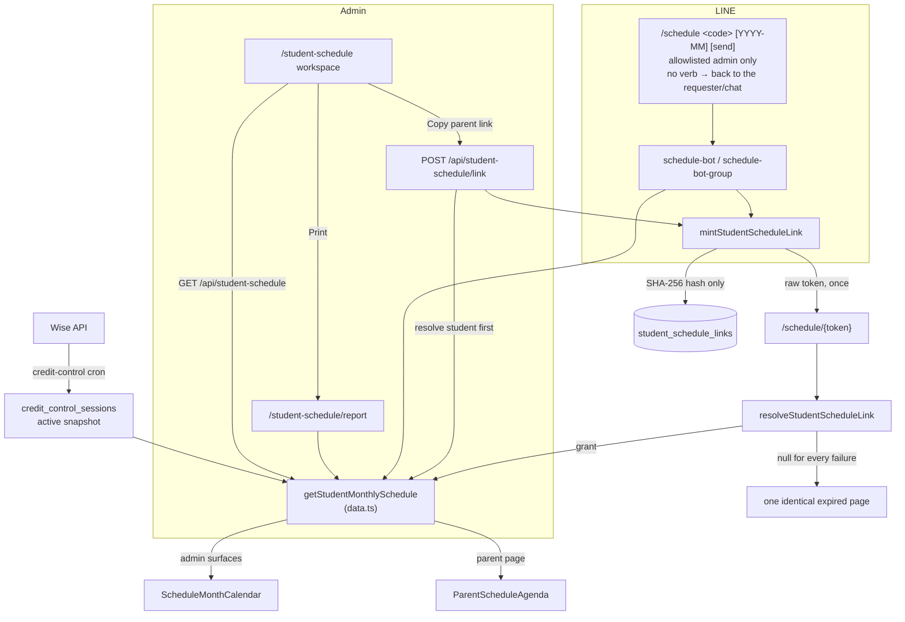

# Student Schedule

**Status: stable**

## Purpose

Student Schedule answers one question for one child: *what classes does this student have this
month?* An admin looks a student up by nickname code, pages through months, and then either prints
the month as a PDF or hands the parent a link. The parent opens that link on their phone — with no
account, no login, and no app — and sees the same classes the admin just previewed.

Three surfaces render the **same** payload, so the classes staff preview are the classes the family
receives. The two admin surfaces render `ScheduleMonthCalendar`; the parent page renders the
phone-first `ParentScheduleAgenda`, which shares the same subject colours via
`buildSubjectColorMap`. The differences are enumerated under [UI](#ui).

| Surface | Route | Audience |
|---|---|---|
| Admin workspace | `/student-schedule` | admin session |
| Print / PDF report | `/student-schedule/report` | admin session |
| Public parent page | `/schedule/{token}` | capability token only |

Delivery has two routes: **copy a link** from the workspace and paste it wherever staff already
talk to the family, or drive the **LINE schedule bot** from inside LINE. The bot's grammar is
`<code> [YYYY-MM] [send]` behind a `/schedule` trigger (`src/lib/line/schedule-bot-command.ts:24`),
and the optional trailing `send` verb is load-bearing:

- **`/schedule <code>` (no verb) hands the link back to whoever asked.** In a DM it mints and
  replies to the requesting admin, who forwards it themselves (`pushToParent` at
  `schedule-bot.ts:275`, branch at `:281`-`286`, `replyWithLink` at `:296`). In a group it posts
  into the chat the command came from — never into some other conversation
  (`schedule-bot-group.ts:332`, `:339`; `deliver` at `:555` posts via `say(deps, target, …)` at
  `:610`).
- **`send` is what reaches a parent's own thread.** Only `/schedule <code> send` routes the DM path
  to `startSend` and its verified-contact + confirm gates (`schedule-bot.ts:288`, `:355`); in a
  group it forces the confirm by disqualifying the already-delivered fast path
  (`schedule-bot-group.ts:494`). Rationale in commit `339ccc0`. One carve-out: in a chat switched
  to instant mode (`/schedule setup instant`, GRP-BOT-07) the group-side force-confirm is waived
  along with every other confirm in that chat (`schedule-bot-group.ts:476`-`488`).

Those gates are owned by [LINE Integration](./line-integration.md#schedule-bot-gates); this page
describes only what the schedule feature itself contributes.

This is the newest feature in the repo (commits `2a17065`…`9f72002`, 2026-08-05) and it **owns no
sync of its own**. Every session it renders starts from the *active credit-control snapshot* — see
[Conceptual data model](#conceptual-data-model) — optionally corrected by a **live Wise overlay**:
`getStudentMonthlySchedule` accepts a `liveSweep` mode (`"always" | "rescue" | "never"`,
`src/lib/student-schedule/data.ts`). The parent page, admin APIs and print report use the default
`"always"` (fresh Wise data at view time, fail-soft to the snapshot on error/deadline); the LINE
schedule bot passes `"rescue"`, sweeping only when the snapshot month is payload-empty — its message
needs a session count the ≤~36-min-old snapshot already answers, and the minted link re-fetches live
data when opened.

## Conceptual data model

Full column and index detail lives in the reference pages; this section describes what each table
*means* here.

**Read — the credit-control lineage** ([`erd-credit-control.md`](../reference/database/erd-credit-control.md)).
`getStudentMonthlySchedule` resolves the single `active` credit-control snapshot, looks the student
up inside it, and reads that snapshot's session rows for the month
(`src/lib/student-schedule/data.ts:173`-`218`). It is the **grain** that makes
`credit_control_sessions` the source rather than the Wise tutor snapshot: its unique key is
`(snapshot_id, wise_session_id, wise_student_id)`, one row per (student, session), with `subject`
and `student_key` on that row (`src/lib/db/schema.ts:1228`, `:1232`, `:1248`). The tutor snapshot's
`future_session_blocks` also carries `subject`, but a row there is one snapshot × identity-group ×
session with a single nullable `student_name` and no student key
(`src/lib/db/schema.ts:1615`-`1637`), so it cannot answer "what does *this child* have this month?".
The credit-control window is the sync's past 120 / future 180 days
(`src/lib/credit-control/sync.ts:60`-`61`).

That table gained three teacher columns for this feature: `wise_teacher_user_id`, `wise_teacher_id`,
`teacher_name` (migration `drizzle/0063_student_schedule_links.sql`). **No new Wise request was
added** — Wise already returned the owning teacher on the endpoint credit control calls, and
`WiseCreditSessionSchema` was passing the fields through without reading them; the schema now names
them and `creditSessionTeacher` normalizes both shapes Wise uses (a bare id string or an expanded
`{_id, name}` ref), blanks becoming `null` (`src/lib/credit-control/wise.ts:24`-`51`, `:130`-`143`,
written at `sync.ts:431`, `:454`-`456`). A `null` teacher renders **"Teacher TBC"** and is never
guessed (`src/lib/student-schedule/types.ts:10`, applied at `data.ts:138`).

**Write — capability tokens** ([`erd-core.md`](../reference/database/erd-core.md),
[`index.md`](../reference/database/index.md)). `student_schedule_links` is the feature's only owned
table: one row per issued parent link, granting read of exactly one `(student_key, month_key)` pair,
expiring and revocable, with view accounting. Only the SHA-256 hash of the token is stored.

**Write — LINE bot state** ([`erd-line.md`](../reference/database/erd-line.md)).
`line_schedule_bot_pending` (the outstanding confirm), `line_group_settings` (a chat's
family/staff audience) and `line_group_schedule_sends` (delivery audit + the "has this group already
received this student?" lookup) are written by the bot. They are documented in
[LINE Integration](./line-integration.md#conceptual-data-model).

There is **no snapshot lineage, no sync run table and no cron** for this feature. Baseline freshness
is inherited from the credit-control sync; the live Wise overlay (above) corrects it at read time for
`"always"`-mode callers. Retention of old credit-control snapshots is that feature's concern (see
[Credit Control](./credit-control.md)).

## API surface

Query parameters, status codes and response bodies live in
[`reference/api/misc.md § Student schedule`](../reference/api/misc.md#student-schedule) — that is
the canonical home; this table carries purpose only.

| Method | Path | Purpose |
|---|---|---|
| GET | `/api/student-schedule` | Read one student's Bangkok-month payload — the workspace's only data call. |
| POST | `/api/student-schedule/link` | Mint the parent-facing `/schedule/{token}` link for a student-month. |

Both require an admin session in-handler (`src/app/api/student-schedule/route.ts:14`-`17`,
`link/route.ts:23`-`26`) on top of the middleware gate.

The workspace also consumes the existing LINE student directory, `GET /api/line/students`
(`student-schedule-workspace.tsx:73`), rather than reimplementing code ranking — see
[`reference/api/line.md`](../reference/api/line.md).

The public parent page is **not** an API: `/schedule/{token}` is a Server Component that resolves
the token and reads the schedule directly.

## UI

**`/student-schedule`** (`src/app/(app)/student-schedule/page.tsx`) is an async Server Component
that re-checks the session and renders the client shell `StudentScheduleWorkspace` inside
`<Suspense>`. The workspace does the whole job in one screen: a debounced student search (200 ms,
minimum two characters, `AbortController` per keystroke — `student-schedule-workspace.tsx:65`-`84`),
prev/next/"This month" month navigation (`setMonthKey` handlers at `:205`, `:216`, `:224`, inside
the control row at `:200`-`228`), **Copy parent link** (`copyParentLink` at `:131`-`149`, button at
`:231`) and **Print / Save PDF** (`openPrintView` at `:122`-`129`, button at `:235`). Nav
registration is `src/lib/navigation/tools.ts:169`-`175` (student-lifecycle section).

There is deliberately **no "send to parent" button**. Pushing a message to a family runs through
the bot's confirm gate, so it cannot be a one-click action on a page where a mis-click sends to the
wrong child (`student-schedule-workspace.tsx:12`-`14`).

**`/student-schedule/report`** (`src/app/(print)/student-schedule/report/page.tsx`) is the printable
sheet: same auth check, Zod-validated `studentKey` + `month` query, an A4 sheet wrapper, and the
shared `PrintToolbar` that calls `window.print()`. It lives in the `(print)` route group so it gets
no `AppNav` chrome, but its URL is still under the `/student-schedule` namespace — which is what
keeps it inside a restricted user's `allowedPages` prefix.

**`/schedule/{token}`** (`src/app/schedule/[token]/page.tsx`) is the public parent page, built
phone-first for LINE's in-app browser: `robots: noindex/nofollow`, a per-route `viewport` export
(`viewportFit: "cover"` so safe-area insets apply on notched phones), and a page root that **owns
its own scrolling** (`min-h-0 flex-1 overflow-y-auto`) because the root layout's body is a
fixed-height `overflow-hidden` flex shell that would otherwise clip everything below the first
viewport — the same trap the admissions parent dashboard documents. The loaded page is composed by
the client-side **`PublicScheduleShell`** (`public-schedule-shell.tsx`), which owns the scroll
region, the sticky Thai-first header (nickname — never the legal name — plus `formatThaiMonth` and
a session-count badge), and an **agenda ⇄ calendar view toggle**:

- **Defaults are screen-size-aware and JS-free.** View state starts `null` (= auto), rendered as
  responsive class pairs from `resolveViewContainerClasses` (`schedule-view-preference.ts`), so the
  SSR HTML alone shows the agenda below `lg` and the calendar at `lg`+ — no hydration flash, and
  resizes/rotation keep working via CSS while in auto.
- **The calendar view is two shapes:** at `lg`+ it is `ScheduleMonthCalendar`'s month grid in the
  `max-w-5xl` column the desktop page had before the agenda redesign; below `lg` it is the
  **mini calendar** (`parent-schedule-mini-calendar.tsx`) — one micro chip per session, the
  truncated subject name on that subject's colour tint (the SessionBlock formula), Thai weekday
  initials, and a `+N` overflow past 3 chips. Tapping
  a day returns to the agenda scrolled to that day (via its `data-date`); those taps are navigation
  and **never** write the preference.
- **Explicit toggle choices persist** in `localStorage["bgscheduler.schedule.view"]`
  (admissions-locale pattern: try/catch, garbage fails closed to auto). A stored preference is
  applied in a mount effect — the one accepted flash, only for parents who previously toggled
  against their size default.

The whole page renders in Sarabun via the `font-thai` theme token, and the Suspense fallback is a
skeleton mirroring the loaded layout (header, toggle row, agenda cards) rather than a blank screen
(the live Wise merge can hold first byte for a couple of seconds). It sits outside every route
group, so it renders without nav or admin chrome.

**`ScheduleMonthCalendar`** (`src/components/student-schedule/schedule-month-calendar.tsx`) is the
component both **admin** surfaces render, and the parent page's desktop calendar view. It is
presentational and deliberately **not** `"use client"` — no fetching, no clock. It draws the
Monday-start 6×7 grid on `lg` and up, a week-grouped list below that, and colours blocks by
**subject** (not tutor) from a six-colour palette assigned in order of first appearance
(`:36`-`63`). On the parent page the shell mounts it inside a `hidden lg:block` wrapper, so only
its grid branch can ever show there (its own week-list branch is `lg:hidden`). Grid maths is
shared with the admissions calendar via `src/lib/calendar/month-grid.ts`.

**`ParentScheduleAgenda`** (`src/components/student-schedule/parent-schedule-agenda.tsx`) is the
parent page's default mobile view: a day-by-day list of session cards, one section per day that
has sessions, headed by the Thai weekday + day number (`formatThaiDayHeading`). With `todayKey` it
badges today ("วันนี้"), dims past days (visual only — never dropped), and anchors
`id="agenda-scroll-target"` on the first day at or after today. Scroll-to-today (and the mini
calendar's scroll-to-day, via each section's `data-date`) is owned by `PublicScheduleShell`'s
pending-scroll effect, which runs after the commit that revealed the agenda so a scroll never
fires against a `display:none` subtree. The agenda is deliberately a **separate component** rather
than a third branch of `ScheduleMonthCalendar`: the calendar's
`.schedule-month-grid`/`.schedule-mobile-list` class names are force-toggled by the print CSS, so
its markup is load-bearing for the A4 report, and the two audiences want different type scales and
states. Content cannot drift between the surfaces because all of them render the same payload, and
the agenda and mini calendar import the same `buildSubjectColorMap` for their colours.

The three surfaces are **not** byte-identical, though, because they differ in component and props:

| | Component | `todayKey` | Empty month renders |
|---|---|---|---|
| Workspace | `ScheduleMonthCalendar` | `todayKey={todayKey}` (`student-schedule-workspace.tsx:257`) | the calendar's own English empty state |
| Print report | `ScheduleMonthCalendar` | *omitted* (`report/page.tsx:115`) | the calendar's own English empty state |
| Parent page | `ParentScheduleAgenda` + `ScheduleMonthCalendar` (lg+ calendar view) + `ParentScheduleMiniCalendar` (sub-lg calendar view) | `todayKey={todayBangkok()}` on all three | the page's Thai/English `PUBLIC_PAGE_COPY.emptyMonth` in a card, no toggle |

- **`todayKey` draws the today marker** — a filled badge on the matching grid cell in the calendar
  (`schedule-month-calendar.tsx:179`-`181`), the "วันนี้" badge + scroll anchor in the agenda. The
  print report is the one surface that does not pass it, so whenever the viewed month contains
  today the printed sheet carries no today marker and the preview does — the classes are identical,
  the day highlight is not. (The code does not record *why* the report omits it; a printed month
  outliving the day it was printed is the obvious reading, not a documented one.)
- **A zero-session month diverges by design.** The workspace and the print report fall through to
  the calendar's `No classes scheduled in {monthLabel}.` (`schedule-month-calendar.tsx:128`-`140`),
  while the parent page short-circuits before rendering the agenda at all and shows its own
  bilingual line in a card (copy at `src/lib/line/schedule-bot-copy.ts`).

Print behaviour lives in `src/app/student-schedule.css` (imported by `globals.css`): a **named**
`@page schedule-landscape` so this report prints landscape without flipping any other printable page
in the app (`:10`-`19`), `break-inside: avoid` on day cells and session blocks (`:55`-`63`), and a
print-time swap that forces the month grid on and the mobile list off (`:65`-`72`). One parent-page
nuance: while in auto view, print output follows **paper** width, not screen width — portrait A4
(≈794 CSS px) is below `lg`, so a desktop screen showing the grid still prints the agenda unless
the paper is landscape. Forced views print what they show, and a forced calendar always prints the
month grid (`print:block` on the grid wrapper, `print:hidden` on the mini calendar — it is
navigation, not a document).

## Data flow

Two properties fall out of this shape:

- **A link is re-read live on every visit.** The token stores a `(studentKey, monthKey)` grant, not a
  rendered document, so a schedule that changes after the link was sent is correct the next time the
  parent opens it — which is exactly what the Thai push message promises
  (`src/lib/line/schedule-bot-copy.ts:87`). It also means a link can never widen its own scope.
- **Minting resolves the student first.** `POST /api/student-schedule/link` loads the schedule
  before it mints, and mints against `schedule.student.studentKey` rather than the raw input, so a
  token can never be issued for an arbitrary key (`link/route.ts:47`-`63`).

## Business rules & edge cases

### The public page is the app's only unauthenticated student-data page

`src/middleware.ts:15` allowlists the `/schedule/` prefix. Every other bypass in `isPublicRoute` is
an API (`/api/auth`, `/api/search/assistant`, `/api/classrooms/floor-plan-map`, `/api/line/webhook`,
two OA-resolver endpoints, all of `/api/internal/`); the only other public *page* is `/login`, which
renders nothing about a student. The entry is written with a trailing slash so it matches tokenized
URLs only and cannot widen to sibling paths; the admin page at `/student-schedule` is a different
path and stays behind auth (`src/middleware.ts:11`-`15`).

### The token is the credential, and it is a bad oracle

- 32 random bytes from `crypto.randomBytes`, base64url — not a UUID, not derived from the student key
  (`src/lib/student-schedule/links.ts:24`, `:92`).
- **Only the SHA-256 hash is persisted** (`:98`); the raw token exists in plaintext exactly once, at
  mint time, on its way into the message or the admin's clipboard (`:54`-`60`).
- Expiry and revocation are enforced in SQL, and the fetched digest is re-compared in constant time
  (`:140`-`147`).
- Every failure mode — malformed, unknown, expired, revoked — returns `null` (`:121`-`147`) and the
  page renders **one identical message** for all of them, so the page cannot be used to probe which
  tokens ever existed (`src/app/schedule/[token]/page.tsx:56`, copy at
  `schedule-bot-copy.ts:106`-`116`). Do not branch that.
- View accounting is best-effort: an accounting failure logs and still serves the parent
  (`links.ts:149`-`159`).
- Default TTL is 30 days, overridable by `STUDENT_SCHEDULE_LINK_TTL_DAYS` (`links.ts:27`,
  `link/route.ts:55`). The link base is `APP_BASE_URL` or the request origin, so previews link to
  themselves (`link/route.ts:18`-`20`).

### Fail-closed rendering

- **Cancelled sessions are omitted**, in both Wise spellings (`/^CANCELL?ED$/i`) — a parent-facing
  calendar must not list a class that will not happen (`data.ts:39`, `:123`).
- **A teacherless session is shown, not dropped**: it renders `TEACHER_TBC` and the teacher is never
  inferred from the class or package name (`data.ts:138`). Rows written before migration `0063`
  simply have no teacher; each credit-control sync writes a fresh snapshot carrying the new columns,
  so the placeholder clears on its own.
- **A student with two package rows for one session appears once** — dedupe is by `wiseSessionId`
  (`data.ts:126`).
- **Subject falls back** to the package name, then the literal `"Class"`, so a block is never blank
  (`data.ts:136`).
- **Unknown student or no active snapshot → `null`**, which callers must treat as "not found"; there
  is no name-search fallback (`data.ts:161`-`194`).
- **A malformed month throws** rather than guessing (`data.ts:169`-`171`,
  `month-grid.ts:56`-`58`, `:80`-`82`).

### Bangkok time is resolved server-side, once

Every display string in the payload is precomputed in `Asia/Bangkok` — date key, `HH:mm` labels,
month label — so no client re-derives a time from an instant (`types.ts:1`-`7`, `data.ts:41`-`46`).
The month query uses a half-open **instant** window (`[start, end)`), not date strings, so a 23:00-UTC
session that belongs to the next Bangkok day lands in the right month
(`data.ts:91`-`101`). Months outside the credit-control window (past 120 / future 180 days) simply
come back empty.

### The calendar never hides a class

Unlike the compare view, the month grid has **no "+N more" overflow** — day cells grow instead,
because a parent-facing document must not silently omit a class
(`schedule-month-calendar.tsx:9`-`13`). The parent agenda holds the same line: every session
renders as its own card, and past days are dimmed but never dropped. Subject colours are assigned
by order of first appearance rather than hashed, after a content hash produced two
indistinguishable blues in a real month (`:45`-`53`).

### LINE delivery, in brief

The bot is a delivery channel for this feature; its gates are documented in
[LINE Integration](./line-integration.md#schedule-bot-gates). The parts that matter when reasoning
about the schedule itself:

- **Fail-closed by env.** `LINE_SCHEDULE_BOT_ADMIN_IDS` unset or empty yields an empty allowlist,
  which disables the bot entirely; a non-allowlisted sender gets `handled: false` and **no reply at
  all**, so a parent messaging the OA sees no evidence it exists
  (`src/lib/line/schedule-bot.ts:112`-`124`, `:226`; group equivalent
  `schedule-bot-group.ts:275`-`278`). Onboarding a new admin operator onto the
  allowlist is documented in
  [`operations/runbook.md` §4.1](../operations/runbook.md#41-onboarding-a-new-schedule-bot-admin-operator).
- **The default command does not message a parent.** A bare `/schedule <code>` replies to the
  requester (DM) or into the originating chat (group); only the trailing `send` verb resolves and
  messages a parent — see [Purpose](#purpose) for the citations.
- **Trigger is the `/schedule` text prefix, or an `isSelf` mention.** Both are accepted
  (`detectTrigger`, `schedule-bot-command.ts:72`-`84`; `mentionsSelf` at `mentions.ts:54`-`57`), and
  the typed prefix is the primary one. *Why* is an operational finding about LINE's own clients,
  recorded in the repo only as prose — the mention picker offers no bot on desktop and web, so the
  mention gate was unsatisfiable there (JSDoc at `schedule-bot-command.ts:16`-`19`; commit
  `339ccc0`). Not verifiable from this codebase.
- **`/schedule` typed in LINE Official Account Manager can never work.** This is an operational
  finding about LINE's webhook contract, not something this repo can prove: LINE emits no event for
  a message the Official Account itself sends, so that text goes straight to the parent and the
  server never sees it (asserted in commit `0438836`). What the code *does* show is that the ingest
  only ever consumes an inbound `events[]` array and drops anything whose `source.type` is neither
  `user` nor a group/room text message (`src/lib/line/data.ts:435`-`461`). Staff working in OA
  Manager use `/student-schedule` → **Copy parent link** instead.
- **Groups declare an audience once and confirm each new student.** The first command in a chat asks
  FAMILY or STAFF, stored in `line_group_settings`; that reply doubles as the first student's
  confirmation. Each new student in that chat then needs a `YES`, while a student the chat has
  already received goes straight through via `line_group_schedule_sends`
  (`schedule-bot-group.ts:490`-`504`). **Audience selects the message template only — Thai parent
  copy vs the English admin format — it grants nothing and relaxes no gate**
  (ternary at `:661`-`675`). A chat can opt out of the per-student confirm entirely:
  `/schedule setup instant` sets `skip_confirm` on its settings row (GRP-BOT-07) and every later
  command posts immediately; `/schedule setup confirm` restores the default. The toggle is
  admin-only and refuses until the chat has declared an audience (`:222`-`237`, `:348`-`361`).
- **Parent copy names the nickname, never the legal name**, states the expiry, and says the link
  self-updates (`schedule-bot-copy.ts:66`-`96`).

## Tests

Run with `npm test`. Tests sit in sibling `__tests__/` directories.

- **`src/lib/student-schedule/__tests__/data.test.ts`** — the payload rules in isolation: Bangkok
  formatting, both cancellation spellings, `TEACHER_TBC` instead of a dropped session, per-session
  dedupe across packages, chronological sort, subject fallback, missing end time, empty month; plus
  the Bangkok-vs-UTC month window (including a late-UTC session landing in the next Bangkok day) and
  `parseStudentDisplay` casing/suffix behaviour.
- **`src/lib/student-schedule/__tests__/links.test.ts`** — mint returns a raw token but persists only
  its hash, tokens are distinct per call, TTL is applied in days, a malformed month mints nothing;
  resolve rejects a malformed token *without querying*, returns null when the row is filtered out or
  the stored hash does not match, and still serves the parent when view accounting fails.
- **`src/app/api/student-schedule/__tests__/route.test.ts`** — both routes' 401/400/404/500 ladders,
  and that the link route mints **against the resolved student, not the raw input key**.
- **`src/components/student-schedule/__tests__/schedule-month-calendar.test.tsx`** — 42-cell
  Monday-start grid, distinct-and-deterministic subject colours, every class on a busy day (never a
  `+N more`), the TBC placeholder, both grid and mobile list present, empty state, and label
  formatting including the missing-end-time case.
- **`src/components/student-schedule/__tests__/parent-schedule-agenda.test.tsx`** — sections only
  for days with sessions, Thai weekday headings, the today badge and past-day dimming (and their
  absence without `todayKey`), the scroll anchor on today / the next upcoming day / absent when the
  month is entirely past, the TBC placeholder, chronological order, and the same label formatting
  cases as the calendar.
- **`src/components/student-schedule/__tests__/schedule-view-preference.test.ts`** — the toggle's
  zero-flash contract as exact class strings for auto/forced views, plus storage helpers failing
  closed to auto on garbage or a throwing localStorage.
- **`src/components/student-schedule/__tests__/parent-schedule-mini-calendar.test.tsx`** — 42
  Monday-start cells, one subject chip per session in shared-map colours, the CHIP_CAP `+N` overflow, blank
  out-of-month cells, today only with `todayKey`, buttons only on session days, Thai aria-labels,
  and the first-appearance legend.
- **`src/components/student-schedule/__tests__/public-schedule-shell.test.tsx`** — the SSR auto
  contract (agenda `lg:hidden`, calendar `hidden lg:block lg:max-w-5xl`), the print-safe
  grid/mini-calendar split, the Thai toggle with neither segment pressed before hydration, and every
  slot mounted inside the scroll-owning shell.
- **`src/lib/calendar/__tests__/month-grid.test.ts`** — grid construction, leap February, year
  boundaries in both directions, throwing on a malformed key, Monday resolution, D/M formatting.
- **LINE side** — `schedule-bot.test.ts`, `schedule-bot-group.test.ts`, `schedule-bot-copy.test.ts`
  and `mentions.test.ts` under `src/lib/line/__tests__/`, organised one describe block per gate, with
  the refusal cases asserting that **zero** messages were sent. Covered in
  [LINE Integration](./line-integration.md#tests).

## Open questions

- **`revokeStudentScheduleLink` has no caller and no test.** It is exported from
  `src/lib/student-schedule/links.ts:172` and nothing in `src/` invokes it — there is no admin
  "revoke link" UI or endpoint. Is a revoke surface planned, or should a wrongly-sent link be handled
  some other way (and by whom)?
- **The DM "multiple verified contacts" prompt is unanswerable.** `adminMultipleContacts` tells the
  admin to "reply 1 or 2" (`schedule-bot-copy.ts:192`-`201`), but no numeric handler exists — a bare
  `"1"` fails `COMMAND_PATTERN`'s 2-character minimum (`schedule-bot-command.ts:24`) and no pending
  row was written, so the reply is ignored. Should the numbered choice be implemented, or the copy
  changed to point at `/line-review`?
- **No sweeper for expired rows.** Nothing deletes expired `student_schedule_links` or abandoned
  `line_schedule_bot_pending` rows; expiry is enforced only at read time. Is unbounded growth
  acceptable, or should a cron prune them?
- **Links are pinned to a single month.** A parent's August link is inert in September and there is
  no rolling "current month" link and no re-send job. Is monthly re-issue intended to stay a manual
  staff action?
- **The `data.ts` header says `credit_control_sessions` "is truncated and rebuilt on every
  credit-control sync" (`:7`-`8`).** The sync actually writes a new snapshot's rows and flips
  `active` (`src/lib/credit-control/sync.ts:660`-`701`); nothing deletes old snapshot rows (see
  [Credit Control](./credit-control.md)). The self-healing conclusion holds, but the mechanism
  described does not — worth correcting the comment.
- **The middleware comment's rationale is imprecise.** `src/middleware.ts:13`-`14` says the trailing
  slash "keeps the authenticated `/student-schedule` admin page out of this allowlist", but
  `"/student-schedule".startsWith("/schedule")` is false either way. Was a different sibling path
  (e.g. a future `/schedule` index) the real concern?
- **How many families can actually be reached today?** The group path was built because "almost no
  verified contact links survive the OA-resolver namespace quarantine" (commit `2a17065`,
  `schedule-bot-group.ts:9`-`13`). Whether the DM `send` path is still limited to a handful of
  students is a production-data question, not a repo one.

_Verified against HEAD + uncommitted WIP on 2026-05-31._
