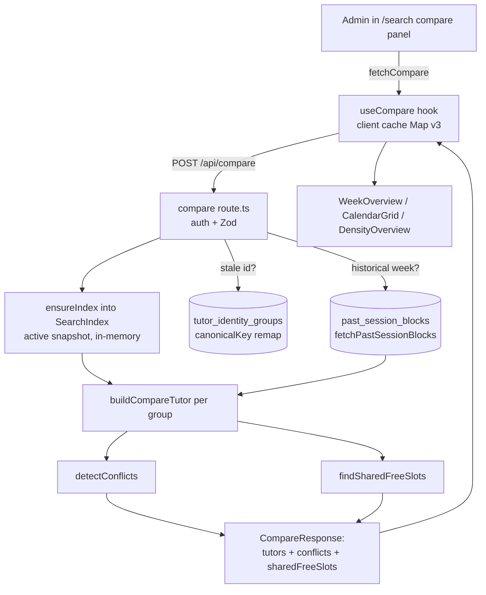

# Tutor Compare

**Status: legacy-redirect** — the standalone `/compare` page now redirects into `/search`, but the comparison engine, API, and UI are fully active and embedded in the search workspace.

## Purpose

Tutor Compare lets admin staff put **1–3 tutors side by side for a single week** and answer three questions at a glance:

1. **What is each tutor's week already booked with?** A GCal-style calendar renders every blocking session per tutor.
2. **Do any of these tutors clash for the same student?** Same-student, same-weekday, overlapping sessions are surfaced as explicit conflicts.
3. **When are all selected tutors simultaneously free?** Shared free-slot intervals are intersected across the group so staff can find a common opening.

The audience is the same non-technical admin staff who drive Tutor Search. Compare is reached by selecting tutors from search results (or via a deep link), not as a separate destination — the dedicated `/compare` route exists only to bounce old bookmarks back to `/search` (verified: `src/app/(app)/compare/page.tsx:10-18` `router.replace("/search")`, preserving `?tutors=`).

## Conceptual data model

Compare is **read-only** — it never writes. All reads are served from the warm in-memory `SearchIndex` singleton (the active Wise snapshot), not from Postgres on the request path. The only direct DB touches are a fallback resolution query and a historical-range fetch.

Tables/aggregates it reads, conceptually:

- **Active-snapshot tutor data** (identity groups, qualifications, availability windows, leaves, future session blocks) — loaded once into the index and read in-process as `IndexedTutorGroup` aggregates.
- **`tutor_identity_groups`** — queried directly only to resolve *stale* tutor-group UUIDs (from old links/caches) to their `canonicalKey`, so they can be re-mapped onto the current snapshot (`src/app/api/compare/route.ts:82-91`).
- **`past_session_blocks`** — the sole cross-snapshot table, keyed by `group_canonical_key`. Read only when the requested week is historical, to recover real past sessions instead of guessing (`src/app/api/compare/route.ts:189-198`, via `fetchPastSessionBlocks`).
- **`tutor_business_profiles`** — editorial profile data carried on the index and passed through onto each `CompareTutor` for the profile popover (`businessProfile`, `src/lib/search/compare.ts:316`).

For column-level detail and ER diagrams of these tables, see the canonical reference: [docs/reference/database/erd-core.md](../reference/database/erd-core.md) (snapshot, identity-group, session-block, and `past_session_blocks` tables) and [docs/reference/database/erd-tutor-profiles.md](../reference/database/erd-tutor-profiles.md) (business profiles).

## API surface

Two POST endpoints, both **admin-authed** (`auth()` → 401). Full request/response contracts live in the canonical API reference — do not rely on the summaries below for shapes.

| Method + path | Purpose | Reference |
|---|---|---|
| `POST /api/compare` | Build week-scoped schedules for 1–3 tutors, detect same-student conflicts, and compute shared free slots. Supports `fetchOnly` (incremental serialization) and `weekStart` (week selection). | [docs/reference/api/misc.md](../reference/api/misc.md) |
| `POST /api/compare/discover` | Given up to 2 already-selected tutors, rank candidate tutors to add — each annotated with conflict count, free-slot match, and data-issue flags. | [docs/reference/api/misc.md](../reference/api/misc.md) |

The client never calls these from a `/compare` page; the `useCompare` hook (`src/hooks/use-compare.ts`) owns all `fetch("/api/compare")` calls (`src/hooks/use-compare.ts:135`), and the discovery panel drives `/api/compare/discover`.

## UI

There is **no rendered compare page**. The user-facing surface is the compare half of the search workspace.

- **Page**: `src/app/(app)/compare/page.tsx` — a client redirect shell only (`Suspense` → `router.replace`). No compare UI renders here.
- **Host page**: `src/app/(app)/search/page.tsx` → `<SearchWorkspace>` (`src/components/search/search-workspace.tsx`), which mounts `<ComparePanel>` (imported at `search-workspace.tsx:18`) on the right half of the side-by-side layout — a `w-1/2 pl-1` container at `search-workspace.tsx:341-354`.

Key components under `src/components/compare/`:

- **`compare-panel.tsx`** — the container. Owns the `useCompare` hook wiring, week navigation, fullscreen toggle, tutor chips, and lazy-loads the calendar/discovery children via `next/dynamic` (`compare-panel.tsx:29-42`).
- **`week-overview.tsx`** — GCal-style 7-day week grid with overlap sub-columns (lazy).
- **`calendar-grid.tsx`** — single-day calendar grid (lazy).
- **`density-overview.tsx`** — compact booked-hours / session-count summary per tutor/day (`sessionCount: daySessions.length`, `density-overview.tsx:70`; rendered in the cell aria-label `${day.sessionCount} session(s)`, `density-overview.tsx:125`).
- **`discovery-panel.tsx`** — the "add a tutor" modal, backed by `/api/compare/discover` (lazy).
- **`week-calendar.tsx`** — month-grid date-picker popup for jumping to any week.
- **`tutor-combobox.tsx`** / **`tutor-selector.tsx`** — searchable tutor add control + chip type.
- **`tutor-profile-popover.tsx`**, **`session-colors.ts`**, **`modality-display.ts`** — per-session rendering helpers (colors, modality labels, profile hovercard).

Client state (selected tutors, week, per-tutor cache) lives in `useCompare` (`src/hooks/use-compare.ts`), which keeps a `Map<"tutorGroupId:week:CACHE_VERSION", CompareTutor>` cache (version `v3`, `src/lib/search/cache-version.ts:24`) so adding/removing a tutor or changing weeks only refetches what changed.

## Data flow

A typical "compare these tutors for this week" request:

1. The client (`useCompare.fetchCompare`) POSTs `tutorGroupIds`, `mode: "recurring"`, `weekStart`, and optional `fetchOnly` to `/api/compare`.
2. The route authenticates, validates with Zod (`compareRequestSchema`, `route.ts:24-31`), and calls `ensureIndex(db)` to get the warm snapshot.
3. Requested IDs are resolved against the active snapshot; any that miss are re-mapped via `tutor_identity_groups.canonicalKey` (stale-link recovery).
4. If the week starts before today (BKK), captured `past_session_blocks` are fetched and merged in.
5. `buildCompareTutor` assembles each tutor's sessions; `detectConflicts` and `findSharedFreeSlots` run across the **full** set; `fetchOnly` then trims which tutors are serialized back.
6. The client merges returned tutors into its cache and renders the calendar, conflicts, and shared free slots.

## Business rules & edge cases

- **Fail-closed modality (MOD-01 / MOD-02).** `resolveSessionModality` never guesses a session's online/onsite. An unresolved group (`supportedModes` empty) returns `unknown`/`low` even when a `sessionType` hint exists (`src/lib/search/compare.ts:170-171`); the pre-MOD-01 silent single-mode fallback was deliberately deleted. Paired-group signal disagreements (teacher `isOnline` vs `sessionType`) emit a contradiction and resolve to `unknown` (D-07, `compare.ts:124-133`); single-record disagreements do the same (D-08, `compare.ts:142-151` and `compare.ts:156-165`). Tenant vocabulary `"scheduled"` is treated as online (MOD-UAT-01, `compare.ts:6`).
- **Sync-time modality contradictions.** `detectSessionModalityConflict` (`compare.ts:185-223`) mirrors the same logic without an index, so the orchestrator can record `conflict_model` rows in `data_issues` during sync — same module, different entry point.
- **Blocking-only schedule.** `buildCompareTutor` filters to `s.isBlocking` sessions before anything else (`compare.ts:243`); cancelled / non-blocking sessions never appear and never block a free slot.
- **Per-weekday historical handling (D-05 / PAST-01 / PAST-04).** For weekdays whose calendar date is **before today (BKK)**, the nearest-future-occurrence fallback is disabled — those days render an honest empty unless real `past_session_blocks` were captured (`compare.ts:262-291`). Today/future empty weekdays still fall back to the nearest future occurrence of a recurring session, de-duped by `recurrenceId` (`compare.ts:279-284`) and then narrowed to only the sessions sharing that nearest occurrence's calendar date (`s.startTime.toDateString() === firstDate`, `compare.ts:287-288`). `getStartOfTodayBkk` is extracted so tests can mock `Date.now()` (`compare.ts:36-39`).
- **Historical free-slots must not "free" a past session (Pitfall 16).** When the range is historical, the route clones each group with `past_session_blocks` merged into `sessionBlocks` *before* calling `findSharedFreeSlots`, so a captured past session correctly blocks (`route.ts:215-227`). Non-historical ranges skip the extra allocation.
- **Conflict definition.** A conflict requires the **same student** (case-insensitive), **different tutors**, **same weekday**, and **minute overlap** (`compare.ts:340-342`); pairs are de-duped per student / weekday / tutor-pair (`compare.ts:343-345`). Conflicts are detected across the full selection regardless of `fetchOnly`.
- **Shared free-slot threshold.** Intersected free intervals shorter than **30 minutes** are dropped (`compare.ts:401`); a tutor with no availability window on a weekday makes that weekday yield no shared slot (`compare.ts:397`).
- **Stale tutor-id recovery.** Tutor-group UUIDs are snapshot-scoped. After a sync, old `/search?tutors=…` links may carry dead IDs; the route resolves them via `canonicalKey` and adds the warning `"Tutor selection was refreshed after the latest Wise sync"` (`route.ts:157-159`). Only well-formed UUIDs are looked up (`UUID_RE`, `route.ts:59` and `route.ts:82`).
- **Staleness is a warning, never withheld data.** If the snapshot is older than the 90-minute API threshold, `snapshotMeta.stale = true` and `STALE_SEARCH_WARNING` is pushed, but the comparison still returns (`route.ts:144-149`).
- **Incremental fetch (`fetchOnly`).** The full tutor set is always used for conflict / free-slot computation, but only the `fetchOnly` subset is serialized back (`route.ts:229-236`). Client-side, this means adding a tutor fetches only the new one and removing a tutor sends `fetchOnly: []` to recompute conflicts without re-downloading schedules (`use-compare.ts:278` and `use-compare.ts:295`).
- **Client cache invalidation.** `useCompare` clears its cache when the server snapshot id changes mid-session and retries once before surfacing an error (`use-compare.ts:153-165`); `CACHE_VERSION` (`v3`) namespaces every cache key so a shape change invalidates long-lived tabs (`cache-version.ts`).
- **Discovery ranking & fail-closed flags.** `/api/compare/discover` ranks candidates by: data-issues last, fewest conflicts, then most free-slot matches (`discover/route.ts:153-157`). A candidate with empty `supportedModes` is flagged `hasDataIssues` with reason `"Unresolved modality"` (`discover/route.ts:134-138`), keeping unresolved tutors out of the clean top of the list.

## Tests

- **Engine** — `src/lib/search/__tests__/compare.test.ts` (37 `it` cases): `buildCompareTutor` weekday / full-week selection, `weeklyHoursBooked` / `studentCount` math; the full 19-case modality-resolution matrix incl. contradictions and the no-`medium`-tier invariant (MOD-05 / D-21); `detectConflicts` (overlap, different students, non-overlap); `findSharedFreeSlots`; and the Phase-7 past+future merge with per-weekday historical flag (honest-empty, future fallback, backward-compat without `pastBlocks`, and merged-session conflict detection — Pitfalls 13/16).
- **Compare API route** — `src/app/api/compare/__tests__/route.test.ts`: 401 unauth, 400 Zod failure, 200 happy-path shape, stale-id resolution via canonical key + warning, 90-minute staleness flag/warning, and 500 on `ensureIndex` throw.
- **Discover API route** — `src/app/api/compare/discover/__tests__/route.test.ts`.
- **Components** — `src/components/compare/__tests__/`: `density-overview.test.tsx`, `modality-display.test.ts`, `view-transitions-source.test.ts`.

The `/compare` redirect page itself has no dedicated test in this tree.

## Open questions

- **Is the `mode` request field still meaningful for compare?** Both the client and `compareRequestSchema` require `mode`, but the client always sends `mode: "recurring"` (`use-compare.ts:141`) and `buildCompareTutor` keys entirely off `weekStart` / `dateRange`, never `mode`. The schema also accepts `dayOfWeek` / `date`, which the client never sets — these look vestigial from a pre-week-view design. A human should confirm before removing.
- **`CompareRequest` type vs the live request schema.** The exported `CompareRequest` interface (`types.ts:113-119`) omits `fetchOnly`, which the route's Zod schema accepts and the client sends; the interface appears unused by the route (which defines its own `compareRequestSchema`). Confirm whether `CompareRequest` is dead or meant to be kept in sync.
- **Should the legacy `/compare` route be retired entirely?** It exists solely to redirect old bookmarks. Whether to keep it indefinitely or drop it is a product call.

_Verified against HEAD `d4fe6d3` on 2026-06-05._
