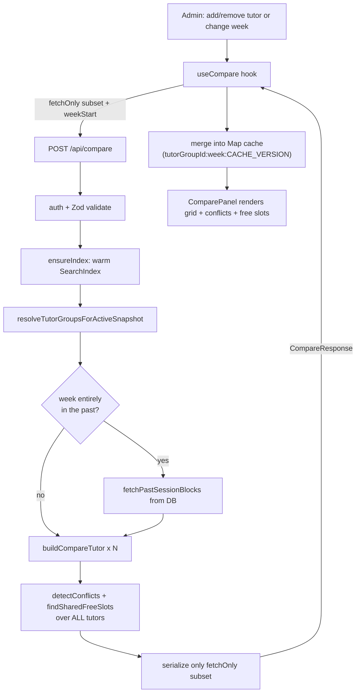

# Tutor Compare

**Status: legacy-redirect** — the standalone `/compare` route is a thin client-side redirect to `/search`; the live compare experience runs inside the search workspace. The compare *engine* and its API endpoints are fully active.

## Purpose

Tutor Compare lets admin staff place 1–3 tutors side by side for a chosen week and answer three operational questions at a glance:

1. **What is each tutor already teaching this week?** (a GCal-style weekly grid of their booked sessions)
2. **Do any two selected tutors have a booking conflict for the same student?** (the same student double-booked across two tutors at overlapping times)
3. **When are all selected tutors simultaneously free?** (shared free slots, for scheduling a new class)

It also offers a **discovery** flow ("Advanced search") that surfaces candidate tutors filtered by subject/level/mode/time and pre-ranks them by conflict count and availability against the tutors already selected.

The users are non-technical BeGifted admin staff scheduling classes; comparison is meant to be self-serve without engineering help.

The historical standalone `/compare` page now simply forwards to `/search` (preserving any `?tutors=` query), so old bookmarks keep working. See [Business rules & edge cases](#business-rules--edge-cases).

## Conceptual data model

Compare performs **no writes**. It reads entirely from the warm in-memory `SearchIndex` singleton (built from the active snapshot), with one direct DB read for historical weeks.

Conceptually it reads:

- **Tutor identity groups + their members** — the logical "one real person" grouping, including each underlying Wise teacher record (online vs onsite variant). Drives display name, supported modes, and per-session modality resolution.
- **Subject/level qualifications** — surfaced on each tutor and used by discovery's subject/curriculum/level filters.
- **Recurring availability windows** — the weekday + time + modality windows from which shared free slots are computed.
- **Dated leaves** — block availability in the discovery flow.
- **Future session blocks** — the booked sessions rendered in the grid and matched for conflicts; the bulk of compare's data.
- **Past session blocks** — read directly from the database (bypassing the index) only when the requested week is entirely in the past, to fill in history the Wise FUTURE API no longer returns. Fetched by `fetchPastSessionBlocksUncached` in `src/lib/data/past-sessions.ts:35`, which is wrapped by a cached `fetchPastSessionBlocks` used by the route.

For the full table/column definitions and relationships, see the database ERD reference: [`docs/reference/database/erd-core.md`](../reference/database/erd-core.md). The index build that loads these tables lives in `src/lib/search/index.ts` (DB queries at `src/lib/search/index.ts:170-206`).

## API surface

All endpoints require an authenticated session (return `401` otherwise) and validate the request body with Zod (`400` on failure). For full request/response contracts see [`docs/reference/api/misc.md`](../reference/api/misc.md).

- **`POST /api/compare`** — compare 1–3 tutors for a week: returns each tutor's week-scoped sessions, cross-tutor same-student conflicts, shared free slots, and the resolved `weekStart`/`weekEnd`. (`src/app/api/compare/route.ts:112`)
- **`POST /api/compare/discover`** — find candidate tutors (subject/level/mode/time filters) with conflict status pre-computed against the already-selected tutors, sorted by data-health → conflicts → availability. (`src/app/api/compare/discover/route.ts:29`)

Two adjacent endpoints feed the surrounding workspace but are owned by other features: `GET /api/tutors` (combobox list) and `GET /api/search/range` (the left-hand search panel). They are documented under their own features.

## UI

There is no dedicated compare page in the app shell. Two routes are relevant:

- **`src/app/(app)/compare/page.tsx`** — a client component (`CompareRedirect`) whose only job is to `router.replace()` to `/search`, carrying the `?tutors=` param through. It renders `null`. (`src/app/(app)/compare/page.tsx:6-28`)
- **`src/app/(app)/search/page.tsx`** — the real home of compare. It server-loads filter options and the tutor list, then renders `SearchWorkspace`, which mounts the compare UI as the right-hand panel (`src/components/search/search-workspace.tsx:18`, `src/components/search/search-workspace.tsx:347`).

Key components under `src/components/compare/`:

- **`compare-panel.tsx`** — the orchestrating panel: tutor-selector chips (max 3, color-coded, removable), the searchable `TutorCombobox`, the "Advanced search" trigger, the week picker (prev/next, clickable label → `WeekCalendar` popup, Today button), Week/day tabs, the calendar surface, and the conflict summary. It is driven entirely by the `useCompare` hook passed in as `compare`.
- **`week-overview.tsx`** / **`calendar-grid.tsx`** — the GCal-style weekly grid and single-day drill-down (lazy-loaded via `next/dynamic`).
- **`tutor-combobox.tsx`**, **`tutor-selector.tsx`** — tutor selection UI and the `TutorChip` shape.
- **`discovery-panel.tsx`** — the "Advanced search" modal that calls `/api/compare/discover`.
- **`density-overview.tsx`** — per-day booking density / conflict badges row.
- **`week-calendar.tsx`** — the month-grid date-jump popup.
- **`session-colors.ts`** (`TUTOR_COLORS`), **`modality-display.ts`**, **`tutor-profile-popover.tsx`** — presentation helpers.

Client state and the network lifecycle live in the **`useCompare` hook** (`src/hooks/use-compare.ts`): selected tutors, the displayed `weekStart`, the response, and the incremental-fetch tutor cache (see data flow below).

## Data flow

A compare interaction (add/remove a tutor, or change the week) flows from the hook through the API into the in-memory index and back:

1. The user adds a tutor in `ComparePanel`. `useCompare.addTutor` appends the chip and calls `fetchCompare` with `fetchOnly: [newId]` — only the new tutor is requested over the wire (`src/hooks/use-compare.ts:281-298`).
2. `fetchCompareData` aborts any in-flight request, POSTs to `/api/compare`, and on success merges returned tutors into a `Map` cache keyed by `tutorGroupId:week:CACHE_VERSION`, then rebuilds the full visible list from cache (`src/hooks/use-compare.ts:116-206`).
3. The route authenticates, ensures the index is warm, resolves the requested IDs against the active snapshot, builds **all** `CompareTutor`s, runs `detectConflicts` + `findSharedFreeSlots` over the full set, then serializes only the `fetchOnly` subset (`src/app/api/compare/route.ts:200-236`).
4. The engine (`src/lib/search/compare.ts`) filters each group's blocking sessions to the week, applies per-weekday fallback/modality resolution, and computes booked hours, student count, conflicts, and shared free slots — all from in-memory data.

Removing a tutor reuses the cache and sends `fetchOnly: []` so the server only recomputes conflicts/free slots (`src/hooks/use-compare.ts:267-279`). Changing the week clears stale entries via `pruneCacheToWeek` (`src/hooks/use-compare.ts:229-236`).

## Business rules & edge cases

- **`/compare` redirects to `/search`.** Verified in current code: the page is a `Suspense`-wrapped client component that `router.replace`s to `/search?tutors=…` (or `/search` if no tutors), and renders `null` (`src/app/(app)/compare/page.tsx:10-19`). There is no compare page UI anymore.
- **Fail-closed modality, no silent fallback.** `resolveSessionModality` returns `"unknown"` (confidence `"low"`) for any unresolved group, and for any *contradiction* between a paired/single group's known modality and the session's `sessionType` (`src/lib/search/compare.ts:124-171`). The pre-MOD-01 single-element `supportedModes` fallback was intentionally deleted. `detectSessionModalityConflict` mirrors this at sync time so contradictions land in `data_issues` as `conflict_model` rows (`src/lib/search/compare.ts:185-223`).
- **Tenant modality vocabulary.** `ONLINE_SESSION_TYPES` includes `"scheduled"` and `ONSITE_SESSION_TYPES` includes `"offline"`; `sessionType` is trimmed + lowercased before matching, so the tenant's uppercase `"SCHEDULED"`/`"OFFLINE"` resolve correctly (`src/lib/search/compare.ts:6-7`, `src/lib/search/compare.ts:104`).
- **Per-weekday historical fallback (the past-day problem).** Wise's FUTURE API omits past sessions. In `buildCompareTutor`, for weekdays with no session in the requested range, a nearest-future-occurrence fallback (deduped by `recurrenceId`) fills the day — **but only for weekdays whose calendar date is today or later** in Asia/Bangkok. Past weekdays render an honest empty unless real captured `pastBlocks` are supplied (`src/lib/search/compare.ts:255-291`). `getStartOfTodayBkk` is extracted so tests can freeze "now" (`src/lib/search/compare.ts:36-39`).
- **Historical weeks read captured past data.** When `dateRange.start` is before start-of-today BKK, the route fetches `past_session_blocks` for the selected canonical keys and merges them both into `buildCompareTutor` (via `pastBlocks`) and into `findSharedFreeSlots` (by cloning groups with extended `sessionBlocks`) — otherwise a tutor could be shown "free" during a past captured session (`src/app/api/compare/route.ts:180-227`).
- **Only blocking sessions count.** Both the grid and free-slot math filter on `isBlocking` (`src/lib/search/compare.ts:243`, `src/lib/search/compare.ts:375`); cancelled sessions are non-blocking upstream and never appear or block.
- **Conflicts are same-student, cross-tutor, time-overlapping, on the same weekday.** Matching is case-insensitive on student name, skips same-tutor pairs, and dedupes by `student|weekday|tutorPair` (`src/lib/search/compare.ts:322-358`).
- **Shared free slots require a ≥30-minute window.** Free intervals are availability windows minus blocking sessions, intersected across all tutors; intervals shorter than 30 minutes are dropped (`src/lib/search/compare.ts:401`). If any tutor has no availability on a weekday, that weekday yields no shared slot (`src/lib/search/compare.ts:397`).
- **Stale-snapshot warning.** If the index's `syncedAt` is older than the API threshold, `snapshotMeta.stale` is set and a warning is pushed (`src/app/api/compare/route.ts:144-149`).
- **Stale tutor-ID recovery across snapshots.** Tutor group UUIDs are snapshot-scoped. If a requested ID isn't in the active snapshot, the route looks it up by `canonicalKey` in the DB and resolves to the active group, adding a "selection was refreshed" warning (`src/app/api/compare/route.ts:61-110`, `src/app/api/compare/route.ts:157-159`). The client mirrors this by treating server-returned IDs as authoritative when the cache can't satisfy the full set (`src/hooks/use-compare.ts:180-184`).
- **Snapshot change mid-session invalidates the client cache.** If the server returns a different `snapshotId` than the last seen one, the cache is cleared and the request retried once as a full (no-`fetchOnly`) fetch; a second mismatch surfaces an error rather than recursing (`src/hooks/use-compare.ts:153-165`).
- **Discovery is read-only ranking.** `/api/compare/discover` never blocks for a same-weekday session on a *different* date in one-time mode, requires the availability window's modality to match the requested mode, excludes leave-overlapping slots, and sorts candidates by `hasDataIssues` → `conflictCount` → free-slot count (`src/app/api/compare/discover/route.ts:153-157`, `src/app/api/compare/discover/route.ts:172-242`).
- **Selection cap.** The request schema caps `tutorGroupIds` at 3 and discovery's `existingTutorGroupIds` at 2; the UI enforces the same max-3 chip limit (`src/app/api/compare/route.ts:25`, `src/app/api/compare/discover/route.ts:13`, `src/components/compare/compare-panel.tsx:277`).

## Tests

- **Engine** — `src/lib/search/__tests__/compare.test.ts`: `buildCompareTutor` (weekday filtering, full-week, weekly hours, distinct student count, online-variant modality), the full 19-case `resolveSessionModality` matrix including every contradiction and the tenant `SCHEDULED`/`OFFLINE` vocabulary anchors, `detectConflicts` (same-student overlap, different students, non-overlapping times, one-arg public API), `findSharedFreeSlots`, and a Phase-7 block covering past+future merge with the per-weekday historical flag (historical week returns captured data with no fallback, honest-empty when no past data, future-week fallback preserved, current-week per-weekday behavior, backward-compat with the 3-arg signature, and merged-data conflict detection).
- **`POST /api/compare` route** — `src/app/api/compare/__tests__/route.test.ts`: 401/400/500 paths, success response shape, stale-ID resolution via canonical key after promotion, and the 90-minute stale-snapshot threshold/warning.
- **`POST /api/compare/discover` route** — `src/app/api/compare/discover/__tests__/route.test.ts`: 401/400/500 paths, response shape, stale threshold, one-time same-weekday-different-date non-blocking, Bangkok-calendar-date matching, modality-must-match-mode, and leave-overlap exclusion.
- **Sync-time contradiction** — `src/lib/sync/__tests__/orchestrator-modality-conflict.test.ts` exercises `detectSessionModalityConflict` in the orchestrator path.
- **Components** — `src/components/compare/__tests__/` holds `density-overview.test.tsx`, `modality-display.test.ts`, and `view-transitions-source.test.ts`.

The `useCompare` hook (cache keying, abort, incremental merge, snapshot-change retry) has no dedicated unit test in the locations read.

## Open questions

- **Is the standalone `/compare` route still worth keeping?** It is purely a redirect for old bookmarks. No code links to it internally (the live entry point is `/search`). A human should confirm whether external bookmarks/links to `/compare` still warrant the route or whether it can be dropped.
- **`useCompare` is untested.** The client cache invalidation, AbortController race handling, and snapshot-change single-retry logic (`src/hooks/use-compare.ts:116-206`) carry real correctness weight but have no unit coverage in the files read — intentional, or a gap?
- **`mode` is accepted but unused by `/api/compare`.** The request schema requires `mode: "recurring" | "one_time"` (`src/app/api/compare/route.ts:26`) and the client always sends `"recurring"` (`src/hooks/use-compare.ts:141`), but the handler never reads it (week-range filtering supersedes mode). Is `mode` vestigial here, or reserved for a planned one-time compare view?

_Verified against HEAD + uncommitted WIP on 2026-05-31._
