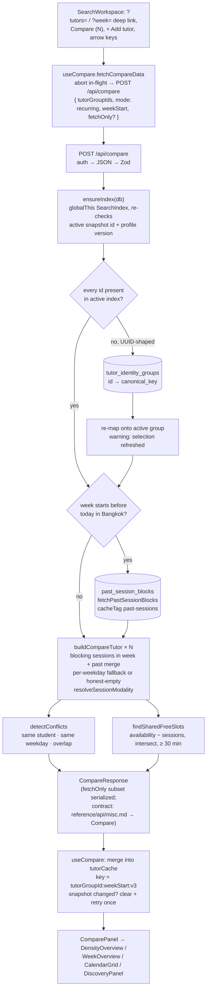

# Tutor Compare

**Status: legacy-redirect** — the standalone `/compare` page no longer renders anything of its own. It is a `"use client"` component whose only effect is `router.replace("/search?tutors=…")` (or plain `/search` when no `?tutors=` is present), wrapped in `<Suspense>` for `cacheComponents` compatibility (`src/app/(app)/compare/page.tsx:1`, `:10-17`, `:22-28`). It has no entry in the nav registry — none of the `href:` values in `src/lib/navigation/tools.ts:96-252` is `/compare`, and `src/components/layout/app-nav.tsx` never mentions it. The compare *capability*, however, is fully live: the engine (`src/lib/search/compare.ts`), both API endpoints (`src/app/api/compare/`), the client hook (`src/hooks/use-compare.ts`), and the calendar UI (`src/components/compare/`) all run inside the right-hand half of `/search`. The only other place the old path survives is the stale-snapshot banner's workspace allowlist, which still matches `/compare` and `/compare/*` (`src/components/layout/stale-snapshot-banner.tsx:18-28`).

## Purpose

Compare places one to three tutors side by side for a single Bangkok-week and answers three scheduling questions from the same payload:

1. **What is each tutor already teaching this week?** Blocking Wise sessions drawn on a Google-Calendar-style grid, in a seven-day week view or a single-day view (`src/components/compare/week-overview.tsx`, `src/components/compare/calendar-grid.tsx`).
2. **Is the same student double-booked across two of the selected tutors?** Same-student, same-weekday, overlapping sessions surface as *conflicts* (`src/lib/search/compare.ts:322-359`).
3. **When are all selected tutors simultaneously free?** *Shared free slots* — the intersection of every selected tutor's availability minus their sessions, kept when at least 30 minutes long (`compare.ts:361-405`).

A secondary **discovery** flow ("Advanced search" in the panel header, `src/components/compare/compare-panel.tsx:284-289`) ranks every other tutor in the snapshot against the tutors already on screen — data-issue-free first, then fewest conflicts, then most free slots (`src/app/api/compare/discover/route.ts:153-157`) — and lets the user add one with a single click. It is also the landing point for the "Find alt" affordance on a conflict band, which pre-fills the day and time window from the conflicting session (`calendar-grid.tsx:209-216`, `compare-panel.tsx:439-442`, `src/components/compare/discovery-panel.tsx:63-70`). A subject prefill exists only as dead code: `subjectFilter` is seeded in a `useState` initializer (`discovery-panel.tsx:45`), but `ComparePanel` mounts `DiscoveryPanel` once and merely toggles `open` (`compare-panel.tsx:490-499`), so the initializer runs with `prefillConflict = null` and the `prefillConflict` effect re-applies only `dayOfWeek`, `startTime`, `endTime`, and `filterByTime` (`:63-70`). The value it would have used — `sessionTitle.split(" — ")[0]` — equals the subject only when the Wise `title` was absent and the engine fell back to `"<subject> — <student>"` (`src/lib/search/compare.ts:351-352`).

The feature is read-only toward both Wise and Postgres: neither endpoint performs any write, and nothing in `src/components/compare/` or `src/hooks/use-compare.ts` calls a mutating route. It is reachable only by signed-in users: `/search` and `/api/compare` are absent from the middleware public-route allowlist (`src/middleware.ts:10-26`), so both fall through to the session gate (`middleware.ts:89-93`) and, for restricted users, the `allowedPages` check (`middleware.ts:96-105`).

Compare shares its data source with [Tutor Search](./tutor-search.md) and overlays local holds from [Proposals](./proposals.md); it does not own any subsystem of its own.

## Conceptual data model

Compare owns **no tables** and writes to none. It reads from three places, in decreasing order of frequency. Column-level detail lives in the database reference — see the "Tutor identity, normalization, session blocks, data health" section of [erd-core.md](../reference/database/erd-core.md) for every table named here, and [erd-tutor-profiles.md](../reference/database/erd-tutor-profiles.md) for business profiles.

1. **The in-memory `SearchIndex`** — the warm, `globalThis`-anchored singleton built from the active snapshot (`src/lib/search/index.ts:83-90`, `:94-113`). Every `IndexedTutorGroup` in it denormalizes one `tutor_identity_groups` row together with its members, qualifications, recurring availability windows, dated leaves, future session blocks, data issues, and (when present) the tutor's business profile (`index.ts:65-81`). The `canonicalKey` field was added specifically so `/api/compare` can reach past-session data without a second lookup (`index.ts:67-71`). `ensureIndex` is awaited on every compare and discover request; when a cached index exists it re-checks the active snapshot id and the tutor-profile version before returning it, and coalesces concurrent rebuilds onto one promise (`index.ts:354-401`).

2. **`tutor_identity_groups`, by id → `canonical_key`** — queried only when a requested tutor id is UUID-shaped and missing from the active index (`src/app/api/compare/route.ts:82-91`). Tutor-group UUIDs are snapshot-scoped and freshly minted on every sync — the orchestrator inserts each group with `snapshotId` + `canonicalKey` and no explicit `id` (`src/lib/sync/orchestrator.ts:111-120`), so the column's `defaultRandom()` assigns a new UUID per snapshot (`src/lib/db/schema.ts:1520`). A bookmarked `/search?tutors=…` link therefore goes stale on every Wise sync; the route maps the stale id to its `canonical_key` and back onto the active snapshot's group (`route.ts:98-107`).

3. **`past_session_blocks`, by `group_canonical_key` and `start_time` range** — read only when the requested week starts before today in Bangkok (`route.ts:185-198`; query at `src/lib/data/past-sessions.ts:40-47`). This is the one cross-snapshot table in the tutor lineage. It is *populated* by the sync pipeline, not by compare: the PAST-01 diff-hook captures sessions that were in the prior snapshot's `future_session_blocks`, have dropped out of Wise's FUTURE response, and started before now (`src/lib/sync/past-sessions-diff-hook.ts:103-153`), inserting them in chunks of 250 with `.onConflictDoNothing({ target: pastSessionBlocks.wiseSessionId })` (`:155-165`) against the `psb_wise_session_id_idx` unique index (`src/lib/db/schema.ts:2291-2292`), before the new snapshot is promoted (`past-sessions-diff-hook.ts:6-25`, `:50-65`). The fetcher is cached under `cacheTag("past-sessions")` with `cacheLife("days")` — deliberately **not** the `snapshot` tag, because captured past data is immutable once observed (`past-sessions.ts:11-19`, `:82-91`).

Two further reads sit on the page, not the API: the tutor combobox's list (`getTutorList`, cached under the `snapshot` tag for hours, built from `tutor_identity_groups` + `subject_level_qualifications` of the active snapshot — `src/lib/data/tutors.ts:55-86`) and the discovery dialog's `/api/filters` dropdown options (`discovery-panel.tsx:53-61`).

One sync-time side effect belongs to compare's code but not its request path: the orchestrator imports `detectSessionModalityConflict` from `compare.ts` and, for every future session whose `sessionType` contradicts its teacher record's online/onsite variant, writes a `conflict_model` data issue of severity `high` (`src/lib/sync/orchestrator.ts:18`, `:375-393`; predicate at `compare.ts:185-223`). Those rows surface in [Data Health](./data-health.md).

## API surface

Both endpoints are `POST`, admin-session gated, and follow the standard auth → JSON → Zod → try/catch shape. Full request/response contracts, error bodies, and status codes are in [misc.md → Compare](../reference/api/misc.md#compare); the master row list is in [api/index.md](../reference/api/index.md).

| Endpoint | Purpose |
|---|---|
| `POST /api/compare` | Build the week-scoped payload for 1–3 tutors: per-tutor sessions with resolved modality, same-student conflicts, shared free slots, snapshot metadata, and warnings. Resolves stale tutor ids through `canonical_key`; merges captured past sessions for historical weeks; with `fetchOnly`, computes over the full set but serializes only the requested subset (`src/app/api/compare/route.ts:112-254`). |
| `POST /api/compare/discover` | Rank every other indexed tutor against up to two existing selections: modality and qualification filters, an optional "free at day + time window" check (availability window ∧ no blocking session ∧ no leave), conflict count against the existing selection, and a data-issue flag (`src/app/api/compare/discover/route.ts:29-170`). |

## UI

There is no compare page. Everything below renders inside `/search`, whose async Server Component fetches filter options and the tutor list and hands them to the `"use client"` `SearchWorkspace` (`src/app/(app)/search/page.tsx:8-22`). The workspace owns one `useCompare()` instance and passes it, plus the tutor list and active proposal holds, to `ComparePanel` on the right half (`src/components/search/search-workspace.tsx:79`, `:347-353`). A fullscreen toggle collapses the search half to zero width and expands compare to full width (`search-workspace.tsx:285-292`, `:340-346`); Esc exits fullscreen (`:159-170`).

**Entry points into compare** (all on the search side):

- `?tutors=` and `?week=` deep links, read once on mount; `week` is validated as a real `YYYY-MM-DD` before use (`search-workspace.tsx:100-114`; validator `isValidWeekParam` at `:41-54` — regex at `:42`, component range check at `:46`, then a `Date.UTC` round-trip at `:47-53` that rejects impossible dates such as `2026-02-30`). Selected ids and a non-current week are mirrored back into the URL with `history.replaceState` so the page is bookmarkable without navigation (`:123-137`).
- The multi-select "Compare (N)" button in search results and the per-row single-add action (`src/components/search/search-results.tsx:62-64`, `:129-131`; wired at `search-workspace.tsx:335-336`). The bulk path clears the client cache and truncates to three ids (`search-workspace.tsx:178-182`).
- The recommended-slots hero's add-to-compare action (`src/components/search/recommended-slots.tsx:20`, `:235`; wired at `search-workspace.tsx:311`).
- Left/Right arrow keys move the week, guarded so they do nothing while an input, textarea, or contenteditable has focus (`search-workspace.tsx:140-156`).

**`ComparePanel`** (`src/components/compare/compare-panel.tsx`) is the shell:

- Header row: one colored chip per tutor with a remove button (`:260-276`), a `TutorCombobox` "+ Add tutor" while fewer than three are selected (`:277-283`), the "Advanced search" link (`:284-289`), an `N/3` counter (`:290-292`), and the fullscreen toggle (`:293-305`).
- Week bar: previous/next arrows, a click-to-open month-grid `WeekCalendar` popover on the week label, and a "Today" button that appears only when the displayed week is not the current Bangkok week (`:323-368`). Snapshot id prefix, latency, and a red "Stale" badge sit on the right (`:370-377`).
- Day tabs "Week · Mon d/m … Sun d/m" with a per-day conflict-count badge (`:381-416`).
- `DensityOverview` — one row per tutor, seven cells showing booked hours per day with a fill bar scaled to the busiest cell of the week (minimum scale one hour), plus the tutor's weekly booked hours; clicking a cell opens that day (`src/components/compare/density-overview.tsx:54-95`, `:97-165`).
- The calendar surface: `WeekOverview` when no day is active, `CalendarGrid` when one is (`compare-panel.tsx:426-456`). Both are `next/dynamic` chunks with a skeleton fallback, and the panel pre-warms both chunks as soon as a response arrives so the first week↔day switch can animate (`:29-42`, `:97-117`).
- A conflicts summary listing the first five conflicts with a "+N more" tail (`:459-477`), an empty state when nothing is selected (`:481-488`), and the `DiscoveryPanel` dialog (`:490-499`).

**`WeekOverview`** (`week-overview.tsx`) draws Mon–Sun columns from 07:00 to 21:00 at 48 px per hour (`:27-32`). With more than one tutor, each day column is split into equal tutor lanes with a faint lane tint (`:305-308`, `:402-415`). Per lane it renders: green free-gap tints where an availability window is not covered by a session (`computeFreeGaps`, `:67-88`, `:450-472`); red conflict bands spanning the column (`:437-447`); proposal-hold blocks with a lock icon (`:476-526`); and session cards laid out GCal-style — overlapping sessions get greedy sub-columns, connected via union-find so a cluster shares one column count (`computeOverlapColumns`, `:99-170`), capped at two sub-columns per lane in multi-tutor view and three in single-tutor view, with the last visible card carrying a "+N" badge that jumps to the day view (`applyColumnCap`, `:177-234`; cap at `:308`; badge `:604-618`). Each card shows a modality icon and opens a popover with student, subject, time, class type, location, modality label, and a "Conflict detected" line when applicable (`:619-651`). A sticky tutor legend pins to the top of the scroll container (`:347-373`), and a "now" line ticks every minute — only in the current week — so a tab left open across midnight re-evaluates itself (`:270`, `:276-293`, `:658-669`).

**`CalendarGrid`** (`calendar-grid.tsx`) is the single-day view at 60 px per hour (`:28-30`): one column per tutor with a sticky header whose tutor name opens `TutorProfilePopover` (`:144-161`); availability windows as a faint background (`:221-245`); conflict bands with the student name and a "Find alt" button (`:200-219`); proposal holds (`:247-306`); full-detail session cards (`:308-396`); dashed "All free" bands for shared free slots, labelled in 12-hour form by `minuteToLabel` — e.g. `9am–10:30am · All free` (`:37-43`, `:398-413`, label at `:409`); and the same today indicator (`:415-427`).

**Supporting pieces:** `TutorProfilePopover` shows weekly hours, distinct students, subjects, the editorial business profile (parent-safe summary, English proficiency, young-learner fit, strength and teaching-style tags) when one exists, and a data-issue count (`tutor-profile-popover.tsx:33-85`). `TutorCombobox` is a `cmdk` search over the tutor list excluding already-selected ids (`tutor-combobox.tsx:31-33`, `:51-89`). `WeekCalendar` is a dependency-free 6×7 Monday-first month grid with full-week highlight, hover preview, and today ring (`week-calendar.tsx:43-52`, `:88-127`). `modalityDisplay` maps resolved modality + confidence to an icon and label (`modality-display.ts:11-27`); `session-colors.ts` fixes the three lane colors (`TUTOR_COLORS`, `:51`), 28 % card fills, and 3 px solid left borders (`:26-32`, `:53-59`).

**`DiscoveryPanel`** (`discovery-panel.tsx`) is a dialog with a client-side name filter, a subject select and a mode select fed by `/api/filters`, an optional "Only show tutors free at: day · start – end" block, and a Search button (`:130-207`). It auto-searches on open when at least one tutor is already selected (`:111-115`) and always posts `mode: "recurring"` (`:78`). Each candidate card carries a "Needs review" / "N conflicts" / "No conflicts" badge, free-slot chips, and an "Add to compare" (or "Add anyway") button (`:230-281`).

## Data flow

The client hook is the choke point: every selection change, week change, and deep link funnels into one `fetchCompareData` that aborts any in-flight request, posts to `/api/compare`, merges the result into a per-week client cache, and hands a prepared `{ response, tutorChips }` back to whichever action asked (`src/hooks/use-compare.ts:116-206`).

```mermaid
flowchart TD
  A["SearchWorkspace: ?tutors= / ?week= deep link,<br/>Compare (N), + Add tutor, arrow keys"] --> B["useCompare.fetchCompareData<br/>abort in-flight → POST /api/compare<br/>{ tutorGroupIds, mode: recurring, weekStart, fetchOnly? }"]
  B --> C["POST /api/compare<br/>auth → JSON → Zod"]
  C --> D["ensureIndex(db)<br/>globalThis SearchIndex, re-checks<br/>active snapshot id + profile version"]
  D --> E{"every id present<br/>in active index?"}
  E -- "no, UUID-shaped" --> F[("tutor_identity_groups<br/>id → canonical_key")]
  F --> G["re-map onto active group<br/>warning: selection refreshed"]
  E -- yes --> H{"week starts before<br/>today in Bangkok?"}
  G --> H
  H -- yes --> I[("past_session_blocks<br/>fetchPastSessionBlocks<br/>cacheTag past-sessions")]
  H -- no --> J
  I --> J["buildCompareTutor × N<br/>blocking sessions in week + past merge<br/>per-weekday fallback or honest-empty<br/>resolveSessionModality"]
  J --> K["detectConflicts<br/>same student · same weekday · overlap"]
  J --> L["findSharedFreeSlots<br/>availability − sessions, intersect, ≥ 30 min"]
  K --> M["CompareResponse<br/>(fetchOnly subset serialized;<br/>contract: reference/api/misc.md → Compare)"]
  L --> M
  M --> N["useCompare: merge into tutorCache<br/>key = tutorGroupId:weekStart:v3<br/>snapshot changed? clear + retry once"]
  N --> O["ComparePanel → DensityOverview /<br/>WeekOverview / CalendarGrid / DiscoveryPanel"]
```

Step by step, for a request with `tutorGroupIds`, `weekStart` and optional `fetchOnly`:

1. **Auth and validation** — `auth()` → 401; `request.json()` → 400; `compareRequestSchema.safeParse` → 400 with flattened details (`route.ts:113-131`). The body contract is owned by [misc.md → Compare](../reference/api/misc.md#compare).
2. **Index and staleness** — `ensureIndex(db)`; `snapshotMeta.stale` is `now − syncedAt > 90 min`, and when stale the `STALE_SEARCH_WARNING` string is pushed onto `warnings` (`route.ts:138-149`; thresholds at `src/lib/ops/stale.ts:2`, `:4-5`).
3. **Stale-id resolution** — ids found directly in the index resolve immediately; UUID-shaped misses are looked up in `tutor_identity_groups` for their `canonical_key`, then matched to the active snapshot's group with the same key, de-duplicated, and flagged with the warning "Tutor selection was refreshed after the latest Wise sync" (`route.ts:59-110`, `:157-159`). If nothing resolves the route stops with a 404 (`route.ts:161-166`; error bodies are listed in [misc.md → Compare](../reference/api/misc.md#compare)).
4. **Week window** — `weekStart` parsed as a local date, or the current Bangkok Monday when absent; `dateRange` is `[Monday, Monday + 7)` (`route.ts:34-41`, `:169-171`).
5. **Historical merge** — if `dateRange.start` is before Bangkok start-of-today, `fetchPastSessionBlocks` is called with the selected tutors' canonical keys, sorted for cache-key determinism (`route.ts:185-198`).
6. **Per-tutor build** — `buildCompareTutor(group, weekdays, dateRange, pastBlocks)` for every resolved group (`route.ts:200-207`); see the rules below for what it keeps and what it fabricates.
7. **Cross-tutor analysis** — `detectConflicts` over all built tutors; `findSharedFreeSlots` over groups whose `sessionBlocks` have been extended with the same past blocks so a captured past session cannot read as free (`route.ts:208`, `:210-227`).
8. **Serialize** — with `fetchOnly`, only the requested tutors (after stale-id remapping) are serialized while conflicts and free slots still cover the whole selection (`route.ts:229-236`). The response shape and the 500 path (`route.ts:238-253`) are documented in [misc.md → Compare](../reference/api/misc.md#compare).

Back on the client, `useCompare` keeps a `Map<"tutorGroupId:weekStart:CACHE_VERSION", CompareTutor>` (`use-compare.ts:107`, `:170`). Adding a tutor fetches only the new id (`fetchOnly: [id]`, `:281-298`); removing one fetches nothing (`fetchOnly: []`) and only asks the server to recompute conflicts and free slots (`:267-279`). Changing week keeps the current calendar visible while the next week loads, then commits the new week and the prepared response inside one `flushSync` and prunes the cache to that week synchronously after it returns (`commitLoadedWeek`, `use-compare.ts:321-333`; `flushSync` at `:322-325`, `pruneCacheToWeek` at `:326`) — optionally inside a native View Transition of kind `week-forward` / `week-back`, skipped when arrows are pressed faster than 300 ms apart or when the user prefers reduced motion (`:300-351`; `src/lib/ui/view-transitions.ts:3`, `:12-63`; `compare-panel.tsx:176-224`). Week↔day switches preserve the scroll position as a minute-of-day so the same hour stays in view across the 48 px / 60 px scales (`compare-panel.tsx:44-46`, `:127-156`, `:226-238`).

## Business rules & edge cases

**Blocking-only, week-scoped sessions.** `buildCompareTutor` keeps a session only if `isBlocking` is true and, when a `dateRange` is given, its `startTime` falls inside the window; an optional weekday filter is applied last (`compare.ts:242-249`). Cancelled sessions are non-blocking upstream and therefore never appear on the calendar (fail-closed session classification is documented in [Tutor Search](./tutor-search.md)).

**Past and future are merged, never guessed.** When the route passes captured past blocks they are concatenated with the group's future blocks *before* filtering (`compare.ts:238-240`). The concat is unguarded — nothing de-duplicates at runtime. The accompanying D-06 comment asserts the two sets are disjoint (captured past rows started before capture time, future rows start at or after now — `compare.ts:233-237`); that is the author's invariant, not something the engine checks, so a `wise_session_id` present in both inputs would render twice.

**Weekday fallback runs only for today-or-future dates (D-05 / PAST-04).** For each weekday in scope that has no in-range session, the engine computes the calendar date of that weekday within the requested week (`computeDateForWeekdayInRange`, `compare.ts:52-61`, mirroring the client's `getWeekDate` at `use-compare.ts:75-81`). If that date is before Bangkok start-of-today the weekday stays **empty** — "honest empty" (D-09) — unless captured past data filled it (`compare.ts:255-268`). Otherwise the engine finds the *nearest future occurrence* on that weekday (`startTime >= dateRange.end`), de-duplicates by `recurrenceId`, and copies every session from that first date onto the displayed week as a representative (`compare.ts:274-289`). Each serialized session carries its true `date`, so a fallback card's date is not the displayed week's date (`compare.ts:301`). Bangkok "today" is derived via `toZonedTime` and is safe because Thailand has had no DST since 1941 (`compare.ts:27-39`).

**Modality is resolved per session, fail-closed (MOD-01 / MOD-02).** `resolveSessionModality` combines the group's `supportedModes` with the session's teacher record and normalized `sessionType` (`compare.ts:97-172`). Paired online+onsite groups need the two signals to agree for `high` confidence; agreement yields the modality, disagreement yields `unknown` + `low` with a contradiction message (D-07), and a missing `sessionType` yields the record's variant at `low` confidence (D-04) (`compare.ts:116-138`). Single-mode groups are `high` unless the `sessionType` contradicts the group's only mode, in which case they are also `unknown` + `low` (D-08) (`compare.ts:141-168`). An unresolved group (`supportedModes` empty) is always `unknown` + `low` — the pre-MOD-01 single-element fallback was deliberately removed (`compare.ts:80-82`, `:170-171`). The recognised vocab is `online|virtual|scheduled` and `onsite|in-person|offline`, case-insensitive; `scheduled` was added because the tenant labels live online sessions `SCHEDULED` (MOD-UAT-01, `compare.ts:5-7`). The UI renders `low` identically to `unknown` (a help icon with "Likely online — unconfirmed" style labels) so an inference never looks like a fact; `medium` is type-reserved but has no producer and follows the high-confidence branch (`modality-display.ts:3-27`).

**Conflicts are same-student, same-weekday, overlapping, cross-tutor.** Sessions are bucketed by lower-cased `studentName`; sessions without a student name are ignored; pairs on the same tutor or different weekdays are skipped; overlap is strict (`start < otherEnd && end > otherStart`); one conflict is emitted per student × weekday × tutor pair, spanning only the overlapping minutes; `sessionTitle` falls back to `"<subject> — <student>"` (`compare.ts:322-359`). Because matching is by weekday rather than date, a fallback (representative) session can conflict with a real one on the same weekday — intended, since both describe the tutor's recurring week.

**Shared free slots ignore leaves and fallback sessions.** `findSharedFreeSlots` subtracts each tutor's in-range blocking sessions from their availability windows, intersects the per-tutor free intervals, and keeps intersections of at least 30 minutes (`compare.ts:361-405`, threshold `:401`). If any selected tutor has no availability window on a weekday, that weekday yields nothing at all (`compare.ts:373`, `:397`). Two things it does **not** see: `dated_leaves` (leaves are neither subtracted nor rendered by compare, although they are serialized on `CompareTutor.leaves` — `compare.ts:314`) and the weekday-fallback sessions that `buildCompareTutor` fabricates, because it reads `group.sessionBlocks` with the same date filter and never sees the representative copies (`compare.ts:374-381`). In the day view this means an "All free" band can overlap a representative card on a future weekday whose real session is next week. The week view's per-tutor green gaps do not have this problem — they are computed client-side from the serialized sessions (`week-overview.tsx:67-88`, `:450-453`).

**`sharedFreeSlots` is rendered only in the day view.** `WeekOverview` declares and destructures the prop but never reads it (`week-overview.tsx:242`, `:253`); `CalendarGrid` is the only renderer (`calendar-grid.tsx:113-116`, `:398-413`).

**Snapshot-scoped ids recover, and the client trusts the server's remap.** When the server returns tutors under different ids than requested, the hook detects that fewer cache hits than returned tutors exist and adopts the returned list wholesale so old links keep working (`use-compare.ts:178-184`). If the snapshot id changes between two requests, the hook clears its cache and retries once without `fetchOnly`; a second change surfaces "Snapshot changed during fetch. Please retry." instead of looping (`use-compare.ts:153-165`). `CACHE_VERSION` is `"v3"` and must be bumped whenever a client-cached shape changes; its history records the MOD-01 modality fields, the PAST-01 semantic change, and the `tutorCanonicalKey` addition for proposal holds (`src/lib/search/cache-version.ts:9-24`).

**Discovery ranks against the whole future horizon, not the displayed week.** The discover route builds `CompareTutor`s with no `dateRange` (`discover/route.ts:69`, `:127`), so candidate conflict counts cover every future session in the snapshot, and it resolves existing ids directly against the index with no stale-id fallback (`:65-68`). Its "free at" check requires an availability window that fully contains the slot and matches the requested mode (`both` counts for either) (`:172-186`), no blocking session — matched by Bangkok calendar date in `one_time` mode and by weekday in `recurring` mode (`:188-207`) — and no leave, where leaves longer than 24 h are walked day by day and shorter ones compared by minute-of-day (`:209-242`). Date keys use UTC accessors because index timestamps are already Bangkok wall-clock values (`:249-257`). A candidate is flagged `hasDataIssues` when the group has any data issue **or** its modality is unresolved (`:134-138`), and the card offers "Add anyway" rather than "Add to compare" for those (`discovery-panel.tsx:272-276`).

**Hard limits.** Three tutors maximum — enforced by the schema (`route.ts:25`), by `addTutor` (`use-compare.ts:283`), by the bulk-add truncation (`search-workspace.tsx:181`), and by hiding the combobox at three (`compare-panel.tsx:277`). Discovery accepts at most **two** existing ids (`discover/route.ts:13`), yet the panel always passes every selected id (`compare-panel.tsx:496`) — with three tutors selected, "Advanced search" will receive a 400 from the server.

**Validated but unused inputs on `/api/compare`.** `mode` is required by the schema but never read by the handler — its only occurrence in the file is the schema line (`route.ts:26`, destructure at `:133`). `dayOfWeek` and `date` are honoured (`route.ts:173-178`), but `date` is turned into a weekday with `new Date(date).getDay()`, which is host-timezone dependent (`:177`); the production client never sends either, always posting `mode: "recurring"` with `weekStart` (`use-compare.ts:135-145`).

**Proposal holds are an overlay, not data.** Both calendars receive `proposalHolds` as an explicit prop and match holds to a tutor by `tutorCanonicalKey`, then by weekday for recurring holds or exact date for one-time holds (`week-overview.tsx:481-485`, `calendar-grid.tsx:252-256`). Holds never enter `/api/compare` and never affect conflicts or free slots; see [Proposals](./proposals.md).

**Restricted-user API namespace.** The middleware maps a page grant `/search` to the API namespace `/api/search`, not `/api/compare` (`middleware.ts:59-66`). A restricted user whose `allowedPages` contains only `/search` can load the page but will get `403` from `/api/compare` and `/api/compare/discover` (`middleware.ts:97-100`).

## Tests

All compare tests run in the default `unit` Vitest project except the sync-side integration test noted last. Counts are `it(` blocks per file.

| File | Cases | What it covers |
|---|---:|---|
| `src/lib/search/__tests__/compare.test.ts` | 37 | `buildCompareTutor` weekday filter, full-week, `weeklyHoursBooked`, `studentCount`, online-variant tagging, unresolved-group fail-closed (`:23-103`); the full 19-case `resolveSessionModality` matrix plus the "never emits medium" guard, including the uppercase `SCHEDULED`/`OFFLINE` tenant vocab (`:105-415`); `detectConflicts` arity, positive, different-student, and non-overlap cases (`:417-451`); `findSharedFreeSlots` intersection (`:453-463`); and the Phase 7 past+future merge suite with a frozen clock at 2026-04-15 Bangkok covering historical, current, and future weeks, honest-empty, backward compatibility, and conflicts across merged data (`:465-753`). |
| `src/app/api/compare/__tests__/route.test.ts` | 6 | 401, 400, 200 response shape, stale-id resolution through `canonical_key` with its warning, the 90-minute stale threshold on `snapshotMeta`, and 500 when `ensureIndex` throws. |
| `src/app/api/compare/discover/__tests__/route.test.ts` | 9 | 401, 400 when Zod rejects the body — the failing input is a three-element `existingTutorGroupIds` (`:74-83`), 200 shape, stale threshold, one-time matching by Bangkok date (two cases), modality-window matching, leave exclusion, and 500. |
| `src/components/compare/__tests__/density-overview.test.tsx` | 5 | `buildDensityRows` aggregation and zero-fill, `weeklyHoursBooked` passthrough, static-markup rendering with text-equivalent labels, and a source guard that the component stays read-only and not color-only. |
| `src/components/compare/__tests__/modality-display.test.ts` | 4 | High/low/unknown label matrix and the intentional medium-follows-high branch. |
| `src/components/compare/__tests__/view-transitions-source.test.ts` | 10 | Source-grep guardrails: no experimental `viewTransition` flag, no animation dependencies, scoped transition CSS with reduced-motion rules, `ComparePanel` wiring through `flushSync` and the minute-of-day scroll conversion, `useCompare` staying off `next/navigation`, cache pruning and abort handling, pending-week arrow semantics, and `CACHE_VERSION === "v3"`. |
| `src/lib/data/__tests__/past-sessions.test.ts` | 9 | `fetchPastSessionBlocksUncached` bucketing and null → `undefined` mapping, plus grep assertions that the cached wrapper tags `past-sessions` exactly once, uses `cacheLife("days")`, never references the `snapshot` tag, and never calls `revalidateTag`. |
| `src/lib/sync/__tests__/past-sessions-diff-hook.integration.test.ts` | — | Integration coverage of the hook that populates `past_session_blocks`: capture of dropped past sessions, idempotency on the `wise_session_id` unique constraint, future sessions never captured, and an orphan `groupId` emitting a completeness issue without abort (`:23-29`). Runs against a `postgres:16-alpine` Testcontainers instance via `startTestDb` (`:3`, `:11-13`; `src/tests/integration/db-helper.ts:1`, `:27-31`), or an external scratch database when `TEST_DATABASE_URL` is set (`db-helper.ts:19-26`). In the `integration` project, `npm run test:integration`. |

Not covered by automated tests: `WeekOverview` and `CalendarGrid` rendering (overlap sub-columns, column cap and "+N" overflow, conflict bands, holds, today indicator), `DiscoveryPanel`, `TutorCombobox`, `WeekCalendar`, `useCompare`'s runtime behaviour beyond source greps, and the `/compare` redirect itself.

## Open questions

- **Is `/compare` meant to be deleted, or kept indefinitely as a redirect?** The page has been a redirect since the 2026-04-08 UX refresh (`git log -- src/app/(app)/compare/page.tsx`: `70cfa06`, then `d91f8bc` adding the Suspense wrapper). The stale-snapshot banner still allowlists the path (`stale-snapshot-banner.tsx:25-26`), which is harmless but suggests nobody has decided.
- **Should the redirect preserve `?week=`?** It forwards only `?tutors=` (`page.tsx:11-16`), so an old `/compare?tutors=…&week=…` bookmark lands on the current week.
- **Should shared free slots subtract leaves?** `findSharedFreeSlots` ignores `dated_leaves` entirely (`compare.ts:361-405`) while discovery does check leaves (`discover/route.ts:113-121`). Either the omission is intentional (leaves are rare enough that the day-view band is advisory) or it is a fail-closed gap.
- **Should shared free slots account for weekday-fallback sessions?** The day view can show an "All free" band across a representative card on a future weekday (`compare.ts:374-381` vs `:274-289`). If the representative is meant to be trusted, the free-slot computation should see it.
- **Is `WeekOverview`'s unused `sharedFreeSlots` prop a dropped feature or a planned one?** It is accepted and destructured but never rendered (`week-overview.tsx:242`, `:253`).
- **Discovery with three tutors selected returns 400.** `existingTutorGroupIds` is capped at two (`discover/route.ts:13`) but the panel passes all selected ids (`compare-panel.tsx:496`). Should the "Advanced search" link be hidden at three, or the cap raised?
- **Should `/api/compare` drop `mode`, `dayOfWeek`, and `date`?** `mode` is validated and never read (`route.ts:26`, `:133`); `date` uses host-TZ `getDay()` (`:177`); the client never sends any of them. They look like leftovers from a pre-week-picker design.
- **Discovery ranks conflicts over the whole future horizon** (`discover/route.ts:69`, `:127`) rather than the displayed week. Is that the intended signal for "will adding this tutor cause problems", or should it be week-scoped like the main payload?
- **Are restricted users expected to reach compare?** A page grant of `/search` does not open `/api/compare` (`middleware.ts:59-66`). Whether any restricted user is meant to use the compare half of `/search` — and if so whether `/compare` belongs in their `allowedPages` — is a product decision the code does not record.
- **Discovery's `curriculum` and `level` filters have no UI.** The endpoint validates and applies them (`discover/route.ts:20-26`, `:85-93`) but the panel only ever sends `subject` (`discovery-panel.tsx:80-82`).
- **Is the "Find alt" subject prefill meant to work?** `subjectFilter` is seeded from `prefillConflict` only in a `useState` initializer (`discovery-panel.tsx:45`), which never re-runs because the dialog stays mounted (`compare-panel.tsx:490-499`), and the effect that re-applies prefill omits it (`discovery-panel.tsx:63-70`). Either the effect should set `subjectFilter` too — ideally from `conflict.tutorB` session data rather than by splitting `sessionTitle` — or the initializer is a leftover to delete.

_Verified against main@0cd1e81 (clean tree) on 2026-09-02._
