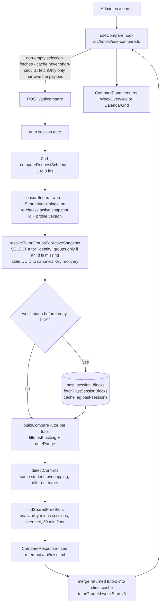

# Tutor Compare

The standalone `/compare` page is a client-side redirect to `/search` (`src/app/(app)/compare/page.tsx:10-17`) and is absent from the nav (`src/components/layout/app-nav.tsx`). The compare *engine* (`src/lib/search/compare.ts`), both API endpoints, and the full calendar UI are live — they just live inside the search workspace now. No maturity badge is asserted here; see [Open questions](#open-questions).

## Purpose

Tutor Compare places 1–3 tutors side by side for one Bangkok week and answers three operational questions at a glance:

1. **What is each tutor already teaching this week?** — a Google-Calendar-style grid of their blocking sessions, in week view or single-day view.
2. **Is the same student double-booked across two of the selected tutors?** — same-student overlapping sessions are surfaced as *conflicts*.
3. **When are all selected tutors simultaneously free?** — *shared free slots*, the intersection of every selected tutor's unbooked availability.

A secondary **discovery** flow ("Advanced search") proposes additional tutors to add, pre-ranked by data health, conflict count, and free-slot availability against the tutors already on screen. The dialog exposes a subject select, a mode select, and an optional day + start/end time window (`src/components/compare/discovery-panel.tsx:138-196`), plus a purely client-side name filter over the returned candidates (`discovery-panel.tsx:117-119`). `curriculum` and `level` are validated and honoured by the endpoint but have no UI control — see [Open questions](#open-questions).

Compare is reachable only to signed-in users: neither `/search` nor `/api/compare` is on the public-route allowlist, so both fall through to the session gate (`src/middleware.ts:4-20`, `63-75`), and a user with a restricted `allowedPages` set is filtered further (`middleware.ts:78-82`). Compare is read-only: it never writes to Wise and never writes to Postgres.

## Conceptual data model

Compare **performs no writes** — but it is not database-free. *Session data* is served from the warm in-memory `SearchIndex` singleton (built once from the active snapshot and rebuilt when the snapshot id or tutor-profile version changes, `src/lib/search/index.ts:354-401`). Every compare request still issues at least one query: whenever a cached index exists, `ensureIndex` re-checks the active snapshot id and the tutor-profile version before returning it (`index.ts:366-375`, `getTutorProfileVersion` at `index.ts:128-137`), and the route awaits it on every call (`src/app/api/compare/route.ts:138`). Two further reads are conditional — a `tutor_identity_groups` lookup when a requested ID is missing from the index (`route.ts:83-91`) and `past_session_blocks` for historical weeks (`route.ts:189-198`).

Conceptually it reads:

- **Tutor identity groups and their member Wise teacher records** — the "one real person" grouping. Supplies display name, `supportedModes`, and the per-session online/onsite resolution (a paired group has both an online and an onsite Wise record; each indexed record's `isOnline` is populated from the member row's `is_online_variant` column, `src/lib/search/index.ts:280`, column at `src/lib/db/schema.ts:1534`).
- **Subject/level qualifications** — shown on the tutor header and used by the discovery filters.
- **Recurring availability windows** — the weekday/time/modality windows that shared free slots and the green "free gap" tint are computed from.
- **Dated leaves** — used by discovery to reject a candidate slot; also serialized onto each compare tutor.
- **Future session blocks** — the booked sessions rendered in the grid and matched for conflicts. The bulk of compare's payload.
- **Past session blocks** — the only *data* table compare reads outside the index, and the only table it reads cross-snapshot *by design* (keyed by `group_canonical_key`, not by `snapshot_id`). The sync's diff hook captures every prior-snapshot session block that is absent from the new Wise fetch **and** whose `startTime` is already past (`src/lib/sync/past-sessions-diff-hook.ts:110-119`), writing it into this table (`:116-165`, idempotent via `ON CONFLICT DO NOTHING` on `wise_session_id`) at orchestrator step 9.5, deliberately ahead of the atomic promotion in step 12 (`src/lib/sync/orchestrator.ts:400-407` vs `:472-501`). That condition is all the code guarantees — *why* a session leaves the Wise FUTURE response (it started, or it was deleted/hard-cancelled upstream) is not observable from this repo. Compare reads the captured blocks back only when the requested week starts before today. (The stale-ID lookup described under [Business rules](#business-rules--edge-cases) also crosses snapshots, but incidentally rather than by design.)
- **Tutor business profiles** — optional editorial context attached to the group's `canonicalKey` and surfaced in the tutor popover. Owned by [Tutor Profiles](./tutor-profiles.md).
- **Proposal holds** — local tentative holds are overlaid on the calendar as a decoration; they come from the [Proposals](./proposals.md) feature, not from compare's own payload.

Column-level definitions, indexes, and relationships: [`docs/reference/database/erd-core.md`](../reference/database/erd-core.md) (identity groups, qualifications, availability windows, leaves, future/past session blocks) and [`docs/reference/database/erd-tutor-profiles.md`](../reference/database/erd-tutor-profiles.md) (business profiles).

## API surface

Both endpoints require an authenticated Auth.js session and validate their body with Zod. Full request/response contracts: [`docs/reference/api/misc.md`](../reference/api/misc.md).

- **`POST /api/compare`** — answers the three questions above for 1–3 tutors across one Bangkok week (`src/app/api/compare/route.ts:112`). Field-by-field request/response shape: [`misc.md`](../reference/api/misc.md).
- **`POST /api/compare/discover`** — rank candidate tutors to add, with conflicts against the already-selected tutors pre-computed (`src/app/api/compare/discover/route.ts:29`).

The discovery dialog also consumes `GET /api/filters`, owned by search, to populate its subject dropdown (`src/components/compare/discovery-panel.tsx:55`, contract in [`misc.md`](../reference/api/misc.md)).

Proposal holds are **not** fetched by compare at all. `SearchWorkspace` calls `GET /api/proposals/active` (`src/components/search/search-workspace.tsx:237-253`, contract in [`proposals.md`](../reference/api/proposals.md)) and hands the result down as the `proposalHolds` prop (`search-workspace.tsx:352`); `ComparePanel` only forwards that prop to `WeekOverview`/`CalendarGrid` (`src/components/compare/compare-panel.tsx:57`, `69`, `438`, `451`).

## UI

| Route | What it is |
|---|---|
| `/search` | The live compare experience. `src/app/(app)/search/page.tsx` is an async Server Component that pre-loads filter options + the tutor list and renders `<SearchWorkspace>`; the right half of that split is `<ComparePanel>` (`src/components/search/search-workspace.tsx:341-354`). |
| `/compare` | Client-side redirect only. Reads `?tutors=` and `router.replace`s to `/search` (`src/app/(app)/compare/page.tsx:10-17`). Not present in `AppNav`. |

Key components, all under `src/components/compare/`:

- **`compare-panel.tsx`** — the shell: tutor chips (max 3), "+ Add tutor" combobox, "Advanced search" trigger, fullscreen toggle, week picker (prev/next/Today plus a month-grid `WeekCalendar` popover), Week + per-day tabs with conflict-count badges, and the conflicts summary list. Week and day switches both run through scoped View Transitions, but they preserve scroll differently. The **Week↔Day zoom switch** converts `scrollTop` into a minute-of-day and back, because pixels-per-hour differs between the two views (`compare-panel.tsx:226-238`, helpers at `:127-156`). **Week navigation** (prev/next/Today/calendar pick) does not change zoom level, so it captures the raw `scrollTop` of the currently-visible view and restores that same pixel value (`compare-panel.tsx:194`, passed as `capturedScrollTop`/`restoreScrollTop` at `:200-201`, restorer at `:158-174`).
- **`week-overview.tsx`** — the 7-day Mon→Sun grid (07:00–21:00, 48px/hour). Owns free-gap tinting, GCal-style overlap sub-columns, the sub-column cap with "+N" overflow, per-tutor lane tints, conflict bands, and the today indicator.
- **`calendar-grid.tsx`** — the single-day view (60px/hour) with one column per tutor, availability shading, per-session modality icon + popover, an "All free" band per shared free slot, and a "Find alt" action on each conflict that opens discovery pre-filled.
- **`density-overview.tsx`** — a compact per-tutor × 7-day booked-minutes heat strip above the calendar; each cell is a button that jumps to that day.
- **`discovery-panel.tsx`** — the "Advanced search" dialog over `POST /api/compare/discover`.
- **`week-calendar.tsx`**, **`tutor-combobox.tsx`**, **`tutor-profile-popover.tsx`**, **`session-colors.ts`**, **`modality-display.ts`**, **`tutor-selector.tsx`** (type/color re-export only).

The compare *selection*, the current week, the last response, and the tutor cache live in the `useCompare` hook (`src/hooks/use-compare.ts`). Presentation-local state stays in the components: `ComparePanel` owns the calendar popover flag and the scroll / pending-week refs (`compare-panel.tsx:71`, `91-95`); `WeekOverview` and `CalendarGrid` each own a per-minute "now" ticker for the today indicator (`week-overview.tsx:260-292`, `calendar-grid.tsx:73-105`); `DiscoveryPanel` owns all of its filter and result state (`discovery-panel.tsx:40-51`); `SearchWorkspace` owns the fullscreen flag (`search-workspace.tsx:90`).

## Data flow

**The client cache never saves a round trip.** Every interaction that renders compare data hits the server: `fetchCompare`, `replaceCompare`, `changeWeek`, and the deep-link mount effect all funnel into `fetchCompareData`, which never consults the cache before fetching (`src/hooks/use-compare.ts:116-145`). The cache is read only *after* the response arrives, to re-assemble the full tutor list from previously fetched tutors (`use-compare.ts:169-184`) so the *next* request can be narrowed with `fetchOnly` (`use-compare.ts:278`, `295`) — it saves payload, never a round trip. `replaceCompare` even clears the cache before fetching (`use-compare.ts:244`). Session data is then index-served; a historical week additionally reads `past_session_blocks`.

Several interactions short-circuit before any fetch, so "every interaction" is not the same as "every action": removing the *last* tutor aborts the in-flight request, clears the cache, and nulls the response with no POST (`use-compare.ts:271-276`); `changeWeek` returns early when the target week equals the current week or when nothing is selected (`use-compare.ts:301-304`, `306-309`); `replaceCompare` with an empty id list commits the week and clears state without fetching (`use-compare.ts:247-252`); and `fetchCompareData` itself returns `null` for an empty id list (`use-compare.ts:121-123`).

```mermaid
flowchart TD
    U[Admin on /search] --> H[useCompare hook<br/>src/hooks/use-compare.ts]
    H -->|"non-empty selection fetches - cache never short-circuits; fetchOnly only narrows the payload"| R[POST /api/compare]

    R --> A[auth session gate]
    A --> Z[Zod compareRequestSchema - 1 to 3 ids]
    Z --> I[ensureIndex - warm SearchIndex singleton<br/>re-checks active snapshot id + profile version]
    I --> S[resolveTutorGroupsForActiveSnapshot<br/>SELECT tutor_identity_groups only if an id is missing<br/>stale UUID to canonicalKey recovery]
    S --> W{"week starts before today BKK?"}
    W -->|yes| P[(past_session_blocks<br/>fetchPastSessionBlocks<br/>cacheTag past-sessions)]
    W -->|no| B
    P --> B[buildCompareTutor per tutor<br/>filter isBlocking + dateRange]
    B --> C[detectConflicts<br/>same student, overlapping, different tutors]
    C --> F[findSharedFreeSlots<br/>availability minus sessions, intersect, 30 min floor]
    F --> O[CompareResponse - see reference/api/misc.md]
    O --> M[merge returned tutors into client cache<br/>tutorGroupId:weekStart:v3]
    M --> H
    H --> V[ComparePanel renders WeekOverview or CalendarGrid]
```

Ordering that matters:

1. **`ensureIndex` runs first** and the index is the only source of future sessions; Wise is never called on this path. The freshness check itself is a database round trip, so "index-served" does not mean "query-free" (`src/lib/search/index.ts:366-375`).
2. **Past blocks are merged before filtering** inside `buildCompareTutor` (`src/lib/search/compare.ts:238-249`), so historical weeks are conflict-checked against real captured history.
3. The route **pre-merges past blocks into a cloned group** before calling `findSharedFreeSlots` (`src/app/api/compare/route.ts:215-221`), because that function reads `group.sessionBlocks` directly and would otherwise report a tutor as free during a captured past session.
4. **`fetchOnly` narrows serialization, not computation** (`src/app/api/compare/route.ts:229-236`): conflicts and free slots are always computed over the full selection, but only the requested subset is sent back. Adding one tutor therefore costs one tutor's payload; removing one sends `fetchOnly: []` and returns conflicts/free-slots only (`src/hooks/use-compare.ts:278`, `295`).

## Business rules & edge cases

**Fail-closed modality.** `resolveSessionModality` never guesses. A paired group whose `sessionType` contradicts the teacher record's `isOnline` flag — the indexed mirror of the member row's `is_online_variant` (`src/lib/search/compare.ts:113`, `src/lib/search/index.ts:280`) — returns `unknown` + `low` confidence plus a contradiction message (`compare.ts:124-133`); the same applies to a single-record group contradicted by `sessionType` (`compare.ts:141-168`). A group with empty `supportedModes` is `unknown`/`low` regardless of any other signal — the old silent single-mode fallback was deliberately deleted (`compare.ts:170-171`). `"scheduled"` is treated as online vocabulary for this tenant (`compare.ts:5-7`). In the UI, `low` confidence borrows `unknown`'s *icon* but not its *label*: `low` + `online`/`onsite` renders a `HelpCircle` labelled "Likely online — unconfirmed" / "Likely onsite — unconfirmed", while `unknown` renders the same icon labelled "Unknown" (`src/components/compare/modality-display.ts:15-22` vs `:26`). So an inference is disclosed in the popover, but never carries the `Video`/`MapPin` iconography that signals a confirmed fact. A *contradiction* is a different case — it resolves to `modality: "unknown"` (`compare.ts:125-133`, `:141-168`) and therefore reads as plain "Unknown" in the UI. The same contradiction logic is re-exposed as `detectSessionModalityConflict` and called during sync so contradictions land in `data_issues` as `conflict_model` rows (`src/lib/sync/orchestrator.ts:375`).

**Only blocking sessions are drawn.** `buildCompareTutor` drops everything with `isBlocking === false` (`src/lib/search/compare.ts:242-243`). That flag is decided once at sync time from Wise's `meetingStatus` — `CANCELLED`/`CANCELED` (along with `COMPLETED`/`MISSED`/`NO_SHOW`) are non-blocking, and an unrecognised status stays blocking, fail-closed (`src/lib/normalization/sessions.ts:34-51`, applied at `:81`) — then persisted per session block (`src/lib/sync/orchestrator.ts:295`) and read straight back into the index (`src/lib/search/index.ts:205`, `299`). So a cancelled Wise session never reaches the grid or conflict detection.

**Weekday fallback is per-weekday and past-aware (D-05).** For a weekday inside the requested range with no data, compare substitutes the *nearest future occurrence* of that weekday's recurring session, deduped by `recurrenceId` (`compare.ts:274-289`). That fallback is disabled for any weekday whose calendar date is before today in Bangkok (`compare.ts:267-268`) — a past day renders honestly empty unless real captured history exists. Consequence: for today-or-future days a card may represent a *recurrence*, not a confirmed booking on that exact date.

**Historical weeks read a different table.** The trigger is `dateRange.start < startOfTodayBkk` (`src/app/api/compare/route.ts:185-186`). Both sides are midnight-normalized — `parseMondayDate` builds a local-midnight `Date` (`route.ts:43-46`) and `getStartOfTodayBkk` builds local midnight from the Bangkok year/month/day (`src/lib/search/compare.ts:36-39`) — and the comparison is **strict**. So on a Monday the current week's start *equals* today and the week is **not** historical; no `past_session_blocks` read happens that day. The current week counts as historical only Tuesday through Sunday. Canonical keys are sorted before the fetch so the cache key is order-independent (`route.ts:192`). The past-sessions cache is deliberately tagged `past-sessions`, *not* `snapshot`, so the sync's `revalidateTag("snapshot", { expire: 0 })` (`src/lib/sync/run-wise-sync.ts:161`) cannot evict immutable captured history — rationale at `src/lib/data/past-sessions.ts:10-15`, the `cacheTag`/`cacheLife` calls at `:87-89`. One-time past sessions that were never captured are unrecoverable.

**Snapshot-scoped IDs survive a sync.** Tutor group UUIDs change on every snapshot promotion. If a requested ID is missing from the active index, the route looks it up in `tutor_identity_groups` and re-resolves it through `canonicalKey`, pushing a "Tutor selection was refreshed after the latest Wise sync" warning (`src/app/api/compare/route.ts:61-110`, `157-159`). That table is snapshot-scoped (`snapshotId` FK, `src/lib/db/schema.ts:1516-1525`) and the lookup filters on `id` alone (`route.ts:83-91`), so the query intentionally reads rows belonging to *prior* snapshots — the recovery only works because it does. Only well-formed UUIDs are looked up (`route.ts:59`, `82`). The client treats returned IDs as authoritative when its cache under-fills, so old `?tutors=` links recover instead of rendering empty (`src/hooks/use-compare.ts:180-184`). If nothing resolves, the route returns 404 (`route.ts:161-166`).

**Conflicts are same-student, cross-tutor, overlapping only.** Matching is on lowercased `studentName`, same weekday, strict interval overlap, and different tutor indices; each unordered tutor pair per student per weekday is emitted once (`src/lib/search/compare.ts:322-357`). Sessions without a student name are skipped entirely (`compare.ts:328`).

**Shared free slots ignore leaves.** `findSharedFreeSlots` subtracts blocking sessions from availability windows, intersects across tutors, and keeps intersections of ≥ 30 minutes (`compare.ts:361-405`, threshold at `:401`). If any selected tutor has no availability window on a weekday, that whole weekday yields nothing (`compare.ts:397`). Leaves are *not* subtracted here — discovery does check leaves (`src/app/api/compare/discover/route.ts:113-121`, `209-242`), but the shared-free-slot band does not. See [Open questions](#open-questions).

**Client cache is versioned and snapshot-guarded.** Entries are keyed `tutorGroupId:weekStart:CACHE_VERSION` (`src/hooks/use-compare.ts:170`) with `CACHE_VERSION = "v3"` (`src/lib/search/cache-version.ts`). A snapshot-id change clears the cache and triggers exactly one full refetch; a second change during that retry surfaces "Snapshot changed during fetch. Please retry." rather than recursing (`use-compare.ts:153-165`). Every fetch aborts the previous in-flight request (`use-compare.ts:126-128`), and committing a week prunes all other weeks from the cache (`use-compare.ts:229-236`).

**Staleness warns, never withholds.** `snapshotMeta.stale` is true past 90 minutes since the last sync and appends `STALE_SEARCH_WARNING`; data is still returned (`src/app/api/compare/route.ts:141-149`, `src/lib/ops/stale.ts:1-6`). The panel shows a "Stale" badge alongside the snapshot prefix and latency (`src/components/compare/compare-panel.tsx:370-377`).

**Selection caps.** Compare accepts 1–3 tutor IDs (`src/app/api/compare/route.ts:25`); discovery accepts at most 2 already-selected IDs, since it is meant to fill the third slot (`src/app/api/compare/discover/route.ts:13`). The UI hides the combobox at 3 (`compare-panel.tsx:277`) and `addTutor` is a no-op beyond 3 (`use-compare.ts:283`).

**Data issues demote, they never drop.** Candidates with data issues or unresolved modality are flagged `hasDataIssues` with human-readable reasons and sorted last — never silently removed (`src/app/api/compare/discover/route.ts:134-138`, `153-157`). That rank-only treatment is specific to the data-health signal: discovery *does* hard-exclude on three axes before ranking — tutors already selected (`discover/route.ts:79`), `modeFilter` against `supportedModes` whenever it is not `"either"` (`:81-83`), and any of `filters.subject`/`curriculum`/`level` against the group's qualifications (`:85-93`). Sort order is data-health → fewest conflicts → most free slots. A candidate only earns a free slot when it has a modality-matching availability window *and* no blocking session *and* no leave overlap (`discover/route.ts:97-125`).

**Calendar rendering caps.** Overlapping sessions get greedy sub-columns joined into clusters by union-find (`src/components/compare/week-overview.tsx:99-170`), then capped at 3 sub-columns for a single tutor and 2 when multiple tutors share the grid; hidden sessions become a "+N" overflow count on the last visible card (`week-overview.tsx:177-233`, cap at `:308`). The grid is fixed to 07:00–21:00 (`week-overview.tsx:28-30`, `calendar-grid.tsx:29-31`), so any session outside that band is not drawn.

**Deep links and keyboard.** `/search?tutors=a,b&week=YYYY-MM-DD` is honored on mount, with `week` validated by a round-trip through `Date.UTC` so `2026-02-31` is rejected (`src/components/search/search-workspace.tsx:41-54`, `100-114`). Selection and non-default week are mirrored back into the URL via `history.replaceState` (no navigation) (`search-workspace.tsx:123-137`). ArrowLeft/ArrowRight change week unless focus is in a text input (`search-workspace.tsx:140-156`). The `/compare` redirect forwards `?tutors=` but **not** `?week=` (`src/app/(app)/compare/page.tsx:11-16`).

**Timezone.** "Now", "today", and "this Monday" all go through `toZonedTime(..., "Asia/Bangkok")` (`src/lib/search/compare.ts:36-39`, `src/app/api/compare/route.ts:34-41`, `src/hooks/use-compare.ts:43-50`). Thailand has no DST, so the wall-clock arithmetic that follows is safe.

## Tests

| File | Covers |
|---|---|
| `src/lib/search/__tests__/compare.test.ts` (753 lines) | `buildCompareTutor` weekday filtering, `weeklyHoursBooked`, distinct `studentCount`; a 19-case `resolveSessionModality` truth matrix including every contradiction branch, the unresolved-group fail-closed case, uppercase tenant vocabulary (`SCHEDULED`/`OFFLINE`), and an assertion that no `medium` confidence is ever emitted; `detectConflicts` positive/negative cases; `findSharedFreeSlots`; and the past+future merge suite — historical week with captured data, historical week with none (honest empty), future-week fallback preserved, mixed current week (per-weekday D-05), backward compatibility without `pastBlocks`, and conflicts spanning merged past+future sessions. |
| `src/app/api/compare/__tests__/route.test.ts` | 401 unauthenticated, 400 on Zod failure, 200 response shape, stale-ID resolution through canonical keys after a snapshot promotion, the 90-minute stale flag, and 500 when `ensureIndex` throws. |
| `src/app/api/compare/discover/__tests__/route.test.ts` | 401/400/200 shapes, stale metadata, one-time discovery not blocked by same-weekday sessions on other dates, Bangkok-calendar-date matching for one-time blocks, availability-window modality matching, leave-overlapping slots suppressed, and 500 on index failure. |
| `src/components/compare/__tests__/density-overview.test.tsx` | `buildDensityRows` aggregation, zero-fill rows, `weeklyHoursBooked` labels, and that the rendered markup carries text equivalents rather than colour-only signalling. |
| `src/components/compare/__tests__/modality-display.test.ts` | High/low/medium display branches and the documented medium fallback. |
| `src/components/compare/__tests__/view-transitions-source.test.ts` | Source-level guardrails: no animation dependencies, scoped transition CSS + reduced-motion rules, `ComparePanel` wired through the native helpers with `flushSync`, minute-of-day scroll normalization, rapid-arrow navigation based on the pending target week, and `CACHE_VERSION` stability. |

Run with `npm test`.

## Open questions

- **Should shared free slots subtract leaves?** `findSharedFreeSlots` (`src/lib/search/compare.ts:361-405`) considers only availability windows and blocking sessions, while `/api/compare/discover` explicitly rejects leave-overlapping slots (`src/app/api/compare/discover/route.ts:113-121`). A tutor on approved leave can therefore appear inside an "All free" band in the day view. Intentional simplification or a fail-closed gap?
- **Which request fields are dead?** Three on `POST /api/compare` and two on discover. `mode` is required by `compareRequestSchema` (see the request-body table in [`misc.md`](../reference/api/misc.md); source `src/app/api/compare/route.ts:26`) but the handler never destructures it (`route.ts:133`) and the client hard-codes `"recurring"` (`src/hooks/use-compare.ts:140`). `dayOfWeek`/`date` are accepted and *would* narrow the response to a single weekday (`route.ts:173-178`), but no in-repo caller sends them. Discovery has the same shape: `filters.curriculum` and `filters.level` are validated (`src/app/api/compare/discover/route.ts:20-26`) and honoured server-side (`discover/route.ts:85-93`), yet the dialog only ever sends `filters.subject` (`src/components/compare/discovery-panel.tsx:76-89`). Keep them for external callers, wire up UI, or drop?
- **Should `/compare` forward `?week=` too, or be deleted?** The redirect preserves only `?tutors=` (`src/app/(app)/compare/page.tsx:11-16`), so a bookmarked week is silently lost. How long must the legacy route stay?
- **`new Date(date).getDay()` is host-timezone dependent.** Both routes derive a weekday from a bare `YYYY-MM-DD` string this way (`src/app/api/compare/route.ts:177`, `src/app/api/compare/discover/route.ts:71`), which parses as UTC midnight and then reads the weekday in the *server's* local zone. Correct on Vercel (UTC) but divergent under a Bangkok-local process. Worth normalizing?
- **Historical trigger granularity.** `isHistoricalRange` fires whenever the week's Monday is strictly before today (`route.ts:186`), so from Tuesday onward every mid-week view pays the `past_session_blocks` read even when the user is only looking at future days — while on a Monday the current week never reads captured history at all. Acceptable, or should the trigger be per-weekday like the fallback already is?
- **Modality contradictions never surface in compare's own UI.** They are written to `data_issues` during sync and folded into the `/data-health` "Modality issues" number by `selectModalityIssues`, which counts `conflict_model` rows alongside legacy `modality` rows (`src/app/api/data-health/modality-counter.ts:19-31`, filter at `:25`), but inside compare a contradiction is indistinguishable from "no signal": a contradiction resolves to `unknown` (`src/lib/search/compare.ts:125-133`, `:141-168`) and an unresolved group resolves to `unknown` too (`compare.ts:170-171`), so both render as a `HelpCircle` labelled "Unknown". Should the panel call these out?
- **What is compare's maturity label?** This doc deliberately carries no status badge: no authoritative badge map was supplied for this feature, and no `@deprecated` marker exists in code. The verified mechanics — `/compare` is a client-side redirect, the nav omits it, and the engine plus both endpoints are live — do not by themselves fix a lifecycle label. Who owns that call?

_Verified against HEAD + uncommitted WIP on 2026-05-31._
