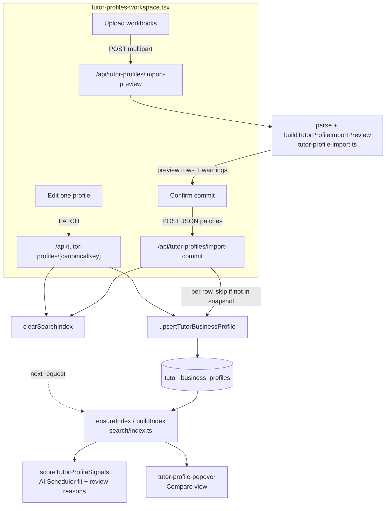

# Tutor Profiles

**Status: stable**

## Purpose

Tutor Profiles is the editorial layer for the business context that Wise does not store: a parent-safe summary, structured fit signals (English proficiency, young-learner comfort, teaching-style tags, curriculum experience, strength tags), education/language records, and internal-only guidance ("student fit" and "do not use for" notes). Admin staff curate these profiles by hand and bulk-seed them from spreadsheets; the data is keyed by each tutor's stable `canonicalKey` so it survives snapshot rotation.

The profiles are not just reference cards. Once saved they are folded into the in-memory search index and consumed downstream by:

- the **AI Scheduler**, which scores tutor fit and emits review reasons from profile signals (`src/lib/ai/tutor-profile-signals.ts`), and
- the **Compare** view, which surfaces parent-safe summary, English level, young-learner fit, strength tags, and teaching-style tags in a tutor popover (`src/components/compare/tutor-profile-popover.tsx:19-70`).

Primary users are the same non-technical admin staff who run search/compare; the page (`/tutor-profiles`) is a single-screen editor plus a seed-import panel.

## Conceptual data model

The feature owns **two standalone tables**, both defined in `src/lib/db/schema.ts` and keyed off a `canonicalKey` string rather than a foreign key. Neither is snapshot-scoped — they survive snapshot rotation, and the linkage to live tutor data is correlated in application code, not enforced by the database.

- **`tutorBusinessProfiles`** (`schema.ts:1214-1248`) — one row per tutor, primary key `canonicalKey`. Holds the parent-safe summary, internal notes, JSONB `education`/`languages`/tag arrays, the `englishProficiency` / `youngLearnerFit` text fields, `youngestComfortableAge`, the student-fit and do-not-use notes, plus `verifiedBy` / `lastReviewedAt` / `active` verification metadata. This is the table the whole feature reads and writes.
- **`tutorContacts`** (`schema.ts:1197-1212`) — onsite/online email and phone per tutor, also keyed by `canonicalKey`. It is grouped under this feature in the ER reference but is **not read or written by any of the Tutor Profiles code paths documented here** (no import in `src/lib/tutor-business-profiles.ts`, `tutor-profile-import.ts`, the API routes, or the workspace component). See Open Questions.

Reads also join against snapshot-scoped core tables to enrich the editable list — `tutorIdentityGroups` (display name + supported modality), `tutorIdentityGroupMembers` (Wise display names for import matching), `subjectLevelQualifications` (subjects), and `tutorAliases` (alias-table matching) — but those are owned by other features and only read here.

For the column-by-column schema, indexes, and the soft (non-FK) relationship to the core snapshot model, see the canonical reference: [docs/reference/database/erd-tutor-profiles.md](../reference/database/erd-tutor-profiles.md).

## API surface

Four endpoints under `/api/tutor-profiles`, all **admin-tier** (Auth.js session, 401 if absent). Full request/response contracts and error codes live in the canonical reference: [docs/reference/api/misc.md → Tutor Profiles](../reference/api/misc.md#tutor-profiles).

| Method + path | Purpose |
|---|---|
| `GET /api/tutor-profiles` | List every active-snapshot tutor merged with its business profile (blank profile synthesized for tutors with no row yet). |
| `PATCH /api/tutor-profiles/[canonicalKey]` | Upsert one tutor's profile by canonical key; 404 if the key is not in the active snapshot. Clears the search index on success. |
| `POST /api/tutor-profiles/import-preview` | Dry-run a bulk seed import from uploaded education/availability workbooks; returns the match analysis and proposed per-tutor patches, writing nothing. |
| `POST /api/tutor-profiles/import-commit` | Persist the previewed patches (upsert per row); skips rows whose canonical key is not in the active snapshot. Clears the search index if anything saved. |

## UI

- **Page**: `src/app/(app)/tutor-profiles/page.tsx` — an async Server Component that requires a session (`redirect("/login")` otherwise) and renders the client workspace inside `<Suspense>`. Registered in the nav as "Tutor Profiles" (`src/components/layout/app-nav.tsx:22`).
- **Workspace**: `src/components/tutor-profiles/tutor-profiles-workspace.tsx` (`"use client"`) — the whole experience. Left rail: a seed-import panel (two file inputs + "Verified by" / "Last reviewed" fields, a "Preview import" button that renders matched/review/profile-only counts and a commit button) and a searchable tutor list with a "Profiled" / "Blank" badge per tutor (`profileHasContent`, lines 89-108). Right pane: the editor — parent-safe context, repeatable education and language rows, a structured-fit card (English proficiency select, strength/curriculum/teaching-style tag inputs, young-learner fit + min-age, with clickable chips from `TEACHING_STYLE_VOCABULARY`), internal guidance, and a verification card (verified-by, last-reviewed date with a "Today" shortcut, and an "Active profile" checkbox). Save issues the `PATCH`; commit issues `import-commit`.
- **Vocabulary**: `src/lib/tutor-profile-vocabulary.ts` defines the controlled lists — `TEACHING_STYLE_VOCABULARY` (tag + label + synonyms, used both as UI chips and as the import's keyword matcher), `CURRICULUM_EXPERIENCE_VOCABULARY`, and `STRENGTH_TAG_VOCABULARY`. The same `TEACHING_STYLE_VOCABULARY` is imported by the AI scheduler (`src/lib/ai/scheduler-conversation.ts:21`).

## Data flow

Manual edits and bulk imports both funnel through one upsert (`upsertTutorBusinessProfile`, `src/lib/tutor-business-profiles.ts:328-399`), and both clear the search index so the next search/scheduler call rebuilds with fresh profile data.

A bulk import specifically: `parseTutorProfileImportWorkbooks` reads the first worksheet of each uploaded buffer via `xlsx` (`tutor-profile-import.ts:276-359`), then `buildTutorProfileImportPreview` combines education + availability rows by a normalized source key, builds a lookup of every active tutor (canonical key, display name, parsed Wise display names, and aliases), deterministically resolves each source row to a tutor, synthesizes a candidate patch, and merges it non-destructively over any existing profile. The preview is returned for human review; only `import-commit` writes.

## Business rules & edge cases

- **Keyed by stable `canonicalKey`, never snapshot-scoped.** Both the list read and every write target `canonicalKey`; the profile table has no `snapshot_id`. The list endpoint enriches against the active snapshot but synthesizes an `emptyProfile` for any tutor lacking a row (`tutor-business-profiles.ts:262-276`), so the editor always shows the full active roster.

- **Edits and imports invalidate the search index immediately.** `PATCH` and a non-empty `import-commit` both call `clearSearchIndex()` (`[canonicalKey]/route.ts:51`, `import-commit/route.ts:61`). Staleness is also self-detected: the index records a `profileVersion` string of `count(*):max(updatedAt)` over the profile table (`search/index.ts:128-137`), and `ensureIndex` rebuilds when that value changes even without an explicit clear (`search/index.ts:368-381`). So a saved profile is reflected in search/scheduler results on the next request.

- **Commit fail-closed on snapshot membership.** `import-commit` looks each row up in the active-snapshot profile list and pushes unknown keys to a `skipped` array instead of inserting (`import-commit/route.ts:48-52`); `PATCH` 404s if the canonical key is not in the active snapshot (`[canonicalKey]/route.ts:44-47`). Profiles are never created for tutors absent from the live roster.

- **Wise stays the scheduling source of truth.** The importer deliberately discards spreadsheet availability columns and records that fact in the imported notes: `"Availability.xlsx weekly availability columns were ignored; Wise remains the scheduling source of truth."` (`tutor-profile-import.ts:490`, asserted by the test at `tutor-profile-import.test.ts:99`).

- **Conservative English-proficiency mapping.** `englishFromSource` only promotes to `fluent` for explicit yes/true/fluent values and passes through `native`/`near-native`/`conversational`/`basic`; everything else is `unknown` (`tutor-profile-import.ts:386-393`). A blank/ambiguous value stays `unknown` rather than guessing. On manual save and on read, the proficiency fields are parsed with `.catch("unknown")` so any unrecognized stored value degrades to `unknown` instead of throwing (`tutor-business-profiles.ts:134-135`).

- **Deterministic, ambiguity-blocking matching.** The import lookup matches by canonical key, display name, alias, and several parsed Wise display-name shapes — `wiseDisplayName`, `wiseNickname`, `wiseFullName`, `wiseNicknameLastName`, plus the swapped legal-first/nickname-last form (`tutor-profile-import.ts:59-68`, `697-704`). `parseWiseDisplayName` decomposes `Legal (Nick) Last` strings (`248-253`). A source row that matches **more than one** distinct tutor is pushed to `ambiguousRows` and excluded from the commit rows ("add canonicalKey before committing", `840`), so a human must disambiguate. `normalizeKey` strips the literal token `online` and punctuation so online/onsite name variants collapse to one key (`183-191`).

- **Non-destructive merge over existing data.** `mergePatchWithExisting` (`tutor-profile-import.ts:578-602`) appends rather than overwrites: text fields concatenate unless already contained (`mergeText`), tags union by normalized key (`mergeTags`), education/languages de-dup by composite key, English proficiency takes the higher rank (`bestEnglish` over `ENGLISH_RANK`), and a non-`unknown` existing `youngLearnerFit` wins. Existing `doNotUseForNotes`, `verifiedBy`, and `active` are preserved from the current profile.

- **Heuristic young-learner / curriculum / style inference.** When a row lacks explicit values, the importer infers them from free text: mentions of young/kid/child/primary/elementary set `youngLearnerFit: "comfortable"` (and age 6 for primary/elementary) with a flagged note (`inferYoungLearnerFields`, `428-437`); curriculum and teaching-style tags are inferred by keyword/synonym match (`inferCurriculumExperience` / `inferTeachingStyleTags`, `411-426`). These are best-effort seed values intended for human review in the preview, not authoritative.

- **Invalid age handling.** `parseAge` returns `null` for non-integers or values outside 3–20 (`tutor-profile-import.ts:378-384`); such rows are listed in the preview's `invalidRows` (`849-851`) and the patch stores `null`. The editor and Zod patch schema enforce the same 3–20 bound (`tutor-business-profiles.ts:44`).

- **Bounded inputs.** The patch Zod schema caps every field (summary ≤1200, internal notes ≤3000, most notes ≤2000, ≤12 education/language rows, ≤30 tags) and is `.strict()` (`tutor-business-profiles.ts:36-55`); the importer clamps long text with an ellipsis to the same limits (`MAX_*` constants + `clamp`, `171-173`, `439-441`). `import-commit` accepts 1–200 rows (`import-commit/route.ts:12-17`).

- **Optional-table tolerance.** `selectAllTutorBusinessProfiles` / `selectActiveTutorBusinessProfiles` swallow "relation/column does not exist" errors (Postgres `42P01`/`42703`) and return `[]` so the list and search index still function before the migration has run (`tutor-business-profiles.ts:185-228`). The mutating routes do **not** wrap their writes this way.

- **AI-scheduler review routing is fail-closed.** `scoreTutorProfileSignals` (`src/lib/ai/tutor-profile-signals.ts:213-281`) folds profile fields into a fit score and collects `reviewReasons` from any signal whose source is `"review"` (e.g. a `doNotUseForNotes` note that matches the request, `188-208`). Profile content therefore raises a "needs review" flag rather than silently boosting a tutor.

## Tests

- **`src/lib/__tests__/tutor-profile-import.test.ts`** is the dedicated suite. It exercises `buildTutorProfileImportPreview` end-to-end against the audited 80-tutor seed shape and asserts the non-obvious behaviors: availability-only rows are flagged (and counted), unmatched rows surface by source name, English fluency maps conservatively to `unknown`, the "Wise remains the scheduling source of truth" note is emitted, young-learner inference fires (`comfortable` + age 6), teaching-style tags are inferred (`patient`, `structured`), alias-table matching stabilizes canonical keys, the swapped legal-first / Wise-nickname-last form resolves deterministically (`wiseNicknameLastName`), and **ambiguous matches are blocked from commit rows** with their candidate keys listed.
- There is **no dedicated unit test for `tutor-business-profiles.ts`** (the upsert/list/merge-on-read helpers) or for the four route handlers; those are covered only indirectly. The downstream consumption is tested elsewhere — the AI scheduler signal scoring and the search index build under their respective suites.

## Open questions

- **`tutorContacts` ownership/consumer.** The table is grouped under Tutor Profiles in the ER reference and shares the `canonicalKey` keying, but none of the code paths read in scope (lib helpers, API routes, workspace, import) read or write it. Is it populated/consumed by another feature, seeded by a script, or currently unused? Confirm whether it belongs to this feature or is effectively orphaned here.
- **Hard-coded source filenames in imported notes.** The importer stamps literal strings like `"BeGifted Tutors-3.xlsx"` and `"Availability.xlsx"` into internal notes and language verification sources (`tutor-profile-import.ts:469`, `485-490`, `510`) regardless of the actual uploaded filename. Intended as a provenance label for the known seed files, or should it reflect the real upload name?
- **Untested write surface.** The upsert/merge-on-read logic and all four route handlers have no direct tests. Is the indirect coverage considered sufficient for a "stable" feature, or is that a gap worth flagging?
- **Two header layouts in `parseAvailabilityWorkbook`.** The parser branches between a single-header sheet and a two-row-header sheet with hard-coded column indices (`tutor-profile-import.ts:314-359`). The fixed-index branch encodes a specific legacy spreadsheet layout; is that legacy shape still in use, or is it dead-but-defensive?

_Verified against HEAD `d4fe6d3` on 2026-06-05._
