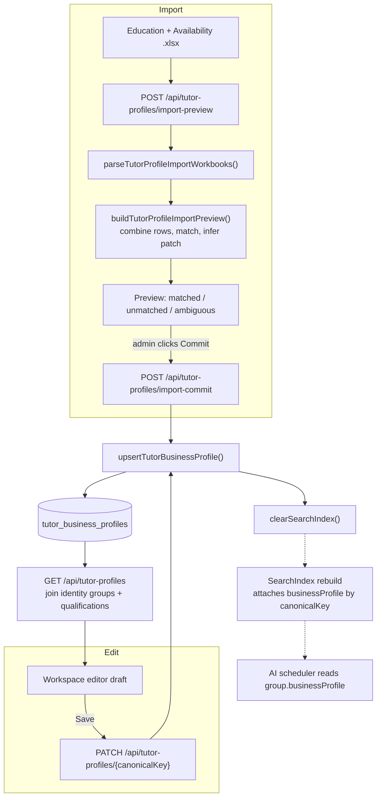

# Tutor Profiles

**Status: stable**

## Purpose

Tutor Profiles is the editorial layer that holds **business context about each tutor that Wise does not store** — a parent-safe summary, education and language history, English proficiency, young-learner fit, teaching-style and strength tags, curriculum experience, internal "use / do-not-use" guidance, and a verification trail. Wise remains the scheduling source of truth (working hours, sessions, leaves); these profiles answer the human questions Wise cannot: _is this tutor good with shy 8-year-olds? did they study abroad? are they fluent in English? is there a reason not to suggest them?_

Profiles are keyed to a tutor's stable `canonicalKey` (the identity-group key produced by the normalization pipeline), so they survive snapshot rebuilds even though all Wise-derived data is re-promoted on every sync.

Two audiences consume this data:
- **Admin staff** edit profiles in the Tutor Profiles workspace and bulk-seed them from spreadsheets (`src/components/tutor-profiles/tutor-profiles-workspace.tsx`).
- **The AI scheduler** reads the profile attached to each indexed tutor group along two distinct paths:
  - **Reasoning about fit** — `src/lib/ai/scheduler-conversation.ts` reads `group.businessProfile` directly for school-keyword matching (`:1576`, `businessProfile.education`), hard business requirements (`:1595`, English proficiency / young-learner fit / youngest comfortable age), and the teaching-style score (`:1620`, `businessProfile.teachingStyleTags`). None of these read the narrative summary fields.
  - **Phrasing parent-facing replies** — the narrative fields surface through a separate signal pass: `scoreTutorProfileSignals` reads `parentSafeSummary` and `studentFitNotes` (`src/lib/ai/tutor-profile-signals.ts:53`, `:57`), tagging each hit with a `profile:`/`notes:` source prefix. That evidence is carried on each tutor's `profileEvidence` (wired at `src/lib/ai/scheduler-conversation.ts:1732`, `:1953`) and rendered into the parent draft by `buildSchedulerParentDraft` (`:2197`–`:2200`).

## Conceptual data model

Tutor Profiles owns a single table, `tutor_business_profiles`, defined at `src/lib/db/schema.ts:1074`. Conceptually it is a **per-tutor editorial record** with three kinds of fields: free-text narrative (parent-safe summary, internal notes, student-fit and do-not-use guidance), structured-but-soft attributes (English proficiency, young-learner fit, youngest comfortable age), and JSONB collections (education entries, language entries, teaching-style tags, strength tags, curriculum experience). It also carries a verification trail (`verifiedBy`, `lastReviewedAt`) and an `active` flag.

Unlike every other domain table in this system, `tutor_business_profiles` is **not snapshot-scoped** — its primary key is `canonicalKey`, not `(snapshotId, …)`. It is joined back to the live snapshot's `tutor_identity_groups` (for display name + supported modality) and `subject_level_qualifications` (for subjects) at read time, and to `tutor_identity_group_members` + `tutor_aliases` during import matching (`src/lib/tutor-business-profiles.ts:230`, `:279`, `:314`).

For the full column list and indexes, see the database reference (canonical home for mechanical schema detail):
- [docs/reference/database/erd-tutor-profiles.md](../reference/database/erd-tutor-profiles.md) — the feature's owned tables (`tutor_contacts`, `tutor_business_profiles`).
- [docs/reference/database/erd-core.md](../reference/database/erd-core.md) — `tutor_identity_groups`, `tutor_identity_group_members`, `tutor_aliases`, and `subject_level_qualifications` that profiles join against, plus the in-memory index and AI-scheduler view that attaches the profile to each tutor group.
- [docs/reference/database/index.md](../reference/database/index.md) — full ERD and cross-feature relationships.

## API surface

All four routes require an authenticated session and return `401` otherwise; none are CRON-protected. Full request/response contracts live in the API reference (canonical home).

- **`GET /api/tutor-profiles`** — lists every tutor in the active snapshot, each merged with its saved profile (or a blank placeholder), enriched with `tutorGroupId`, `supportedModes`, and `subjects`. (`src/app/api/tutor-profiles/route.ts`)
- **`PATCH /api/tutor-profiles/[canonicalKey]`** — upserts a single profile from a validated patch; `404`s if the canonical key is not in the active snapshot, and clears the search index on success. (`src/app/api/tutor-profiles/[canonicalKey]/route.ts`)
- **`POST /api/tutor-profiles/import-preview`** — accepts up to two `multipart/form-data` workbooks (education + availability), parses and matches rows against active tutors, and returns a non-destructive preview with six row buckets — matched (`rows`), unmatched, ambiguous, duplicate-source, profile-only (`availabilityOnlyRows`), and invalid (`src/lib/tutor-profile-import.ts:102`–`:118`). Writes nothing. (`src/app/api/tutor-profiles/import-preview/route.ts`)
- **`POST /api/tutor-profiles/import-commit`** — takes the preview's matched rows (1–200) and upserts each, skipping any canonical key no longer in the active snapshot; clears the search index if anything saved. (`src/app/api/tutor-profiles/import-commit/route.ts`)

See [docs/reference/api/misc.md](../reference/api/misc.md) for the four endpoints' full schemas.

## UI

- **Page**: `src/app/(app)/tutor-profiles/page.tsx` — a thin server component that gates on an authenticated email (redirects to `/login`) and renders the workspace inside a `Suspense` boundary. Reached from the top nav (`src/components/layout/app-nav.tsx`).
- **Key component**: `src/components/tutor-profiles/tutor-profiles-workspace.tsx` — a single `"use client"` workspace with a left sidebar (import panel + searchable tutor list, badged "Profiled" / "Blank") and a right editor pane. The editor edits a deep-cloned `draft` (`JSON.parse(JSON.stringify(...))`, `:166`) so unsaved edits never mutate the loaded list, and exposes:
  - parent-safe summary, education rows, language rows;
  - "Structured fit" (English proficiency + young-learner fit selects, min-age, comma-separated strength / curriculum / teaching-style tag inputs, with clickable chips from `TEACHING_STYLE_VOCABULARY`);
  - internal guidance (student-fit, do-not-use, internal notes) and verification (verified-by, last-reviewed date with a "Today" button, active checkbox).
  - The **import panel** uploads the two workbooks plus an optional "Verified by" / "Last reviewed" stamp, calls `import-preview`, renders matched / review / profile-only counts and a sample of matched + flagged rows, and only then enables "Commit N matched".
- **Vocabulary source**: `src/lib/tutor-profile-vocabulary.ts` — the canonical `TEACHING_STYLE_VOCABULARY` (tag + label + synonyms), `CURRICULUM_EXPERIENCE_VOCABULARY`, and `STRENGTH_TAG_VOCABULARY` lists shared by the UI chips and the import inference.

## Data flow

Two flows dominate: a **single-profile edit** and a **spreadsheet import** (preview then commit). Both ultimately write through `upsertTutorBusinessProfile` and invalidate the in-memory search index so the AI scheduler picks up the change.

Mechanics worth knowing:
- **Read path** (`listTutorBusinessProfiles`, `src/lib/tutor-business-profiles.ts:230`): loads identity groups, qualifications, and all profiles in parallel for the active snapshot, then maps every group to its profile **or a blank `emptyProfile`** so the UI shows every tutor whether or not a profile exists.
- **Index path** (`src/lib/search/index.ts:220`, `:317`): `buildIndex` calls `loadTutorBusinessProfileMap` (active profiles only) and attaches each profile to its tutor group via `businessProfile: businessProfiles.get(group.canonicalKey)`. The index's staleness key includes a profile-version digest — `count + max(updatedAt)` from `tutor_business_profiles` (`getTutorProfileVersion`, `:128`) — so a saved profile (newer `updatedAt`) invalidates the warm index even when the Wise snapshot is unchanged. The write routes also call `clearSearchIndex()` directly for immediacy.

## Business rules & edge cases

- **Profiles outlive snapshots, keyed by `canonicalKey`.** The table has no `snapshotId`; this is deliberate so editorial work is not wiped by the 30-minute sync. `src/lib/db/schema.ts:1075`.
- **Writes are gated on the active snapshot.** `PATCH` resolves the display name via `getActiveTutorDisplayNameByCanonicalKey` and `404`s if the key isn't an active tutor (`src/app/api/tutor-profiles/[canonicalKey]/route.ts:44`); commit skips keys not in the active snapshot with a `skipped` reason (`src/app/api/tutor-profiles/import-commit/route.ts:48`). You cannot create a profile for a tutor Wise no longer knows about.
- **The table may not exist yet — and reads tolerate that.** `selectAllTutorBusinessProfiles` / `selectActiveTutorBusinessProfiles` swallow "missing table/column" Postgres errors (`42P01`, `42703`) and return `[]` (`src/lib/tutor-business-profiles.ts:185`, `:209`, `:218`). The list/index keep working before the migration lands; writes do not catch this and will surface the error.
- **Upsert is a merge, not a replace.** Every `undefined` field in the patch falls back to the existing value; tag/curriculum lists are de-duplicated case-insensitively via `normalizeList`; `verifiedBy`/`lastReviewedAt` distinguish "absent" (keep) from explicit `null` (clear) using `=== undefined` checks (`src/lib/tutor-business-profiles.ts:340`–`:367`). Enum columns are parsed with `.catch("unknown")` so a bad DB value degrades to `"unknown"` rather than throwing (`:134`–`:135`).
- **Wise stays the scheduling source of truth — by design, the importer throws availability away.** `buildCandidatePatch` explicitly ignores the availability workbook's weekly columns and stamps an internal note saying so (`src/lib/tutor-profile-import.ts:490`); the test at `src/lib/__tests__/tutor-profile-import.test.ts:99` asserts this note is present. Profiles never feed scheduling availability.
- **English proficiency is mapped conservatively (fail-closed-ish).** A bare "Yes" maps to `"fluent"`, not `"native"`; anything unrecognized maps to `"unknown"` (`src/lib/tutor-profile-import.ts:386`). The test at `:98` pins a `"No"` source to `"unknown"`. A language entry is only synthesized when proficiency is not `"unknown"` (`:508`).
- **Import matching is deterministic and refuses to guess.** `buildActiveLookup` indexes each active tutor by canonical key, display name, alias (both directions), and several parsed Wise-display-name forms — `Legal (Nick) Last` is split into nickname, legal full name, nickname+last, and legal+nick+last (`parseWiseDisplayName`, `:224`; lookup wiring `:681`). Candidate keys are tried in priority order (`candidateKeys`, `:738`). If **more than one** active tutor matches a key, the row is routed to `ambiguousRows` and **excluded from the committable set** rather than picked arbitrarily (`distinctMatches` + `resolveProfile`, `:718`, `:755`; test `:150`). `normalizeKey` strips the literal word "online" and punctuation so online/onsite variants collapse to the same person (`:183`).
- **Inference is keyword/synonym based.** Teaching-style tags come from `TEACHING_STYLE_VOCABULARY` synonym hits, curriculum from `CURRICULUM_EXPERIENCE_VOCABULARY` (with special handling for "A-Level"/"IAL" and a broad "International" trigger), and a young-learner mention flips `youngLearnerFit` to `"comfortable"` (age 6 if "primary"/"elementary") (`src/lib/tutor-profile-import.ts:411`, `:421`, `:428`). Free text is clamped to per-field max lengths with an ellipsis (`clamp`, `:439`).
- **Row bucketing.** Duplicate source keys → `duplicateSourceRows`; availability rows with no education partner → `availabilityOnlyRows` (and a per-row warning); an out-of-range youngest age (parsed to `null`) → `invalidRows` (`parseAge` returns `null` for <3 or >20, `:378`; bucketing `:849`). Matched rows missing an explicit `canonicalKey` get a "Missing canonicalKey; matched by …" warning (`sourceWarnings`, `:802`).
- **Availability workbook has two accepted shapes.** A single header row (named columns) or a two-row header with fixed positional indices; the parser detects which by looking for a `canonicalKey` header in row 0 (`parseAvailabilityWorkbook`, `:314`).
- **Commit batch is capped at 200 rows** by the Zod schema (`src/app/api/tutor-profiles/import-commit/route.ts:16`).

## Tests

- `src/lib/__tests__/tutor-profile-import.test.ts` — the import preview engine. Covers: availability-only-row detection and unmatched rows against an 80-tutor seed shape; conservative English mapping plus the "Wise remains scheduling truth" note and young-learner inference; alias-stabilized canonical-key matching; deterministic swapped-name matching via `wiseNicknameLastName`; and ambiguous matches being blocked from commit with both candidates surfaced.
- No dedicated unit tests were found for `tutor-business-profiles.ts` (the upsert/merge/missing-table logic), for the four API routes, or for the workspace component. The AI-scheduler suite (`src/lib/ai/__tests__/scheduler-conversation.test.ts`) references business profiles as a downstream consumer.

## Open questions

- **Hard-coded source-file names in imported notes.** The importer writes literal strings like `"BeGifted Tutors-3.xlsx English fluency value: …"` and `"Availability.xlsx tier: …"` into `internalNotes`/`languages.verificationSource` (`src/lib/tutor-profile-import.ts:469`, `:485`, `:510`) regardless of the actual uploaded filename. Intended provenance label, or should it reflect the uploaded file?
- **Untested merge/upsert path.** `upsertTutorBusinessProfile` has non-trivial keep-vs-clear semantics (`=== undefined` vs explicit `null`) and case-insensitive list de-duplication but no direct unit coverage. Is that acceptable given the import-preview tests, or is coverage desired?
- **Profile edits bypass any audit trail beyond `verifiedBy` / `lastReviewedAt`.** There is no per-edit history table; the only record of who changed what is the manually-entered verification stamp. Is that the intended level of accountability for "do-not-use" guidance?
- **`STRENGTH_TAG_VOCABULARY` is exported but not surfaced as clickable chips** in the workspace (only `TEACHING_STYLE_VOCABULARY` is). Strength tags are free-text comma input. Intended, or a missing chip affordance?

_Verified against HEAD + uncommitted WIP on 2026-05-31._
