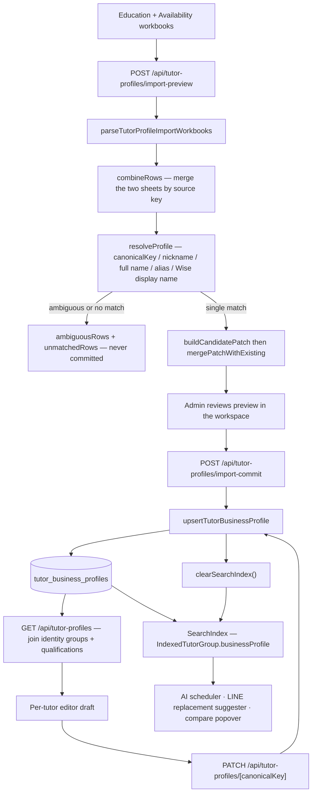

# Tutor Profiles

**Status: stable**

## Purpose

Tutor Profiles is the one place in BGScheduler where a human writes down what the Wise pipeline does not carry: how a tutor actually teaches, who they suit, what is safe to repeat to a parent, and whether there is a reason *not* to offer them. What this app reads out of Wise for a teacher is an id, a user reference, a name, and tags (`src/lib/wise/types.ts:9-15`), normalized into schedules, qualifications, and identity — nothing in that pipeline conveys "patient with shy 8-year-olds", "IB Maths background", or "do not put with exam-cram families".

> The `WiseTeacher` type is deliberately open (`[key: string]: unknown`, `types.ts:14`) and this repo never enumerates the vendor's full field inventory. The statement above is about what BGScheduler consumes, not a claim that Wise stores nothing else.

Profiles are keyed on the tutor's stable `canonicalKey` rather than a snapshot id, so editorial work written once is not wiped by the next 30-minute Wise sync.

Two audiences consume it:

- **Admin staff** curate it at `/tutor-profiles` — a per-tutor editor plus a two-step bulk import from the legacy tutor workbooks. It is registered as a nav tool in the scheduling/tutors section (`src/lib/navigation/tools.ts:133-138`).
- **Machines read it.** Each profile is folded into the in-memory search index as `IndexedTutorGroup.businessProfile` (`src/lib/search/index.ts:220`, `:317`), which puts it in front of the AI scheduler's hard filters and ranking signals (`src/lib/ai/scheduler-conversation.ts:1589-1611`, `src/lib/ai/tutor-profile-signals.ts:213-282`), the LINE replacement-teacher suggester (`src/lib/line/operational.ts:558-578`), and the compare-view tutor popover (`src/components/compare/tutor-profile-popover.tsx:19`, `:53-70`).

The constraint that shapes everything below: profiles are **editorial, not operational**. They never establish availability — Wise remains the sole scheduling truth. The importer writes that rule into the record as a literal sentence, but only on rows that came with an Availability-workbook partner: the push sits inside the `if (combined.availability)` branch (`src/lib/tutor-profile-import.ts:473`, `:490`, branch closes `:502`). An education-only row gets no such note — its branch pushes only the English-fluency line (`:461-471`).

## Conceptual data model

The feature **writes exactly one table** and reads five others.

- **Tutor business profiles** — the only table written here, and the only one the feature owns. Keyed directly on `canonicalKey`, so there is at most one profile per logical tutor and profiles survive snapshot rotation. It carries four kinds of editorial content: copy that is safe to send a parent, staff-only guidance including a do-not-use caution, structured fit fields and controlled tag arrays that the AI scheduler can filter and score on, and verification metadata. The full column list, types, defaults, and indexes are in the [tutor-profiles ERD](../reference/database/erd-tutor-profiles.md). Note that the verification metadata is entirely user-typed — `upsertTutorBusinessProfile` passes through whatever the client sends and nothing stamps it automatically (`src/lib/tutor-business-profiles.ts:359-364`), so treat it as a self-reported marker rather than an enforced review trail.
- **Snapshots** — every `/api/tutor-profiles` request path resolves the single `active` snapshot first and throws if there is none (`src/lib/data/active-snapshot.ts:5-16`): `listTutorBusinessProfiles` (`src/lib/tutor-business-profiles.ts:231`), `listTutorProfileImportIdentities` (`:280`), and `getActiveTutorDisplayNameByCanonicalKey` (`:405`). Two exported readers are deliberately snapshot-agnostic and never call it — `loadTutorBusinessProfileMap` (`:323-326`), the read the *search index* uses, and `listTutorProfileImportAliases` (`:314-321`), which selects `tutor_aliases` unscoped. The index-build path resolves its own active snapshot separately (`src/lib/search/index.ts:144-152`) and then folds in the snapshot-agnostic profile map (`:220`).
- **Tutor identity groups** — the *source of the roster*. The workspace list is driven by identity groups, not by the profile table, so every tutor in the active snapshot appears even with nothing saved (`src/lib/tutor-business-profiles.ts:262-276`).
- **Tutor identity group members** — the underlying Wise display names, read only by the importer to match spreadsheet rows to a canonical key (`src/lib/tutor-business-profiles.ts:279-312`).
- **Subject/level qualifications** — read to decorate each list row with the tutor's Wise subjects (`src/lib/tutor-business-profiles.ts:246-260`).
- **Tutor aliases** — the cross-snapshot nickname alias table, read as additional import match keys (`src/lib/tutor-business-profiles.ts:314-321`).

Grain, keys, indexes, and column-level detail are in the [tutor-profiles ERD](../reference/database/erd-tutor-profiles.md); the snapshot-scoped tables it joins against are in the [core ERD](../reference/database/erd-core.md), and cross-feature relationships in the [database index](../reference/database/index.md).

> The tutor-profiles ERD also documents `tutor_contacts`. That table is **not** part of this feature — nothing under `src/app/api/tutor-profiles/`, `src/lib/tutor-business-profiles.ts`, or `src/lib/tutor-profile-import.ts` reads or writes it. It is used by classroom schedule email, post-class feedback, learning plans, progress tests, and leave-request matching.

## API surface

All four endpoints are admin-session (`auth()` → 401); none is cron-protected or public. Full request/response contracts, field limits, and error shapes live in the [misc API reference](../reference/api/misc.md#tutor-profiles) — the canonical home for endpoint mechanics.

| Endpoint | Purpose |
|---|---|
| `GET /api/tutor-profiles` | Roster + profile join: one row per tutor in the active snapshot, blank profile synthesized where none is saved. |
| `PATCH /api/tutor-profiles/[canonicalKey]` | Upsert one tutor's profile from the editor; rejects a key absent from the active snapshot. |
| `POST /api/tutor-profiles/import-preview` | Dry-run a workbook upload — parse, match to canonical keys, merge against existing profiles, return the proposed patches and the flagged buckets. Writes nothing. |
| `POST /api/tutor-profiles/import-commit` | Persist the patches the admin reviewed, skipping any key no longer in the active snapshot. |

## UI

One page and one component.

- `src/app/(app)/tutor-profiles/page.tsx` — two components. The default export `TutorProfilesPage` is **synchronous** and does nothing but wrap the body in `<Suspense fallback={null}>` (`page.tsx:15-21`); the async work lives in `TutorProfilesBody`, which awaits `auth()` and redirects to `/login` when `!session?.user?.email` — so a session that exists but carries no user email also redirects (`page.tsx:6-13`). Neither fetches data; the workspace loads everything over the API.
- `src/components/tutor-profiles/tutor-profiles-workspace.tsx` — the entire feature UI in one `"use client"` component, fetching `/api/tutor-profiles` on mount (`:130-154`). Layout is a fixed-width left rail plus a detail pane:
  - **Left rail** — the import panel (two file inputs, a "Verified by" text input, an **unlabeled** review-date input — a bare `type="date"` `Input` with no `<label>` text and no placeholder, sharing a two-column grid with its labelled sibling at `:366-379` — then Preview, matched / review / profile-only counts, a sample of matched rows, an amber "Review before commit" list, and the Commit button) above a search box and the tutor list. The visible string "Last reviewed" belongs to the *detail pane's* verification card (`:701-702`), not the import panel. Each tutor row carries a `Profiled` / `Blank` badge (`:476-478`) computed by `profileHasContent`, which tests 16 editorial **content** fields and deliberately ignores `displayName`, `active`, and `updatedAt` (`:89-108`) — so a deliberately retired profile whose only non-default value is `active: false` still reads as `Blank`.
  - **Detail pane** — parent-safe summary; repeating education and language rows; a "structured fit" card (English-proficiency and young-learner selects, min age, three comma-separated tag inputs, plus one-click chips generated from `TEACHING_STYLE_VOCABULARY` at `:661-672`); internal guidance (student fit, do-not-use, internal notes); and a verification card (verified-by, last-reviewed date with a Today button, active checkbox).
  - Edits accumulate in a deep-cloned `draft` (`:166`) so the loaded list is never mutated in place, and are pushed with a single Save; the three tag fields are held as raw text and split on commas at save time (`:37-46`, `:217-219`).
- `src/lib/tutor-profile-vocabulary.ts` supplies the shared controlled vocabularies. `TEACHING_STYLE_VOCABULARY` (tag + label + synonyms) has exactly three consumers: the UI chips (`tutor-profiles-workspace.tsx:10`, `:662`), the importer's synonym inference (`tutor-profile-import.ts:10`, `:423`), and — load-bearing — the **AI scheduler**, which imports the same table (`src/lib/ai/scheduler-conversation.ts:21`) to infer the parent's requested teaching-style tags from chat text through the same synonyms (`:653-659`) and to inject the tag list into the LLM extraction prompt (`:2285`). That one shared table is the mechanism that makes a parent's requested tags line up with the tags an import wrote. `CURRICULUM_EXPERIENCE_VOCABULARY` is importer-only — the scheduler hardcodes its own separate curriculum keyword list instead of reusing it (`scheduler-conversation.ts:642-651`).

## Data flow

Two paths write, one path reads back.

**Single-profile edit.** Workspace → `PATCH /api/tutor-profiles/[canonicalKey]` → Zod patch validation → active-snapshot display-name lookup (404 if absent) → `upsertTutorBusinessProfile` merges the patch field-by-field over the stored row and upserts on the `canonicalKey` conflict target → `clearSearchIndex()`.

**Bulk import.** Workbook(s) → `POST import-preview` (parse → combine the two sheets by source key → deterministic match against active identities and aliases → build a candidate patch → merge with the existing profile) → the admin reviews matched / unmatched / ambiguous / duplicate / profile-only / invalid buckets → `POST import-commit` re-checks each key against the active snapshot and upserts.

**Read-back.** The next `ensureIndex()` rebuild loads *active* profiles keyed by canonical key and attaches them to each `IndexedTutorGroup`; search, compare, AI scheduler, and LINE then read them from memory with no further DB access.

```mermaid
flowchart TD
    XLSX["Education + Availability workbooks"] --> PREVIEW["POST /api/tutor-profiles/import-preview"]
    PREVIEW --> PARSE["parseTutorProfileImportWorkbooks"]
    PARSE --> COMBINE["combineRows — merge the two sheets by source key"]
    COMBINE --> MATCH["resolveProfile — canonicalKey / nickname / full name / alias / Wise display name"]
    MATCH -->|ambiguous or no match| BUCKETS["ambiguousRows + unmatchedRows — never committed"]
    MATCH -->|single match| MERGE["buildCandidatePatch then mergePatchWithExisting"]
    MERGE --> REVIEW["Admin reviews preview in the workspace"]
    REVIEW --> COMMIT["POST /api/tutor-profiles/import-commit"]
    EDITOR["Per-tutor editor draft"] --> PATCH["PATCH /api/tutor-profiles/[canonicalKey]"]
    COMMIT --> UPSERT["upsertTutorBusinessProfile"]
    PATCH --> UPSERT
    UPSERT --> TABLE[("tutor_business_profiles")]
    UPSERT --> CLEAR["clearSearchIndex()"]
    TABLE --> INDEX["SearchIndex — IndexedTutorGroup.businessProfile"]
    CLEAR --> INDEX
    INDEX --> CONSUMERS["AI scheduler · LINE replacement suggester · compare popover"]
    TABLE --> LIST["GET /api/tutor-profiles — join identity groups + qualifications"]
    LIST --> EDITOR
```

## Business rules & edge cases

**The roster is the snapshot, not the profile table.** `listTutorBusinessProfiles` starts from the active snapshot's identity groups and synthesizes an all-defaults profile (epoch `updatedAt`) for any tutor without a row (`src/lib/tutor-business-profiles.ts:262-276`, `:151-177`). A tutor who drops out of the snapshot silently disappears from the workspace even though their profile row survives. Both write paths enforce the same gate: PATCH returns 404 for a key absent from the active snapshot (`src/app/api/tutor-profiles/[canonicalKey]/route.ts:44-47`), and import-commit records it under `skipped` rather than writing (`src/app/api/tutor-profiles/import-commit/route.ts:47-52`). You cannot create a profile for a tutor Wise no longer knows.

**`active` hides a profile from machines but not from editors.** The workspace list uses `selectAllTutorBusinessProfiles` (unfiltered, `src/lib/tutor-business-profiles.ts:209-216`); the search index uses `selectActiveTutorBusinessProfiles` (`:218-228`, consumed at `:323-326`). Unchecking "Active profile" therefore withdraws the profile from AI scheduling and compare while keeping it editable. That withdrawal is immediate only in the process that handled the write, whose `clearSearchIndex()` nulls the `globalThis` singleton (`src/app/api/tutor-profiles/[canonicalKey]/route.ts:51`, `src/lib/search/index.ts:123-126`); on any other serverless instance it lands whenever that instance's next `ensureIndex()` staleness check notices the changed `profileVersion` — timing this repo cannot pin down (see below).

**Index invalidation is belt-and-braces.** Every successful write calls `clearSearchIndex()` (`[canonicalKey]/route.ts:51`, `import-commit/route.ts:61`), which clears only the *current* process's `globalThis` singleton. Across serverless instances the fallback is `getTutorProfileVersion()` — `count(*)` plus `max(updated_at)` rendered into a `"<count>:<maxUpdatedAt>"` string (`src/lib/search/index.ts:128-137`) and compared for plain equality against the cached index's `profileVersion` on every `ensureIndex()` **that finds a cached index and no in-flight build** (`:354-401`). Neither condition is guaranteed: `ensureIndex` returns any in-flight rebuild promise before doing any work (`:358-359`), and the version comparison sits inside `if (cached)` (`:366`, check at `:377-381`), so a cold process or a caller arriving during a rebuild performs no comparison at all. Because the comparison is equality rather than ordering, a `max(updated_at)` that moves *backwards* is already a detected change; the `count(*)` term earns its place only in the case where the value stays flat — deleting a row that was not the most recently updated one.

**Missing-table fail-soft covers the workspace but not search.** Both profile selects wrap their query and return `[]` when the failure looks like a missing table or column — `selectAllTutorBusinessProfiles` (`src/lib/tutor-business-profiles.ts:209-216`) and `selectActiveTutorBusinessProfiles` (`:218-228`), both routed through `isMissingTutorProfileTable` (`:185-207`). That guard is broader than the two SQLSTATEs it is usually described by: it matches **any** error whose message or `cause` mentions `tutor_business_profiles` **and** whose text contains `"does not exist"`, the bare word `"column"`, `42P01`, or `42703` (or a `cause.code` of the latter two).

The gap: `getTutorProfileVersion()` queries the same table with **no** guard (`src/lib/search/index.ts:128-137`) and is awaited unguarded in two places — inside `buildIndex`'s `Promise.all` (`:221`, block at `:175-222`) and inside `ensureIndex`'s staleness check (`:374`). `ensureIndex` returns that promise with only a `.finally()`, never a `.catch()` (`:396-400`), and the search route lets the rejection fall into its generic 500 handler (`src/app/api/search/route.ts:53-60`). So on an un-migrated database the workspace still loads, but index build and search fail. The one caller that is defensive is the LINE replacement suggester, which does `.catch(() => null)` (`src/lib/line/operational.ts:527`).

`upsertTutorBusinessProfile` also has no guard, so a write against an un-migrated database surfaces as a 500. Unknown enum values already stored in the columns degrade to `"unknown"` via `.catch("unknown")` rather than throwing (`src/lib/tutor-business-profiles.ts:134-135`).

**Upsert is a merge, and it distinguishes "absent" from "clear".** Every `undefined` patch field falls back to the stored value; `displayName` resolves patch → existing → the active snapshot's display name (`:342`); tag arrays are trimmed and case-insensitively de-duplicated (`:112-124`, `:353-356`); `youngestComfortableAge`, `verifiedBy`, and `lastReviewedAt` use `=== undefined` checks so an explicit `null` clears the field while omission preserves it (`:349-364`).

**Import merges are deliberately conservative — existing curation wins.** `mergePatchWithExisting` (`src/lib/tutor-profile-import.ts:578-602`) appends free text rather than replacing it, and skips the append when the incoming text is already contained (`:526-532`); English proficiency takes the higher of the two ranks (`:573-576`); a non-`unknown` `youngLearnerFit` is never overwritten (`:589`); `verifiedBy` / `lastReviewedAt` keep the existing values when present (`:598-599`). Two fields the importer can never touch at all: `doNotUseForNotes` and `active` are copied straight from the existing row (`:597`, `:600`), so a bulk import can neither erase a caution note nor silently reactivate a retired profile.

**Import matching is deterministic and fail-closed.** Candidate keys are tried in a fixed order — education `canonicalKey`, availability `canonicalKey`, availability nickname, availability full name, education full name (`:738-753`). Each is normalized by `normalizeKey`, which lowercases, strips parentheses and punctuation, and **deletes the literal word "online"** so a Wise online-variant name collapses onto its onsite twin (`:183-191`). Wise display names of the form `Legal (Nick) Last` are expanded into five lookup forms — display name, nickname, legal full name, nickname + last, legal + nickname + last (`:224-253`, `:697-704`) — which is what lets a spreadsheet row with the legal and nickname fields swapped still resolve. Aliases are registered in both directions onto the target they point at (`:707-713`). If a normalized key resolves to more than one distinct canonical key the row is classified **ambiguous** and excluded from `rows`, so it can never reach commit (`:718-736`, `:834-845`); rows matching nothing land in `unmatchedRows` with the list of keys tried (`:823-832`). The workspace only ever posts `preview.rows` (`tutor-profiles-workspace.tsx:305-310`).

**Inference from free text is additive and conservative.** `buildCandidatePatch` derives curriculum tags by keyword — with a special-cased `A-Level` / `IAL` regex and a broad `International` trigger (`:411-419`) — teaching-style tags from the synonym table, strength tags `writing` / `exam prep` by regex (`:495-496`), and a young-learner guess: `comfortable`, minimum age 6 when the text mentions primary/elementary, plus a note recording that the value was inferred (`:428-437`). English proficiency maps only explicit values; a bare "Yes" becomes `fluent` (not `native`) and anything unrecognized stays `unknown` (`:386-393`), with a language row emitted only when the level is known (`:508-510`). Long fields are clamped with an ellipsis to the same limits the Zod schema enforces (`:171-173`, `:439-441`).

**Provenance notes are hardcoded to the original workbook names.** Regardless of the uploaded filename, internal notes and language verification sources are stamped `BeGifted Tutors-3.xlsx` (`:469`, `:510`) and `Availability.xlsx` (`:485`, `:490`). The other internal-note pushes carry no workbook name at all — they are bare `Profile picture reference:` / `Academic background:` / `Academic achievement:` / `Highlights:` prefixes (`:486-489`). The stamped set includes the non-negotiable line `"Availability.xlsx weekly availability columns were ignored; Wise remains the scheduling source of truth."` (`:490`). That sentence is the auditable trace of the no-sheet-fallback rule and is pinned by a test.

**The availability workbook has two accepted shapes, and the workbook committed under that name fits neither.** If a `canonicalKey` header exists in row 0 the parser reads by header aliases; otherwise it falls back to a two-row header and **fixed column positions** 0/1/2/3 (tier, nickname, firstName, lastName) and 18-21 (academic background, academic achievement, highlights, profile picture) (`:314-359`, header test at `:318-320`, positional branch at `:346-356`). Any column insertion in a sheet that hits that branch silently shifts the mapping.

There *is* a committed workbook with the exact filename the importer hardcodes as its provenance stamp (`:485`, `:490`): a git-tracked `Availability.xlsx` at the repo root, added in the initial commit `c602e19` and not gitignored. Its layout **contradicts** the positional indices. `parseAvailabilityWorkbook` reads only the first sheet (`worksheetRows` → `SheetNames[0]`, `:276-287`), which is `Master`: an 8-column weekday grid of 81 rows — row 0 is `["","2","3","4","5","6","7","8"]`, row 1 is `Tutor | Mon | Tue | Wed | Thu | Fri | Sat | Sun`, then 79 tutor rows. With no `canonicalKey` header it takes the positional branch, and the mapping produces garbage: `tier` ← the tutor name (`"Aey"`), `nickname` ← the Monday availability string (`"9:00-20:00"`), `firstName` ← Tuesday, `lastName` ← Wednesday, while indices 18-21 are always `undefined` because the sheet has no column past index 7. Replaying that branch over the committed file yields 75 rows carrying time strings as names (the 4 tutors with no weekday entries are dropped by the trailing name filter at `:358`). Whatever real sheet the indices were written against, it is not this one — and no other artifact in the repo matches the assumed shape.

The education parser is header-driven only and never reads a nickname column (`:289-312`), so education-only rows can match on canonical key or full name but never on a nickname.

**Row bucketing and its one gap.** Duplicate source keys → `duplicateSourceRows` (`:611-639`); availability rows with no education partner → `availabilityOnlyRows` plus a per-row warning (`:641-644`, `:807-809`); matched rows lacking an explicit `canonicalKey` get a "Missing canonicalKey; matched by …" warning (`:802-806`). `parseAge` returns `null` for anything non-integer or outside 3-20 (`:378-384`), but the resulting `invalidRows` entry is only pushed inside the matched-row branch (`:849-851`) — a bad age on an unmatched or ambiguous row is never surfaced.

**A large import fails whole rather than paginating.** The workspace posts every matched row in a single commit call and never chunks (`tutor-profiles-workspace.tsx:305-310`), while the commit body is bounded by a Zod row-count limit — see the [`POST /api/tutor-profiles/import-commit` reference](../reference/api/misc.md#post-apitutor-profilesimport-commit) for the exact bound. Exceeding it produces a 400 with nothing written, not a partial commit.

**Downstream fail-closed behavior.** When the AI scheduler has *hard* business requirements (an English-proficiency floor, a young-learner age, or school keywords), a tutor with no profile at all is excluded rather than assumed acceptable, and a young-learner request demands both `youngLearnerFit === "comfortable"` and a non-null `youngestComfortableAge` at or below the requested age (`src/lib/ai/scheduler-conversation.ts:1589-1611`). A non-empty `doNotUseForNotes` always contributes a negative signal, and one whose text matches the request escalates to a `review` reason scoring −6 (`src/lib/ai/tutor-profile-signals.ts:187-211`); any `review` reason removes the tutor from scheduler suggestions outright (`scheduler-conversation.ts:1724`, `:1936`). Structured tags always outscore the same word found only in free text (`tutor-profile-signals.ts:232-263`).

## Tests

`src/lib/__tests__/tutor-profile-import.test.ts` is the only test file for this feature. Its five cases all target `buildTutorProfileImportPreview` — the matching and merge logic — using hand-built row fixtures rather than real workbooks:

- availability-only rows are counted and unmatched education rows surface by source name against an 80-tutor seed shape (`:65-87`);
- English fluency maps conservatively to `unknown`, the "Wise remains the scheduling source of truth" note is present, and young-learner + teaching-style inference fires (`:88-104`);
- the `tutor_aliases` table stabilizes nickname matching and emits the "Missing canonicalKey" warning (`:105-122`);
- a swapped legal-first-name / Wise-nickname row still resolves via `wiseNicknameLastName` (`:123-149`);
- two tutors sharing a nickname produce an ambiguous row carrying both candidates and zero committable rows (`:150-175`).

Not covered by any test: `parseEducationWorkbook` / `parseAvailabilityWorkbook` (including the positional legacy branch), `upsertTutorBusinessProfile`'s keep-vs-clear merge semantics, `listTutorBusinessProfiles` roster synthesis, the missing-table fail-soft guard, and all four route handlers. The AI-scheduler suite (`src/lib/ai/__tests__/scheduler-conversation.test.ts`) exercises profiles only as a downstream consumer.

## Open questions

- **Is `STRENGTH_TAG_VOCABULARY` dead?** It is exported from `src/lib/tutor-profile-vocabulary.ts:62-71` and referenced nowhere else in `src/`. The workspace's strength-tag field is plain free text with a placeholder, and the importer infers only two strength tags by regex. Was it meant to back chips like the teaching-style ones? The exported `TeachingStyleTag` type (`:73`) is likewise unreferenced.
- **Is the preview's `vocabulary` payload dead?** `TutorProfileImportPreview.vocabulary` ships both vocabularies to the client (`src/lib/tutor-profile-import.ts:119-122`, `:882-885`), but the workspace imports `TEACHING_STYLE_VOCABULARY` directly (`tutor-profiles-workspace.tsx:10`) and never reads `preview.vocabulary`.
- **Should the importer's hardcoded workbook names be parameterized?** `BeGifted Tutors-3.xlsx` and `Availability.xlsx` are written into `internalNotes` and `languages[].verificationSource` regardless of what was uploaded, so a re-import from a differently named file would record a false provenance trail.
- **What layout does the positional branch of `parseAvailabilityWorkbook` target, and is it still needed?** The only workbook in the repo carrying the hardcoded name — the git-tracked root `Availability.xlsx` (initial commit `c602e19`) — has an 8-column weekday grid on its first sheet and therefore contradicts the columns 0/1/2/3 and 18-21 the branch assumes (`src/lib/tutor-profile-import.ts:346-356`). Which sheet the indices *were* written against cannot be determined from code, git history, tests, or docs. Either the branch should be deleted as a one-time historical seed path, or it needs a header-based fallback plus a committed fixture matching the real layout. Until then, uploading the committed `Availability.xlsx` would import tutor names as `tier` and time strings as names.
- **Should `invalidRows` also report bad ages on unmatched and ambiguous rows?** Today an out-of-range age only reaches the preview when the row matched a tutor (`src/lib/tutor-profile-import.ts:849-851`).
- **Should the workspace chunk large commits?** The commit row-count cap (see the [misc API reference](../reference/api/misc.md#post-apitutor-profilesimport-commit)) combined with a single-request commit makes an oversized import fail outright rather than paginate.
- **Should `getTutorProfileVersion()` share the missing-table guard?** It is the one profile-table query with no `isMissingTutorProfileTable` wrapper (`src/lib/search/index.ts:128-137`), which is why an un-migrated database breaks search while leaving the workspace usable. Reusing the guard and falling back to a constant version string would make the fail-soft uniform.
- **Is `verifiedBy` / `lastReviewedAt` the intended level of accountability?** The columns exist and the upsert stores whatever the client sends (`src/lib/tutor-business-profiles.ts:359-364`), but nothing validates or stamps them and there is no per-edit history table — so the only record of who changed a "do-not-use" note is a manually typed string that anyone with the editor can set to anything.

_Verified against HEAD + uncommitted WIP on 2026-05-31._
