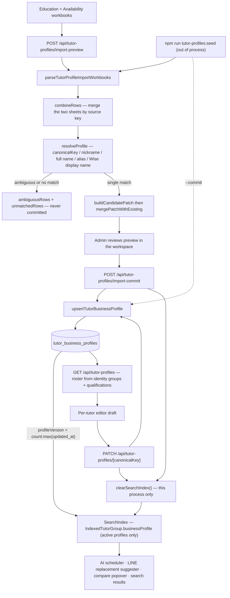

# Tutor Profiles

**Status: stable** — a label from this documentation set, not an in-code marker (no `@deprecated` or status flag exists anywhere in the feature's source). Verified mechanism: one owned table (`tutor_business_profiles`), four admin-session endpoints, one nav-registered page, and a live downstream consumer chain (search index → AI scheduler, LINE replacement suggester, compare popover). No feature flag gates any part of it.

## Purpose

Tutor Profiles is where a human writes down what the Wise pipeline does not carry. What BGScheduler reads from Wise for a teacher is an id, a user reference, a name, and tags (`src/lib/wise/types.ts:9-15`), which the normalization layer turns into schedules, qualifications, and identity. Nothing in that pipeline says "patient with shy eight-year-olds", "IB Maths background", "fluent English", or "do not offer for exam-cram families". A business profile does.

> `WiseTeacher` is deliberately open (`[key: string]: unknown`, `src/lib/wise/types.ts:14`) and this repo never enumerates Wise's full field inventory. The statement above is about what BGScheduler consumes, not a claim about what Wise stores.

Profiles are keyed on a tutor's stable `canonicalKey`, not on a snapshot id (`src/lib/db/schema.ts:1986`), so editorial work written once survives every 30-minute Wise sync.

Two audiences:

- **Admin staff** curate profiles at `/tutor-profiles` — a per-tutor editor plus a two-step preview/commit bulk import from the legacy tutor workbooks. The page is a nav tool in the Scheduling & Tutors section, with no count badge and no pinned shortcut (`src/lib/navigation/tools.ts:134-140`).
- **Machines read them.** Every active profile is folded into the in-memory search index as `IndexedTutorGroup.businessProfile` (`src/lib/search/index.ts:80`, `:220`, `:317`) and from there reaches the AI scheduler's hard filters and ranking (`src/lib/ai/scheduler-conversation.ts:1590-1612`, `src/lib/ai/tutor-profile-signals.ts:213-282`), the LINE replacement-teacher suggester (`src/lib/line/operational.ts:558-578`), and the compare-view tutor popover (`src/components/compare/tutor-profile-popover.tsx:19`, `:53-76`).

The constraint that shapes everything: profiles are **editorial, not operational**. They never establish availability — Wise remains the sole scheduling truth. The importer writes that rule into the record as a literal sentence on every row that came with an Availability-workbook partner: `"Availability.xlsx weekly availability columns were ignored; Wise remains the scheduling source of truth."` (`src/lib/tutor-profile-import.ts:490`, inside the `if (combined.availability)` branch at `:473-502`). An education-only row gets no such note — its branch pushes only the English-fluency provenance line (`:461-471`).

## Conceptual data model

The feature **writes exactly one table** and reads five others. Grain, keys, indexes, and column-level detail live in the [tutor-profiles ERD](../reference/database/erd-tutor-profiles.md); the snapshot-scoped tables it joins against are in the [core ERD](../reference/database/erd-core.md); cross-domain placement is in the [database index](../reference/database/index.md).

- **Tutor business profiles** (`tutor_business_profiles`) — the only table written and the only one the feature owns (`src/lib/db/schema.ts:1985-2019`; created by `drizzle/0018_tutor_business_profiles.sql`, extended with the young-learner and teaching-style fields by `drizzle/0019_tutor_profile_dataset_fields.sql`). Keyed directly on `canonicalKey` as the primary key, so there is at most one profile per logical tutor. It carries four kinds of editorial content: copy that is safe to send a parent; staff-only guidance including a do-not-use caution; structured fit fields and controlled tag arrays the AI scheduler can filter and score on; and self-reported verification metadata (who verified, when last reviewed). The `active` flag withdraws a profile from machine consumers without deleting it. `updatedAt` is load-bearing beyond auditing — see [Business rules](#business-rules--edge-cases).
- **Snapshots** — every request path under `/api/tutor-profiles` resolves the single `active` snapshot first and throws `"No active snapshot found"` if there is none (`src/lib/data/active-snapshot.ts:5-17`): `listTutorBusinessProfiles` (`src/lib/tutor-business-profiles.ts:231`), `listTutorProfileImportIdentities` (`:280`), and `getActiveTutorDisplayNameByCanonicalKey` (`:405`). Two exported readers are deliberately snapshot-agnostic: `loadTutorBusinessProfileMap` (`:323-326`), the read the search index uses, and `listTutorProfileImportAliases` (`:314-321`).
- **Tutor identity groups** — the *source of the roster*. The workspace list is driven by the active snapshot's identity groups, not by the profile table, so every current tutor appears even when nothing has been saved (`src/lib/tutor-business-profiles.ts:262-276`). The group's `supportedModality` enum becomes the list row's `supportedModes` (`:179-183`, `:272`).
- **Tutor identity group members** — the underlying Wise display names per group, read only by the importer to match spreadsheet rows to a canonical key (`src/lib/tutor-business-profiles.ts:279-312`).
- **Subject/level qualifications** — read to decorate each list row with the tutor's Wise subjects (`src/lib/tutor-business-profiles.ts:243-249`, `:254-260`, `:273`).
- **Tutor aliases** — the cross-snapshot `from_key → to_key` nickname table (`src/lib/db/schema.ts:1543-1550`), read unscoped as additional import match keys (`src/lib/tutor-business-profiles.ts:314-321`).

> The tutor-profiles ERD also documents `tutor_contacts` (`src/lib/db/schema.ts:1965-1983`). That table is **not** part of this feature — nothing under `src/app/api/tutor-profiles/`, `src/lib/tutor-business-profiles.ts`, or `src/lib/tutor-profile-import.ts` reads or writes it. Its writers and readers are classroom schedule email (`src/lib/classrooms/schedule-email.ts:173-190`), post-class feedback (`src/lib/post-class-feedback/settings.ts:297-340`, `notifications.ts:413-419`), progress tests, learning plans, and leave-request matching. See [Open questions](#open-questions).

## API surface

All four endpoints are admin-session (`auth()` → `401`); none is cron-protected or public, and none writes to Wise. Full request/response contracts, field limits, and error shapes live in the [Tutor Profiles API reference](../reference/api/tutor-profiles.md) — the canonical home for endpoint mechanics.

| Endpoint | Purpose |
|---|---|
| `GET /api/tutor-profiles` | Roster + profile join: one row per tutor in the active snapshot, with an all-defaults profile synthesized where none is saved (`src/app/api/tutor-profiles/route.ts:6-19`). |
| `PATCH /api/tutor-profiles/[canonicalKey]` | Upsert one tutor's profile from the editor; `404` when the key is absent from the active snapshot; clears the in-process search index on success (`src/app/api/tutor-profiles/[canonicalKey]/route.ts:18-57`). |
| `POST /api/tutor-profiles/import-preview` | Dry-run a multipart workbook upload — parse, match to canonical keys, merge against existing profiles, return proposed patches plus the flagged buckets. Writes nothing (`src/app/api/tutor-profiles/import-preview/route.ts:25-71`). |
| `POST /api/tutor-profiles/import-commit` | Persist the patches the admin reviewed, skipping any key no longer in the active snapshot; clears the index only if at least one row saved (`src/app/api/tutor-profiles/import-commit/route.ts:19-67`). |

For page-restricted admins, middleware treats a `/tutor-profiles` grant as also covering the `/api/tutor-profiles` namespace — the generic page-plus-API prefix rule at `src/middleware.ts:59-66`; the feature has no special case there.

There is also an **out-of-process fifth write path**: `npm run tutor-profiles:seed` (`package.json:20`) runs `scripts/seed-tutor-business-profiles.ts`, which reuses the same parse → preview → `upsertTutorBusinessProfile` pipeline against two local workbooks, writes JSON/CSV audit reports into the gitignored `seed-reports/` directory (`.gitignore:45-46`), and only writes when `--commit` is passed (`scripts/seed-tutor-business-profiles.ts:82`, `:172-179`). It bypasses the HTTP routes entirely and does not call `clearSearchIndex()`, so a seeded change reaches search only through the `profileVersion` staleness check described below.

## UI

One page and one component.

- **`src/app/(app)/tutor-profiles/page.tsx`** — the default export is synchronous and only wraps the body in `<Suspense fallback={null}>` (`page.tsx:15-21`). The async `TutorProfilesBody` awaits `auth()` and redirects to `/login` when `!session?.user?.email` (`page.tsx:6-13`). Neither fetches data; the workspace loads everything over the API.
- **`src/components/tutor-profiles/tutor-profiles-workspace.tsx`** — the entire feature UI in one `"use client"` component, fetching `/api/tutor-profiles` on mount (`:130-154`). Layout is a fixed 310px left rail plus a scrolling detail pane (`:336-337`, `:493`):
  - **Left rail** — the "Import seed data" panel (two `.xlsx/.xls` file inputs for the education and availability/profile workbooks, a "Verified by" text input, a bare `type="date"` review-date input defaulting to today, and a Preview button disabled until at least one file is chosen, `:342-390`); once a preview exists, three counters (matched / review / profile-only, `:393-406`), a six-row sample of matched rows showing `source -> tutor · matchMethod` (`:407-418`), an amber "Review before commit" list of the first eight ambiguous, unmatched, duplicate, and invalid items (`:419-434`), and a `Commit N matched` button disabled when no rows matched (`:435-444`). Below it a search box filtering on display name, canonical key, subjects, parent-safe summary, strength and teaching-style tags, and young-learner notes (`:173-185`), then the tutor list. Each row shows a `Profiled` / `Blank` badge (`:476-478`) computed by `profileHasContent`, which tests sixteen editorial content fields and deliberately ignores `displayName`, `active`, and `updatedAt` (`:89-108`) — a retired profile whose only non-default value is `active: false` still reads `Blank`.
  - **Detail pane** — header with the tutor's display name, canonical-key badge, supported modes, and up to eight Wise subjects, plus the Save button (`:504-519`); then a parent-safe summary textarea (`:523-532`), repeating education and language rows with add/remove (`:534-599`); a "Structured fit" card with English-proficiency and young-learner-fit selects, a 3–20 min-age input, three comma-separated tag inputs, and one-click chips generated from `TEACHING_STYLE_VOCABULARY` (`:603-677`, chips at `:661-672`); an "Internal guidance" card (student fit, do-not-use, internal notes, `:679-693`); and a "Verification" card (verified-by, last-reviewed date with a Today button, active checkbox, `:695-724`).
  - Edits accumulate in a deep-cloned `draft` (`:166`) so the loaded list is never mutated in place; the three tag fields are held as raw text and split on commas only at save time (`:37-46`, `:217-219`). Save posts every field, including the unedited `displayName` (`:220-239`).
- **`src/lib/tutor-profile-vocabulary.ts`** — the shared controlled vocabularies. `TEACHING_STYLE_VOCABULARY` (nine `{ tag, label, synonyms }` entries, `:1-47`) has exactly three consumers: the UI chips (`tutor-profiles-workspace.tsx:10`, `:662`), the importer's synonym inference (`tutor-profile-import.ts:10`, `:421-426`), and — load-bearing — the **AI scheduler**, which imports the same table (`src/lib/ai/scheduler-conversation.ts:21`) to infer a parent's requested teaching-style tags from chat text through the same synonyms (`:653-659`) and to inject the tag list into the LLM extraction prompt (`:2285`). That one shared table is what makes a parent's requested tags line up with the tags an import wrote. `CURRICULUM_EXPERIENCE_VOCABULARY` (ten entries, `:49-60`) is importer-only; the scheduler hardcodes its own curriculum keyword list instead (`scheduler-conversation.ts:642-651`). `STRENGTH_TAG_VOCABULARY` (`:62-71`) and the `TeachingStyleTag` type (`:73`) have no consumer anywhere in `src/` or `scripts/`.

## Data flow

Two paths write, one path reads back.

**Single-profile edit.** Workspace → `PATCH /api/tutor-profiles/[canonicalKey]` → `auth()` → JSON parse → `tutorBusinessProfilePatchSchema.safeParse` (`[canonicalKey]/route.ts:22-40`) → active-snapshot display-name lookup, `404` if absent (`:43-47`) → `upsertTutorBusinessProfile` merges the patch field-by-field over the stored row and upserts on the `canonicalKey` conflict target (`src/lib/tutor-business-profiles.ts:334-398`) → `clearSearchIndex()` (`route.ts:51`).

**Bulk import.** Workbook(s) → `POST import-preview` → `parseTutorProfileImportWorkbooks` (`src/lib/tutor-profile-import.ts:889-900`) → `buildTutorProfileImportPreview` (`:813-887`): combine the two sheets by source key, deterministically match each combined row against active identities and aliases, build a candidate patch from the spreadsheet text, merge it conservatively with the existing profile → the admin reviews matched / unmatched / ambiguous / duplicate / profile-only / invalid buckets → `POST import-commit` re-validates each patch against the same Zod schema, re-checks each key against the active snapshot, and upserts (`import-commit/route.ts:12-17`, `:42-59`).

**Read-back.** The next `ensureIndex()` that rebuilds loads *active* profiles keyed by canonical key and attaches them to each `IndexedTutorGroup` (`src/lib/search/index.ts:220`, `:317`). Search results, compare payloads, the AI scheduler, and the LINE suggester then read them from memory with no further DB access (`src/lib/search/engine.ts:139`, `src/lib/search/compare.ts:316`).

```mermaid
flowchart TD
    XLSX["Education + Availability workbooks"] --> PREVIEW["POST /api/tutor-profiles/import-preview"]
    SEED["npm run tutor-profiles:seed (out of process)"] --> PARSE
    PREVIEW --> PARSE["parseTutorProfileImportWorkbooks"]
    PARSE --> COMBINE["combineRows — merge the two sheets by source key"]
    COMBINE --> MATCH["resolveProfile — canonicalKey / nickname / full name / alias / Wise display name"]
    MATCH -->|ambiguous or no match| BUCKETS["ambiguousRows + unmatchedRows — never committed"]
    MATCH -->|single match| MERGE["buildCandidatePatch then mergePatchWithExisting"]
    MERGE --> REVIEW["Admin reviews preview in the workspace"]
    REVIEW --> COMMIT["POST /api/tutor-profiles/import-commit"]
    EDITOR["Per-tutor editor draft"] --> PATCH["PATCH /api/tutor-profiles/[canonicalKey]"]
    COMMIT --> UPSERT["upsertTutorBusinessProfile"]
    PATCH --> UPSERT
    SEED -.->|--commit| UPSERT
    UPSERT --> TABLE[("tutor_business_profiles")]
    PATCH --> CLEAR["clearSearchIndex() — this process only"]
    COMMIT --> CLEAR
    TABLE -->|"profileVersion = count:max(updated_at)"| INDEX["SearchIndex — IndexedTutorGroup.businessProfile (active profiles only)"]
    CLEAR --> INDEX
    INDEX --> CONSUMERS["AI scheduler · LINE replacement suggester · compare popover · search results"]
    TABLE --> LIST["GET /api/tutor-profiles — roster from identity groups + qualifications"]
    LIST --> EDITOR
```

## Business rules & edge cases

**The roster is the snapshot, not the profile table.** `listTutorBusinessProfiles` starts from the active snapshot's identity groups and synthesizes an all-defaults profile — epoch `updatedAt`, `"unknown"` fit values, empty arrays — for any tutor without a row (`src/lib/tutor-business-profiles.ts:262-276`, `emptyProfile` at `:151-177`). A tutor who drops out of the snapshot disappears from the workspace even though their profile row survives. Both HTTP write paths enforce the same gate: PATCH returns `404` for a key absent from the active snapshot (`src/app/api/tutor-profiles/[canonicalKey]/route.ts:44-47`), and import-commit records it under `skipped` rather than writing (`src/app/api/tutor-profiles/import-commit/route.ts:47-52`). You cannot create a profile for a tutor Wise no longer knows.

**`active` hides a profile from machines but not from editors.** The workspace list uses `selectAllTutorBusinessProfiles` (unfiltered, `src/lib/tutor-business-profiles.ts:209-216`); the search index uses `selectActiveTutorBusinessProfiles` (`:218-228`, via `loadTutorBusinessProfileMap` at `:323-326`). Unchecking "Active profile" therefore withdraws the profile from AI scheduling, compare, and LINE suggestions while keeping it editable.

**Index invalidation is belt-and-braces, and the belt only reaches one process.** Every successful HTTP write calls `clearSearchIndex()` (`[canonicalKey]/route.ts:51`, `import-commit/route.ts:61`), which nulls the `globalThis` singleton and any in-flight build promise (`src/lib/search/index.ts:123-126`) — in the *current* serverless instance only. Every other instance relies on `getTutorProfileVersion()`: `count(*)` plus `max(updated_at)` rendered as `"<count>:<maxUpdatedAt>"` (`:128-137`), compared for plain equality against the cached index's `profileVersion` on every `ensureIndex()` that finds a cached index and no in-flight build (`:358-388`, equality at `:377-381`). Because the comparison is equality rather than ordering, a `max(updated_at)` that moves backwards is already a detected change; the `count(*)` term matters only when the max stays flat — deleting a row that was not the most recently updated. The seed script relies on this passive path exclusively.

**Missing-table fail-soft covers the workspace but not search.** Both profile selects return `[]` when the failure looks like a missing table or column (`src/lib/tutor-business-profiles.ts:209-228`), routed through `isMissingTutorProfileTable` (`:185-207`). That guard is broad: it fires on **any** error whose message or `cause` mentions `tutor_business_profiles` **and** whose text contains `"does not exist"`, the bare word `"column"`, `42P01`, or `42703` (or a `cause.code` of the latter two). `getTutorProfileVersion()` queries the same table with **no** guard (`src/lib/search/index.ts:128-137`) and is awaited unguarded inside `buildIndex`'s `Promise.all` (`:221`) and inside `ensureIndex`'s staleness check (`:374`), so on an un-migrated database the workspace loads but index build and search fail. `upsertTutorBusinessProfile` has no guard either. Unknown enum strings already stored in the two text-typed enum columns degrade to `"unknown"` via `.catch("unknown")` rather than throwing (`src/lib/tutor-business-profiles.ts:134-135`).

**Upsert is a merge, and it distinguishes "absent" from "clear".** Every `undefined` patch field falls back to the stored value (`src/lib/tutor-business-profiles.ts:340-367`). Tag arrays are trimmed and case-insensitively de-duplicated by `normalizeList` (`:112-124`, applied at `:353-356`). `youngestComfortableAge`, `verifiedBy`, and `lastReviewedAt` use `=== undefined` checks, so an explicit `null` clears the field while omission preserves it (`:349-351`, `:359-364`). `updatedAt` is always stamped fresh (`:366`).

**A saved `displayName` freezes and masks later Wise renames.** `displayName` resolves patch → existing row → active snapshot name (`src/lib/tutor-business-profiles.ts:342`), the list prefers the stored name over the group's (`:271`), and the workspace always posts `draft.displayName` back even though the UI has no field to edit it (`tutor-profiles-workspace.tsx:221`). The import path likewise pins `displayName: existing.displayName` (`src/lib/tutor-profile-import.ts:583`). So after the first save of any field, the profile's display name stops tracking Wise.

**Import merges are conservative — existing curation wins.** `mergePatchWithExisting` (`src/lib/tutor-profile-import.ts:578-602`) appends free text rather than replacing it, skipping the append when the incoming block is already contained (`mergeText`, `:526-532`); English proficiency takes the higher of the two ranks (`:573-576`); a non-`unknown` `youngLearnerFit` is never overwritten (`:589`); an existing minimum age wins (`:590`); `verifiedBy` and `lastReviewedAt` keep existing values when present (`:598-599`), so the import panel's "Verified by" and date only stamp profiles that have none. Two fields the importer can never touch: `doNotUseForNotes` and `active` are copied straight from the existing row (`:597`, `:600`) — a bulk import can neither erase a caution note nor reactivate a retired profile. One side effect of append-not-replace: a re-import whose provenance block differs even slightly (a changed tier, a new highlight) appends the whole block again, so `internalNotes` grows across re-imports until the 3000-character clamp truncates it.

**Import matching is deterministic and fail-closed.** Candidate keys are tried in a fixed order — education `canonicalKey`, availability `canonicalKey`, availability nickname, availability full name, education full name (`src/lib/tutor-profile-import.ts:738-753`). Each is normalized by `normalizeKey`, which lowercases, strips parentheses and punctuation, and **deletes the literal word "online"** so a Wise online-variant name collapses onto its onsite twin (`:183-191`). Wise display names of the form `Legal (Nick) Last` are expanded into five lookup forms — display name, nickname, legal full name, nickname + last, legal + nickname + last (`:224-253`, registered at `:697-704`) — which lets a spreadsheet row with the legal and nickname fields swapped still resolve. Aliases are registered in both directions onto the target they point at (`:707-713`). If a normalized key resolves to more than one distinct canonical key the row is **ambiguous** and excluded from `rows`, so it can never reach commit (`:718-736`, `:834-845`); rows matching nothing land in `unmatchedRows` with the list of keys tried (`:823-832`). The workspace only ever posts `preview.rows` (`tutor-profiles-workspace.tsx:305-310`).

**Inference from free text is additive and conservative.** `buildCandidatePatch` (`src/lib/tutor-profile-import.ts:443-524`) derives curriculum tags by keyword — with a special-cased `A-Level` / `IAL` regex and a broad `International` trigger (`:411-419`) — teaching-style tags from the synonym table (`:421-426`), strength tags `writing` / `exam prep` by regex (`:495-496`), and a young-learner guess: `comfortable`, minimum age 6 when the text mentions primary or elementary, plus a note recording that the value was inferred (`:428-437`). English proficiency maps only explicit values; a bare "Yes" becomes `fluent` (not `native`), anything unrecognized stays `unknown` (`:386-393`), and a language row is emitted only when the level is known (`:508-510`). Long text fields are clamped with an ellipsis to the same limits the Zod schema enforces (`:171-173`, `:439-441`).

**A preview patch can still be rejected whole at commit.** Text lengths are clamped, but array sizes are not: `mergeTags` neither caps the entry count nor truncates individual tags (`src/lib/tutor-profile-import.ts:534-541`), and `mergeEducation` appends without bound (`:543-556`), while `tutorBusinessProfilePatchSchema` allows at most 30 tags of 80 characters and 12 education entries (`src/lib/tutor-business-profiles.ts:40-49`). Import-commit re-validates every row against that schema in one `safeParse` (`import-commit/route.ts:32-38`), so a single over-long spreadsheet tag or an over-full merged education list fails the entire commit with `400` and writes nothing. The commit body is also capped at 200 rows (`:16`), and the workspace never chunks (`tutor-profiles-workspace.tsx:305-310`).

**Provenance notes are hardcoded to the original workbook names.** Regardless of the uploaded filename, internal notes and language verification sources are stamped `BeGifted Tutors-3.xlsx` (`src/lib/tutor-profile-import.ts:469`, `:510`) and `Availability.xlsx` (`:485`, `:490`). The other note pushes carry bare `Profile picture reference:` / `Academic background:` / `Academic achievement:` / `Highlights:` prefixes (`:486-489`). The seed script's default paths point at those same two filenames in a developer's `~/Downloads` (`scripts/seed-tutor-business-profiles.ts:18-19`).

**The availability workbook has two accepted shapes, and the committed file with that name fits neither.** If a `canonicalKey` header exists in row 0 the parser reads by header aliases; otherwise it assumes a two-row header and **fixed column positions** 0–3 (tier, nickname, firstName, lastName) and 18–21 (academic background, achievement, highlights, profile picture) (`src/lib/tutor-profile-import.ts:314-359`; header test `:318-320`, positional branch `:346-356`). Only the first sheet is ever read (`:276-287`). A git-tracked `Availability.xlsx` sits at the repo root (added in the initial commit `c602e19`). Its first sheet, `Master`, is an 8-column weekday grid of 81 rows — row 0 `["","2","3","4","5","6","7","8"]`, row 1 `Tutor | Mon | … | Sun`, then one tutor per row (inspected with the `xlsx` library on 2026-09-02). Fed to the positional branch it yields `tier` ← tutor name, `nickname` ← Monday hours, `firstName`/`lastName` ← Tuesday/Wednesday hours, and `undefined` for columns 18–21. Whatever sheet the indices were written against is not this one.

**The education parser never reads a nickname.** It is header-driven only (`src/lib/tutor-profile-import.ts:289-312`), so education-only rows match on canonical key or full name but never on nickname.

**Row bucketing and its one gap.** Duplicate source keys → `duplicateSourceRows` (`src/lib/tutor-profile-import.ts:611-639`); availability rows with no education partner → `availabilityOnlyRows` plus a per-row warning (`:641-644`, `:807-809`); matched rows lacking an explicit `canonicalKey` get a "Missing canonicalKey; matched by …" warning (`:802-806`). `parseAge` returns `null` for anything non-integer or outside 3–20 (`:378-384`), but the `invalidRows` entry is pushed only inside the matched-row branch (`:849-851`), so a bad age on an unmatched or ambiguous row is never surfaced.

**Dates in the workspace are UTC, not Bangkok.** `todayIsoDate()` slices `new Date().toISOString()` (`tutor-profiles-workspace.tsx:48-50`) and `datetimeFromDateInput` pins the chosen day to `T00:00:00.000Z` (`:56-58`). Both the import panel's default review date (`:125`) and the verification card's Today button (`:710-712`) therefore record the UTC calendar day; between 00:00 and 07:00 Asia/Bangkok that is yesterday's date. Every other timestamp in the app is normalized to Asia/Bangkok.

**Downstream fail-closed behaviour.** When the AI scheduler holds *hard* business requirements — an English-proficiency floor, a young-learner age, or school keywords (`src/lib/ai/scheduler-conversation.ts:1566-1572`) — a tutor with no profile at all is excluded rather than assumed acceptable (`:1596`), a young-learner request demands `youngLearnerFit === "comfortable"` **and** a non-null `youngestComfortableAge` at or below the requested age (`:1604-1608`), and school keywords must all appear in the profile's education entries (`:1574-1588`). A non-empty `doNotUseForNotes` always contributes a negative signal; one whose text overlaps the request escalates to a `review` reason scoring −6 (`src/lib/ai/tutor-profile-signals.ts:187-211`), and any `review` reason removes the tutor from suggestions outright (`scheduler-conversation.ts:1724`, `:1936`). Structured tags always outscore the same word found only in free text (`tutor-profile-signals.ts:232-263`). The LINE replacement suggester scores overlap of `strengthTags` (+8 each) and `teachingStyleTags` (+5 each) between the original teacher's profile and each candidate's (`src/lib/line/operational.ts:558-578`).

**No cron, no Wise write, no other table.** The feature is interactive-only; nothing in `vercel.json` or the Data Health cron registry references it, and the only external system it reads is Postgres.

## Tests

`src/lib/__tests__/tutor-profile-import.test.ts` is the only test file owned by this feature. Its five cases all target `buildTutorProfileImportPreview` — matching and merge — with hand-built row fixtures, not real workbooks:

- availability-only rows are counted and an unmatched education row surfaces by source name against an 80-tutor seed shape (`:65-86`);
- English fluency maps conservatively, the "Wise remains the scheduling source of truth" note is present, and young-learner + teaching-style inference fires (`:88-103`);
- the alias table stabilizes nickname matching and the "Missing canonicalKey" warning is emitted (`:105-121`);
- a swapped legal-first-name / Wise-nickname row resolves via `wiseNicknameLastName` (`:123-148`);
- two tutors sharing a nickname produce an ambiguous row carrying both candidates and zero committable rows (`:150-175`).

Downstream suites exercise profiles as consumers: `src/lib/ai/__tests__/scheduler-conversation.test.ts` covers the fluent-English hard filter (`:382`), missing profile not counting as a positive match (`:433`), the young-learner age gate (`:458`), teaching style as ranking-only context (`:531`), structured-over-notes ranking (`:586`), and caution-note exclusion (`:644`); `src/lib/search/__tests__/index.test.ts` pins the profile-version freshness check to exactly two selects on the cached path (`:18-23`, `:183-186`).

Not covered by any test: `parseEducationWorkbook` / `parseAvailabilityWorkbook` (including the positional branch), `upsertTutorBusinessProfile`'s keep-vs-clear semantics, `listTutorBusinessProfiles` roster synthesis, `isMissingTutorProfileTable`, the seed script, the workspace component, and all four route handlers (no file under `src/app/api/**/__tests__` references `tutor-profiles`).

## Open questions

- **Is `STRENGTH_TAG_VOCABULARY` dead?** Exported from `src/lib/tutor-profile-vocabulary.ts:62-71` and referenced nowhere in `src/` or `scripts/`; the workspace's strength-tag field is free text with a placeholder, and the importer infers only `writing` / `exam prep` by regex. The exported `TeachingStyleTag` type (`:73`) is likewise unreferenced. Were these meant to back chips like the teaching-style ones?
- **Is the preview's `vocabulary` payload dead?** `TutorProfileImportPreview.vocabulary` ships both vocabularies to the client (`src/lib/tutor-profile-import.ts:119-122`, `:882-885`), but nothing reads `.vocabulary` — the workspace imports `TEACHING_STYLE_VOCABULARY` directly.
- **Should the importer's hardcoded workbook names be parameterized?** `BeGifted Tutors-3.xlsx` and `Availability.xlsx` are written into `internalNotes` and `languages[].verificationSource` regardless of what was uploaded (`:469`, `:485`, `:490`, `:510`), so a re-import from a differently named file records a false provenance trail.
- **What layout does the positional branch of `parseAvailabilityWorkbook` target, and is it still needed?** The only workbook in the repo with the hardcoded name — the git-tracked root `Availability.xlsx` — has an 8-column weekday grid on its first sheet and contradicts the 0–3 / 18–21 indices (`src/lib/tutor-profile-import.ts:346-356`). Either the branch is a one-time historical seed path to delete, or it needs a header-based fallback plus a committed fixture matching the real layout.
- **Is the seed script an ongoing operator tool or a retired one-off?** `scripts/seed-tutor-business-profiles.ts` defaults to a specific developer's `~/Downloads` paths (`:18-19`), bypasses `clearSearchIndex()`, and is documented in no runbook. If it stays, its defaults and the `--expect-count` refusal guard (`:113-115`) deserve a runbook entry; if not, the npm script should go.
- **Should the display name track Wise after the first save?** Once any field is saved the stored `displayName` masks later Wise renames (`src/lib/tutor-business-profiles.ts:342`, `:271`; `tutor-profiles-workspace.tsx:221`). Is a frozen editorial name intended, or should the roster name always win and the column be dropped from the PATCH payload?
- **Should the workspace use Bangkok dates?** "Today" and the import default review date are UTC calendar days (`tutor-profiles-workspace.tsx:48-58`, `:125`, `:710-712`), unlike the rest of the app.
- **Should preview pre-validate patches against the commit schema?** A merged patch can exceed the 30-tag / 80-character / 12-education Zod caps that import-commit enforces as a whole-batch `400` (`src/lib/tutor-profile-import.ts:534-556`; `src/lib/tutor-business-profiles.ts:40-49`; `import-commit/route.ts:32-38`). Relatedly, should the workspace chunk commits above the 200-row cap instead of failing outright?
- **Should `invalidRows` also report bad ages on unmatched and ambiguous rows?** Today an out-of-range age reaches the preview only when the row matched a tutor (`src/lib/tutor-profile-import.ts:849-851`).
- **Should `getTutorProfileVersion()` share the missing-table guard?** It is the one profile-table query without `isMissingTutorProfileTable` (`src/lib/search/index.ts:128-137`), which is why an un-migrated database breaks search while leaving the workspace usable. And should the guard itself match SQLSTATE rather than the bare substring `"column"` (`src/lib/tutor-business-profiles.ts:200-201`)?
- **Is `verifiedBy` / `lastReviewedAt` the intended level of accountability?** The upsert stores whatever the client sends (`src/lib/tutor-business-profiles.ts:359-364`); nothing stamps the session user, and there is no per-edit history table — so the only record of who changed a do-not-use note is a manually typed string.
- **Who owns `tutor_contacts`?** The reference ERD files it under this feature, but no tutor-profiles code path reads or writes it; its writers are classroom schedule email and post-class feedback settings. Should the reference docs re-home it, or should this feature grow a contacts editor?

_Verified against main@0cd1e81 (clean tree) on 2026-09-02._
