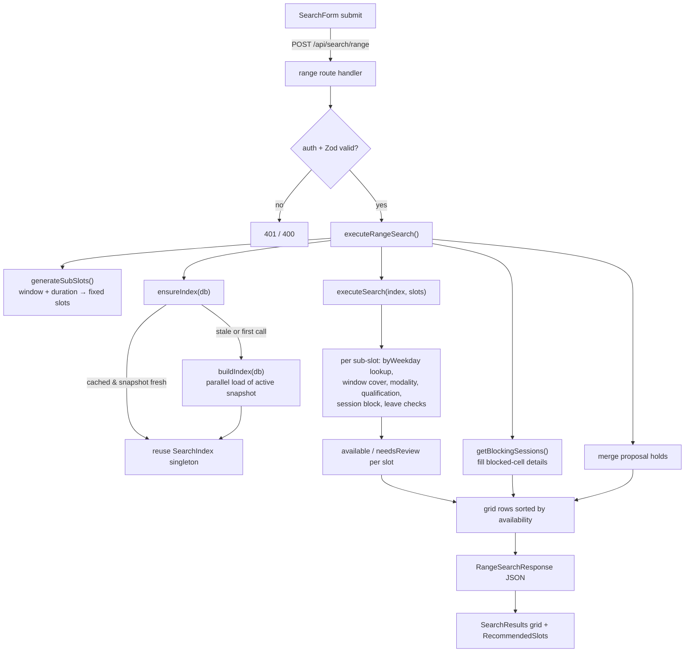

# Tutor Search

The search code carries no `@deprecated` markers and is the live primary entry point of the application.

## Purpose

Tutor Search answers one question for non-technical admin staff: *which tutors are free for a class at this time, and are they qualified for it?* An admin picks a day (or date), a time window, a class duration, and optional subject/curriculum/level/modality/tutor filters. The system returns a grid of qualified tutors with each candidate sub-slot marked available or blocked, plus a "Needs Review" section for tutors whose data could not be safely resolved.

It is the primary entry point of the application (`/` redirects to `/search`) and feeds directly into the Compare workflow on the right-hand panel. Two supporting read endpoints — filters and tutors — populate the form's dropdowns and the tutor combobox from the active snapshot.

The defining performance characteristic is that **all search logic runs against an in-memory index**, not the database. The entire active snapshot is loaded once into a process-global `SearchIndex` singleton; every search, range search, and compare query reads from that structure with zero additional DB round-trips on the hot path (`src/lib/search/index.ts`, `src/lib/search/engine.ts`).

## Conceptual data model

Tutor Search is **read-only**. It writes nothing. It loads the active snapshot's normalized tutor data into memory and queries it.

`buildIndex()` loads, in parallel, the following snapshot-scoped tables and denormalizes them into one aggregate per tutor (`src/lib/search/index.ts:142`–`344`):

- **Snapshots** — locates the single `active` snapshot; all subsequent reads are scoped to its `snapshotId` (`index.ts:144`).
- **Sync runs** — finds the most recent successful sync that promoted the active snapshot, to derive `syncedAt` for staleness checks (`index.ts:155`).
- **Tutor identity groups** + **members** — the logical tutor and its underlying Wise teacher records (online/onsite variants) (`index.ts:169`, `:176`).
- **Subject/level qualifications** — subject + curriculum + level + examPrep per group (`index.ts:181`).
- **Recurring availability windows** — weekday + minute range + modality (`index.ts:185`).
- **Dated leaves** — exact leave windows that block availability (`index.ts:188`).
- **Future session blocks** — Wise sessions that block a weekday/time, with a precomputed `isBlocking` flag (`index.ts:192`).
- **Data issues** — unresolved normalization problems, matched to groups by canonical key / id / display name; their presence routes a tutor to Needs Review (`index.ts:216`, `:232`).
- **Tutor business profiles** — optional enrichment attached by canonical key (`index.ts:220`, `:317`).

The two supporting endpoints read the same snapshot tables directly (not via the index): filters reads `subject_level_qualifications` (`src/lib/data/filters.ts`); tutors reads `tutor_identity_groups` joined to `subject_level_qualifications` (`src/lib/data/tutors.ts`). Both are wrapped in Next.js `"use cache"` functions tagged `snapshot` so they invalidate when a new snapshot is promoted.

The column-level definitions of every table above (snapshots, sync runs, identity groups/members, qualifications, availability windows, leaves, session blocks, data issues) live in the Drizzle schema, which is the authoritative source: `src/lib/db/schema.ts`. There is no standalone database-reference doc under `docs/reference/` yet.

## API surface

There is no standalone API-reference doc under `docs/reference/` yet; for each endpoint the route handler and its Zod request schema are the authoritative request/response contract. This section lists purpose and the handler path.

- **`POST /api/search/range`** — the primary search. Takes a time window + class duration, generates fixed-length sub-slots, and returns an availability grid (`true` / blocking-session details per cell) plus Needs Review. Handler: `src/app/api/search/range/route.ts`.
- **`POST /api/search`** — legacy slot-based search kept for backward compatibility; caller supplies explicit slots and gets per-slot availability + an intersection across slots. Handler: `src/app/api/search/route.ts`.
- **`GET /api/filters`** — distinct subjects, curriculums, levels from the active snapshot, for dropdown population. Handler: `src/app/api/filters/route.ts`.
- **`GET /api/tutors`** — all tutors (id, display name, supported modes, subjects) sorted by name, for the tutor combobox. Handler: `src/app/api/tutors/route.ts`.

A third route, **`POST /api/search/assistant`** (`src/app/api/search/assistant/route.ts`), lives under the same path prefix but belongs to the AI Scheduler feature — it drives an LLM conversation that ultimately produces the same range-search-shaped suggestions. It is documented with that feature, not here.

All four endpoints in scope are auth-gated: they return `401` if there is no session (`auth()` at `route.ts:31`, guard at `:32`, 401 return at `:33` in search; `auth()` at `:6`, guard at `:7`, 401 return at `:8` in filters/tutors), `400` on invalid JSON or Zod validation failure, and `500` on internal error.

## UI

- **Page**: `src/app/(app)/search/page.tsx` — an `async` server component that awaits `getFilterOptions()` and `getTutorList()` at the server-component level (`page.tsx:8`–`9`), then passes both as props into the client workspace, which it wraps in `<Suspense fallback={<SearchSkeleton />}>` (`page.tsx:12`). Because the two awaits resolve before the JSX renders, the Suspense fallback covers only the client workspace's own suspension (e.g. its `useSearchParams` read), not the data loads.
- **Orchestrator**: `src/components/search/search-workspace.tsx` — the `"use client"` split-panel shell. Left half is search; right half is the Compare panel (`compare/compare-panel.tsx`). It owns the `RangeSearchResponse` state, deep-link handling (`?tutors=`, `?week=`), keyboard week navigation, fullscreen toggle, and proposal-hold overlay wiring. The search feature proper is the left half.

Key search-side components under `src/components/search/`:
- **`search-form.tsx`** — the compact 3-row form: recurring/one-time toggle, tutor combobox (shadcn Command + Popover), day/date + From/To time selects, duration + mode + Search button, subject/curriculum/level dropdowns, and an "N filters active · Clear all" summary. Posts to `/api/search/range`. Defaults are tuned to the tutor working window (15:00–20:00, 90 min) so staff get useful results on first click (`search-form.tsx:86`–`89`).
- **`recommended-slots.tsx`** — renders the auto-ranked hero slot cards derived client-side from the range response.
- **`search-results.tsx`** / **`availability-grid.tsx`** / **`results-view.tsx`** — the availability grid table and result rows.
- **`recent-searches.tsx`** — last-10 searches persisted in `localStorage`.
- **`copy-for-parent-drawer.tsx`**, **`copy-button.tsx`** — parent-message composition from the selected slots.

Supporting client-side ranking logic lives in `src/lib/search/recommend.ts` (`getRecommendedSlots`), which the workspace and `recommended-slots.tsx` consume to build the hero cards.

## Data flow

A search request flows: form → range endpoint → in-memory index → engine → grid response. The index is built lazily on the first request after a snapshot change and reused thereafter.

Step detail:

1. **`generateSubSlots(startTime, endTime, durationMinutes)`** walks the window in non-overlapping `durationMinutes` steps; an empty result (window shorter than duration) returns `400` (`range-search.ts:41`, route guard at `range/route.ts:31`).
2. **`ensureIndex(db)`** returns the cached singleton if the active snapshot id and tutor-profile version still match, otherwise rebuilds (`index.ts:354`). Concurrent first-time callers coalesce onto a single in-flight build promise (`index.ts:358`, `:396`).
3. **`executeSearch`** runs each sub-slot through `searchSlot`, then computes an intersection of tutors available in *all* slots for the legacy shape (`engine.ts:22`, `:323`).
4. **`searchSlot`** resolves the weekday, pulls candidates from `index.byWeekday`, and filters by modality, availability-window coverage, qualifications, session blocking, and leaves before classifying each tutor as Available or Needs Review (`engine.ts:60`).
5. **`executeRangeSearch`** reshapes per-slot results into a per-tutor grid (`true` where free), back-fills blocked cells with `getBlockingSessions` detail, overlays active proposal holds, optionally filters to requested `tutorGroupIds`, and sorts rows by free-cell count (`range-search.ts:103`).

## Business rules & edge cases

- **Fail-closed to Needs Review, never silently dropped.** A tutor with any `dataIssue`, or with unresolved modality (`supportedModes.length === 0`), is routed to `needsReview` with reasons rather than appearing as Available (`engine.ts:86`–`92`, `:142`). Unresolved supported-modality maps to an empty modes array at index-build time (`index.ts:265`–`270`).
- **Mode mismatch is a hard skip, not a review.** If the slot requests a specific mode and the group does not support it at all, the candidate is dropped entirely (`engine.ts:93`–`97`). The same modality check is applied a second time at the availability-window granularity (`engine.ts:104`).
- **Availability window must fully cover the slot.** A window qualifies only if `startMinute <= slot.start` and `endMinute >= slot.end` on the matching weekday (`engine.ts:100`–`106`).
- **Recurring vs one-time blocking differ.** Recurring mode blocks if *any* future session overlaps the same weekday + minute range (`isBlockedRecurring`, `engine.ts:155`). One-time mode blocks only when a session falls on the exact calendar date and overlaps (`isBlockedOneTime`, `engine.ts:173`).
- **Cancelled sessions never block.** Only sessions with the precomputed `isBlocking` flag are considered; cancelled/non-blocking sessions are skipped in every blocking check (`engine.ts:163`, `:182`, `:211`). The flag itself is set fail-closed upstream (unknown status → blocking) in the normalization pipeline.
- **Multi-day leave blocks every weekday it touches, in full.** A leave longer than 24h is treated as whole-day coverage for each calendar day in its span — no minute-of-day math on middle days. Single-day leaves use minute-of-day overlap on the leave's own weekday (`hasRecurringLeaveConflict`, `engine.ts:251`–`289`, with the REL-04 rationale in the docstring at `:240`).
- **Snapshot freshness is surfaced, not enforced.** `executeSearch` stamps `snapshotMeta.stale = true` and pushes a warning when the snapshot is older than the API stale threshold (90 minutes), but still returns results (`engine.ts:30`–`38`; threshold `API_STALE_THRESHOLD_MS` in `src/lib/ops/stale.ts`).
- **No active snapshot is a hard failure.** `buildIndex` throws `"No active snapshot found"` if no snapshot is `active` (`index.ts:150`); the supporting endpoints throw the same via `getActiveSnapshotIdOrThrow` (`src/lib/data/active-snapshot.ts`). Note the asymmetry: if a snapshot was active and later disappears, `ensureIndex` returns the *stale cached* index rather than throwing (`index.ts:384`–`386`).
- **Range duration is constrained.** `durationMinutes` is validated to exactly 60, 90, or 120 by the Zod schema (`range-search.ts:22`–`27`).
- **Optional tutor pre-filter.** `range` accepts `tutorGroupIds`; when present, the grid and Needs Review map are pruned to that set *after* the full search runs (`range-search.ts:207`–`215`).
- **Proposal holds overlay availability.** A free cell that overlaps an active proposal hold for the same tutor (matched by `tutorCanonicalKey`) is downgraded to a `proposal_hold` blocking entry in the grid (`range-search.ts:144`, `:166`; client mirror in `search-workspace.tsx:194`–`235`).
- **Client-side recommendation ranking.** `getRecommendedSlots` ranks sub-slots by count of fully-available qualified tutors, drops zero-availability slots, breaks ties by earliest start, and tags the top three "Best / Strong / Good fit" (`recommend.ts:20`–`70`).
- **Caching invalidation.** `getFilterOptions` / `getTutorList` are `"use cache"` with `cacheTag("snapshot")` and `cacheLife("hours")` (`src/lib/data/filters.ts`, `src/lib/data/tutors.ts`); the in-memory index instead invalidates on snapshot-id or tutor-profile-version change inside `ensureIndex`.

## Tests

Search-engine and index logic (`src/lib/search/__tests__/`):
- **`engine.test.ts`** — recurring blocking, cancelled-session non-blocking, Needs Review routing for data issues and unresolved modality, mode filtering, subject/curriculum/level filtering, multi-slot intersection, one-time exact-date blocking, the 90-minute stale threshold, and REL-04 multi-day vs single-day leave overlap.
- **`index.test.ts`** — REL-02 race-free coalescing of concurrent builds, cached-index reuse when the snapshot matches, single-rebuild-under-race, TCOV-01 denormalization (one group per row, child rows attached by groupId, supported-modes/data-issue mapping in the documented parallel-load order), `byWeekday` population (entry per weekday, dedupe per weekday, omission when no windows), and the snapshot-active race fallback returning the cached index without throwing.
- **`recommend.test.ts`** — empty-input guards, Best/Strong/Good tiering, ranking by available-tutor count DESC, start-time tie-break, zero-availability filtering, limit handling, modality reason strings, and the 3+-tutor "variety" reason.
- **`parser.test.ts`** — free-text slot parsing: single/multi/comma-separated slots, abbreviated day names, en-dash separators, default mode, and unparseable-input warnings.

API route tests:
- **`src/app/api/search/range/__tests__/route.test.ts`** — 401 unauthenticated, 400 on Zod failure, 400 when the window is shorter than the duration, 200 response shape, proposal-hold cells marked blocked, and 500 when `ensureIndex` throws.
- **`src/app/api/search/__tests__/route.test.ts`** — 401 / 400 / 200 shape / 500-on-index-throw for the legacy endpoint.
- **`src/app/api/filters/__tests__/route.test.ts`** and **`src/app/api/tutors/__tests__/route.test.ts`** — 401 unauthenticated, 200 with sorted values, and 500 on loader failure.

## Open questions

- **`searchSlot` weekday derivation for one-time mode** uses `new Date(slot.date).getDay()` (`engine.ts:68`), which is local-timezone dependent, whereas the range layer uses `weekdayForIsoDate` (`range-search.ts:142`). For dates near a day boundary in `Asia/Bangkok` these could disagree. Is the legacy `/api/search` path still exercised with one-time mode, or is range now the only consumer? If legacy is effectively dead, this divergence may be moot.
- **The legacy `/api/search` endpoint** is labelled "kept for backward compatibility" — is any current UI still calling it, or is it retained only for external/bookmarked callers? Confirming would clarify whether the two weekday-derivation paths need to be reconciled.
- **`getBlockingSessions` supports both modes but the grid only ever calls it after a slot is already not-`true`** (`range-search.ts:182`–`204`); the proposal-hold branch short-circuits before it. Worth confirming no blocked cell can end up with an empty detail array that the UI renders as a bare "blocked" with no reason.
- **`parser.ts` (`parseSlotInput`)** has its own test suite but no in-scope caller was found among the read files (the form posts structured params, not free text). Is it wired to a slot-input UI elsewhere, reserved for the AI scheduler, or dead code?

_Verified against HEAD + uncommitted WIP on 2026-05-31._
