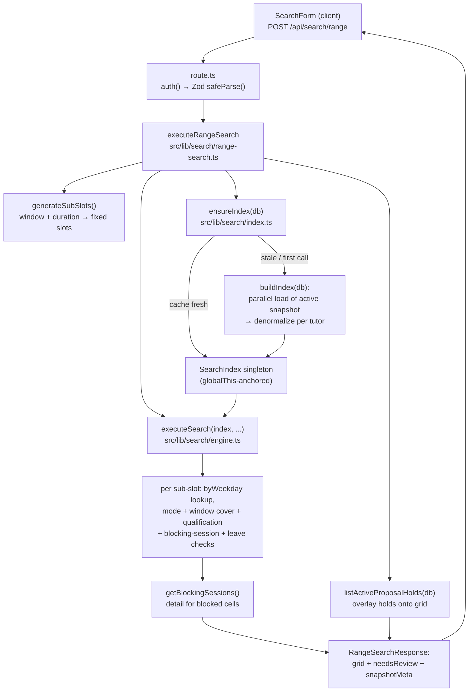

# Tutor Search

**Status: stable** — the primary tutor-search workflow, served at `/search`. The search code carries no `@deprecated` markers. The root `/` no longer redirects here; as of `d4fe6d3` it renders the [Ops Hub](./ops-hub.md) (`src/app/(app)/page.tsx`).

## Purpose

Tutor Search answers one question for non-technical admin staff: *which tutors are free for a class at this time, and are they qualified for it?* An admin picks a day (or a specific date), a time window, a class duration, and optional subject / curriculum / level / modality / tutor filters. The system returns a grid of qualified tutors with each candidate sub-slot marked available or blocked, a "Needs Review" section for tutors whose data could not be safely resolved, and a small set of auto-ranked recommended slots to copy into a parent message.

It is the primary entry point of the application and feeds directly into the [Tutor Compare](tutor-compare.md) workflow rendered on the right-hand half of the same page. Two supporting read endpoints — filters and tutors — populate the form's dropdowns and the searchable tutor combobox from the active snapshot.

The defining characteristic is performance: **all search logic runs against an in-memory index, never the database on the hot path.** The entire active snapshot is loaded once into a process-global `SearchIndex` singleton; every search and range search reads from that structure with zero additional DB round-trips after the index is warm (`src/lib/search/index.ts`, `src/lib/search/engine.ts`).

## Conceptual data model

Tutor Search is **read-only — it writes nothing.** It loads the active snapshot's normalized tutor data into memory and queries it.

`buildIndex()` locates the single `active` snapshot, scopes every subsequent read to its `snapshotId`, and loads the following snapshot-scoped tables in parallel, denormalizing them into one `IndexedTutorGroup` aggregate per tutor (`src/lib/search/index.ts:142`–`344`):

- **Snapshots** — finds the one row where `active = true`; the absence of an active snapshot throws `"No active snapshot found"` (`index.ts:144`–`152`).
- **Sync runs** — the most recent `success` run whose `promotedSnapshotId` matches the active snapshot, used to derive `syncedAt` for staleness checks; falls back to the snapshot's `createdAt`, then `new Date()` (`index.ts:155`–`166`).
- **Tutor identity groups** + **group members** — the logical tutor and its underlying Wise teacher records (online/onsite variants) (`index.ts:169`, `:176`).
- **Subject/level qualifications** — subject + curriculum + level + optional examPrep per group (`index.ts:181`).
- **Recurring availability windows** — weekday + minute-of-day range + modality (`index.ts:185`).
- **Dated leaves** — exact leave windows that block availability (`index.ts:188`).
- **Future session blocks** — Wise sessions with a precomputed `isBlocking` flag and denormalized weekday / minute bounds (`index.ts:192`).
- **Data issues** — unresolved normalization problems, matched to groups by `entityId` (canonical key or group id) or `entityName` (display name); any match routes the tutor to Needs Review (`index.ts:216`, `:232`–`247`).
- **Tutor business profiles** — optional editorial enrichment attached by `canonicalKey` (`index.ts:220`, `:317`); see [Tutor Profiles](tutor-profiles.md).

Each group also denormalizes its stable `canonicalKey` onto the in-memory record (design decision **D-04**) so downstream consumers (e.g. the Compare historical-session fetcher) can resolve the cross-snapshot anchor without an extra DB query (`index.ts:67`–`71`, `:260`–`263`).

The two supporting endpoints read the same snapshot tables **directly**, not via the index: filters reads `subject_level_qualifications` (`src/lib/data/filters.ts:39`); tutors reads `tutor_identity_groups` alongside `subject_level_qualifications` (`src/lib/data/tutors.ts:58`). Both are wrapped in Next.js `"use cache"` functions tagged `snapshot` with `cacheLife("hours")`, so they invalidate when a new snapshot is promoted and `revalidateTag("snapshot")` fires (`filters.ts:52`–`58`, `tutors.ts:80`–`86`).

All of these tables live in the Core domain. For column-level detail and the ER diagram, see [docs/reference/database/erd-core.md](../reference/database/erd-core.md) (and [erd-tutor-profiles.md](../reference/database/erd-tutor-profiles.md) for the business-profile enrichment).

## API surface

Full request/response contracts live in the API reference — this feature LINKS rather than restates them. See [docs/reference/api/misc.md](../reference/api/misc.md) (the "Search, Tutors, Filters" group).

| Method + path | Purpose |
|---|---|
| `POST /api/search/range` | **Recommended** form. Slices a time window into fixed sub-slots and returns an availability grid + Needs-Review list. Source: `src/app/api/search/range/route.ts`. |
| `POST /api/search` | Legacy slot-based search kept for backward compatibility; returns per-slot results + an intersection across slots. Source: `src/app/api/search/route.ts`. |
| `POST /api/search/assistant` | Natural-language single-turn scheduling assistant. Public in the middleware allowlist but session-gated in-handler; delegates entirely to the AI scheduler service. Owned by the [AI Scheduler](ai-scheduler.md) feature — see [docs/reference/api/ai-scheduler.md](../reference/api/ai-scheduler.md). Source: `src/app/api/search/assistant/route.ts`. |
| `GET /api/tutors` | All tutor names / IDs / modes / subjects from the active snapshot — the data source for the searchable tutor combobox. Source: `src/app/api/tutors/route.ts`. |
| `GET /api/filters` | Distinct subjects / curriculums / levels from the active snapshot, for the search-form dropdowns. Source: `src/app/api/filters/route.ts`. |

All five follow the shared auth-first pattern: `auth()` → `401` when no session (`src/app/api/search/route.ts:31`–`33`). The two `POST` search routes additionally validate the body with a module-scope Zod schema and return `400 { error, details }` on failure (`range/route.ts:19`–`25`, `route.ts:43`–`49`). `/api/search/assistant` is the one route in this group on the middleware public allowlist (`src/middleware.ts:8`) yet it still enforces a session in-handler (`assistant/route.ts:136`–`139`).

The Compare endpoints (`POST /api/compare`, `POST /api/compare/discover`) consume the same `SearchIndex` but belong to the [Tutor Compare](tutor-compare.md) feature.

## UI

The page lives at `src/app/(app)/search/page.tsx` — an async Server Component that calls `connection()`, fetches `getFilterOptions()` + `getTutorList()` on the server, and renders `<SearchWorkspace>` inside a `<Suspense>` with a `<SearchSkeleton>` fallback (`page.tsx:8`–`22`). `src/app/(app)/search/loading.tsx` renders the same skeleton during navigation. Because the two awaits resolve before the JSX renders, the Suspense fallback covers only the client workspace's own suspension (its `useSearchParams` read), not the data loads.

`SearchWorkspace` (`src/components/search/search-workspace.tsx`) is the client shell. It owns a 50/50 split: the **search side** (left) and the **compare side** (right), with a fullscreen toggle that collapses the left panel to width 0 and an Esc handler to exit (`search-workspace.tsx:159`–`169`, `:284`–`354`). It also wires deep-linking: on mount it reads `?tutors=` and `?week=` from the URL and hydrates the compare panel, and it mirrors the selected tutor IDs + week back into the URL via `history.replaceState` (non-navigating) (`:100`–`137`). `ArrowLeft`/`ArrowRight` shift the compared week unless a text input is focused (`:140`–`156`).

Key search-side components under `src/components/search/`:

- **`search-form.tsx`** — the compact form: Recurring/One-Time toggle, day/date, From/To time selects (15-min steps), duration (1 / 1.5 / 2 hr), mode (Either/Online/Onsite), subject/curriculum/level dropdowns, and a `cmdk` combobox for multi-selecting specific tutors. Defaults to a 15:00–20:00 / 90-min window so staff get sensible results without knowing the tutor working hours (`search-form.tsx:86`–`89`). It POSTs to `/api/search/range`, lifts the response up via `onSearchResponse`, and persists the query to a `RecentSearches` list; restoring a recent search sets state then fires a deferred search via a `pendingSearch` flag (`:182`–`205`).
- **`recommended-slots.tsx`** — renders up to three auto-ranked slot cards (Best/Strong/Good fit) from `getRecommendedSlots()`, each with a tutor-avatar stack, reasons, and actions: "Copy for parent", "Show in calendar" (push to compare), and "Mark proposed" (open a hold draft). Multiple picked cards can be bundled into one parent message.
- **`search-results.tsx`** + **`availability-grid.tsx`** — the grid. A header strip shows the snapshot-id prefix, latency, and a "Stale" badge; rows are selectable for Compare (2–3) or "Mark proposed". The grid marks each sub-slot cell available (`✓`), blocked-with-detail (hover popover of the blocking Wise session or proposal hold), or no-data (`—`). A separate "Needs Review" table lists unresolved tutors with their reasons. A per-row `+` quick-adds a tutor to Compare (capped at 3).
- **`recent-searches.tsx`** — last-10 searches persisted in `localStorage`.
- **`copy-for-parent-drawer.tsx`** / **`copy-button.tsx`** — generate parent-ready text from selected slots/tutors.
- **Proposal overlays** (`proposal-hold-modal.tsx`, `active-holds-drawer.tsx`) — local-only "holds" surfaced inside search; these belong to the [Proposals](proposals.md) feature, layered on top of the grid by canonical key.

Supporting client-side ranking logic lives in `src/lib/search/recommend.ts` (`getRecommendedSlots`). The right half is `<ComparePanel>` ([Tutor Compare](tutor-compare.md)), driven by the `useCompare` hook (`src/hooks/use-compare.ts`).

## Data flow

A range search moves through the layers as follows: the form POSTs to the route, the route validates and delegates to `executeRangeSearch`, which warms the index (`ensureIndex`) and runs the pure `executeSearch` engine against the in-memory `SearchIndex`, then enriches blocked cells with session detail and overlays active proposal holds.

Step detail:

1. **`generateSubSlots(startTime, endTime, durationMinutes)`** walks the window in non-overlapping `durationMinutes` steps; an empty result (window shorter than duration) returns `400` (`range-search.ts:41`–`68`; route guard at `range/route.ts:30`–`36`).
2. **`ensureIndex(db)`** returns the cached singleton if the active snapshot id *and* tutor-profile version still match, otherwise rebuilds; concurrent first-time callers coalesce onto a single in-flight build promise (`index.ts:354`–`401`). The `byWeekday` map is built once at index time so per-slot candidate lookup is O(1) by weekday (`index.ts:322`–`331`).
3. **`executeSearch`** runs each sub-slot through `searchSlot`, then computes an intersection of tutors available in *all* slots for the legacy shape (`engine.ts:22`, `:323`).
4. **`searchSlot`** resolves the weekday, pulls candidates from `index.byWeekday`, and filters by modality, availability-window coverage, qualifications, session blocking, and leaves before classifying each tutor as Available or Needs Review (`engine.ts:60`–`150`).
5. **`executeRangeSearch`** reshapes per-slot results into a per-tutor grid (`true` where free), back-fills blocked cells with `getBlockingSessions` detail, overlays active proposal holds, optionally filters to requested `tutorGroupIds`, and sorts rows by free-cell count (`range-search.ts:103`–`233`).

## Business rules & edge cases

**Fail-closed availability (non-negotiable).** A tutor is only ever surfaced as *available* when availability can be proven from normalized data. Two conditions force "Needs Review" instead:
- Any `dataIssues` on the group → reasons are the issue `type: message` pairs (`engine.ts:85`–`88`).
- Unresolved modality, i.e. `supportedModes.length === 0` (derived from `supportedModality === "unresolved"`) → reason `"Unresolved modality"` (`engine.ts:90`–`91`; mapping at `index.ts:265`–`270`).

A tutor that passes all availability/blocking gates *and* has no review reasons goes to `available`; if it passes those gates but has review reasons, it goes to `needsReview` (`engine.ts:142`–`146`).

**Mode mismatch is a hard skip, not a review.** When the requested `mode` is not `either` and the group does not support it at all, the candidate is dropped entirely (`engine.ts:93`–`97`). The same modality check is re-applied at availability-window granularity, where a window of modality `both` matches any requested mode (`engine.ts:104`).

**Availability window must fully cover the slot.** A window qualifies only if `w.startMinute <= slot.start && w.endMinute >= slot.end` on the matching weekday (`engine.ts:100`–`106`).

**Recurring vs. one-time blocking.**
- Recurring: *any* blocking session on the same weekday/time overlaps and blocks, regardless of date (`isBlockedRecurring`, `engine.ts:155`–`168`).
- One-time: only a blocking session on the *exact* target calendar date overlaps (`isBlockedOneTime`, `engine.ts:173`–`188`).

**Cancelled sessions never block.** Blocking is gated on the precomputed `isBlocking` flag (set during normalization with CANCELLED/CANCELED treated as non-blocking; unknown statuses fail closed to blocking upstream). The engine only ever inspects `s.isBlocking` (`engine.ts:161`–`163`, `:182`–`183`, `:211`).

**Leave overlap — REL-04 multi-day rule.** A leave longer than 24 hours blocks *every weekday it touches, in full*, with no minute-of-day math (using either bound's HH:MM for a middle day would misreport coverage). Single-day leaves use `leaveStart`'s weekday and minute-of-day bounds directly. This is documented assumption **REL-04** (`engine.ts:240`–`289`). One-time leave conflicts use direct Date-range overlap (`engine.ts:294`–`309`).

**Range duration is constrained.** `durationMinutes` is validated to exactly 60, 90, or 120 by the Zod schema (`range-search.ts:22`–`27`).

**Optional tutor pre-filter.** `range` accepts `tutorGroupIds`; when present, both the grid and the Needs-Review map are pruned to that set *after* the full search runs (`range-search.ts:207`–`215`).

**Proposal-hold overlay (Proposals feature).** After the engine runs, available cells that overlap an active proposal hold for that tutor's `canonicalKey` are rewritten from `true` to a single `proposal_hold` blocking-info entry (`range-search.ts:144`–`168`); the client re-applies the same overlay when holds change (`search-workspace.tsx:194`–`235`).

**Grid sorting.** Rows are sorted by descending count of fully-available sub-slots (`range-search.ts:217`–`223`).

**Recommended-slot ranking.** `getRecommendedSlots` ranks sub-slots by number of fully-available qualified tutors (ties broken by earlier start), drops zero-tutor slots, and tags the top three Best/Strong/Good fit (`recommend.ts:20`–`70`). It gates strictly on `availability[i] === true` — blocked or no-data cells never count.

**Staleness is a warning, never withheld data.** `snapshotMeta.stale` is `true` when the data is older than `API_STALE_THRESHOLD_MS` (90 minutes), which pushes `STALE_SEARCH_WARNING` into `warnings[]` (`engine.ts:30`–`38`; thresholds in `src/lib/ops/stale.ts:1`–`4`). Results are still returned.

**No active snapshot is a hard failure — with one asymmetry.** `buildIndex` throws `"No active snapshot found"` if no snapshot is `active` (`index.ts:150`), and the supporting endpoints throw similarly via `getActiveSnapshotIdOrThrow`. But if a snapshot *was* active and later disappears during a freshness check, `ensureIndex` returns the *stale cached* index rather than throwing (`index.ts:384`–`386`).

**Index identity, concurrency & invalidation.** The index is anchored on `globalThis.__bgscheduler_searchIndex` to survive HMR in dev (`index.ts:92`–`97`). `ensureIndex` assigns its in-flight build promise to the `globalThis` singleton *synchronously* before any `await`, so concurrent first-time callers coalesce onto one `buildIndex` run (design **REL-02**, `index.ts:346`–`401`). The index is fresh only when *both* the active snapshot id and a `count:maxUpdatedAt` tutor-profile version match — so editing a (non-snapshot-scoped) tutor business profile also triggers a rebuild (`index.ts:128`–`137`, `:368`–`383`).

**Client cache version.** Compare-shaped data cached on long-lived client tabs is keyed by `CACHE_VERSION` (currently `"v3"`); it must be bumped whenever the cached server shape changes (`src/lib/search/cache-version.ts:24`).

**Free-text slot parser (currently unwired in the live form).** `parseSlotInput` turns strings like `"Monday 11:00-12:00, Tuesday 15:00-17:00"` into structured `SearchSlot`s with per-segment warnings for unparseable text or unknown day names (`src/lib/search/parser.ts:28`–`69`). It is fully tested but is not invoked by `search-form.tsx`, which uses structured dropdowns — see Open Questions.

## Tests

Unit tests live under `src/lib/search/__tests__/` and per-route tests under each route's `__tests__/`.

- **`engine.test.ts`** — `executeSearch`: available-on-match, blocked-by-future-session (recurring), cancelled session does not block, data-issues → Needs Review, unresolved modality → Needs Review, mode filtering, subject/curriculum/level filtering, multi-slot intersection, one-time exact-date blocking, the 90-minute stale threshold, and the **REL-04** multi-day vs. single-day leave-overlap cases.
- **`index.test.ts`** — `ensureIndex` **REL-02** race coalescing (single `buildIndex` under concurrent first-time callers; cached return when snapshot id matches; exactly-once rebuild when a stale cache races); `buildIndex` denormalization (one group per row, children attached by `groupId`, modes + data issues mapped per the documented parallel-load order); the `byWeekday` map (entry per weekday, de-duped per group, omitted when a group has no windows); and the snapshot-active race fallback (no throw when zero `active` rows).
- **`recommend.test.ts`** — `getRecommendedSlots` empty-input guards, Best/Strong/Good tiering, ranking by available-tutor count, start-time tie-break, zero-availability filtering, limit handling, and modality/variety reason strings.
- **`parser.test.ts`** — `parseSlotInput` single/multi/comma-separated slots, abbreviated day names, and warnings.
- **`compare.test.ts`** — exercises the Compare engine that shares the index (see [Tutor Compare](tutor-compare.md)).
- **Route tests** — `src/app/api/search/__tests__/route.test.ts` (401 / 400 / 200 shape / 500-on-index-throw); `src/app/api/search/range/__tests__/route.test.ts` (401 / 400 Zod / 400 too-short range / 200 shape / proposal-hold cells / 500 when `ensureIndex` throws); `src/app/api/filters/__tests__/route.test.ts` and `src/app/api/tutors/__tests__/route.test.ts` (401 / sorted-200 / 500-on-loader-failure).

## Open questions

- **One-time weekday derivation differs between layers.** `searchSlot` derives the weekday with `new Date(slot.date).getDay()` (`engine.ts:68`), which is local-timezone dependent, whereas the range layer uses `weekdayForIsoDate` (`range-search.ts:142`). For dates near a day boundary in `Asia/Bangkok` these could disagree. Is the legacy `/api/search` path still exercised with one-time mode, or is `/api/search/range` now the only consumer (which would make the divergence moot)?
- **Is the free-text `parseSlotInput` parser dead code on the search path?** It is fully implemented and tested (`src/lib/search/parser.ts`, `parser.test.ts`) but `search-form.tsx` uses structured dropdowns and never calls it. Confirm whether it remains for a planned NL input box / the AI scheduler, or whether it is residual.
- **The legacy `POST /api/search` endpoint** still exists with its own engine path (`executeSearch` with multi-slot `intersection`) but the live UI only calls `/api/search/range`. Intended retention for external/bookmarked callers, or a candidate for removal once no consumer depends on it?

_Verified against HEAD `d4fe6d3` on 2026-06-05._
