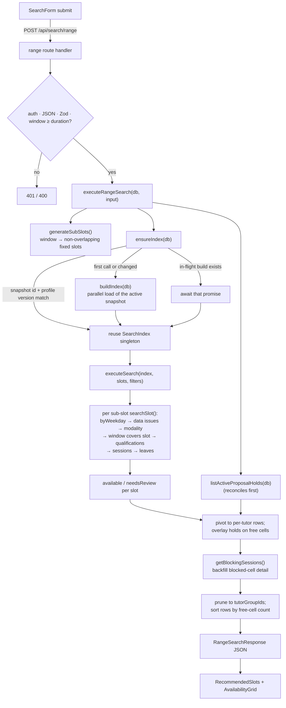

# Tutor Search

**Status: stable**

## Purpose

> **Data freshness, by tier (AVAIL-01, 2026-09-04).** Working hours, session
> blocks and leaves within the next 28 days come from the snapshot promoted at
> most 30 minutes ago. Leaves 28–182 days out are refreshed every 6 hours from a
> fetch cache. Beyond the fetched horizon a tutor is reported **Needs Review**,
> never Available — the engine decides leave conflicts with `Array.some()`, so an
> unfetched leave is indistinguishable from no leave, and that ambiguity now
> resolves conservatively. Recurring (dateless) searches are exempt, since they
> imply no bounded date. See
> [`reference/wise-api.md`](../reference/wise-api.md#nearfar-tiering-avail-01-2026-09-04).

Tutor Search answers the question admin staff ask dozens of times a day: *which tutors are provably free for a class at this time, and are they qualified to teach it?* An admin picks a weekday (recurring) or a calendar date (one-time), a time window, a class duration, and optional modality / subject / curriculum / level / named-tutor filters. The system slices the window into fixed-length sub-slots and returns a grid — one row per tutor, one column per sub-slot — where each cell is either free or blocked, with the blocking Wise session (or admin proposal hold) available in a popover. Tutors whose underlying Wise data could not be resolved safely are listed separately under **Needs Review** rather than shown as available.

It is the primary workspace of the app. `/search` is a nav shortcut in the Scheduling & Tutors section (`src/lib/navigation/tools.ts:102-109`), and the left half of the page feeds the Compare calendar on the right (see [Tutor Compare](./tutor-compare.md)). The form's dropdowns and tutor combobox are populated by two server loaders — `getFilterOptions()` and `getTutorList()` — awaited in the page Server Component and handed down as props (`src/app/(app)/search/page.tsx:11-12`; the combobox iterates the `tutorList` prop at `src/components/search/search-form.tsx:294`). The two thin GET endpoints that wrap the same loaders (`/api/filters`, `/api/tutors`) are not on the form's path at all.

The defining design choice is that **Wise is never queried on the request path, and the snapshot-scoped tutor tables are read once per snapshot or profile change, not once per request.** The active Postgres snapshot is denormalized once into a process-global `SearchIndex` singleton (`src/lib/search/index.ts:83-90`, `:94-97`) and every availability question in the app is answered from that in-memory structure: range search, the legacy slot search, compare and discover, proposal creation, the AI scheduler, room-capacity forecasting (`getRoomCapacityForecast`), and the LINE operational planner all go through `ensureIndex` (`src/app/api/compare/route.ts:138`, `src/app/api/compare/discover/route.ts:57`, `src/app/api/proposals/route.ts:64`, `src/lib/ai/scheduler-service.ts:60`, `src/lib/room-capacity/data.ts:384`, `:409`, `src/lib/line/operational.ts:527`). The one tutor table that *is* touched on every cached-path request is `tutor_business_profiles`, aggregated (`count(*)`, `max(updated_at)`) as half of the freshness check alongside the active-snapshot id select (`index.ts:128-137`, `:368-375`) — see step 2 of [Data flow](#data-flow). This document owns the index; the other features own what they do with it.

## Conceptual data model

Tutor Search **writes no tutor table**. It reads the active snapshot once per snapshot/profile change and queries memory thereafter. The tables involved, conceptually:

- **Snapshots** — the immutable point-in-time Wise capture. `buildIndex` finds the single row with `active = true` and scopes every subsequent read to its id; no active snapshot is a hard error (`src/lib/search/index.ts:144-152`).
- **Sync runs** — the most recent `success` run that promoted this snapshot supplies `syncedAt`, which drives the staleness flag on every response; the fallback chain is the snapshot's `createdAt`, then the build time — `lastPromotedSync?.finishedAt ?? activeSnapshot.createdAt ?? new Date()` (`index.ts:155-166`).
- **Tutor identity groups** and **group members** — the logical tutor (one row per resolved identity, keyed cross-snapshot by `canonicalKey`) and the underlying Wise teacher records that were merged into it, including their online/onsite variant flag (`index.ts:169-179`, `:277-281`). The group's `supportedModality` becomes `supportedModes`: `both` → `["online","onsite"]`, `unresolved` → `[]`, else the single value (`index.ts:265-270`).
- **Subject/level qualifications** — parsed subject + curriculum + level + optional exam prep per group; the only input to the qualification filters (`index.ts:180-183`).
- **Recurring availability windows** — weekday + minute-of-day range + modality, already in Bangkok minutes. A tutor is never "available" outside one of these (`index.ts:184-187`).
- **Dated leaves** — absolute leave intervals that block in both search modes (`index.ts:188-191`).
- **Future session blocks** — Wise sessions carrying the ETL's precomputed `isBlocking` classification plus display fields for the popover (`index.ts:192-215`).
- **Data issues** — unresolved normalization problems. They are attached to a group loosely, by matching `entityId` to the group's canonical key or id, or `entityName` to its display name (`index.ts:231-247`); any match forces Needs Review.
- **Tutor business profiles** — editorial enrichment owned by [Tutor Profiles](./tutor-profiles.md), folded in by `canonicalKey` (`index.ts:220`, `:317`). Their `count(*)` + `max(updated_at)` form the `profileVersion` that, alongside the snapshot id, decides whether the cached index is still fresh (`index.ts:128-137`).

The index also precomputes a `byWeekday` map so a slot search starts from tutors with *any* window on that weekday rather than scanning every group (`index.ts:322-331`).

The two supporting loaders (and the thin GET endpoints that wrap them) bypass the index and read the same snapshot tables directly: filters reads qualifications (`src/lib/data/filters.ts:37-49`); tutors reads identity groups and qualifications in one `Promise.all` and merges them in memory (`src/lib/data/tutors.ts:55-77`). Both resolve the active snapshot through the shared `getActiveSnapshotIdOrThrow` (`src/lib/data/active-snapshot.ts:5-17`).

One write does happen as a side effect of a range search: `executeRangeSearch` calls `listActiveProposalHolds(db)` with no options (`src/lib/search/range-search.ts:116`), which runs `reconcileProposalState` first because `opts.reconcile !== false` (`src/lib/proposals/data.ts:258-265`). That reconcile expires lapsed pending holds and auto-resolves confirmed holds a real Wise session now covers (`data.ts:175`, `:242`). The behaviour belongs to [Proposals](./proposals.md); it is noted here because a "read-only" search endpoint triggers it.

Grain, keys, indexes, and column-level detail for the snapshot-scoped tables are in the [core ERD](../reference/database/erd-core.md) (sections 1 and 4); business profiles are in the [tutor-profiles ERD](../reference/database/erd-tutor-profiles.md); the proposal-hold tables that overlay the grid are in the [AI & proposals ERD](../reference/database/erd-ai-and-proposals.md).

## API surface

All four endpoints are admin-session (`auth()` → 401). Full request/response contracts, Zod field tables, and error shapes live in the [misc API reference — Search](../reference/api/misc.md#search) and [Tutors and filters](../reference/api/misc.md#tutors-and-filters); this table gives purpose only.

| Endpoint | Purpose |
|---|---|
| `POST /api/search/range` | The primary search. Time window + class duration → fixed sub-slots → per-tutor availability grid with blocking detail, proposal-hold overlay, and the Needs Review list. Handler `src/app/api/search/range/route.ts`; logic `src/lib/search/range-search.ts`. |
| `POST /api/search` | Legacy multi-slot search. Caller supplies explicit slots; response is per-slot available / needsReview plus the intersection of tutors free in *every* slot. Handler `src/app/api/search/route.ts`. No in-repo caller — see [Open questions](#open-questions). |
| `GET /api/filters` | Qualification facets from the active snapshot, for populating filter dropdowns client-side. Handler `src/app/api/filters/route.ts`. Its only in-repo caller is the Compare Discovery panel (`src/components/compare/discovery-panel.tsx:55`); the search form gets the same payload as a server prop. Response shape: [reference](../reference/api/misc.md#tutors-and-filters). |
| `GET /api/tutors` | Tutor roster for a searchable picker, sorted by display name. Handler `src/app/api/tutors/route.ts`. No in-repo caller — the form's combobox is fed by the underlying loader as a server prop, not by this endpoint — see [Open questions](#open-questions). Response shape: [reference](../reference/api/misc.md#tutors-and-filters). |

`POST /api/search/assistant` shares the path prefix but belongs to the [AI Scheduler](./ai-scheduler.md): the handler calls `executeSchedulerTurn` (`src/app/api/search/assistant/route.ts:20`; `src/lib/ai/scheduler-service.ts:48`), and the conversation module behind it proves availability through the same `executeSearch` this document describes (`src/lib/ai/scheduler-conversation.ts:5`, `:1680`, `:1911`). What the turn does with the model between those two points is the AI Scheduler doc's subject, not this one's. It is the one search-family path on the middleware public allowlist (`src/middleware.ts:14`) yet still returns 401 without a session in-handler (`src/app/api/search/assistant/route.ts:136-139`).

The two POSTs follow the house pattern for body-taking routes — `auth()` → `request.json()` in try/catch → `safeParse` with flattened errors → business logic in try/catch → 500 with the error message (`range/route.ts:7-55`, `search/route.ts:31-60`). The two GETs take no body, so they are `auth()` then try/catch only (`filters/route.ts:5-17`, `tutors/route.ts:5-18`). The range route additionally rejects a window shorter than the duration with 400 *before* touching the database (`range/route.ts:30-36`).

Page scoping: a restricted admin whose `allowedPages` includes `/search` automatically reaches `/api/search/*` too, because the middleware matches each allowed page against its `/api` namespace (`src/middleware.ts:59-66`). `/api/filters` and `/api/tutors` are *not* under that namespace, and a disallowed API path gets `403 { "error": "Forbidden" }` (`src/middleware.ts:96-99`). The search form is unaffected — it receives both payloads as server props (`page.tsx:11-12`) — but the compare Discovery panel inside the same page fetches `/api/filters` client-side (`src/components/compare/discovery-panel.tsx:55`), so a `/search`-only restricted user would see that call rejected. Whether any such user exists is a deployment fact, not a code one.

## UI

**Page** — `src/app/(app)/search/page.tsx`. An async Server Component that calls `await connection()` (`page.tsx:9`) — Next's explicit signal that everything after it renders at request time rather than being prerendered at build, for a component that uses no request-time API (`node_modules/next/dist/docs/01-app/03-api-reference/04-functions/connection.md:8`, `:15`) — then awaits `getFilterOptions()` and `getTutorList()` and passes both into the client shell inside `<Suspense fallback={<SearchSkeleton />}>` (`page.tsx:8-22`). Both loads resolve before the JSX exists, so that boundary is not streaming them in; the route-level `loading.tsx` renders the same skeleton during navigation (`src/app/(app)/search/loading.tsx:3-5`). The skeleton mirrors the two-panel layout (`src/components/skeletons/search-skeleton.tsx`).

**Orchestrator** — `src/components/search/search-workspace.tsx`, a `"use client"` split-panel shell: search on the left, Compare on the right, with a fullscreen toggle that collapses search to zero width (`search-workspace.tsx:284-354`). It owns:

- the `RangeSearchResponse` and the `SearchContext` (mode, day/date, filters) that every downstream component needs to interpret it (`:87-88`, `:172-176`);
- `?tutors=` / `?week=` deep links on mount, with a strict calendar-valid `YYYY-MM-DD` check on `week` (`:41-54`, `:100-114`), and non-navigating URL sync as selections change (`:123-137`);
- ArrowLeft/ArrowRight week navigation (suppressed while typing) and Esc to leave fullscreen (`:140-169`);
- the proposal-hold overlay — fetches `/api/proposals/active` on mount *and after every successful search*: `refreshProposalHolds` is memoized on `applyProposalHoldsToResponse`, which is memoized on `searchContext`, so the mount effect re-runs each time `handleSearchResponse` stores a new context (`:172-176`, `:194-235`, `:237-253`). The range response already carries the server-side hold overlay, so each search issues one redundant holds request. Holds are also re-applied to free cells locally after a hold is created or actioned, without re-running the search (`:255-282`);
- the hand-off into Compare: "Compare selected" clears the compare cache and fetches up to three tutors (`:178-182`); adding is disabled once three are shown (`:184`).

Search-side components under `src/components/search/`:

- **`search-form.tsx`** — recurring/one-time toggle; multi-select tutor combobox (`Command` inside a `Popover`, `:271-340`); day-or-date, From, To (15-minute options, `:60-72`); duration (1 / 1.5 / 2 hr, `:54-58`), mode (Either / Online / Onsite), Search; then the three qualification dropdowns. Defaults are 15:00–20:00 at 90 minutes — the source comment says these reflect the tutor working window so staff get sensible results without knowing it (`:85-89`). The "N filters active · Clear all" summary counts subject, curriculum, level, a non-`either` mode, *and* each selected tutor (`:110-115`, reset at `:518-530`); a second "Clear all" above the combobox clears only the tutor chips (`:242-250`). Posts to `/api/search/range` (`:138`) and records the search in `localStorage` on success (`:161-174`). Restoring a recent search sets state, then fires the search from an effect once React has committed (`:182-205`).
- **`recent-searches.tsx`** — the last 10 distinct searches, deduped by parameters and persisted under `bgscheduler-recent-searches` (`:5-6`, `:59-73`).
- **`recommended-slots.tsx`** — the hero: up to three sub-slots ranked client-side by `getRecommendedSlots(response, 3)` (`:87`), each card showing a confidence tier, tutor avatar stack, generated reasons, and three actions — Copy for parent, show in calendar (add to compare), Mark proposed (`:143-261`). Picking two or more cards reveals a bundle bar (`:265-291`).
- **`search-results.tsx`** — result header (snapshot-id prefix, latency, Stale badge), row multi-select (reset on every new response, `:48-51`), and the header actions: Copy for parents, Compare (only when 2–3 rows are selected, `:124-133`), and Mark proposed for the selected rows' free cells (`:66-95`, `:134-147`). Warnings from the response render above the grid (`:150-161`).
- **`availability-grid.tsx`** — the grid table. `✓` for free (`:182-190`); a dot — or a lock icon for a proposal hold — that opens a click popover with the blocking detail (`:193-224`; popover body `:30-97`); a muted em-dash when a cell is blocked but no detail exists (`:226-233`); mode badges; and a quick "+" add-to-compare per row (`:244-263`). The separate Needs Review table shows each reason's type (the text before the colon) as a destructive badge and also offers quick-add (`:272-325`).
- **`copy-button.tsx`** — one-click clipboard summary of the selected rows' free sub-slots (`:40-73`). **`copy-for-parent-drawer.tsx`** — the editable parent-message drawer for recommended slots, with friendly/terse tone and a tutor-names toggle (`:33-71`).
- **`proposal-hold-modal.tsx`** / **`active-holds-drawer.tsx`** — create and manage tentative holds; owned by [Proposals](./proposals.md).

An app-wide stale-snapshot banner renders only on the `/search`, `/scheduler`, and `/compare` paths (`src/components/layout/stale-snapshot-banner.tsx:18-28`), using a 2-hour threshold distinct from the 90-minute API warning (`src/lib/ops/stale.ts:2-3`).

Five files in the search tree have no importer anywhere in `src/` — `results-view.tsx`, `slot-builder.tsx`, `slot-chips.tsx`, `slot-input.tsx`, and `ai-scheduler-panel.tsx` — see [Open questions](#open-questions).

## Data flow

Form → range route → in-memory index → engine → pivot → grid. The index is built lazily on the first request after a snapshot or profile change and reused by every request after that.

```mermaid
flowchart TD
    A[SearchForm submit] -->|POST /api/search/range| B[range route handler]
    B --> C{auth · JSON · Zod · window ≥ duration?}
    C -->|no| C1[401 / 400]
    C -->|yes| D["executeRangeSearch(db, input)"]
    D --> E["generateSubSlots()<br/>window → non-overlapping fixed slots"]
    D --> F["ensureIndex(db)"]
    F -->|in-flight build exists| F1[await that promise]
    F -->|snapshot id + profile version match| G[reuse SearchIndex singleton]
    F -->|first call or changed| H["buildIndex(db)<br/>parallel load of the active snapshot"]
    H --> G
    F1 --> G
    D --> L["listActiveProposalHolds(db)<br/>(reconciles first)"]
    G --> I["executeSearch(index, slots, filters)"]
    I --> J["per sub-slot searchSlot():<br/>byWeekday → data issues → modality<br/>→ window covers slot → qualifications<br/>→ sessions → leaves"]
    J --> K[available / needsReview per slot]
    K --> M["pivot to per-tutor rows;<br/>overlay holds on free cells"]
    L --> M
    M --> N["getBlockingSessions()<br/>backfill blocked-cell detail"]
    N --> O["prune to tutorGroupIds;<br/>sort rows by free-cell count"]
    O --> P[RangeSearchResponse JSON]
    P --> Q[RecommendedSlots + AvailabilityGrid]
```

1. **`generateSubSlots`** walks the window in `durationMinutes` steps; a slot is emitted only if it fits entirely, so a 15:00–16:00 window at 90 minutes yields nothing and the route returns 400 (`range-search.ts:41-68`, `range/route.ts:30-36`). `executeRangeSearch` re-checks and throws for callers that bypass the route (`range-search.ts:110-113`).
2. **`ensureIndex`** first returns any in-flight build promise, then — if an index is cached — runs the active-snapshot select and the profile-version aggregate in parallel and returns the cached index when both match; otherwise it calls `buildIndex` (`index.ts:354-401`). Even the fully cached path therefore costs two small queries per request; what the index saves is re-reading the tutor tables.
3. **`executeSearch`** stamps `snapshotMeta` (with the 90-minute staleness flag), runs each sub-slot through `searchSlot`, and computes the cross-slot intersection (`engine.ts:22-58`, `:323-342`). The range path ignores `intersection`; the legacy `POST /api/search` returns it.
4. **`searchSlot`** resolves the weekday, takes candidates from `byWeekday`, and applies the filter chain — collect data-issue reasons → modality → availability-window coverage → qualification filters → session blocking → leave blocking — before classifying each survivor as Available or Needs Review (`engine.ts:60-150`).
5. **`executeRangeSearch`** pivots per-slot results into per-tutor rows, overlays active proposal holds onto free cells (`range-search.ts:134-169`), backfills every blocked-but-empty cell with `getBlockingSessions` detail (`:178-205`), prunes to any requested `tutorGroupIds` (`:207-215`), and sorts rows by free-cell count descending (`:217-223`).
6. The client ranks recommended slots from the same response (`src/lib/search/recommend.ts:20-70`); no second request is made.

The supporting reads take a different path: `getFilterOptions` and `getTutorList` are `"use cache"` functions tagged `snapshot` with `cacheLife("hours")` (`filters.ts:52-58`, `tutors.ts:80-86`); a successful Wise sync calls `revalidateTag("snapshot", { expire: 0 })` (`src/lib/sync/run-wise-sync.ts:160-162`), so the dropdowns refresh on promotion without waiting out the cache lifetime. The in-memory index has no such hook — it notices a new snapshot on the next request through the id check.

## Business rules & edge cases

**Fail-closed classification**

- **Needs Review means "would be Available, but the data is unresolved."** Data-issue reasons and the unresolved-modality reason are collected early (`engine.ts:86-92`) but only consulted at the end of the loop (`:142-146`). Every intervening check — group-level mode skip (`:93-97`), window coverage (`:108`), qualification filters (`:111`), session blocking (`:118`), leave blocking (`:125`) — is a bare `continue`. A tutor with unresolved data who is also busy, on leave, or has no covering window appears in **neither** list. Needs Review is not a roster of all tutors with issues.
- **Unresolved modality never becomes Available — but it is reliably routed to Needs Review only on an `either` request.** `supportedModality = "unresolved"` maps to an empty `supportedModes` at build time (`index.ts:265-270`), which `searchSlot` turns into a review reason (`engine.ts:91-92`). The group-level mode skip sits in the `else` branch (`:93-97`), so an `online`/`onsite` request does not drop the group *there*. It usually drops it one step later: the window-level check `slot.mode !== "either" && w.modality !== "both" && w.modality !== slot.mode` (`:104`) rejects any window whose modality is `"unresolved"` — and that is exactly what the sync writes for an unresolved group's non-online-variant members (`member.isOnlineVariant ? "online" : modality === "both" ? "onsite" : modality`, `src/lib/sync/orchestrator.ts:333-336`; `row.modality = teacherModalities.get(...) ?? "unresolved"`, `:420-422`; `"unresolved"` is a `modalityEnum` value and the window column's default, `src/lib/db/schema.ts:43-48`, `:1600`). With no matching window, `!hasWindow` → `continue` (`engine.ts:108`) and the tutor vanishes with no Needs Review entry. They surface under Needs Review on a specific-mode request only when some window happens to carry a matching modality — e.g. an online-variant member's `"online"` window on an `online` request. This is a silent-exclusion gap in the fail-closed story, not a routing-to-review guarantee. The only engine test for the case uses `mode: "either"` against a `"both"` window (`src/lib/search/__tests__/engine.test.ts:134-150`); the specific-mode path is untested.
- **Mode mismatch is a hard skip, not a review.** If the slot asks for `online` or `onsite` and the group does not support it, the tutor is dropped (`engine.ts:93-97`); the same check applies per availability window (`:104`). The known unreliability of modality derivation (see [Open questions](#open-questions)) therefore silently excludes rather than flags.
- **Only `isBlocking` sessions block.** Cancelled sessions are non-blocking; unknown statuses were classified blocking upstream in normalization. Every blocking check skips `!s.isBlocking` (`engine.ts:163`, `:183`, `:211`).

**Availability semantics**

- **The window must fully contain the sub-slot** on the requested weekday: `w.startMinute <= slotStart && w.endMinute >= slotEnd` (`engine.ts:100-106`). Partial overlap is not availability.
- **Recurring vs one-time blocking differ deliberately.** Recurring blocks when *any* future session overlaps the same weekday and minute range — a session next Tuesday blocks every Tuesday (`engine.ts:155-168`). One-time blocks only on the exact calendar date (`:173-188`).
- **Leaves block in both modes and are equally disqualifying** — a tutor on leave is dropped, not flagged (`engine.ts:120-125`).
- **Recurring leave logic keys on duration, not calendar span (REL-04).** A leave longer than 24 hours is walked day-by-day and blocks every weekday it touches in full, with no minute-of-day math (`engine.ts:260-275`; assumption documented at `:243-249`). A leave of 24 hours or less is treated as same-calendar-day and compared by minute-of-day against `leaveStart`'s weekday (`:279-286`).
- **A ≤24h leave that crosses midnight blocks nothing a range search can produce — a fail-open gap.** For Mon 20:00 → Tue 10:00 the single-day branch runs with `leaveStartMin = 1200` and `leaveEndMin = 600`, so the overlap test `leaveStartMin < endMinute && leaveEndMin > startMinute` (`engine.ts:284`) is false for Mon 20:00–21:30, Mon 15:00–16:30, and Tue 09:00–10:30 alike. It is true only for a slot on the leave-start weekday that starts before the leave's *end* minute and ends after its *start* minute — Mon 09:00–20:30 (`1200 < 1230 && 600 > 540`) — which no range search can ask for (durations are capped at 120 minutes, `range-search.ts:22-27`) but which the legacy `POST /api/search` accepts, since its slot `start`/`end` are unconstrained `HH:mm` strings (`src/app/api/search/route.ts:15-16`). Verified by evaluating the branch's arithmetic in node under `TZ=UTC`, `TZ=Asia/Bangkok`, and `TZ=America/New_York`: for a given pair of local minute values the comparison is pure integer math and the outcome is identical under every zone; *which* minute values an absolute leave instant yields is the runtime-TZ dependency described under Timezone coupling below. No test covers this case (the REL-04 suite covers a >24h leave and a same-day leave only, `engine.test.ts:327-378`).
- **Qualification filters are case-insensitive exact matches** on a single qualification row — a tutor matches only if one row satisfies every supplied filter together (`engine.ts:311-321`).
- **An out-of-range weekday returns an empty slot, not an error** (`engine.ts:70-72`); Zod bounds `dayOfWeek` to 0–6 at the route anyway (`range-search.ts:18`).
- **Duration is a closed set** — 60, 90, or 120 minutes. The form offers exactly those three (`search-form.tsx:54-58`) and the route rejects anything else (`range-search.ts:22-27`); the field's accepted encodings are in the [range endpoint reference](../reference/api/misc.md#search).

**Timezone coupling**

- **Four engine paths read runtime-local time.** The one-time weekday derivation `new Date(slot.date).getDay()` (`engine.ts:68`), the multi-day leave walk (`:269`), the ≤24h leave branch (`:279-283`), and the one-time leave interval built with `setHours` (`:300-304`) all depend on the process timezone. Verified: for date `2026-08-05` at minute 540, `targetStart` is `09:00Z` under `TZ=UTC` but `02:00Z` under `TZ=Asia/Bangkok` — a 7-hour shift in what is compared against leave instants. Nothing in the repo tree pins `TZ` for the serverless runtime — a repo-wide grep (excluding `node_modules`, `.next`, `docs`) finds only the test pin at `vitest.config.ts:4` and a comment at `src/app/api/compare/discover/route.ts:252`; `vercel.json`, `next.config.ts`, and `package.json` have no entry. Whether the Vercel project sets a `TZ` environment variable is a deployment fact the repo cannot attest.
- **One-time session matching compares UTC calendar dates.** `isBlockedOneTime` and `getBlockingSessions` compare `toISOString().slice(0, 10)` of the session start against the target date (`engine.ts:180-185`, `:217-219`). A Bangkok session before 07:00 local falls on the previous UTC date — verified: a 06:00 Bangkok session on 2026-08-05 has UTC date `2026-08-04`. Such a session is invisible to a one-time search for its real date and wrongly attributed to the day before. This is TZ-independent. The form's default window is 15:00–20:00 (`search-form.tsx:87-88`), so a default search never touches the affected hours; whether any real session is scheduled before 07:00 Bangkok is a production-data question the repo cannot answer (see [Open questions](#open-questions)). The direction is fail-open either way.
- **Two one-time weekday derivations coexist and are both correct only under Bangkok time.** `searchSlot` uses `new Date(slot.date).getDay()` — a UTC-midnight instant read in local time (`engine.ts:68`); the range layer's hold matching uses `weekdayForIsoDate`, a `+07:00`-anchored midnight read the same way (`range-search.ts:141-143`, `:190-192`; `src/lib/proposals/overlap.ts:45-47`). Verified in node for `2026-08-05` (a Wednesday, `3`): under `TZ=Asia/Bangkok` both give `3`; under `TZ=UTC` the engine gives `3` and `weekdayForIsoDate` gives `2`, so the two disagree; under a negative-offset runtime such as `TZ=America/New_York` both give `2` — they agree with each other and are both a day early. The engine's own value is right under UTC and any positive-offset zone and wrong under negative offsets. On a UTC runtime, recurring-scope holds would be matched against the previous weekday in one-time range searches (`overlap.ts:102-104`). The client-side overlay re-derives with the same `+07:00`-anchored `.getDay()` construction in the browser (`search-workspace.tsx:208-212`), so an admin whose machine is not on Bangkok time is exposed the same way; the recommended-slots and drawer labels instead use the `Intl`-based `getBangkokWeekdayForIsoDate` and are correct everywhere (`src/lib/bangkok-time.ts:44-51`).
- **The date picker's minimum is UTC-today** (`search-form.tsx:366`); between midnight and 07:00 Bangkok it offers yesterday's date.

**Index lifecycle**

- **Staleness warns, never withholds.** Past `API_STALE_THRESHOLD_MS` (90 minutes) `snapshotMeta.stale` flips and `STALE_SEARCH_WARNING` is appended, but results still return (`engine.ts:30-38`; `src/lib/ops/stale.ts:2-5`).
- **No active snapshot is fatal on first build, tolerated afterwards.** `buildIndex` throws `"No active snapshot found"` (`index.ts:150-152`), as do the supporting loaders (`active-snapshot.ts:12-14`). If a cached index exists and the active row later vanishes, `ensureIndex` returns the cached index rather than throwing (`index.ts:384-386`).
- **Concurrent builds coalesce (REL-02).** The build promise is assigned to `globalThis` synchronously before any `await`, so a second caller arriving mid-build awaits the same promise instead of issuing its own freshness queries (`index.ts:354-401`).
- **Invalidation is passive and active.** Passive: the snapshot-id + profile-version check on every request. Active: `clearSearchIndex()` after a tutor-profile save (`src/app/api/tutor-profiles/[canonicalKey]/route.ts:51`), and after an import commit only when at least one profile was actually saved — `if (saved.length > 0) clearSearchIndex();` (`src/app/api/tutor-profiles/import-commit/route.ts:61`); a commit that saves nothing leaves the cached index untouched. The Wise sync does not touch the index directly.
- **The index survives dev HMR** through `globalThis.__bgscheduler_searchIndex` / `__bgscheduler_searchIndexBuildPromise` (`index.ts:94-113`).

**Range-search shaping**

- **Named-tutor filtering is post-hoc.** `tutorGroupIds` prunes the grid and the Needs Review map after the full search has run (`range-search.ts:207-215`); it never changes a verdict.
- **Proposal holds downgrade free cells to blocked** when an active hold for the same `tutorCanonicalKey` overlaps the sub-slot (`range-search.ts:144-168`); the grid renders these with a lock icon (`availability-grid.tsx:208-212`). The client applies the same rule locally after hold mutations (`search-workspace.tsx:194-235`). Hold semantics — recurring holds block matching weekdays in one-time searches too — live in `proposalHoldBlocksSearchSlot` (`overlap.ts:84-107`).
- **A blocked cell may legitimately carry no detail.** Cells default to `[]` and are backfilled only from `getBlockingSessions`, which scans `sessionBlocks` (`range-search.ts:163`, `:194-203`; `engine.ts:210-211`). No covering window, a window-level modality mismatch, and a leave conflict all leave the cell empty, and the UI shows an em-dash (`availability-grid.tsx:226-233`).
- **Row order is by free-cell count**, descending (`range-search.ts:217-223`); recommended slots rank sub-slots by free-tutor count, then earliest start, drop zero-availability slots, and label the top three Best / Strong / Good fit (`recommend.ts:33-44`).
- **Cross-snapshot identity.** Every result row carries `tutorCanonicalKey` alongside the snapshot-scoped `tutorGroupId` (`types.ts:36-44`, `:93-100`) so holds and profiles can be matched across snapshot rotation. `src/lib/search/cache-version.ts` (`CACHE_VERSION = "v3"`) lives in this directory but governs the Compare client cache (`src/hooks/use-compare.ts:8`), not search.

## Tests

Engine, index, ranking, and parser — `src/lib/search/__tests__/`:

- **`engine.test.ts`** — recurring blocking, cancelled sessions not blocking, Needs Review routing for data issues and for unresolved modality (the latter under `mode: "either"` only, `:134-150`), mode filtering, subject filter exclusion, multi-slot intersection, one-time exact-date blocking, the 90-minute stale boundary (fresh at exactly 90 min, stale at 90 min + 1 ms), and REL-04 leaves: a >24h leave blocking a touched weekday and a same-day leave blocking only its own minute window (`:287-380`).
- **`index.test.ts`** — REL-02 coalescing (one `buildIndex` for two concurrent first-time callers; exactly two freshness selects on the cached path; at most 13 selects when a stale cache races), TCOV-01 denormalization (one group per row, children attached by `groupId`, `supportedModes` and data-issue mapping), `byWeekday` population / dedupe / omission, and the no-active-snapshot fallback returning the cached index.
- **`recommend.test.ts`** — empty-input guards, tiering, count-descending order, start-time tie-break, zero-availability filtering, `limit`, modality reason strings, pluralisation, and the 3+ "variety" reason.
- **`parser.test.ts`** — free-text slot parsing (single, comma-separated, abbreviated days, en-dash, default mode, unparseable warning) for a module with no production importer.
- `compare.test.ts` in the same directory belongs to [Tutor Compare](./tutor-compare.md).

Route handlers:

- **`src/app/api/search/range/__tests__/route.test.ts`** — 401, 400 on Zod failure, 400 when the window is shorter than the duration, 200 shape, active proposal holds rendered as blocked cells (`:169-200`), 500 when `ensureIndex` throws.
- **`src/app/api/search/__tests__/route.test.ts`** — 401 / 400 / 200 shape including `intersection` / 500 for the legacy endpoint.
- **`src/app/api/filters/__tests__/route.test.ts`**, **`src/app/api/tutors/__tests__/route.test.ts`** — 401, 200 with sorted values, 500 on loader failure.
- **`src/app/api/search/assistant/__tests__/route.test.ts`** covers the AI-owned sibling (401, 503 unconfigured, solved / clarification shaping).

Pure builders: **`src/lib/data/__tests__/filters.test.ts`** (sorted distinct facets) and **`src/lib/data/__tests__/tutors.test.ts`** (modality → modes mapping; sorted tutors with deduped subjects). **`src/__tests__/middleware.test.ts`** pins that `/search` redirects to login with `callbackUrl` preserved (including `?tutors=`) and that `/api/search/assistant` bypasses the middleware (`:39-40`, `:89-115`).

There is no `src/components/search/__tests__/` directory — the search UI is exercised only indirectly through the route and engine suites. `process.env.TZ` is pinned to `Asia/Bangkok` for all tests (`vitest.config.ts:4`), which means the timezone-coupled paths above are only ever tested under the timezone in which they are correct.

## Open questions

- **Is `POST /api/search` still reachable by any caller?** No file in `src/` references the bare `/api/search` path; the form posts to `/api/search/range` (`search-form.tsx:138`) and nothing consumes the legacy `intersection` field. Whether an external or bookmarked client exists is not knowable from the repo, so retirement cannot be recommended from source alone.
- **Is `GET /api/tutors` still reachable by any caller?** Same situation: no file in `src/` fetches `/api/tutors` outside the route's own test (`grep -rn '/api/tutors' src` → only `src/app/api/tutors/__tests__/`). The form's combobox reads the `getTutorList()` result as a server prop (`page.tsx:11-12`, `search-form.tsx:294`), so the endpoint is a second door onto the same loader with no in-app consumer. `GET /api/filters` is one step better off — the Compare Discovery panel calls it (`discovery-panel.tsx:55`).
- **Should the ≤24h cross-midnight leave gap be fixed?** The single-day branch of `hasRecurringLeaveConflict` (`engine.ts:279-286`) assumes `leaveStart` and `leaveEnd` share a calendar day, which is false for an overnight leave under 24 hours; such a leave blocks only a slot that spans both its end minute and its start minute on the leave-start weekday — none a range search can produce. Is a duration split the right discriminator, or should the branch key on calendar-day span?
- **Is the production runtime's `TZ` set to `Asia/Bangkok`?** The repo does not set it and the engine's leave math and one-time weekday derivation depend on it (`engine.ts:68`, `:269`, `:279-283`, `:300-304`). Should these be rewritten against `date-fns-tz` / `Intl` as `src/lib/bangkok-time.ts:44-51` already is, rather than relying on an unasserted deployment setting? A client-side exposure (`search-workspace.tsx:208-212`) cannot be fixed by a server setting at all.
- **Should one-time session matching compare Bangkok dates instead of UTC dates?** `engine.ts:180-185` and `:217-219` slice `toISOString()`, so a Bangkok session before 07:00 is attributed to the previous day. Is any real session scheduled that early, and if so is this an accepted gap?
- **Should a mis-derived modality exclude a tutor or flag them?** Modality drives a hard skip at group level (`engine.ts:93-97`) and again at window level (`:104`, `:108`) — the latter silently drops *unresolved*-modality tutors from every `online`/`onsite` request, because their windows are written as `"unresolved"` (`orchestrator.ts:333-336`, `:420-422`) and never match. The modality heuristic is known to be unreliable for the tutor snapshot. Silent exclusion versus Needs Review is a product decision, and the specific-mode path has no test.
- **Is `src/lib/search/parser.ts` dead?** `parseSlotInput` has a full test suite but no production importer. Was it superseded by the structured form and the AI scheduler's own extraction, or is free-text slot entry still planned?
- **Are `results-view.tsx`, `slot-builder.tsx`, `slot-chips.tsx`, `slot-input.tsx`, and `ai-scheduler-panel.tsx` dead?** None has an importer in `src/`. `ai-scheduler-panel.tsx:87` is the only in-repo code that calls `POST /api/search/assistant`, so that endpoint currently has no in-app UI consumer — retained for an external caller, or awaiting re-integration?
- **Is the reconcile side effect of range search intended?** Every `POST /api/search/range` runs `reconcileProposalState` via `listActiveProposalHolds` (`range-search.ts:116`; `proposals/data.ts:263-264`), writing status changes to proposal items. Other call sites pass `{ reconcile: false }` explicitly (`data.ts:309`, `:367`, `:379`, `:473`); the search path does not. Is the search endpoint meant to be the reconcile trigger, or should it read with `reconcile: false`?

_Verified against main@0cd1e81 (clean tree) on 2026-09-02._
