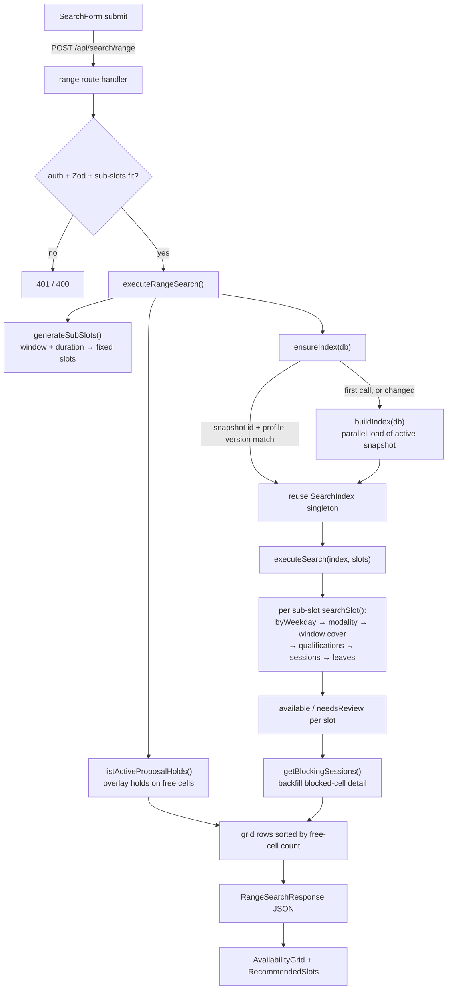

# Tutor Search

**Status: stable**

## Purpose

Tutor Search answers one question for non-technical admin staff: *which tutors are free for a class at this time, and are they qualified to teach it?* An admin picks a day (recurring) or a date (one-time), a time window, a class duration, and optional subject / curriculum / level / modality / named-tutor filters. The system slices the window into fixed-length sub-slots and returns a grid of tutors with each sub-slot marked available or blocked — clicking a blocked cell opens a popover with the blocking session's details (`availability-grid.tsx:199-221`) — plus a separate "Needs Review" list for tutors that would otherwise be Available for that sub-slot but whose underlying Wise data could not be resolved safely.

It is the workspace admin staff live in: `/search` is a first-class nav tool (`src/lib/navigation/tools.ts:101-105`) and the left half of the page feeds the Compare panel on the right (see [tutor-compare](./tutor-compare.md)). Two supporting read endpoints — filters and tutors — populate the form's dropdowns and the tutor combobox from the active snapshot.

The defining characteristic is that **the tutor dataset is never re-queried on the hot path**. The entire active snapshot is denormalized once into a process-global `SearchIndex` singleton, and search, range search, compare, proposals, the AI scheduler, room capacity, and the LINE operational planner all read from that in-memory structure (`src/lib/search/index.ts:83-90`, `:354`; the list of `ensureIndex` callers is not closed — `src/lib/line/operational.ts:527` is an easily-missed one).

The hot path is not query-free, though. Even on the fully cached path `ensureIndex` still issues an active-snapshot `SELECT` plus a `count(*)::text` / `max(updated_at)::text` aggregate over `tutor_business_profiles` as a staleness probe (`index.ts:368-375` calling `:128-137`), and `executeRangeSearch` then reads — and reconciles — proposal holds (`range-search.ts:115-116`). What the index buys is that the tutor tables themselves are read once per snapshot, not once per request.

## Conceptual data model

Tutor Search writes no *tutor* tables — it loads the active snapshot's normalized tutor data into memory and queries it there. It is not side-effect-free, though: **every `POST /api/search/range` mutates `proposal_items`.** `executeRangeSearch` calls `listActiveProposalHolds(db)` with no options (`range-search.ts:116`), so `opts.reconcile !== false` is true (`src/lib/proposals/data.ts:263`) and `reconcileProposalState` runs (`data.ts:253-256`). That issues an `UPDATE proposal_items SET status='expired'` for lapsed pending holds (`data.ts:171-188`) and an `UPDATE proposal_items SET status='auto_resolved'` for confirmed holds a real Wise session now covers (`data.ts:239-250`) — even when the admin never touches a hold. See [proposals](./proposals.md).

`buildIndex()` locates the single `active` snapshot, then loads every snapshot-scoped tutor table in parallel and folds them into one `IndexedTutorGroup` aggregate per logical tutor (`src/lib/search/index.ts:142-344`):

- **Snapshots** — finds the one row with `active = true`; every subsequent read is scoped to its id (`index.ts:144-154`).
- **Sync runs** — the most recent `success` run that promoted this snapshot, which supplies `syncedAt` for staleness (`index.ts:155-166`).
- **Tutor identity groups** and **members** — the logical tutor plus the underlying Wise teacher records (online/onsite variants) (`index.ts:169-179`).
- **Subject/level qualifications** — subject + curriculum + level + optional exam prep, used for filtering (`index.ts:181-183`).
- **Recurring availability windows** — weekday + minute range + modality; a tutor is only ever "available" inside one of these (`index.ts:185-187`).
- **Dated leaves** — absolute leave intervals that block regardless of sessions (`index.ts:189-191`).
- **Future session blocks** — Wise sessions carrying the ETL's precomputed `isBlocking` flag (`index.ts:192-215`).
- **Data issues** — unresolved normalization problems, matched to a group by canonical key, group id, or display name; their presence forces Needs Review (`index.ts:216-247`).
- **Tutor business profiles** — optional editorial enrichment attached by `canonicalKey` (`index.ts:220`, `:317`).

The index also builds a `byWeekday` map so a slot search starts from the candidates that have *any* window on that weekday instead of scanning all groups (`index.ts:322-331`).

The two supporting endpoints bypass the index and query the same snapshot tables directly: filters reads qualifications (`src/lib/data/filters.ts:37-48`); tutors issues two independent selects — identity groups and qualifications — inside one `Promise.all` (`src/lib/data/tutors.ts:58-74`) and merges them in memory through a `groupId → Set<subject>` map (`tutors.ts:31-53`). There is no SQL join.

Grain, keys, and column-level detail for all of these tables live in the [core ERD](../reference/database/erd-core.md); business profiles are in the [tutor-profiles ERD](../reference/database/erd-tutor-profiles.md); the proposal-hold tables that overlay the grid are in the [AI & proposals ERD](../reference/database/erd-ai-and-proposals.md).

## API surface

Full request/response schemas, error shapes, and per-field tables live in the [misc API reference](../reference/api/misc.md); this section gives purpose only.

| Endpoint | Purpose |
|---|---|
| `POST /api/search/range` | The primary search: time window + duration → sub-slot availability grid, blocking-session detail, and Needs Review. Handler `src/app/api/search/range/route.ts`. |
| `POST /api/search` | Legacy slot-based search: caller supplies explicit slots, gets per-slot available/needsReview plus the intersection across all slots. Handler `src/app/api/search/route.ts`. |
| `GET /api/filters` | Populates the search form's qualification dropdowns from the active snapshot. Handler `src/app/api/filters/route.ts`. |
| `GET /api/tutors` | The data source for the searchable tutor combobox, read from the active snapshot. Handler `src/app/api/tutors/route.ts`. |

`POST /api/search/assistant` shares the path prefix but belongs to the [AI Scheduler](./ai-scheduler.md) — it drives an LLM turn that ultimately calls the same `executeSearch`. It is the only search-family path in the middleware's public allowlist — which covers several unrelated paths besides it (`src/middleware.ts:4-19`) — yet it still returns 401 without a session in-handler (`assistant/route.ts:136-138`); see the [AI scheduler API reference](../reference/api/ai-scheduler.md).

Only the two POST endpoints follow the full house pattern, which the repo convention scopes to mutating routes: `auth()` → JSON parse → Zod `safeParse` → business logic in `try/catch` (`range/route.ts:7-55`, `search/route.ts:31-34`). The two GETs take no request body, so they legitimately have neither a `request.json()` step nor a Zod schema — their whole shape is `auth()` then `try/catch` (`filters/route.ts:5-17`, `tutors/route.ts:5-18`). Exact status codes and error payloads for all four are in the [misc API reference](../reference/api/misc.md).

## UI

**Page** — `src/app/(app)/search/page.tsx`. An async Server Component that calls `await connection()` — opting the route out of prerendering under `cacheComponents` — then awaits `getFilterOptions()` and `getTutorList()` sequentially and passes both into the client shell wrapped in `<Suspense fallback={<SearchSkeleton />}>` (`page.tsx:9-20`). Both loads therefore resolve before the JSX exists (`page.tsx:9-12` awaits all three, and the JSX is only returned at `:14-21`), so the boundary demonstrably cannot be streaming those loads in. Whether the fallback ever paints under `cacheComponents` is a runtime question that needs a running dev server to answer, and this doc does not settle it. The route-level `src/app/(app)/search/loading.tsx` renders the same skeleton during navigation.

**Orchestrator** — `src/components/search/search-workspace.tsx`, the `"use client"` split-panel shell. The left half is search, the right half is the Compare panel; a fullscreen toggle collapses search to zero width (`search-workspace.tsx:284-354`). It owns the `RangeSearchResponse` state, `?tutors=` / `?week=` deep links (`:100-114`), non-navigating URL sync (`:123-137`), Arrow-key week navigation, Esc-to-exit-fullscreen, and the proposal-hold overlay.

Key search-side components under `src/components/search/`:

- **`search-form.tsx`** — the compact form: recurring/one-time toggle, multi-select tutor combobox (`Command` + `Popover`), day-or-date + From/To selects at 15-minute granularity, duration + mode + Search, and the three qualification dropdowns. The "N filters active · Clear all" summary is **not** scoped to those three dropdowns: `activeFilterCount` sums subject + curriculum + level + a non-`either` modality + `selectedTutorIds.length` (`search-form.tsx:110-115`), so up to five inputs including every selected named tutor, and its Clear all resets all of them (`:518-530`). A second, unrelated "Clear all" above the tutor combobox clears only the tutor chips (`:242-250`). Defaults are 15:00–20:00 at 90 minutes (`search-form.tsx:87-89`); the source comment says they reflect the tutor working window so staff don't have to know it (`:85-86`) — that comment is the only evidence in the repo for the 3–8pm rationale. Posts to `/api/search/range` (`:138`).
- **`recommended-slots.tsx`** — the hero cards, ranked client-side from the response by `getRecommendedSlots`.
- **`search-results.tsx`** — result header (snapshot id prefix, latency, Stale badge, warnings), multi-select state, and the Compare / Mark-proposed actions.
- **`availability-grid.tsx`** — the grid table itself: `✓` for free, a dot or lock icon that opens a **click** popover with the blocking session (or proposal hold) detail, mode badges, quick-add-to-compare, and the separate Needs Review table. The trigger is a bare Base UI `<Popover>` with no `openOnHover` prop here or in the primitive (`availability-grid.tsx:199-221`, `src/components/ui/popover.tsx:8-14`), so the click-to-open default applies; the `cursor-help` class at `availability-grid.tsx:202` is cosmetic and reads misleadingly.
- **`recent-searches.tsx`** — last 10 searches deduped and persisted in `localStorage` (`STORAGE_KEY = "bgscheduler-recent-searches"`, `MAX_RECENTS = 10`).
- **`copy-button.tsx`** / **`copy-for-parent-drawer.tsx`** — clipboard summaries and the editable parent-message draft built from selected slots.
- **`proposal-hold-modal.tsx`** / **`active-holds-drawer.tsx`** — create and manage tentative holds (see [proposals](./proposals.md)).

A stale-snapshot banner is rendered app-wide but only shows on the search/scheduler/compare workspaces (`src/components/layout/stale-snapshot-banner.tsx:18-28`), using a separate 2-hour threshold from the 90-minute API warning.

## Data flow

Form → range endpoint → in-memory index → engine → grid. The index is built lazily on the first request after a snapshot (or profile) change and reused for every request after that.

```mermaid
flowchart TD
    A[SearchForm submit] -->|POST /api/search/range| B[range route handler]
    B --> C{auth + Zod + sub-slots fit?}
    C -->|no| C1[401 / 400]
    C -->|yes| D["executeRangeSearch()"]
    D --> E["generateSubSlots()<br/>window + duration → fixed slots"]
    D --> F["ensureIndex(db)"]
    F -->|snapshot id + profile version match| G[reuse SearchIndex singleton]
    F -->|first call, or changed| H["buildIndex(db)<br/>parallel load of active snapshot"]
    H --> G
    G --> I["executeSearch(index, slots)"]
    I --> J["per sub-slot searchSlot():<br/>byWeekday → modality → window cover<br/>→ qualifications → sessions → leaves"]
    J --> K[available / needsReview per slot]
    D --> L["listActiveProposalHolds()<br/>overlay holds on free cells"]
    K --> M["getBlockingSessions()<br/>backfill blocked-cell detail"]
    L --> N[grid rows sorted by free-cell count]
    M --> N
    N --> O[RangeSearchResponse JSON]
    O --> P[AvailabilityGrid + RecommendedSlots]
```

1. **`generateSubSlots`** walks the window in non-overlapping `durationMinutes` steps; a window shorter than the duration yields zero slots and the route returns 400 (`range-search.ts:41-68`, `range/route.ts:30-36`).
2. **`ensureIndex`** returns the cached singleton when the active snapshot id *and* the tutor-profile version both still match; otherwise it rebuilds (`index.ts:365-389`). Confirming that match is itself two queries — an active-snapshot select and the profile-version aggregate — run in parallel on every request (`index.ts:368-375`, `:128-137`).
3. **`executeSearch`** stamps snapshot metadata, runs each sub-slot through `searchSlot`, and computes the cross-slot intersection (`engine.ts:22-58`, `:323-342`).
4. **`searchSlot`** resolves the weekday, pulls candidates from `byWeekday`, and applies modality → availability-window coverage → qualification filters → session blocking → leave blocking before classifying each survivor Available or Needs Review (`engine.ts:60-150`).
5. **`executeRangeSearch`** pivots per-slot results into per-tutor rows, overlays active proposal holds, backfills blocked cells with `getBlockingSessions` detail, optionally prunes to requested `tutorGroupIds`, and sorts rows by free-cell count descending (`range-search.ts:103-233`).

## Business rules & edge cases

- **Fail-closed to Needs Review, never silently available — but only among candidates that would otherwise be Available.** Any `dataIssue` on the group, or an empty `supportedModes` array (unresolved modality), collects a review reason (`engine.ts:85-92`) which is consulted at the very end of the loop to push the tutor into `needsReview` instead of `available` (`engine.ts:142-146`). Unresolved modality becomes an empty array at index-build time (`index.ts:265-270`). Crucially, those reasons are read *after* the candidate has already survived the group-level mode skip (`:93-97`), availability-window coverage (`:108`), qualification filters (`:111`), session blocking (`:118`) and leave blocking (`:125`) — every one of which is a bare `continue`. A tutor with a data issue or unresolved modality who has no covering window, is busy, or is on leave is dropped and appears in **neither** list. Needs Review therefore means "would be Available for this sub-slot, but the data is unresolved" — it is not a roster of every tutor with unresolved data (`engine.ts:79-147`).
- **Mode mismatch is a hard skip, not a review.** If the slot asks for a specific modality and the group does not support it at all, the candidate is dropped entirely (`engine.ts:93-97`); the same check is re-applied at window granularity (`engine.ts:104`).
- **The availability window must fully contain the slot** — `w.startMinute <= slotStart && w.endMinute >= slotEnd` on the matching weekday (`engine.ts:100-106`). Partial overlap is not availability.
- **Recurring vs one-time blocking differ.** Recurring blocks when *any* future session overlaps the same weekday + minute range, i.e. a session next Tuesday blocks every Tuesday (`engine.ts:155-168`). One-time blocks only on exact calendar-date overlap (`engine.ts:173-188`).
- **Only `isBlocking` sessions block.** Cancelled sessions are non-blocking; unknown statuses are marked blocking upstream in normalization. Every blocking check skips `!s.isBlocking` rows (`engine.ts:163`, `:183`, `:211`).
- **The recurring-leave branch is duration-based, not calendar-based (REL-04).** `hasRecurringLeaveConflict` splits on `leaveEnd - leaveStart > 24h` (`engine.ts:260-261`) — *not* on how many calendar days the leave touches. Over 24h, the leave is walked day-by-day and blocks any matching weekday with no minute-of-day math, because middle days are wholly inside the leave (the assumption is documented at `engine.ts:240-250`). At or under 24h, the code assumes `leaveStart` and `leaveEnd` share a calendar day and compares `leaveStart`'s weekday and minute-of-day window directly (`engine.ts:279-286`).
- **A leave that crosses midnight but lasts ≤24h blocks nothing — a fail-OPEN gap.** The ≤24h branch's same-calendar-day assumption does not hold for a cross-midnight leave, and the resulting minute window is inverted. Reproduced with Mon 2026-08-03 20:00 → Tue 2026-08-04 10:00 Asia/Bangkok (14h): `isMultiDay` is `false`, `leaveStartMin` is 1200 and `leaveEndMin` is 600, so `leaveStartMin < endMinute && leaveEndMin > startMinute` (`engine.ts:284`) is false for Mon 20:00–21:30, Mon 15:00–16:30 **and** Tue 09:00–10:30. Not even the day the leave starts on is blocked, and the tutor is returned Available across their own leave. This contradicts the project's non-negotiable fail-closed rule, and it is TZ-independent — it reproduces under `TZ=Asia/Bangkok` exactly as under `TZ=UTC`. See Open questions.
- **All three leave code paths are runtime-TZ-coupled.** The multi-day walk reads `cursor.getDay()` (`engine.ts:269`); the ≤24h branch reads `leaveStart.getDay()` and `leaveStart.getHours()/getMinutes()` (`engine.ts:279-283`); and `hasOneTimeLeaveConflict` builds its comparison interval with `new Date(dateStr)` plus `targetStart.setHours(...)` / `targetEnd.setHours(...)` (`engine.ts:300-304`). All are runtime-local getters/setters. On a non-Bangkok runtime the weekday match, the minute-of-day window, and the one-time comparison interval all shift: verified for date `2026-08-05` at `startMinute` 540, `targetStart` is `2026-08-05T09:00:00Z` under `TZ=UTC` but `2026-08-05T02:00:00Z` under `TZ=Asia/Bangkok` — a 7-hour shift in the window compared against leave instants, i.e. wrong leave verdicts for one-time searches. Nothing in the repo pins `TZ` (no entry in `src/lib/env.ts`, `vercel.json`, or `next.config.ts`); whether the production Vercel runtime sets it is outside the repo and was not checked.
- **Leaves are checked after sessions and are equally disqualifying** — a tutor on leave is dropped from the slot, not flagged (`engine.ts:120-125`).
- **Duration is a closed set.** Zod accepts only 60, 90, or 120 minutes (`range-search.ts:22-27`); day-of-week is bounded 0–6, and an out-of-range weekday returns an empty slot result rather than an error (`engine.ts:70-72`).
- **Snapshot staleness warns, never withholds.** `snapshotMeta.stale` flips and `STALE_SEARCH_WARNING` is pushed into `warnings[]` past `API_STALE_THRESHOLD_MS` (90 minutes), but results are still returned (`engine.ts:30-38`; `src/lib/ops/stale.ts:2-5`).
- **No active snapshot is a hard failure on first build, but a soft one afterwards.** `buildIndex` throws `"No active snapshot found"` (`index.ts:150-152`) and the supporting loaders throw the same via `getActiveSnapshotIdOrThrow` (`src/lib/data/active-snapshot.ts:12-14`). If a snapshot was active and later vanishes mid-life, `ensureIndex` deliberately returns the cached index instead of throwing (`index.ts:384-386`).
- **Concurrent index builds coalesce (REL-02).** The in-flight build promise is assigned to the `globalThis` singleton synchronously, before any `await`, so concurrent first-time callers reuse one build rather than stampeding the database (`index.ts:354-401`).
- **The index is `globalThis`-anchored so it survives HMR** (`index.ts:94-97`), and it is invalidated two ways: passively via the snapshot-id/profile-version check in `ensureIndex`, and actively via `clearSearchIndex()` after a tutor-profile edit or import commit (`src/app/api/tutor-profiles/[canonicalKey]/route.ts:51`, `src/app/api/tutor-profiles/import-commit/route.ts:61`).
- **Named-tutor filtering happens after the search, not before it.** `tutorGroupIds` prunes both the grid and the Needs Review map once the full search has run (`range-search.ts:207-215`) — filtering never changes an availability verdict.
- **Proposal holds downgrade free cells.** A cell the engine returned as free is rewritten to a `proposal_hold` blocking entry when an active hold for the same `tutorCanonicalKey` overlaps it (`range-search.ts:144-168`); the client re-applies the same rule after creating or acting on a hold, without re-searching (`search-workspace.tsx:194-235`).
- **Blocked cells can legitimately have no detail, for more than one reason.** A cell is initialized to `[]` (`range-search.ts:163`) and is only ever backfilled from `getBlockingSessions`, which scans `group.sessionBlocks` and nothing else (`engine.ts:210-211`, `range-search.ts:194-203`); when it returns nothing the cell stays empty and the grid renders a muted em-dash instead of a popover (`availability-grid.tsx:226-233`). Three distinct engine rejections land there: no availability window fully covers the sub-slot (`engine.ts:100-108`), the covering window's modality does not match the requested mode (`engine.ts:104`), and a leave conflict, which is checked *after* the session check and so never contributes a session detail (`engine.ts:120-125`). Because the ≤24h-branch leave math is minute-scoped (`engine.ts:279-286`), the same tutor can be `true` for one sub-slot and a bare em-dash for the next purely because of a leave.
- **Two server-side layers derive the one-time weekday differently — and the client is split too.** The range layer uses `weekdayForIsoDate`, which anchors the ISO date at `+07:00` and then calls `.getDay()` (`src/lib/proposals/overlap.ts:45-47`), at `range-search.ts:143` and `:192`; the engine's `searchSlot` uses the runtime-local `new Date(slot.date).getDay()` on the bare date string (`engine.ts:68`). Both run on the server. On the client, only *one* of the two derivations is genuinely Bangkok-anchored: `getBangkokWeekdayForIsoDate` formats through `Intl` with `timeZone: "Asia/Bangkok"` and is TZ-independent (`src/lib/bangkok-time.ts:16-20`, `:44-51`, used at `recommended-slots.tsx:31` and `copy-for-parent-drawer.tsx:24`). The proposal-hold overlay does **not** — it re-derives with `new Date(\`${date}T00:00:00+07:00\`).getDay()` (`search-workspace.tsx:208-212`), byte-for-byte the same construction as `weekdayForIsoDate`, i.e. a runtime-local `.getDay()` on a Bangkok-anchored instant. Verified: for `2026-08-05` that expression returns `2` under `TZ=UTC` and `3` under `TZ=Asia/Bangkok`. Because it runs in the browser, an admin whose machine is not on Bangkok time mis-derives the weekday for the hold overlay — arguably a likelier exposure than the server one, since a browser's timezone is the user's, not a deployment setting. See Open questions.
- **Recommendation ranking is entirely client-side.** `getRecommendedSlots` ranks sub-slots by fully-available tutor count, drops zero-availability slots, breaks ties by earliest start, and tags the top three Best / Strong / Good fit with generated reason strings (`src/lib/search/recommend.ts:20-70`).
- **Dropdown caches invalidate on snapshot promotion.** `getFilterOptions` and `getTutorList` are `"use cache"` with `cacheTag("snapshot")` + `cacheLife("hours")` (`filters.ts:52-55`, `tutors.ts:80-83`); a successful sync calls `revalidateTag("snapshot", { expire: 0 })` (`src/lib/sync/run-wise-sync.ts:161`).

## Tests

Engine, index, and ranking (`src/lib/search/__tests__/`):

- **`engine.test.ts`** — recurring blocking, cancelled sessions not blocking, Needs Review routing for data issues and unresolved modality, mode filtering, subject/curriculum/level filtering, multi-slot intersection, one-time exact-date blocking, the 90-minute stale threshold, and the REL-04 leave cases. The REL-04 coverage is a >24h leave (Mon 14:00 → Wed 10:00, `engine.test.ts:327-344`) and a same-calendar-day leave (Mon 14:00 → Mon 16:00, `:346-378`) — the ≤24h cross-midnight case that fails open is **not** covered by any test.
- **`index.test.ts`** — REL-02 coalescing of concurrent first-time callers, cached reuse when the snapshot id matches, exactly-one rebuild under a stale-cache race, TCOV-01 denormalization (one group per row, child rows attached by `groupId`, supported-modes and data-issue mapping in the documented parallel-load order), `byWeekday` population/dedupe/omission, and the snapshot-active race fallback returning the cached index without throwing.
- **`recommend.test.ts`** — empty-input guards, Best/Strong/Good tiering, ranking by tutor count descending, start-time tie-break, zero-availability filtering, the `limit` parameter, modality reason strings, pluralization, and the 3+-tutor "variety" reason.
- **`parser.test.ts`** — free-text slot parsing: single, comma-separated, abbreviated day names, en-dash separators, default mode, and unparseable-input warnings.

Route handlers:

- **`src/app/api/search/range/__tests__/route.test.ts`** — 401 unauthenticated, 400 on Zod failure, 400 when the window is shorter than the duration, 200 response shape, proposal holds rendering as blocked cells, and 500 when `ensureIndex` throws.
- **`src/app/api/search/__tests__/route.test.ts`** — 401 / 400 / 200 shape / 500-on-index-throw for the legacy endpoint.
- **`src/app/api/filters/__tests__/route.test.ts`**, **`src/app/api/tutors/__tests__/route.test.ts`** — 401, 200 with sorted values, 500 on loader failure.

Pure data builders: **`src/lib/data/__tests__/filters.test.ts`** (sorted distinct facets) and **`src/lib/data/__tests__/tutors.test.ts`** (modality→modes mapping, sorted tutors with deduped subjects).

There are no component tests under `src/components/search/` — the UI is exercised only indirectly through the route and engine suites.

## Open questions

- **Is `POST /api/search` (legacy slot search) still reachable by any caller?** The in-repo half is settled: `grep '"/api/search"'` across `src/` returns zero hits, the form posts to `/api/search/range` (`search-form.tsx:138`), and the legacy shape's `intersection` field has no consumer. Whether an external or bookmarked caller exists is not knowable from the repo — so "retire it" cannot be recommended from source alone.
- **Should the two one-time weekday derivations be reconciled?** `engine.ts:68` uses runtime-local `new Date(date).getDay()`; `range-search.ts:143` and `:192` use `weekdayForIsoDate` (`overlap.ts:45-47`). They agree **only** when the runtime timezone is `Asia/Bangkok`. On a UTC runtime they differ by exactly one day, because `new Date("2026-08-05T00:00:00+07:00")` is the instant `2026-08-04T17:00Z` and `.getDay()` reads it in local (UTC) time. Reproduced for `2026-08-05`: under `TZ=UTC` the engine returns `3` and `weekdayForIsoDate` returns `2`; under `TZ=Asia/Bangkok` both return `3`. Note which side is wrong: on UTC it is `weekdayForIsoDate` that misreports, while `engine.ts:68` returns the correct Bangkok weekday for a date-only string. The consequence is **not** confined to the unused legacy endpoint — in the live `/api/search/range` path that weekday is passed to `findProposalHoldForSlot` → `proposalHoldBlocksSearchSlot` (`range-search.ts:141-152`), which for a one-time search against a recurring-scope hold compares `hold.weekday === search.weekday` (`overlap.ts:102-104`). On a UTC runtime recurring holds are therefore matched against the previous day's weekday in one-time range searches. `src/lib/ai/scheduler-conversation.ts` shares the same helper and the same exposure.
- **Is the serverless runtime's `TZ` pinned to `Asia/Bangkok`?** Nothing in the repo sets it — a `TZ` grep across `src/lib/env.ts`, `vercel.json`, and `next.config.ts` returns nothing. The production Vercel runtime environment is outside the repo and was not inspected, so this stays open. **Four** search paths silently depend on it, all in the live flow: `engine.ts:68` (one-time weekday), both branches of `hasRecurringLeaveConflict` (`engine.ts:269`, `:279-283`), and `hasOneTimeLeaveConflict`'s comparison interval (`engine.ts:300-304`). A fifth exposure is client-side and not fixable by a server `TZ` setting at all (`search-workspace.tsx:208-212`). Should these be rewritten against `date-fns-tz`/`Intl` the way `src/lib/bangkok-time.ts:44-51` already is, rather than relying on an unasserted deployment setting?
- **Should the ≤24h cross-midnight leave gap be treated as a fail-closed violation and fixed?** A leave of ≤24h that spans midnight takes the single-day branch of `hasRecurringLeaveConflict` and blocks nothing at all (`engine.ts:260-286`; reproduced above). The REL-04 comment (`engine.ts:240-250`) states the invariant as "leaveStart and leaveEnd are by definition on the same calendar day" for that branch, which is false for cross-midnight leaves. The engine test suite covers the multi-day vs single-day cases but not this one. Is a duration split the right discriminator at all, or should the branch key off calendar-day span?
- **When does the `/search` `<Suspense>` boundary actually render its fallback?** `page.tsx:9-12` awaits `connection()` and both data loaders before returning JSX, so the boundary cannot be streaming those loads in. Whether it renders at all under Next 16's `cacheComponents` dynamic render is a runtime question — it needs a dev-server observation, not a source read, to answer.
- **Is `src/lib/search/parser.ts` (`parseSlotInput`) dead code?** It has a full test suite but its only importer is that test file. Was it superseded by the structured form and the AI scheduler's own extraction, or is a free-text slot input still planned?
- **Are `results-view.tsx`, `slot-builder.tsx`, `slot-chips.tsx`, `slot-input.tsx`, and `ai-scheduler-panel.tsx` dead?** None of the five has an importer anywhere in `src/`. `ai-scheduler-panel.tsx:87` is the only code in the repo that calls `POST /api/search/assistant`, which means that endpoint currently has no in-app UI consumer — is it retained for an external caller, or is the panel pending re-integration?
- **Should the online/onsite modality heuristic be trusted for search filtering?** The known unreliability of location-based modality detection feeds `supportedModes`, which search uses as a *hard skip* (`engine.ts:93-97`) rather than a Needs-Review signal. Whether a mis-derived modality should silently exclude a tutor from results is a product decision, not a code one.

_Verified against HEAD + uncommitted WIP on 2026-05-31._
