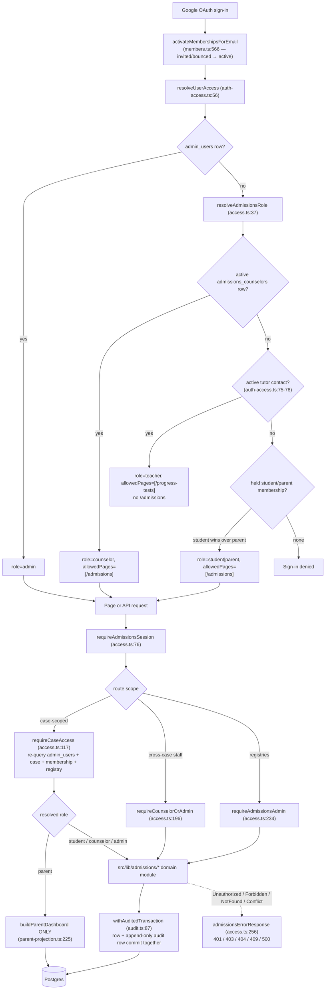

# University Admissions Case Management

**Status: stable (parity-hardening code unmerged on origin/codex/admissions-parity-hardening; schema landed)**

What "stable" rests on, code-verified at `main@0cd1e81`: phases 1–6 plus the admin Manage UI are on `main` (`3fc3502` … `fc1d8ed`, 2026-07-09/10), the nav entry exists (`src/lib/navigation/tools.ts:198-204`), the notification cron is scheduled (`vercel.json:64-67`, registry `src/lib/data-health/cron-registry.ts:322-337`), and the leak/authz matrix passes at this revision — 57 tests, actually run rather than assumed (see [Tests](#tests)). What the parenthetical means: a later `feat(admissions): harden rollout and reach worksheet parity` commit (`a1db1d0`, 2026-07-10) lives only on `origin/codex/admissions-parity-hardening` and is **not** an ancestor of `main` (`git merge-base --is-ancestor a1db1d0 0cd1e81` → no), while its schema — migrations `0053_nosy_spectrum` and `0054_admissions_test_status_backfill` — reached `main` inside an unrelated PR (`a7c8ef8`, "Add Wise post-class feedback tracking (#39)", 2026-07-21). `main` therefore *declares* 12 admissions tables and several columns that no code on `main` reads or writes. Whether those migrations have actually been applied to the production Neon database is a runtime fact this repo cannot attest — the repo-side claim is about the schema and migration files on `main`, not about production state. Details in [Open questions](#open-questions).

> **PRD:** [Casemanagementsystem_prd.md](../Casemanagementsystem_prd.md) · **Design doc:** [casemanagementsystem_design.md](../casemanagementsystem_design.md). Requirement IDs (`CM-xx`) and design sections (`§n`) are quoted only as the code itself cites them, never re-derived from the PRD/design documents. This page uses exactly three: **CM-83** (score release is counselor-only — `testing.ts:21-23`, route gate `testing/route.ts:139`), **design §5.3** (the fixed parent-dashboard section order — `parent/strings.ts:2-3`), and **design §4** (the access contract the leak matrix pins — `parent-access-matrix.test.ts:1`, `:10`, `:15`; `calendar/route.ts:1`, `:6`). Other module headers carry their own ids (`colleges.ts:19` CM-44, `essays.ts:18` CM-63, `notes.ts:6` CM-91) and are cited in place below.

## Purpose

University Admissions is the counselor case-management workspace that replaces BeGifted's per-student "SummitEd" Google Sheets workbooks with one auditable record per student. The code corroborates the four audiences the PRD names:

- **Counselors** (BeGifted staff or external partners registered in `admissions_counselors`) run only the cases they are members of — checklist, college list, applications and decisions, recommenders, essays, activities, testing, meetings, notes — from a desktop-dense workspace at `/admissions` (`src/app/(app)/admissions/page.tsx`, `src/components/admissions/case-detail-shell.tsx`).
- **Students** self-serve their own case from a phone-first portal: tick their own tasks, keep essay status and Drive links current, own the activities list, log test sittings, and fill guided About-You forms (`src/components/admissions/student/portal-shell.tsx:1-27`).
- **Parents** get a view-only, Thai-first dashboard built from a closed projection — never the staff or student surfaces (`src/lib/admissions/parent-projection.ts:1-28`).
- **Admins** (the `admin_users` allowlist) see every case and manage the three registries that make the above possible — counselors, cohorts, and versioned checklist templates (`src/components/admissions/manage-panel.tsx:1-14`).

Everything is snapshot-independent and Wise-agnostic: no admissions table carries a `snapshot_id`, `wiseStudentKey` is an informational text column, and the only Wise-adjacent behavior is that a sign-in email may *also* match a tutor contact (which changes the sign-in outcome — see [Roles](#roles-and-the-three-layer-access-model)). There is no importer for the old workbooks on `main` — no `workbook-import*.ts` module exists under `src/lib/admissions/`; that pipeline exists only on the parity branch.

## Conceptual data model

**36 tables**, all prefixed `admissions_`, plus **16** `admissions_*` enums, declared in `src/lib/db/schema.ts` (`grep -c 'pgTable("admissions_'` → 36; the enum block runs `schema.ts:337-452`, from `admissionsCaseStatusEnum` to `admissionsCollegeCategoryEnum`, with the `// ── Snapshots & Sync` divider at `:454`). Count the enums by their `export const admissions…Enum` declarations, not by `grep -c 'pgEnum("admissions_'` — that returns **15**, one short, because `admissionsNotificationOutboxStatusEnum` breaks its `pgEnum(` call onto the next line (`schema.ts:424`). Columns, indexes, and constraints are the database reference's job: [erd-university-admissions.md](../reference/database/erd-university-admissions.md) (table-by-table, one ER diagram per numbered section — [§1](../reference/database/erd-university-admissions.md#1-case-spine-membership-checklist-meetings-9-tables), [§2](../reference/database/erd-university-admissions.md#2-college-list-and-applications-10-tables), [§3](../reference/database/erd-university-admissions.md#3-student-profile-essays-activities-awards-testing-academics-6-tables), [§4](../reference/database/erd-university-admissions.md#4-communication-audit-notifications-import-11-tables)) and [enums.md](../reference/database/enums.md#university-admissions). Conceptually:

- A **cohort** ("Class of 2027") groups students, owns versioned checklist templates, and is the target of broadcast announcements.
- A **student** is a standalone entity (not a Wise record) with at most one *live* case — enforced by a partial unique index on `status IN ('active','committed')` (`schema.ts:4013-4015`).
- A **case** owns its members (the row that resolves role at sign-in), checklist tasks (copied from the template at creation), meetings, college list items (each with an append-only decision-event chain and a per-college doc/recommender completeness rollup), recommenders, essays, activities, test sittings, notes, six guided self-report sections, and its slice of the append-only audit log.
- **Cross-case registries:** `admissions_counselors` (the counselor sign-in authority), `admissions_resources` (a global link library), `admissions_cohorts`, and the email pipeline's `admissions_notification_log` / `_runs`.

**Twelve tables have no code path on `main`.** `admissions_awards`, `_college_research`, `_interest_events`, `_college_requirements`, `_financial_aid_offers`, `_scholarships`, `_essay_prompt_catalog`, `_notification_outbox`, `_import_runs`, `_import_issues`, `_import_mappings` (all created by `drizzle/0053_nosy_spectrum.sql`) and `admissions_academic_records` (created by `0050`) are referenced only from `schema.ts` — a repo-wide grep for each Drizzle export matches that one file and nothing else. The same migration also widened five existing tables (`admissions_cases`, `_test_sittings`, `_essays`, `_self_report_sections`, `_college_list_items`) with columns no code on `main` reads or writes; the column-by-column inventory is the database reference's job — [erd-university-admissions.md](../reference/database/erd-university-admissions.md), which is itself stale (see [Open questions](#open-questions)). Two of those inert columns carry rules asserted later on this page: `admissions_cases.family_portal_open` (`schema.ts:4005-4007`) and `admissions_test_sittings.deleted_at` (`schema.ts:4409`). All of it is consumed by the unmerged parity branch.

**Soft-reference stance.** `admissions_students.wiseStudentKey` is never joined and never shown to parents (the parent projection selects only `status`, `fullName`, and cohort `name` — `parent-projection.ts:235-249`). `admissions_college_list_items.unitId` soft-references `ipeds_institutions`: reads batch-join the **latest** `dataYear` and fall back to the denormalized name/city/state with `stale: true` when the `unitId` no longer resolves (`colleges.ts:651-687`); the denormalized copy is captured inside the add transaction (`colleges.ts:333-354`). A yearly IPEDS re-import can therefore never break a list.

## API surface

**21 route files exporting 61 method+path endpoints** under `src/app/api/admissions/**` (`grep -rhoE "export async function (GET|POST|PATCH|PUT|DELETE)"` → 61: 21 GET, 17 POST, 14 PATCH, 1 PUT, 8 DELETE), plus the two-method cron route `src/app/api/internal/admissions-notifications/route.ts`. Every `/api/admissions/**` handler starts with `requireAdmissionsSession()` (`src/lib/admissions/access.ts:76-97`) and mutations follow the repo's auth → JSON → Zod → try/catch convention. **The full inventory — every path, method, guard, and request/response contract — is the API reference's canonical job:** [docs/reference/api/university-admissions.md](../reference/api/university-admissions.md) (start at its [endpoint index](../reference/api/university-admissions.md#endpoint-index-63)); the cron is in [internal-crons.md](../reference/api/internal-crons.md#get-apiinternaladmissions-notifications--post-apiinternaladmissions-notifications) (that page carries no explicit anchor; the link targets the generated slug of its `GET`/`POST` heading at `internal-crons.md:313`). Four families, meaning-wise:

- **Case-scoped** (`cases/[caseId]/**`, 14 files) — the case detail itself plus one file per domain tab (members, tasks, meetings, colleges and the nested `colleges/[itemId]/events` decision chain, recommenders, essays, activities, testing, notes, `sections/[sectionKey]`) and two read-only aggregations: `calendar` and the closed `parent-dashboard` projection. The case id is a path parameter, so the guard runs before the body is read.
- **Caseload** (`cases`) — role-scoped list, and the one create path that provisions student + case + members + instantiated checklist in one transaction.
- **Cross-case registries** (`cohorts`, `cohorts/[cohortId]/templates`, `counselors`, `resources`, `announcements`) — the admin spine and the two global libraries. `announcements` is the odd one: one file serves both cohort-broadcast and case-scoped writes.
- **Oversight and automation** (`audit/[caseId]`, `/api/internal/admissions-notifications`) — the paginated admin audit read and the `CRON_SECRET` notification job.

**Guard assignment** (all Postgres-resolved on every request; the JWT role claim is never trusted for rights):

- `requireCaseAccess(email, caseId, minRole)` (`access.ts:117-172`) — every `cases/[caseId]/**` route, `audit/[caseId]` (`audit/[caseId]/route.ts:46`), and the case-scoped branches of `announcements` — GET (`announcements/route.ts:126`), POST (`:164`), and the PATCH/DELETE re-anchor helper (`:63`).
- `requireCounselorOrAdmin` (`access.ts:196-219`) — `cases` GET/POST (`cases/route.ts:52`, `:70`), `cohorts` GET (`cohorts/route.ts:28`), `templates` GET (`templates/route.ts:83`), cohort-scoped and PATCH/DELETE announcements (`announcements/route.ts:135` GET, `:179` POST, `:196` PATCH, `:233` DELETE), and resource writes (`resources/route.ts:81`, `:115`, `:150`).
- `requireAdmissionsAdmin` (`access.ts:234-248`) — `counselors` all methods (`counselors/route.ts:43`, `:59`, `:93`), `cohorts` POST (`cohorts/route.ts:44`), `templates` POST/PATCH (`templates/route.ts:100`, `:150`).
- Session only — `resources` GET, deliberately readable by every admissions role (`resources/route.ts:4-6`, `:69`).

**Guard-before-parse.** Every path-parameter route resolves its guard before `request.json()` (e.g. `essays/route.ts:95` then `:99`). The one exception is forced by shape: `POST /api/admissions/announcements` carries `caseId` *in the body*, so it parses and Zod-validates first (`announcements/route.ts:149-160`) and calls `requireCaseAccess(..., "counselor")` afterwards (`:164`). PATCH/DELETE on announcements re-anchor rights on the **stored** row's scope, never on client-supplied ids (`announcements/route.ts:57-67`).

## UI

Two routes under `src/app/(app)/admissions/` serve three audience-shaped surfaces. **Neither page uses `"use cache"`** — revocation must be instant and both the caseload and the parent projection are per-user (`page.tsx:4-10`; `[caseId]/page.tsx:59-65`).

`/admissions` (`page.tsx`) routes by the JWT role: students and parents are redirected to their own live case (`page.tsx:75-94`; a family member with no live case sees a "No case yet" card), any other non-staff role — e.g. `teacher` — gets a "No access" card (`:97-99`), and counselors/admins get the caseload. `/admissions/[caseId]` (`[caseId]/page.tsx`) runs `requireCaseAccess(email, caseId, "parent")` per navigation (`:83`), redirects `Forbidden` back to `/admissions` so existence never leaks (`:88-90`), 404s only the admin-visible `NotFound` (`:91-93`), and then branches on the *resolved* role: student → portal shell (`:104-140`), parent → `ParentDashboardView` fed only by `buildParentDashboard` (`:147-158`), staff → the case-detail shell, with the meeting log fetched only for staff (`:203`).

- **Staff caseload** (`src/components/admissions/caseload-shell.tsx`): KPI tiles (`computeCaseloadKpis`, `:49-59`), a Table ↔ Board toggle (`caseload-table.tsx`, `caseload-board.tsx`), the "New case" dialog (`create-case-dialog.tsx`), and the global Resources library dialog (`resources-panel.tsx` — case-independent, so it lives here rather than on a case tab). The dialog's client schema (`create-case-dialog.tsx:43-51`) tracks the POST body's shape and limits (`CreateCaseSchema`, `cases/route.ts:21-35`) narrowed to what the form actually collects — it omits `schoolCounselor`/`wiseStudentKey` and offers one counselor, wrapped into `counselorEmails` at submit (`:131`) — and front-runs three server `Conflict` rules as inline field errors: parent≠student, duplicate parents, counselor≠family (`:54-73`; server backstop `cases.ts:194-198`). Validation lives in an exported pure helper, `parseCreateCaseForm` (`:120`), so it is testable without a DOM.
- **Admin Manage panel** (`manage-panel.tsx`): Counselors / Cohorts / Templates tabs hosting `counselors-manager.tsx`, `cohorts-manager.tsx`, `template-editor.tsx`. It is mounted only for admin viewers (`caseload-shell.tsx:203-212`), but there is **no client-side role gate** — every route it calls re-resolves admin rights from Postgres (`manage-panel.tsx:10-13`).
- **Staff case shell** (`case-detail-shell.tsx`): sticky header + 10 tabs with the active tab in the URL (`CASE_TABS`, `:87-98`): Overview / Profile / Checklist / Colleges / Applications / Essays / Activities / Testing / Meetings / Notes. The deadline calendar is a toggled **sub-view inside Overview**, not a tab (`calendar-tab.tsx:9-11`); Profile hosts the staff variant of the self-report sections list. Colleges carries the completeness column and the amber ED/REA warning banner (`colleges-tab.tsx:19-21`); Applications renders the decision timelines and the committed selector, whose confirm dialog spells out the matriculation semantics (`applications-tab.tsx:7-15`). The notes composer has **no preselected visibility** — submit is blocked until the author picks one (`case-detail-shell.tsx:20-22`).
- **Student portal** (`student/portal-shell.tsx`): mobile-first single column with a fixed 5-item bottom nav — Home / Tasks / Colleges / Essays / More (`STUDENT_VIEWS`, `:87-93`). Colleges is read-only (list composition is counselor work); More stacks Activities, Testing, Self-report sections, and Resources as full-screen sub-views. No staff affordance exists in this shell (`:20-26`).
- **Parent dashboard** (`parent/parent-dashboard.tsx`): a single-scroll, read-only page in the fixed §5.3 order — header, progress, deadlines grouped by week, college list, announcements, released testing milestones, shared notes (`PARENT_SECTION_TEST_IDS`, `:56-64`). It fetches nothing; its only interactive control is the Thai/English toggle, persisted in `localStorage` (`parent/strings.ts:33-44`). Every **static** string is a `{th, en}` pair rendered Thai-first; data values render verbatim. That holds structurally, not just by intent: all 49 `PARENT_STRINGS` entries carry both keys (49 `th:` / 49 `en:`, typed by `ParentBilingualString`, `strings.ts:27-30`), the component emits no literal text node or `aria-label` of its own (every visible string goes through `pickParentString`/`formatParentString`), and an unrecognized stored locale falls back to `"th"` rather than English (`:40-42`).
- **Cross-feature entry point**: `add-to-case-menu.tsx` drops an IPEDS institution onto an *active* case's list from the `/us-universities` browse table, dossier, and shortlist bar (`institution-table.tsx:318`, `institution-dossier.tsx:407`, `shortlist-bar.tsx:84`). It lazily fetches the caseload and hides itself permanently on 401/403 (`add-to-case-menu.tsx:11-21`).

A client-safe `src/lib/admissions/shared/*` layer (config, colleges, essays, meetings, recommenders, resources, testing, activities) exists purely so `"use client"` components can import closed value lists, labels, char limits, and pure derivations without pulling `pg` or the Drizzle graph into the browser bundle (`2f01e4f`, "keep pg and db graphs out of the client bundle"). Each db-facing module re-exports its shared counterpart's full export list, symbol for symbol, so server code never has to know the split exists — verified pair by pair across all eight (e.g. `shared/activities.ts` declares 19 exported symbols and `activities.ts:57`, `:83`, `:90` re-export all 19; `shared/testing.ts`'s six come back through `testing.ts:58`, `:82-83`).

## Data flow

Access is resolved on three independent layers, and every case-scoped read or write re-queries Postgres — the JWT claim only shapes navigation.

The sign-in step has one side effect worth naming: `activateMembershipsForEmail` runs in the Auth.js `signIn` callback **before** access resolution (`src/lib/auth.ts:10-23`) and flips the email's `invited`/`bounced` memberships to `active`, re-checking the status inside the `UPDATE` so a concurrent revoke is never overwritten (`members.ts:586-592`). An invite email therefore grants nothing by itself — access materializes only when the invited address actually signs in.

## Business rules & edge cases

### Roles and the three-layer access model

Four roles: `admin` (allowlist, sees everything), `counselor` (hard-walled to member cases), `student` (own case, self-report surfaces), `parent` (own child's case, view-only). `minRole` ordering is `parent < student < counselor < admin` (`CASE_ROLE_PRECEDENCE`, `config.ts:17-22`; `roleAtLeast`, `:28-30`).

1. **Sign-in resolution — and teacher precedence.** `resolveUserAccess` (`auth-access.ts:56-85`) checks `admin_users` first (`:68`), then the active counselor registry (`:70-73`), then the tutor-contact match (`:75-78`), and only then the held student/parent membership (`:80-82`). Consequence: an email holding an active case membership **and** matching an active tutor contact resolves to `role: "teacher"` with `allowedPages: ["/progress-tests"]` — it never becomes student or parent and lands on the "No access" card at `/admissions` (`page.tsx:97-99`). A student membership beats a parent one for the *global* claim (`access.ts:58-59`); actual rights stay per-case.
2. **Per-request re-resolution.** `requireCaseAccess` rejects a malformed `caseId` before touching the database (`access.ts:125`), lets `admin_users` rows bypass membership (a missing case is `NotFound` for admins, `:141-143`), and returns `Forbidden` — never `NotFound` — to non-admins for a missing or soft-deleted case so existence does not leak (`:146`). A counselor membership additionally requires an *active* registry row, so deactivating a counselor revokes every case at once (`:160-167`). Revoking a membership is instant for the same reason: only `status = "active"` rows count (`:148-157`; `members.ts:323-326`).
3. **Parent projection.** `buildParentDashboard` (`parent-projection.ts:225-345`) is the **only** builder of parent payloads. Every field is assembled field-by-field with no row spreads (`:10-12`), so an upstream column cannot leak without a deliberate edit to that one file. Forbidden by construction: aid fields, `counselorStage`, `staff_only` note bodies, per-college completeness, unreleased scores, member emails, `wiseStudentKey`, and anything audit-related (`:13-17`). The route serving it takes `minRole "parent"` so counselors can preview exactly what the family sees (`parent-dashboard/route.ts:7-11`).

The write matrix as implemented: students may create/edit essays (status, prompt, Drive link), own the activities list end-to-end, create/edit/delete their sittings, autosave and submit sections, and tick **student-owned** tasks; college list, decisions, recommenders, meetings, notes, membership, lifecycle, and announcements are counselor+; template/counselor/cohort management is admin-only; **parents write nothing anywhere** — the leak matrix drives a parent session into every case-scoped method and asserts 403 (see [Tests](#tests)). Counselor edits to student surfaces are always **attributed** via the audit `actorRole` (e.g. `essays.ts:23-25`), never disguised.

Every sensitive mutation commits **atomically with its append-only audit row** via `withAuditedTransaction` (`audit.ts:87-112` — a Drizzle transaction with a node-postgres fallback because neon-http has no transactions); field-level `{old, new}` diffs come from `computeFieldDiff` (`:126-140`). Task status ticks are the one deliberate exception: the audit write is fire-and-forget so a tick never blocks on audit (`checklists.ts:793-795`, `:826-844`). `admissions_audit_log` has no update or delete code path; admins read it paginated at `GET /api/admissions/audit/[caseId]` (`audit.ts:183-224`, page size clamped to 1–200).

**Optimistic concurrency** rides `expectedUpdatedAt` on case profile, college list items, essays, activities, and sittings; a stale token throws `Conflict` inside the transaction → 409 (`cases.ts:865-870`, `colleges.ts:496-501`, `essays.ts:365-370`, `activities.ts:370-375`, `testing.ts:359-364`). The case PATCH additionally echoes both timestamps (`cases/[caseId]/route.ts:92-105`).

### Case lifecycle and family routing

`active` → `committed` → `completed`; `active` → `withdrawn`; `completed`/`withdrawn` → `archived`; nothing leaves `archived`, and same-status writes are rejected with `Conflict` (`CASE_LIFECYCLE_TRANSITIONS`, `cases.ts:97-106`; applied and audited by `updateCaseLifecycle`, `:744-792`). Case creation is one transaction — link-or-insert the student, insert the case, insert memberships (student and parents `invited`, counselors `active`), copy the cohort's latest **published** checklist — and seeds + publishes the default template first when the cohort has none (`createCase`, `:173-275`). A parent email equal to the student email, or any counselor/family overlap, is a `Conflict` (`:192-198`).

Family portal routing resolves only **live** cases with an **active** membership (`getCaseIdForFamilyEmail`, `cases.ts:478-507`; statuses at `:497`); a parent of siblings lands on the newest. This is routing, not authorization: `requireCaseAccess` checks membership status, never case status, so a family member whose membership was never revoked can still reach a `withdrawn`/`archived` case by URL (see [Open questions](#open-questions)).

Membership edits (`members.ts`): the student membership is not addable at all after creation — `addMember` throws `Conflict` on *any* `role === "student"` input before it opens a transaction (`:243`), and the route schema only offers `parent | counselor` (`members/route.ts:34`), so the sole student row is the one `createCase` inserts (`cases.ts:241-246`). A case can therefore never acquire a second student. `addMember` otherwise applies the student≠parent rule unless an admin overrides (`:249-251`; the route honors `adminOverride` only for admin sessions, `members/route.ts:92`), and **reinstates** a revoked row in place rather than inserting a duplicate (`:272-305`). `changeMemberEmail` revokes the old row and inserts a fresh `invited` row — the new address must accept its own invite (`:404-479`). `reInvite` works only on `invited`/`bounced` rows (`:509`).

### Checklist and templates

The 10 canonical phases mirror the SummitEd workbook — About You → Academics → Testing → Activities & Awards → College Research → Essays → Recommendations → Applications → Decisions & Financial Aid → Transition to College (`ADMISSIONS_CHECKLIST_PHASES`, `shared/config.ts:16-27`). The default seed is **53 items** (`grep -c 'itemKey: "' config.ts`), 4–8 per phase; no test pins the total, only the per-phase band (`checklists.test.ts:234-237`).

- Templates are **immutable once published**: there is no item-edit path; "editing" means `createTemplateVersion` (version = max + 1, `checklists.ts:304-378`) then `publishTemplate` (`:390-435`; publishing twice → `Conflict`). The publish route additionally refuses a `templateId` outside the URL's cohort (`templates/route.ts:168-173`).
- Case creation **copies** the latest published items into `admissions_case_tasks`, stamping `templateId`/`templateVersion`/`itemKey` (`instantiateChecklist`, `:584-643`). Publishing a new version never mutates existing cases; the explicit admin action `pushNewItemsToCohortCases` appends only items whose `itemKey` a case lacks, and soft-deleted rows still count as present so a push never resurrects a key (`:670-770`).
- Students may change status only on **student-owned** tasks of their own case (`updateTaskStatus`, `:805-811`); leaving `done` clears any counselor verification (`:815-819`). Verification is counselor+ and valid only on student-owned items (`setTaskVerified`, `:868-873`). Custom tasks (optionally weekly/biweekly recurring) are counselor+ (`createCustomTask`, `:933-992`); template-derived tasks cannot be deleted — `Conflict` (`softDeleteTask`, `:1120`). Progress % counts `done`; verified is surfaced separately (`computeProgressCounts`, `:1168-1184`).

### College list, decisions, and recommenders

`colleges.ts`: adds are IPEDS `unitId` or manual free-text (`AddCollegeEntry`, `:265-267`), deduped per case by `unitId` or normalized name → `Conflict` (`:377-382`). Round/deadline/status/category/aid live on the list item; all writes are counselor+.

- **Decision chains** are append-only dated events — deferred → accepted is two rows, both preserved, never edited (`addApplicationEvent`, `:714-790`). `deriveLatestEvents` reduces a chain to current state (`:819-838`).
- **Committed pointer**: exactly one committed college per case. `setCommittedCollege` moves `admissions_cases.committedListItemId` and appends the `committed` event in one transaction, using a conditional `UPDATE … WHERE committed_list_item_id IS NULL` so two concurrent commits can never both win (`:873-932`, guard at `:899-907`); a second commit while another item holds the pointer is a 409, and `addApplicationEvent` applies the same row-lock guard when asked for a `committed` event directly (`:728-755`). Soft-deleting the committed item clears the pointer in the same transaction (`:588-603`).
- **ED/REA warnings** are pure and **warn, never block** (`computeApplicationWarnings`, `:1018-1045`): more than one active ED/ED2, or REA alongside any ED/ED2; items whose latest event is `denied` or `withdrawn` are inactive, so ED-denied → ED2 is warning-free.
- **Recommenders** (`recommenders.ts`): `askStatus` is a forward-only machine planned → asked → agreed | declined (`shared/recommenders.ts:26-33`); an illegal move is `Conflict` (`:366-372`). One link row per (recommender, list item), enforced by pre-check **and** unique index (`:509-560`); a link or submission across cases reads as `NotFound` (`:521`, `:588`). College docs are upserted on (listItemId, docType, testSittingId|null): `score_send` **requires** a sitting of the same case, transcript/school-report **forbid** one (`:680-701`; mirrored as a 400 in `recommenders/route.ts:231-242`). **Completeness** (`computeCompletenessEntry`, `:843-858`): every linked recommender submitted (vacuously true with zero recommenders), transcript and school report sent, and — only when at least one score-send row exists — every score send sent. Ask status is surfaced but never gates completeness.

### Essays

`essays.ts`: writing stays in Google Docs — `driveUrl` is a pointer, never content (`:12-13`). **Staleness** is derived at read time from `lastStudentUpdateAt`, and only student mutations stamp that clock (`:253`, `:400`), so the badge always means "days since the student last worked on this." `counselorStage` is a separate counselor-confirmed field; staff views read `effectiveStage = counselorStage ?? status` (`:516`). The list sort is deterministic: dated rows first, deadline ascending, ties by staleness descending with never-touched counting as most stale (`compareByDeadlineAndStaleness`, `:532-546`). Students may create rows and edit `prompt`/`status`/`driveUrl`; `counselorStage`/`deadline`/`listItemId` are counselor+, refused in the route before the lib is touched (`essays/route.ts:152-158`) and again inside `updateEssay` (`essays.ts:344-352`). Deleting tracker rows is counselor+ (`:434-438`).

### Activities

`activities.ts`: one master list per case capped at 20 live rows → `Conflict` (`MAX_ACTIVE_ACTIVITIES_PER_CASE`, `shared/activities.ts:16`; enforced at `activities.ts:269`). Each activity has an unlimited internal description plus Common App and UC variant blocks with **hard** caps on position, organization, description, hours/week, and weeks/year; the caps are single exported constants (`shared/activities.ts:22-37`) that Zod enforces at both the route and the lib (`admissionsCommonAppBlockSchema`, `:88-100`) and that UI counters render from — a student's copy can never exceed what the real application accepts. Students own the list end-to-end: create, edit, delete, and rank (`:26-29`). `setCommonAppRanks` persists a "Common App top 10" (≤10 ids, ranks 1..n, unlisted ranks cleared, identical order is a no-op with no audit row; `:498-578`); a soft-delete clears the held rank so the top-10 never counts a deleted row (`:442`).

### Testing and score release

`testing.ts`: a sitting is type + date + auto-derived registration deadline + target/actual score. Lead days are per type — SAT/ACT 35, TOEFL/IELTS 14, AP/IB/other `null` (school-managed or unknown → no deadline is ever guessed; `REGISTRATION_LEAD_DAYS`, `shared/testing.ts:64-72`). On update, a "still-auto" rule re-derives the deadline only when the (type, date) pair changed **and** the stored deadline still equals the old auto value — a manually edited deadline is never clobbered (`testing.ts:366-379`). Best-score rollups parse **strictly numeric** strings only; composite or annotated scores are skipped, never guessed (`parseScoreValue`, `:542-547`; `getBestScores`, `:562-605`).

The **release gate**: `scoreReleasedToParent` is counselor-only, enforced per-field in the route (`testing/route.ts:142-147`) and again in the lib (`testing.ts:338-343`). The parent projection attaches a numeric `score` only when released **and** numerically parseable, and otherwise **omits the key entirely** — never `null` — so unreleased scores leave no trace in the payload (`parent-projection.ts:307-322`).

Deletion is still an audited **hard** delete: the full row is preserved in the audit diff and dependent score-send doc rows are removed in the same transaction (`softDeleteSitting`, `testing.ts:448-488`). The module header explains this as a schema gap (`:28-33`), but `deleted_at` now exists on the table (`schema.ts:4409`) — see [Open questions](#open-questions).

### Meetings and notes

- **Meetings** (`meetings.ts`) are the staff-only dated log — the route requires counselor for **every** method including GET, because meeting notes carry candid observations (`meetings/route.ts:3-6`, `:59`), and the case page never fetches them for family viewers (`[caseId]/page.tsx:203`). Action items become case tasks stamped with the non-canonical phase `"custom"` and a null `itemKey`, so they are deletable and ignored by push-new-items (`shared/meetings.ts:20-25`; `meetings.ts:164-180`). `mode` is free text, not an enum (`meetings/route.ts:36`). "Days since last touch" counts only past-or-today meetings — a logged future meeting is a plan, not a touch (`computeDaysSinceLastTouch`, `meetings.ts:309-323`).
- **Notes** (`notes.ts`) carry a visibility that is `NOT NULL` **with no default** (`schema.ts:4437-4438`) — every write is an explicit `staff_only` | `shared_with_family` choice (`notes.ts:25-32`, `:81`), and the route schema has no default either (`notes/route.ts:21-29`). `staff_only` rows reach only counselor/admin readers, enforced in the SQL filter *and* re-checked on the fetched rows (`listNotesForRole`, `:124-148`); the parent projection re-filters a third time (`parent-projection.ts:325-331`).

### Announcements and resources

- **Announcements** (`announcements.ts`) are cohort-scoped (broadcast) XOR case-scoped — exactly one scope, enforced in code before any write (`:109-115`) **and** by the `admissions_announcements_target_check` constraint (`schema.ts:4460`). They are family-visible by design; there is deliberately no visibility enum here (`:5-7`). A case's feed merges its own rows with its cohort's broadcasts, newest first (`listAnnouncementsForCase`, `:161-188`). Scope is immutable — retargeting is delete + create (`:249-251`).
- **Resources** (`resources.ts`) are a global link library grouped by the 10 phase keys plus `general`; URLs must be `https://` (`shared/resources.ts:45-51`). Rows with an unknown topic are never dropped or re-bucketed — they surface after `general` under their raw key so bad data stays visible (`:153-156`).

### Self-report sections and student home

- **Guided forms** (`sections.ts`): six About-You sections — `about_you`, `q_and_a_survey`, `personality`, `random_facts`, `essay_moments`, `majors_reflection` (`ADMISSIONS_SECTION_KEYS`, `:64-71`). Definitions are code, not data (`SECTION_DEFINITIONS`, `:118-642`); payloads validate against them on every write — unknown keys, wrong types, unknown options, and over-length text all reject (`validateSectionPayload`, `:757-810`). Autosave merges partial payloads; `null`/empty clears a key; a no-change save writes nothing (`saveSectionDraft`, `:912-993`). State machine draft → submitted → reviewed: any **effective** edit to a submitted or reviewed section drops it back to draft with the transition recorded in the same audit row (`:947-950`); submitting a never-saved or non-draft section is `Conflict` (`:1039`); review is counselor+ (`:1084`, route gate at `sections/[sectionKey]/route.ts:116-122`) and is the one transition that does not notify (`:1075-1076`). An unknown `sectionKey` is 404 only **after** the membership check, so keys never leak to non-members (`route.ts:12-14`).
- **Student home** (`student-home.ts`): "This Week" merges three ranked sources — open calendar items overdue or due within 7 days, stale-essay nudges (≥14 days untouched with a deadline within 30 days), and unsubmitted-section nudges — deduped by anchor and capped at 5 (`buildThisWeek`, `:128-206`; constants `:63-75`). Phase rings are **season-scoped**: Applications unlocks 10 months before a June graduation (August of senior year), Decisions & Aid at 6 (December), Transition at 3 (March); phases with zero tasks are omitted and `"custom"` tasks never count toward a ring (`PHASE_SEASON_UNLOCK_MONTHS`, `:235-239`; `getPhaseProgress`, `:274-319`).

### Deadlines and calendar

`calendar.ts` aggregates every dated item through a source-agnostic collector contract with four registered sources — task due dates, application-round deadlines, essay deadlines, and testing registrations/sittings (`CalendarItemSource`, `:28`; `CALENDAR_COLLECTORS`, `:144-149`). Adding a source is appending one collector; window filtering, `overdue` stamping, urgency sort, and the DTO shape are shared (`:60-80`). All dates are `"YYYY-MM-DD"` on the Asia/Bangkok calendar; **malformed stored dates are skipped, never guessed** (`:102`). Testing contributes two entries per sitting under kind-suffixed ids (`testing.ts:684`, `:695`). Application deadlines have no owner and so are never reminder targets (`colleges.ts:1064-1065`; `notifications.ts:482`). The upcoming-deadlines panel has no window — an overdue open item stays until done (`getUpcomingDeadlines`, `:249-252`) — while the reminder scan is deliberately **uncapped** so a backlog can never starve future reminders (`getOpenDeadlinesInRange`, `:300-308`). `overdue` is stamped server-side and never recomputed in the client (`calendar-tab.tsx:18-20`).

### Notifications

`notifications.ts` speaks to the Resend REST API over plain `fetch` (`RESEND_ENDPOINT`, `:43`). `RESEND_API_KEY` is required at send time; `ADMISSIONS_EMAIL_FROM` / `ADMISSIONS_EMAIL_REPLY_TO` are optional overrides whose defaults are the Resend sandbox sender and a personal address (`:46-49`, `:299-302`; inventory in [env.md §2.7](../reference/env.md#27-admissions-notifications-3)). Every send is recorded in `admissions_notification_log`; a `dedupeKey` rides the table's partial unique index so keyed sends happen **exactly once**, including a unique-violation catch for the concurrent case (`sendAdmissionsEmail`, `:280-346`).

- **Two tiers**: *interrupt* — counselor direct messages, member invites, and deadline reminders at T-7d / T-48h (`DEADLINE_REMINDER_WINDOWS`, `:58`); *batch* — the weekly digest (announcements, new tasks, section submissions), shaped per role so parents get announcements only (`buildWeeklyDigest`, `:750-752`) and a recipient whose digest is empty receives nothing (`:761-767`).
- **Daily cap**: when already-sent + pending interrupts would exceed 3 per recipient per Bangkok day, everything pending collapses into **one** combined email and each covered window is recorded so tomorrow's scan does not re-send it (`INTERRUPT_DAILY_CAP`, `:55`; `deliverDeadlineReminders`, `:601-653`).
- **Non-disableable reminders**: `notificationPrefs` downgrades apply to digest content only (`:757-759`); the reminder scan deliberately ignores prefs (`:434-435`). Reminders self-heal after a missed run because the scan is range-based and the per-(item, window, recipient) key is idempotent (`:414-421`).
- **Invites** contain only the child's *first* name and the sign-in link — no case data (`sendMemberInvite`, `:818-842`; `deriveStudentFirstName`, `:247-255`); they are deliberately **not** deduped so re-invites resend (`:814`). Sends are fire-and-forget from `members.ts` so a mail failure never fails a membership write (`members.ts:94-99`).
- **Cron**: one daily job, `/api/internal/admissions-notifications` at 08:12 Bangkok. What matters here is the *composition*: every invocation runs the deadline scan, and on Bangkok Sundays the same invocation also runs the weekly digest (`route.ts:56-61`) — there is no separate weekly cron entry, and an explicit `runType` narrows the call to exactly one pass. Both orchestrators are single-flighted through `admissions_notification_runs` (partial unique index on `status='running'`, `schema.ts:4568`; stale rows failed after 30 minutes, `notifications.ts:73`, `:879-919`) and isolate per-recipient/per-case failures into `errorSummary` rather than aborting the run. Methods, secret handling, `maxDuration`, and the skip/status contract belong to the reference pages: [crons.md §16](../reference/crons.md#16-admissions-notifications--apiinternaladmissions-notifications) for schedule and registry, [internal-crons.md](../reference/api/internal-crons.md#get-apiinternaladmissions-notifications--post-apiinternaladmissions-notifications) for the endpoint contract.

## Tests

All unit suites with a mocked database; there are no admissions integration tests on `main` (`find src -name "*admissions*integration*"` → none; the parity branch adds two).

**Attested green, not assumed.** Running the whole admissions surface at this revision — `npx vitest run --project unit src/lib/admissions src/app/api/admissions src/components/admissions src/app/api/internal/admissions-notifications` — passes **68 test files / 1,668 tests**, which is exactly the 21 + 22 + 24 suites below plus the cron route's one. The leak matrix alone accounts for 57 of those tests.

- **21 lib suites** in `src/lib/admissions/__tests__/` — one per module: guards and error mapping (`access.test.ts`), audit diff/transaction fallback, cases (lifecycle matrix, caseload scoping, family landing), checklists (template versioning, instantiate/push semantics, progress math), colleges (dedupe, decision chains, committed race guard, ED/REA warnings, calendar collector), essays (staleness clock, sort key), activities (caps, ranks), testing (deadline derivation, still-auto rule, release gate, best scores), recommenders (ask machine, cross-case `NotFound`, completeness rule), notes (`staff_only` filtering), announcements (XOR scope), resources, calendar (four-source aggregation), meetings (last-touch), sections (payload validation, state machine), student-home (nudges, season rings), notifications (tiers, cap collapse, dedupe, digest shaping), members, cohorts, counselors, and `parent-projection.test.ts` (including a "testing milestones (CM-83)" block and a "leak-test matrix" block).
- **22 route suites** under `src/app/api/admissions/**/__tests__/` (one per route file plus the matrix) and **1** for the cron route (`src/app/api/internal/admissions-notifications/__tests__/route.test.ts`).
- **24 component suites** under `src/components/admissions/**/__tests__/` — the staff shells and tabs, the Manage-panel registries, the student portal, and the parent dashboard (section order, Thai-first toggle).

The mandatory leak/authz matrix is `src/app/api/admissions/__tests__/parent-access-matrix.test.ts`. It is **self-enforcing**: it walks `cases/[caseId]/` with `readdirSync` and fails if any `route.ts` lacks a matrix entry or any exported HTTP method is neither denied nor explicitly allowed (`:22-24`, `:347`, `:358-369`). It then drives a parent session into every handler with **no request body** — which doubles as a guard-ordering test, since a guard-after-parse regression surfaces as a 400/500 instead of a 403 (`:7-10`) — and asserts the parent dashboard is the *one* parent-readable payload while the staff DTO is never built (`:11-14`). It also pins two places where the implementation is stricter than design §4: `GET /cases/[caseId]` admits parents at the guard but 403s them toward the dashboard (`cases/[caseId]/route.ts:58-60`), and `/calendar` GET is `minRole "student"` rather than "student/parent (shaped)" (`:15-18`).

## Open questions

- **Migration 0053 shipped 12 tables' worth of schema to `main` with none of its code.** `drizzle/0053_nosy_spectrum.sql` + `0054_admissions_test_status_backfill.sql`, two new enums (`admissions_test_sitting_status`, `admissions_notification_outbox_status`), 11 new `admissions_*` tables, and extra columns on `admissions_cases`, `_test_sittings`, `_essays`, `_self_report_sections`, `_college_list_items`, and `_academic_records` all reached `main` inside `a7c8ef8` (post-class feedback PR, 2026-07-21). The authoring commit `a1db1d0` ("harden rollout and reach worksheet parity", 2026-07-10) is **not** an ancestor of `main`; it lives on `origin/codex/admissions-parity-hardening` (two commits, merge-base `e4bbb4e`) and adds `academics.ts`, `awards.ts`, `college-details.ts`, `communications.ts`, `essay-prompt-catalog.ts`, `family-cases.ts`, a workbook-import pipeline (`workbook-import*.ts`, ~5,000 lines), routes for `academics`, `awards`, `colleges/[itemId]/{research,requirements,financial-aid,interest-events}`, `essays/from-prompt`, `imports`, `messages`, `scholarships`, `family-cases`, `notification-preferences`, `prompt-catalog`, plus two integration tests. The branch is far behind `main` — 127 commits (`git rev-list --count origin/codex/admissions-parity-hardening..main`), and diffing `main` against it deletes 312 files including all of `src/lib/post-class-feedback`, `src/lib/syllabus`, and `src/lib/student-schedule` — so landing it is a rebase, not a merge. Land, or revert the orphaned schema?
- **`admissions_test_sittings.deleted_at` exists but the code still hard-deletes.** `schema.ts:4409` defines the column, while `testing.ts:28-33` documents its absence and `softDeleteSitting` performs a `DELETE` (`:469-471`) with reads never filtering `deletedAt`. The `status` column backfilled by `0054` is likewise never read or written on `main`. Flip to soft delete now, or leave it to the parity branch?
- **Academic records (GPA / A-level / IB) have no write path.** `admissions_academic_records` exists (`schema.ts:4416`) but there is no `academics.ts`, no route, and no UI on `main`; the Profile tab covers identity fields only (`case-detail-shell.tsx:156-162`).
- **Family access is routing-deep, not guard-deep, and the per-case opt-in flag is inert.** `admissions_cases.family_portal_open` is documented in the schema as "opt-in per case … an audited staff action" (`schema.ts:4003-4007`), but a repo-wide grep for `familyPortalOpen`/`family_portal_open` outside `schema.ts` and the migration returns nothing. Separately, `requireCaseAccess` checks *membership* status only (`access.ts:148-157`), so a never-revoked family member can reach a `withdrawn`/`archived` case by bookmarked URL even though portal routing only lands them on live cases (`cases.ts:497`). Is "revoke memberships on archive" the intended operational step, or should the guard enforce case status (and the opt-in flag) for family roles?
- **The three reference-page drifts this doc used to record are closed; the schema comment is not.** [erd-university-admissions.md](../reference/database/erd-university-admissions.md) now counts **36 tables** and attributes the "25 tables" figure to the schema comment it came from rather than asserting it (`schema.ts:3959-3963`), matching the 36 rows in [database/index.md](../reference/database/index.md). [api/university-admissions.md](../reference/api/university-admissions.md) now heads its inventory *Endpoint index (63)* — 61 under `/api/admissions` across 21 route files plus the 2 cron handlers — carries no JWT "(claim)" gate anywhere, and lists `GET .../meetings` at min role `counselor` (`meetings/route.ts:52-66`). [internal-crons.md](../reference/api/internal-crons.md) no longer cites `vercel.json:60`-`61` for the admissions cron. What is still unreconciled is in code, not docs: the schema's own comment block above the domain still reads "25 tables" against 36 `pgTable` declarations. Correct the comment, or leave it to the parity branch?
- **`notificationPrefs` has no edit surface on `main`.** The column is honored by digest assembly (`notifications.ts:749-759`) but nothing writes it — the `notification-preferences` route exists only on the parity branch. Post-v1 settings surface, or drop the column?
- **A tutor who is also an admissions parent or student loses `/admissions` outright.** The teacher check (`auth-access.ts:75-78`) runs before the held student/parent result returns (`:80-82`), so such an email gets `role: "teacher"` and the "No access" card. At a tutoring company with staff children this is plausible. Is teacher-wins deliberate, or should multi-role page access be returned?
- **Cron JSDoc contradicts the schedule.** `runWeeklyDigest` describes a "Sunday 18:00 Asia/Bangkok slot" (`notifications.ts:1012`), but the cron fires at 08:12 Bangkok and the digest runs inside that daily pass on Sundays (`vercel.json:65-66`; `route.ts:56-61`). One of the two is stale — which is intended?
- **Email defaults.** With `ADMISSIONS_EMAIL_FROM` unset, admissions mail ships from the Resend sandbox sender; `ADMISSIONS_EMAIL_REPLY_TO` defaults to a personal address (`notifications.ts:46-49`). Intentional for now, or should both be required?
- **Calendar GET is stricter than design §4.** The design lists `/calendar` GET as "student/parent (shaped)"; the implementation is `minRole "student"` and parents read deadlines only through the dashboard's `upcomingDeadlines` (`calendar/route.ts:4-5`, `:54`; pinned in the leak matrix). Is the stricter contract final?

_Verified against main@0cd1e81 (clean tree) on 2026-09-02._
