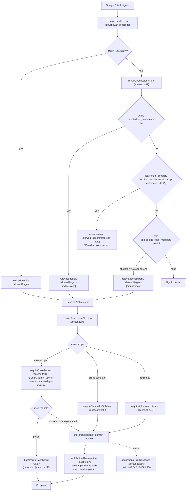

# University Admissions Case Management

**Status:** merged to `main` (phases 1–6 plus the admin Manage UI, `3fc3502`…`fc1d8ed`), registered in the nav (`src/lib/navigation/tools.ts:190-196`) and in `vercel.json` as the `12 1 * * *` notification cron (`vercel.json:59-62`). No maturity badge is asserted here — the mechanisms above are code-verified, the label is not. One caveat carried below: a later schema expansion landed on `main` **without** its code (see [Open questions](#open-questions)).

> **PRD:** [Casemanagementsystem_prd.md](../Casemanagementsystem_prd.md) · **Design doc:** [casemanagementsystem_design.md](../casemanagementsystem_design.md) · Requirements are cited as `CM-xx` (PRD §4) and design sections as `§n`. Those IDs were checked against the module headers that claim them (e.g. CM-83 at `testing.ts:21`, CM-44 at `colleges.ts:858`, CM-63 at `essays.ts:531`, CM-91 at `notes.ts:6`), **not** against the PRD/design documents themselves — treat the `CM-xx` ↔ requirement mapping and every `§n` pointer as sourced from those two docs, not from code.

## Purpose

University Admissions is the counselor case-management workspace that replaces BeGifted's per-student "SummitEd - {Student}" Google Sheets workbooks. Per the PRD (the origin story and its pain points are product context, not something code can attest to), the sheet model did not scale: undated freeform notes, self-reported checkboxes with no verification, no caseload overview, no parent visibility without sharing the whole workbook, and no audit trail on sensitive data (GPA, test scores). This feature moves the whole admissions record into BGScheduler so that:

- **Counselors** (including external partners such as SummitEd staff) run their assigned cases end-to-end — checklist, college list, applications and decisions, essays, activities, testing, meetings, notes — from a desktop-dense workspace at `/admissions`.
- **Students** self-serve their own sections from their phones: tick tasks, update essay status, manage activities and test sittings, and fill guided self-report forms.
- **Parents** answer "where are we?" from a view-only, Thai-first curated dashboard without messaging staff.
- **Admins** manage the three registries that make the above possible — counselors, cohorts, and versioned checklist templates.
- The company gains a durable, auditable admissions record across cycles (decision chains, aid, matriculation are queryable year-over-year).

There is deliberately **no migration** from the old sheets (PRD decision 4): existing workbooks remain a read-only archive; new cases start fresh here. Code corroborates only the negative half — no admissions import path exists on `main` (see [Open questions](#open-questions)).

## Conceptual data model

**36 tables**, all prefixed `admissions_`, plus 16 domain enums, defined in `src/lib/db/schema.ts`. Table-by-table columns, indexes, and the enum line anchors are the database reference's job, not this page's: [erd-university-admissions.md](../reference/database/erd-university-admissions.md) and [enums.md](../reference/database/enums.md). Conceptually:

- A **cohort** ("Class of 2027") owns versioned checklist templates and broadcast announcements.
- A **student** — a standalone entity, *not* a Wise record — has at most one live **case**.
- A **case** owns members, checklist tasks, meetings, college list items (each with an append-only decision-event chain), recommenders (+ per-college links and doc sends), essays, activities, test sittings, notes, guided self-report sections, and its slice of the audit log.
- Cross-case registries: `admissions_counselors` is the global sign-in registry, `admissions_resources` a global link library, and `admissions_notification_log` / `_runs` back the email pipeline.

Eleven of the 36 tables (`admissions_college_research`, `_interest_events`, `_college_requirements`, `_financial_aid_offers`, `_scholarships`, `_essay_prompt_catalog`, `_awards`, `_notification_outbox`, `_import_runs`, `_import_issues`, `_import_mappings`) plus `admissions_academic_records` currently have **no code path at all** — see [Open questions](#open-questions).

**Wise soft-reference stance:** `admissions_students.wiseStudentKey` is an informational text column — never a foreign key into the snapshot tables, never joined at read time, and never shown to parents. No admissions table carries a `snapshot_id`, so the domain survives Wise snapshot rotation untouched and imposes zero coupling on the sync pipeline (PRD §7 rules out hard FK coupling to Wise).

**IPEDS soft-reference stance:** `admissions_college_list_items.unitId` soft-references `ipeds_institutions` the same way — reads batch-join the latest `dataYear` live and fall back to the denormalized copy, flagged `stale: true` (`listCollegesForCase` docblock, `colleges.ts:618-624`; stale computation at `:684`). The denormalized name/city/state are captured once at add time inside the write transaction (`colleges.ts:333-345`).

## API surface

21 route files under `src/app/api/admissions/**` plus the internal cron. All require a session (`requireAdmissionsSession`, `src/lib/admissions/access.ts:76`) and mutations follow the repo's 4-step convention. **The endpoint inventory — every path, method, auth tier, and request/response contract — lives in the API reference (canonical home):** [docs/reference/api/university-admissions.md](../reference/api/university-admissions.md) (start at its [endpoint summary](../reference/api/university-admissions.md#endpoint-summary)).

Four route families, meaning-wise:

- **Case-scoped** (`cases/[caseId]/**`, 14 files): the case-detail file itself, then one file per domain tab — members, tasks, meetings, colleges (+ the nested decision-event chain), recommenders, essays, activities, testing, notes, self-report sections — plus two read-only aggregations, `calendar` and the closed `parent-dashboard` projection. The case id is always a path parameter, so the guard runs first (below).
- **Caseload** (`cases`): role-scoped list, and the one create path that provisions student + case + members + instantiated checklist together.
- **Cross-case registries** (`cohorts`, `cohorts/[cohortId]/templates`, `counselors`, `resources`, `announcements`): the admin-managed spine plus the two global libraries. `announcements` is the odd one — a single file serving both cohort-broadcast and case-scoped writes.
- **Oversight & automation** (`audit/[caseId]`, `/api/internal/admissions-notifications`): the paginated admin audit read and the `CRON_SECRET` notification job.

**Guard-before-parse.** Every route whose scope is a **path parameter** — the whole `cases/[caseId]/**` family and `audit/[caseId]` — resolves `requireCaseAccess` before touching the request body (e.g. `essays/route.ts:95`, guard, then `request.json()` at `:97`). The parent leak matrix pins this ordering deliberately (`parent-access-matrix.test.ts:7-10`). The case-scoped **announcement** path cannot follow the rule: its `caseId` arrives *in the body*, so `POST /api/admissions/announcements` parses and Zod-validates first and calls `requireCaseAccess(user.email, caseId, "counselor")` only afterwards (`announcements/route.ts:149`, `:154`, `:164`).

Guard assignment per route family (all Postgres-resolved, never JWT-derived):

- `requireCaseAccess(email, caseId, minRole)` — every `cases/[caseId]/**` route, `audit/[caseId]`, and the case-scoped branch of `POST /announcements` (after parsing, per above).
- `requireCounselorOrAdmin` — `cases` (list/create), `cohorts` GET, `templates` GET, cohort-scoped and PATCH/DELETE announcements, resource writes (`access.ts:196`).
- `requireAdmissionsAdmin` — `counselors` (all methods), `cohorts` POST, `templates` POST/PATCH (`access.ts:234`).

## UI

Three audience-shaped surfaces hang off two routes under `src/app/(app)/admissions/`.

`/admissions` (`page.tsx`) routes by role: students and parents are redirected to their own case (`page.tsx:75-94`), staff get the caseload workspace, and any other role — e.g. `teacher` — gets a "No access" card (`page.tsx:97-99`), which is exactly where a tutor-and-parent email lands thanks to the teacher precedence step in sign-in (see [Roles](#roles-and-the-three-layer-access-model)). `/admissions/[caseId]` (`[caseId]/page.tsx`) runs `requireCaseAccess` per navigation and branches to the shell matching the visitor's resolved role. **Neither page uses `"use cache"`** — deliberately, because revocation must be instant and caseloads/parent projections are per-user (`page.tsx:4-10`, `[caseId]/page.tsx:59-65`).

- **Staff caseload** (`src/components/admissions/caseload-shell.tsx`, CM-02): header KPI tiles (`computeCaseloadKpis`, `:49`) + a Table ↔ Board toggle — sortable/filterable table (student, cohort, counselor, status, progress %, next deadline, days since last touch) and a kanban board grouped by case status. `create-case-dialog.tsx` captures student, parent email(s), and counselor(s) in one step (CM-01); `resources-panel.tsx` hosts the global library in a dialog (it is case-independent, so it does not belong on a case tab).
- **Admin Manage panel** (`manage-panel.tsx`): a dialog rendered only for admin viewers, hosting three tabs — Counselors (`counselors-manager.tsx`), Cohorts (`cohorts-manager.tsx`), and Templates (`template-editor.tsx`). A cohort row's "Edit template" jumps to the Templates tab with that cohort preselected. There is **no client-side role gate**: every route the managers call re-resolves admin rights from Postgres (`manage-panel.tsx:10-13`).
- **Staff case shell** (`case-detail-shell.tsx`): sticky case header + the canonical tabs (Overview / Profile / Checklist / Colleges / Applications / Essays / Activities / Testing / Meetings / Notes), active tab in the URL (`?tab=`). Colleges carries the completeness column and the ED/REA warning banner; Applications is the decision-event timeline + committed selector. The deadline calendar is a **sub-view inside Overview**, not a tab (`calendar-tab.tsx:9-11`).
- **Student portal** (`student/portal-shell.tsx`, CM-120..122): mobile-first single column with a fixed 5-item bottom nav (Home / Tasks / Colleges / Essays / More). Colleges is read-only for students (list composition is counselor work); More stacks Activities, Testing, Self-report sections, and Resources as full-screen sub-views. No staff affordances exist in this shell.
- **Parent dashboard** (`parent/parent-dashboard.tsx`, CM-130/131): a single-scroll, read-only page — progress, college list (name/round/status only), upcoming deadlines, announcements, released testing milestones, shared notes. Every **static** string is a `{th, en}` pair rendered Thai-first with a persisted toggle (`parent/strings.ts`); data values are verbatim, never translated.
- **Cross-feature entry point**: `add-to-case-menu.tsx` drops an IPEDS institution onto a student's college list from any `/us-universities` surface — the browse table, the dossier, and the shortlist bar all mount it. It lazily fetches the caseload and **hides itself permanently** on 401/403 (`add-to-case-menu.tsx:15-22`).

A client-safe `src/lib/admissions/shared/*` layer (config, colleges, essays, meetings, recommenders, resources, testing, activities) exists purely so `"use client"` components can import closed value lists, labels, char limits, and pure derivations without pulling `pg` or the Drizzle graph into the browser bundle (commit `2f01e4f`). The db-facing modules re-export every shared symbol, so lib/route/test import paths are unchanged.

Design system: existing tokens only — sky-blue OKLCH palette, Inter, shadcn/ui primitives, lucide icons; semantic status colors reuse the `--available` / `--blocked` / `--conflict` conventions for accepted/denied/waitlisted.

## Data flow

Access is resolved three times on independent layers, and every case-scoped read or write re-queries Postgres — the JWT claim only shapes navigation.

The sign-in step has one side effect worth naming: `activateMembershipsForEmail` (`members.ts:566`) flips `invited`/`bounced` memberships to `active` on an exact email match, re-checking the status inside the UPDATE so a concurrent revoke is never overwritten. An invite email therefore grants nothing by itself — access materializes only when the invited address actually signs in.

## Business rules & edge cases

### Roles and the three-layer access model

Four roles (PRD §2, decision 1): `admin` (existing allowlist, sees everything), `counselor` (**new role** — hard-walled to assigned cases, full edit within a case), `student` (own case, self-report sections only), `parent` (own child's case, view-only). Ordering for `minRole` is `parent < student < counselor < admin` (`CASE_ROLE_PRECEDENCE`, `config.ts:17`; `roleAtLeast`, `config.ts:28`).

1. **Sign-in resolution — and the teacher precedence trap.** `resolveAdmissionsRole` (`access.ts:37`) checks the active counselor registry first, then any active membership; a student membership beats a parent membership for the *global* claim, while actual rights stay per-case. But `resolveUserAccess` does **not** return that student/parent result immediately: a counselor short-circuits at `auth-access.ts:71-73`, then the tutor-contact check runs at `:75-78`, and only if it loses does the held admissions result return at `:80-82`. The function's own docstring names the ordering (`auth-access.ts:46-47`). Consequence: an email that holds an active `admissions_case_members` row **and** matches an active tutor contact resolves to `role: "teacher"` with `allowedPages: ["/progress-tests"]` — it never becomes student or parent and loses `/admissions` entirely. A tutor who is also a BeGifted parent is the realistic case. Counselor/student/parent JWTs carry `allowedPages: ["/admissions"]` only. All roles sign in through Google — it is the sole configured Auth.js provider (`src/lib/auth.ts:33-44`); the "no magic links, no LINE Login in v1" framing is PRD decision 18.
2. **Per-request re-resolution.** `requireCaseAccess` (`access.ts:117`) rejects a malformed `caseId` **before touching the database** (`:125`), bypasses membership for `admin_users` rows (a missing case is `NotFound` for admins, `:142`), and returns `Forbidden` — never `NotFound` — to non-admins for a missing or soft-deleted case so existence does not leak (`:146`). A counselor membership additionally requires an *active* registry row, so deactivating a counselor kills their access on every case at once (`:160-167`).
3. **Parent projection.** `buildParentDashboard` (`parent-projection.ts:225`) is the **only** builder of parent-facing payloads. Every field is assembled field-by-field with no row spreads (`parent-projection.ts:10-12`), so a new upstream column can never leak without a deliberate edit to that one file. Forbidden by construction: aid amounts/notes, `counselorStage`, `staff_only` note bodies, per-college completeness detail, unreleased scores, member emails, `wiseStudentKey`, and anything audit-related.

The write matrix (design §2.4): self-report surfaces (About-You sections, activities, essay status/prompt/Drive link, testing self-entries, own task ticks) are student-writable; academics, college list, application decisions, announcements, notes, membership, and lifecycle are counselor+; template/counselor/cohort management is admin-only; **parents write nothing anywhere**. Counselor edits to student sections are allowed but always **attributed** via the audit `actorRole` — never disguised as the student.

Every sensitive mutation commits **atomically with its append-only audit row** via `withAuditedTransaction` (`audit.ts:87` — a Drizzle transaction with a node-postgres fallback, mirroring payroll sync); field-level `{old, new}` diffs come from `computeFieldDiff` (`audit.ts:126`). `admissions_audit_log` has no update or delete code path; admins read it paginated at `GET /api/admissions/audit/[caseId]` (CM-140).

### Case lifecycle

`active` → `committed` → `completed`; `active` → `withdrawn`; `completed`/`withdrawn` → `archived`; nothing leaves `archived`, and same-status writes are rejected (`CASE_LIFECYCLE_TRANSITIONS`, `cases.ts:97`; applied and audited by `updateCaseLifecycle`, `cases.ts:744`). Transitions are staff-only. One live case per student is enforced by a partial unique index (status in active/committed). Family portal routing (`getCaseIdForStudentEmail`, `cases.ts:520`; `getCaseIdForParentEmail`, `cases.ts:539`) resolves only **live** cases — a parent with siblings lands on the newest, and the per-request guard still governs each case. Retention is **indefinite** (PRD decision 19 — the accepted-Thai-PDPA-risk framing is the PRD's, not code's). Code corroborates the mechanism: `vercel.json` registers no admissions purge job, and `admissions_audit_log` has no delete path at all (`audit.ts` only inserts at `:64` and selects at `:196-206`). On identity data, the schema *intends* to collect no Thai national IDs or passport numbers — `admissions_students` (`schema.ts:3968-3985`) carries only name, preferred name, email, phone, school, school counselor, cohort, `wiseStudentKey`, and `externalLinks` — but nothing structurally prevents it: `externalLinks` and `admissions_academic_records.payload` (`schema.ts:4412`) are both unconstrained `jsonb`.

### Checklist and templates

The 10 canonical phases mirror the SummitEd workbook: About You → Academics → Testing → Activities & Awards → College Research → Essays → Recommendations → Applications → Decisions & Financial Aid → Transition to College (`ADMISSIONS_CHECKLIST_PHASES`, `src/lib/admissions/shared/config.ts`, re-exported from `config.ts:35-40`). The default seed is 53 items (`DEFAULT_CHECKLIST_ITEM_ROWS`, `config.ts:65`, mapped 1:1 to `DEFAULT_CHECKLIST_ITEMS` with derived `sortOrder` at `config.ts:454-455`). No test pins the total — `checklists.test.ts:226-238` only asserts 4–8 items in each of the 10 phases.

- Templates are **immutable once published** — there is no item-edit path; "editing" means `createTemplateVersion` (`checklists.ts:304`, version = max + 1) followed by `publishTemplate` (`checklists.ts:390`).
- Case creation **copies** the cohort's latest published template items into `admissions_case_tasks` (snapshot semantics — stamped with `templateId`/`templateVersion`/`itemKey`; `instantiateChecklist`, `checklists.ts:584`), seeding the default template when the cohort has none (`seedDefaultTemplate`, `:541`). Publishing a new version never mutates existing cases.
- `itemKey` is the stable identity across versions; the explicit admin action `pushNewItemsToCohortCases` (`checklists.ts:670`) appends only items whose `itemKey` a case does not already have.
- Tasks carry owner (student/counselor/parent), optional due date, status, and a counselor **verified** flag valid only on student-owned items (CM-22). Students may update status only on student-owned tasks of their own case; custom tasks (with recurrence) and verification are counselor+; template-derived tasks cannot be deleted (409). Progress % counts done items, with verification surfaced separately (`computeProgressCounts`, `checklists.ts:1168`; `computeProgress`, `:1190`).

### College list, decisions, and recommenders

`src/lib/admissions/colleges.ts`. US rows soft-reference `ipeds_institutions` by `unitId` and denormalize name/city/state at add time; reads batch-join the **latest** `dataYear` and fall back to the denormalized copy with `stale: true` when the `unitId` no longer resolves (CM-40, `colleges.ts:620-624`) — a yearly IPEDS re-import can therefore never break a list. Non-US/manual rows are free-text name + country with `isManual: true`.

- **Decision chains (CM-43)** are an append-only chain of dated events (the closed value list is [`admissions_decision_event`](../reference/database/enums.md#admissions_decision_event)); deferred→accepted is two rows, both preserved, and events are never edited. `deriveLatestEvents` (`colleges.ts:819`) reduces a chain to current state for warnings and UI chips.
- **Committed pointer (CM-44):** exactly one committed college per case — `admissions_cases.committedListItemId` and the `committed` event commit in one transaction (`setCommittedCollege`, `colleges.ts:873`); a second commit while another item holds the pointer is a 409.
- **ED/REA warnings (CM-45):** `computeApplicationWarnings` (`colleges.ts:1018`) is pure and **warns, never blocks** — >1 active ED/ED2, or REA alongside any ED. Items whose latest event is `denied` or `withdrawn` are inactive for warning purposes, so ED-denied → ED2 is a legal, warning-free plan.
- Round/deadline/status/category/aid live on the list item; updates use `expectedUpdatedAt` optimistic concurrency (mismatch → 409). All list and application writes are counselor+.
- **Recommenders** (`recommenders.ts`): `askStatus` is a forward-only machine (planned → asked → agreed | declined, terminal); invalid moves → 409 (CM-50). One link row per (recommender, list item) with per-college submitted status (CM-51). Per-college completeness (CM-46) rolls up recommender submissions plus `admissions_college_docs` rows (upsert key and indexes: see that table's entry in the [ERD reference](../reference/database/erd-university-admissions.md)). The meaning-bearing half of that key is a rule: `score_send` rows **require** a test-sitting id, transcript/school-report rows **forbid** one — so a score send is always traceable to the sitting it came from. Cross-case references read as `NotFound`, so ids cannot be probed across cases.

### Essays

`src/lib/admissions/essays.ts` (CM-60..63). Writing stays in Google Docs — `driveUrl` is a pointer, never content (decision 9). **Staleness** is derived at read time from `lastStudentUpdateAt`, and *only student mutations* stamp that clock (`essays.ts:400` — the stamp is inside an `access.role === "student"` branch), so the badge always means "days since the student last worked on this." `counselorStage` is a separate counselor-confirmed field; staff views read `effectiveStage = counselorStage ?? status` (`essays.ts:516`, CM-62). The list sorts by the deterministic CM-63 key (`listEssaysForCase`, `essays.ts:495`): dated rows first, deadline ascending, ties broken by staleness descending with never-touched counting as most stale. Students may create rows and edit status/prompt/driveUrl; `counselorStage`/deadline/college link are counselor+.

### Activities

`src/lib/admissions/activities.ts` (CM-70..72). One master list per case capped at 20 live rows (`MAX_ACTIVE_ACTIVITIES_PER_CASE`, `shared/activities.ts:16`; enforced at `activities.ts:269` → 409). Each activity has an unlimited internal description plus Common App and UC platform variant blocks carrying **hard** caps on position, organization, description, hours/week and weeks/year. The rule is what matters here: the caps are single exported constants (`shared/activities.ts:22-37`) that Zod enforces at the API *and* the UI character counters render from, so a student's copy can never exceed what the real application accepts, and the internal description stays free-form. The numeric values themselves belong to the field reference (the [ERD](../reference/database/erd-university-admissions.md) entry for `admissions_activities` records "char limits enforced in code" for exactly this reason). Students drag-rank a persisted "Common App top 10" (`setCommonAppRanks`, `activities.ts:498`; at most 10 ids, ranks 1..n, unlisted ranks cleared, a re-submitted identical order is a no-op). Students own this list end-to-end.

### Testing and score release

`src/lib/admissions/testing.ts` (CM-80..83). Test records are sittings — the closed type list is [`admissions_test_type`](../reference/database/enums.md#admissions_test_type) — with a registration deadline auto-derived from per-type lead days (`REGISTRATION_LEAD_DAYS`, `shared/testing.ts:64`; `deriveRegistrationDeadline`, `:93`) and always editable. Registration deadlines *and* test dates feed the deadline calendar (CM-81). Score sends per college live in `admissions_college_docs`, never duplicated here. Best-score rollup parses **strictly numeric** strings only — composite or annotated scores return null and are skipped, never guessed (`parseScoreValue`, `testing.ts:542`).

The **release gate** (CM-83): `scoreReleasedToParent` is counselor-only — a student or parent attempt throws `Forbidden`, enforced in the route per-field and again in the lib. Raw scores stay staff+student until released; the parent projection then surfaces milestones with the numeric score attached only for released, numerically-parseable scores, and **omits the `score` key entirely** (never `null`) otherwise (`parent-projection.ts:18-20`).

Deletion is still an audited **hard** delete (`softDeleteSitting`, `testing.ts:448`): the full row is preserved in the audit diff and dependent score-send doc rows are removed in the same transaction. The module header (`testing.ts:28-33`) explains this as a schema gap — but a `deleted_at` column now *does* exist on the table (`schema.ts:4401`); see [Open questions](#open-questions).

### Meetings and notes

- **Meetings** (`meetings.ts`, CM-30..32) turn the sheets' undated freeform notes into a staff-only, first-class dated log per case — the record of what was actually discussed and what happens next (columns in the [ERD reference](../reference/database/erd-university-admissions.md)). Two things it is *not*: `mode` is unconstrained free text, not an enumerated set — the column is nullable `text` with no check constraint, route validation is `z.string().nullish()` (`meetings/route.ts:36`, `:46`), and the staff composer merely suggests In person / Online / Phone / Other (`case-detail-shell.tsx:1166-1170`); and `notes` is a plain nullable `text` blob, not a structured field. Action items create case tasks with owners and due dates (CM-31), and "days since last touch" derives from the meeting log to feed caseload triage (CM-32).
- **Notes** (`notes.ts`, CM-91) carry a visibility enum that is `NOT NULL` **with no default** — every write is an explicit `staff_only` | `shared_with_family` choice (`notes.ts:25`), and the UI composer forces the selection. `staff_only` rows reach only counselor/admin readers, enforced in the SQL filter *and* re-checked on the fetched rows (`notes.ts:5-8`); the parent projection re-filters a third time (`parent-projection.ts:21-22`). A counselor note leaking to a family is the PRD's highest-severity failure mode, hence the triple check.

### Announcements and resources

- **Announcements** (`announcements.ts`, CM-90) are cohort-scoped (broadcast) XOR case-scoped — exactly one scope, enforced in code **and** by the `admissions_announcements_target_check` constraint (`announcements.ts:8-9`). They are family-visible by design; there is deliberately no visibility enum here (audience shaping belongs to notes). Writes are counselor+. Note the guard asymmetry: PATCH/DELETE use `requireCounselorOrAdmin` because the **stored row**, not the request, defines the scope — a client-supplied scope is never trusted for rights.
- **Resources** (`resources.ts`, CM-92) are a global, case-independent curated link library grouped by the 10 phase keys plus a "general" bucket; rows with an unknown topic are never dropped or re-bucketed — they surface after "general" so bad data stays visible. Counselor/admin write, every admissions role reads.

### Self-report sections and student home

- **Guided forms** (`sections.ts`, CM-121): six About-You sections from the source sheet — `about_you`, `q_and_a_survey`, `personality`, `random_facts`, `essay_moments`, `majors_reflection` (`sections.ts:64`). Definitions are code, not data; payloads validate against them on every write (unknown keys rejected, fail-closed). Autosave merges partial payloads; a no-change save writes nothing. State machine draft → submitted → reviewed; **submit is the only notify event**, and any *effective* edit to a submitted or reviewed section drops it back to draft with the transition recorded in the same audit row (`sections.ts:18-27`). A case with no row reads as a virtual empty draft, and submitting a never-saved section is a 409.
- **Student home** (`student-home.ts`, CM-120): "This Week" merges three ranked sources — open calendar deadlines (overdue or due ≤7 days), stale-essay nudges, and unsubmitted-section nudges — into a deterministic capped list (`buildThisWeek`, `:128`). Phase rings are **season-scoped** (`getPhaseProgress`, `:274`): Applications unlocks in August of senior year, Decisions & Aid in December, Transition in senior spring; zero-task phases are omitted. The global % lives on staff and parent views only.

### Deadlines and calendar

`calendar.ts` (CM-100..102) aggregates every dated item through a source-agnostic collector contract (`CALENDAR_COLLECTORS`, `calendar.ts:144`) with four registered sources — task due dates, application-round deadlines, essay deadlines, and testing registrations/sittings (`CalendarItemSource`, `calendar.ts:28`). Adding a source is appending one collector; the window filter, overdue stamping, urgency sort, and DTO shape are source-agnostic. All dates are `"YYYY-MM-DD"` compared on the Asia/Bangkok calendar, and **malformed dates are skipped, never guessed** (`calendar.ts:14-15`). Testing contributes two entries per sitting under kind-suffixed ids (`{sittingId}:registration` / `{sittingId}:sitting`). `overdue` is stamped server-side and never recomputed in the client (`calendar-tab.tsx:18-20`). The per-case view renders a month grid on desktop (≥1024px) and a week-grouped list below that.

### Notifications

`notifications.ts` (design §7, CM-110..112). Transport is the Resend REST API over plain `fetch` (`RESEND_ENDPOINT`, `:43`), mirroring the classroom schedule-email discipline; `RESEND_API_KEY` is required and `ADMISSIONS_EMAIL_FROM` / `ADMISSIONS_EMAIL_REPLY_TO` are optional overrides (`:299-302`). Every send is recorded in `admissions_notification_log`, and a `dedupeKey` rides a partial unique index so keyed sends happen **exactly once** even across re-runs — including a unique-violation catch for the concurrent case (`:341`).

- **Two tiers** (CM-110): *interrupt* — counselor direct messages, member invites, and deadline reminders at T-7d and T-48h (`DEADLINE_REMINDER_WINDOWS`, `:58`); *batch* — the weekly digest (announcements, new tasks, section submissions — role-shaped per recipient; a recipient whose shaped digest is empty receives nothing), sent on Bangkok Sundays (`runWeeklyDigest`, `:1024`).
- **Daily cap** (CM-111): more than 3 interrupts per recipient per Bangkok day collapse into **one** combined email (`INTERRUPT_DAILY_CAP`, `:55`; collapse at `:618-628`).
- **Non-disableable reminders** (CM-112): per-category `notificationPrefs` downgrades apply to digest content only (`:749`); deadline reminders have no pref key and are deliberately ignored by the reminder scan (`:434`) — fail-closed.
- **Invites** (PRD §3.7): bilingual Thai-first, containing only the child's *first* name and the sign-in link (`ADMISSIONS_SIGN_IN_URL`, `:52`) — no case data. Member status (invited/active/revoked/bounced) supports one-click re-invite (`sendMemberInvite`, `:818`, deliberately **not** deduped).
- **Cron**: one path, `GET/POST /api/internal/admissions-notifications` (`CRON_SECRET` via the shared `rejectInvalidCronSecret`, `maxDuration = 300`), scheduled `12 1 * * *` in `vercel.json:59-62` (08:12 Bangkok, staggered against the other crons) and wrapped in `withCronInvocationAudit` under job key `admissions_notifications`. Every invocation runs the daily deadline scan; on Bangkok Sundays it also runs the weekly digest in the same invocation (`route.ts:56-61`); an explicit `runType` runs exactly one pass. Both orchestrators are single-flighted through `admissions_notification_runs` (partial unique index on `status='running'`, stale rows failed after 30 minutes — `STALE_RUNNING_NOTIFICATION_RUN_MS`, `notifications.ts:73`). Every pass skipped by the guard → 202. See [docs/reference/crons.md](../reference/crons.md#15-admissions-notifications--apiinternaladmissions-notifications).

## Tests

Coverage is unusually broad: **21** unit suites in `src/lib/admissions/__tests__/` (one per module — guards, projections, progress math, staleness, warnings, notification tiering/caps, template versioning), **22** route-handler suites under `src/app/api/admissions/**/__tests__/`, and **24** component suites under `src/components/admissions/**/__tests__/` (staff shells and tabs, the Manage-panel registries, student portal, parent dashboard) — all with mocked db.

The mandatory leak/authz matrix is `src/app/api/admissions/__tests__/parent-access-matrix.test.ts`. It is **self-enforcing**: two completeness checks fail the suite if any `route.ts` under `cases/[caseId]/` lacks a matrix entry or if any exported HTTP method is neither denied nor explicitly allowed (`parent-access-matrix.test.ts:22-24`). It then drives a parent-role session into every handler with **no request body** — which doubles as an ordering test, since a guard-after-parse regression would surface as a 400/500 instead of a 403 (`:7-10`) — and asserts the parent dashboard is the *one* parent-readable payload. It also pins two places where the implementation is stricter than design §4: `GET /cases/[caseId]` admits parents at the guard but 403s them toward the dashboard without ever building the staff DTO, and `/calendar` GET is `minRole "student"` rather than the documented "student/parent (shaped)" (`:11-19`). Unreleased-score omission and `staff_only` filtering are additionally pinned in `parent-projection.test.ts` and `notes.test.ts`.

## Open questions

- **Migration 0053 shipped 12 tables' worth of schema to `main` with none of its code.** `drizzle/0053_nosy_spectrum.sql` + `0054_admissions_test_status_backfill.sql`, the two new enums, the 11 new `admissions_*` tables, and the extra `admissions_test_sittings` columns (`status`, `subject`, `score_details`, `late_registration_deadline`, `deleted_at`) all reached `main` as collateral inside the post-class-feedback PR (`a7c8ef8`, 2026-07-21). The commit that *authored* them — `a1db1d0` "feat(admissions): harden rollout and reach worksheet parity", which also adds `academics`, `awards`, `research`, `requirements`, `financial-aid`, and `interest-events` routes, an import pipeline, a readiness script, and Playwright e2e specs — is **not** an ancestor of `origin/main` (it lives on `codex/admissions-parity-hardening`). Verify: `grep -rn admissionsAwards src/ --include=*.ts` matches `schema.ts` only, and the same holds for `admissionsCollegeResearch`, `_interestEvents`, `_collegeRequirements`, `_financialAidOffers`, `_scholarships`, `_essayPromptCatalog`, `_notificationOutbox`, `_importRuns`, `_importIssues`, `_importMappings`, and `admissionsAcademicRecords`. Is the intent to land that branch, or to revert the orphaned schema? Until it is resolved, production carries empty tables no code reads or writes.
- **`admissions_test_sittings.deleted_at` now exists but the code still hard-deletes.** `schema.ts:4401` defines the column (added by 0053), while `testing.ts:28-33` still documents its absence and `softDeleteSitting` (`testing.ts:448`) performs a `DELETE`, with reads never filtering `isNull(deletedAt)`. Similarly `status` (backfilled by 0054) is never read or written by `testing.ts`. Flip the delete to an UPDATE and adopt the status column, or is that deliberately owned by the unmerged parity branch?
- **Academic records (CM-10..13) still have no code path.** `admissions_academic_records` exists at `schema.ts:4408`, but there is no `academics.ts` lib module, no `academics` route on `main`, and no UI consumer. GPA / A-level / IB entry — and its CM-13 field-level audit — has no write path; the Profile tab covers identity fields only.
- **The API reference's auth column is stale for the cross-case registries.** [docs/reference/api/university-admissions.md](../reference/api/university-admissions.md) marks `cases` GET/POST, `cohorts`, `templates`, and `counselors` as JWT-"(claim)" gates. At HEAD those routes call the Postgres-resolved `requireCounselorOrAdmin` / `requireAdmissionsAdmin` instead (`cases/route.ts:52,70`; `cohorts/route.ts:28,44`; `cohorts/[cohortId]/templates/route.ts:83,100,150`; `counselors/route.ts:43,59,93`). The ERD page likewise still says 25 tables. Both reference pages need a pass — confirm before relying on them.
- **Family access to withdrawn/archived cases is routing-deep, not guard-deep.** PRD §5 says family sign-in is denied for `withdrawn`/`archived`. Implemented: portal routing resolves only live cases, so families land on an empty state — but `resolveAdmissionsRole` and `requireCaseAccess` check *membership* status only, never *case* status (`access.ts:148-157`), so a family member whose membership was never revoked can still reach an archived case via a bookmarked URL or direct API call. Is "revoke memberships on archive" the intended operational step, or should `requireCaseAccess` enforce case status for family roles?
- **CM-112's per-category downgrade controls still have no edit surface.** `admissions_case_members.notificationPrefs` is stored and honored by digest assembly (`notifications.ts:749`), but no API route or UI writes it — recipients cannot actually downgrade a category. Post-v1 settings surface, or should the column be dropped?
- **A tutor who is also an admissions parent or student loses `/admissions` outright.** The teacher check at `auth-access.ts:75-78` runs *before* the held student/parent result returns at `:80-82`, so such an email resolves to `role: "teacher"`, `allowedPages: ["/progress-tests"]`, and `/admissions` renders the "No access" card (`admissions/page.tsx:97-99`). At a tutoring company with staff children this is plausible, not hypothetical. Is teacher-wins the deliberate policy, or should the resolver return multi-role page access (`["/progress-tests", "/admissions"]`) when both match?

_Verified against HEAD + uncommitted WIP on 2026-05-31._
