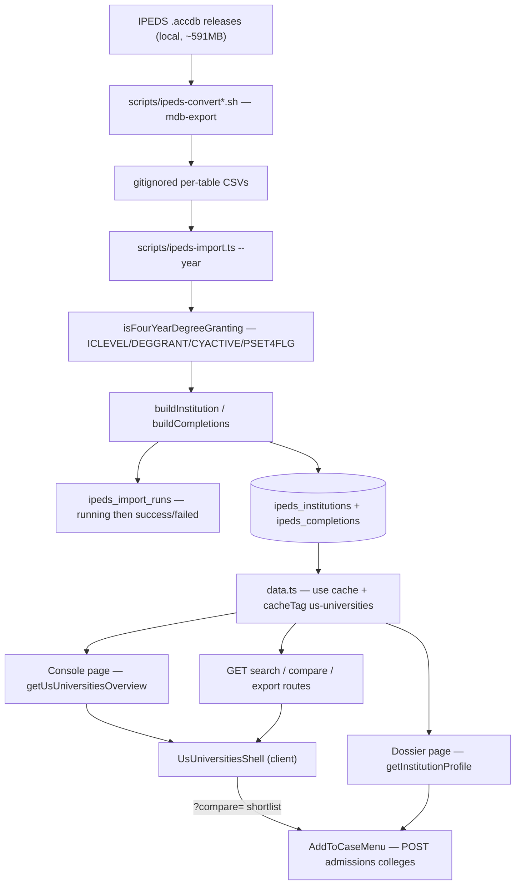

# US Universities (IPEDS)

**Status: stable**

## Purpose

US Universities is a read-only research console over a curated slice of the federal IPEDS release: the institutions that clear the load-time active / Title IV / four-year / degree-granting gate (`src/lib/us-universities/constants.ts:143-154`), with their admissions funnel, test-score bands, cost ladder, retention and graduation outcomes, student-body demographics, and conferred-degree mix — plus a five-year admissions trend behind each school (the four historical "Final" releases plus the current one).

It exists because the BeGifted college-counseling team was answering "how selective is this?", "what does it actually cost?", "what are they known for?" out of browser tabs and memory. The feature turns that into one filterable dataset that also **feeds the admissions case-management college list**: an `Add to case` control sits on the table rows (`institution-table.tsx:318`), the dossier action row (`institution-dossier.tsx:407`), and the shortlist chips (`shortlist-bar.tsx:84`) — notably *not* on the default card gallery or the compare-panel chips — and a college-list row soft-references `ipeds_institutions.unitId` (never an FK) so a counselor's list is built from the same reference data (`src/lib/admissions/colleges.ts:9-13`).

Two things define its shape:

- **It is not a live integration.** IPEDS ships as a Microsoft Access database — the convert script's header puts the 2024-25 file at 591 MB (`scripts/ipeds-convert.sh:5-10`; the `.accdb` and its CSVs are gitignored, so that figure is the script author's note, not a measurable repo artifact) — that cannot live in git or be read on Vercel. The whole ingest is an offline, operator-run pipeline (`mdbtools` → CSV → a Node import script), and the running app *only* ever reads Postgres (`src/lib/db/schema.ts:3001-3002`). There is no cron, no API-triggered sync, and no runtime dependency on the source files.
- **It is fail-closed about missing data, on the display side.** IPEDS marks unreported values with a blank or a `.`; those become `null`, never `0` (`src/lib/us-universities/parser.ts:6-17`), and every read surface inspected for this doc — table cell, KPI tile, chart series, price bar, demographics segment (enumerated under [Fail-closed nulls](#fail-closed-nulls-everywhere)) — either renders an em dash or omits the mark entirely rather than implying a real zero. The rule is a display convention, not a schema constraint: the ingest itself still coerces the doctoral-degree components and the completion `count` to `0` when the source field is absent (`src/lib/us-universities/transform.ts:62-64`, `:145`, `:174`), and a newly added surface is not automatically covered.

Audience: admin/counseling staff at `/us-universities`, registered as a nav tool in the research-reference section (`src/lib/navigation/tools.ts:227-233`). Access is the standard authenticated-admin gate, and the page/API namespace pair (`/us-universities`, `/api/us-universities`) participates in the per-user `allowedPages` scoping in `src/middleware.ts:53-59`.

## Conceptual data model

Three tables, all in the `ipeds_*` family, all partitioned by a `dataYear` text column so a new IPEDS year drops in without a migration (`src/lib/db/schema.ts:2997-3002`). Only `ipeds_institutions` is *uniquely* keyed by `(dataYear, unitId)` (`schema.ts:3107`); the other two are not — see the bullets below. Column-level detail, indexes, and the ER diagram are in the [core ERD, §6 US universities (IPEDS)](../reference/database/erd-core.md) — the canonical home for that mechanics; the cross-domain table inventory is in the [database index](../reference/database/index.md).

- **IPEDS import runs** — one row per import of one data year; no `unitId` column at all. A partial unique index on `dataYear where status = 'running'` (`schema.ts:3016-3018`) means the same year cannot import twice concurrently while different years may run side by side. It is the only place the console can learn how fresh its data is, and the only bookkeeping the ingest leaves behind. Columns are in the [core ERD §6](../reference/database/erd-core.md).
- **IPEDS institutions** — the wide denormalized profile row, one per `(dataYear, unitId)` and the only table with that composite uniqueness. It is assembled from eleven separate IPEDS survey tables (directory, admissions, derived admissions, enrollment, retention, graduation, outcome measures, cost, net price, degree mix) into a single row so every read is a single-table scan with no joins. A `raw` JSONB column retains the compact source records that fed it. Because it is intended to hold the current year *and* the four historical releases the convert script covers (`scripts/ipeds-convert-historical.sh:22-27`), this one table is both the browse index and the multi-year trend source — hence the extra `(unitId, dataYear)` index added for per-institution cross-year fetches. Which years are actually present is an operator fact, not a code guarantee: nothing at runtime checks or backfills them (see [Open questions](#open-questions)).
- **IPEDS completions** — conferred-degree counts at the grain (dataYear, unitId, 6-digit CIP code, award level), with the 2-digit CIP family denormalized onto the row. Nothing enforces that grain in the database: the table carries three plain indexes and no unique constraint at all (`schema.ts:3128-3130`), so idempotency rests entirely on the importer's delete-then-insert. This is what powers "known for" (top majors) and the major-based browse filter. Only the current release is loaded; no historical completions are imported (`scripts/ipeds-import.ts:209-211`).

Nothing else in the app writes these tables. One table *reads* across the boundary: the admissions college list resolves the latest `dataYear` row for a `unitId` and denormalizes the name/city/state onto its own row, so a case list stays readable even if a future import drops that institution (`src/lib/admissions/colleges.ts:283-290`, `:333-357`).

## API surface

Five endpoints, all `GET`, all on the admin-session tier; none is cron-protected or public. The exact guard predicate, status literals, request/response contracts, the shared `FilterQuerySchema`, and error shapes are in the [misc API reference](../reference/api/misc.md#us-universities) and the [API index](../reference/api/index.md) — the canonical home for endpoint mechanics.

| Endpoint | Purpose |
|---|---|
| `GET /api/us-universities` | The console's landing payload — everything the page needs before the user touches a filter ([shape](../reference/api/misc.md#us-universities)). |
| `GET /api/us-universities/search` | Filtered, sorted, paged institution browse — the only endpoint the console polls as the user types or clicks. |
| `GET /api/us-universities/compare` | Side-by-side payload for up to four `unitId`s, each with its top major and admissions trend. |
| `GET /api/us-universities/export` | The current filter set serialized as a CSV download, not JSON. |
| `GET /api/us-universities/institutions/[unitId]` | Full institution profile — the wide row plus completions, top majors, and admissions trend; `404` when the unit id is not in the active data year. |

Both page routes bypass the HTTP layer entirely and call the cached data helpers directly on the server, so only `/search`, `/compare` and `/export` have in-app callers (see [Open questions](#open-questions)).

## UI

Two pages under `src/app/(app)/us-universities/`, both Server Components whose async bodies re-check the session and redirect to `/login` without one. Only the dossier's default export is itself `async` (`[unitId]/page.tsx:114`); the console's default export is synchronous and the `auth()` check lives in the inner `UsUniversitiesBody` (`page.tsx:8-16` vs `:18-24`).

- **Console** — `src/app/(app)/us-universities/page.tsx`. Fetches the overview server-side and renders `<UsUniversitiesShell>` inside `<Suspense>` with a skeleton (`page.tsx:8-24`).
- **Dossier** — `src/app/(app)/us-universities/[unitId]/page.tsx`. Parses the unit id and the incoming filter/shortlist query params with pure exported helpers, fetches the profile, `notFound()`s on a bad id or an absent institution, and computes the "back to results" href so the console's filters *and* shortlist survive the round trip (`[unitId]/page.tsx:90-133`).

Key components (`src/components/us-universities/`):

| Component | Role |
|---|---|
| `us-universities-shell.tsx` | The console. Owns filters, paging, the results fetch (abortable, deferred through a `setTimeout(0)`), the `?compare=` shortlist, and URL sync. |
| `kpi-hero.tsx` | Four overview tiles; `publicPrivateSplit` folds controls 2+3 into "private" and ignores unknown codes. |
| `overview-charts.tsx` | Five Chart.js cards — acceptance-band bars, cost-vs-grad scatter, top-15 state bars, control doughnut, acceptance-over-time line. Bars/slices cross-filter the browse list; scatter points open a dossier. |
| `institution-card.tsx` / `institution-table.tsx` | The two results presentations behind `card-table-toggle.tsx`; cards are the default (`us-universities-shell.tsx:133`). The card exposes only a `Compare` button (`institution-card.tsx:118-132`) — `Add to case` is table-only. The table is a pure presenter — all fetch/filter state lives in the shell. |
| `institution-filters.tsx` / `filter-chip-tray.tsx` / `count-banner.tsx` | Filter bar, removable active-filter chips (`describeActiveFilters`), and the live "N of total" count. |
| `institution-search-combobox.tsx` | Debounced, abortable server-side type-ahead; cmdk's client filter is disabled so rows show verbatim. |
| `shortlist-bar.tsx` / `compare-sheet.tsx` / `compare-panel.tsx` | Sticky shortlist dock (the third `Add to case` surface) → wide modal → the side-by-side metric grid, SAT floating-bar chart, and multi-school acceptance-trend lines. The panel owns its own `/compare` fetch and is unmounted while the sheet is closed. |
| `institution-dossier.tsx` | The full-page profile: cover band + badge rail, four oversized headline stats, external links, `Add to case`, and seven scroll-spy sections (`dossier-section-nav.tsx`). |
| `price-ladder.tsx` / `demographics-stacked-bar.tsx` / `us-dot-map.tsx` / `console-supply-map.tsx` | Dependency-free inline-SVG visuals: cost bars, a demographics stack, and a continental-US locator dot map (console-wide toggle, and a single pin on the dossier). |

## Data flow

Two disconnected halves: an **offline ingest** an operator runs by hand, and a **read path** that never leaves Postgres.

**Ingest.** `scripts/ipeds-convert.sh` exports 15 named Access tables to gitignored CSVs via `mdb-export`; `scripts/ipeds-convert-historical.sh` does the same for the four "Final" releases 2020-21…2023-24 (`ipeds-convert-historical.sh:22-27`), using a 4-digit suffix to resolve per-year table names and skipping completions and cost (absent pre-2024-25). `scripts/ipeds-import.ts` then, for one `--year`: reads the small per-institution tables into unit-id maps, filters `HD` down to the four-year degree-granting set, builds one denormalized row per school, streams the completions table — which the code comment sizes at ~1.7M rows (`scripts/ipeds-import.ts:218`; the CSV is gitignored, so that figure is unverifiable from the repo) — keeping only bachelor's-level 6-digit detail rows, opens an import run, deletes that year's existing rows, and bulk-inserts in chunks.

**Read.** Page → cached data helper → Drizzle → Postgres. The client shell then polls `/api/us-universities/search` for every filter/sort/page change — that is the *only* fetch the shell owns (`us-universities-shell.tsx:141-178`). The `/compare` fetch belongs to `ComparePanel` (`compare-panel.tsx:320-351`), which lives inside `CompareSheet`'s Base UI dialog portal; because `DialogPortal` defaults to `keepMounted = false` (`node_modules/@base-ui/react/dialog/portal/DialogPortal.js:25-36`), the panel is unmounted while the sheet is closed, so shortlist edits made from the console with the sheet shut issue **no** compare request. It fires when the sheet opens, and re-fires on id-set changes while it stays open. Both routes go back through the same cached helpers.

## Business rules & edge cases

### What gets loaded at all (D-IPEDS-4YR)

`isFourYearDegreeGranting` is the single gate on the institution set: `ICLEVEL = 1` **and** `DEGGRANT = 1` **and** `CYACTIVE = 1` **and** `PSET4FLG = 1` (`src/lib/us-universities/constants.ts:138-154`). Two-year colleges, inactive units, and non-Title IV institutions never enter the database, so no downstream filter has to exclude them.

### The 6-digit CIP rule (why completions are not triple-counted)

IPEDS `C2024_A` reports the *same* conferred degrees three times — at 2-digit ("11"), 4-digit ("11.07"), and 6-digit ("11.0701") granularity. Keeping all three would triple every major count. `isSixDigitCip` accepts only the 6-digit detail form (`src/lib/us-universities/parser.ts:45-53`), and the import additionally drops the `99` grand-total family, non-`MAJORNUM=1` rows, non-bachelor's award levels, and zero/negative counts (`scripts/ipeds-import.ts:235-242`; `COMPLETIONS_AWARD_LEVEL = 5` at `constants.ts:156-157`). The 2-digit family is then re-derived from the detail code by `deriveCip2` (`parser.ts:39-43`) and denormalized onto the row, so family rollups are computed rather than trusted from the source.

### Fail-closed nulls, everywhere

- **Parsing.** Blank and `.` → `null`; a valid negative is preserved because IPEDS longitude is legitimately negative (D-IPEDS-NA, `parser.ts:6-17`). `coerceIpedsBool` maps only `1`/`2`; anything else is `null` (`parser.ts:25-31`).
- **Formatting.** `formatUsd`/`formatPct`/`formatRatio`/`formatInt` all return `EM_DASH` for null or non-finite input (`src/lib/us-universities/format.ts:13-39`). `formatSatRange` em-dashes when *either* bound is missing; `rangeText` em-dashes only when *both* are (`format.ts:41-61`) — the stricter form is used in the compact table, the looser one in the dossier.
- **Whole sections.** A dossier section whose every field is absent is suppressed rather than rendered as a grid of em dashes (`src/lib/us-universities/dossier-sections.ts:6-16`, applied at `institution-dossier.tsx:269-301`).
- **Charts.** Scatter points need *both* cost and grad rate (`overview-charts.tsx:67-92`); trend years with a null average are dropped, not plotted as 0 (`overview-charts.tsx:112-132`); demographic segments with a non-finite percentage are dropped, not drawn zero-width (`demographics-stacked-bar.tsx:27-40`); price bars with no value get `widthPct: null` and an em-dash label (`price-ladder.tsx:30-47`); the SAT comparison omits any school missing an endpoint (`compare-panel.tsx:161-189`).
- **Counts.** `CountBanner` renders `EM_DASH` while loading or on a null count, so an in-flight or failed fetch can never read as "zero matches" (`count-banner.tsx:20-27`).
- **Deltas and winners.** The browse acceptance delta is `null` unless both years are present, and a sub-0.05pp change reads as flat rather than a mis-coloured arrow (`institution-table.tsx:33-49`). `bestIndexForMetric` refuses to highlight a "best" column unless at least two schools have a real value (`compare-panel.tsx:31-56`).
- **Badges.** `carnegieLabel` returns `null` for an unmapped or missing Carnegie code and the caller omits the badge (`constants.ts:198-205`); control/size/locale badges are likewise conditional on a mapped code (`institution-dossier.tsx:354-369`).
- **Map pins.** `projectLatLng` rejects null, non-finite, and out-of-continental-bounds coordinates so an Alaska/Hawaii/territory school is never drawn as a misplaced pin (`src/lib/us-universities/dot-map.ts:27-48`); the dossier degrades it to a labelled chip, or renders no map at all when there are no coordinates (`dot-map.ts:94-117`). The map is explicitly a *locator*, not a choropleth — no aggregation, no derived metric (`dot-map.ts:1-7`, `us-dot-map.tsx:3-8`).

### Query safety and limits

- Sort input is never used raw: `resolveSortKey` maps it against a nine-key whitelist and silently falls back to `instName` (`src/lib/us-universities/query.ts:28-33`, `constants.ts:159-174`).
- Page size is clamped to `MAX_PAGE_SIZE = 100` and page floored at 1 (`query.ts:40-52`).
- CSV export is capped at `EXPORT_ROW_CAP = 5000` rows with no signal to the user that truncation happened (`src/lib/us-universities/data.ts:155`, `:170-176`).
- `MAX_COMPARE = 4` is enforced in five independent places — the compare route (`compare/route.ts:21-25`), the console shell's `parseIds` (`us-universities-shell.tsx:50-56`), the dossier page's `parseCompareParam` (`[unitId]/page.tsx:23-29`), the dossier component's own `parseIds` (`institution-dossier.tsx:161-168`), and the pure `addCompareId` (`compare-set.ts:12-15`) — so no entry path (typed URL, deep link, click) can exceed it.
- The free-text search is a Drizzle `ilike` with `%${search}%` (`query.ts:58`). Values are bound as parameters, but `%` and `_` inside the user's term are not escaped and behave as wildcards.

### Cross-year comparability

The overview's acceptance-over-time series deliberately restricts every year to the **canonical-year institution cohort** via a self-subquery, so each year averages the same set of schools instead of whatever happened to be imported for that year (`data.ts:254-276`). The importer's `--current-set` flag does the same job on the write side for historical loads (`scripts/ipeds-import.ts:138`, `:170-180`). Per-school trend series are grouped and sorted lexically — the `"2020-21"`-style labels sort correctly as strings (`src/lib/us-universities/trend.ts:6-20`). The browse "acceptance trend" column instead uses a single prior year resolved by `priorDataYearOf` (`trend.ts:22-27`) and joined per page (`data.ts:131-145`).

Because historical releases lack the cost survey and completions, those blocks are simply skipped for pre-2024-25 years (`scripts/ipeds-import.ts:163-166`, `:209-211`); historical rows carry null cost and no majors by design.

### Caching

All five data helpers are `"use cache"` with `cacheTag("us-universities")` and `cacheLife({ stale: 300, revalidate: 600, expire: 3600 })` (`data.ts:366-413`). **Nothing in `src/` ever calls `revalidateTag` for that tag** — the source comment says the sweep belongs to "a future re-import flow if added" (`data.ts:1-4`). Since the only writer is a local script, a fresh import is invisible to the running app until the cache expires on its own.

### URL as the source of truth

Filters, sort, page, and the compare shortlist all live in the query string. The shell seeds its state from `useSearchParams()` on mount and mirrors every change back with `router.replace` (`us-universities-shell.tsx:98-128`, `:180-201`), deleting the obsolete `unitId` and `tab` params on the way. `dossierHref`/`consoleHref` thread both the filters and the shortlist through every console↔dossier hop (`src/lib/us-universities/nav.ts:14-27`). A stale `?unitId=` console link from the pre-dossier modal era is rewritten to the dossier route on first render (`us-universities-shell.tsx:65-79`, `:252-257`).

Both client shells read `useSearchParams()` defensively — it returns `null` under `renderToStaticMarkup`, so all access is optional-chained and the dossier falls back to its SSR-seeded `compareIds` prop (`us-universities-shell.tsx:84-90`, `institution-dossier.tsx:176-187`).

**Edge case:** the console parses numeric filter bounds with `parseFloat` (`us-universities-shell.tsx:106-109`) while the dossier page parses the same params with `Number.parseInt` (`[unitId]/page.tsx:35-39`), so any fractional bound is truncated on a console→dossier→console round trip. Fractional bounds arise two ways. The app generates exactly one on its own — the top acceptance bucket's `100.01` upper bound (`data.ts:42`), which degrades to `100`. Users can also type them: all four numeric filter inputs parse with `Number()` and carry no `step` attribute (`institution-filters.tsx:43-48`, wired at `:191-199`, `:215-223`, `:238-246`, `:262-270`), so a hand-entered `12.5` in "Min accept %" survives in the console but comes back as `12`.

### Shortlist and unknown ids

An id in `?compare=` that the API does not return still gets a chip and a remove control — labelled `Institution #<id>` — so a shared deep link with a stale id cannot strand the user with an unclearable shortlist (`compare-panel.tsx:388-407`, `shortlist-bar.tsx:39-55`). Compare colors are assigned by position in the ordered set and clamped to 0..4, deliberately mismatching `MAX_COMPARE = 4` against the 5-slot chart palette (`compare-colors.ts:1-19`).

### Import-run discipline

Before opening a run, the importer fails any stale `running` row for that year with `errorSummary: "superseded"` (`scripts/ipeds-import.ts:257-261`) — necessary because the partial unique index would otherwise reject the insert. The import is idempotent per year: it deletes that year's completions and institutions before reinserting (`:268-270`), and on any failure it marks the run `failed` with the error message and rethrows (`:293-300`). Note this happens **outside a transaction**, so a mid-import failure leaves that year's rows deleted-and-partially-reinserted until the operator reruns.

### Payload shapes

List, compare, and export payloads strip the `raw` JSONB blob (`stripRaw`, `data.ts:45-48`). The **institution profile does not** — `getInstitutionProfileUncached` selects the full row and spreads it (`data.ts:300-328`), and `InstitutionProfile extends IpedsInstitution` (`types.ts:49-53`), so the dossier ships the retained source records to the client on every profile view.

## Tests

42 Vitest files, no integration suite — everything is pure-function or SSR-render level.

- **`src/lib/us-universities/__tests__/`** (13 files) — the ingest and query core. `parser.test.ts` covers the coercion rules including `.` → null, negative longitude, `deriveCip2` zero-padding, and each `isSixDigitCip` rejection; `transform.test.ts` covers `buildInstitution`/`buildCompletions`; `query.test.ts` covers the sort whitelist, pagination clamps, and condition building; `trend.test.ts` covers trend grouping and `priorDataYearOf`; the rest cover `csv`, `format`, `dot-map` (including the continental-bounds rejections and the "locator, not choropleth" isolation assertions), `active-filters`, `chart-filters`, `compare-set`, `constants` (Carnegie labels), `dossier-sections`, and `nav` href threading.
- **`src/app/api/us-universities/__tests__/`** (5 files) — one per route, mocking `@/lib/auth` and the whole data module; they assert the 401 path, Zod 400s, the compare empty-id 400, the CSV content-type/disposition, and the profile 404. The compare route's `MAX_COMPARE` truncation is **not** covered — `compare-route.test.ts` has only four cases (401, `ids=1,2`, missing `ids`, unparseable `ids`), and never sends more than two ids, so the `slice(0, MAX_COMPARE)` at `compare/route.ts:21-25` is untested. That is worth noting given the "enforced in five independent places" claim above: the server-side backstop is the one copy no test exercises.
- **`src/app/(app)/us-universities/[unitId]/__tests__/page-params.test.ts`** — `parseUnitId`, `parseCompareParam`, `parseFilterParams`.
- **`src/components/us-universities/__tests__/`** (23 files) — split between pure builders (`buildSearchQuery`, `toggleSort`, `acceptanceDelta`, `applyChartFilter`, `bestIndexForMetric`, `buildSatChartConfig`, `buildCompareTrendData`, all five `overview-charts` data builders (`overview-charts.tsx:39`, `:67`, `:95`, `:116`, `:135`; asserted at `__tests__/overview-charts.test.tsx:55`, `:64`, `:85`, `:95`, `:103`), `ladderBars`, `demographicSegments`, `publicPrivateSplit`, `compareColorIndex`, `resolveActiveSection`, `supplyMapAriaLabel`, `buildSuggestQuery`, `legacyUnitIdRedirect`, `normalizeUrl`, `dossierExternalLinks`, `resolveShortlistEntries`) and `renderToStaticMarkup` SSR assertions on the shell, table, card, dossier, filters, chip tray, count banner, toggles, dot map, and shortlist bar. The SSR tests mock `next/navigation` with `useSearchParams: () => null`, which is what forces the null-safe param reads in the components.

No test exercises `scripts/ipeds-import.ts` end to end, and no test touches a real database.

## Open questions

- **Are `GET /api/us-universities` and `GET /api/us-universities/institutions/[unitId]` still needed?** Neither has an in-app caller — the console and dossier pages call `getUsUniversitiesOverview()` / `getInstitutionProfile()` directly as Server Components. They are tested and maintained, but may be leftovers from the pre-dossier modal era or an intentional surface for an external consumer.
- **Should a re-import sweep the cache?** `data.ts:1-5` anticipates it ("swept by a future re-import flow if added") but no `revalidateTag("us-universities")` exists anywhere in `src/`. An operator who reruns the import has no way to force a refresh short of a redeploy; the wait is governed by `cacheLife({ stale: 300, revalidate: 600, expire: 3600 })` (`data.ts:366-413`), so the `expire: 3600` hard bound (an hour) applies to an entry nothing touches, while a console under normal traffic should pick the new numbers up on the revalidation that a request past the 600s mark triggers. Exact Next 16 `cacheLife` timing was read from the config, not exercised.
- **Which data years are actually loaded in production?** The code guarantees only the load-time institution filter and a per-year `--year`/`--suffix` invocation; whether all five releases (2024-25 plus 2020-21…2023-24) are present is entirely a function of the operator having run the manual import for each. Nothing at runtime checks, and this pass had no database access. A missing historical year silently shortens every trend rather than erroring.
- **Why is `lastImportedAt` computed but never shown?** The overview payload carries the last successful import timestamp (`data.ts:278-296`) and no component renders it, so staff cannot tell whether they are looking at the 2024-25 slice or something older. Every other sync-backed feature in the app surfaces freshness.
- **`pctAwardedAid` / `avgGrantAid` are dead columns.** They exist in the schema, and `scripts/ipeds-convert.sh:44` exports `Cost2_2024_FinancialAid`, but `buildInstitution` never reads that table and never sets those fields — they are permanently null. Wire the survey in, or drop the columns and the export?
- **Is `isSixDigitCip` too strict for unpadded CIP codes?** It requires exactly `\d{2}\.\d{4}` (`parser.ts:51`), yet `deriveCip2` explicitly handles a 1-digit head and is tested with `"1.1001" → "01"` (`__tests__/parser.test.ts:41`). If any release exports CIP codes without the leading zero, every CIP-01 (agriculture) completion is silently dropped. Which shape does the real `mdb-export` output have?
- **Who owns the annual refresh, and should it stay manual?** There is no admin route, no cron, and no runbook entry for re-importing — only two shell scripts and a `tsx` command in a file header comment (`scripts/ipeds-import.ts:10-12`). Since the import runs outside a transaction, a failure mid-run leaves the year partially loaded.
- **Should the profile payload keep shipping `raw`?** Every other payload strips it, but the dossier response includes the retained source records for that institution (`data.ts:300-328`). Nothing reads them client-side; if the intent was audit-only retention, the profile helper should strip it too.
- **Is a silent 5,000-row export cap acceptable?** `getInstitutionsForExport` truncates without a header, a warning, or a row-count comparison against the filtered total (`data.ts:155`, `:170-176`), so an unfiltered export looks complete but is not.

_Verified against HEAD + uncommitted WIP on 2026-05-31._
