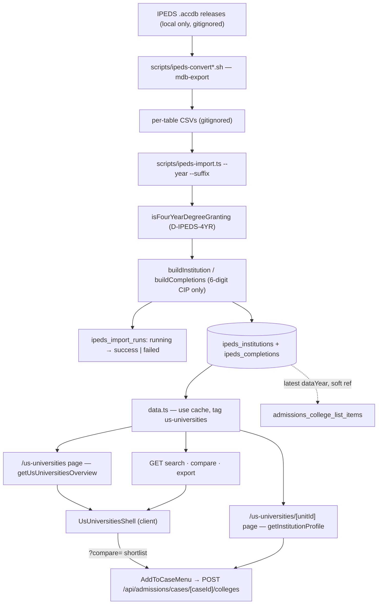

# US Universities (IPEDS)

**Status: stable**

## Purpose

US Universities is a read-only research console over a curated slice of the US federal IPEDS release. The slice is the set of institutions that clear one load-time gate — active, Title IV, four-year, degree-granting (`isFourYearDegreeGranting`, `src/lib/us-universities/constants.ts:138-154`, decision `D-IPEDS-4YR`) — with their admissions funnel, SAT/ACT bands, cost ladder, retention and graduation outcomes, student-body mix, and conferred-degree profile. The current release is IPEDS 2024-25 Provisional (`CURRENT_DATA_YEAR`, `constants.ts:6`); four historical "Final" releases (2020-21 … 2023-24) are loaded as trend rows only (`scripts/ipeds-convert-historical.sh:22-27`), which is what gives every school a multi-year admissions line.

It exists for the BeGifted college-counseling team, and it does two jobs:

1. **Research console.** Browse, filter, sort, compare up to four schools side by side, open a full-page dossier per institution, and export the current filter set as CSV.
2. **Reference source for the admissions college list.** An `Add to case` control is mounted on the browse-table rows (`src/components/us-universities/institution-table.tsx:318`), the dossier action row (`institution-dossier.tsx:407`), and the shortlist chips (`shortlist-bar.tsx:84`) — but *not* on the default card gallery (`institution-card.tsx:118-132` exposes only `Compare`) nor on the compare-panel chips. On the admissions side a college-list row **soft-references** `ipeds_institutions.unitId` (never an FK), resolves the latest `dataYear` live, and keeps a denormalized name/city/state so a future re-import can never break a case list (`src/lib/admissions/colleges.ts:9-13`, `:333-357`, `:651-680`). The Colleges tab also reuses this feature's search combobox and formatters (`src/components/admissions/colleges-tab.tsx:76-77`) and links each IPEDS-backed row out to `/us-universities/[unitId]` (`colleges-tab.tsx:553-555`). The meaning of that list lives in [University Admissions](./university-admissions.md).

Two properties define the feature's shape:

- **It is not a live integration.** IPEDS ships as a Microsoft Access database (the convert script's header calls the 2024-25 file 591 MB — `scripts/ipeds-convert.sh:5`; the `.accdb` and its CSVs are gitignored, `.gitignore:55-59`, so that figure is the author's note, not a repo artifact). The whole ingest is an offline, operator-run pipeline — `mdb-export` → per-table CSV → a `tsx` import script — and the running app only ever reads Postgres (`src/lib/db/schema.ts:3004-3005`, `src/lib/us-universities/data.ts:1-4`). There is no cron, no sync route, and no runtime dependency on the source files: neither `vercel.json` nor `src/lib/data-health/cron-registry.ts` mentions IPEDS.
- **Missing data is null, and null is never drawn as zero.** IPEDS marks unreported values with a blank or a `.`; the parser turns those into `null` (`D-IPEDS-NA`, `src/lib/us-universities/parser.ts:6-17`), and every display surface renders an em dash, drops the mark, or suppresses the section rather than implying a real `0`. The rule is a convention the components follow, not a schema constraint — see [Business rules](#business-rules--edge-cases) for the two ingest-side exceptions.

Audience: admin staff. The tool is registered as **US Universities** in the nav's *Research & Reference* section (`src/lib/navigation/tools.ts:235-241`, section label at `:82-83`). Access is the standard authenticated-admin gate, and the page/API pair (`/us-universities`, `/api/us-universities`) participates in the per-user `allowedPages` scoping — a page prefix grants both the page and its `/api` namespace (`src/middleware.ts:36-67`).

## Conceptual data model

Three tables in the `ipeds_*` family, all partitioned by a `dataYear` text column so a new IPEDS year drops in without a migration (`src/lib/db/schema.ts:3000-3005`). Column-level detail, indexes, and the ER diagram are in the [core ERD, §4 US universities — IPEDS](../reference/database/erd-core.md#4-us-universities--ipeds-3-tables); the cross-domain inventory is in the [database index](../reference/database/index.md). They were created by migration `drizzle/0046_pink_puppet_master.sql`; `drizzle/0047_high_excalibur.sql` added the per-institution cross-year index.

- **IPEDS import runs** (`ipeds_import_runs`, `schema.ts:3007`) — one row per import of one data year, reusing the shared sync-status enum. The single-running guard is **per year**: a partial unique index on `dataYear WHERE status = 'running'` (`schema.ts:3019-3021`) means the same year cannot import twice at once while different years may run side by side. It is the only bookkeeping the ingest leaves behind and the only place the app could learn how fresh the data is.
- **IPEDS institutions** (`ipeds_institutions`, `schema.ts:3024`) — the wide denormalized profile row, unique per `(dataYear, unitId)` (`schema.ts:3110`). It is assembled at import time from eleven separate IPEDS survey tables into a single row (`src/lib/us-universities/transform.ts:17-29`, `:43-149`) so every read is a single-table scan with no joins. A `raw` JSONB column keeps a compact copy of six of the source rows (`transform.ts:31-41`). Because it holds the current year *and* the historical releases, this one table is both the browse index and the trend source — hence the extra `(unitId, dataYear)` index for per-school cross-year fetches (`schema.ts:3115`). Two columns in the cost block, `pctAwardedAid` and `avgGrantAid` (`schema.ts:3099-3100`), are declared but never populated (see [Open questions](#open-questions)).
- **IPEDS completions** (`ipeds_completions`, `schema.ts:3118`) — conferred-degree counts at the grain (dataYear, unitId, 6-digit CIP code, award level), with the 2-digit CIP family denormalized onto the row. Nothing enforces that grain in Postgres: the table has three plain indexes and no unique constraint (`schema.ts:3130-3132`), so idempotency rests on the importer's delete-then-insert. This powers the "known for" top majors and the major filter. Only the current release is loaded — no historical completions (`scripts/ipeds-import.ts:209-211`).

Both data tables carry an `importRunId` back to the run that loaded them. Nothing else in the app writes these tables. One module *reads* across the boundary: the admissions college list, described above.

## API surface

Five endpoints, all `GET`, all on the admin-session tier (`auth()` with `session.user.email`), none cron-protected or public. The guard predicate, status literals, the shared `FilterQuerySchema`, response shapes, and error bodies are documented in the [US Universities API reference](../reference/api/us-universities.md) and the [API index](../reference/api/index.md) — the canonical home for endpoint mechanics.

| Endpoint | Purpose |
|---|---|
| `GET /api/us-universities` | The console's landing payload: totals, state/control facets, acceptance buckets, scatter points, major options, the cross-year acceptance trend, and the last successful import time. |
| `GET /api/us-universities/search` | Filtered, sorted, paged institution browse — the one endpoint the console polls on every filter, sort, or page change, and the one the type-ahead combobox uses. |
| `GET /api/us-universities/compare` | Side-by-side payload for up to four `unitId`s, each with its single top major and its admissions trend, returned in caller order. |
| `GET /api/us-universities/export` | The current filter set serialized as a CSV download (not JSON). |
| `GET /api/us-universities/institutions/[unitId]` | Full institution profile — the wide row plus completions, top majors, and admissions trend; `404` when the id is not in the current data year. |

Only `/search`, `/compare`, and `/export` have in-app callers. Both page routes bypass HTTP and call the cached data helpers directly on the server, so the overview and profile endpoints are reachable but unused by the UI (see [Open questions](#open-questions)).

## UI

Two routable pages under `src/app/(app)/us-universities/`, both Server Components whose async bodies re-check the session and `redirect("/login")` without one.

- **Console** — `page.tsx:8-24`. Fetches the overview server-side and renders `<UsUniversitiesShell>` inside `<Suspense>` with `UsUniversitiesSkeleton`.
- **Dossier** — `[unitId]/page.tsx:90-133`. Parses the unit id and the incoming filter/shortlist query params with pure exported helpers (`parseUnitId`, `parseFilterParams`, `parseCompareParam`, `:17-86`), fetches the profile, calls `notFound()` on a bad id or an absent institution, and computes the "Back to results" href so the console's filters *and* shortlist survive the round trip. `loading.tsx` is its Suspense fallback.

Key components (`src/components/us-universities/`):

| Component | Role |
|---|---|
| `us-universities-shell.tsx` | The console. Owns the filter state, paging, the abortable results fetch, the `?compare=` shortlist, and URL sync. Composes everything below in order: header with a type-ahead that opens a dossier, KPI hero, overview charts, a sticky results sub-header (count, card/table toggle, six-option sort select at `:41-48`, CSV download link at `:358-366`), active-filter chips, the optional supply map, the results region, the shortlist dock, and the compare sheet. |
| `kpi-hero.tsx` | Four tiles; `publicPrivateSplit` folds control codes 2 and 3 into "private" and ignores unknown codes (`:19-27`). |
| `overview-charts.tsx` | Five Chart.js cards — acceptance-band bars, cost-vs-grad-rate scatter, top-15 state bars, control doughnut, acceptance-over-time line. Bar and doughnut clicks cross-filter the browse list through `chart-filters.ts`; a scatter click opens that school's dossier (`:160-166`, `:196-202`, `:240-246`, `:303-309`). |
| `institution-card.tsx` / `institution-table.tsx` | The two results presentations behind `card-table-toggle.tsx`; cards are the default and the choice is not persisted (`card-table-toggle.tsx:9`, `us-universities-shell.tsx:133`). The table is a pure presenter that also hosts `institution-filters.tsx` and Prev/Next paging; the card is the compact gallery tile. |
| `institution-filters.tsx` / `filter-chip-tray.tsx` / `count-banner.tsx` | Filter bar (debounced text search, single-select state/control/major, four numeric bounds), removable active-filter chips derived by `describeActiveFilters`, and the live "N of total" count. |
| `institution-search-combobox.tsx` | Debounced (220 ms), abortable server-side type-ahead capped at 10 suggestions; cmdk's client filter is disabled so rows show verbatim (`:25-38`, `:115`). Also reused by the compare panel and by the admissions Colleges tab. |
| `shortlist-bar.tsx` / `compare-sheet.tsx` / `compare-panel.tsx` | Sticky bottom dock of colored chips (each with `Add to case`) → wide Base UI dialog → the side-by-side metric grid with best-value highlighting, a floating-bar combined-SAT chart, and a multi-school acceptance-trend line. The panel owns its own `/compare` fetch. |
| `institution-dossier.tsx` | The full-page profile: cover band with conditional badges (control, size, locale, Carnegie, HBCU, land-grant), four oversized headline stats, external links, `Add to shortlist`, `Add to case`, and up to seven scroll-spy sections (`dossier-section-nav.tsx`, desktop only). |
| `price-ladder.tsx` / `demographics-stacked-bar.tsx` / `us-dot-map.tsx` / `console-supply-map.tsx` | Dependency-free inline-SVG visuals: cost bars scaled to the largest present value, a demographics stack, and a continental-US **locator** dot map — a console-wide toggle over the loaded page, and a single pin (or an out-of-bounds chip) on the dossier. |
| `view-types.ts` / `compare-colors.ts` | Shared prop contracts, and the position-based color slot that keeps the dock, the sheet, and the charts on one palette. |

## Data flow

Two disconnected halves: an **offline ingest** an operator runs by hand, and a **read path** that never leaves Postgres.

**Ingest.** `scripts/ipeds-convert.sh` exports 15 named Access tables to gitignored CSVs via `mdb-export` (`:32-48`); `scripts/ipeds-convert-historical.sh` does the same for the four Final releases, resolving per-year table names by a 4-digit suffix and skipping completions and cost tables, which do not exist pre-2024-25 (`:6-7`, `:43`). `scripts/ipeds-import.ts` then runs once per `--year` (with `--suffix`, `--csv`, optional `--email`, and optional `--current-set`, `:131-138`): it refuses to start without the `HD` CSV (`:144-147`), loads the small per-institution tables into `UNITID` maps, applies the four-year gate (`:169`), optionally restricts a historical year to the institutions present in the current year (`:170-180`), builds one denormalized row per school (`:189-207`), streams the completions file keeping only bachelor's-level 6-digit detail rows (`:209-254`), marks any stale `running` run for that year as superseded, opens a new run, deletes that year's rows, bulk-inserts in chunks of 400 institutions / 2,000 completions, and closes the run as `success` — or `failed` with the error message, rethrowing (`:257-300`). `DATABASE_URL` is read from the environment or auto-loaded from `.env.local` (`:19-37`).

**Read.** Page → `"use cache"` helper in `data.ts` → Drizzle → Postgres. On the client, the shell issues one `/search` request per filter/sort/page change, cancelling the in-flight one and deferring `setState` through a `setTimeout(0)` (`us-universities-shell.tsx:141-178`). The combobox issues its own `/search?pageSize=10` request. `ComparePanel` fetches `/compare` whenever the id set changes (`compare-panel.tsx:320-351`), but it lives inside `CompareSheet`'s dialog portal, and Base UI's `DialogPortal` defaults to `keepMounted = false` (`node_modules/@base-ui/react/dialog/portal/DialogPortal.js:25`, `:34`) — so shortlist edits made while the sheet is closed issue **no** compare request; the fetch fires when the sheet opens and re-fires on id changes while it stays open. CSV export is a plain `<a href download>` to `/export` with the current query string. Opening a dossier is a `router.push` to the dossier page, which renders server-side from the same cached helpers.

## Business rules & edge cases

### What gets loaded at all (D-IPEDS-4YR)

`isFourYearDegreeGranting` is the single gate on the institution set: `ICLEVEL = 1` **and** `DEGGRANT = 1` **and** `CYACTIVE = 1` **and** `PSET4FLG = 1` (`src/lib/us-universities/constants.ts:143-154`). Two-year colleges, inactive units, and non-Title IV institutions never enter the database, so no downstream filter has to exclude them. A row that passes the gate but has a blank `INSTNM` is still loaded, under the fallback name `Institution <unitId>` (`transform.ts:71`).

### The 6-digit CIP rule (why majors are not triple-counted)

IPEDS `C2024_A` reports the *same* conferred degrees three times — at 2-digit (`11`), 4-digit (`11.07`), and 6-digit (`11.0701`) granularity. Keeping all three would triple every major count. `isSixDigitCip` accepts only the `\d{2}\.\d{4}` detail form (`parser.ts:45-53`), and the importer additionally drops the `99` grand-total family, any row that is not the student's first major (`MAJORNUM = 1`), any award level other than bachelor's (`COMPLETIONS_AWARD_LEVEL = 5`, `constants.ts:156-157`), and zero or negative counts (`scripts/ipeds-import.ts:233-242`). The 2-digit family is then **re-derived** from the detail code by `deriveCip2` — which zero-pads a one-digit head (`parser.ts:39-43`) — and denormalized onto the row, so family rollups are computed rather than trusted from the source. Human-readable CIP titles come from the release's `valueSets24` table (`ipeds-import.ts:212-217`); an unmapped CIP family label falls back to `CIP <nn>` (`constants.ts:133-136`).

### Fail-closed nulls (D-IPEDS-NA)

- **Parsing.** Blank and `.` → `null`; a valid negative is preserved because IPEDS longitude is legitimately negative (`parser.ts:6-17`). `coerceIpedsBool` maps only `1`/`2`; anything else is `null` (`parser.ts:25-31`).
- **Two ingest-side exceptions.** `degDoctoral` is the sum of three doctoral counts with each missing component treated as `0`, but only when at least one of the three is present — otherwise it is `null` (`transform.ts:62-65`, `:145`). `buildCompletions` coerces a missing `CTOTALT` to `0` (`transform.ts:174`), though the importer has already dropped non-positive counts before that point (`ipeds-import.ts:241-242`).
- **Formatting.** `formatUsd`/`formatPct`/`formatRatio`/`formatInt` return `EM_DASH` for null or non-finite input (`src/lib/us-universities/format.ts:13-39`). `formatSatRange` em-dashes when *either* bound is missing (`:42-48`); `rangeText` em-dashes only when *both* are, keeping a lone bound (`:56-61`). The stricter form is used in the compact table and card, the looser one in the dossier and compare grid.
- **Whole sections.** A dossier section whose every field is absent is suppressed rather than rendered as a grid of em dashes (`hasAnyValue`, `src/lib/us-universities/dossier-sections.ts:7-15`, applied at `institution-dossier.tsx:268-301`). The section nav only lists sections that survive.
- **Badges.** `carnegieLabel` returns `null` for an unmapped or missing Carnegie code and the caller omits the badge (`constants.ts:198-205`); control/size/locale badges are likewise conditional on a mapped code (`institution-dossier.tsx:354-369`, `institution-card.tsx:51-52`).
- **Charts.** Scatter points need *both* cost and grad rate (`overview-charts.tsx:67-92`); trend years with a null average are dropped, not plotted as `0` (`:116-132`); per-school trend lines carry `null` gaps with `spanGaps` (`src/lib/us-universities/trend-charts.ts:15-35`, `compare-panel.tsx:236-259`); the combined-SAT bar omits any school missing an endpoint and the whole chart disappears when none remain (`compare-panel.tsx:166-190`); demographic segments with a non-finite percentage are dropped, not drawn zero-width (`demographics-stacked-bar.tsx:29-41`); price bars with no value get `widthPct: null` and an em-dash label (`price-ladder.tsx:34-47`).
- **Counts and deltas.** `CountBanner` renders `EM_DASH` while loading or on a null count, so an in-flight or failed fetch can never read as "zero matches" (`count-banner.tsx:20-27`). The browse acceptance delta is `null` unless both years are present, and a change that rounds to `0.0` pp reads as flat rather than a mis-colored arrow (`institution-table.tsx:38-49`). `bestIndexForMetric` refuses to highlight a "best" column unless at least two schools have a real value (`compare-panel.tsx:36-56`).
- **Map pins.** `projectLatLng` rejects null, non-finite, and out-of-continental-bounds coordinates, so an Alaska, Hawaii, or territory school is never drawn as a misplaced pin (`src/lib/us-universities/dot-map.ts:17-22`, `:35-48`). The dossier degrades such a school to a labelled state chip, and renders no map at all when there are no coordinates (`dot-map.ts:101-117`, `institution-dossier.tsx:630-647`). The map is explicitly a *locator*, not a choropleth — no aggregation, no derived metric (`dot-map.ts:1-7`, `us-dot-map.tsx:3-8`), and a test pins the module to importing nothing but its own types (`__tests__/dot-map.test.ts:153-165`).
- **Admission requirements.** The ADMCON1–12 map is rendered as a list that skips null codes *and* code `3` ("Not considered"), so only actual requirements surface (`format.ts:74-90`).

### Two labelled fallbacks worth knowing

- The overview scatter is labelled "In-state sticker price", but a point whose sticker price is null falls back to average net price (`data.ts:238-244`).
- The dossier headline "Net price" falls back to total in-state price when average net price is null (`institution-dossier.tsx:375-378`).

Both keep more schools on screen at the cost of mixing two cost measures under one label.

### Query safety and limits

- Sort input is never used raw: `resolveSortKey` maps it against a nine-key whitelist and silently falls back to `instName` (`src/lib/us-universities/query.ts:28-33`, `constants.ts:159-176`). The table's own header whitelist has eight keys — `totalPriceInState` is server-sortable but has no column (`institution-table.tsx:52-61`).
- Page size is clamped to `MAX_PAGE_SIZE = 100` (default 50) and page floored at 1 (`query.ts:40-52`).
- CSV export is capped at `EXPORT_ROW_CAP = 5000` rows with no signal to the user that truncation happened (`data.ts:155`, `:170-176`). The CSV reuses the sales-dashboard serializer (`src/lib/us-universities/csv.ts:4`, `:37-39`).
- `MAX_COMPARE = 4` (`constants.ts:177`) is enforced independently at every entry path: the compare route truncates (`compare/route.ts:21-25`), the console shell's `parseIds` (`us-universities-shell.tsx:50-56`), the dossier page's `parseCompareParam` (`[unitId]/page.tsx:23-29`), the dossier component's own `parseIds` (`institution-dossier.tsx:162-168`), and the pure `addCompareId` (`src/lib/us-universities/compare-set.ts:12-15`) — and the UI disables `Compare`/`Add to shortlist` at capacity.
- The free-text search is a Drizzle `ilike` with `%<term>%` (`query.ts:58`). The value is a bound parameter, but `%` and `_` inside the term are not escaped and act as wildcards.
- The compare payload preserves caller order and silently drops ids the current year does not contain (`data.ts:352-361`).

### Cross-year comparability

The overview's acceptance-over-time series restricts every year to the **current-year institution cohort** via a self-subquery, so each year averages the same set of schools regardless of how historical rows were imported (`data.ts:254-276`). The importer's `--current-set` flag does the same job on the write side (`ipeds-import.ts:137-138`, `:170-180`). Per-school series are grouped and sorted lexically — the `"2020-21"`-style labels sort correctly as strings (`src/lib/us-universities/trend.ts:6-20`). The browse "Acceptance trend" column instead uses a single prior year resolved by `priorDataYearOf` (`trend.ts:22-27`) and joined per page (`data.ts:131-145`). Because historical releases lack the cost survey and completions, those blocks are skipped for pre-2024-25 years (`ipeds-import.ts:139-140`, `:163-166`, `:209-211`); historical rows carry null cost and no majors by design.

### Caching

All five data helpers are `"use cache"` with `cacheTag("us-universities")` and `cacheLife({ stale: 300, revalidate: 600, expire: 3600 })` (`data.ts:366-413`). **Nothing in `src/` calls `revalidateTag` for that tag** — the header comment defers the sweep to "a future re-import flow if added" (`data.ts:1-4`). Since the only writer is a local script, a fresh import is invisible to the running app until the cache cycles on its own.

### URL as the source of truth

Filters, sort, page, and the compare shortlist all live in the query string (the shell cites `D-04` for this, `us-universities-shell.tsx:97`). The shell seeds its state from `useSearchParams()` on mount and mirrors every change back with `router.replace`, deleting the obsolete `unitId` and `tab` params on the way (`:98-128`, `:180-201`). `dossierHref`/`consoleHref` thread both the filters and the shortlist through every console↔dossier hop (`src/lib/us-universities/nav.ts:14-28`). A stale `?unitId=` console link from the pre-dossier modal era is rewritten to the dossier route on first render (`us-universities-shell.tsx:71-79`, `:252-257`). Both client shells read `useSearchParams()` defensively because it returns `null` under `renderToStaticMarkup`; the dossier falls back to its SSR-seeded `compareIds` prop (`us-universities-shell.tsx:84-90`, `institution-dossier.tsx:176-187`).

**Edge case — fractional bounds.** The console parses numeric filter bounds with `parseFloat` (`us-universities-shell.tsx:106-109`) while the dossier page parses the same params with `Number.parseInt` (`[unitId]/page.tsx:35-39`), so a fractional bound is truncated on a console → dossier → console round trip. The app generates exactly one on its own — the top acceptance bucket's `100.01` upper bound (`data.ts:42`), which degrades harmlessly to `100` — and users can type them, because the four numeric inputs parse with `Number()` and carry no `step` (`institution-filters.tsx:43-48`).

**Edge case — single-select filters, multi-value chips.** `FilterParams` and the API accept lists of states and controls (`src/lib/us-universities/request.ts:6-10`, `:33-36`), but the filter bar only ever sets one (`institution-filters.tsx:77-80`), as do the chart cross-filters (`chart-filters.ts:15-21`). The chip tray renders one chip per value, yet each state or control chip's `clear` patch wipes the whole facet (`active-filters.ts:34-40`, `:57-63`) — only observable from a hand-built multi-value deep link.

### Shortlist, phantom ids, and colors

An id in `?compare=` that the API does not return still gets a chip, a `Not found` subtitle, and a remove control — labelled `Institution #<id>` — so a shared deep link with a stale id cannot strand the user with an unclearable shortlist (`compare-panel.tsx:388-419`, `shortlist-bar.tsx:39-55`). Compare colors are assigned by position in the ordered set and clamped to `0..4`, deliberately tolerating the mismatch between `MAX_COMPARE = 4` and the five-slot chart palette (`compare-colors.ts:1-19`).

### Add to case (cross-feature)

`AddToCaseMenu` lazily fetches the staff caseload on first open, hides itself permanently on `401`/`403`, offers only *active* cases, POSTs `{ unitId, round: "rd" }`, and maps a `409` to "Already on the list" (`src/components/admissions/add-to-case-menu.tsx:11-21`, `:55-59`, `:93-94`, `:104-105`). The admissions side rejects an unknown `unitId` as `NotFound` and dedupes per case on `unitId` (`colleges.ts:333-347`, `:377-382`).

### Import-run discipline

Before opening a run, the importer fails any stale `running` row for that year with `errorSummary: "superseded"` (`ipeds-import.ts:257-261`) — necessary because the partial unique index would otherwise reject the insert. The import is idempotent per year: it deletes that year's completions and institutions before reinserting (`:268-270`), and on any failure marks the run `failed` with the message and rethrows (`:293-300`). This happens **outside a transaction**, so a mid-import failure leaves that year deleted-and-partially-reinserted until the operator reruns.

### Payload shapes

List, compare, and export payloads strip the `raw` JSONB blob (`stripRaw`, `data.ts:45-48`). The **profile does not** — `getInstitutionProfileUncached` selects the full row and spreads it (`data.ts:305-327`; `InstitutionProfile extends IpedsInstitution`, `types.ts:49-53`), so the dossier ships the retained source records on every view. The profile carries the top eight CIP-2 families (`data.ts:318-323`) and the dossier lists at most 25 completion rows (`institution-dossier.tsx:63`, `:190-192`); the compare payload carries one top major per school (`data.ts:50-69`).

## Tests

42 Vitest files, none in the integration project — everything is pure-function or `renderToStaticMarkup` level, and nothing touches a database.

- **`src/lib/us-universities/__tests__/`** (13 files) — the ingest and query core. `parser.test.ts` covers the coercion rules including `.` → null, negative longitude, `deriveCip2` zero-padding (`"1.1001"` → `"01"`), and each `isSixDigitCip` rejection; `transform.test.ts` covers `buildInstitution`/`buildCompletions`; `query.test.ts` the sort whitelist, pagination clamps, and condition building; `trend.test.ts` trend grouping and `priorDataYearOf`; the rest cover `csv`, `format`, `dot-map` (continental-bounds rejections, chip placement, and the import-isolation assertion), `active-filters`, `chart-filters`, `compare-set`, `constants` (Carnegie labels), `dossier-sections`, and `nav` href threading.
- **`src/app/api/us-universities/__tests__/`** (5 files) — one per route, mocking `@/lib/auth` and the whole data module. They assert the `401` path everywhere, the `400` on a missing or unparseable `ids` (compare), the CSV content type and a header-only body (export), the `404` and the non-numeric-param `400` (institution), and a `500` when the data layer throws (overview). The compare route's `MAX_COMPARE` truncation is **not** exercised — `compare-route.test.ts` never sends more than two ids — so the server-side backstop is the one copy of the cap no test covers.
- **`src/app/(app)/us-universities/[unitId]/__tests__/page-params.test.ts`** — `parseUnitId`, `parseCompareParam`, `parseFilterParams`.
- **`src/components/us-universities/__tests__/`** (23 files) — pure builders (`buildSearchQuery`, `toggleSort`, `acceptanceDelta`, `applyChartFilter`, `bestIndexForMetric`, `formatRange`, `buildSatChartConfig`, `buildCompareTrendData`, all five overview-chart data builders, `ladderBars`, `demographicSegments`, `publicPrivateSplit`, `compareColorIndex`, `shortlistColor`, `resolveShortlistEntries`, `resolveActiveSection`, `supplyMapAriaLabel`, `buildSuggestQuery`, `legacyUnitIdRedirect`, `normalizeUrl`, `dossierExternalLinks`, `mergeFilter`, `parseNumericInput`) plus SSR render assertions on the shell, table, card, dossier, filters, chip tray, count banner, toggle, dot map, supply map, price ladder, demographics bar, section nav, compare sheet, and shortlist bar. The three shell/dossier SSR suites mock `next/navigation` with `useSearchParams: () => null` (`us-universities-shell.test.tsx:7`, `us-universities-shell.console.test.tsx:7`, `institution-dossier.test.tsx:6`), which is what forces the null-safe param reads in the components.

No test exercises `scripts/ipeds-import.ts` or the convert scripts end to end.

## Open questions

- **This document replaced a committed predecessor.** The brief for this pass stated that no feature doc existed, but `docs/features/us-universities.md` was already tracked (commit `241deb5`, footer dated 2026-05-31). The reference pages it and this doc link to cite `schema.ts` line ranges (`3004-3020`, `3021-3114`, `3115-3137`) that are three lines earlier than the current tree (`3007`, `3024`, `3118`) — the ERD and API reference should be regenerated against the same commit as this page.
- **Are `GET /api/us-universities` and `GET /api/us-universities/institutions/[unitId]` still needed?** Neither has an in-app caller — both pages call the data helpers directly. They are tested and maintained, but may be leftovers from the pre-dossier modal era or an intentional surface for an external consumer.
- **Should a re-import sweep the cache?** `data.ts:1-4` anticipates it, but no `revalidateTag("us-universities")` exists anywhere in `src/`. An operator who reruns the import has no way to force a refresh short of a redeploy; the wait is bounded by `expire: 3600`.
- **Which data years are actually loaded in production?** The code guarantees only the gate and a per-year `--year`/`--suffix` invocation; whether all five releases are present depends on the operator having run each import. Nothing at runtime checks, and a missing historical year silently shortens every trend rather than erroring. This pass had no database access.
- **Why is `lastImportedAt` computed but never shown?** The overview payload carries the last successful import timestamp (`data.ts:278-283`, `:296`) and no component renders it, so staff cannot see how old the slice is. Every other sync-backed feature surfaces freshness.
- **Dead columns and unread exports.** `pctAwardedAid`/`avgGrantAid` exist in the schema (`schema.ts:3099-3100`) and `scripts/ipeds-convert.sh:44` exports `Cost2_2024_FinancialAid`, but `buildInstitution` never reads that table (`transform.ts:17-29` has no slot for it). Both convert scripts also export the `IC` tables (`ipeds-convert.sh:34`, `ipeds-convert-historical.sh:43`) that the importer never opens. Wire them in, or drop the columns and the exports?
- **Is `isSixDigitCip` too strict for unpadded CIP codes?** It requires exactly `\d{2}\.\d{4}` (`parser.ts:52`), yet `deriveCip2` explicitly handles a one-digit head and is tested with `"1.1001"` (`__tests__/parser.test.ts:41`). If any release's `mdb-export` emits CIP codes without the leading zero, every CIP-01 (Agriculture) completion is silently dropped. Which shape does the real export have?
- **Who owns the annual refresh, and should it stay manual and non-transactional?** There is no admin route, no cron, and no runbook — only two shell scripts and a `tsx` command in a header comment (`ipeds-import.ts:10-12`). A failure mid-run leaves the year partially loaded.
- **Should the profile payload keep shipping `raw`?** Every other payload strips it (`data.ts:45-48`) but the dossier response includes the retained source records (`data.ts:305-327`), and nothing reads them client-side.
- **Is a silent 5,000-row export cap acceptable?** `getInstitutionsForExport` truncates with no header, warning, or comparison against the filtered total (`data.ts:155`, `:170-176`), so an unfiltered export looks complete but is not.
- **Are the two cost fallbacks intentional?** The scatter's "In-state sticker price" axis substitutes net price when sticker is null (`data.ts:241`), and the dossier's "Net price" headline substitutes sticker when net price is null (`institution-dossier.tsx:377`). Each keeps more schools visible but mixes measures under one label.
- **Single-select filters by design?** The API and `FilterParams` accept lists of states and controls, but every UI entry point sets exactly one (`institution-filters.tsx:77-80`, `chart-filters.ts:15-21`). If multi-select is a future intent, the chip `clear` patches should clear one value rather than the facet.

_Verified against main@0cd1e81 (clean tree) on 2026-09-02._
