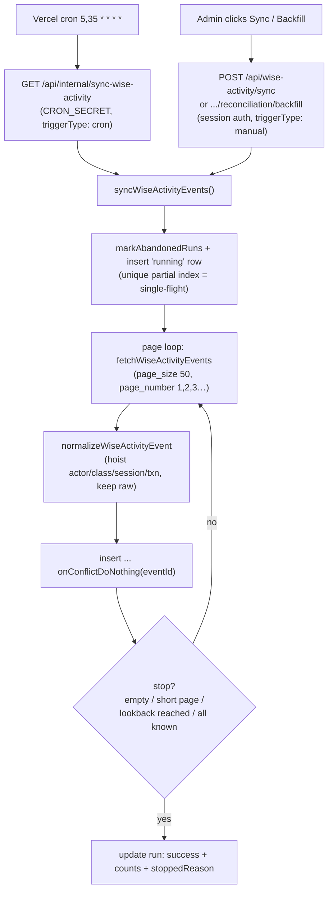
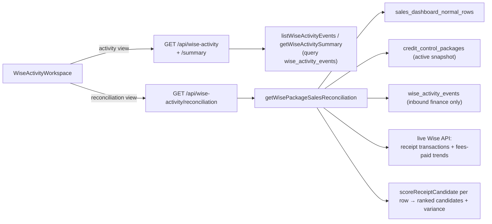

# Wise Activity Audit

**Status: stable**

## Purpose

The Wise Activity Audit is a read-only audit log of operational and financial events that occurred inside the Wise platform (`begifted-education` tenant), plus a package-sales reconciliation workbench that cross-checks the Sales Dashboard sheet against Wise's own money records.

It answers two distinct questions for admin/finance staff:

1. **"What happened in Wise, and who did it?"** — a filterable timeline of session mutations (created/updated/cancelled/deleted), billing/invoice/payout events, user and classroom changes, etc., with full raw payloads for forensic inspection.
2. **"Does our Sales Dashboard match what Wise actually charged?"** — a reconciliation view that scores Wise receipt transactions as candidate evidence for each package-sale row and surfaces a sheet-vs-Wise revenue variance.

Crucially, this feature is **separate from and independent of the snapshot sync** that powers tutor search. It never writes back to Wise and never participates in snapshot promotion. It maintains its own append-only event store (`wise_activity_events`) and its own sync-run ledger (`wise_activity_sync_runs`). The reconciliation surface is explicitly review-only: it produces ranked candidates and variance figures but never auto-marks a sale as "matched" (verified by `src/components/wise-activity/__tests__/reconciliation-ui.test.ts:37`–`:38`, which assert the workspace source contains no "Mark as matched"/"Save match" controls).

Users: the allowlisted admin staff. The page is reached through the "Wise Audit" nav link (`src/components/layout/app-nav.tsx:31`) and requires a signed-in session (`src/app/(app)/wise-activity/page.tsx:8`); the whole app sits behind the admin allowlist enforced in middleware/auth.

## Conceptual data model

This feature owns two tables and **reads** from several others belonging to neighbouring features.

Owned (read + write):

- **`wise_activity_events`** — the append-only audit store. Each row is one normalized Wise event keyed by Wise's `eventId` (unique), with extracted actor, classroom, session, and transaction fields hoisted out of the raw payload for fast filtering, plus the original `payload` and `raw` JSON retained verbatim for the detail drawer. Written by the sync (`src/lib/wise-activity/sync.ts:209`), read by the list/summary queries and the reconciliation builder.
- **`wise_activity_sync_runs`** — the sync ledger: one row per sync attempt (cron or manual) with status, trigger type, page/event/insert counts, oldest/newest event timestamps, a `stoppedReason` in `metadata`, and an error summary. A partial unique index guarantees at most one `running` row at a time (the single-flight guard).

Read-only (owned by other features, consulted only during reconciliation in `src/lib/wise-activity/reconciliation.ts`):

- **`sales_dashboard_sources`** and **`sales_dashboard_normal_rows`** — the package-sale rows to reconcile, selected by source/month.
- **`credit_control_snapshots`** and **`credit_control_packages`** — the active Credit Control snapshot's packages, used to map a sale to its Wise student/class IDs for candidate scoring.

The canonical home for exact columns, types, indexes, and constraints of the two owned tables is the Drizzle schema itself — `wise_activity_events` at `src/lib/db/schema.ts:190`–`223` and `wise_activity_sync_runs` at `:225`–`243`. Both tables are also documented in the ERD reference at [docs/reference/database/erd-core.md](../reference/database/erd-core.md).

Note: Wise receipt transactions and Wise "fees paid" monthly trends are **not** persisted by this feature — they are fetched live from the Wise API on each reconciliation request (`src/lib/wise-activity/reconciliation.ts:736`, `:763`) and never stored.

## API surface

The five user-facing endpoints live under `src/app/api/wise-activity/` (`route.ts`, `summary/route.ts`, `sync/route.ts`, `reconciliation/route.ts`, `reconciliation/backfill/route.ts`) and require an authenticated session; the sixth, the cron ingest endpoint, lives separately under `src/app/api/internal/` (`sync-wise-activity/route.ts`) and is protected by `CRON_SECRET` instead. Full request/response contracts are documented in the API reference at [docs/reference/api/wise-activity.md](../reference/api/wise-activity.md).

- `GET /api/wise-activity` — paginated, filterable list of persisted events (date range, type, action, free-text, session/transaction ID, finance-only).
- `GET /api/wise-activity/summary` — KPI cards and chart aggregates (activity-by-day, session-mutation breakdown, finance trend, top actors/classrooms) over the same filter set.
- `POST /api/wise-activity/sync` — manual admin backfill of the event store (default 30-day / 500-page cap).
- `GET /api/wise-activity/reconciliation` — package-sales reconciliation for a chosen Sales Dashboard source: scored Wise-receipt candidates per sale row, coverage status, and revenue variance.
- `POST /api/wise-activity/reconciliation/backfill` — backfills the event store for exactly the reconciliation date range before trusting its results.
- `GET /api/internal/sync-wise-activity` — the cron ingest entry point (3-day / 20-page cap), registered at `5,35 * * * *` in `vercel.json`.

## UI

Single page, single workspace component:

- **Page**: `src/app/(app)/wise-activity/page.tsx` — server component that gates on session email (redirects to `/login` if absent) and renders the client workspace inside a `Suspense` boundary.
- **Workspace**: `src/components/wise-activity/wise-activity-workspace.tsx` — a `"use client"` component holding all state and data fetching. It has two views, held in a `view` state (`src/components/wise-activity/wise-activity-workspace.tsx:525`) and toggled by an Activity/Reconciliation button pair in the header (`:743`–`:752`):
  - **Activity** view — four KPI cards (total events, session mutations, finance events, last-sync status); a filter bar (start/end date, type select, action select, free-text search, Finance toggle, clear button); three Chart.js charts (stacked activity-by-day, horizontal session-mutation bars, finance-trend line); and a paginated, sticky-header activity log table. Each row opens a right-side drawer showing structured fields plus the raw `payload` and `raw` JSON (`:956`).
  - **Reconciliation** view (`ReconciliationPanel`, `:435`) — a Sales Dashboard source selector, a coverage banner, KPI cards, a `RevenueVarianceTable` (sheet vs Wise fees-paid trend vs Wise receipts), and per-student expandable groups of sale rows. Each sale row lists scored receipt candidates with confidence badges and expandable raw receipt details. A "Backfill selected range" button triggers the reconciliation backfill endpoint.
  - **Sync** button — runs the manual `POST /api/wise-activity/sync` (`:691`).

Display helpers (labels, Bangkok timestamp/amount formatting, finance/session-mutation classification) live in `src/lib/wise-activity/format.ts` and are shared between the workspace and the data layer.

## Data flow

There are three independent flows: cron ingest, manual ingest, and read/reconcile.

**Ingest (cron or manual)** — page-ordered pagination into the append-only store (the stop conditions assume Wise returns events newest-first; see Business rules):

**Read / reconcile** — UI fetches against the persisted store and (for reconciliation) live Wise money endpoints:

The Activity view fires the summary and list requests in parallel with an `AbortController` to cancel superseded loads (`src/components/wise-activity/wise-activity-workspace.tsx:544`).

## Business rules & edge cases

- **Single-flight ingest.** A partial unique index on `status = 'running'` (`src/lib/db/schema.ts:239`) means a second concurrent sync's insert fails with Postgres `23505`; `syncWiseActivityEvents` catches that and throws `WiseActivitySyncAlreadyRunningError` (`src/lib/wise-activity/sync.ts:45`, `:166`), which routes return as HTTP 409.
- **Abandoned-run recovery.** Before starting, any `running` row older than 20 minutes is force-failed (`src/lib/wise-activity/sync.ts:117`, `STALE_RUNNING_MS` `:13`) so a crashed sync cannot wedge the guard forever.
- **Page-ordered ingest with four stop conditions.** The page loop fetches `page_number` 1, 2, 3, … with no sort parameter (`src/lib/wise-activity/sync.ts:178`–`:182`; `fetchWiseActivityEvents` sends no `sort`, `src/lib/wise/fetchers.ts:236`–`:243`) and stops on: an empty page, a short (<50) page, the lookback cutoff reached (`oldestEventTimestamp <= cutoff`, `:222`), or a full page where every `eventId` is already persisted (`hitKnownPage`, `:207`, `:218`–`:229`). The lookback and known-events stop conditions are only correct if the Wise `/institutes/{id}/events` endpoint returns events **newest-first** — an assumption about the external API that cannot be proven from this repo's code (it is consistent with AGENTS.md's note that the endpoint's date params are ignored, but the ordering itself is unverified here). Cron uses a 3-day / 20-page cap; manual uses 30-day / 500-page (`:9`–`:12`, `:147`–`:148`). Each stop reason is recorded in run metadata.
- **Idempotent dedupe.** Inserts use `onConflictDoNothing` on the unique `eventId` (`src/lib/wise-activity/sync.ts:213`), so re-fetching overlapping pages never duplicates rows; `insertedCount` reflects only genuinely new rows.
- **Wise `eventTimestamp` date params are not trusted.** The fetcher (`fetchWiseActivityEvents`, `src/lib/wise/fetchers.ts:231`) accepts optional `type`/`eventName`/`userId`/`classIds` filters (`WiseActivityEventsParams`, `:222`–`:229`) but **never** a date filter; the sync's call site (`src/lib/wise-activity/sync.ts:179`–`:182`) passes only `pageNumber`/`pageSize`. The live endpoint appears to ignore date params, so the sync enforces the lookback window client-side via the `oldestEventTimestamp <= cutoff` check instead.
- **Fail-soft normalization.** `normalizeWiseActivityEvent` returns `null` when an event lacks an `eventId` or a parseable `eventTimestamp` (`src/lib/wise-activity/sync.ts:90`); such rows are filtered out rather than aborting the page. Missing `eventType`/`eventName` default to `"unknown"`/`"UnknownEvent"` (`:94`–`:95`). Actor/class IDs fall back from the top-level `user`/`classroom` objects to nested `payload.user`/`payload.class` (`:97`–`:100`).
- **Finance classification is substring-aware but payout-excluding.** `isWiseFinanceEvent` treats an event as finance if it is `BILLING`, has any `transactionId`, or its name matches `/invoice|payment|payout|transaction/i` (`src/lib/wise-activity/format.ts:57`). Reconciliation uses a stricter **inbound** variant, `isInboundWiseInvoiceEvent`, that additionally **excludes** anything matching `/payout/i` (`src/lib/wise-activity/reconciliation.ts:291`) so tutor payouts never count as sales revenue. A regression test guards that "SessionFeedbackSubmittedEvent" is not misclassified as finance just because it contains the substring "fee" (`src/lib/wise-activity/__tests__/reconciliation.test.ts:265`).
- **Reconciliation is review-only and never auto-matches.** `scoreReceiptCandidate` produces an additive score (exact transaction-number-on-receipt +100; mapped class ID +50; mapped student ID +50; amount match +30; same-day +20 / within-3-days +10; text overlap +15) and drops anything under 20 (`src/lib/wise-activity/reconciliation.ts:363`, threshold `:410`). Candidates are bucketed `high` (≥80) / `medium` (≥45) / `low` and capped at 5 per row (`:430`, `MAX_CANDIDATES_PER_ROW` `:16`). Rows are never stamped "matched" — the UI test asserts the absence of "Mark as matched" (`src/components/wise-activity/__tests__/reconciliation-ui.test.ts:37`) and "Save match" (`:38`).
- **Coverage gate before trusting "no candidate" rows.** `buildCoverage` reports `complete`/`partial`/`empty` based on whether persisted **inbound** events span the requested date range (`src/lib/wise-activity/reconciliation.ts:437`). When not complete, the message and UI banner warn the user to backfill before trusting missing-candidate rows — i.e. an absent candidate may just mean the event store hasn't been backfilled yet, not that the sale is unrecorded.
- **Live Wise money sources degrade gracefully.** Both the fees-paid trend and receipt fetches are wrapped so that missing `WISE_USER_ID`/`WISE_API_KEY` or an API error yields an `unavailable` reason rather than throwing (`src/lib/wise-activity/reconciliation.ts:725`, `:752`). Revenue variance then reports `wiseRevenueAvailable: false` / `wiseReceiptsAvailable: false` with the reason, and the system explicitly does **not** fall back to summing persisted activity events for revenue (test: `reconciliation.test.ts:223`).
- **Revenue figures are derived, not stored.** Sheet total comes from the sale rows; "Wise revenue" comes from the fees-paid **monthly** trend row matched by Bangkok month (`src/lib/wise-activity/reconciliation.ts:507`); receipt total sums only revenue receipts — `PAYMENT`/`OFFLINE_PAYMENT` + `CHARGED` + positive amount (`isReceiptRevenue`, `:487`) — with all other receipt rows counted as "skipped".
- **Backfill window is computed from the start date.** `wiseReconciliationBackfillLookbackDays` converts the reconciliation start date into a Bangkok-day lookback, clamped to 1–365 days (`src/lib/wise-activity/reconciliation.ts:882`), so the backfill ingests exactly enough history to cover the range.
- **All dates are Asia/Bangkok.** Date keys, range boundaries, and display formatting go through the shared Bangkok helpers (`src/lib/room-capacity/dates.ts`, `src/lib/wise-activity/format.ts:1`); list/summary queries convert a `YYYY-MM-DD` range into a UTC instant window via `wiseActivityBangkokRange` (`src/lib/wise-activity/data.ts:240`).

## Tests

- `src/lib/wise-activity/__tests__/sync.test.ts` — payload normalization into persisted fields (`:104`); dedupe of known event IDs while persisting a successful run (`:129`); the `known_events` full-page stop condition (`:168`). Note this file mocks `@/lib/wise/fetchers` wholesale (`:5`–`:7`) and only asserts the sync *invokes* the fetcher with `{ pageNumber: 1, pageSize: 50 }` (`:148`–`:151`); it does not exercise the fetcher's actual page-size clamp.
- `src/lib/wise/__tests__/fetchers.test.ts` — the Wise-contract test that exercises the fetcher's page-size cap: calling `fetchWiseActivityEvents` with `pageSize: 100` and asserting the outgoing `page_size` is clamped to `'50'` (`:304`–`:317`), matching the `Math.max(1, Math.min(pageSize ?? 50, 50))` clamp at `src/lib/wise/fetchers.ts:238`.
- `src/lib/wise-activity/__tests__/reconciliation.test.ts` — read-only candidate scoring from exact receipt metadata; revenue variance from monthly fees-paid trend; Bangkok month → trend-row mapping; revenue/receipts unavailable paths (no fallback to events); THB minor→major amount handling; the "fee" substring guard; amount/date-proximity supporting evidence; sub-threshold rows left candidate-only; coverage complete vs partial; backfill lookback-day computation.
- `src/lib/wise-activity/__tests__/format.test.ts` — event/type label generation, finance and session-mutation classification, Bangkok timestamp and currency formatting.
- `src/app/api/wise-activity/__tests__/route.test.ts` — auth gating, filter/pagination plumbing, date-range validation (400), manual-sync option pass-through wiring (`:143`–`:161` passes in-range `{ lookbackDays: 45, maxPages: 700 }` and asserts the sync is called with exactly those values — it verifies the options reach the sync, not that out-of-range values are clamped; the clamp itself, `numberOption` at `src/app/api/wise-activity/sync/route.ts:11`–`:14`/`:37`–`:38`, is not exercised with an out-of-range input), reconciliation query plumbing, backfill lookback wiring, and the 409 already-running conflict for backfill.
- `src/components/wise-activity/__tests__/reconciliation-ui.test.ts` — asserts the reconciliation surface renders (coverage, revenue variance, receipt columns) and stays read-only (no match-saving controls). This is a source-text assertion against the workspace file rather than a rendered-DOM test.

## Open questions

- The list/summary endpoints accept `sessionId` and `transactionId` filters server-side (`src/lib/wise-activity/data.ts:106`–`:107`) and the route forwards them, but the Activity-view UI exposes no input for them — they are reachable only by hand-editing the URL. Intentional power-user affordance, or unfinished UI?
- The page itself only checks for a session email; AGENTS.md calls this page "admin-only". Confirm whether admin-vs-any-signed-in-user distinction is meant to be enforced here beyond the app-wide allowlist, or whether the allowlist is the sole gate by design.
- The `getWiseActivitySummary` aggregate loads all matching rows into memory to compute counts (`src/lib/wise-activity/data.ts:169`) with no row cap. Fine for the default 7-day window, but is there a guardrail intended for very wide date ranges on a large event store?
- The `participant` field exists on the `WiseActivityEvent` type (`src/lib/wise/types.ts:136`) but normalization never reads it. Is participant/student attribution a planned extraction, or dead surface area in the type?
- **Newest-first event ordering is assumed, not proven.** The ingest's `lookback_reached` and `known_events` stop conditions depend on Wise's `/institutes/{id}/events` endpoint returning events newest-first, but the sync sends no sort parameter and the ordering is a property of the external Wise API that cannot be verified from this repo. Confirm against live Wise behavior (and/or document it in the API reference) that the endpoint is reliably newest-first; if it is not, the lookback/known-events early-exits could terminate ingest prematurely.

_Verified against HEAD + uncommitted WIP on 2026-05-31._
