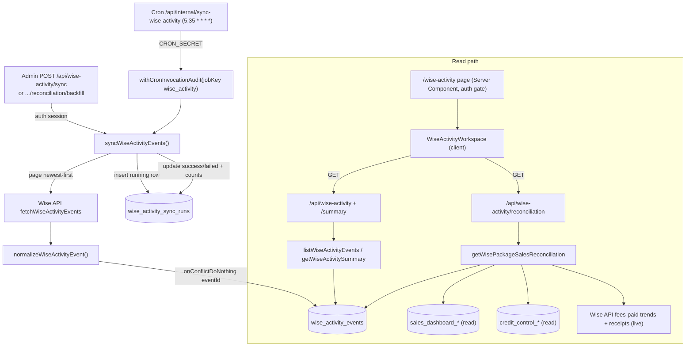

# Wise Activity Audit

**Status: stable**

## Purpose

Wise Activity Audit is a **read-only audit log** of operational and financial events emitted by the Wise platform, plus a **package-sales reconciliation** workbench that cross-checks the Sales Dashboard's recorded sales against money Wise actually saw. Admin/finance staff use the `/wise-activity` page (nav label "Wise Audit") to answer questions Wise's own UI makes tedious: who changed/created/cancelled a session and when, what billing/payment/payout events landed in a window, and — in reconciliation mode — which monthly package-sale rows have a matching Wise receipt versus which need a human to look.

The feature is deliberately **independent of the tutor snapshot sync**. It maintains its own append-only event store and its own sync-run ledger, it never participates in snapshot promotion or the in-memory search index, and it never writes back to Wise. Both backing tables survive snapshot rotation (they are snapshot-independent), so the audit history is continuous across tutor-data refreshes. The page header reads "Wise Audit" with the subtitle "Ops and finance activity from persisted Wise logs" ([`wise-activity-workspace.tsx:739-740`](../../src/components/wise-activity/wise-activity-workspace.tsx)).

## Conceptual data model

Two tables are **owned** by this feature, both snapshot-independent (they are not keyed by `snapshot_id` and persist across tutor-snapshot rotation):

- **`wise_activity_events`** — the append-only audit store. One row per Wise event, keyed by Wise's `eventId` (a unique index makes ingestion idempotent). Each row denormalizes the fields the UI filters and displays — event type/name, timestamp, actor, classroom, session, and transaction columns — and keeps the full `payload` and `raw` JSON for the detail drawer. Written only by the sync pipeline; read by the list/summary endpoints and by reconciliation.
- **`wise_activity_sync_runs`** — the sync-run ledger. One row per ingest attempt with `status` (`running`/`success`/`failed`), trigger type, page/event/insert counts, the oldest/newest event timestamps seen, and a JSON `metadata` blob (lookback, page cap, stop reason). A **partial unique index** over the single `running` row enforces single-flight (a second concurrent insert raises a unique violation).

Reconciliation additionally **reads** (never writes) four tables owned by other features: the Sales Dashboard's `sales_dashboard_sources` and `sales_dashboard_normal_rows` (the recorded package sales), and Credit Control's `credit_control_snapshots` + `credit_control_packages` (the active student↔Wise-ID mapping used as matching evidence). It also pulls live data directly from the Wise API (fees-paid trends and receipt transactions) that is not persisted anywhere.

Column-level detail (types, indexes, exact line numbers) lives in the canonical ER reference — see **[`reference/database/erd-core.md`](../reference/database/erd-core.md)** for `wiseActivityEvents` and `wiseActivitySyncRuns`. The Sales Dashboard and Credit Control tables read during reconciliation are documented in [`reference/database/erd-sales-dashboard.md`](../reference/database/erd-sales-dashboard.md) and [`reference/database/erd-credit-control.md`](../reference/database/erd-credit-control.md).

## API surface

Six endpoints. Five are admin-session (Auth.js); one is the cron-secret ingest route. Full request/response contracts live in the canonical reference — see **[`reference/api/wise-activity.md`](../reference/api/wise-activity.md)** (and **[`reference/crons.md` §4](../reference/crons.md)** for the cron's scheduling mechanics).

| Method + path | One-line purpose |
|---|---|
| `GET /api/wise-activity/summary` | KPI cards, per-day activity, finance trend, and top-actor/classroom aggregates over a Bangkok date window. |
| `GET /api/wise-activity` | Paginated event list for the activity-log table, same filter set as summary. |
| `GET /api/wise-activity/reconciliation` | Package-sale rows for a Sales Dashboard source with ranked Wise-receipt candidates, coverage status, and revenue variance. |
| `POST /api/wise-activity/sync` | Admin-triggered manual ingest (30-day / 500-page bounds). |
| `POST /api/wise-activity/reconciliation/backfill` | Manual ingest sized to cover a specific reconciliation date range. |
| `GET /api/internal/sync-wise-activity` | Cron ingest (`CRON_SECRET`), 30-min cadence, 3-day / 20-page bounds. |

## UI

Single page: **`src/app/(app)/wise-activity/page.tsx`** — an async Server Component that gates on `auth()` (redirect to `/login` if no session email) and renders the client workspace inside `<Suspense>` ([`page.tsx:6-21`](../../src/app/(app)/wise-activity/page.tsx)).

All interactivity lives in **`src/components/wise-activity/wise-activity-workspace.tsx`** (`"use client"`), a single large component with two modes toggled by a header segmented control:

- **Activity mode** — four KPI cards (total events, session mutations, finance events, last sync status); a filter bar (date range, type, action, free-text search, Finance-only toggle, clear); three Chart.js charts (`ChartCanvas`) for activity-by-day (stacked bars by event type), session mutations (horizontal bar), and finance trend (line); and a paginated **Activity Log** table sorted newest-first. Clicking the eye icon opens a right-side detail drawer with a field grid plus pretty-printed `payload` and `raw` JSON (`JsonBlock`).
- **Reconciliation mode** (`ReconciliationPanel`) — a Sales Dashboard source picker, Reload + "Backfill selected range" buttons, a coverage banner, four KPI cards, a `RevenueVarianceTable` (sheet vs Wise fees-paid trend vs receipts), and collapsible per-student groups (`StudentReconciliationGroup` → `SaleRowReview` → `CandidateList`) where each `
` defaults open only when the row/group has review flags.

Data fetching is plain `fetch` with `AbortController` cancellation; charts and label formatting come from `src/lib/wise-activity/format.ts` (`wiseActivityEventLabel`, `wiseActivityTypeLabel`, `formatBangkokDateTime`, `formatWiseAmount`, `isWiseFinanceEvent`).

## Data flow

**Ingest (write path):** the Vercel cron (or a manual admin POST) calls `syncWiseActivityEvents`, which pages newest-first through `fetchWiseActivityEvents`, normalizes each Wise event to an audit row, and bulk-inserts with `onConflictDoNothing` on `eventId`.

**Read path:** the page authenticates, mounts the client workspace, and the workspace issues parallel `GET`s. List/summary go through `src/lib/wise-activity/data.ts`, which builds a shared `WHERE` clause (`buildConditions`) over `wise_activity_events.eventTimestamp` and the filters, then either paginates (`listWiseActivityEvents`) or loads all matching rows and aggregates them in memory (`getWiseActivitySummary`). Reconciliation goes through `src/lib/wise-activity/reconciliation.ts`, which assembles persisted sale rows + persisted inbound Wise events + live Wise receipts/trends + the active Credit Control packages, then scores receipt candidates per row.

## Business rules & edge cases

- **Read-only, no Wise writeback.** Nothing in this feature mutates Wise. The reconciliation UI is explicitly review-only — there is no "mark as matched" / "save match" affordance, and a test asserts those strings are absent ([`reconciliation-ui.test.ts:32-39`](../../src/components/wise-activity/__tests__/reconciliation-ui.test.ts)). Candidates are surfaced for a human to judge; the system never auto-records a match.

- **Idempotent ingest; malformed rows are dropped, not rejected.** Events with no `eventId` or no parseable `eventTimestamp` normalize to `null` and are skipped ([`sync.ts:90`](../../src/lib/wise-activity/sync.ts)); everything else gets `eventType`/`eventName` defaults of `"unknown"`/`"UnknownEvent"` rather than being lost ([`sync.ts:94-95`](../../src/lib/wise-activity/sync.ts)). Inserts use `onConflictDoNothing` on `eventId`, so re-fetching overlapping pages is safe ([`sync.ts:209-216`](../../src/lib/wise-activity/sync.ts)).

- **Newest-first paging with five stop conditions.** The sync loop stops on the first of: an empty page (`empty_page`), a short final page (`short_page`, `events.length < PAGE_SIZE`), reaching the lookback cutoff via `oldestEventTimestamp <= cutoff` (`lookback_reached`), a full page where every `eventId` already exists in the DB (`known_events`), or hitting `maxPages` (`max_pages`) ([`sync.ts:178-230`](../../src/lib/wise-activity/sync.ts)). The `known_events` short-circuit (`hitKnownPage`) is what keeps the routine cheap on the 30-minute cadence ([`sync.ts:201-207`](../../src/lib/wise-activity/sync.ts)).

- **Cron vs manual bounds diverge.** Cron runs default to 3-day lookback / 20 pages; manual runs default to 30-day / 500 pages ([`sync.ts:9-12`](../../src/lib/wise-activity/sync.ts), [`sync.ts:147-148`](../../src/lib/wise-activity/sync.ts)). `PAGE_SIZE` is fixed at 50 ([`sync.ts:8`](../../src/lib/wise-activity/sync.ts)). The manual API route clamps `lookbackDays` to `[1,365]` and `maxPages` to `[1,1000]` ([`sync/route.ts:37-39`](../../src/app/api/wise-activity/sync/route.ts)).

- **Single-flight + stale-run reaping.** A partial unique index over the `running` sync-run row means a concurrent insert raises Postgres `23505`, detected by `isUniqueViolation` and surfaced as `WiseActivitySyncAlreadyRunningError` → HTTP 409 ([`sync.ts:45-54`](../../src/lib/wise-activity/sync.ts), [`sync.ts:165-167`](../../src/lib/wise-activity/sync.ts); route at [`sync/route.ts:43-45`](../../src/app/api/wise-activity/sync/route.ts)). Before each run, `markAbandonedRuns` flips any `running` row older than `STALE_RUNNING_MS` (20 min) to `failed` so a crashed run cannot wedge the guard forever ([`sync.ts:13`](../../src/lib/wise-activity/sync.ts), [`sync.ts:117-129`](../../src/lib/wise-activity/sync.ts), [`sync.ts:151`](../../src/lib/wise-activity/sync.ts)).

- **Cron route is audited; manual routes are not.** Only the cron entry wraps the sync in `withCronInvocationAudit({ jobKey: "wise_activity", ... })` ([`sync-wise-activity/route.ts:16-17`](../../src/app/api/internal/sync-wise-activity/route.ts)); the admin manual routes do not. Cron auth is the shared constant-time `rejectInvalidCronSecret` ([`sync-wise-activity/route.ts:13`](../../src/app/api/internal/sync-wise-activity/route.ts)).

- **Bangkok date semantics.** Read endpoints default to the last 7 Bangkok days and validate `^\d{4}-\d{2}-\d{2}$` with `startDate <= endDate` ([`route.ts:28-34`](../../src/app/api/wise-activity/route.ts)). `wiseActivityBangkokRange` converts the inclusive date pair to a UTC instant window `[bangkokDateStartUtc(start), bangkokDateStartUtc(end+1day) − 1ms]` ([`data.ts:240-245`](../../src/lib/wise-activity/data.ts)). All display formatting is `Asia/Bangkok` ([`format.ts:1`](../../src/lib/wise-activity/format.ts)).

- **Finance/mutation classification is name-pattern based.** `isWiseFinanceEvent` treats a row as finance if `eventType === "BILLING"`, a `transactionId` is present, or the name matches `/invoice|payment|payout|transaction/i` ([`format.ts:57-66`](../../src/lib/wise-activity/format.ts)). Session mutations are an explicit 4-name set (`SessionCreated/Updated/Cancelled/Deleted`) — `SessionFeedbackSubmittedEvent` is deliberately excluded ([`format.ts:3-8`](../../src/lib/wise-activity/format.ts), [`format.ts:68-70`](../../src/lib/wise-activity/format.ts)). Note the summary's `financeOnly` SQL filter includes `%payout%` while reconciliation's inbound filter excludes it — see below.

- **Reconciliation: "inbound" excludes payouts.** Revenue/coverage logic only counts money *coming in*. `isInboundWiseInvoiceEvent` returns false for any `/payout/i` name and otherwise matches BILLING / transactionId / `/invoice|payment|transaction/i` ([`reconciliation.ts:291-301`](../../src/lib/wise-activity/reconciliation.ts)); the DB query mirrors this with an explicit `NOT ILIKE '%payout%'` ([`reconciliation.ts:836`](../../src/lib/wise-activity/reconciliation.ts)). A regression test guards that `SessionFeedbackSubmittedEvent` is not miscounted as finance despite containing "fee" ([`reconciliation.test.ts:265-290`](../../src/lib/wise-activity/__tests__/reconciliation.test.ts)).

- **Reconciliation: additive candidate scoring, never auto-match.** `scoreReceiptCandidate` adds points for the exact transaction number appearing on a receipt (+100), Wise class-ID match to the Credit Control package (+50), Wise student-ID match (+50), exact amount (+30), same/near payment date (+20 / +10), and overlapping text (+15); candidates below score 20 are dropped, and confidence is `high ≥80 / medium ≥45 / low` otherwise ([`reconciliation.ts:363-435`](../../src/lib/wise-activity/reconciliation.ts)). Up to `MAX_CANDIDATES_PER_ROW = 5` are kept per row ([`reconciliation.ts:16`](../../src/lib/wise-activity/reconciliation.ts), [`reconciliation.ts:586`](../../src/lib/wise-activity/reconciliation.ts)).

- **Reconciliation: coverage warning gates trust.** `buildCoverage` reports `complete`/`partial`/`empty` based on whether *persisted inbound* events span the requested range; when not complete it returns a "backfill before trusting missing-candidate rows" message and the UI shows a `ShieldAlert` banner ([`reconciliation.ts:437-462`](../../src/lib/wise-activity/reconciliation.ts); UI at [`wise-activity-workspace.tsx:485-493`](../../src/components/wise-activity/wise-activity-workspace.tsx)). This is the explicit fail-honest stance: a row with no candidate is *not* asserted as "missing from Wise" unless coverage proves the data was there to match against. The backfill button sizes the manual sync via `wiseReconciliationBackfillLookbackDays` (days from `startDate` to today, clamped `[1,365]`) ([`reconciliation.ts:882-888`](../../src/lib/wise-activity/reconciliation.ts)).

- **Reconciliation: live-Wise degrades, never fails the request.** Revenue variance pulls `fetchWiseFeesPaidTrends` and `fetchWiseReceiptTransactions` live. If `WISE_USER_ID`/`WISE_API_KEY` are unset or a Wise call throws, the corresponding block returns an `error` string and `*Available: false` flags rather than 500-ing ([`reconciliation.ts:725-778`](../../src/lib/wise-activity/reconciliation.ts)). Crucially, when the official fees-paid trend is unavailable the code does **not** fall back to summing persisted activity events — `wiseRevenueTotal` stays `null` ([`reconciliation.test.ts:223-239`](../../src/lib/wise-activity/__tests__/reconciliation.test.ts)). Only `PAYMENT`/`OFFLINE_PAYMENT` receipts with status `CHARGED` and positive amount count as revenue; everything else (disbursal, refund, pending, rejected, zero) is skipped and reported as `wiseReceiptSkippedCount` ([`reconciliation.ts:487-494`](../../src/lib/wise-activity/reconciliation.ts), [`reconciliation.test.ts:333-356`](../../src/lib/wise-activity/__tests__/reconciliation.test.ts)).

- **Reconciliation source selection.** Sources resolve by `sourceId` → `month` → "most recent with a successful import" fallback ([`reconciliation.ts:716-723`](../../src/lib/wise-activity/reconciliation.ts)). A selected source with no successful package-sales import throws "Selected Sales Dashboard source has no successful package-sales import" (→ 500) ([`reconciliation.ts:802-804`](../../src/lib/wise-activity/reconciliation.ts)); no sources at all returns an empty reconciliation rather than erroring ([`reconciliation.ts:791-801`](../../src/lib/wise-activity/reconciliation.ts)). The reconciliation date-range rule differs from the read endpoints: **both or neither** of `startDate`/`endDate` must be supplied ([`reconciliation/route.ts:14-18`](../../src/app/api/wise-activity/reconciliation/route.ts)).

- **`DEFAULT_INSTITUTE_ID` hard-coded fallback.** Every route falls back to `"696e1f4d90102225641cc413"` when `WISE_INSTITUTE_ID` is unset ([`sync/route.ts:9`](../../src/app/api/wise-activity/sync/route.ts), [`reconciliation.ts:17`](../../src/lib/wise-activity/reconciliation.ts), [`sync-wise-activity/route.ts:10`](../../src/app/api/internal/sync-wise-activity/route.ts)).

## Tests

- **`src/lib/wise-activity/__tests__/sync.test.ts`** — `normalizeWiseActivityEvent` field mapping, dedup against known event IDs while persisting a success run, and the `known_events` full-page stop condition.
- **`src/lib/wise-activity/__tests__/reconciliation.test.ts`** — the densest suite: high-confidence receipt candidates without auto-match, revenue variance from monthly fees-paid trends, source-month → trend-row mapping, unavailable-trend and Wise-error degradation (no event fallback), THB amount handling, the "fee" substring false-positive guard, receipt-revenue filtering/skip counts, amount+date proximity scoring, candidate-only rows under threshold, coverage partial/complete, and `wiseReconciliationBackfillLookbackDays`.
- **`src/lib/wise-activity/__tests__/format.test.ts`** — event/type labels, finance + session-mutation classification, Bangkok time and money formatting.
- **`src/app/api/wise-activity/__tests__/route.test.ts`** — auth 401s, filter/pagination forwarding, date-range 400s, manual sync wiring, reconciliation success + 400, backfill wiring, and the 409 already-running path (covers all five non-cron routes).
- **`src/app/api/internal/sync-wise-activity/__tests__/route.test.ts`** — cron-secret accept/reject and the `triggerType: "cron"` call shape.
- **`src/components/wise-activity/__tests__/reconciliation-ui.test.ts`** — source-reads the workspace file to assert the reconciliation surface (coverage warning, revenue-variance columns) is present and that candidate review stays read-only (no "Mark as matched" / "Save match").

## Open questions

- **Two divergent payout treatments by design or drift?** The activity-log `financeOnly` filter includes `%payout%` ([`data.ts:108-116`](../../src/lib/wise-activity/data.ts)) while reconciliation's inbound filter excludes it ([`reconciliation.ts:836`](../../src/lib/wise-activity/reconciliation.ts)). This is internally consistent (audit wants all money movement; reconciliation wants inbound only), but worth confirming with the feature owner that the split is intentional rather than accidental.
- **No automatic cron backfill for reconciliation gaps.** The cron only ingests a rolling 3-day window; closing a historical coverage gap requires a human to click "Backfill selected range". Is periodic deeper backfill desired, or is manual-on-demand the intended workflow?
- **`raw` JSON retention cost.** Every event persists both `payload` and full `raw` blobs with no truncation or TTL, and the table is cross-snapshot and never pruned, so it grows unbounded. Confirm whether a retention policy is wanted.
- **Passthrough actor/role fields.** Actor role and other denormalized columns are taken verbatim from Wise with no normalization or fail-closed handling (unlike the tutor pipeline). Acceptable for a read-only audit view, but flagged in case any downstream consumer ever treats these as authoritative.

_Verified against HEAD `d4fe6d3` on 2026-06-05._
