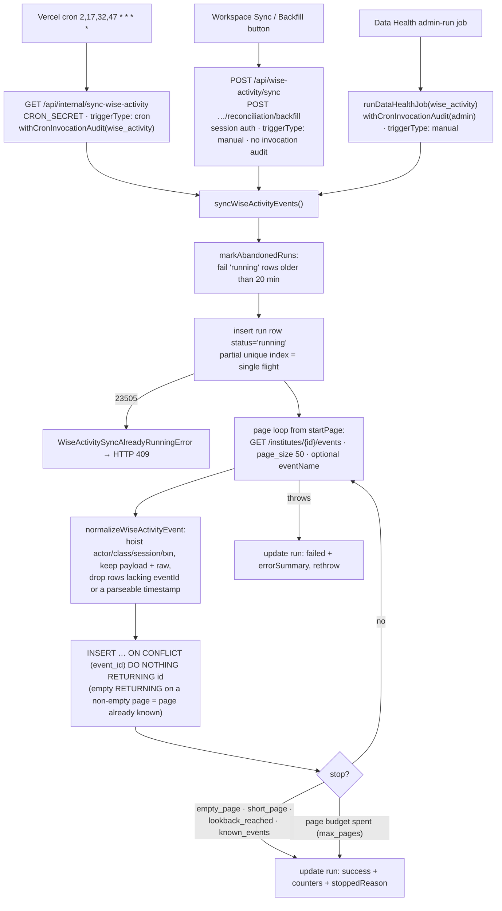
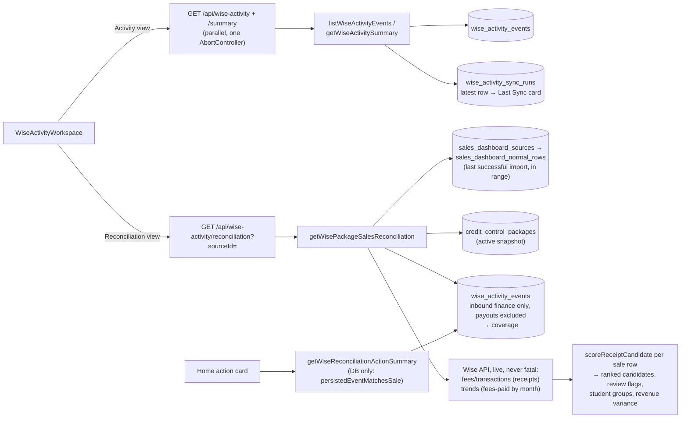

# Wise Activity Audit

**Status: stable** — cron-registered in `vercel.json` (`/api/internal/sync-wise-activity`, `2,17,32,47 * * * *`) and in the Data Health registry (`src/lib/data-health/cron-registry.ts:64-77`), nav-registered as "Wise Audit" (`src/lib/navigation/tools.ts:243-249`), page → API → library path fully wired, six test files, and no `@deprecated` marker anywhere in the code. The badge is applied from the documentation maturity map; the mechanism it rests on is described below.

## Purpose

Wise Activity Audit is a **read-only, persisted mirror of Wise's own audit-event feed** for the tenant the app is configured against — `WISE_NAMESPACE`, defaulted to `begifted-education` (`src/lib/env.ts:10`, `src/lib/wise/client.ts:218`), and `WISE_INSTITUTE_ID`, with the same fallback id in each ingest route (`src/app/api/wise-activity/sync/route.ts:9`, `:42`) — plus a **package-sales reconciliation workbench** that cross-checks Sales Dashboard sheet rows against Wise's money records.

It answers two questions for admin and finance staff:

1. **"What happened in Wise, and who did it?"** A filterable, paginated timeline of session mutations (created / updated / cancelled / deleted), billing and invoice events, classroom and user changes, feedback submissions, and anything else Wise emits — each row keeping the original Wise envelope for forensic inspection.
2. **"Does the Sales Dashboard match what Wise actually charged?"** A per-source reconciliation that scores live Wise receipt transactions as *candidate evidence* for each package-sale row, reports how much of the requested period the persisted event store actually covers, and shows a three-way revenue variance (sheet vs Wise fees-paid trend vs Wise receipts).

Four properties define the feature:

- **It is a separate lineage from the tutor snapshot sync.** It has its own ingest function (`syncWiseActivityEvents`, `src/lib/wise-activity/sync.ts:152-291`), its own run ledger (`wise_activity_sync_runs`), and its own append-only event table (`wise_activity_events`). It never touches `snapshots`, never participates in promotion, and its failure path updates only its own run row before rethrowing (`sync.ts:273-289`). A failed activity sync therefore cannot affect tutor search.
- **It never writes to Wise.** Every Wise call it makes goes through `WiseClient.get` (`src/lib/wise/client.ts:103-111`): `fetchWiseActivityEvents` (`src/lib/wise/fetchers.ts:498-517`), `fetchWiseReceiptTransactions` (`:719-759`), and `fetchWiseFeesPaidTrends` (`:567-601`).
- **Reconciliation is review-only.** It ranks candidates and explains each score; it never stamps a sale row "matched" and persists nothing. A source-text test pins that the workspace contains no `Mark as matched` / `Save match` control (`src/components/wise-activity/__tests__/reconciliation-ui.test.ts:32-39`), and a library test asserts the sale row carries no `matched` / `matchStatus` property (`src/lib/wise-activity/__tests__/reconciliation.test.ts:138-139`).
- **The event store has become shared infrastructure.** Post-Class Feedback reads `SessionFeedbackSubmittedEvent` rows as its highest-priority candidate lane and as immutable timing/authorship evidence (`src/lib/post-class-feedback/repository.ts:903-941`, `:1105-1120`, `:714-731`), reads `SessionDeletedEvent` rows to stop asking Wise about sessions that no longer exist (`:50-66`), and holds a foreign key into the table (`post_class_feedback_event_links.wise_activity_event_id`, `src/lib/db/schema.ts:3361`). Home renders a reconciliation action card from `getWiseReconciliationActionSummary` (`src/lib/home/summary.ts:184-186`, `:234-243`). Data Health can trigger the same ingest as an admin-run job (`src/lib/data-health/run-job.ts:47-62`) and surfaces its run history (`src/lib/data-health/dashboard.ts:170-177`, `:505-513`, `:632-641`). Two ops scripts also query it directly (`scripts/report-tutor-feedback-submissions.ts`, `scripts/backfill-payout-tutor-submitted.ts`).

**Who can use it.** The page checks only that a session with an email exists (`src/app/(app)/wise-activity/page.tsx:7-10`). Real gating is upstream: middleware requires a session and, for restricted users, matches `/wise-activity` and `/api/wise-activity/*` against the user's `allowedPages` prefixes — both the page path and its `/api` namespace (`isPathAllowed`, `src/middleware.ts:36-67`). `allowedPages = null` means full access. The same capability check (`canAccessHref`, `src/lib/navigation/tools.ts:266-270`) hides the nav entry and the Home card (`src/lib/home/summary.ts:158`, `:184`, `:234`). There is no finer role model — any signed-in user who can reach the page can also press Sync or Backfill.

## Conceptual data model

Grain, owning feature, and `schema.ts` line ranges for every table are catalogued in [docs/reference/database/index.md](../reference/database/index.md) (rows for `wise_activity_events` and `wise_activity_sync_runs`, `:80-81`). The ER diagram and per-table prose live in [docs/reference/database/erd-wise-activity.md](../reference/database/erd-wise-activity.md#tables); the downstream FK from Post-Class Feedback is drawn in [erd-post-class-feedback.md § Evidence collection](../reference/database/erd-post-class-feedback.md#evidence-collection). Both tables were introduced by `drizzle/0027_wise_activity_audit.sql`; the FK arrived with `drizzle/0055_post_class_feedback.sql`. This section describes meaning only.

**Owned (read + write), both snapshot-independent:**

- **`wise_activity_events`** — the append-only audit store. One row per Wise event, deduplicated on Wise's own `eventId` via a unique index (`src/lib/db/schema.ts:543`). Actor, classroom, session, and transaction attributes are *hoisted* out of the nested Wise envelope into flat, indexed columns so the timeline can filter and group in SQL; the extracted `payload` and the full `raw` envelope are both kept verbatim for the detail drawer and for downstream consumers that need fields the hoisting does not cover (`normalizeWiseActivityEvent`, `src/lib/wise-activity/sync.ts:90-128`). A stored row is never updated by the ingest — conflicts on `eventId` are ignored (`:224-228`).
- **`wise_activity_sync_runs`** — the ingest ledger: one row per attempt, cron or manual, and the *only* record a workspace-triggered run leaves behind (see Access and observability). Three things about it matter to this feature. A *partial* unique index over `status = 'running'` (`schema.ts:567-569`) is the single-flight guard — the database, not application code, enforces "at most one running sync". `status` is the shared `sync_status` enum (`running` / `success` / `failed`, `schema.ts:21-24`). And the run's `metadata` blob holds the option bundle from the moment the lock is claimed (`sync.ts:177`) but gains the final `stoppedReason` **only on the success path** (`:258`); the failure path rewrites `metadata` with the option bundle alone (`:286`), so a failed run records *why* it died (`errorSummary`) but its metadata carries no `stoppedReason`. Column-level detail is owned by [database/index.md](../reference/database/index.md) (`:81`) and [erd-wise-activity.md](../reference/database/erd-wise-activity.md#wiseactivitysyncruns-wise_activity_sync_runs-lines-553571).

**Read-only, owned by neighbouring features** (consulted only while building a reconciliation, `src/lib/wise-activity/reconciliation.ts`):

- `sales_dashboard_sources` + `sales_dashboard_normal_rows` — the package-sale rows being reconciled, chosen by source id or month; only non-archived sources are offered (`:748-755`) and only the rows of the source's last successful import are read (`:847-852`). See [erd-sales-dashboard.md](../reference/database/erd-sales-dashboard.md) and the [Sales Dashboard feature](./sales-dashboard.md).
- `credit_control_snapshots` + `credit_control_packages` (active snapshot only, `:880-885`, `:892-906`) — the bridge from a sheet row's student nickname / parent account / program to Wise student and class ids, so an id match on a receipt can be scored as strong evidence. See [erd-credit-control.md](../reference/database/erd-credit-control.md) and the [Credit Control feature](./credit-control.md).

**Read-only, owned by Data Health:** `cron_invocations`, written around the cron route by `withCronInvocationAudit` under job key `wise_activity` (`src/app/api/internal/sync-wise-activity/route.ts:16-17`). Manual syncs from the workspace do **not** produce an invocation row; only the run-ledger row records them.

**Deliberately not persisted:** Wise *receipt transactions* and Wise *fees-paid monthly trends*. Both are fetched live on every reconciliation request and discarded (`reconciliation.ts:766-819`, `:887-890`), so the variance is always computed against Wise's current answer, never a cached copy. Persisted activity events are used only for coverage and for the Home card's matcher, never as a revenue total (`reconciliation.test.ts:223-239`).

## API surface

Five session-authenticated routes under `src/app/api/wise-activity/` and one `CRON_SECRET`-protected ingest route under `src/app/api/internal/`. Request/response contracts, parameter clamps, and status tables are owned by [docs/reference/api/wise-activity.md](../reference/api/wise-activity.md); the cron's schedule and health parameters by [docs/reference/crons.md](../reference/crons.md). The routes use inline validation rather than Zod (dates via a `YYYY-MM-DD` regex, numbers via local clamp helpers, e.g. `src/app/api/wise-activity/route.ts:7-19`).

| Endpoint | Purpose |
|---|---|
| `GET /api/internal/sync-wise-activity` | Scheduled incremental ingest (`triggerType: "cron"`), wrapped in the cron-invocation audit; `409` when a sync already runs. |
| `POST /api/wise-activity/sync` | Admin-triggered ingest with the deep-crawl controls — lookback and page budget, a resume page, the known-page stop switch, and an allowlisted event-name filter. The only entry point that can crawl past the cron's horizon (see Ingest rules). Body contract: [api/wise-activity.md](../reference/api/wise-activity.md#post-apiwise-activitysync). |
| `POST /api/wise-activity/reconciliation/backfill` | Ingest sized from a reconciliation start date so coverage can reach `complete` before missing-candidate rows are trusted. |
| `GET /api/wise-activity` | Paginated, filtered, newest-first list of persisted events over a Bangkok date range. |
| `GET /api/wise-activity/summary` | KPI cards and chart aggregates (activity by day, session-mutation breakdown, finance trend, top actors/classrooms) over the same filter set, plus the most recent run's status. |
| `GET /api/wise-activity/reconciliation` | Package-sales reconciliation for a chosen Sales Dashboard source: scored receipt candidates per sale row, review flags, coverage, revenue variance. Makes live Wise calls. |

All three ingest entry points — and the Data Health manual job — call the *same* `syncWiseActivityEvents` (`src/lib/wise-activity/sync.ts:152`); only the option bundle differs (`src/app/api/internal/sync-wise-activity/route.ts:20-25`, `src/app/api/wise-activity/sync/route.ts:39-53`, `src/app/api/wise-activity/reconciliation/backfill/route.ts:38-47`, `src/lib/data-health/run-job.ts:49-54`). The only in-repo caller of the five admin routes is the workspace client.

## UI

One page, one client workspace, no server-side data fetching.

- **Page** — `src/app/(app)/wise-activity/page.tsx`: an async Server Component that redirects to `/login` without a session email and renders the workspace inside `<Suspense fallback={null}>` (`:6-21`). Reached from the **Data & Audit** nav section (`src/lib/navigation/tools.ts:86-90`, `:243-249`); its nav badge shows the reconciliation "needs review" count: `AppNav` fetches `/api/home/summary` (`src/components/layout/app-nav.tsx:146`) and `badgeValue` (`:37-41`) renders the action whose `id` equals the tool's `badgeKey` (`wiseReconciliation`, `tools.ts:248`) — the `rowsNeedingReview` figure built by `actionItem` (`src/lib/home/summary.ts:82-99`, `:234-243`) — and only while that action's `status` is `"ok"`.
- **Workspace** — `src/components/wise-activity/wise-activity-workspace.tsx` (`"use client"`, 991 lines) holds all state and fetching. A header toggle switches `view` between two surfaces (`:525`, `:743-752`); a **Sync** button runs a manual ingest with `{ lookbackDays: 30, maxPages: 500 }` and reloads page one (`runManualSync`, `:691-707`).
  - **Activity view** — four KPI cards (total events, session mutations, finance events, last-sync status with `+N` inserted; the last card turns red on a failed run, `:782-792`); a filter bar with start/end date, a Type select and an Action select whose options are derived from the summary's own counts (`:603-610`, `:804-817`), a free-text search, an **Apply** button, a **Finance** toggle, and a clear button (`:794-852`). Every filter is also a dependency of `loadData` (`:572`), so changing one re-fetches on its own; **Apply** is an explicit re-run for page one (`:823-826`). Three Chart.js canvases follow — stacked activity-by-day coloured by event type, a horizontal session-mutation bar chart, and a finance-trend line (`:612-689`, rendered through `ChartCanvas`, `:178-192`) — then a sticky-header, 50-row paginated log table (`:874-952`). The eye icon on a row opens a right-side drawer with the structured fields plus pretty-printed `payload` and `raw` JSON (`:956-988`).
  - **Reconciliation view** — `ReconciliationPanel` (`:435-520`): a Sales Dashboard source `<select>` (`:459-469`), **Reload** and **Backfill selected range** buttons (`:472-480`), a colour-coded coverage banner (`:484-494`), four KPI cards (`:496-501`), a `RevenueVarianceTable` comparing sheet total vs Wise fees-paid trend vs Wise receipt total with both deltas and the receipt/skipped counts (`:238-319`), and per-student collapsible groups that open automatically when the group has rows needing review (`:406-433`, `open` at `:408`). Each sale row (`SaleRowReview`, `:368-404`) shows its review flags and a ranked `CandidateList` (`:321-366`) with confidence badges, the human-readable scoring reasons, and an expandable raw-receipt block. **Backfill selected range** posts the reconciliation's own `dateRange` plus `maxPages: 1000`, then reloads (`runReconciliationBackfill`, `:709-730`).

Display helpers — event/type labels, Bangkok timestamp and currency formatting, and the finance/session-mutation predicates — live in `src/lib/wise-activity/format.ts`. `isWiseFinanceEvent` is imported by both the workspace (`wise-activity-workspace.tsx:28`) and the server aggregate (`src/lib/wise-activity/data.ts:5`), so the table's money column (rendered only for finance events, `:918-925`) and the *Finance Events* KPI agree on what "finance" means. Neither agrees with the narrower `financeOnly` SQL filter — see the finance-predicate rule below. The summary's `topActors` / `topClassrooms` are computed (`data.ts:235-236`) but the workspace renders neither.

## Data flow

Two independent flows: ingest (write) and read/reconcile.

**Ingest** — page-walk the Wise events feed into the append-only store behind the database-level single-flight lock:

```mermaid
flowchart TD
  Cron["Vercel cron 2,17,32,47 * * * *"] --> CronRoute["GET /api/internal/sync-wise-activity<br/>CRON_SECRET · triggerType: cron<br/>withCronInvocationAudit(wise_activity)"]
  Admin["Workspace Sync / Backfill button"] --> ManualRoute["POST /api/wise-activity/sync<br/>POST …/reconciliation/backfill<br/>session auth · triggerType: manual · no invocation audit"]
  DH["Data Health admin-run job"] --> DHRoute["runDataHealthJob(wise_activity)<br/>withCronInvocationAudit(admin) · triggerType: manual"]
  CronRoute --> Sync["syncWiseActivityEvents()"]
  ManualRoute --> Sync
  DHRoute --> Sync
  Sync --> Reap["markAbandonedRuns:<br/>fail 'running' rows older than 20 min"]
  Reap --> Claim["insert run row status='running'<br/>partial unique index = single flight"]
  Claim -->|"23505"| Conflict["WiseActivitySyncAlreadyRunningError → HTTP 409"]
  Claim --> Loop["page loop from startPage:<br/>GET /institutes/{id}/events · page_size 50 · optional eventName"]
  Loop --> Norm["normalizeWiseActivityEvent:<br/>hoist actor/class/session/txn, keep payload + raw,<br/>drop rows lacking eventId or a parseable timestamp"]
  Norm --> Insert["INSERT … ON CONFLICT (event_id) DO NOTHING RETURNING id<br/>(empty RETURNING on a non-empty page = page already known)"]
  Insert --> Stop{"stop?"}
  Stop -->|"empty_page · short_page ·<br/>lookback_reached · known_events"| Finish["update run: success + counters + stoppedReason"]
  Stop -->|"page budget spent (max_pages)"| Finish
  Stop -->|"no"| Loop
  Loop -->|"throws"| Fail["update run: failed + errorSummary, rethrow"]
```

**Read / reconcile** — the timeline reads only the persisted store; reconciliation joins it to sheet rows, credit packages, and *live* Wise money endpoints:

```mermaid
flowchart LR
  WS["WiseActivityWorkspace"] -->|"Activity view"| List["GET /api/wise-activity + /summary<br/>(parallel, one AbortController)"]
  WS -->|"Reconciliation view"| Recon["GET /api/wise-activity/reconciliation?sourceId="]
  List --> Data["listWiseActivityEvents /<br/>getWiseActivitySummary"]
  Data --> Events[("wise_activity_events")]
  Data --> Runs[("wise_activity_sync_runs<br/>latest row → Last Sync card")]
  Recon --> Build["getWisePackageSalesReconciliation"]
  Build --> Sheet[("sales_dashboard_sources →<br/>sales_dashboard_normal_rows<br/>(last successful import, in range)")]
  Build --> Credit[("credit_control_packages<br/>(active snapshot)")]
  Build --> Events2[("wise_activity_events<br/>inbound finance only, payouts excluded<br/>→ coverage")]
  Build --> Live["Wise API, live, never fatal:<br/>fees/transactions (receipts)<br/>trends (fees-paid by month)"]
  Live --> Score["scoreReceiptCandidate per sale row<br/>→ ranked candidates, review flags,<br/>student groups, revenue variance"]
  Home["Home action card"] --> Summary["getWiseReconciliationActionSummary<br/>(DB only: persistedEventMatchesSale)"]
  Summary --> Events2
```

The Activity view issues the summary and list requests together behind a single `AbortController`, so a superseded filter change cannot land out of order (`wise-activity-workspace.tsx:544-572`). The reconciliation loader does the same for its one request (`:576-596`) and only fires while the Reconciliation view is showing (`:598-601`).

## Business rules & edge cases

### Ingest

- **Single-flight is enforced by Postgres, not by code.** A concurrent ingest's `INSERT` into the run ledger violates the partial unique index; `isUniqueViolation` recognises it by SQLSTATE `23505`, by `cause.code`, or by the index name in the message (`src/lib/wise-activity/sync.ts:58-67`) and rethrows `WiseActivitySyncAlreadyRunningError` (`:51-56`, `:182`), which every caller maps to HTTP 409 (`src/app/api/internal/sync-wise-activity/route.ts:28-30`, `src/app/api/wise-activity/sync/route.ts:56-58`, `.../reconciliation/backfill/route.ts:50-52`, `src/lib/data-health/run-job.ts:57-59`). The cron audit records that 409 as `skipped`, not `failed` — see [Data Health](./data-health.md).
- **Abandoned runs are reaped before the lock is claimed.** Any `running` row started more than 20 minutes ago (`STALE_RUNNING_MS`, `sync.ts:13`) is force-failed with a fixed explanatory `errorSummary` (`markAbandonedRuns`, `:130-142`, called at `:167`), so a crashed serverless invocation cannot wedge ingest permanently. Note the asymmetry: the route allows 800 s (`route.ts:8`) but a run is presumed dead after 1200 s of silence — a legitimately long crawl cannot outlive the reaper because the reaper only runs at the *start* of the next attempt.
- **Cron is deliberately shallow; manual is nominally deep — but every in-app entry point stops at the cron's horizon.** With no explicit options, the trigger type alone selects a 3-day lookback and 20-page budget for cron versus 30 days and 500 pages for manual (`sync.ts:9-12`, `:160-161`). The cron is an incremental tail-catcher running every 15 minutes (`vercel.json:29-30`; registry cadence 15 min, late after 30 min, `cron-registry.ts:68-71`); it is not a backfill mechanism. The deep manual defaults are mostly theoretical while the cron is healthy, because every in-app manual path runs with `stopOnKnownEvents: true`: the workspace Sync button posts only `{ lookbackDays: 30, maxPages: 500 }` (`wise-activity-workspace.tsx:698`), so `sync/route.ts:51` yields `true`; the backfill route passes no flag (`backfill/route.ts:42-46`); the Data Health job passes only `triggerType` (`run-job.ts:53`) — and all three inherit the engine default (`sync.ts:163`). The 15-minute cron keeps the newest pages fully persisted, so page 1 (or page 2 at most) inserts zero rows, `hitKnownPage` becomes true, and the loop exits with `known_events` (`:222-232`, `:242-245`) long before it reaches any older gap; `sync.test.ts:163-188` shows a fully-known page 1 stopping after one page. The only crawl that can pass the cron's horizon is a direct `POST /api/wise-activity/sync` with the literal `stopOnKnownEvents: false` (optionally with `startPage`), which the workspace never sends.
- **The schedule is pinned by tests, and the reason is recorded next to it.** `src/__tests__/vercel-crons.test.ts:142-146` asserts `2,17,32,47 * * * *` and `:148-161` asserts the four minutes collide with no other cron's minute field. The 15-minute cadence landed in `fa29c52` (2026-08-07, `perf(wise-activity): mirror activity events every 15 minutes`); its commit message and the test's own comment (`:137-141`) record why: the mirror is the only source of feedback-submission timestamps, and at `5,35` an event written at 23:42 Bangkok was not mirrored until 00:05 — after the 23:59:59.999 deadline Post-Class Feedback needed it visible against. The change is freshness-only — a timing verdict reads the event's own immutable timestamp, never the mirror's observation time. Two reference pages still show the older `5,35` — see Open questions.
- **Five stop paths; "known page" is derived from the upsert itself.** The loop exits on an empty page, a page shorter than 50, the oldest event seen crossing the lookback cutoff, or — when `stopOnKnownEvents` is on — a non-empty page whose `INSERT … RETURNING` returned zero rows (`sync.ts:204-207`, `:222-245`). Otherwise it exhausts its page budget and keeps the initial `"max_pages"` (`:191`). `da88794` (2026-09-02) removed a pre-`SELECT` that asked Postgres the same question one statement earlier (comment at `:218-221`); the sync test's fake `db` deliberately has no `select` so a reintroduced pre-query would fail loudly (`sync.test.ts:86-88`, `:185-187`).
- **Two stop paths rest on an external ordering assumption the repo cannot verify.** `lookback_reached` and `known_events` are correct only if Wise returns events newest-first — a runtime property of the Wise API that no code or test here establishes. The sync sends no sort parameter (`:196-200`) and the fetcher has none to send — it builds the request from `page_number`, `page_size`, and optional `type` / `eventName` / `userId` / `classIds` only (`src/lib/wise/fetchers.ts:503-510`). No date parameter is ever sent; the lookback window is enforced client-side by comparing the oldest normalised timestamp against the cutoff (`sync.ts:165`, `:238-241`). The endpoint contract is owned by [docs/reference/wise-api.md](../reference/wise-api.md#activity-events--fetchwiseactivityevents).
- **Deep backfills need `stopOnKnownEvents: false` and `startPage`.** On a re-run, page one is always fully known, so the `known_events` exit would abort a resumable crawl immediately. `stopOnKnownEvents` (`sync.ts:28-33`, `:163`, `:242`) and `startPage` (`:26-27`, `:162`, `:194-195`) exist so a deep historical crawl can continue past known pages and resume mid-history. Only `POST /api/wise-activity/sync` exposes them; it reads the literal `false` only (`sync/route.ts:49-51`).
- **The reconciliation backfill inherits `stopOnKnownEvents: true`, so it cannot pass the cron's horizon.** `POST …/reconciliation/backfill` passes only `triggerType`, `lookbackDays`, and `maxPages` (`backfill/route.ts:42-46`), so the crawl continues only while every page yields at least one new insert (`sync.ts:232`, `:242-245`). With the cron running every 15 minutes, page 1 is already persisted apart from the events that arrived since the last tick, so a press of "Backfill selected range" — first or subsequent — ends at page 1 or 2 with `known_events`. It crawls the requested range only when the newest pages are *not* yet persisted (cron never run, or disabled). Whether this is deliberate is an open question below.
- **Backfill lookback is computed, not caller-supplied.** `wiseReconciliationBackfillLookbackDays` converts the reconciliation start date into Bangkok days back from today plus one, clamped to `[1, 365]` (`reconciliation.ts:1013-1019`). `endDate` is validated but not forwarded — the crawl always walks backwards from *now*, so a start date more than a year back is silently truncated.
- **The `eventName` crawl filter is allowlisted, not free-form.** A server-side name filter reaches far deeper per page than the unfiltered feed, so the manual route accepts one only from `BACKFILLABLE_EVENT_NAMES` — currently just `SessionFeedbackSubmittedEvent` — and silently drops anything else, "so an arbitrary caller cannot steer the crawl at an unbounded feed" (`sync/route.ts:11-13`, `:20-22`, `:47`). The single entry exists for Post-Class Feedback's evidence lane.
- **Ingest is idempotent by construction.** Rows insert with `onConflictDoNothing` on the unique `eventId` (`sync.ts:224-228`), so overlapping pages and repeated runs never duplicate; `insertedCount` counts only genuinely new rows because it comes from the `RETURNING` set (`:229-230`). Pages are inserted as they arrive — a crawl that fails on page 7 keeps pages 1–6 and records `failed` with partial counters (`:273-289`).
- **Normalisation fails soft, never loud.** `normalizeWiseActivityEvent` returns `null` for an event with no `eventId` or an unparseable `eventTimestamp` (`sync.ts:100-103`) and such rows are filtered out rather than aborting the page (`:209-211`); they still count in `eventsFetched` but not in `insertedCount`. Missing type/name default to `"unknown"` / `"UnknownEvent"` (`:107-108`); actor id falls back from the top-level `user` to `payload.user.id` (`:110`), classroom id from `classroom` to `payload.class.id` (`:113`). The `participant` object Wise sends (`src/lib/wise/types.ts:186`) is parsed into the type but never read.
- **Transaction amounts are stored exactly as Wise sends them.** `transactionAmount` is `payload.transaction.amount.value` with no unit conversion (`sync.ts:95`, `:122`). The two *live* money sources this feature reads do convert minor → major for THB (`fetchers.ts:563-565`, applied at `:596` and `:688`). Whether the activity feed's values are minor units is a runtime property of Wise payloads that the repo cannot settle — see Open questions.

### Reading the store

- **Everything is Asia/Bangkok, through three implementations.** Day keys and range boundaries use the shared helpers in `src/lib/room-capacity/dates.ts` (`bangkokDateKey` at `data.ts:196`; `wiseActivityBangkokRange` at `:240-245` turns a `YYYY-MM-DD` pair into a UTC window whose `end` is the last millisecond of the end day). Display formatting does not: `formatBangkokDateTime` drives `Intl.DateTimeFormat` off a locally declared constant (`format.ts:1`, `:72-84`). The workspace's default 7-day window uses its own `bangkokToday()` / `addDays()` (`wise-activity-workspace.tsx:109-124`). The routes default the same way server-side (`todayBangkok()` and `-6`, `route.ts:28-31`, `summary/route.ts:21-24`).
- **Three finance definitions coexist, on purpose and by drift.**
  - *Display / KPI*: `isWiseFinanceEvent` — `BILLING` type, or any `transactionId`, or a name matching `/invoice|payment|payout|transaction/i` (`format.ts:57-66`). Used by the table's money column and by `cards.financeEvents` and `financeTrend` (`data.ts:211-217`).
  - *List/summary SQL filter* (`financeOnly=true`): `event_type = 'BILLING' OR transaction_id IS NOT NULL OR name ILIKE %invoice%/%payment%/%payout%` (`data.ts:108-116`) — the display predicate **minus** its `transaction` term, so an event whose name matches only `/transaction/i` counts in the KPI yet disappears when the filter is on.
  - *Reconciliation inbound*: `isInboundWiseInvoiceEvent` first **excludes** anything matching `/payout/i`, then accepts `BILLING`, a `transactionId`, or `/invoice|payment|transaction/i` (`reconciliation.ts:300-310`), so tutor payouts can never be mistaken for sales revenue. Its SQL twin exists in **two verbatim copies** — inside `getWisePackageSalesReconciliation` (`:870-877`) and `getWiseReconciliationActionSummary` (`:957-964`) — and a change to one must be mirrored in the other. A regression test pins that `SessionFeedbackSubmittedEvent` is not finance merely because it contains the substring "fee" (`reconciliation.test.ts:265-290`).
- **Session mutations are exactly four names.** `SessionCreatedEvent`, `SessionUpdatedEvent`, `SessionCancelledEvent`, `SessionDeletedEvent` (`SESSION_MUTATION_EVENTS`, `format.ts:3-8`); the summary pre-seeds all four at zero so the chart always has four bars (`data.ts:184-189`).
- **Labels degrade gracefully.** Unknown event names are de-camel-cased with the trailing `Event` stripped; unknown types fall through to the same routine (`format.ts:45-55`), so a new Wise event type renders readably without a code change.
- **The summary aggregates in JavaScript over every matching row.** `getWiseActivitySummary` selects the filtered rows with no `LIMIT` and counts in Node (`data.ts:167-171`, `:195-218`); cost grows linearly with the selected range. The `lastSync*` card values come from the most recent run row by `startedAt`, regardless of status or the date filter (`:172-176`, `:220-229`).
- **Free-text search is a leading-wildcard `ILIKE`** across actor name, classroom name/subject, event name, session id, and transaction id (`data.ts:117-127`) — parameterised, but not index-servable. `sessionId` and `transactionId` are also accepted as exact filters (`:106-107`) with no UI input.

### Reconciliation

- **Source selection prefers a source that has actually imported.** Candidates are non-archived sources newest-month first; with neither `sourceId` nor `month` the first source with a `lastSuccessfulImportRunId` wins, else the first source, else none (`reconciliation.ts:757-764`). No source at all returns a well-formed empty reconciliation ranged today→today (`:832-842`); a source that exists but has never imported successfully **throws** and surfaces as a 500 (`:843-845`) — a missing source is a normal state, a broken one is not. The date range defaults to the min/max `paymentDate` of the import's rows, falling back to the source month (`:697-709`).
- **Live Wise money sources degrade instead of failing the request.** Missing `WISE_USER_ID` / `WISE_API_KEY`, or a thrown Wise call, yields a typed error string and `*Available: false` flags rather than a 500 (`loadWiseFeesPaidTrends`, `:766-791`; `loadWiseReceipts`, `:793-819`). Receipt candidates are the payment, offline-payment, and disbursal transactions Wise reports as charged or pending confirmation within the reconciliation's Bangkok day range (`fetchWiseReceiptTransactions`, `fetchers.ts:719-759`); the exact query is owned by [wise-api.md](../reference/wise-api.md#feereceipt-transactions--fetchwisereceipttransactions). The system pointedly does **not** substitute a sum over persisted activity events for missing Wise revenue (`reconciliation.test.ts:223-239`). These calls happen on **every** reconciliation GET and every source change; nothing is cached.
- **The Home card never calls Wise.** `getWiseReconciliationActionSummary` (`:923-1011`) reads only Postgres. It uses a *different* matcher from the page — `persistedEventMatchesSale` over persisted inbound events (`:586-616`: transaction-number identity first, else amount equality within 3 Bangkok days plus a text hit) — so the Home "matched of N rows" figure and the page's `rowsWithCandidates` (scored against *live receipts*) can legitimately disagree. Its needs-review rule (`:999-1000`) also differs from the page's flags (`:560-565`).
- **Credit Control packages bridge sheet identities to Wise ids.** `packageMatchesSale` maps a sale row to active packages when the student nickname matches (either direction, substring-tolerant), or when parent *and* package text match (`:312-340`). The resulting Wise student/class id sets are what make a receipt id match worth +50 each.
- **Candidate scoring is additive, explained, thresholded, and capped.** `scoreReceiptCandidate` (`:372-444`) awards: sheet transaction number found among the receipt's identifiers **+100** (`:377-381`); receipt class id in the mapped packages **+50** (`:383-387`); receipt student id in the mapped packages **+50** (`:389-393`); amount equal within 0.01 **+30** (`:395-398`); same Bangkok day **+20**, within three days **+10** (`:400-410`); text overlap with student/parent/program/package hints of ≥3 characters **+15** (`:412-417`). Below 20 the receipt is discarded (`:419`); survivors are `high` ≥ 80, `medium` ≥ 45, else `low` (`:439`), sorted by score then time, and truncated to **five per row** (`MAX_CANDIDATES_PER_ROW`, `:16`, `:623-627`). Every award appends a human-readable reason — the UI shows the explanation, not just the number.
- **Review flags mark uncertainty, not failure.** A row is flagged when it has no candidates, no sheet transaction number, or a sheet "Recorded in WISE?" value that does not read as yes (`makeSaleRow`, `:559-566`). Flags drive the student ordering (most-flagged first, then nickname, `:651-654`) and the auto-expanded group in the UI, so the rows a human must look at surface first.
- **Coverage gates the meaning of "no candidate".** A row with no candidates means "no evidence found", which equals "no payment exists" only if the persisted event store spans the requested range. `buildCoverage` therefore reports `complete` (first inbound event on or before the start, last on or after the end), `partial`, or `empty`, with a message that tells the user to backfill before trusting missing-candidate rows (`:446-471`). The UI colours the banner and the variance table's coverage cell accordingly (`wise-activity-workspace.tsx:172-176`, `:305-312`). Coverage is computed from *persisted* events; candidates from *live* receipts — the two numbers answer different questions.
- **Revenue is derived from three independent sources and never collapsed.** Sheet total sums the in-range sale rows; "Wise revenue" is the fees-paid **monthly** trend row whose Bangkok month equals the selected source's month (or the range's start month when no source is selected, `:486-494`, matched `:516`); receipt total sums only receipts passing `isReceiptRevenue` — type `PAYMENT` or `OFFLINE_PAYMENT`, status `CHARGED`, positive amount (`:496-503`) — and every other receipt is counted as "skipped" and shown as such. Both deltas (`sheetMinusReceipts`, `receiptsMinusTrend`) are surfaced (`:505-557`); a missing trend row for the month is reported as unavailable, not zero (`:519-523`).

### Access and observability

- **Only the workspace's manual runs escape the invocation audit.** The internal route is wrapped in `withCronInvocationAudit` under `wise_activity` (`route.ts:16-17`), which is what makes the job visible on the Data Health cron board — and so is the Data Health admin-run job (`run-job.ts:35-41`, `triggerSource: "admin"`), which nevertheless stamps its run-ledger row `triggerType: "manual"` (`:53`). The workspace's Sync and Backfill buttons hit routes with no such wrapper, so they leave only a `wise_activity_sync_runs` row with `triggerType: "manual"`. A `manual` ledger row therefore has two provenances — workspace button or Data Health job — that the ledger itself does not distinguish; only the presence of a matching `cron_invocations` row tells them apart.
- **Data Health treats the run ledger as the job's evidence.** It pulls the most recent runs (`dashboard.ts:770`), derives latest/successful/failed/running evidence for the `wise_activity` job (`:170-177`), renders a domain card "Read-only Wise audit event ingestion" with the last run's `insertedCount` (`:505-513`), and lists each run in the unified history (`:632-641`).
- **No secrets or bodies are logged.** The feature has no `console.*` calls of its own; errors travel as `{ error: message }` responses and `errorSummary` on the run row.

## Tests

Six files, all in the `unit` Vitest project (no integration/Postgres suite for this feature).

- `src/lib/wise-activity/__tests__/sync.test.ts` — payload normalisation into hoisted columns (`:99-122`); dedupe of a known event id while writing a successful run row (`:124-161`); the `known_events` full-page stop with exactly one statement per page (`:163-188`); the `eventName` filter reaching the fetcher (`:190-207`); crawling past a fully-known page when `stopOnKnownEvents: false` (`:209-233`); resuming from an explicit `startPage` (`:235-254`). The fake `db` has no `select` on purpose (`:86-88`); `@/lib/wise/fetchers` is mocked wholesale (`:5-7`), so the file verifies the *arguments* the sync passes, not the fetcher.
- `src/lib/wise/__tests__/fetchers.test.ts:492-528` — the contract test for `fetchWiseActivityEvents`: supported filters go out and `page_size` is capped at 50.
- `src/lib/wise-activity/__tests__/reconciliation.test.ts` — high-confidence candidates from exact receipt metadata without auto-matching (`:119-140`); revenue variance from the monthly trend and Bangkok-month row mapping (`:142-202`); unavailable trend and receipt paths with no fallback to persisted events (`:204-239`, `:313-331`); THB receipt amounts (`:241-263`); the "fee" substring guard (`:265-290`); difference and percentage (`:292-311`); non-revenue receipts skipped (`:333-356`); amount/date proximity as supporting evidence (`:358-378`); sub-threshold rows left candidate-free with flags (`:380-404`); coverage `partial` vs `complete` (`:406-440`); backfill lookback days (`:442-444`).
- `src/lib/wise-activity/__tests__/format.test.ts` — labels for known and camel-case names, finance / session-mutation classification, Bangkok timestamp and currency formatting (`:11-35`).
- `src/app/api/wise-activity/__tests__/route.test.ts` — auth gating (`:89-97`); filter and pagination plumbing (`:99-117`); date-range 400s (`:119-125`, `:221-229`); the summary aggregate (`:127-141`); manual-sync option pass-through (`:143-164`); the event-name allowlist accepting `SessionFeedbackSubmittedEvent` and neutralising an unknown name (`:166-199`); the reconciliation payload (`:201-219`); backfill lookback wiring (`:231-250`); the 409 already-running conflict (`:252-263`).
- `src/app/api/internal/sync-wise-activity/__tests__/route.test.ts` — the cron route runs the ingest with `{ triggerType: "cron" }` under a valid secret (`:42-56`) and rejects a wrong secret with 401 (`:58-64`).
- `src/components/wise-activity/__tests__/reconciliation-ui.test.ts` — asserts the reconciliation surface exists (coverage banner, variance columns, candidate list) and stays read-only (`:13-39`). This is a source-text assertion against the workspace file, not a rendered-DOM test; it guards intent rather than behaviour.

Adjacent coverage: `src/__tests__/vercel-crons.test.ts:142-` pins the schedule and its minute isolation; `src/lib/home/__tests__/summary.test.ts:79-86`, `:109` exercises the Home card's consumption of `getWiseReconciliationActionSummary`.

## Open questions

- **Two reference pages still disagree with `vercel.json` on the schedule, and one still describes removed code.** The cron moved to `2,17,32,47 * * * *` in `fa29c52` (2026-08-07; registry `cron-registry.ts:68`). [crons.md](../reference/crons.md) (`:33`, `:330`) and `docs/operations/runbook.md:333` now carry the new schedule, but [api/wise-activity.md](../reference/api/wise-activity.md) (`:97`, which also still quotes `lateAfterMinutes: 45` against the registry's `30` at `cron-registry.ts:71`) and `docs/handbook/overview.md:61` still say `5,35` — drift of nearly a month. The API reference's ingest step 5 (`:67`) also still describes the pre-`SELECT` that `da88794` removed on 2026-09-02. Is a reference regen planned, or should these be hand-patched?
- **Freshness-only, or load-bearing?** `fa29c52` describes the 15-minute cadence as a freshness change that never affected correctness, and notes that end-to-end pre-deadline detection would *also* need a Post-Class collector run between the mirror and midnight. The collector still runs at `13,43` (`vercel.json:33-34`) — 23:43 Bangkok, four minutes *before* the 23:47 mirror — so the last pre-midnight mirror is first consumed at 00:13. `docs/proposals/2026-09-02-cron-efficiency-and-wise-webhooks.md:61` instead calls the cadence "load-bearing for the PCF 23:59:59 deadline evidence". Which framing should a future stagger change be held to?
- **Is Wise's `/institutes/{id}/events` feed guaranteed newest-first?** A runtime property of the Wise API the repo cannot settle: `lookback_reached` and `known_events` both assume it, the sync sends no sort parameter (`fetchers.ts:503-510`), and no test fixtures an ordered real payload. [wise-api.md](../reference/wise-api.md#activity-events--fetchwiseactivityevents) states "walks newest-first" as settled fact — stronger than the repo can support. Worth confirming against live Wise and aligning both pages.
- **What unit is `transaction_amount` on activity events?** A runtime property of Wise payloads the repo cannot settle: the ingest stores `payload.transaction.amount.value` raw (`sync.ts:122`); the receipt and trend fetchers divide THB by 100 (`fetchers.ts:563-565`). The Activity table and Finance Trend format the raw value as currency (`wise-activity-workspace.tsx:920`, `data.ts:215`); the sync test passes `1500` straight through (`sync.test.ts:39`, `:117`), while the reconciliation fixtures pair a `1_000_000` event amount with a `10_000` major-unit receipt (`reconciliation.test.ts:46`, `:52`, `:297-298`). If events are minor-unit, the Activity view overstates by 100× and `persistedEventMatchesSale`'s amount path (`reconciliation.ts:604`) can never match a sheet's major-unit amount, leaving the Home card's matcher dependent on transaction-number hits alone.
- **Is the backfill route meant to stop on the first known page?** `POST …/reconciliation/backfill` never sets `stopOnKnownEvents: false` (`backfill/route.ts:42-46`) although the sibling sync route's comment says a targeted backfill "must not stop on the first already-known page" (`sync/route.ts:49-51`). A press of "Backfill selected range" — first or subsequent — on a store the cron keeps current therefore ends at page one or two. Bug, or an accepted limitation because the button was designed for a store the cron had not yet reached?
- **Should the two reconciliation matchers converge?** Home uses `persistedEventMatchesSale` over persisted events (`reconciliation.ts:586-616`, `:997`); the page uses `scoreReceiptCandidate` over live receipts (`:372`, `:623-627`); the needs-review rules differ (`:999-1000` vs `:560-565`). The disagreement is documented above, but is it intended?
- **Unwired surface.** `topActors` / `topClassrooms` are computed but never rendered; `sessionId` / `transactionId` filters are accepted with no UI input (`data.ts:106-107`); `WiseActivityEvent.participant` is typed but never normalised. Power-user affordances, unfinished UI, or dead code?
- **Should the summary get a guardrail?** `getWiseActivitySummary` loads every matching row into memory with no cap (`data.ts:167-171`). Fine for the default week; a year-wide range over a deeply backfilled store has no bound.
- **Does Wise Activity own a retention/backfill floor?** Post-Class Feedback's correctness depends on how far back `SessionFeedbackSubmittedEvent` and `SessionDeletedEvent` rows reach — its own comment records the deletion mirror "only reaches back to 2026-05-27" (`src/lib/post-class-feedback/repository.ts:73`) and it derives a coverage floor from the store's oldest feedback event (`:1122-1128`). Should the floor, and the single-entry `BACKFILLABLE_EVENT_NAMES` allowlist, be documented and owned here, and is the allowlist meant to grow?
- **Is the free-text `q` filter expected to stay unindexed?** Leading-wildcard `ILIKE` over six columns (`data.ts:117-127`), three of which carry no index, cannot use a btree index regardless. Is a trigram index intended before the store grows further?

_Verified against main@0cd1e81 (clean tree) on 2026-09-02._
