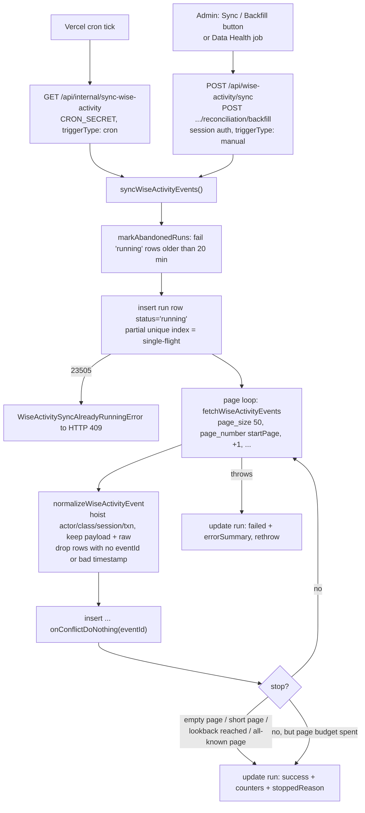
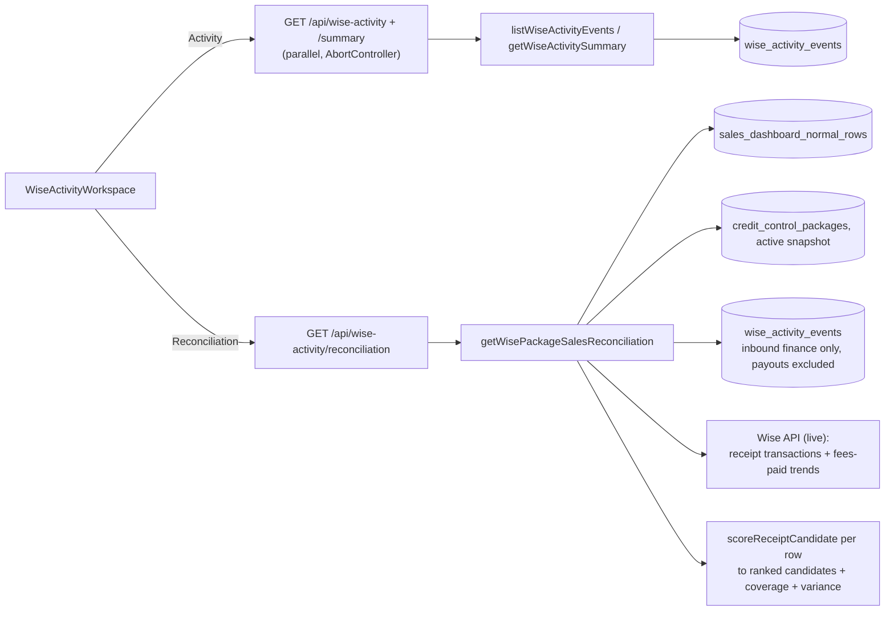

# Wise Activity Audit

**Status: stable**

## Purpose

Wise Activity Audit is a read-only mirror of what happened *inside* the Wise platform (`begifted-education` tenant), plus a package-sales reconciliation workbench that cross-checks the Sales Dashboard sheet against Wise's own money records.

It answers two questions for admin and finance staff:

1. **"What happened in Wise, and who did it?"** — a filterable, paginated timeline of session mutations (created / updated / cancelled / deleted), billing and invoice events, user and classroom changes, feedback submissions, and so on, each with the original Wise payload retained for forensic inspection.
2. **"Does our Sales Dashboard match what Wise actually charged?"** — a reconciliation view that scores Wise receipt transactions as *candidate evidence* for each package-sale row, and reports a sheet-vs-Wise revenue variance.

Three properties define the feature's character:

- **It is independent of the tutor snapshot sync.** It has its own ingest function, its own sync-run ledger, and its own append-only event table, and it never participates in snapshot promotion. The ingest writes only `wise_activity_events` and `wise_activity_sync_runs`, and its failure path updates only the run row before rethrowing (`src/lib/wise-activity/sync.ts:275-292`) — so a failed activity sync leaves tutor search untouched. That isolation is structural (it follows from what the ingest writes); none of the six cases in `src/lib/wise-activity/__tests__/sync.test.ts` asserts it directly.
- **It never writes to Wise.** Every Wise call it makes is a GET (`fetchWiseActivityEvents`, `fetchWiseReceiptTransactions`, `fetchWiseFeesPaidTrends`).
- **Reconciliation is review-only.** It ranks candidates and reports variance; it never stamps a sale row "matched". A source-level test asserts the workspace contains no `Mark as matched` / `Save match` controls (`src/components/wise-activity/__tests__/reconciliation-ui.test.ts:37-38`).

Users are staff. The page is reached via the "Wise Audit" tool entry (`src/lib/navigation/tools.ts:235-241`, section `data-audit`, badge key `wiseReconciliation`) and the page component itself checks only that a session with an email exists (`src/app/(app)/wise-activity/page.tsx:7-10`). The real gating happens in two upstream places, and neither is an app-wide admin allowlist in middleware:

- **Who may sign in at all** is decided in the Auth.js `signIn` callback, which admits an identity only when `resolveUserAccess` returns non-null — an `admin_users` row, an admissions counselor/student/parent membership, or an email matched to an active teacher contact (`src/lib/auth.ts:5-30`, wired at `:50-57`; `src/lib/auth-access.ts:56-85`).
- **Which pages that identity may open** is decided in middleware, which requires a session (`src/middleware.ts:71-75`) and then matches the pathname against the user's `allowedPages` prefixes — 403 for `/api/*`, redirect for pages (`src/middleware.ts:78-88`, `isPathAllowed` at `:30-61`). `allowedPages = null` means full access; a restricted user reaches `/wise-activity` and `/api/wise-activity/*` only if one of their prefixes covers it. The same capability gates the Home action card (`canAccess("wiseReconciliation")`, `src/lib/home/summary.ts:184`).

**It has also become load-bearing infrastructure for other features.** The event store is no longer read only by its own page:

- **Post-Class Feedback** treats `SessionFeedbackSubmittedEvent` rows as a primary candidate lane and as evidence of teacher submission (`src/lib/post-class-feedback/repository.ts:926`, `src/lib/post-class-feedback/dashboard.ts:296-301`, `src/lib/post-class-feedback/payout-repository.ts:144-153`), and uses `SessionDeletedEvent` rows to stop asking Wise about sessions that no longer exist (`src/lib/post-class-feedback/repository.ts:56-66`). It even holds a foreign key into the table (`post_class_feedback_event_links.wise_activity_event_id`, `src/lib/db/schema.ts:3358`).
- **Home** surfaces a reconciliation action card fed by `getWiseReconciliationActionSummary` (`src/lib/home/summary.ts:184-186, :234-242`).
- **Data Health** can trigger the same ingest as an admin-run job under the `wise_activity` key (`src/lib/data-health/run-job.ts:46-62`, registry entry `src/lib/data-health/cron-registry.ts:63-75`).

## Conceptual data model

Grain, owning feature, and schema line ranges are catalogued in the database reference — [docs/reference/database/index.md](../reference/database/index.md), rows for `wise_activity_events` and `wise_activity_sync_runs` (`:79-80`) — which routes on to the core ERD, [docs/reference/database/erd-core.md](../reference/database/erd-core.md). Be aware that neither page currently carries the flattened-column inventory for these two tables: the ERD block shows four of the twenty-three `wise_activity_events` columns and three of the twelve `wise_activity_sync_runs` columns (`erd-core.md:77-87`), with coarse types only (`uuid` / `text` / `ts`), no defaults and no index list, and the page's `### Tables` prose section has no entry for either table. The only complete source is `src/lib/db/schema.ts` (`wise_activity_events` at `:518-551`, eight indexes; `wise_activity_sync_runs` at `:553-571`, two indexes). Conceptually:

**Owned (read + write), both snapshot-independent:**

- **`wise_activity_events`** — the append-only audit store. One row per normalized Wise event, keyed on Wise's own `eventId` (unique index, `src/lib/db/schema.ts:543`). Actor, classroom, session, and transaction attributes are *hoisted* out of the nested Wise payload into flat columns, so the timeline filters and groups in SQL rather than by reaching into JSON; the extracted `payload` and the full `raw` envelope are both retained verbatim for the detail drawer and for downstream consumers that need fields the hoisting does not cover. Note that "hoisted" does not imply "fast": several hoisted columns carry no index of their own, and the free-text `q` filter is a leading-wildcard `ILIKE` across six columns (`src/lib/wise-activity/data.ts:117-127`), which a btree index cannot serve regardless. No benchmark or query plan for that path exists in the repo.
- **`wise_activity_sync_runs`** — the ingest ledger: one row per attempt, cron or manual, recording how that attempt ended (columns at `src/lib/db/schema.ts:553-571`). A *partial* unique index over `status = 'running'` (`src/lib/db/schema.ts:567-569`) is the single-flight guard: the database, not application logic, enforces "at most one running sync".

**Read-only, owned by neighbouring features** (consulted only while building a reconciliation, `src/lib/wise-activity/reconciliation.ts`):

- `sales_dashboard_sources` + `sales_dashboard_normal_rows` — the package-sale rows being reconciled, chosen by source or month.
- `credit_control_snapshots` + `credit_control_packages` (active snapshot only) — used to map a sheet row to its Wise student/class IDs so an ID match can be scored as strong evidence.

**Deliberately not persisted:** Wise *receipt transactions* and Wise *fees-paid monthly trends*. Both are fetched live from the Wise API on each reconciliation request (`src/lib/wise-activity/reconciliation.ts:766-819`) and thrown away — the reconciliation is always computed against Wise's current answer, never a cached copy.

## API surface

Five session-authenticated endpoints under `src/app/api/wise-activity/`, plus one `CRON_SECRET`-protected ingest route under `src/app/api/internal/`. Full request/response contracts, parameter clamps, and error tables: [docs/reference/api/wise-activity.md](../reference/api/wise-activity.md). Cron scheduling mechanics: [docs/reference/crons.md §7](../reference/crons.md#7-wise-activity-audit-sync--apiinternalsync-wise-activity).

| Endpoint | Purpose |
|---|---|
| `GET /api/wise-activity` | Paginated, filtered, newest-first list of persisted events. |
| `GET /api/wise-activity/summary` | KPI cards and chart aggregates (activity by day, session-mutation breakdown, finance trend, top actors/classrooms) over the same filter set. |
| `GET /api/wise-activity/reconciliation` | Package-sales reconciliation for a chosen Sales Dashboard source: scored receipt candidates per sale row, coverage status, revenue variance. |
| `POST /api/wise-activity/sync` | Admin-triggered ingest, with optional allowlisted event-name targeting and deep-crawl controls. |
| `POST /api/wise-activity/reconciliation/backfill` | Ingest sized to a reconciliation date range, so coverage can reach `complete` before the results are trusted. |
| `GET /api/internal/sync-wise-activity` | Cron ingest. Schedule, `maxDuration`, and crawl budget: [crons.md §7](../reference/crons.md#7-wise-activity-audit-sync--apiinternalsync-wise-activity). |

All three ingest entry points — cron, manual sync, reconciliation backfill — and the Data Health job all call the *same* `syncWiseActivityEvents` (`src/lib/wise-activity/sync.ts:152`); only the option bundle differs.

## UI

One page, one client workspace.

- **Page** — `src/app/(app)/wise-activity/page.tsx`: a server component that redirects to `/login` without a session email and renders the workspace inside a `Suspense` boundary.
- **Workspace** — `src/components/wise-activity/wise-activity-workspace.tsx` (`"use client"`), holding all state and fetching. A header toggle switches a `view` state between two surfaces (`:525`, toggle at `:743-752`), and a "Sync" button runs the manual ingest (`runManualSync`, `:691`).
  - **Activity view** — four KPI cards (total events, session mutations, finance events, last-sync status/insert count, `:782-792`); a filter bar (start/end date, type select, action select, free-text search, an `Apply` button, a `Finance` toggle, and a clear button, `:794-852`; `Apply` at `:823-826` is the explicit submit, and easy to overlook because every filter is also a dependency of `loadData`, so a change re-fetches on its own, `:572`, `:574`); three Chart.js canvases — stacked activity-by-day, horizontal session-mutation bars, finance-trend line (`:612`, `:637`, `:663`, rendered through `ChartCanvas`, `:178`); and a sticky-header, paginated log table (`:882`). Clicking a row's eye icon opens a right-side drawer with the structured fields plus pretty-printed `payload` and `raw` JSON (`:956-988`).
  - **Reconciliation view** — `ReconciliationPanel` (`:435`): a Sales Dashboard source selector, a colour-coded coverage banner, four KPI cards, a `RevenueVarianceTable` comparing sheet total vs Wise fees-paid trend vs Wise receipt total with both deltas (`:238`), and per-student collapsible groups (auto-expanded when the group has rows needing review, `:408`) of sale rows. Each row lists its ranked candidates with confidence badges, the human-readable scoring reasons, and an expandable raw-receipt block (`CandidateList`, `:321`). "Backfill selected range" posts the reconciliation date range to the backfill endpoint (`runReconciliationBackfill`, `:709`).

Display helpers — event/type labels, Bangkok timestamp and currency formatting, and the finance/session-mutation predicates — live in `src/lib/wise-activity/format.ts`. `isWiseFinanceEvent` is imported by both the workspace (`src/components/wise-activity/wise-activity-workspace.tsx:28`) and the server-side aggregate (`src/lib/wise-activity/data.ts:5`), so the table's money column (which renders an amount only for a finance event, `:918`) and the *Finance events* KPI always agree with each other about what "a finance event" means. Note that neither agrees with the narrower `financeOnly` SQL filter — see the finance-predicate rule below.

## Data flow

Two independent flows: ingest (write) and read/reconcile.

**Ingest** — page-walk the Wise events feed into the append-only store, guarded by the DB-level single-flight lock:

```mermaid
flowchart TD
  Cron["Vercel cron tick"] --> CronRoute["GET /api/internal/sync-wise-activity<br/>CRON_SECRET, triggerType: cron"]
  Admin["Admin: Sync / Backfill button<br/>or Data Health job"] --> ManualRoute["POST /api/wise-activity/sync<br/>POST .../reconciliation/backfill<br/>session auth, triggerType: manual"]
  CronRoute --> Sync["syncWiseActivityEvents()"]
  ManualRoute --> Sync
  Sync --> Reap["markAbandonedRuns: fail 'running' rows older than 20 min"]
  Reap --> Claim["insert run row status='running'<br/>partial unique index = single-flight"]
  Claim -->|23505| Conflict["WiseActivitySyncAlreadyRunningError to HTTP 409"]
  Claim --> Loop["page loop: fetchWiseActivityEvents<br/>page_size 50, page_number startPage, +1, ..."]
  Loop --> Norm["normalizeWiseActivityEvent<br/>hoist actor/class/session/txn, keep payload + raw<br/>drop rows with no eventId or bad timestamp"]
  Norm --> Insert["insert ... onConflictDoNothing(eventId)"]
  Insert --> Stop{"stop?"}
  Stop -->|"empty page / short page /<br/>lookback reached / all-known page"| Finish["update run: success + counters + stoppedReason"]
  Stop -->|"no, but page budget spent"| Finish
  Stop -->|no| Loop
  Loop -->|throws| Fail["update run: failed + errorSummary, rethrow"]
```

**Read / reconcile** — the timeline reads only the persisted store; reconciliation joins it to sheet data, credit packages, and *live* Wise money endpoints:

```mermaid
flowchart LR
  WS["WiseActivityWorkspace"] -->|Activity| List["GET /api/wise-activity + /summary<br/>(parallel, AbortController)"]
  WS -->|Reconciliation| Recon["GET /api/wise-activity/reconciliation"]
  List --> Data["listWiseActivityEvents / getWiseActivitySummary"]
  Data --> Events[("wise_activity_events")]
  Recon --> Build["getWisePackageSalesReconciliation"]
  Build --> Sheet[("sales_dashboard_normal_rows")]
  Build --> Credit[("credit_control_packages, active snapshot")]
  Build --> Events2[("wise_activity_events<br/>inbound finance only, payouts excluded")]
  Build --> Live["Wise API (live):<br/>receipt transactions + fees-paid trends"]
  Build --> Score["scoreReceiptCandidate per row<br/>to ranked candidates + coverage + variance"]
```

The Activity view issues the summary and list requests in parallel behind an `AbortController` so a superseded filter change cannot land out of order (`src/components/wise-activity/wise-activity-workspace.tsx:544-572`).

## Business rules & edge cases

- **Single-flight is enforced by Postgres, not by code.** A second concurrent ingest's `INSERT` into the run ledger violates the partial unique index; `isUniqueViolation` recognizes it by SQLSTATE `23505`, by `cause.code`, *or* by the index name appearing in the message (`src/lib/wise-activity/sync.ts:58-67`) and it is rethrown as `WiseActivitySyncAlreadyRunningError` (`:51-56`, `:182`), which every caller maps to HTTP 409.
- **Abandoned runs are reaped before claiming the lock.** Any `running` row started more than 20 minutes ago is force-failed with an explanatory `errorSummary` (`markAbandonedRuns`, `src/lib/wise-activity/sync.ts:130-142`; `STALE_RUNNING_MS`, `:13`), so a crashed serverless invocation cannot wedge ingest permanently.
- **Five stop paths, two of which rest on an external assumption.** The loop pages forward from `startPage` and exits early on an empty page, a short page, the client-side lookback cutoff being reached, or a *full* page in which every `eventId` is already persisted. Taking none of those, it simply runs out of its page budget and keeps the `stoppedReason` it was initialized with, `"max_pages"` (`src/lib/wise-activity/sync.ts:191`). Whichever path wins is written to the run's `metadata.stoppedReason` (`:260`); the five values, their exact conditions, and their source lines are tabulated in [the API reference](../reference/api/wise-activity.md). What matters at feature level is that two of them — `lookback_reached` and `known_events` — are correct only if Wise returns events newest-first. The sync sends no sort parameter (`:196-200`) and `fetchWiseActivityEvents` has none to send (`src/lib/wise/fetchers.ts:498-517`), so the assumption cannot be checked from inside this repo (see Open questions).
- **Cron is deliberately tiny; manual is deliberately deep.** The cron trigger gets a far shallower lookback and page budget than a manual run, chosen from the trigger type alone (`src/lib/wise-activity/sync.ts:9-12`, selected at `:160-161`; the numbers themselves are tabulated in [crons.md §7](../reference/crons.md#7-wise-activity-audit-sync--apiinternalsync-wise-activity)). The cron is an incremental tail-catcher, not a backfill mechanism — a gap older than the cron lookback can only be closed by a manual sync or a reconciliation backfill.
- **Deep backfills need `stopOnKnownEvents: false`.** On a re-run, page one is always fully known, so the `known_events` exit would abort a resumable crawl immediately. `stopOnKnownEvents` (`:33`, `:163`, `:244`) and `startPage` (`:26`, `:162`) exist specifically to let a deep historical crawl continue past known pages and resume mid-history.
- **The `eventName` crawl filter is allowlisted, not free-form.** A server-side event-name filter reaches far deeper per page than the unfiltered feed, so the manual sync route accepts one only from `BACKFILLABLE_EVENT_NAMES` — currently just `SessionFeedbackSubmittedEvent` — and silently ignores anything else, "so an arbitrary caller cannot steer the crawl at an unbounded feed" (`src/app/api/wise-activity/sync/route.ts:11-22`, `:47`).
- **Ingest is idempotent by construction.** Rows insert with `onConflictDoNothing` on the unique `eventId` (`src/lib/wise-activity/sync.ts:228-232`), so overlapping pages and repeated runs never duplicate; `insertedCount` counts only genuinely new rows because it is taken from the `RETURNING` set.
- **Normalization fails soft, never loud.** `normalizeWiseActivityEvent` returns `null` when an event has no `eventId` or an unparseable `eventTimestamp` (`:103`) and those rows are filtered out rather than aborting the page (`:209-211`). Missing type/name default to `"unknown"` / `"UnknownEvent"` (`:107-108`); actor and classroom IDs fall back from the top-level `user`/`classroom` objects to nested `payload.user` / `payload.class` (`:110`, `:113`).
- **The activity fetcher sends no date parameter.** `fetchWiseActivityEvents` builds its request purely from paging and identity filters — `page_number`, `page_size`, and optionally `type` / `eventName` / `userId` / `classIds` (`src/lib/wise/fetchers.ts:503-510`) — so nothing `since`/`until`-shaped goes out. The lookback window is therefore enforced client-side, by comparing the oldest normalized timestamp seen so far against the cutoff. The endpoint's full parameter contract, including *why* date params are deliberately withheld, is owned by [docs/reference/wise-api.md → Activity events](../reference/wise-api.md#activity-events--fetchwiseactivityevents).
- **Two different finance predicates, on purpose.** The display/KPI predicate `isWiseFinanceEvent` counts `BILLING`, anything with a `transactionId`, or a name matching `/invoice|payment|payout|transaction/i` (`src/lib/wise-activity/format.ts:57-66`). Reconciliation uses the stricter *inbound* variant `isInboundWiseInvoiceEvent`, which first **excludes** anything matching `/payout/i` (`src/lib/wise-activity/reconciliation.ts:300-310`) so tutor payouts can never be mistaken for sales revenue. A regression test pins that `SessionFeedbackSubmittedEvent` is not classified as finance merely because it contains the substring "fee" (`src/lib/wise-activity/__tests__/reconciliation.test.ts:265`).
- **A third finance definition runs in SQL, and it is broader than its name patterns suggest.** There are two SQL predicate shapes (across three call sites), each a five-clause OR whose first two clauses are `event_type = 'BILLING' OR transaction_id IS NOT NULL`, so `financeOnly=true` returns every BILLING-type event and every event carrying a transaction id regardless of its name. They diverge only in the trailing name matches: the list/summary filter matches `%invoice%`, `%payment%`, `%payout%` (`src/lib/wise-activity/data.ts:108-116`); the reconciliation prefilter matches `%invoice%`, `%payment%`, `%transaction%` and then subtracts `NOT ILIKE '%payout%'`. That reconciliation predicate exists in **two verbatim copies** — one inside `getWisePackageSalesReconciliation` (`src/lib/wise-activity/reconciliation.ts:870-877`) and an identical one inside `getWiseReconciliationActionSummary` (`:957-964`), which is what feeds the Home action card (`src/lib/home/summary.ts:184-186`) — so a change to one must be mirrored in the other. The practical consequence of the divergence: the list/summary SQL filter is `isWiseFinanceEvent` **minus** its `transaction` name match (`src/lib/wise-activity/format.ts:63-65`), so an event whose name matches only `/transaction/i`, carrying no `transactionId` and not typed `BILLING`, is finance to the UI and the KPI but is filtered out when `financeOnly=true`. Reconciliation's copy is deliberately narrowed the other way, to inbound customer payments.
- **Candidate scoring is additive, thresholded, and capped.** `scoreReceiptCandidate` (`src/lib/wise-activity/reconciliation.ts:372`) awards: sheet transaction number found among receipt identifiers +100 (`:378`); receipt class ID matching a mapped Credit Control package +50 (`:384`); receipt student ID matching +50 (`:390`); exact amount match +30 (`:395`); same-day +20, within three days +10 (`:404-410`); text overlap with student/parent/program/package hints +15 (`:413`). Anything below 20 is discarded entirely (`:419`); survivors are bucketed `high` ≥ 80 / `medium` ≥ 45 / `low` (`:439`), then truncated to a fixed per-row cap so the UI never shows an unbounded candidate list (the cap value and the serialized candidate shape are in [the API reference](../reference/api/wise-activity.md)). Every award appends a human-readable reason, which is what the UI shows — the score is explained, not asserted.
- **Review flags mark uncertainty, not failure.** A row is flagged when it has no candidates, no sheet transaction number, or a sheet "Recorded in WISE?" value that does not read as yes (`makeSaleRow`, `:559-566`). Flags then drive both the student ordering in the response (most-flagged first — ordering rule documented in [the API reference](../reference/api/wise-activity.md)) and the auto-expanded UI group, so the rows a human must actually look at surface first.
- **Coverage gates the meaning of "no candidate".** A row with no candidates means "we found no evidence", which only equals "no payment exists" if the event store actually covers the requested range. `buildCoverage` therefore ships a coverage status alongside the results, and when it is anything but complete the message tells the user to backfill before trusting missing-candidate rows (`src/lib/wise-activity/reconciliation.ts:446-470`; the exact `complete` / `partial` / `empty` semantics live in [the API reference](../reference/api/wise-activity.md)). Without this, an unbackfilled event store would look identical to unrecorded sales.
- **Live Wise money sources degrade instead of failing the request.** Missing `WISE_USER_ID` / `WISE_API_KEY` or a thrown Wise call yields an `error` string and `*Available: false` flags rather than a 500 (`loadWiseFeesPaidTrends`, `:766-791`; `loadWiseReceipts`, `:793-819`). The system pointedly does **not** substitute a sum over persisted activity events for missing Wise revenue — a test guards that (`reconciliation.test.ts:223`).
- **Revenue is derived from three independent sources and never reconciled silently.** Sheet total sums the sale rows; "Wise revenue" is the fees-paid **monthly** trend row matched on Bangkok month (`trendMonth`, `:490-494`; matched `:516`); receipt total sums only rows passing `isReceiptRevenue` — type `PAYMENT` or `OFFLINE_PAYMENT`, status `CHARGED`, positive amount (`:496-503`) — with every other receipt counted as "skipped" and shown as such. Both deltas (sheet − receipts, receipts − trend) are surfaced rather than collapsed into one number.
- **Backfill lookback is computed, not taken from the caller.** `wiseReconciliationBackfillLookbackDays` converts the reconciliation start date into Bangkok days back from today, clamped to `[1, 365]` (`:1013-1019`); `endDate` is validated but does not affect the crawl, because ingest always walks backwards from now.
- **Empty and broken states are distinguished.** No selectable source returns a fully-formed empty reconciliation with today's date as the range (`:832-842`), but a source that exists with *no successful import* throws "Selected Sales Dashboard source has no successful package-sales import." (`:843-845`) and surfaces as a 500 — a missing source is a normal state, a broken one is not.
- **Everything is Asia/Bangkok — but through three separate implementations.** Day keys and range boundaries use the shared helpers in `src/lib/room-capacity/dates.ts` (imported at `src/lib/wise-activity/data.ts:4`, `bangkokDateKey` at `:196`, and `wiseActivityBangkokRange` at `:240-245`, which converts a `YYYY-MM-DD` pair into a UTC instant window whose `end` is the last millisecond of the end day). Display formatting does not: `formatBangkokDateTime` drives `Intl.DateTimeFormat` off a locally declared `BANGKOK_TIME_ZONE` constant and imports nothing from the shared module (`src/lib/wise-activity/format.ts:1`, `:72-83`). (Its neighbour `formatWiseAmount`, `:86-94`, is currency-only — `Intl.NumberFormat` with locale `en-US` and the row's currency — and touches no timezone at all.) Nor does the workspace's default 7-day window, which uses its own `bangkokToday()` / `addDays()` (`src/components/wise-activity/wise-activity-workspace.tsx:109-124`). Same zone, three code paths.
- **Cron invocations are audited.** The internal route wraps the ingest in `withCronInvocationAudit` under job key `wise_activity` (`src/app/api/internal/sync-wise-activity/route.ts:16-17`), which is what makes the job visible on the Data Health cron board.

## Tests

- `src/lib/wise-activity/__tests__/sync.test.ts` — payload normalization into hoisted columns (`:104`); dedupe of known event IDs while writing a successful run row (`:129`); the `known_events` full-page stop (`:168`); the `eventName` filter reaching the fetcher (`:192`); crawling past known pages when `stopOnKnownEvents: false` (`:211`); resuming from an explicit `startPage` (`:237`). Note the file mocks `@/lib/wise/fetchers` wholesale (`:5-7`), so it verifies the *arguments* the sync passes, not the fetcher's own behavior.
- `src/lib/wise/__tests__/fetchers.test.ts:515-528` — the contract test that actually exercises the page-size clamp: a requested `pageSize: 100` goes out as `page_size=50` (`:528`). The clamp formula itself, and the rest of the endpoint's parameter contract, are owned by [docs/reference/wise-api.md → Activity events](../reference/wise-api.md#activity-events--fetchwiseactivityevents).
- `src/lib/wise-activity/__tests__/reconciliation.test.ts` — candidate scoring from exact receipt metadata without auto-matching (`:119`); revenue variance from the monthly fees-paid trend and Bangkok-month row mapping (`:142`, `:176`); unavailable trend/receipt paths with no fallback to persisted events (`:204`, `:223`, `:313`); THB receipt amount handling (`:241`); the "fee" substring guard (`:265`); difference and percentage reporting (`:292`); non-revenue receipts skipped from totals (`:333`); amount/date proximity as supporting evidence (`:358`); sub-threshold rows left candidate-free (`:380`); coverage partial vs complete (`:406`, `:425`); backfill lookback-day computation (`:442`).
- `src/lib/wise-activity/__tests__/format.test.ts` — label generation for known and camel-case event names, finance/session-mutation classification, Bangkok timestamp and currency formatting.
- `src/app/api/wise-activity/__tests__/route.test.ts` — auth gating (`:89`); filter and pagination plumbing (`:99`); date-range 400s (`:119`, `:221`); the summary aggregate (`:127`); manual-sync option pass-through (`:143`); the event-name allowlist accepting `SessionFeedbackSubmittedEvent` and neutralizing an unknown name (`:166`); reconciliation payload (`:201`); backfill lookback wiring (`:231`); the 409 already-running conflict (`:252`).
- `src/app/api/internal/sync-wise-activity/__tests__/route.test.ts` — the cron route runs the ingest with a valid secret (`:42`) and rejects a request without one (`:58`).
- `src/components/wise-activity/__tests__/reconciliation-ui.test.ts` — asserts the reconciliation surface exists (coverage banner, revenue-variance columns, candidate list) and stays read-only. This is a source-text assertion against the workspace file, not a rendered-DOM test, so it guards intent rather than behavior.

## Open questions

- **Is Wise's `/institutes/{id}/events` feed guaranteed newest-first?** Both the `lookback_reached` and `known_events` early exits assume it. The repo-side half is settled: the ingest sends no sort parameter (`src/lib/wise-activity/sync.ts:196-200`) and the fetcher builds its request from `page_number`, `page_size`, `type`, `eventName`, `userId`, `classIds` only (`src/lib/wise/fetchers.ts:503-510`). Wise's actual response ordering is external behavior, and `src/lib/wise/__tests__/` holds only `client.test.ts`, `fetchers.test.ts`, and `post-class-feedback-fetchers.test.ts` — none of which fixtures a real, ordered `/events` payload. So the dependent risk (a crawl ending early while the run still records `status: "success"`) is a stated concern, not a demonstrated one. Note that [docs/reference/wise-api.md](../reference/wise-api.md#activity-events--fetchwiseactivityevents) states the sync "walks newest-first" as settled fact, which is a stronger claim than the code can support from inside this repo; worth confirming against live Wise behavior and then aligning both pages.
- **No reference page carries the flattened-column inventory for the two owned tables.** The whole point of `wise_activity_events` is that Wise's nested payload is hoisted into flat columns, yet the core ERD shows only four of its twenty-three columns and has no `### Tables` prose entry for it (`docs/reference/database/erd-core.md:77-87`, `:107-109`), and the table index routes straight back there (`docs/reference/database/index.md:79-80`). Should the reference set carry the full hoisted-column list and index inventory, given that downstream features now read these columns directly?
- **The free-text `q` filter has no index strategy.** It runs a leading-wildcard `ILIKE` over six columns (`src/lib/wise-activity/data.ts:117-127`), three of which carry no index at all, and a leading wildcard cannot use a btree index in any case. Is a trigram index (or dropping the columns nobody searches) intended before the store grows further?
- **The `sessionId` and `transactionId` filters have no UI.** Both are accepted server-side (`src/lib/wise-activity/data.ts:106-107`) and forwarded by the routes, but the Activity filter bar exposes no input for either — they are reachable only by hand-editing the URL. Intentional power-user affordance, or unfinished UI?
- **`getWiseActivitySummary` loads every matching row into memory** with no cap (`src/lib/wise-activity/data.ts:167-171`) to compute counts client-side in Node. Fine for the default 7-day window; is a guardrail (or SQL-side aggregation) intended before someone selects a year-wide range on a store that now holds deep backfilled history?
- **`participant` is parsed into the Wise type but never read.** `WiseActivityEvent.participant` exists (`src/lib/wise/types.ts:186`) and `normalizeWiseActivityEvent` ignores it. Is student/participant attribution a planned extraction, or dead surface area in the type?
- **The event store now has downstream consumers with different retention needs.** Post-Class Feedback depends on `SessionFeedbackSubmittedEvent` and `SessionDeletedEvent` rows, and its own code notes the deletion mirror "only reaches back to 2026-05-27" (`src/lib/post-class-feedback/repository.ts:73`). Should the Wise Activity ingest own an explicit, documented retention/backfill floor now that another feature's correctness depends on how far back it reaches?
- **The `BACKFILLABLE_EVENT_NAMES` allowlist has exactly one entry.** Is it meant to grow as other features start depending on specific event names (a session-mutation backfill, say), or is the single-entry allowlist the intended permanent posture?

_Verified against HEAD + uncommitted WIP on 2026-05-31._
