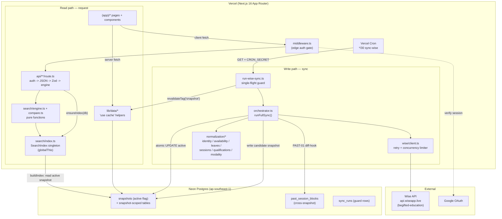

# System Architecture

## Purpose

BGScheduler is a tutor-availability search and scheduling tool for non-technical admin staff. The whole system is built on one architectural bet: **the source of truth — the Wise scheduling platform — is slow and rate-limited, so it is never queried on the request path.** A background sync pipeline periodically pulls everything out of Wise, normalizes it into canonical Postgres tables under an immutable *snapshot*, and a process-global in-memory index serves all search/compare reads from RAM. A user request touches Postgres only for the occasional index rebuild and a handful of cached lookups; the hot path is pure in-memory computation.

This document describes the layered pipeline end to end, the snapshot-versioned data model and how a new snapshot is promoted atomically, the in-memory `SearchIndex` singleton and its stale-detection logic, and the fail-closed safety rule that governs what the system is allowed to call "Available." It closes with a request-lifecycle walkthrough.

For mechanical detail — exact table columns, endpoint request/response signatures — this handbook defers to the per-feature documents under [`docs/features/`](../features/) and the reference under [`docs/reference/`](../reference/). This page owns the *shape* and the *why*.

## The layers, top to bottom

Data flows in one direction during a sync (Wise → Postgres → snapshot promotion) and in the opposite direction during a request (UI → API → in-memory index). The layers are physically separated into directories under `src/lib/`, and lower layers know nothing of the upper ones.

| Layer | Location | Responsibility | Depends on |
|---|---|---|---|
| **Wise API client** | `src/lib/wise/` | Rate-limited, retrying HTTP client + domain fetchers for teachers, availability, sessions | env vars only (no internal imports) |
| **Normalization** | `src/lib/normalization/` | Turn raw Wise payloads into canonical internal shapes (identity, qualifications, availability, leaves, sessions, modality, timezone) | Wise types |
| **Sync orchestrator** | `src/lib/sync/orchestrator.ts` | The full ETL: fetch → normalize → persist → validate → promote | Wise client, all normalization modules, DB |
| **DB layer** | `src/lib/db/` | Neon Postgres connection singleton + Drizzle schema | `@neondatabase/serverless`, `drizzle-orm` |
| **Snapshot tables** | (Postgres) | Versioned, point-in-time normalized data keyed by `snapshot_id` | — |
| **In-memory `SearchIndex`** | `src/lib/search/index.ts` | One denormalized aggregate per tutor, loaded from the active snapshot, held process-global | DB layer, schema |
| **Search / compare engines** | `src/lib/search/engine.ts`, `compare.ts`, `range-search.ts` | Pure functions that compute availability, conflicts, free slots against the index | the index |
| **Server data layer** | `src/lib/data/` | Cached server-only read helpers (`"use cache"`) for Server Components | DB, schema |
| **API routes** | `src/app/api/` | Auth gate → load index / read DB → call engine → serialize JSON | auth, DB, index, engines |
| **UI** | `src/app/(app)/`, `src/components/` | Server Components fetch via the data layer; client shells fetch the API routes | data layer, API routes |

The Wise client has no internal imports — it takes only configuration (`WiseClientConfig`, `src/lib/wise/client.ts:1`). The normalization modules depend only on Wise types. The orchestrator (`src/lib/sync/orchestrator.ts`) is the single place that wires fetch + normalize + persist together; its imports are exactly the Wise client, the seven normalization concerns, and the schema (`src/lib/sync/orchestrator.ts:1-20`).

### Container / data-flow diagram



## The snapshot-versioned data model

A **snapshot** is an immutable point-in-time copy of all normalized Wise data, identified by a UUID `snapshot_id`. Every tutor-data row carries a `snapshotId` foreign key, so a snapshot is a complete, self-contained dataset. Exactly one snapshot row has `active = true` at a time; that is the snapshot the application reads.

### Why snapshots

Wise is the only production source of truth, and it is slow and rate-limited. The sync builds an entirely new candidate snapshot in the background while the previous one keeps serving traffic, then flips the `active` pointer in a single statement. A failed or partial sync never corrupts what readers see — the candidate is simply never promoted, and the prior snapshot stays active (`src/lib/sync/orchestrator.ts:472-501`).

### One sync, one snapshot — the orchestrator

`runFullSync(db, client, instituteId, options)` (`src/lib/sync/orchestrator.ts:50`) is the whole ETL inside a single `try/catch`. Its numbered steps:

1. **Acquire a sync-run row.** Insert `sync_runs` with `status: "running"` unless the caller already passed a `syncRunId` from the single-flight guard (`orchestrator.ts:61-68`).
2. **Create a candidate snapshot** with `active: false` and link it back to the sync run (`orchestrator.ts:70-81`).
3. **Fetch all teachers** from Wise (`orchestrator.ts:83-84`).
4. **Load aliases** from the cross-snapshot `tutor_aliases` table (`orchestrator.ts:86-91`).
5. **Resolve identities** via `resolveIdentities()` — the cascade that merges Wise teacher records into identity groups, emitting `data_issues` for anything unresolved (`orchestrator.ts:93-105`).
6. **Persist identity groups + members**, recording a `canonicalKey → db group id` map (`orchestrator.ts:107-139`). Members are inserted in chunks of `INSERT_CHUNK_SIZE = 250` to stay under the Postgres parameter ceiling (`orchestrator.ts:38, 137-139`).
7. **Per teacher, fetch availability + leaves**, normalize working hours and leaves, store raw tags, and normalize qualifications. Each teacher runs in its own `try/catch`; a per-teacher failure pushes a `completeness` `data_issue` and continues — it does not abort the sync (`orchestrator.ts:141-260`).
8. **Fetch and normalize future sessions** into blocking/non-blocking blocks via `normalizeSessions()` (`orchestrator.ts:262-305`).
9. **Derive modality per group** (`deriveModality()`), update each group's `supportedModality`, compute per-teacher modality, and build `tutors` rows (`orchestrator.ts:307-362`). A second pass runs the MOD-01 per-session contradiction check (`detectSessionModalityConflict()`), emitting `conflict_model` issues; it reads `supportedModality` from an in-memory map hoisted in step 9 so it needs no per-session SELECT (`orchestrator.ts:364-398`).
   - **9.5 — PAST-01 diff-hook.** `runPastSessionsDiffHook()` captures sessions that dropped out of the Wise FUTURE feed into `past_session_blocks` *before* promotion, because the prior snapshot must still be `active = true` when the hook reads it (`orchestrator.ts:400-418`). Per-group errors emit `completeness` issues and do not abort.
   - Availability windows get their final modality backfilled, then all bulk rows (windows, leaves, raw tags, qualifications, session blocks, tutors) are inserted in chunked `Promise.all` batches (`orchestrator.ts:420-443`).
10. **Store all `data_issues`** in chunks (`orchestrator.ts:445-450`).
11. **Compute and store `snapshot_stats`** — teacher/group/qualification/leave/session/issue counts and an `issuesByType` histogram (`orchestrator.ts:452-470`).
12. **Validate and promote** (below).

If any step throws, the outer `catch` marks the sync run `failed` with an `errorSummary` and returns `success: false` — no promotion happens (`orchestrator.ts:561-599`). The cleanup `UPDATE` is itself wrapped so that a cleanup failure is logged (REL-06) but does not mask the original error (`orchestrator.ts:573-585`).

### Atomic promotion

Promotion is gated on identity-resolution health. The orchestrator computes `unresolvedRatio = identityIssues.length / max(groups.length, 1)` and promotes only when `unresolvedRatio < 0.5` — i.e. a sync where more than half the identity groups are unresolved is treated as catastrophically broken and is **not** promoted (`orchestrator.ts:472-476`).

When it does promote, it flips the active pointer with a **single bounded `UPDATE`** (`orchestrator.ts:488-501`):

```sql
UPDATE snapshots
SET active = (snapshots.id = $candidateId)
WHERE active = true OR snapshots.id = $candidateId;
```

This sets `active = true` for the candidate and `active = false` for the previously-active row in one statement. The code comment (REL-01) explains the guarantee: PostgreSQL MVCC plus the row-level lock held for the duration of one statement means a concurrent reader sees either the old active row or the new one — never a window with zero rows matching `active = true` (`orchestrator.ts:480-498`). The bounded `WHERE` touches only the old-active row(s) and the candidate, avoiding a full-table rewrite. It replaces an earlier two-`UPDATE` sequence that could briefly leave no active snapshot.

After a successful promotion the run is marked `success` with `finishedAt`, `promotedSnapshotId`, `teacherCount`, and metadata (`orchestrator.ts:508-518`). Only then does it call `pruneOldSnapshots()` to delete snapshots beyond the retention window; pruning failures are caught, logged, and recorded in the run metadata but never fail the sync (`orchestrator.ts:520-548`). Retention is `SNAPSHOT_RETENTION_COUNT = 30` snapshots (`src/lib/sync/snapshot-pruning.ts:5`).

### Cross-snapshot tables

Almost everything is snapshot-scoped and gets pruned with its snapshot. The deliberate exceptions are tables that must survive snapshot rotation:

- **`tutor_aliases`** — manual identity overrides read at sync step 4 (`orchestrator.ts:86-91`).
- **`past_session_blocks`** — sessions that fell out of Wise's FUTURE feed, keyed by the stable `group_canonical_key` rather than `snapshot_id` (`src/lib/sync/past-sessions-diff-hook.ts:116-163`). Inserts use `onConflictDoNothing` on `wise_session_id` for idempotency (`past-sessions-diff-hook.ts:160-163`). This is why `canonicalKey` is denormalized onto each in-memory tutor group (D-04) — the compare/past-sessions path can resolve the cross-snapshot anchor without an extra DB round-trip (`src/lib/search/index.ts:67-71, 260-263`).
- **`sync_runs`** survives but has its `snapshotId` / `promotedSnapshotId` nullified when the referenced snapshot is pruned (`snapshot-pruning.ts` row-count fields `syncRunsSnapshotIdNullified` / `syncRunsPromotedSnapshotIdNullified`).

### The single-flight guard

The orchestrator is wrapped by `runWiseSyncRequest()` (`src/lib/sync/run-wise-sync.ts:142`), which enforces that only one sync runs at a time:

1. **Fail stale running rows.** Any `sync_runs` row stuck in `running` longer than `STALE_RUNNING_SYNC_MS = 20 minutes` is marked `failed` first, on the assumption it timed out or was aborted (`run-wise-sync.ts:10, 51-72`).
2. **Detect a live run.** If a `running` row still exists, return HTTP **202** with a `skipped/alreadyRunning` payload — the caller is told data will refresh when the active run finishes (`run-wise-sync.ts:88-97, 120-140, 148-150`).
3. **Acquire.** Otherwise insert a fresh `running` row. A `23505` unique-violation race re-checks for the winner and yields the skip path rather than double-running (`run-wise-sync.ts:99-118`).
4. **Run + revalidate.** On success, call `revalidateTag("snapshot", { expire: 0 })` to evict the cached server-data helpers, then return 200 (or 500 on failure) (`run-wise-sync.ts:160-166`).

## The in-memory `SearchIndex` singleton

All search/compare reads run against an in-RAM aggregate, not Postgres. The shape is one `IndexedTutorGroup` per tutor with everything pre-joined — qualifications, Wise records, availability windows, leaves, session blocks, data issues, and an optional business profile (`src/lib/search/index.ts:65-81`). The top-level `SearchIndex` also carries `snapshotId`, `profileVersion`, `builtAt`, `syncedAt`, the flat `tutorGroups` array, and a `byWeekday: Map<number, IndexedTutorGroup[]>` lookup for O(1) candidate retrieval per weekday (`index.ts:83-90, 321-331`).

### globalThis anchoring

The index and its in-flight build promise are anchored on `globalThis`, not module-level `let` bindings, so they survive Next.js hot-module reloads in dev and persist across requests in the same serverless instance (`index.ts:92-113`):

```ts
declare global {
  var __bgscheduler_searchIndex: SearchIndex | null;
  var __bgscheduler_searchIndexBuildPromise: Promise<SearchIndex> | null;
}
```

The DB connection follows the same pattern — `getDb()` memoizes a Neon-http Drizzle client on `globalThis.__bgscheduler_db` (`src/lib/db/index.ts:16-27`).

### Building the index

`buildIndex(db)` (`index.ts:142`) reads the active snapshot and assembles the aggregate:

1. Find the row where `snapshots.active = true`; throw `"No active snapshot found"` if none (`index.ts:143-153`).
2. Resolve `syncedAt` from the most recent `success` sync run that promoted this snapshot, falling back to the snapshot's `createdAt` (`index.ts:155-166`). `syncedAt` is what staleness is measured against.
3. Load all snapshot-scoped tables for that `snapshotId` in parallel — members, qualifications, availability windows, leaves, future session blocks, data issues — plus the business-profile map and the profile version (`index.ts:169-222`).
4. Group every child table by `groupId`, attach issues to groups by matching `entityId`/`entityName` against the group's canonical key / id / display name, and map each group into an `IndexedTutorGroup` (`index.ts:224-319`). `supportedModes` is derived from `supportedModality`: `both → ["online","onsite"]`, `unresolved → []`, otherwise the single mode (`index.ts:265-270`).
5. Build the `byWeekday` map from each group's availability windows (`index.ts:321-331`).
6. Store the result on the singleton and return it (`index.ts:333-343`).

### Stale detection and rebuild

`ensureIndex(db)` (`index.ts:354`) is what every read path calls. It decides whether the cached index is still valid:

- **In-flight short-circuit.** If a build promise already exists on `globalThis`, return it immediately — before any other work (`index.ts:355-359`).
- **Freshness check.** If a cached index exists, it re-reads the active snapshot id and the current profile version, and returns the cache **only if both match** the cached `snapshotId` and `profileVersion` (`index.ts:366-387`). A snapshot promotion changes the active id; a tutor-profile edit changes the profile version (`getTutorProfileVersion()` is `count:maxUpdatedAt` over `tutor_business_profiles`, `index.ts:128-137`). Either mismatch forces a rebuild.
- **Defensive fallback.** If there is no active snapshot at all but a cache exists, it keeps serving the stale cache rather than throwing (`index.ts:384-386`).

#### Race coalescing (REL-02)

The subtle part is concurrency. `ensureIndex` assigns the in-flight build promise to the `globalThis` singleton **synchronously, in the same tick, before any `await` yields** (`index.ts:391-400`):

```ts
const p = buildAndCheck().finally(() => { setBuildingPromise(null); });
setBuildingPromise(p);
return p;
```

Because the assignment happens before the first microtask boundary, a concurrent caller arriving during the freshness-check `await` sees the promise via `getBuildingPromise()` and returns early at the top of the function (`index.ts:355-359`). The result: under a thundering herd, exactly one rebuild runs and every caller awaits the same promise. The pattern (singleton promises) is cited in the code (`index.ts:346-353`).

### Two staleness concepts — index freshness vs. data staleness

These are independent:

- **Index freshness** (above) is *correctness*: is the in-memory index built from the currently-active snapshot? A mismatch triggers a rebuild.
- **Data staleness** is *warning, never withholding*. `executeSearch` compares `now - index.syncedAt` against `API_STALE_THRESHOLD_MS = 90 minutes`; if exceeded it sets `snapshotMeta.stale = true` and appends a non-blocking warning string, but still returns full results (`src/lib/search/engine.ts:30-39`; `src/lib/ops/stale.ts:1-6`). A separate UI banner threshold of 2 hours exists for the app shell (`stale.ts:3`). Stale data is surfaced, not hidden.

### Server-data layer and Next.js caching

Server Components do not touch the in-memory index; they read through cached helpers in `src/lib/data/` that use Next.js 16's `"use cache"` directive (enabled by `cacheComponents: true` in `next.config.ts`). `loadTutorList` / `loadFilterFacets` tag their cache `cacheTag("snapshot")` with `cacheLife("hours")` (`src/lib/data/tutors.ts:81-83`, `src/lib/data/filters.ts:53-55`). When a sync promotes a new snapshot, `runWiseSyncRequest` calls `revalidateTag("snapshot")`, evicting all of them at once (`run-wise-sync.ts:161`).

The past-sessions helper is deliberately tagged `"past-sessions"`, **not** `"snapshot"`, with `cacheLife("days")`, so it is not swept on every sync — captured past data is cross-snapshot and long-lived (`src/lib/data/past-sessions.ts:87-89`; the separation is regression-guarded by tests).

## The fail-closed rule

The non-negotiable product invariant: **never present a tutor as "Available" unless availability is provable from normalized Wise data.** When identity, modality, or qualification cannot be resolved, the tutor is routed to **"Needs Review"**, never silently returned as available, and never guessed.

This is enforced at two boundaries.

**At sync time**, anything unresolved becomes a typed `data_issue` rather than a fabricated value: unresolved identities are `alias`/`critical` issues (`orchestrator.ts:96-105`), missing Wise user ids and per-teacher fetch failures are `completeness` issues (`orchestrator.ts:162-173, 249-259`), unmapped tags are `tag` issues (`orchestrator.ts:238-248`), and modality contradictions are `conflict_model` issues (`orchestrator.ts:381-397`). Availability windows and group modality start life as `"unresolved"` and are only overwritten once a confident value is derived (`orchestrator.ts:118, 192, 326-329`).

**At query time**, `searchSlot` in the engine enforces the routing (`src/lib/search/engine.ts:60-150`):

- Any group with `dataIssues.length > 0` accumulates review reasons (`engine.ts:85-88`).
- `supportedModes.length === 0` (i.e. `supportedModality = "unresolved"`) adds `"Unresolved modality"` (`engine.ts:90-92`).
- A candidate that clears availability, qualification, blocking-session, and leave checks is pushed to **`available`** only if it has **zero** review reasons; otherwise it goes to **`needsReview`** with its reasons attached (`engine.ts:127-147`).

Blocking is also fail-closed in the normalization layer: cancelled sessions are non-blocking, but an **unknown** session status is treated as **blocking** (`normalizeSessions`, `src/lib/normalization/sessions.ts`, invoked at `orchestrator.ts:272`). In the engine, recurring-mode blocking matches any blocking session on the same weekday/time overlap, while one-time mode requires an exact-date overlap (`engine.ts:155-188`). Leaves block in both modes, with a documented REL-04 rule that multi-day leaves block every weekday they touch in full (`engine.ts:251-289`).

## Authentication and the edge gate

Every non-public request passes through `src/middleware.ts`, which runs the edge variant of Auth.js (`edgeAuth`, `middleware.ts:1, 37`):

- **Public allowlist.** `isPublicRoute()` lets through `/login`, `/api/auth/*`, the public NL search assistant, the floor-plan map, the LINE webhook + two OA-resolver endpoints, and everything under `/api/internal/` (`middleware.ts:4-15`). Internal cron routes are public to the middleware because they authenticate themselves with `CRON_SECRET`.
- **Auth requirement.** Any other path with no session is redirected to `/login` with a `callbackUrl` (`middleware.ts:44-49`).
- **Page-level access control.** Authenticated users may carry `allowedPages`; `null` means full admin access. A restricted user hitting a disallowed path gets a `403` JSON for `/api/*` routes, or is redirected to their first allowed page for UI routes, with a self-redirect-loop guard (`middleware.ts:25-62`).
- **Matcher.** The middleware runs on everything except `_next/static`, `_next/image`, and `favicon.ico` (`middleware.ts:67-69`).

Internal cron routes authenticate with a **constant-time** `CRON_SECRET` comparison (REL-07): a length pre-check (itself O(1), avoiding the `RangeError` `timingSafeEqual` throws on length-mismatched buffers) followed by `crypto.timingSafeEqual` (`src/app/api/internal/sync-wise/route.ts:13-31`; shared helper at `src/lib/internal/cron-auth.ts:6-26`). The Wise-sync route additionally accepts an Auth.js session on `POST` for manual admin triggers, and carries `maxDuration = 800` for Pro-plan headroom (`route.ts:6, 37-92`).

### Configuration boundary

All required configuration is validated once at startup by `src/lib/env.ts`. A Zod schema declares 9 required vars (`DATABASE_URL`, the four `AUTH_*`/Google vars, `WISE_USER_ID`/`WISE_API_KEY`, `CRON_SECRET`) — `WISE_NAMESPACE` and `WISE_INSTITUTE_ID` have defaults — plus 3 optional LINE vars; an invalid environment logs only `fieldErrors` (never values) and throws `"Invalid environment variables"` (`env.ts:3-29`). This fail-fast guards against a half-configured deploy serving traffic.

## The Wise client layer

The Wise client (`src/lib/wise/client.ts`) is the only thing that talks to `api.wiseapp.live`, and it has no internal imports — it is pure HTTP plus resilience. Two mechanisms protect against Wise being slow or rate-limited:

- **Bounded concurrency.** A hand-rolled limiter caps in-flight requests at `maxConcurrency` (default **5**, raised for production sync) and queues the rest (`client.ts:38-49`).
- **Selective retry (REL-05).** Only transient status codes — `408, 429, 500, 502, 503, 504` — are retried (default `maxRetries = 3`); permanent 4xx like `401/403/404/422` fail fast so the retry budget is not wasted on errors that will not fix themselves (`client.ts:17-30, 49, 123`).

Auth is Basic (`base64(userId:apiKey)`) plus `x-api-key`, `x-wise-namespace`, and a `VendorIntegrations/{namespace}` user-agent (`client.ts:52-61`). The fetchers in `src/lib/wise/fetchers.ts` build on this for teachers, availability/leaves, and future sessions (used at `orchestrator.ts:11, 84, 176, 263`).

> **Transaction note.** The primary driver is Neon-http (`@neondatabase/serverless` + `drizzle-orm/neon-http`, `src/lib/db/index.ts:1-11`), which has no transaction support — which is why the snapshot promotion is engineered as a single atomic `UPDATE` rather than a multi-statement transaction. The one place that genuinely needs transactions (payroll sync) reaches for `node-postgres` (`pg`) separately (`src/lib/payroll/sync.ts`).

## Request lifecycle

### A search request (client → API → index → engine)

1. **Edge gate.** The browser `POST`s to `/api/search`. `middleware.ts` matches the path, finds it is not public, confirms a session exists, and (for a restricted user) checks `allowedPages` before letting the request through (`middleware.ts:37-64`).
2. **Handler auth + validation.** The route handler calls `auth()` → 401 if no session; parses the body in a `try/catch` → 400 on bad JSON; then `searchRequestSchema.safeParse()` → 400 with `.flatten()` on a schema miss (`src/app/api/search/route.ts:31-50`). This is the uniform auth → JSON → Zod → try/catch shape every reading/mutating route follows.
3. **Ensure the index.** `ensureIndex(getDb())` returns the warm singleton if the active snapshot id and profile version still match the cache, or rebuilds from the active snapshot otherwise — coalescing concurrent rebuilds (`route.ts:52-55`; `index.ts:354-401`).
4. **Execute in memory.** `executeSearch(index, request)` runs entirely in RAM: per slot it pulls candidates from `byWeekday`, applies modality / availability-window / qualification / blocking-session / leave checks, splits each tutor into `available` vs `needsReview` (fail-closed), then computes the cross-slot intersection of tutors available in *all* requested slots (`src/lib/search/engine.ts:22-58, 323-342`). It also stamps `snapshotMeta` (id, `syncedAt`, `stale`) and `latencyMs`.
5. **Serialize.** The handler returns the `SearchResponse` as JSON; any thrown error becomes a 500 with the error message (`route.ts:56-61`).

No Wise call and no tutor-table query happens on this path — only the occasional index rebuild touches Postgres.

### A server-rendered page (Server Component → data layer → Postgres)

A page like `/search` is an async Server Component that fetches through the cached data layer (`loadTutorList`, `loadFilterFacets`) rather than the in-memory index. Those helpers run `"use cache"` keyed on `cacheTag("snapshot")`, so repeated renders are served from the Next.js cache until a sync calls `revalidateTag("snapshot")` (`src/lib/data/tutors.ts:81-83`; `src/lib/sync/run-wise-sync.ts:161`). The page passes data as props into a `"use client"` shell, which then issues the interactive `/api/search` and `/api/compare` calls described above.

### A sync run (cron → guard → orchestrator → promotion → revalidate)

1. **Trigger.** Vercel Cron fires `GET /api/internal/sync-wise` every 30 minutes (`*/30 * * * *`, `vercel.json`). The handler validates `CRON_SECRET` in constant time; a valid secret runs the sync wrapped in a cron-invocation audit (`src/app/api/internal/sync-wise/route.ts:13-49`).
2. **Single-flight.** `runWiseSyncRequest()` fails any stale `running` rows (>20 min), and if a live run is in progress returns 202 without re-running; otherwise it inserts a guard row and proceeds (`run-wise-sync.ts:142-153`).
3. **ETL + atomic promote.** `runFullSync()` builds the candidate snapshot, runs the PAST-01 diff-hook before promotion, then flips `active` with the single bounded `UPDATE` — only if `unresolvedRatio < 0.5` (`orchestrator.ts:50-501`).
4. **Cache eviction.** On success, `revalidateTag("snapshot")` evicts the server-data helpers; the next `ensureIndex` call observes the new active snapshot id and lazily rebuilds the in-memory index on first read (`run-wise-sync.ts:160-166`; `index.ts:366-388`).

## Where to go next

- **Data flow in depth** (every cron lineage, not just Wise): [`data-flow.md`](data-flow.md).
- **Feature meaning, rules, and flows**: [`docs/features/`](../features/).
- **Mechanical reference** — table columns, endpoint signatures, cron schedules, env vars: [`docs/reference/`](../reference/).
- **Conventions** governing the code style these layers share: [`conventions.md`](conventions.md).

_Verified against HEAD `d4fe6d3` on 2026-06-05._
