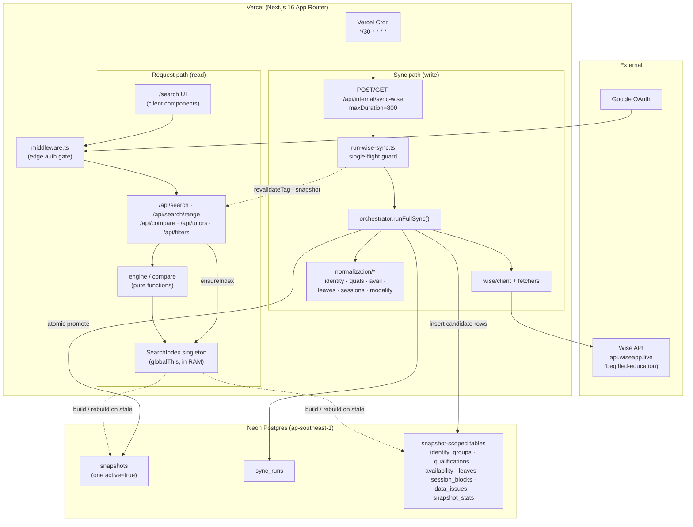

# System Architecture

## Purpose

BGScheduler is a tutor-availability search and scheduling tool for non-technical admin staff. The entire system is organized around one architectural bet: **the source of truth (the Wise scheduling platform) is slow and rate-limited, so we never query it on the request path.** Instead, a background sync pipeline periodically pulls everything out of Wise, normalizes it into canonical Postgres tables under a versioned *snapshot*, and a process-global in-memory index serves all reads from RAM. Admin requests touch the database only for the occasional index rebuild and a handful of cached lookups — the hot path is pure in-memory computation.

This document describes the layered pipeline end to end, the snapshot-versioned data model and how a new snapshot is promoted atomically, the in-memory `SearchIndex` singleton and its stale-detection logic, and the fail-closed safety rule that governs what the system is allowed to call "Available." It closes with a request-lifecycle walkthrough.

For mechanical detail — exact table columns, endpoint request/response signatures — this handbook defers to the per-feature documents under `docs/features/` (e.g. [`tutor-search.md`](../features/tutor-search.md), [`tutor-compare.md`](../features/tutor-compare.md), [`data-health.md`](../features/data-health.md)). This page owns the *shape* and the *why*.

## The layers, top to bottom

Data flows in one direction during a sync (Wise → Postgres → snapshot promotion) and in the opposite direction during a request (UI → API → in-memory index). The layers are physically separated into directories under `src/lib/`:

| Layer | Location | Responsibility | Depends on |
|---|---|---|---|
| **Wise API client** | `src/lib/wise/` | Rate-limited, retrying HTTP client + domain fetchers for teachers, availability, sessions | env vars only |
| **Normalization** | `src/lib/normalization/` | Turn raw Wise payloads into canonical internal shapes (identity, qualifications, availability, leaves, sessions, modality, timezone) | Wise types |
| **Sync orchestrator** | `src/lib/sync/orchestrator.ts` | The full ETL: fetch → normalize → persist → validate → promote | Wise client, all normalization modules, DB |
| **DB layer** | `src/lib/db/` | Neon Postgres connection singleton + Drizzle schema | `@neondatabase/serverless`, `drizzle-orm` |
| **Snapshot tables** | (Postgres) | Versioned, point-in-time normalized data keyed by `snapshot_id` | — |
| **In-memory `SearchIndex`** | `src/lib/search/index.ts` | One denormalized aggregate per tutor, loaded from the active snapshot, held process-global | DB layer, schema |
| **Search / compare engines** | `src/lib/search/engine.ts`, `compare.ts`, `range-search.ts` | Pure functions that compute availability, conflicts, and free slots against the index | the index |
| **API routes** | `src/app/api/` | Auth gate → load index → call engine → serialize JSON | auth, DB, index, engines |
| **UI** | `src/app/(app)/`, `src/components/` | Client components that fetch the API routes | API routes |

The lower layers know nothing about the upper ones. The Wise client has no internal imports; the normalization modules depend only on Wise types; the orchestrator is the single place that wires fetch + normalize + persist together.

### Container / data-flow diagram



Solid arrows are the steady-state flow; dashed arrows fire only on a snapshot change (index rebuild, cache invalidation).

## The snapshot-versioned data model

Every piece of tutor data the system serves belongs to exactly one **snapshot** — a versioned, point-in-time capture. The `snapshots` table itself is deliberately tiny: an `id`, a boolean `active` flag (default `false`), and a `created_at` timestamp (`src/lib/db/schema.ts:165`–`169`). All the real data lives in snapshot-scoped tables that carry a `snapshot_id` foreign key: identity groups and members, qualifications, availability windows, leaves, future session blocks, data issues, and snapshot stats (each `.references(() => snapshots.id)`, e.g. `schema.ts:613` onward).

The invariant: **at most one snapshot has `active = true` at any time.** That active snapshot is the one the in-memory index loads and the one every read is scoped to.

This design buys two things:

1. **A failed sync never corrupts live data.** A sync builds an entirely new, inactive snapshot alongside the current one. If anything goes wrong, the new snapshot is simply never promoted, and the previously active snapshot keeps serving traffic untouched.
2. **Promotion is a single atomic flip.** Going live with new data is one boolean change, not a destructive in-place rewrite.

`sync_runs` records the metadata of each sync attempt: `status` (`running`/`success`/`failed`), `started_at`/`finished_at`, the candidate `snapshot_id` it built, and — critically — `promoted_snapshot_id`, which is set only if that run actually promoted its snapshot (`schema.ts:171`–`186`). The index uses `promoted_snapshot_id` to find the timestamp of the sync that last promoted the active snapshot, which becomes the `syncedAt` basis for staleness (`src/lib/search/index.ts:155`–`166`).

### The sync pipeline, step by step

`runFullSync()` (`src/lib/sync/orchestrator.ts:50`) executes the entire ETL inside one big try/catch. The numbered steps in the code map cleanly to ETL phases:

1. **Acquire a sync run** — either reuse a guard row the caller already inserted, or insert a fresh `sync_runs` row with `status: "running"` (`orchestrator.ts:62`–`68`).
2. **Create a candidate snapshot** with `active: false` and record its id on the sync run (`orchestrator.ts:71`–`81`).
3. **Fetch all teachers** from Wise (`orchestrator.ts:84`).
4. **Load aliases** (the `tutor_aliases` table feeds identity resolution) (`orchestrator.ts:87`).
5. **Resolve identities** — group raw Wise teacher records into logical people via the 5-step cascade; unresolved ones become `data_issues` of type `alias` with `critical` severity (`orchestrator.ts:94`–`105`).
6. **Persist identity groups and members** (`orchestrator.ts:111`–`139`).
7. **Per-teacher availability, leaves, tags, qualifications** — for each teacher, fetch full availability, normalize working hours into recurring windows, normalize leaves (UTC→Asia/Bangkok), store raw tags, and parse tags into qualifications. A missing Wise user id or a fetch failure is logged as a `completeness` data issue *without aborting the whole sync* (`orchestrator.ts:156`–`260`).
8. **Fetch and normalize future sessions** into blocking windows, mapping each session back to its teacher's group (`orchestrator.ts:263`–`305`).
9. **Derive modality per group** — onsite/online/both/unresolved — write it to the group, and create the tutor display record (`orchestrator.ts:307`–`362`). A follow-up pass detects per-session modality contradictions and emits `conflict_model` issues (`orchestrator.ts:367`–`398`).
10. **(9.5) Past-sessions diff hook** — captures sessions that have dropped out of Wise's FUTURE feed into `past_session_blocks` for historical compare fallback. This *must* run before promotion, while the prior snapshot is still `active = true` (`orchestrator.ts:400`–`418`).
11. **Bulk-insert** availability, leaves, raw tags, qualifications, session blocks, and tutor rows in parallel, chunked at 250 rows per insert (`orchestrator.ts:38`, `:424`–`443`).
12. **Store data issues and snapshot stats** (`orchestrator.ts:446`–`470`).
13. **Validate and promote** (see below).

Per-teacher and per-session errors are isolated into `data_issues` and do not abort the run; only a top-level throw lands in the outer `catch`, which marks the sync run `failed`, sets `finishedAt`, and records the error summary — leaving the previously active snapshot in place (`orchestrator.ts:561`–`599`).

### Atomic promotion

Promotion is gated by a completeness check: the sync computes the ratio of unresolved identity groups to total groups, and **promotes only if fewer than 50% are unresolved** (`orchestrator.ts:473`–`476`). A catastrophically broken fetch (where most tutors couldn't be identity-resolved) therefore *cannot* go live.

When it does promote, it is a single `UPDATE` statement, not two:

```sql
-- conceptually, from orchestrator.ts:488–498
UPDATE snapshots
SET active = (snapshots.id = $candidateId)
WHERE active = true OR snapshots.id = $candidateId;
```

The comment at `orchestrator.ts:480`–`487` spells out the reasoning (tracked as `REL-01`): PostgreSQL MVCC plus the row-level lock held for the duration of one statement guarantees that any concurrent reader sees *either* the old active row *or* the new one — there is never an instant where zero rows satisfy `active = true`. Setting `active` to the boolean expression `(id = candidateId)` in one pass demotes the old active snapshot and promotes the candidate simultaneously. The bounded `WHERE` keeps the rewrite to just the previous-active row(s) and the candidate, avoiding a full-table rewrite. This replaced an earlier, racier two-`UPDATE` sequence.

After promotion the run is marked `success` with `promoted_snapshot_id` set, old snapshots are pruned (best-effort; pruning failures are logged but don't fail the sync), and the result is returned (`orchestrator.ts:508`–`560`).

### Single-flight guard around sync

The sync route is shared by Vercel cron (`GET`) and manual triggers (`POST`); both funnel through `runWiseSyncRequest()` (`src/lib/sync/run-wise-sync.ts:142`). Before doing any work it acquires a sync run via `acquireSyncRun()`:

- **Stale-running cleanup:** any `sync_runs` row stuck in `running` for more than 20 minutes (`STALE_RUNNING_SYNC_MS`, `run-wise-sync.ts:10`) is force-marked `failed` — this recovers from a function that timed out or was aborted mid-run (`run-wise-sync.ts:51`–`72`).
- **Overlap skip:** if a genuinely-running sync already exists, the request returns HTTP `202` with a "skip" body rather than starting a second concurrent sync (`run-wise-sync.ts:93`–`97`, `:148`–`150`).
- **Belt-and-suspenders at the DB:** even if two requests race past the in-app check, the `sync_runs_single_running_idx` *partial unique index* (`unique on status WHERE status = 'running'`, `schema.ts:182`–`184`) makes a second concurrent `running` insert fail with a unique-violation (`23505`), which the runner catches and converts into the same skip result (`run-wise-sync.ts:99`–`118`).

On success, the runner calls `revalidateTag("snapshot", { expire: 0 })` (`run-wise-sync.ts:161`), invalidating the Next.js `"use cache"` entries that the filters and tutors lookups tag with `cacheTag("snapshot")` (`src/lib/data/filters.ts:54`, `src/lib/data/tutors.ts:82`). (The past-sessions cache uses a deliberately separate `"past-sessions"` tag, so it is *not* swept by a snapshot promotion — `src/lib/data/past-sessions.ts:88`.) The in-memory index is not invalidated here; it detects the change lazily on the next request (next section).

## The in-memory SearchIndex singleton

All availability logic runs against a single denormalized structure in process memory, not the database. `buildIndex()` (`src/lib/search/index.ts:142`) does the heavy lifting once:

1. Finds the active snapshot; throws `"No active snapshot found"` if none exists (`index.ts:144`–`152`).
2. Derives `syncedAt` from the most recent successful sync that promoted this snapshot (`index.ts:155`–`166`).
3. Loads every snapshot-scoped table **in parallel** with `Promise.all` — members, qualifications, availability windows, leaves, session blocks, data issues, business profiles, and a profile-version fingerprint (`index.ts:175`–`222`).
4. Groups each table by `groupId` and assembles one `IndexedTutorGroup` aggregate per tutor, carrying its qualifications, Wise records, availability windows, leaves, session blocks, and data issues (`index.ts:250`–`319`).
5. Builds a `byWeekday: Map<number, IndexedTutorGroup[]>` lookup so a search for a given day touches only the tutors who have availability that weekday — O(1) day access instead of scanning all tutors (`index.ts:322`–`331`).

The finished `SearchIndex` carries the `snapshotId`, a `profileVersion`, `builtAt`/`syncedAt` timestamps, the tutor groups, and the weekday map (`index.ts:83`–`90`).

### globalThis anchoring and HMR survival

The index is *not* a module-level `let`. It is stored on `globalThis` (`globalThis.__bgscheduler_searchIndex`, `index.ts:94`–`105`), as is the DB singleton (`globalThis.__bgscheduler_db`, `src/lib/db/index.ts:16`–`27`). The reason, noted in both files, is that Next.js hot-module-reload in development replaces module instances and would otherwise discard a module-scoped singleton on every edit; anchoring to `globalThis` lets the warm index and the DB connection survive HMR. In production each serverless instance keeps its own copy until it is recycled.

### Stale detection and rebuild

API routes never call `buildIndex()` directly — they call `ensureIndex(db)` (`index.ts:354`), which decides whether the cached index is still valid:

- If there is no cached index, it builds one.
- If a cached index exists, it checks **two** things against the database: that the active snapshot id still matches `cached.snapshotId`, **and** that the tutor-business-profile fingerprint still matches `cached.profileVersion` (`index.ts:368`–`383`). A change in *either* triggers a full rebuild. (The profile-version check exists because business profiles can change without a new Wise snapshot.)
- Defensive edge case: if the DB momentarily reports *no* active snapshot, `ensureIndex` returns the stale cached index rather than throwing (`index.ts:384`–`386`).

This is how a freshly promoted snapshot reaches readers: the next request after promotion sees `activeSnapshot.id !== cached.snapshotId` and rebuilds. There is no push from the sync side to the index — it is pull-on-next-request.

### Race coalescing

A subtle concurrency bug lurks here: if N requests arrive simultaneously while no index exists (cold start), a naive implementation would kick off N parallel rebuilds. `ensureIndex` prevents this with a **singleton-promise** pattern (tracked as `REL-02`, `index.ts:346`–`401`). The in-flight build promise is itself stored on `globalThis` and assigned *synchronously*, before any `await` yields to the microtask queue:

- The very first thing `ensureIndex` does is check for an in-flight promise and return it if present (`index.ts:358`–`359`).
- The work closure is created but not awaited until *after* its resulting promise has been written to the singleton in the same synchronous tick (`index.ts:396`–`400`).
- A `.finally()` clears the in-flight promise once the build settles.

So a concurrent caller arriving mid-build short-circuits to the same promise instead of starting a competing rebuild.

### Staleness as a warning, not an error

Distinct from *index* staleness (wrong snapshot → rebuild) is *data* staleness (the active snapshot is simply old). The search engine computes `stale = now − syncedAt > threshold` where the threshold is `API_STALE_THRESHOLD_MS = 90 minutes` (`src/lib/ops/stale.ts:2`), and when stale it pushes a human-readable warning into the response `warnings` array and sets `snapshotMeta.stale` (`src/lib/search/engine.ts:30`–`38`). The 90-minute window tolerates the 30-minute cron cadence plus recovery headroom. A separate 2-hour threshold drives a dismissible UI banner (`stale.ts:3`, `:15`). Stale data is *served with a caveat*, never withheld — the system would rather show slightly-old availability than nothing.

## The fail-closed rule

The product's non-negotiable safety rule: **never present a tutor as "Available" unless the system can prove availability from normalized Wise data.** Anything the pipeline could not resolve cleanly is routed to a "Needs Review" bucket, never silently dropped and never optimistically shown as free. This is enforced at two stages.

**At normalization/sync time**, unresolved cases become `data_issues` rather than guesses:

- Unresolved identity → `alias` issue, `critical` (`orchestrator.ts:94`–`105`).
- Unmapped tags / missing data → `tag` / `completeness` issues (`orchestrator.ts:163`–`172`, `:238`–`248`).
- Unresolved or contradictory modality → `modality` / `conflict_model` issues; modality is *derived*, never assumed (`orchestrator.ts:339`–`349`, `:367`–`398`).

**At query time**, `searchSlot()` in the engine applies the rule per tutor (`src/lib/search/engine.ts:60`–`150`):

- Any tutor group carrying data issues accumulates `reviewReasons` and is pushed onto `needsReview` instead of `available` (`engine.ts:86`–`88`, `:142`–`146`).
- A tutor whose modality is unresolved (`supportedModes.length === 0`) is flagged "Unresolved modality" and routed to review (`engine.ts:91`–`92`).
- A tutor is only added to `available` when it cleared modality, has an availability window covering the slot, passed qualification filters, is not blocked by a session, and is not on leave — *and* carries no review reasons (`engine.ts:99`–`147`).

Blocking logic is itself fail-closed by construction. Session blocking is precomputed into an `isBlocking` flag during normalization; the engine simply trusts it for overlap checks (`engine.ts:155`–`188`). The documented contract (see [`tutor-search.md`](../features/tutor-search.md) and `AGENTS.md`) is that cancelled sessions are explicitly non-blocking while unknown session statuses are treated as blocking — the safe default. Leaves block in both recurring and one-time modes, with a documented assumption that multi-day leaves block every weekday they touch in full (`engine.ts:251`–`289`).

## Request lifecycle

A typical read — an admin running a search or comparing tutors — flows like this:

1. **Edge auth gate.** Every request except static assets hits `src/middleware.ts`. It allows a small set of public routes (`/login`, `/api/auth/*`, the LINE webhook + a few unauthenticated worklist endpoints, and everything under `/api/internal/*`) through untouched (`middleware.ts:4`–`15`). For anything else, if there is no authenticated session it redirects to `/login` with a `callbackUrl`, otherwise it calls `NextResponse.next()` (`middleware.ts:17`–`32`). The matcher excludes `_next/static`, `_next/image`, and `favicon.ico` (`middleware.ts:34`–`36`). Auth itself is Google OAuth via Auth.js; the edge layer (`src/lib/auth-edge.ts`) only verifies the session, while the full `auth.ts` callback gates sign-in against the `admin_users` allowlist (lowercased email lookup).

2. **Route-level auth.** The data route re-checks the session server-side and returns `401` if missing — e.g. `src/app/api/search/range/route.ts:7`–`10`. (The `/api/internal/sync-wise` route is the exception: it authenticates via a constant-time `CRON_SECRET` comparison for cron, falling back to a session for manual `POST` — `src/app/api/internal/sync-wise/route.ts:10`–`54`.)

3. **Body parse + Zod validation.** The handler parses JSON in a try/catch (`400` on bad JSON) and validates with a Zod `.safeParse()`, returning `400` with flattened errors on failure (`range/route.ts:12`–`27`; the compare schema lives at `src/app/api/compare/route.ts:23`–`30`).

4. **Index load (the only DB touch on the hot path).** The handler grabs the DB singleton via `getDb()` and calls `ensureIndex(db)`. On a warm instance with an unchanged snapshot this is two cheap `SELECT`s (active-snapshot id + profile fingerprint) and returns the cached index immediately; only a snapshot/profile change pays for a rebuild. Confirmed callers include `/api/search`, `/api/search/range` (`src/lib/search/range-search.ts:115`), `/api/compare`, `/api/compare/discover`, and `/api/proposals`.

5. **Pure in-memory computation.** The engine runs against the index with zero further DB queries: `searchSlot()` narrows candidates via the `byWeekday` map, applies modality/window/qualification/blocking/leave checks, and partitions tutors into `available` vs `needsReview` (`engine.ts:60`–`150`); multi-slot searches intersect to tutors free in all slots (`engine.ts:323`–`342`). Compare assembles per-tutor week schedules, detects same-student conflicts, and computes shared free slots — all from the same in-memory groups (see [`tutor-compare.md`](../features/tutor-compare.md)).

6. **Response.** The handler serializes a typed JSON object including `snapshotMeta` (`snapshotId`, `syncedAt`, `stale`) and any `warnings` (`engine.ts:30`–`57`). Business logic is wrapped in try/catch returning `500` with the error message on failure (`range/route.ts:39`–`53`).

7. **UI render.** Client components in `src/app/(app)/search/page.tsx` render the grid and (for compare) maintain a client-side `Map<tutorGroupId:weekStart, CompareTutor>` cache with incremental fetch, invalidating on snapshot change. The split-panel `/search` workspace is the single UI entry point; `/` and `/compare` redirect to it.

The sync lifecycle is the mirror image and runs out-of-band: Vercel cron `GET /api/internal/sync-wise` every 30 minutes (`vercel.json`) → `CRON_SECRET` check → single-flight guard → `runFullSync()` → fetch/normalize/persist into a fresh inactive snapshot → atomic promote if healthy → `revalidateTag("snapshot")`. The next read request after promotion rebuilds the in-memory index on demand.

## Open questions

- **Index lifetime on Vercel.** The `SearchIndex` lives on `globalThis` per serverless instance and is rebuilt lazily on snapshot change. Cold instances pay a full `buildIndex()` (one snapshot's worth of parallel `SELECT`s) on first request. I did not measure how often instances recycle in production or the cold-build latency against the documented "< 400ms warm" target — worth confirming whether cold starts ever hit users noticeably after a fresh deploy or scale-out.
- **No active snapshot at first boot.** `buildIndex()` throws `"No active snapshot found"` (`index.ts:151`) and `ensureIndex` only swallows the no-active case when a *cached* index already exists (`index.ts:384`). On a brand-new environment that has never completed a sync, every read route would surface that error until the first sync promotes. Confirm whether deployment runbooks guarantee a seeded/promoted snapshot before the app serves traffic.
- **Profile-version fingerprint cost.** `getTutorProfileVersion()` runs a `count(*)` + `max(updated_at)` aggregate on `tutor_business_profiles` on *every* `ensureIndex` call (`index.ts:128`–`137`, `:368`–`375`), even on the warm path. For a small table this is negligible, but it is a per-request DB round-trip that the "zero DB queries on the hot path" framing glosses over. Worth confirming the table stays small.
- **Stale-running cutoff vs. function ceiling.** The single-flight guard force-fails `running` syncs after 20 minutes (`run-wise-sync.ts:10`), while the sync function's `maxDuration` is 800s ≈ 13.3 minutes (`sync-wise/route.ts:6`). A sync cannot legitimately run past the 800s ceiling, so the 20-minute cutoff is purely a safety net for abandoned/aborted rows; this is internally consistent but the gap is wide enough that a wedged row blocks the next ~1.5 cron cycles before cleanup. Acceptable by design, but flagged in case the cron cadence tightens.

_Verified against HEAD + uncommitted WIP on 2026-05-31._
