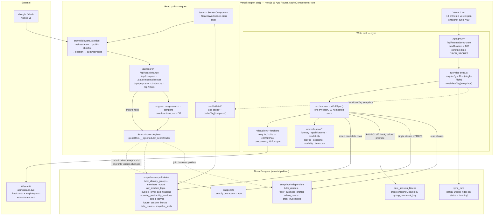
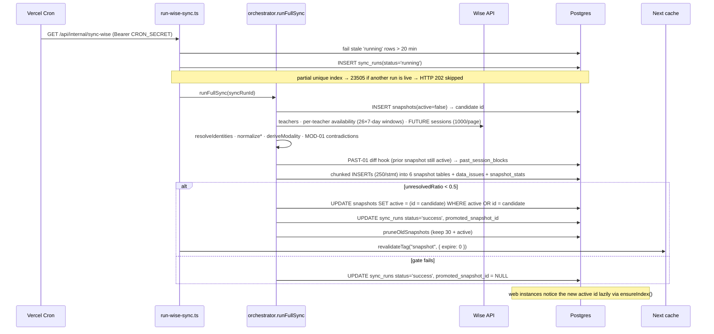
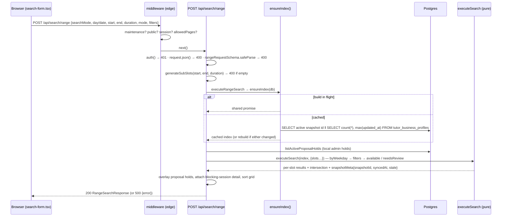

# System Architecture

## The one bet everything else follows from

BGScheduler answers a deceptively simple question — *which tutors are free, qualified, and safe to book at a given time* — against a source of truth (the Wise scheduling platform) that is slow, paginated, and rate-limited. The entire system is organized around one architectural bet:

> **Wise is never queried on the tutor read path.** A scheduled background sync pulls everything out of Wise, normalizes it into canonical Postgres tables stamped with an immutable `snapshot_id`, and a process-global in-memory index serves reads from RAM.

Two consequences fall out of that bet, and they shape every other decision in the codebase:

1. **Reads are pinned to a version.** A request does not see "Wise now"; it sees exactly one snapshot — the one row in `snapshots` with `active = true`. That makes results reproducible and makes a failed sync a non-event for readers.
2. **Correctness is decided at write time, not read time.** By the time a request arrives, the raw Wise payload is gone. Anything ambiguous — an unmergeable teacher identity, an unparseable tag, a contradictory modality, an unrecognized session status — must have been resolved or recorded as a `data_issues` row during the sync. The fail-closed rule (below) therefore lives in the pipeline, and the read path merely honours what the pipeline recorded.

This page owns the *shape* and the *why*: the layers, the snapshot-versioned data model and its atomic promotion, the in-memory `SearchIndex` singleton with its stale detection, the fail-closed rule, and a request-lifecycle walkthrough. It does **not** own mechanical detail — exact columns live in the per-domain ER diagrams under `docs/reference/database/` (the snapshot spine is [`erd-core.md`](../reference/database/erd-core.md), enum value sets are [`enums.md`](../reference/database/enums.md)), exact endpoint signatures in [`reference/api/`](../reference/api/index.md), schedules in [`reference/crons.md`](../reference/crons.md), variables in [`reference/env.md`](../reference/env.md), and the sign-in model in [`operations/auth-and-access.md`](../operations/auth-and-access.md). For the ETL narrated stage by stage with payload shapes, see [`data-flow.md`](./data-flow.md); for vocabulary, [`glossary.md`](./glossary.md).

### Scale at this revision

The snapshot spine is the original core, but the application has grown a long way past it. Measured from the working tree at HEAD (the command is given so the number can be re-derived rather than trusted):

| Measure | Count | How it was counted |
|---|---:|---|
| Drizzle tables | **203** | `grep -cE "^export const [a-zA-Z]+ = pgTable" src/lib/db/schema.ts` (5,198-line file) |
| Postgres enums | **61** | `grep -cE "^export const [a-zA-Z]+ = pgEnum" src/lib/db/schema.ts` |
| Route files | **191** | `find src/app/api -name route.ts` |
| HTTP endpoints | **255** | 253 named `export async function GET\|POST\|PUT\|PATCH\|DELETE` handlers (108 GET, 97 POST, 35 PATCH, 12 DELETE, 1 PUT), plus the Auth.js catch-all's `export const { GET, POST } = handlers` (`src/app/api/auth/[...nextauth]/route.ts:3`); the 2 CORS `OPTIONS` handlers are excluded |
| Vercel Cron entries | **19** | the `crons` array in `vercel.json`. The in-app registry declares **24** job keys, 5 of them `manualOnly: true`, so `SCHEDULED_CRON_JOBS` is also 19 |
| Pages | **33** `page.tsx` | 28 under `src/app/(app)/`, 3 print surfaces under `src/app/(print)/`, `src/app/login/page.tsx`, and the public `src/app/schedule/[token]/page.tsx` |
| Navigation tools | **24** in **6** sections | `NAV_TOOLS` / `NAV_SECTIONS` (`src/lib/navigation/tools.ts`); 4 carry `shortcut: true`, 7 carry a `badgeKey` |
| SQL migrations | **74** (`0000`–`0073`) | `ls drizzle/*.sql` |
| Vitest files | **409** | `find src -name "*.test.ts" -o -name "*.test.tsx"` |

Only a minority of those tables and routes belong to the tutor-search spine described here; the rest are sibling subsystems that reuse its *discipline* (single-flight sync runs, fail-closed normalization, cron audit) without reusing its snapshot/index machinery — see [Beyond the snapshot spine](#beyond-the-snapshot-spine).

---

## The layers, top to bottom

Data flows one way during a sync (Wise → normalization → Postgres → promotion) and the opposite way during a request (UI → API → in-memory index). The layers are physically separated into directories under `src/lib/`, and lower layers know nothing about upper ones.

| Layer | Location | Responsibility | Repo-internal imports (verified) |
|---|---|---|---|
| **Wise API client** | `src/lib/wise/client.ts`, `fetchers.ts`, `types.ts` | Retrying, concurrency-limited HTTP client; typed fetchers for teachers, availability, sessions, locations, analytics, receipts | **None.** `client.ts` has no import statements at all; `fetchers.ts` imports only `./client`, `./types`, `date-fns` (`fetchers.ts:1-22`) |
| **Normalization** | `src/lib/normalization/` — `identity`, `qualifications`, `availability`, `leaves`, `sessions`, `modality`, `timezone` | Raw Wise payloads → canonical, fail-closed domain shapes | Only `@/lib/wise/types` and sibling normalization modules (e.g. `identity.ts:1-5`, `modality.ts:1-2`) |
| **Sync orchestrator** | `src/lib/sync/` — `orchestrator.ts`, `run-wise-sync.ts`, `past-sessions-diff-hook.ts`, `snapshot-pruning.ts` | The full ETL: fetch → normalize → persist → validate → promote; the single-flight runner | Wise client + fetchers + types, all six normalization modules, `@/lib/db`, and one engine helper (`detectSessionModalityConflict`, `orchestrator.ts:18`) |
| **DB layer** | `src/lib/db/index.ts`, `schema.ts` | Neon-HTTP Drizzle singleton + the whole schema | `@neondatabase/serverless`, `drizzle-orm/neon-http` (`db/index.ts:1-3`) |
| **Snapshot tables** | Postgres | Versioned point-in-time normalized data keyed by `snapshot_id` | — |
| **In-memory `SearchIndex`** | `src/lib/search/index.ts` | One denormalized aggregate per tutor, loaded from the active snapshot, held on `globalThis` | `@/lib/db`, `@/lib/db/schema`, `@/lib/tutor-business-profiles` (`index.ts:1-7`) |
| **Search / compare engines** | `src/lib/search/engine.ts`, `compare.ts`, `range-search.ts`, `recommend.ts` | Pure functions over the index: availability, conflicts, shared free slots, rankings | `engine.ts` → `normalization/timezone`, `ops/stale` (`engine.ts:16-17`); `range-search.ts` additionally → `proposals/data` for hold overlays (`range-search.ts:3`) |
| **Server data helpers** | `src/lib/data/` — `active-snapshot.ts`, `tutors.ts`, `filters.ts`, `past-sessions.ts` | Cached (`"use cache"`) Server-Component reads, tagged for invalidation | `@/lib/db`, schema |
| **API routes** | `src/app/api/**/route.ts` | `auth()` → parse JSON → Zod `safeParse` → engine → JSON | auth, DB, index, engines, data helpers |
| **UI** | `src/app/(app)/`, `src/components/`, `src/hooks/` | Async Server Components fetch via `src/lib/data/*` and pass props to client shells; client shells call the API routes | data helpers (server), `fetch("/api/...")` (client) |

Three observations about how the separation actually holds up in code:

- **The engines never touch the database.** `executeSearch` (`src/lib/search/engine.ts:22`) takes a `SearchIndex` and a request and returns a response; the only I/O in the whole read path is `ensureIndex()`'s freshness check (below).
- **Route logic lives in plain modules.** `/api/search/range` is a 56-line handler that does auth + JSON + Zod and then delegates to `executeRangeSearch()` (`src/app/api/search/range/route.ts:6-56` → `src/lib/search/range-search.ts:103`). That is why the engines have unit tests that never import Next.
- **One deliberate inversion.** The orchestrator reaches *up* into `src/lib/search/compare.ts` for `detectSessionModalityConflict` (`orchestrator.ts:18`, used at `:375-380`) so that the sync-time contradiction pass and the read-time `resolveSessionModality` (`compare.ts:97`) share one vocabulary of online/onsite session types. Note also that `src/lib/wise/operations.ts` — the Wise *write* helpers, which are not on the snapshot path — does import `@/lib/db`, so "the Wise layer has no internal imports" is true of the read client, not of the whole directory.

### Container / flow diagram


```mermaid
flowchart TB
    subgraph external["External"]
        Wise["Wise API<br/>api.wiseapp.live<br/>Basic auth + x-api-key + x-wise-namespace"]
        Google["Google OAuth<br/>Auth.js v5"]
    end

    subgraph vercel["Vercel (region sin1) — Next.js 16 App Router, cacheComponents: true"]
        Cron["Vercel Cron<br/>19 entries in vercel.json<br/>snapshot sync: */30"]
        MW["src/middleware.ts (edge)<br/>maintenance → public allowlist<br/>→ session → allowedPages"]

        subgraph sync["Write path — sync"]
            SyncRoute["GET/POST /api/internal/sync-wise<br/>maxDuration = 800<br/>constant-time CRON_SECRET"]
            Runner["run-wise-sync.ts<br/>acquireSyncRun (single-flight)<br/>revalidateTag('snapshot')"]
            Orch["orchestrator.runFullSync()<br/>one try/catch, 12 numbered steps"]
            WiseClient["wise/client + fetchers<br/>retry 1s/2s/4s on 408/429/5xx<br/>concurrency 15 for sync"]
            Norm["normalization/*<br/>identity · qualifications · availability<br/>leaves · sessions · modality · timezone"]
        end

        subgraph read["Read path — request"]
            UI["/search Server Component<br/>+ SearchWorkspace client shell"]
            DataLayer["src/lib/data/*<br/>'use cache' + cacheTag('snapshot')"]
            ApiRead["/api/search · /api/search/range<br/>/api/compare · /api/compare/discover<br/>/api/proposals · /api/tutors · /api/filters"]
            Index["SearchIndex singleton<br/>globalThis.__bgscheduler_searchIndex"]
            Engine["engine · range-search · compare<br/>pure functions, zero DB"]
        end
    end

    subgraph pg["Neon Postgres (neon-http driver)"]
        Snap["snapshots<br/>exactly one active = true"]
        SyncRuns["sync_runs<br/>partial unique index on status = 'running'"]
        Tables["snapshot-scoped tables<br/>tutor_identity_groups · members · tutors<br/>raw_teacher_tags · subject_level_qualifications<br/>recurring_availability_windows · dated_leaves<br/>future_session_blocks · data_issues · snapshot_stats"]
        Past["past_session_blocks<br/>cross-snapshot, keyed by group_canonical_key"]
        Durable["snapshot-independent<br/>tutor_aliases · tutor_business_profiles<br/>admin_users · cron_invocations"]
    end

    Cron --> SyncRoute --> Runner --> Orch
    Orch --> WiseClient --> Wise
    Orch --> Norm
    Orch -->|insert candidate rows| Tables
    Orch -->|PAST-01 diff hook, before promote| Past
    Orch -->|single atomic UPDATE| Snap
    Runner --> SyncRuns
    Orch -->|read aliases| Durable

    Google --> MW
    UI --> MW --> ApiRead
    UI --> DataLayer --> Tables
    ApiRead -->|ensureIndex| Index
    Index -.->|rebuild when snapshot id or profile version changes| Snap
    Index -.-> Tables
    Index -.->|join business profiles| Durable
    ApiRead --> Engine --> Index
    Runner -.->|revalidateTag snapshot| DataLayer
```

Solid arrows are steady state; dashed arrows fire only on a snapshot change (index rebuild, cache sweep).

---

## The snapshot-versioned data model

Every piece of tutor data the search path serves belongs to exactly one **snapshot**. The `snapshots` table is deliberately tiny — `id`, a boolean `active` defaulting to `false`, and `created_at` (`src/lib/db/schema.ts:456-460`). All the substance lives in tables that carry a non-null `snapshot_id` FK and are rewritten wholesale on every run:

| Table | Grain | Declared at |
|---|---|---|
| `tutor_identity_groups` | one logical tutor per snapshot; carries the stable `canonical_key` and the derived `supported_modality` | `schema.ts:1519` |
| `tutor_identity_group_members` | one raw Wise teacher record per group (the online/offline pair members) | `schema.ts:1530` |
| `tutors` | display row per group with `supported_modes` | `schema.ts:1552` |
| `raw_teacher_tags` / `subject_level_qualifications` | raw Wise tags and their parsed subject/curriculum/level | `schema.ts:1565`, `:1576` |
| `recurring_availability_windows` | weekday + minute-of-day windows, Asia/Bangkok | `schema.ts:1592` |
| `dated_leaves` | absolute leave intervals | `schema.ts:1606` |
| `future_session_blocks` | every Wise FUTURE session, with `is_blocking` already decided | `schema.ts:1618` |
| `data_issues` | every defect the pipeline could not resolve | `schema.ts:2688-2702` |
| `snapshot_stats` | one summary row per snapshot | `schema.ts:2706` |

Column-level detail is the schema file's job, indexed by [`reference/database/erd-core.md`](../reference/database/erd-core.md); this page stops at grain.

**The invariant: exactly one snapshot has `active = true`, and every read is scoped to it.** Two properties follow:

1. **A failed sync cannot corrupt live data.** A sync builds an entirely new *inactive* snapshot alongside the live one (`orchestrator.ts:71-75` inserts with `active: false`). If anything throws, the candidate is simply never promoted and the previously active snapshot keeps serving, untouched.
2. **Going live is one boolean flip**, not a destructive in-place rewrite.

Note that the invariant is enforced by the promotion *statement*, not by a constraint: `snapshots` has no unique index on `active` (`schema.ts:456-460`).

`sync_runs` records each attempt — `status`, `started_at`/`finished_at`, the candidate `snapshot_id`, a `promoted_snapshot_id` set only when the run actually promoted, `teacher_count`, `error_summary`, and a `metadata` JSONB blob (`schema.ts:462-477`). `promoted_snapshot_id` is load-bearing beyond bookkeeping: the index derives its `syncedAt` — the timestamp every staleness decision hangs off — from the newest `success` run whose `promoted_snapshot_id` is the active snapshot (`src/lib/search/index.ts:155-166`).

### Two id spaces, and why `canonicalKey` exists

Snapshot-scoped rows get fresh UUIDs on every sync — a tutor's `tutor_identity_groups.id` changes every 30 minutes. `canonical_key` is the stable per-tutor anchor that survives rotation, which is why it is denormalized onto the in-memory group (`index.ts:65-71`, `:260-263`) rather than re-queried. Three things depend on it:

- **`/api/compare` heals stale ids.** A browser tab open across a sync sends group ids from a retired snapshot. `resolveTutorGroupsForActiveSnapshot()` looks each id up in the active index by `canonicalKey` and, on a miss, reads the retired row's `canonical_key` from Postgres and re-resolves it against the active snapshot, appending a `"Tutor selection was refreshed after the latest Wise sync"` warning instead of failing (`src/app/api/compare/route.ts:61-110`, `:155-159`). Only ids that look like UUIDs are used for that lookup (`compare/route.ts:59`, `:82`).
- **Cross-snapshot past sessions** are keyed by `group_canonical_key`, never by a snapshot UUID (`schema.ts:2258-2297`).
- **Durable, human-owned data** — `tutor_business_profiles`, joined into the index by canonical key (`index.ts:317`), `tutor_aliases` (`schema.ts:1543`), proposal holds — likewise survives rotation because it never references a snapshot UUID.

### The one table that escapes the snapshot

`past_session_blocks` (`schema.ts:2258-2297`) exists because Wise's FUTURE-session API cannot return past sessions: a session that has already happened would vanish from the next snapshot entirely. The PAST-01 diff hook (`src/lib/sync/past-sessions-diff-hook.ts:66+`) runs inside the sync **before** promotion, while the prior snapshot is still `active = true` (`orchestrator.ts:400-407`). It reads the prior snapshot's `future_session_blocks`, computes the set that is absent from the freshly fetched Wise FUTURE list *and* already started (`diff-hook.ts:110-153`), and inserts them chunked with `onConflictDoNothing` targeting the `UNIQUE(wise_session_id)` index (`diff-hook.ts:155-165`; index `psb_wise_session_id_idx` at `schema.ts:2292`). The table deliberately has **no FK to `snapshots`** — `captured_in_snapshot_id` is plain provenance — so snapshots can be pruned without cascading, and first observation wins (comment block, `schema.ts:2246-2257`). Per-group anomalies emit `completeness` issues and never abort the run (`diff-hook.ts:120-132`). The idempotent-insert design is what stands in for a transaction, because the Neon HTTP driver has none (`diff-hook.ts:58-61`).

### Atomic promotion

Promotion is gated: the run computes `unresolvedRatio = identityIssues.length / max(groups.length, 1)` and **promotes only if fewer than 50% of identity groups are unresolved** (`orchestrator.ts:473-476`). A catastrophically broken fetch — most tutors failing identity resolution — therefore cannot go live; the run still completes as `success` with `promoted_snapshot_id = null`, and the previous snapshot keeps serving.

When it does promote, it is one statement, not two (REL-01, `orchestrator.ts:480-501`):

```sql
-- conceptually, from orchestrator.ts:488-498
UPDATE snapshots
   SET active = (snapshots.id = $candidateId)
 WHERE active = true OR snapshots.id = $candidateId;
```

PostgreSQL MVCC plus the row-level lock held for the duration of one statement guarantee that a concurrent reader sees *either* the old active row *or* the new one — never an instant with zero rows matching `active = true`. Assigning `active` the boolean expression `(id = candidateId)` demotes the incumbent and promotes the candidate in the same pass, and the bounded `WHERE` restricts the rewrite to the previous-active row(s) plus the candidate. The in-code comment records that this replaced an earlier two-`UPDATE` sequence (`orchestrator.ts:481-487`).


```mermaid
sequenceDiagram
    participant C as Vercel Cron
    participant R as run-wise-sync.ts
    participant O as orchestrator.runFullSync
    participant W as Wise API
    participant P as Postgres
    participant N as Next cache

    C->>R: GET /api/internal/sync-wise (Bearer CRON_SECRET)
    R->>P: fail stale 'running' rows > 20 min
    R->>P: INSERT sync_runs(status='running')
    Note over R,P: partial unique index → 23505 if another run is live → HTTP 202 skipped
    R->>O: runFullSync(syncRunId)
    O->>P: INSERT snapshots(active=false) → candidate id
    O->>W: teachers · per-teacher availability (26×7-day windows) · FUTURE sessions (1000/page)
    O->>O: resolveIdentities · normalize* · deriveModality · MOD-01 contradictions
    O->>P: PAST-01 diff hook (prior snapshot still active) → past_session_blocks
    O->>P: chunked INSERTs (250/stmt) into 6 snapshot tables + data_issues + snapshot_stats
    alt unresolvedRatio < 0.5
        O->>P: UPDATE snapshots SET active = (id = candidate) WHERE active OR id = candidate
        O->>P: UPDATE sync_runs status='success', promoted_snapshot_id
        O->>P: pruneOldSnapshots (keep 30 + active)
        R->>N: revalidateTag("snapshot", { expire: 0 })
    else gate fails
        O->>P: UPDATE sync_runs status='success', promoted_snapshot_id = NULL
    end
    Note over P: web instances notice the new active id lazily via ensureIndex()
```

What promotion does **not** do: it does not push anything to the in-memory index. Every Node process discovers the new snapshot lazily on its next `ensureIndex()` call (see [Stale detection](#stale-detection-and-build-coalescing)).

### The failure model in one paragraph

`runFullSync()` is a single try/catch (`orchestrator.ts:60`, `:568`). Failures are handled at two tiers. **Isolated** failures — a teacher with no Wise user id (`orchestrator.ts:162-173`), a per-teacher availability fetch that throws (`:249-259`), a diff-hook group that cannot be resolved — become `data_issues` rows and the run continues. **Fatal** failures — anything else that throws — reach the outer catch, which marks the run `failed` with an `error_summary` and a duration/Wise-call-count metadata blob, and returns `success: false`; the previously active snapshot is never touched (`orchestrator.ts:568-610`). If even that cleanup `UPDATE` fails, the cleanup error is logged (REL-06) rather than allowed to mask the original (`:584-596`). Successful runs persist how long they took and how many Wise calls they made, bucketed by normalized path (EFF-00, `orchestrator.ts:506-513`; tally in `src/lib/wise/client.ts:22-25`, `:85-101`).

### Retention

After a promotion the orchestrator calls `pruneOldSnapshots()` (`orchestrator.ts:527-555` → `src/lib/sync/snapshot-pruning.ts:49`). It protects the newest `SNAPSHOT_RETENTION_COUNT = 30` snapshots plus, unconditionally, any snapshot flagged `active` (`snapshot-pruning.ts:5`, `:63-70`), nullifies `sync_runs` references to the rest, then deletes the snapshot-scoped children in FK-safe order and finally the snapshots themselves. Pruning is best-effort: a failure is logged and folded into the run's `metadata` as `{ attempted: true, failed: true, error }` but never fails the sync (`orchestrator.ts:532-541`).

### Single-flight guard around sync

Both entry points — the cron `GET` / manual `POST` at `/api/internal/sync-wise` and the admin `POST /api/admin/sync-wise` — funnel into `runWiseSyncRequest()` (`src/lib/sync/run-wise-sync.ts:142-167`; callers at `src/app/api/internal/sync-wise/route.ts:41`, `:56` and `src/app/api/admin/sync-wise/route.ts:22`). Before any work it calls `acquireSyncRun()` (`run-wise-sync.ts:88-118`), which layers three protections:

- **Stale-running cleanup.** Any `sync_runs` row stuck in `running` longer than `STALE_RUNNING_SYNC_MS` (20 minutes, `run-wise-sync.ts:10`) is force-failed with an explanatory `error_summary`, recovering from a function that timed out or was aborted mid-run (`:51-72`).
- **Overlap skip.** If a genuinely running sync exists, the request returns HTTP **202** with a skip body — not a second concurrent sync (`:93-97`, `:120-140`, `:148-150`).
- **Database backstop.** Even if two requests race past the in-app check, the partial unique index `sync_runs_single_running_idx` — `unique(status) WHERE status = 'running'` (`schema.ts:473-475`) — makes the second `running` insert fail with Postgres error `23505`, which the runner catches and converts into the same skip result (`:42-49`, `:106-117`).

On success the runner calls `revalidateTag("snapshot", { expire: 0 })` (`run-wise-sync.ts:160-162`), sweeping the `"use cache"` entries the tutor list and filter facets register with `cacheTag("snapshot")` (`src/lib/data/tutors.ts:80-86`, `src/lib/data/filters.ts:52-58`). The past-sessions helper deliberately uses a *separate* `"past-sessions"` tag with `cacheLife("days")` (`src/lib/data/past-sessions.ts:82-91`) so a promotion does not sweep cross-snapshot history that is immutable once captured (`past-sessions.ts:10-19`).

### Cron authentication and the invocation audit

`/api/internal/sync-wise` carries `maxDuration = 800` (`sync-wise/route.ts:7`) and authenticates with a **constant-time** `CRON_SECRET` comparison — `timingSafeEqual` behind a length pre-check, which both avoids the `RangeError` `timingSafeEqual` throws on mismatched buffer lengths and is itself O(1) (REL-07, `sync-wise/route.ts:11-29`). `GET` accepts only the cron secret; `POST` additionally falls back to an Auth.js session so an admin can trigger a sync manually (`:32-66`, `:69-76`). The same comparison is packaged for the other internal routes as `getCronSecretStatus` / `rejectInvalidCronSecret` in `src/lib/internal/cron-auth.ts:6-26`, which distinguishes a *missing* secret (500 "Server misconfigured") from an *invalid* one (401). The middleware waves `/api/internal/*` through without a session precisely because each handler carries this check (`src/middleware.ts:24`).

Every invocation — cron or admin — is wrapped in `withCronInvocationAudit()` (`src/lib/data-health/cron-audit.ts:191`), which writes a `cron_invocations` row recording job key, path, trigger source, actor email, duration, response status, and outcome (`schema.ts:479-499`). That table is what makes "did the cron actually fire?" answerable, and it backs the `cron-watchdog` job and the `/data-health` page.

---

## The in-memory `SearchIndex` singleton

### Shape

`SearchIndex` (`src/lib/search/index.ts:83-90`) is a snapshot id, a `profileVersion` string, `builtAt`, `syncedAt`, the flat `tutorGroups` array, and `byWeekday: Map<number, IndexedTutorGroup[]>` — the O(1) entry point the engine uses to pull only tutors who have *any* availability window on the requested weekday (`engine.ts:74`). Each `IndexedTutorGroup` (`index.ts:65-81`) is a fully denormalized read aggregate: canonical key, display name, `supportedModes`, qualifications, the underlying Wise records with their online/offline flag, availability windows, leaves, session blocks (with `isBlocking` already decided), the group's `dataIssues`, and an optional editorial `businessProfile`. Nothing on the request path ever joins across these; the join happened once at build time.

### `globalThis` anchoring

The index and its in-flight build promise are stored as `globalThis.__bgscheduler_searchIndex` and `globalThis.__bgscheduler_searchIndexBuildPromise` (`index.ts:94-97`), read and written only through four tiny accessors (`:99-113`). The DB handle follows the same pattern — `globalThis.__bgscheduler_db` (`src/lib/db/index.ts:16-27`). Anchoring on `globalThis` rather than a module-level `let` is what lets the singletons survive Next.js hot-module reloads in development, where a module can be re-evaluated while the process keeps running. In production the practical consequence is that **each Node process (each warm Vercel function instance) holds its own copy**; nothing broadcasts to them, and they converge on a new snapshot independently.

### Build

`buildIndex()` (`index.ts:142-344`) does the following, in order:

1. Selects the one `active = true` snapshot and throws `"No active snapshot found"` if there is none — sync-before-serve is a hard precondition (`:144-152`).
2. Derives `syncedAt` from the newest `success` sync run that promoted this snapshot, falling back to the snapshot's `created_at` (`:155-166`).
3. Loads groups, then members, qualifications, windows, leaves, session blocks, data issues, the business-profile map, and the profile version **in parallel**, every query filtered by `snapshotId` (`:169-222`).
4. Matches `data_issues` to groups by `entityId === canonicalKey`, `entityId === group.id`, or `entityName === displayName` (`:231-247`) — a deliberately loose match so that issues recorded against a teacher's display name still surface on the merged group.
5. Assembles each `IndexedTutorGroup`, mapping `supportedModality` to `supportedModes` (`both → [online, onsite]`, `unresolved → []`) (`:250-319`), builds `byWeekday` from availability windows (`:322-331`), and publishes the result to the singleton (`:342`).

### Stale detection and build coalescing

`ensureIndex()` (`index.ts:354-401`) is what every consumer calls, and it is the only place the read path touches Postgres:

- **Fast path — a build is already in flight.** Return that promise immediately (`:358-359`). This is the REL-02 race-coalescing guarantee: the promise is assigned to the singleton *synchronously, before any `await`* (`:391-400`), so concurrent first-time callers — a cold Vercel instance receiving several requests at once — share one build instead of each issuing the full set of snapshot queries.
- **Cached path.** If an index exists, run two cheap queries in parallel — the active snapshot id and the tutor-profile version (a `count(*)` plus `max(updated_at)` over `tutor_business_profiles`, `:128-137`) — and return the cached index when **both** match (`:368-383`). Either changing triggers a full `buildIndex()` (`:388`). The profile-version check is why editing a tutor's business profile shows up in search without waiting for a sync.
- **Degraded path.** If the cached index exists but no snapshot is active — which can only happen if someone has manipulated `snapshots` by hand — serve the cached index rather than fail (`:384-386`).

So the honest statement of the read-path cost is: **zero database reads inside the engines, and two single-row queries per request in `ensureIndex()`** to prove the cached index is still the active one. `clearSearchIndex()` (`:123-126`) exists for tests.

### Two different notions of "stale"

They are easy to conflate and are enforced in different places:

| Notion | Question | Threshold | Where |
|---|---|---|---|
| **Index freshness** | Is my in-memory index built from the currently active snapshot and current profiles? | exact id / version equality | `ensureIndex()` (`index.ts:368-383`) |
| **Data staleness** | Is the active snapshot itself old? | `syncedAt` older than `API_STALE_THRESHOLD_MS` = 90 min → `snapshotMeta.stale = true` plus a warning string in every search/compare response (`src/lib/ops/stale.ts:2`, `:4-5`; `engine.ts:30-38`; `compare/route.ts:141-149`) | engine |
| **UI banner** | Should we tell the admin the data may be outdated? | a looser 2-hour `APP_STALE_BANNER_THRESHOLD_MS` (`stale.ts:3`, `:15-17`) fed by `/api/data-health`'s `staleAgeMs` (`src/lib/data-health/dashboard.ts:966-976`; `src/components/layout/stale-snapshot-banner.tsx:65-66`) | client banner |

Data staleness is **a warning, never a refusal**: a stale snapshot is still served, with `stale: true` on the response so the client can say so.

### Who consumes the index

`ensureIndex()` has exactly eight non-test call sites (`grep -rn "ensureIndex(" src --include=*.ts --include=*.tsx`): `src/app/api/search/route.ts:54`, `src/lib/search/range-search.ts:115` (behind `/api/search/range`), `src/app/api/compare/route.ts:138`, `src/app/api/compare/discover/route.ts:57`, `src/app/api/proposals/route.ts:64`, `src/lib/room-capacity/data.ts:409`, `src/lib/line/operational.ts:527`, and `src/lib/ai/scheduler-service.ts:60`. Two of those are worth naming:

- **The AI scheduler proves availability with the same engine an admin uses** (`scheduler-service.ts:60`), which is the design reason the model never decides availability itself.
- **The LINE operational planner degrades rather than fails** — it calls `ensureIndex(input.db).catch(() => null)` (`operational.ts:527`), so an unavailable index downgrades the plan instead of erroring a webhook.

### The client-side mirror

The compare workspace keeps its own cache: a `Map<"tutorGroupId:weekStart:CACHE_VERSION", CompareTutor>` in a React ref (`src/hooks/use-compare.ts:107`, `:169-172`), with `CACHE_VERSION = "v3"` bumped whenever the server shape changes so long-lived tabs cannot mix shapes (`src/lib/search/cache-version.ts:24`; migration history at `:9-20`). It honours the snapshot model too: if a response's `snapshotMeta.snapshotId` differs from the last one seen, the whole cache is cleared and the request is retried once without `fetchOnly`, and a second divergence surfaces an error rather than recursing (`use-compare.ts:152-166`).

---

## The fail-closed rule

> **Never return a tutor as available unless the system can prove availability from normalized Wise data. Unresolved identity, modality, or qualification → "Needs Review", never "Available". Cancelled sessions must not block. Unknown anything → the safe side.**

The rule is not a flag and not a UI concern; it is a set of concrete decisions, most of them made at sync time and recorded as `data_issues`, with the read path honouring the record. The table is the rule:

| Ambiguity | Decision | Enforced at |
|---|---|---|
| Session with an unknown or missing `meetingStatus` | **Blocks.** Only `CANCELLED`, `CANCELED`, `COMPLETED`, `MISSED`, `NO_SHOW` are non-blocking; everything else, including `undefined`, is blocking | `isBlockingStatus`, `src/lib/normalization/sessions.ts:33-51`; the stored status defaults to `"UNKNOWN"` (`:80`) |
| Cancelled session | **Does not block** — it is kept in the snapshot with `is_blocking = false` so it can still be displayed, but every blocking check filters on `isBlocking` first | `engine.ts:163`, `:183`, `:211`; `compare.ts:243`, `:276`, `:376` |
| Teacher whose display name yields no nickname and no alias | Kept as a **solo group** so the person stays visible, plus a `critical`-severity `alias` issue that routes them to Needs Review | `resolveIdentities`, `src/lib/normalization/identity.ts:177-204`; severity assigned at `orchestrator.ts:97-105` |
| Nickname matching more than a clean online/offline pair | Group kept, `identity_collision` `alias` issue emitted for manual disambiguation (REL-03) | `identity.ts:148-170` |
| Wise tag that does not match `Subject (Curriculum) Level` | Dropped from qualifications; a `tag` issue `Unmapped Wise tag` is recorded | `src/lib/normalization/qualifications.ts:31`, `:85-93` |
| Group whose modality cannot be proven from pair structure, session type, or location | `supported_modality = unresolved` plus a `modality` issue. A single offline-only record with no session evidence is **not** assumed onsite | `deriveModality`, `src/lib/normalization/modality.ts:23-92` (unresolved branches at `:65-91`) |
| Session whose `sessionType` contradicts its teacher record or group modality | `conflict_model` issue at sync (MOD-01) and `modality: "unknown"` with low confidence at read | `detectSessionModalityConflict`, `compare.ts:185`, called from `orchestrator.ts:367-398`; `resolveSessionModality`, `compare.ts:97` |
| Teacher missing a Wise user id, or whose availability fetch fails | `completeness` issue; the run continues and the teacher is not silently marked free | `orchestrator.ts:162-173`, `:249-259` |
| Session that dropped out of Wise FUTURE before promotion | Captured into `past_session_blocks`, first observation wins | `past-sessions-diff-hook.ts:115-165` |
| More than 50% of identity groups unresolved | Candidate snapshot is **not promoted** | `orchestrator.ts:473-476` |

At read time the engine turns that record into routing. For every candidate group on the requested weekday, `searchSlot` (`engine.ts:60-150`) collects `reviewReasons` from the group's `dataIssues` (`:85-88`) and from an empty `supportedModes` (`"Unresolved modality"`, `:90-92`); then applies the hard filters — a modality mismatch skips the tutor outright (`:93-97`), the availability window must fully cover the slot (`:100-108`), qualification filters must match (`:110-111`), no blocking session (`:113-118`), no leave (`:120-125`). Only a group that clears every filter *and* has zero review reasons lands in `available`; one that clears the filters but carries reasons lands in `needsReview` with the reasons attached (`:142-146`). There is no third bucket and no way to reach `available` with an open issue. Multi-slot searches intersect the `available` sets only (`computeIntersection`, `:323`), so a tutor under review for one slot never appears as available across the set.

Leaves are treated conservatively too: a leave spanning more than 24 hours blocks **every** weekday it touches in full, with no minute-of-day math, because using either bound's HH:MM for a middle day would understate coverage (REL-04, `engine.ts:243-289`).

The same posture extends beyond tutor data. Sign-in is denied unless the email resolves to a role — `resolveUserAccess` returns `null` and the `signIn` callback returns `false` (`src/lib/auth-access.ts:56-85`, `src/lib/auth.ts:25-29`). Maintenance bypass with an unset allowlist means *nobody* bypasses (`src/lib/maintenance.ts:95-101`). A missing `CRON_SECRET` is a 500, not an open door (`cron-auth.ts:10`, `:22-25`). Where a design decision carries an identifier — `REL-01` … `REL-08`, `MOD-01`, `PAST-01`/`PAST-05`, `MAINT-01` … `MAINT-05`, `EFF-00`, `D-03` … `D-18` — the identifier is load-bearing and is preserved in the code comments; grep for it before changing nearby behaviour.

---

## Request lifecycle

### Every request: the edge gate

`src/middleware.ts` runs on every path except `_next/static`, `_next/image`, and `favicon.ico` (`middleware.ts:111-113`), using the **edge** Auth.js instance (`edgeAuth`, `src/lib/auth-edge.ts:4`). The order of checks is load-bearing:

1. **Maintenance mode** (`middleware.ts:76-82`). Engages only when `MAINTENANCE_MODE` is exactly `"true"` (MAINT-01, `maintenance.ts:59-61`); exempts `/api/internal/`, `/schedule/`, `/api/auth/`, `/login` so crons, parent links, and sign-in keep working (MAINT-02, `:43-48`); lets through only emails in `MAINTENANCE_BYPASS_EMAILS`; answers 503 with `Retry-After` — JSON under `/api/`, an inline-styled HTML page elsewhere (MAINT-05, `:120-134`). It sits *above* the public allowlist on purpose, because that allowlist includes `/api/line/webhook` (MAINT-04, `middleware.ts:72-75`).
2. **Public allowlist** (`middleware.ts:10-26`): `/login`, `/api/auth/*`, `/api/search/assistant`, `/api/classrooms/floor-plan-map`, `/api/line/webhook`, `/schedule/*` (the trailing slash keeps the authenticated `/student-schedule` admin page out), the two OA-resolver routes, and all of `/api/internal/*`. Each public route that touches data enforces its own in-handler check — LINE signature, opaque bearer, capability token, or cron secret.
3. **Session** (`:89-93`): no session → redirect to `/login?callbackUrl=…`.
4. **Page scoping** (`:96-106`): a restricted user's `allowedPages` claim is matched against the path both as a page (`/x`, `/x/…`) and as its API namespace (`/api/x`, `/api/x/…`) (`isPathAllowed`, `:36-67`). API misses get `403`; page misses redirect to the user's first allowed page, guarded against a loop (`:102-105`). Post-Class Feedback and Learning Plans are coarse-passed here because they re-check a fresh Postgres grant on every request (`:39-57`) — and the Learning Plans exception deliberately passes only the page namespace while its API namespace is explicitly denied (`:50-57`).

The two Auth.js configs are intentionally split. The Node config (`src/lib/auth.ts:32-73`) does the database work once per login — `signIn` (`:49-57`) → `resolveUserAccess` (`auth-access.ts:56-85`: `admin_users` → counselor → teacher → admissions case member, first match wins) → `role` and `allowedPages` written onto the JWT (`:58-68`). The edge config (`auth-edge.ts:21-32`) only *reads* those claims; its `jwt` callback is an explicit pass-through with a comment saying the edge runtime has no DB access (`auth-edge.ts:22-26`). The two even request different Google scopes — `spreadsheets.readonly` on the edge (`auth-edge.ts:11`) versus `spreadsheets` + `drive.file` in Node (`auth.ts:38`) — because only the Node sign-in path stores the Sheets/Drive token (`auth.ts:51-55`). Full detail: [`operations/auth-and-access.md`](../operations/auth-and-access.md).

### Page load: `/search`

`src/app/(app)/search/page.tsx:8-22` is an async Server Component. It awaits `connection()` (`:9`) so the page renders per request under `cacheComponents: true` (`next.config.ts:3-5`, the only custom Next setting), then awaits two cached server helpers — `getFilterOptions()` and `getTutorList()` — each declared with `"use cache"`, `cacheTag("snapshot")`, `cacheLife("hours")` (`src/lib/data/filters.ts:52-58`, `src/lib/data/tutors.ts:80-86`). Both resolve the active snapshot id through `getActiveSnapshotIdOrThrow` (`src/lib/data/active-snapshot.ts:5-17`) and read the snapshot-scoped tables directly — the data layer does **not** go through the in-memory index. The results are passed as props to the `<SearchWorkspace>` client shell inside a `<Suspense>` with a skeleton (`page.tsx:15-20`).

The `(app)` layout (`src/app/(app)/layout.tsx:30-42`) wraps every page in a nav whose access-dependent half is isolated in its own async component under `<Suspense fallback={<AppNavSkeleton />}>` (`:13-35`) — required because the uncached `auth()` call must not block the static shell under `cacheComponents` (`:8-12`) — and mounts the client-side `StaleSnapshotBanner` (`:36-38`). `/` is a summary hub, not a redirect, except that a user with exactly one allowed page is sent straight there (`src/app/(app)/page.tsx:8-19`). `/compare` is a client-side redirect into `/search?tutors=…`; the compare *engine* and both `/api/compare*` endpoints are fully live inside the search workspace, so the Tutor Compare feature's **legacy-redirect** badge describes the standalone page only.

### Search request


```mermaid
sequenceDiagram
    participant B as Browser (search-form.tsx)
    participant M as middleware (edge)
    participant R as POST /api/search/range
    participant X as ensureIndex()
    participant P as Postgres
    participant E as executeSearch (pure)

    B->>M: POST /api/search/range {searchMode, day/date, start, end, duration, mode, filters}
    M->>M: maintenance? public? session? allowedPages?
    M->>R: next()
    R->>R: auth() → 401 · request.json() → 400 · rangeRequestSchema.safeParse → 400
    R->>R: generateSubSlots(start, end, duration) → 400 if empty
    R->>X: executeRangeSearch → ensureIndex(db)
    alt build in flight
        X-->>R: shared promise
    else cached
        X->>P: SELECT active snapshot id ‖ SELECT count(*), max(updated_at) FROM tutor_business_profiles
        X-->>R: cached index (or rebuild if either changed)
    end
    R->>P: listActiveProposalHolds (local admin holds)
    R->>E: executeSearch(index, {slots…}) — byWeekday → filters → available / needsReview
    E-->>R: per-slot results + intersection + snapshotMeta{snapshotId, syncedAt, stale}
    R->>R: overlay proposal holds, attach blocking-session detail, sort grid
    R-->>B: 200 RangeSearchResponse (or 500 {error})
```

Step by step, with the code:

1. The client form posts to `/api/search/range`.
2. The route follows the uniform mutating-route contract: `auth()` → 401; `request.json()` in try/catch → 400 `"Invalid JSON"`; `rangeRequestSchema.safeParse` → 400 with `error.flatten()`; then business logic in try/catch → 500 with the error message (`src/app/api/search/range/route.ts:6-56`; schema at `range-search.ts:16-38`). `/api/search` and `/api/compare` follow the identical four-step shape (`search/route.ts:30-61`, `compare/route.ts:112-131`).
3. `generateSubSlots` slices the window into class-duration sub-slots (`range-search.ts:41`); an empty result is a 400 before any I/O (`range/route.ts:30-36`).
4. `executeRangeSearch` (`range-search.ts:103`) calls `ensureIndex` (`:115`) — the only Postgres round-trips on the path — then `listActiveProposalHolds` (`:116`) for the local, never-written-to-Wise admin holds, then the pure `executeSearch` (`:127`).
5. `executeSearch` stamps `snapshotMeta` (`engine.ts:30-38`), evaluates each slot via `searchSlot`, and intersects (`:41-56`).
6. The range layer reshapes per-slot results into a grid, overlays proposal holds as a distinct blocking kind (`range-search.ts:70-101`), fills in the blocking Wise sessions for cells that are not free via `getBlockingSessions` (`engine.ts:200`), applies the optional `tutorGroupIds` narrowing, and sorts.

The compare request is the same skeleton with three extra moves (`compare/route.ts:112-254`): stale-id healing through `canonical_key` (`:155-159`), a **historical-range trigger** — if the requested week starts before today in Bangkok, captured `past_session_blocks` are fetched through the `"past-sessions"`-tagged cache and merged into both the per-tutor build and the shared-free-slot computation so a tutor is never shown free during a session that actually happened (`:192-227`) — and `fetchOnly`, which computes conflicts and free slots over the full selection but serializes only the newly requested tutors so the client cache can fill incrementally (`:229-236`).

### Sync request

Covered above under [Single-flight guard](#single-flight-guard-around-sync) and [Cron authentication](#cron-authentication-and-the-invocation-audit): `GET /api/internal/sync-wise` → constant-time secret → `withCronInvocationAudit` → `runWiseSyncRequest` → `acquireSyncRun` → `runFullSync` → `revalidateTag("snapshot")`. The response is 200 with the `SyncResult`, 202 when skipped, 500 when the run failed (`run-wise-sync.ts:148-166`).

---

## Configuration and runtime notes

- **Environment.** `src/lib/env.ts:3-46` declares the Zod contract — seven hard-required (`DATABASE_URL`, `AUTH_GOOGLE_ID`, `AUTH_GOOGLE_SECRET`, `AUTH_SECRET`, `WISE_USER_ID`, `WISE_API_KEY`, `CRON_SECRET`), two defaulted (`WISE_NAMESPACE`, `WISE_INSTITUTE_ID`), and eleven optional, including the immutable foot-traffic HMAC secret — and `getEnv()` throws on an invalid set while logging only `fieldErrors`, never values. Two facts about it are architecturally important. First, **the spine reads `process.env` directly rather than importing `env`**, so `env.ts` functions as a declared inventory plus a fail-fast check for whoever imports it, not as the runtime read path. Second, the file's own comment explains why the middleware cannot use it: middleware runs on the edge and this module throws on a partial env. The reconciled inventory — declared vs. documented vs. actually read — is [`reference/env.md`](../reference/env.md).
- **Database driver.** `getDb()` returns a Drizzle instance over `@neondatabase/serverless`'s HTTP driver (`db/index.ts:5-12`), which has **no transaction support**. The snapshot spine never needs one — idempotent inserts and the single-statement promotion stand in. Subsystems that do need atomicity try `db.transaction()` first and, on the driver's unsupported-transaction error, fall back to a single pooled `pg` connection with explicit `BEGIN`/`COMMIT`/`ROLLBACK` (`src/lib/post-class-feedback/transaction.ts`, `src/lib/onsite-foot-traffic/transaction.ts`).
- **Wise client behaviour.** Base URL `https://api.wiseapp.live`; Basic auth from `userId:apiKey` plus `x-api-key`, `x-wise-namespace`, and a `VendorIntegrations/{namespace}` user agent (`client.ts:64`, `:69-78`). Retries are an explicit allowlist — 408, 429, 500, 502, 503, 504 — with 1s/2s/4s backoff up to three attempts; any other status fails immediately (REL-05, `:37-44`, `:158-177`), and network-level failures retry on the same ladder (`:148-156`). A simple FIFO limiter caps in-flight requests at 5 by default and at 15 for the sync client (`:65`, `:179-199`, `:214-221`). Per-teacher availability is one 7-day window for working hours plus the remaining windows for leaves — a 180-day horizon in 26 windows (`fetchers.ts:60-105`); FUTURE sessions page at `PAGE_LIMIT = 1000` per request (`fetchers.ts:24`, `:110-147`).
- **Timezone.** Every normalized time is Asia/Bangkok (`src/lib/normalization/timezone.ts`), and `vitest.config.ts:4` pins `process.env.TZ` so date assertions are deterministic. Vercel functions are pinned to `sin1` (`vercel.json:2`).
- **Tests.** Two Vitest projects — `unit` (the default `npm test`) and `integration` (`*.integration.test.ts`, serial forks) backed by ephemeral Postgres through `testcontainers`.

---

## Beyond the snapshot spine

The snapshot/index machinery serves tutor search and compare. The other feature areas reuse its *discipline* rather than its tables:

- **Single-flight sync runs.** Fourteen run-ledger tables carry a partial unique index for `status = 'running'`, including the new `onsite_foot_traffic_sync_runs` ledger. Eleven are global guards; the two sales-dashboard import ledgers scope the guard per source and IPEDS scopes it per data year. The guard lives in Postgres, not in application memory, so it holds across function instances. Exact index locations: [`reference/database/index.md`](../reference/database/index.md#how-to-read-this-table).
- **One `WiseClient`, many pipelines.** `createWiseClient()` (`client.ts:214`) is shared by credit control, progress tests, room utilization, onsite foot traffic, Wise activity, classroom assignments, post-class feedback, payroll, student promotions, and the live student-schedule overlay, as well as the snapshot sync. They share the retry/limiter/tally, not the snapshot tables.
- **Cron audit for everything.** All 19 scheduled entries and the 5 manual-only handlers are declared once in `src/lib/data-health/cron-registry.ts`, mirrored to `vercel.json`, and wrapped in `withCronInvocationAudit`; `/data-health` and the `cron-watchdog` job read the resulting `cron_invocations` rows. Schedules and lateness budgets: [`reference/crons.md`](../reference/crons.md).
- **Per-feature cache tags.** Beyond `"snapshot"` and `"past-sessions"`, other subsystems declare their own tag constants and sweep them from their own syncs, so one feature's refresh never invalidates another's cache.
- **Fail-closed by default.** Unresolvable teachers in progress tests, unmatched identities in leave requests, `TEACHER_TBC` in student schedules, dry-run-only Wise writes in LINE and leave requests, capability grants re-read per request in post-class feedback — each is the same posture the tutor pipeline established, applied to a different domain. The feature pages under [`features/`](../features/) own those rules.

---

## Invariants to preserve when editing

1. **Exactly one active snapshot, flipped by one statement.** Never split the promotion into demote-then-promote (`orchestrator.ts:480-501`).
2. **Anything that must read the prior snapshot runs before promotion.** The PAST-01 hook is the current example (`orchestrator.ts:400-407`).
3. **Writes to snapshot tables always carry the candidate `snapshotId`; reads always filter by the active one.** The index (`index.ts:169-222`) and the data helpers (`src/lib/data/*.ts`) are the two read entry points.
4. **`ensureIndex()` must assign its build promise synchronously.** Introducing an `await` before `setBuildingPromise(p)` breaks REL-02 coalescing (`index.ts:391-400`).
5. **`data_issues` are the only channel for ambiguity.** New normalization edge cases emit an issue and continue; they never guess and never abort the run.
6. **Cache tags stay separate.** `"snapshot"` is swept on promotion; `"past-sessions"` deliberately is not (`data/past-sessions.ts:10-19`).
7. **Route handlers stay thin.** Auth → JSON → Zod → delegate; logic lives in `src/lib/{domain}/*.ts` so it can be tested without Next.

_Verified against main@0cd1e81 (clean tree) on 2026-09-02._
