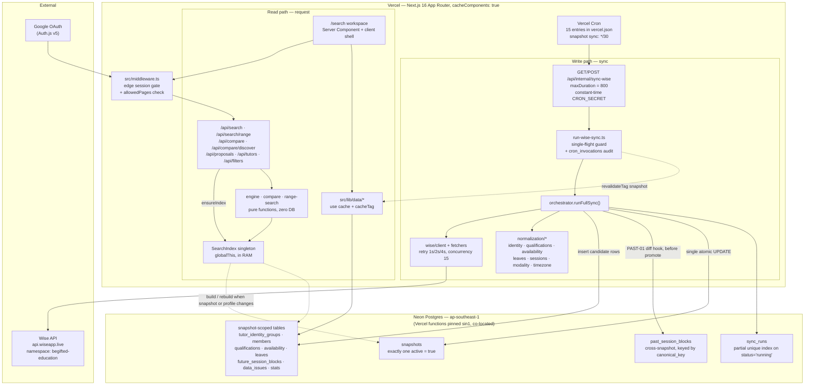
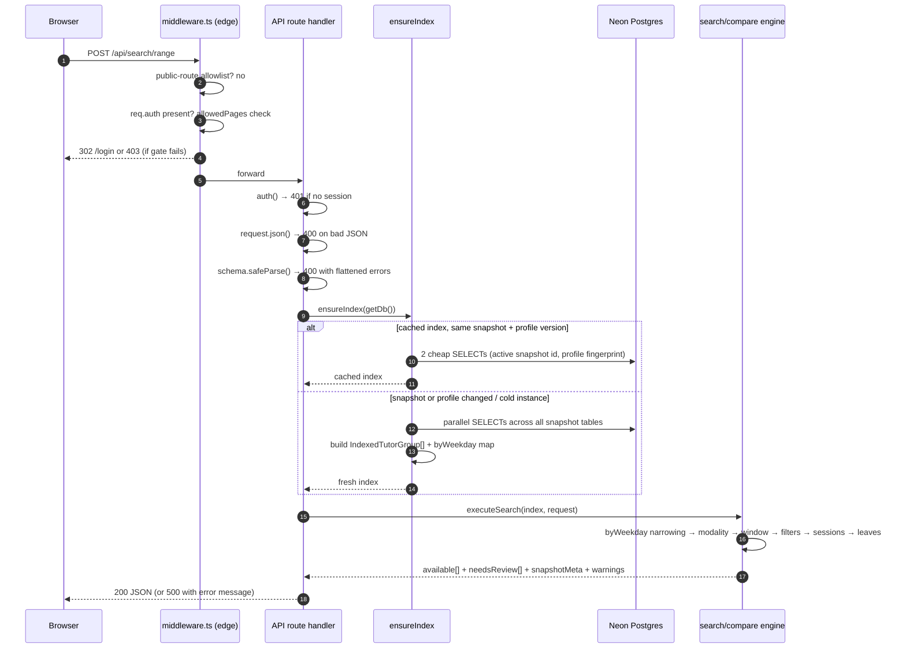

# System Architecture

## The one bet everything else follows from

BGScheduler answers a deceptively simple question — *which tutors are free, qualified, and safe to book at a given time* — against a source of truth (the Wise scheduling platform) that is slow, paginated, and rate-limited. The entire system is organized around one architectural bet:

> **Wise is never queried on the request path.** A scheduled background sync pulls everything out of Wise, normalizes it into canonical Postgres tables stamped with an immutable `snapshot_id`, and a process-global in-memory index serves reads from RAM.

Two consequences fall out of that bet, and they shape every other decision in the codebase:

1. **Reads are pinned to a version.** A request does not see "Wise now"; it sees exactly one snapshot. That makes results reproducible and makes a failed sync a non-event.
2. **Correctness has to be decided at write time, not read time.** By the time a request arrives, the raw Wise payload is long gone. Anything ambiguous — an unmergeable teacher identity, an unparseable tag, a contradictory modality — must have been resolved or recorded as a defect during the sync. This is why the fail-closed rule (below) lives in the pipeline, not in the UI.

This document owns the *shape* and the *why*: the layers, the snapshot-versioned data model and atomic promotion, the in-memory `SearchIndex` singleton with its stale detection, the fail-closed rule, and a request-lifecycle walkthrough. It does **not** own mechanical detail — exact columns live in [`reference/database/`](../reference/database/index.md), exact endpoint signatures in [`reference/api/`](../reference/api/index.md), schedules in [`reference/crons.md`](../reference/crons.md), and variables in [`reference/env.md`](../reference/env.md). For the ETL narrated step-by-step with payload shapes, see [`data-flow.md`](./data-flow.md).

### Scale at this revision

The snapshot spine described here is the original core, but the application has grown a long way past it. Counted from the working tree: **178** route handlers (`src/app/api/**/route.ts`), **188** `pgTable` definitions and **61** `pgEnum` declarations in `src/lib/db/schema.ts`, **65** SQL migrations under `drizzle/`, **29** `page.tsx` files (25 inside the authenticated `(app)` group), **15** Vercel Cron entries in `vercel.json` against **21** internal cron-capable route handlers, and **369** Vitest files. Only a minority of those tables and routes belong to the tutor-search spine; the rest are sibling subsystems that reuse its *discipline* without reusing its snapshot machinery (see [Beyond the snapshot spine](#beyond-the-snapshot-spine)).

---

## The layers, top to bottom

Data flows one way during a sync (Wise → normalization → Postgres → promotion) and the opposite way during a request (UI → API → in-memory index). The layers are physically separated into directories under `src/lib/`, and lower layers know nothing about upper ones.

| Layer | Location | Responsibility | Depends on |
|---|---|---|---|
| **Wise API client** | `src/lib/wise/` | Rate-limited, retrying HTTP client + domain fetchers | env vars only — no internal imports |
| **Normalization** | `src/lib/normalization/` | Raw Wise payloads → canonical shapes: identity, qualifications, availability, leaves, sessions, modality, timezone | Wise types only |
| **Sync orchestrator** | `src/lib/sync/` | The full ETL: fetch → normalize → persist → validate → promote, plus the single-flight runner | Wise client, normalization, DB |
| **DB layer** | `src/lib/db/` | Neon Postgres connection singleton + Drizzle schema | `@neondatabase/serverless`, `drizzle-orm` |
| **Snapshot tables** | (Postgres) | Versioned point-in-time normalized data keyed by `snapshot_id` | — |
| **In-memory `SearchIndex`** | `src/lib/search/index.ts` | One denormalized aggregate per tutor, loaded from the active snapshot, held process-global | DB layer, schema |
| **Search / compare engines** | `src/lib/search/engine.ts`, `compare.ts`, `range-search.ts`, `recommend.ts` | Pure functions computing availability, conflicts, free slots, rankings | the index |
| **Server data helpers** | `src/lib/data/` | Cached (`"use cache"`) Server-Component reads, tagged for invalidation | DB layer |
| **API routes** | `src/app/api/` | auth → parse → Zod validate → engine → JSON | auth, DB, index, engines |
| **UI** | `src/app/(app)/`, `src/components/` | Server Components fetch via `src/lib/data/*`; client shells call the API routes | API routes, data helpers |

The separation is enforceable, not aspirational: `src/lib/wise/client.ts` imports nothing from the repo, the normalization modules import only Wise types, and route logic is kept in plain `src/lib/{domain}/*.ts` modules so the engines are unit-testable without the Next/auth route graph. `/api/search/range`, for instance, is a 57-line handler that does auth + Zod + delegation into `executeRangeSearch()` (`src/lib/search/range-search.ts:103`).

### Container / data-flow diagram


```mermaid
flowchart TB
    subgraph external["External"]
        Wise["Wise API<br/>api.wiseapp.live<br/>namespace: begifted-education"]
        Google["Google OAuth<br/>(Auth.js v5)"]
    end

    subgraph vercel["Vercel — Next.js 16 App Router, cacheComponents: true"]
        Cron["Vercel Cron<br/>15 entries in vercel.json<br/>snapshot sync: */30"]
        MW["src/middleware.ts<br/>edge session gate<br/>+ allowedPages check"]

        subgraph sync["Write path — sync"]
            SyncRoute["GET/POST /api/internal/sync-wise<br/>maxDuration = 800<br/>constant-time CRON_SECRET"]
            Runner["run-wise-sync.ts<br/>single-flight guard<br/>+ cron_invocations audit"]
            Orch["orchestrator.runFullSync()"]
            WiseClient["wise/client + fetchers<br/>retry 1s/2s/4s, concurrency 15"]
            Norm["normalization/*<br/>identity · qualifications · availability<br/>leaves · sessions · modality · timezone"]
        end

        subgraph read["Read path — request"]
            ApiRead["/api/search · /api/search/range<br/>/api/compare · /api/compare/discover<br/>/api/proposals · /api/tutors · /api/filters"]
            Index["SearchIndex singleton<br/>globalThis, in RAM"]
            Engine["engine · compare · range-search<br/>pure functions, zero DB"]
            DataLayer["src/lib/data/*<br/>use cache + cacheTag"]
            UI["/search workspace<br/>Server Component + client shell"]
        end
    end

    subgraph pg["Neon Postgres — ap-southeast-1<br/>(Vercel functions pinned sin1, co-located)"]
        Snap["snapshots<br/>exactly one active = true"]
        SyncRuns["sync_runs<br/>partial unique index on status='running'"]
        Tables["snapshot-scoped tables<br/>tutor_identity_groups · members<br/>qualifications · availability · leaves<br/>future_session_blocks · data_issues · stats"]
        Past["past_session_blocks<br/>cross-snapshot, keyed by canonical_key"]
    end

    Cron --> SyncRoute --> Runner --> Orch
    Orch --> WiseClient --> Wise
    Orch --> Norm
    Orch -->|insert candidate rows| Tables
    Orch -->|PAST-01 diff hook, before promote| Past
    Orch -->|single atomic UPDATE| Snap
    Orch --> SyncRuns

    Google --> MW
    UI --> MW --> ApiRead
    ApiRead -->|ensureIndex| Index
    Index -.->|build / rebuild when snapshot or profile changes| Snap
    Index -.-> Tables
    ApiRead --> Engine
    Engine --> Index
    UI --> DataLayer --> Tables
    Runner -.->|revalidateTag snapshot| DataLayer
```

Solid arrows are steady state; dashed arrows fire only on a snapshot change (index rebuild, cache sweep).

---

## The snapshot-versioned data model

Every piece of tutor data the search path serves belongs to exactly one **snapshot**. The `snapshots` table is deliberately tiny — an id, a boolean `active` defaulting to `false`, and `created_at` (`src/lib/db/schema.ts:456`–`460`). All the substance lives in snapshot-scoped tables carrying a non-null `snapshot_id` FK; `tutor_identity_groups` is representative (`schema.ts:1516`–`1525`), and its siblings are members, qualifications, availability windows, leaves, future session blocks, data issues, and stats.

**The invariant: at most one snapshot has `active = true`, and that snapshot is what every read is scoped to.** Two properties follow:

1. **A failed sync cannot corrupt live data.** A sync builds an entirely new *inactive* snapshot alongside the live one. If anything throws, the candidate is simply never promoted and the previously active snapshot keeps serving, untouched.
2. **Going live is one boolean flip**, not a destructive in-place rewrite.

`sync_runs` records each attempt: `status` (`running`/`success`/`failed`), `started_at`/`finished_at`, the candidate `snapshot_id`, a `promoted_snapshot_id` set only when that run actually promoted, a `teacher_count`, an `error_summary`, and a `metadata` JSONB blob (`schema.ts:462`–`477`). `promoted_snapshot_id` is load-bearing beyond bookkeeping: the index reads it to derive the `syncedAt` timestamp that drives staleness (`src/lib/search/index.ts:155`–`166`).

One table deliberately escapes the snapshot: `past_session_blocks` (`schema.ts:2255`). Wise's FUTURE-session API cannot return past sessions, so a session that has already happened would vanish from the next snapshot entirely. The PAST-01 diff hook captures those before they are lost, keyed by the tutor's stable `canonical_key` rather than a snapshot-scoped UUID.

### Two id spaces, and why `canonicalKey` exists

Snapshot-scoped rows get fresh UUIDs on every sync — a tutor's `tutor_identity_groups.id` changes every 30 minutes. `canonical_key` is the stable per-tutor anchor that survives rotation, which is why it is denormalized onto the in-memory group (`src/lib/search/index.ts:65`–`71`, `:258`–`263`) instead of being re-queried. Two consumers depend on that:

- **`/api/compare` heals stale ids.** A browser tab open across a sync will send tutor group ids from a retired snapshot. `resolveTutorGroupsForActiveSnapshot()` looks each id up in the active index, and on a miss reads the retired row's `canonical_key` from Postgres and re-resolves it against the active snapshot, appending a `"Tutor selection was refreshed after the latest Wise sync"` warning instead of 404-ing (`src/app/api/compare/route.ts:62`–`110`, `:158`). Only ids that look like UUIDs are used for that lookup (`compare/route.ts:60`, `:82`).
- **Cross-snapshot past sessions** are fetched by `canonicalKey` without a second DB round-trip (`src/lib/data/past-sessions.ts:33`–`48`).

Anything durable and human-owned — tutor business profiles, aliases, proposal holds — is likewise keyed by `canonicalKey`, never by a snapshot UUID.

### The sync pipeline, step by step

`runFullSync()` (`src/lib/sync/orchestrator.ts:50`) runs the whole ETL inside one try/catch. Its numbered comments map to ETL phases:

1. **Acquire a sync run** — reuse the guard row the caller already inserted, or insert a fresh `running` row (`orchestrator.ts:62`–`68`).
2. **Create the candidate snapshot** with `active: false`, and stamp its id on the sync run (`orchestrator.ts:71`–`81`).
3. **Fetch all teachers** from Wise (`orchestrator.ts:84`).
4. **Load aliases** from `tutor_aliases`, which feed identity resolution (`orchestrator.ts:87`–`91`).
5. **Resolve identities** — merge raw Wise teacher records into logical people; anything unresolved becomes a `critical` `alias` data issue (`orchestrator.ts:94`–`105`).
6. **Persist identity groups and members** (`orchestrator.ts:111`–`139`).
7. **Per-teacher availability, leaves, tags, qualifications** — fetch full availability per teacher, normalize working hours into recurring windows, normalize leaves (UTC → Asia/Bangkok), store raw tags, parse tags into qualifications. A missing Wise user id or a failed fetch produces a `completeness` issue and the loop continues; **one bad teacher never aborts the sync** (`orchestrator.ts:156`–`260`).
8. **Fetch and normalize future sessions** into blocking windows, mapping each session back to its teacher's group via a `wiseUserId → teacherId` map (`orchestrator.ts:263`–`305`).
9. **Derive modality per group** — `online`/`onsite`/`both`/`unresolved` — write it onto the group, set each window's modality, and create the tutor display row (`orchestrator.ts:315`–`362`). A second pass then detects per-session modality contradictions and emits `conflict_model` issues, reading the group modality from an in-memory map hoisted specifically to avoid a per-session `SELECT` (`orchestrator.ts:367`–`398`).
10. **(9.5) PAST-01 diff hook** — capture sessions that dropped out of Wise's FUTURE feed and started in the past into `past_session_blocks`. This **must** run before promotion, while the prior snapshot is still `active = true` (`orchestrator.ts:400`–`418`). It is idempotent through `UNIQUE(wise_session_id)` + `ON CONFLICT DO NOTHING`, which matters because the Neon HTTP driver offers no transaction to wrap it in (`src/lib/sync/past-sessions-diff-hook.ts:6`–`26`, `:59`–`61`).
11. **Bulk-insert** availability, leaves, raw tags, qualifications, session blocks, and tutor rows in parallel, chunked at 250 rows per statement (`orchestrator.ts:38`, `:420`–`443`).
12. **Store data issues and snapshot stats**, including an `issuesByType` histogram (`orchestrator.ts:446`–`470`).
13. **Validate and promote** (next section), then mark the run `success` and prune (`orchestrator.ts:472`–`548`).

Error handling is deliberately two-tier. Per-teacher, per-session, and per-group failures are *isolated* into `data_issues` and the run continues. Only a top-level throw reaches the outer catch, which marks the run `failed` with an `error_summary` and leaves the previously active snapshot serving; if even that cleanup `UPDATE` fails it is logged (REL-06) rather than masking the original error (`orchestrator.ts:561`–`599`).

### Atomic promotion

Promotion is gated on completeness: the run computes `unresolvedRatio = identityIssues.length / max(groups.length, 1)` and **promotes only if fewer than 50% of groups are unresolved** (`orchestrator.ts:472`–`476`). A catastrophically broken fetch — the case where most tutors could not be identity-resolved — therefore physically cannot go live.

When it does promote, it is one statement, not two (REL-01, `orchestrator.ts:480`–`498`):

```sql
-- conceptually, from orchestrator.ts:488–498
UPDATE snapshots
   SET active = (snapshots.id = $candidateId)
 WHERE active = true OR snapshots.id = $candidateId;
```

The in-code comment spells out why: PostgreSQL MVCC plus the row-level lock held for the duration of a single statement guarantees a concurrent reader sees *either* the old active row *or* the new one — there is never an instant with zero rows matching `active = true`. Assigning `active` the boolean expression `(id = candidateId)` demotes the incumbent and promotes the candidate in the same pass, and the bounded `WHERE` keeps the rewrite to the previous-active row(s) plus the candidate instead of the whole table. This replaced an earlier, racier two-`UPDATE` sequence.

Note what promotion does **not** do: it does not push to the in-memory index. Readers discover the new snapshot lazily (see [stale detection](#stale-detection-and-rebuild)).

### Retention

After a successful promotion the orchestrator calls `pruneOldSnapshots()` (`src/lib/sync/snapshot-pruning.ts:49`). It keeps the newest `SNAPSHOT_RETENTION_COUNT = 30` snapshots plus, unconditionally, any snapshot flagged `active` (`snapshot-pruning.ts:5`, `:64`–`75`), nullifies `sync_runs` references to pruned snapshots, then deletes the snapshot-scoped children in FK-safe order and finally the snapshots themselves. Pruning is best-effort: a failure is logged and folded into the run's `metadata` as `{ attempted: true, failed: true, error }` but never fails the sync (`orchestrator.ts:520`–`548`).

### Single-flight guard around sync

The sync endpoint serves both Vercel cron (`GET`) and manual triggers (`POST`), and both funnel into `runWiseSyncRequest()` (`src/lib/sync/run-wise-sync.ts:142`). Before any work it calls `acquireSyncRun()`, which applies three layers of overlap protection:

- **Stale-running cleanup.** Any `sync_runs` row stuck in `running` past `STALE_RUNNING_SYNC_MS` (20 minutes, `run-wise-sync.ts:10`) is force-failed with an explanatory `error_summary`, recovering from a function that timed out or was aborted mid-run (`run-wise-sync.ts:51`–`72`).
- **Overlap skip.** If a genuinely-running sync exists, the request returns HTTP **202** with a skip body — not a second concurrent sync (`run-wise-sync.ts:93`–`97`, `:120`–`140`, `:148`–`150`).
- **Database backstop.** Even if two requests race past the in-app check, the partial unique index `sync_runs_single_running_idx` — `unique(status) WHERE status = 'running'` (`schema.ts:473`–`475`) — makes the second `running` insert fail with `23505`, which the runner catches and converts into the same skip result (`run-wise-sync.ts:99`–`118`).

On success the runner calls `revalidateTag("snapshot", { expire: 0 })` (`run-wise-sync.ts:161`), sweeping the Next.js `"use cache"` entries that the tutor list and filter facets tag with `cacheTag("snapshot")` (`src/lib/data/tutors.ts:79`–`86`, `src/lib/data/filters.ts:53`–`55`). The past-sessions helper deliberately uses a *separate* `"past-sessions"` tag (`src/lib/data/past-sessions.ts:9`–`15`, `:87`) so a promotion does not sweep cross-snapshot history that is immutable once captured.

### Cron authentication and the invocation audit

`/api/internal/sync-wise` carries `maxDuration = 800` (Pro-plan headroom) and authenticates with a **constant-time** `CRON_SECRET` comparison — `timingSafeEqual` guarded by a length pre-check, which both avoids the `RangeError` that `timingSafeEqual` throws on mismatched buffer lengths and is itself O(1) (REL-07, `src/app/api/internal/sync-wise/route.ts:7`, `:11`–`29`). `GET` accepts only the cron secret; `POST` additionally falls back to an Auth.js session so an admin can trigger a sync manually (`sync-wise/route.ts:32`–`76`). The same comparison is packaged for reuse by the other internal routes in `src/lib/internal/cron-auth.ts:6`–`26`, which additionally distinguishes a *missing* secret (500 "Server misconfigured") from an *invalid* one (401).

Every invocation — cron or admin — is wrapped in `withCronInvocationAudit()` (`src/lib/data-health/cron-audit.ts:144`), which writes a `cron_invocations` row recording job key, path, schedule, trigger source, actor email, duration, response status, outcome, and linked run ids (`schema.ts:479`–`499`). That table is what makes "did the cron actually fire?" answerable, and it backs the `cron-watchdog` job.

The set of jobs is declared once, in code: `CRON_JOBS` (`src/lib/data-health/cron-registry.ts:45`) lists 21 entries with `path`, `schedule`, cadence, lateness threshold, `maxDurationSeconds`, and a `manualOnly` flag. `SCHEDULED_CRON_JOBS` filters out the manual-only ones (`cron-registry.ts:375`), and a unit test asserts that this filtered list is *exactly* `vercel.json`'s `crons` array, path-and-schedule (`src/lib/data-health/__tests__/cron-registry.test.ts:7`–`20`). Six jobs are `manualOnly: true` with `schedule: null` by design — the four post-class-feedback sub-jobs, room utilization, and LINE backlog recovery — which is why 21 handlers map to 15 cron entries.

---

## The in-memory `SearchIndex` singleton

All availability logic runs against one denormalized structure in process memory. `buildIndex()` (`src/lib/search/index.ts:142`) does the heavy lifting once per snapshot:

1. Find the active snapshot; throw `"No active snapshot found"` if there is none (`index.ts:144`–`152`).
2. Derive `syncedAt` from the most recent successful sync whose `promotedSnapshotId` equals this snapshot, falling back to the snapshot's `createdAt` (`index.ts:155`–`166`).
3. Load every snapshot-scoped table **in parallel** with one `Promise.all` — members, qualifications, availability windows, leaves, session blocks, data issues, business profiles, and a profile-version fingerprint (`index.ts:175`–`222`).
4. Group each result set by `groupId` and assemble one `IndexedTutorGroup` per tutor, carrying `canonicalKey`, display name, derived `supportedModes`, qualifications, Wise member records, availability windows, leaves, session blocks, data issues, and the optional editorial business profile (`index.ts:250`–`319`).
5. Build `byWeekday: Map<number, IndexedTutorGroup[]>` so a search for one weekday touches only tutors with availability that day, instead of scanning the full roster (`index.ts:322`–`331`).

The finished `SearchIndex` carries `snapshotId`, `profileVersion`, `builtAt`, `syncedAt`, the groups, and the weekday map (`index.ts:83`–`90`).

Note step 4's `supportedModes` mapping: `"both"` becomes `["online","onsite"]`, `"unresolved"` becomes the **empty array**, and anything else becomes a single-element array (`index.ts:265`–`270`). The empty array is not an absence of data — it is the signal the engine later reads as "unresolved modality → Needs Review".

### `globalThis` anchoring, not module scope

The index is not a module-level `let`. It lives on `globalThis.__bgscheduler_searchIndex`, with the in-flight build promise on `globalThis.__bgscheduler_searchIndexBuildPromise` (`index.ts:94`–`113`). The DB handle follows the same pattern at `globalThis.__bgscheduler_db` (`src/lib/db/index.ts:16`–`27`). The reason, noted in both files, is Next.js hot-module reload: HMR swaps module instances, so a module-scoped singleton would be discarded on every edit, while a `globalThis`-anchored one survives. In production each serverless instance keeps its own copy until recycled — so "the index" is really *one index per warm instance*, not a shared cache.

### Stale detection and rebuild

Callers never invoke `buildIndex()` directly; they call `ensureIndex(db)` (`index.ts:354`), which decides whether the cached index is still valid:

- No cached index → build.
- Cached index → check **two** things in one `Promise.all`: that the active snapshot id still equals `cached.snapshotId`, **and** that the tutor-business-profile fingerprint still equals `cached.profileVersion`. A change in either triggers a full rebuild (`index.ts:365`–`388`). The fingerprint is `count(*)` + `max(updated_at)` over `tutor_business_profiles` (`index.ts:128`–`137`) — profiles are human-edited and can change without a new Wise snapshot, so snapshot id alone would go stale.
- Defensive edge case: if the DB momentarily reports *no* active snapshot but a cached index exists, `ensureIndex` returns the cached index rather than throwing (`index.ts:384`–`386`).

This is how a freshly promoted snapshot reaches readers: the first request after promotion observes `activeSnapshot.id !== cached.snapshotId` and rebuilds. **Pull on next request — there is no push from the sync side.**

### Race coalescing (REL-02)

If N requests hit a cold instance simultaneously, a naive implementation kicks off N parallel rebuilds. `ensureIndex` prevents that with a singleton-promise pattern (`index.ts:346`–`401`):

- The very first thing it does is check for an in-flight promise and return it (`index.ts:358`–`359`).
- The work closure is *created but not awaited* until after its resulting promise has been written to the `globalThis` slot — assignment and kickoff happen in the same synchronous tick, before any `await` yields to the microtask queue (`index.ts:391`–`400`).
- A `.finally()` clears the slot once the build settles (`index.ts:396`–`398`).

A concurrent caller arriving mid-build therefore short-circuits onto the same promise instead of starting a competing rebuild.

### Consumers of the index

`ensureIndex` is not search-only. Confirmed callers outside tests: `/api/search` (`src/app/api/search/route.ts:54`), the range search used by the main UI (`src/lib/search/range-search.ts:115`), `/api/compare` (`src/app/api/compare/route.ts:138`), `/api/compare/discover` (`discover/route.ts:57`), `/api/proposals` (`proposals/route.ts:64`), the room-capacity saturation forecast (`src/lib/room-capacity/data.ts:409`), the AI scheduler service (`src/lib/ai/scheduler-service.ts:60`), and the LINE operational planner — which notably calls `ensureIndex(input.db).catch(() => null)` so an index failure degrades that path instead of breaking it (`src/lib/line/operational.ts:527`).

### Staleness is a warning, never a withholding

*Index* staleness (wrong snapshot → rebuild) is distinct from *data* staleness (the active snapshot is simply old). The engine computes `stale = now − syncedAt > API_STALE_THRESHOLD_MS` where the threshold is **90 minutes** (`src/lib/ops/stale.ts:2`), and on staleness sets `snapshotMeta.stale` and pushes a human-readable warning into the response `warnings` array (`src/lib/search/engine.ts:30`–`38`); `/api/compare` applies the identical check (`compare/route.ts:141`–`149`). The 90-minute window absorbs the 30-minute cron cadence plus recovery headroom. A separate **2-hour** threshold drives a dismissible app-wide banner (`stale.ts:3`, `:15`–`16`, rendered by `src/components/layout/stale-snapshot-banner.tsx:66`). Stale data is served *with a caveat* — the system would rather show slightly-old availability than nothing.

---

## The fail-closed rule

The product's non-negotiable safety rule: **never present a tutor as "Available" unless availability can be proven from normalized Wise data.** Anything the pipeline could not resolve cleanly is routed to a "Needs Review" bucket — never silently dropped, never optimistically shown as free. It is enforced at both ends of the pipeline.

**At sync time**, ambiguity becomes a recorded defect rather than a guess:

- Unresolved identity → `alias` issue, `critical` severity (`orchestrator.ts:94`–`105`).
- Missing Wise user id or a failed availability fetch → `completeness` issue, and that teacher's data is simply absent rather than assumed empty-and-free (`orchestrator.ts:162`–`172`, `:249`–`259`).
- Unmapped tags → `tag` issues (`orchestrator.ts:238`–`248`).
- Modality is *derived* through an explicit precedence — member pair structure → session-type evidence → location evidence → `unresolved` (`src/lib/normalization/modality.ts:14`–`22`) — and a lone non-online record with no corroborating session evidence resolves to `unresolved`, not to an assumed `onsite` (`modality.ts:64`–`70`). Contradictions emit `conflict_model` issues instead of picking a winner (`orchestrator.ts:339`–`349`, `:367`–`398`).
- Session blocking is classified once, at normalization: an explicit non-blocking set (`CANCELLED`, `CANCELED`, `COMPLETED`, `MISSED`, `NO_SHOW`) is non-blocking; a **missing or unrecognized status is blocking** (`src/lib/normalization/sessions.ts:33`–`51`). The unknown case defaulting to *blocking* is the fail-closed direction — a mystery session costs a false "busy", never a false "free".

**At query time**, `searchSlot()` applies the rule per tutor (`src/lib/search/engine.ts:60`–`150`):

- A tutor group carrying any data issue accumulates `reviewReasons` from those issues (`engine.ts:86`–`88`).
- `supportedModes.length === 0` (unresolved modality) adds `"Unresolved modality"` (`engine.ts:91`–`92`). Note the asymmetry with an explicit modality *mismatch*, which `continue`s the tutor out of the results entirely (`engine.ts:93`–`97`) — a known-wrong modality is an exclusion, an unknown one is a review.
- A tutor reaches `available` only after clearing modality, having an availability window that fully covers the slot, passing qualification filters, not overlapping a blocking session, and not overlapping a leave — **and** carrying zero review reasons. Otherwise it lands in `needsReview` with its reasons attached (`engine.ts:99`–`147`).
- Multi-slot searches intersect on `available` only; a needs-review tutor never sneaks into the intersection (`engine.ts:323`–`342`).

Leaves block in both search modes. Multi-day leaves carry a documented assumption (REL-04): a leave spanning more than 24 hours blocks *every* weekday it touches in full, deliberately declining minute-of-day math on interior days rather than under-blocking (`engine.ts:240`–`289`).

The same posture governs authentication: `resolveUserAccess()` returns `null` for an email that matches no admin, counselor, teacher, or admissions-case membership, and sign-in is denied — "fail-closed, the same posture as the original admin-only allowlist" (`src/lib/auth-access.ts:1`–`20`, `:56`).

---

## Request lifecycle


```mermaid
sequenceDiagram
    autonumber
    participant B as Browser
    participant MW as middleware.ts (edge)
    participant R as API route handler
    participant IX as ensureIndex
    participant PG as Neon Postgres
    participant E as search/compare engine

    B->>MW: POST /api/search/range
    MW->>MW: public-route allowlist? no
    MW->>MW: req.auth present? allowedPages check
    MW-->>B: 302 /login or 403 (if gate fails)
    MW->>R: forward
    R->>R: auth() → 401 if no session
    R->>R: request.json() → 400 on bad JSON
    R->>R: schema.safeParse() → 400 with flattened errors
    R->>IX: ensureIndex(getDb())
    alt cached index, same snapshot + profile version
        IX->>PG: 2 cheap SELECTs (active snapshot id, profile fingerprint)
        IX-->>R: cached index
    else snapshot or profile changed / cold instance
        IX->>PG: parallel SELECTs across all snapshot tables
        IX->>IX: build IndexedTutorGroup[] + byWeekday map
        IX-->>R: fresh index
    end
    R->>E: executeSearch(index, request)
    E->>E: byWeekday narrowing → modality → window → filters → sessions → leaves
    E-->>R: available[] + needsReview[] + snapshotMeta + warnings
    R-->>B: 200 JSON (or 500 with error message)
```

Walking the same path in prose:

1. **Edge auth gate.** Every request except `_next/static`, `_next/image`, and `favicon.ico` hits `src/middleware.ts` (matcher at `middleware.ts:93`–`95`). A public allowlist passes through untouched: `/login`, `/api/auth/*`, the public search assistant, the floor-plan map, the LINE webhook, the token-bearing parent schedule links under `/schedule/` (note the trailing slash, which keeps the authenticated `/student-schedule` admin page *out* of the allowlist), two OA-resolver worklist endpoints, and everything under `/api/internal/*` (`middleware.ts:4`–`20`). Internal routes are public at the edge precisely because they carry their own constant-time `CRON_SECRET` check. Anything else without a session is redirected to `/login` with a `callbackUrl` (`middleware.ts:71`–`75`).

2. **Page-level access control.** Beyond "signed in or not", the middleware enforces a per-user page allowlist. `req.auth.user.allowedPages` is `null` for full-access admins (short-circuit to full access) or a list of route prefixes for restricted roles; `isPathAllowed()` matches a pathname both as a page (`/x`, `/x/...`) and as its API namespace (`/api/x`, `/api/x/...`), with explicit carve-outs for surfaces that re-derive access from the database on every request (`middleware.ts:30`–`61`). A restricted user hitting a forbidden API gets `403`; a forbidden page redirects them to their landing page with a loop guard (`middleware.ts:79`–`88`). The claim itself is resolved once at sign-in by `resolveUserAccess()` and persisted on the JWT, because the edge runtime has no DB access — the edge config only reads token claims (`src/lib/auth.ts:58`–`70`, `src/lib/auth-edge.ts:22`–`31`, `src/lib/auth-access.ts:18`–`19`). Five roles exist: `admin`, `counselor`, `teacher`, `student`, `parent` (`auth-access.ts:31`).

3. **Route-level auth.** Handlers re-check the session server-side and return `401` — the middleware gate is defense in depth, not the only check (`src/app/api/search/route.ts:30`–`33`).

4. **Parse + validate.** `request.json()` inside a try/catch → `400` on malformed JSON; a module-scope Zod schema `.safeParse()` → `400` with `.error.flatten()` details (`search/route.ts:8`–`48`). `.parse()` is never used.

5. **Index load — the only DB touch on the hot path.** `getDb()` returns the `globalThis` Neon-HTTP singleton (`src/lib/db/index.ts:22`–`27`) and `ensureIndex(db)` returns the warm index after two cheap `SELECT`s when nothing changed; only a snapshot or profile-version change pays for a rebuild.

6. **Pure in-memory computation.** The engine runs with zero further queries: `byWeekday` narrows candidates, then modality/window/filter/session/leave checks partition tutors into `available` vs `needsReview` (`engine.ts:60`–`150`). Range search wraps this by generating fixed-duration sub-slots across a time window (`range-search.ts:41`–`67`) and assembling an availability grid, overlaying locally held proposal slots fetched from Postgres (`range-search.ts:103`–`130`, `:217`). Compare assembles week-scoped per-tutor schedules, detects same-student conflicts, and intersects free intervals — see [`features/tutor-compare.md`](../features/tutor-compare.md).

7. **Response.** A typed JSON body including `snapshotMeta` (`snapshotId`, `syncedAt`, `stale`) and `warnings`; business logic sits in a try/catch returning `500` with the error message (`engine.ts:30`–`57`, `search/route.ts:52`–`59`).

8. **UI.** Pages are async Server Components that fetch through the cached `src/lib/data/*` helpers and hand props to a client shell inside `<Suspense>` — `/search` calls `connection()` then loads filter options and the tutor list this way (`src/app/(app)/search/page.tsx:8`–`22`). The compare client additionally keeps its own `Map<"tutorGroupId:weekStart:CACHE_VERSION", CompareTutor>` cache so adding a tutor fetches only that tutor (`fetchOnly`) and removing one recomputes from cache; the version string is bumped whenever the cached shape changes, currently `"v3"` (`src/lib/search/cache-version.ts:24`, `src/hooks/use-compare.ts:107`, `:170`, `:295`).

The sync lifecycle is the mirror image, out of band: Vercel cron `GET /api/internal/sync-wise` every 30 minutes → constant-time `CRON_SECRET` → `cron_invocations` audit wrapper → single-flight guard → `runFullSync()` → fetch/normalize/persist into a fresh inactive snapshot → PAST-01 diff hook → promote if healthy → `revalidateTag("snapshot")` → prune. The next read request rebuilds the in-memory index on demand.

---

## Beyond the snapshot spine

The tutor-search spine is now a minority of the codebase. Sibling subsystems — sales dashboard, credit control, payroll, Wise activity audit, classroom assignments, room capacity, LINE integration, leave requests, progress tests, post-class feedback, student promotions, competitor intelligence, learning plans, student schedule, admissions case management, US universities — each own their own tables, routes, and (where they ingest external data) their own sync lineage. What they replicate is the *discipline*, not the machinery:

- **Their own `*_sync_runs` table with a single-running partial unique index.** Eight such tables exist alongside the core `sync_runs`: `wise_activity_sync_runs`, `competitor_sync_runs`, `credit_control_sync_runs`, `payroll_sync_runs`, `leave_request_sync_runs`, `line_backlog_recovery_sync_runs`, `progress_test_sync_runs`, `post_class_sync_runs` (`schema.ts:553`, `:844`, `:1162`, `:1760`, `:2093`, `:2663`, `:2975`, `:3223`).
- **Their own cron route under `/api/internal/`**, registered in `CRON_JOBS`, with `maxDuration` set per route (800s for heavy syncs, 300s for lighter jobs) and the same constant-time secret check.
- **Their own cache tag**, swept by their own writer, rather than piggybacking on `"snapshot"`.

They do **not** get a snapshot lineage or the in-memory index (credit control keeps its own snapshot-style lineage; the rest are read-mostly against current tables). One notable driver divergence: the primary `getDb()` handle is Neon-HTTP, which has **no transaction support**, so the subsystems that genuinely need atomic multi-statement writes lazily construct a separate `node-postgres` `Pool` (`max: 1`, module-cached) and drive explicit `BEGIN`/`COMMIT`/`ROLLBACK` — payroll sync (`src/lib/payroll/sync.ts:2`–`3`, `:93`–`112`), post-class feedback (`src/lib/post-class-feedback/transaction.ts:3`–`20`), and the admissions audit wrapper, which first *tries* `db.transaction()` and only falls back when it sees the driver's "No transactions support in neon-http driver" error (`src/lib/admissions/audit.ts:75`–`105`).

### Cross-cutting concerns

- **Wise client resilience.** Basic auth plus `x-api-key`, `x-wise-namespace`, and a `VendorIntegrations/{namespace}` user agent (`src/lib/wise/client.ts:52`–`61`); exponential backoff at 1s/2s/4s for network errors and a closed set of retryable statuses — 408, 429, 500, 502, 503, 504 — so permanent 4xx fail fast instead of burning the retry budget (REL-05, `client.ts:23`–`30`, `:91`–`133`); an in-process FIFO concurrency limiter defaulting to 5 and raised to **15** for the sync client built by `createWiseClient()` (`client.ts:48`, `:136`–`166`).
- **Timezone.** Everything is normalized to `Asia/Bangkok` at the normalization boundary, and "now in Bangkok" is computed canonically via `date-fns-tz` `toZonedTime` (REL-08, `src/app/api/compare/route.ts:33`–`41`).
- **Caching.** `next.config.ts` sets exactly one option — `cacheComponents: true` — so Server Components use `"use cache"` + `cacheTag`/`cacheLife`, and uncached `auth()` calls must sit inside a `<Suspense>` boundary; the `(app)` layout isolates its access-resolving nav in one for exactly this reason (`src/app/(app)/layout.tsx:8`–`28`).
- **Entry points.** `/` is a Home hub Server Component that redirects single-page-restricted users straight to their one allowed page (`src/app/(app)/page.tsx:8`–`19`); `/compare` is a client-side redirect into `/search` preserving `?tutors=` (`src/app/(app)/compare/page.tsx:10`–`17`).
- **Environment.** `src/lib/env.ts` declares a Zod schema over 15 keys (9 required, 6 optional) and throws at module load on invalid input. See the open question below about whether it actually runs.

---

## Open questions

- **`src/lib/env.ts` appears to be dead code.** It exports `env = getEnv()`, which validates at module-evaluation time (`env.ts:28`–`37`) — but a repo-wide search for `@/lib/env` / `lib/env` finds **zero importers** outside the file itself. Nothing evaluates the module, so the "validated at startup" guarantee does not currently hold; each consumer reads `process.env.*` directly and fails at its own call site (e.g. `getDb()` throwing `"DATABASE_URL is not set"`, `src/lib/db/index.ts:6`–`9`). There are **57** distinct `process.env.*` keys referenced across `src/`, versus 15 declared in the schema. Should `env.ts` be wired into a startup path, or deleted in favor of the per-call-site pattern actually in use?
- **Cron registry vs. route `maxDuration` drift.** Exactly one of the 21 registered jobs disagrees with its handler: `credit_control` declares `maxDurationSeconds: 300` in `src/lib/data-health/cron-registry.ts` while `src/app/api/internal/sync-credit-control/route.ts:14` sets `maxDuration = 800`. The registry number is what the Data Health UI shows and what lateness math is calibrated against, so one of the two is misleading. Which is authoritative? (The `vercel.json` ↔ registry *schedule* parity is test-enforced; `maxDurationSeconds` is not.)
- **Index lifetime and cold-build cost on Vercel.** The `SearchIndex` is per serverless instance. A cold instance pays a full `buildIndex()` — one snapshot's worth of parallel `SELECT`s plus aggregation — on its first request. I did not measure instance recycle frequency or cold-build latency against the "< 400ms warm" target; worth confirming whether cold starts are noticeable after a deploy or scale-out.
- **No active snapshot at first boot.** `buildIndex()` throws `"No active snapshot found"` (`index.ts:150`–`152`) and `ensureIndex` only swallows the no-active case when a cached index already exists (`index.ts:384`–`386`). In a brand-new environment that has never completed a sync, every index-backed route surfaces that error until the first promotion. Do the deployment runbooks guarantee a promoted snapshot before traffic?
- **Profile-fingerprint cost on the warm path.** `getTutorProfileVersion()` runs a `count(*) + max(updated_at)` aggregate on `tutor_business_profiles` on *every* `ensureIndex` call (`index.ts:128`–`137`, `:365`–`375`). Negligible for a small table, but it means the "zero DB queries on the hot path" framing is really "two cheap queries". Confirm the table stays small, or consider a cheaper invalidation signal.
- **Stale-running cutoff versus the function ceiling.** The guard force-fails `running` rows after 20 minutes (`run-wise-sync.ts:10`) while `maxDuration` is 800s ≈ 13.3 minutes (`sync-wise/route.ts:7`). A sync cannot legitimately outlive the ceiling, so the 20-minute cutoff is purely a safety net — but a wedged row still blocks roughly the next 1.5 cron cycles before cleanup. Acceptable as designed; flagged in case the cadence tightens.
- **`isPathAllowed` carve-outs are accumulating.** Several surfaces now bypass the coarse prefix match because they re-derive access from the database — `/api/home/summary`, post-class feedback, and learning plans as a page-allowed-but-API-denied split (`middleware.ts:30`–`51`). This is correct today but is a growing special-case list in a security-critical function; worth deciding whether the JWT `allowedPages` claim should be replaced by a uniform per-request capability lookup.

_Verified against HEAD + uncommitted WIP on 2026-05-31._
