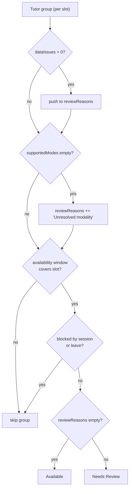
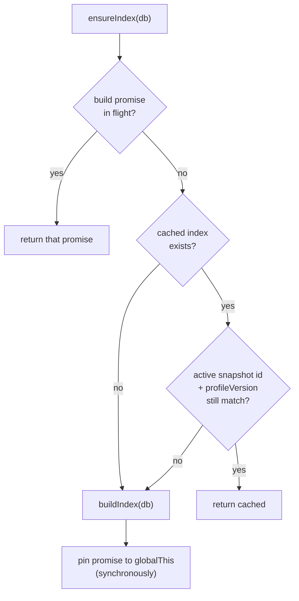

# Conventions

This page captures the handbook-level conventions you need before touching code. It is intentionally short. **The exhaustive, file:line-cited reference lives in the GSD source:**

> [`.planning/codebase/CONVENTIONS.md`](../../.planning/codebase/CONVENTIONS.md) — full breakdown of naming, imports, error handling, validation, logging, comments, function/module/component patterns.

This page does **not** fork that document; it summarizes the load-bearing rules and links back. When the two disagree, trust the code (every claim below was re-verified against HEAD).

> Note: the GSD source is dated 2026-04-29 and predates the `line/*`, `sales-dashboard/*`, and `tutor-profiles/*` route families. Its naming/style rules still hold across those newer modules, but some of its counts and "always/never" absolutes have exceptions noted below.

---

## The seven rules that matter

| Rule | What it means | Verify at |
| --- | --- | --- |
| **kebab-case files** | Every source file is kebab-case: `session-colors.ts`, `week-overview.tsx`, `past-sessions.ts`. `.tsx` for components, `.ts` for logic/types. Tests live in sibling `__tests__/` as `{module}.test.ts`. | repo-wide (zero non-kebab source files outside generated `ui/` primitives) |
| **Named exports only** | No default exports anywhere except Next.js framework files (`page.tsx`, `route.ts`, `layout.tsx`, `middleware.ts`). No barrel files — import from the specific module. | repo-wide (zero stray default exports) |
| **Zod at route boundaries** | API routes validate the parsed body with a module-scope Zod schema before any business logic. | `src/app/api/compare/route.ts:24-31,125` |
| **Fail-closed defaults** | Unresolved identity/modality/qualification → "Needs Review", never "Available". Unknown session status → blocking. Cancelled → non-blocking. Never guess. | `src/lib/normalization/sessions.ts:46-51`, `src/lib/search/engine.ts:85-92` |
| **Asia/Bangkok time** | All time math goes through the `TIMEZONE = "Asia/Bangkok"` constant and `date-fns-tz`. Never use the server's local zone. | `src/lib/normalization/timezone.ts:3`, used in ~38 files |
| **Lazy DB singleton** | `getDb()` lazily constructs the Neon client once and pins it to `globalThis` (survives Next.js HMR in dev). | `src/lib/db/index.ts:22-27` |
| **Lazy index singleton** | `ensureIndex()` returns the in-memory `SearchIndex` singleton, rebuilding only when the active snapshot id or profile version changes. | `src/lib/search/index.ts:354-401` |

The rest of this page expands the four with non-obvious mechanics. For everything else (variable casing, comment style, component patterns, function-design heuristics), go straight to the GSD source.

---

## Zod at route boundaries

Schemas are declared as `const` at module scope, above the handler. The canonical route shape — auth → JSON parse → validate → business logic — is shown in the GSD source. The dominant validation idiom is `.safeParse()` returning a 400 with `parsed.error.flatten()`:

```typescript
// src/app/api/compare/route.ts:24-31
const compareRequestSchema = z.object({
  tutorGroupIds: z.array(z.string()).min(1).max(3),
  mode: z.enum(["recurring", "one_time"]),
  dayOfWeek: z.number().min(0).max(6).optional(),
  date: z.string().optional(),
  weekStart: z.string().optional(),
  fetchOnly: z.array(z.string()).optional(),
});
```

`.safeParse()` is used in the overwhelming majority of routes (`compare`, `search`, `search/range`, `class-assignments/*`, `tutor-profiles/*`, and all `line/*` routes).

**Documented exception (not a bug):** the `sales-dashboard/*` routes call `.parse()` (which throws) *inside* a `try/catch` that returns `400` with the extracted message for any thrown error — e.g. `src/app/api/sales-dashboard/sources/route.ts:40-58`, plus `import/route.ts`, `projection-source/route.ts`, `sources/[sourceId]/route.ts`. This is a valid alternative that funnels Zod failures through the same catch as other errors; it does not leak a 500. Prefer `.safeParse()` for new routes to keep the discriminated-error pattern, but recognize both when reading the code.

Environment variables are validated the same way at module load via Zod in `src/lib/env.ts` — see [INTEGRATIONS / env reference](../reference/) for the variable list. The validation **fails the process** on a bad env rather than degrading (`src/lib/env.ts:20-25`).

For the complete route skeleton, HTTP status conventions (401/400/404/500), and the `err instanceof Error ? err.message : "<default>"` extraction idiom, see the GSD source's *Error Handling* and *Validation* sections.

---

## Fail-closed defaults

The non-negotiable product rule (never show a tutor as available without proof) is enforced mechanically in two places:

**1. Session blocking — unknown status blocks.** Only an explicit allowlist of statuses is non-blocking; everything else (including `undefined`) blocks.

```typescript
// src/lib/normalization/sessions.ts:46-51
export function isBlockingStatus(status: string | undefined): boolean {
  if (!status) return true; // fail-closed
  const upper = status.toUpperCase();
  if (NON_BLOCKING_STATUSES.has(upper)) return false;
  return true; // Unknown statuses remain blocking (fail-closed)
}
```

The non-blocking set is `CANCELLED, CANCELED, COMPLETED, MISSED, NO_SHOW` (`src/lib/normalization/sessions.ts:34-40`).

**2. Search engine — unresolved data routes to "Needs Review", never silently dropped.** A tutor group with any data issue, or with no resolved modality, accumulates `reviewReasons` instead of being returned as cleanly available:



See `src/lib/search/engine.ts:85-127`. The meaning and product rationale of these rules live in the feature docs ([search / compare](../features/)); this page only records that they are conventions you must not weaken.

---

## Asia/Bangkok time

There is exactly one timezone constant and it is the single source of truth:

```typescript
// src/lib/normalization/timezone.ts:3
export const TIMEZONE = "Asia/Bangkok";
```

All UTC→local conversion, weekday derivation, and minute-of-day computation go through `toLocalTime` / `getLocalWeekday` / `getLocalMinuteOfDay` in that module, which wrap `date-fns-tz`'s `toZonedTime` (`src/lib/normalization/timezone.ts:8-26`). Route-level "now in Bangkok" math (e.g. current-Monday for the compare week picker) also imports `TIMEZONE` rather than using a literal string — see `src/app/api/compare/route.ts:35-40`. Never call `new Date().getDay()` against the server clock; the server runs UTC.

---

## Lazy singletons (DB + search index)

Both heavy server resources are lazily constructed and pinned to `globalThis` so they survive Next.js Hot Module Replacement in development (a fresh module evaluation per edit would otherwise leak connections / rebuild the index repeatedly).

**DB** — construct once, reuse forever:

```typescript
// src/lib/db/index.ts:22-27
export function getDb(): DbInstance {
  if (!globalThis.__bgscheduler_db) {
    globalThis.__bgscheduler_db = createDb();
  }
  return globalThis.__bgscheduler_db;
}
```

**Search index** — the in-memory `SearchIndex` is the whole active snapshot loaded into memory; all search/compare queries hit it instead of Postgres. `ensureIndex()` adds two behaviors beyond plain memoization:

- **Staleness check.** It keeps the cached index only if the active snapshot id *and* the tutor-profile version still match; otherwise it rebuilds (`src/lib/search/index.ts:377-388`).
- **Race coalescing.** The in-flight build promise is assigned to the `globalThis` singleton *synchronously* (before any `await`) so concurrent first-time callers reuse one rebuild instead of each starting their own (`src/lib/search/index.ts:354-400`).



`clearSearchIndex()` resets both the cached index and the in-flight promise (`src/lib/search/index.ts:123-126`); it is the hook used after a sync promotes a new snapshot.

---

## Quick reminders (see GSD source for detail)

- **No formatter config.** 2-space indent, double quotes, trailing commas, semicolons in `src/lib/**` and `src/app/**`.
- **shadcn/ui primitives omit semicolons** — they are regenerated by the shadcn CLI and follow upstream style. Leave them as-is (e.g. `export { Button, buttonVariants }` in `src/components/ui/button.tsx`).
- **Path alias `@/*` → `./src/*`**, configured in both `tsconfig.json` and `vitest.config.ts` so tests resolve identically.
- **No external state library** on the client — `useState`/`useCallback`/`useRef` only.
- **Design-decision IDs are load-bearing** in comments (e.g. `D-04`, `REL-08`, `Pitfall 17`); they tie code back to `.planning/` documents — keep them when editing nearby code.

---

_Verified against HEAD + uncommitted WIP on 2026-05-31._
