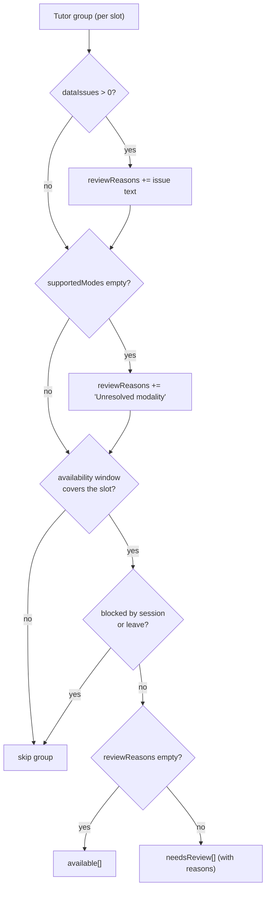
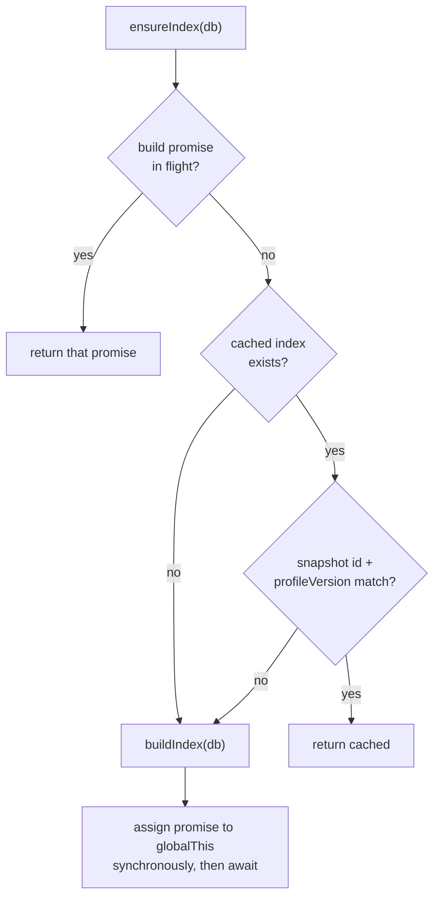

# Conventions

This page captures the handbook-level conventions you need **before** touching code. It is deliberately short.

**The exhaustive, file:line-cited breakdown lives in the GSD source:**

> [`.planning/codebase/CONVENTIONS.md`](../../.planning/codebase/CONVENTIONS.md) — full treatment of naming, imports, error handling, validation, logging, comments, and function/module/component patterns.

This page does **not** fork that document. It records the load-bearing rules, verifies each one against the current commit, and links back for the detail. When the two disagree, **trust the code**.

> **On counts.** The GSD source is a point-in-time snapshot, and this repo grows fast — its inventory numbers drift between passes. Its *rules* are durable; its *counts* are not. Every number on this page was re-measured at `main@0cd1e81`, but for authoritative inventories go to [`reference/`](../reference/) — [endpoints](../reference/api/index.md), [tables](../reference/database/index.md), [crons](../reference/crons.md), [env](../reference/env.md). **This page owns rules, not inventories.**

---

## The rules that matter

| Rule | What it means | Verified at |
|---|---|---|
| **kebab-case files** | Every `.ts` / `.tsx` / `.css` basename under `src/**` is kebab-case (`cron-auth.ts`, `payout-window-health.ts`, `case-detail-shell.tsx`). `.tsx` for components, `.ts` for logic and types. Dynamic route segments are bracket *directories* (`[caseId]`, `[...nextauth]`), never bracketed files. | zero basenames fail `^[a-z0-9]+(-[a-z0-9]+)*(\.[a-z0-9]+)*\.(ts\|tsx\|css)$` |
| **Tests in a sibling `__tests__/`** | `{module}.test.ts(x)` inside a `__tests__/` directory, never colocated. All 389 test files obey this; 13 carry the `.integration.test.ts` suffix and run in the separate serial `integration` Vitest project. | `vitest.config.ts:25-51`; zero `*.test.ts*` outside a `__tests__/` dir |
| **Named exports only** | No `export default` anywhere in `src/lib`, `src/components`, or `src/hooks`. Defaults appear *only* where the framework demands them: `page.tsx` / `layout.tsx` / `loading.tsx` under `src/app`, `src/middleware.ts:69`, and the root config files. No barrel files — the only two `index.ts` in `src/lib` (`db/`, `search/`) are real modules. | `grep -rl "^export default" src/lib src/components src/hooks` → empty |
| **Zod at route boundaries** | A module-scope Zod schema validates the request body before business logic runs; `.safeParse()` is the default (111 non-test call sites). External payloads — Wise envelopes, OpenAI responses — go through a schema too. | `src/app/api/compare/route.ts:24-31,125-131`; `src/lib/credit-control/wise.ts:157,184,245` |
| **Fail-closed defaults** | Unknown session status → blocking. Unresolved identity / modality / qualification → "Needs Review", never "Available". Never guess. | `src/lib/normalization/sessions.ts:46-50`; `src/lib/search/engine.ts:83-92,142-146` |
| **Asia/Bangkok time** | Every IANA zone literal in `src/**` is `"Asia/Bangkok"` — 92 occurrences across 62 non-test files, **zero other zones**. Never trust the runtime clock (Vercel runs UTC). | `src/lib/normalization/timezone.ts:3`; `src/lib/bangkok-time.ts:1`; `vitest.config.ts:4` |
| **Lazy DB singleton** | `getDb()` builds the Neon-HTTP client once and pins it to `globalThis` so it survives Next.js HMR. | `src/lib/db/index.ts:16-27` |
| **Lazy index singleton** | `ensureIndex()` returns the in-memory `SearchIndex`, rebuilding only when the active snapshot id or the tutor-profile version changes — with in-flight coalescing. | `src/lib/search/index.ts:94-97,354-401` |

The rest of this page expands the four non-obvious ones. For variable casing, comment style, component patterns, and function-design heuristics, go straight to the GSD source.

---

## Zod at route boundaries

Schemas are declared as `const` at module scope, above the handler (`src/app/api/compare/route.ts:24-31`, `src/app/api/post-class-feedback/review/route.ts:11-18`). Beyond that, **two dialects coexist and both are correct.** Recognize both when reading; pick by which auth model the feature uses.

### Dialect A — classic four-step (auth → JSON → `safeParse` → try/catch)

The original pattern, used by routes that call `await auth()` directly (95 of 180 `route.ts` files):

```typescript
// src/app/api/compare/route.ts:112-131
export async function POST(request: NextRequest) {
  const session = await auth();
  if (!session) {
    return NextResponse.json({ error: "Unauthorized" }, { status: 401 });
  }

  let body: unknown;
  try { body = await request.json(); }
  catch { return NextResponse.json({ error: "Invalid JSON" }, { status: 400 }); }

  const parsed = compareRequestSchema.safeParse(body);
  if (!parsed.success) {
    return NextResponse.json(
      { error: "Invalid request", details: parsed.error.flatten() },
      { status: 400 },
    );
  }
  // … business logic in its own try/catch → 500 with err.message (:136, :252)
}
```

### Dialect B — guard + typed errors + centralized mapper

Subsystems with richer role models replaced the ceremony with a `require*` guard that **throws**, `Schema.parse()` (which also throws), and one `try/catch` that funnels everything through a shared error mapper. 64 route files use a `require*` guard; 19 use `Schema.parse()` (10 post-class-feedback, 5 competitor-intelligence, 4 sales-dashboard):

```typescript
// src/app/api/post-class-feedback/review/route.ts:20-32
export async function POST(request: NextRequest) {
  try {
    const actor = await requirePostClassCapability("reviewer");
    const deduction = await applyPostClassReviewAction(actor, BodySchema.parse(await request.json()));
    return NextResponse.json({ ok: true, deduction });
  } catch (error) {
    return postClassFeedbackErrorResponse(
      "POST /api/post-class-feedback/review",
      error,
      "Could not update the review decision.",
    );
  }
}
```

`Schema.parse()` here is **not** a violation of the safeParse rule — the mapper catches `ZodError` and returns 400 (`src/lib/post-class-feedback/api.ts:35-37`); sales-dashboard does the same with a blanket `catch → 400` (`src/app/api/sales-dashboard/sources/route.ts:48-50`). The rule that actually binds: **never call `.parse()` in a route whose catch returns 500.**

### The invariant that outranks both dialects

**Authorization resolves before the body is read.** Whichever dialect a route uses, the guard runs first — a caller who may not touch the resource never gets their payload parsed, so a Zod error can never leak the shape of a resource to someone unauthorized to see it. The two dialects also mix freely; case-scoped routes are the common hybrid, pairing a Dialect-B guard pair with Dialect-A `safeParse`:

```typescript
// src/app/api/admissions/cases/[caseId]/notes/route.ts:57-68
const user = await requireAdmissionsSession();        // 1. session
const { caseId } = await ctx.params;                  // 2. Next 16 promised params
const access = await requireCaseAccess(user.email, caseId, "counselor"); // 3. per-case role

let body: unknown;                                    // 4. only now read the body
try { body = await request.json(); }
catch { return NextResponse.json({ error: "Invalid JSON" }, { status: 400 }); }
const parsed = createNoteSchema.safeParse(body);
```

`requireCaseAccess` is re-resolved from Postgres on every request rather than trusted from the JWT, and the minimum role is an explicit argument per method — `"student"` on the `GET` at `:43`, `"counselor"` on the `POST` at `:59` and the `PATCH` at `:96`. The access model itself is owned by [`operations/auth-and-access.md`](../operations/auth-and-access.md).

Six feature families ship such a mapper:

| Helper | File:line | Signature |
|---|---|---|
| `postClassFeedbackErrorResponse` | `src/lib/post-class-feedback/api.ts:12` | `(route, error, fallback)` |
| `admissionsErrorResponse` | `src/lib/admissions/access.ts:256` | `(route, error, fallbackMessage)` |
| `progressTestsErrorResponse` | `src/lib/progress-tests/api.ts:74` | `(route, error, fallbackMessage)` |
| `creditControlErrorResponse` | `src/lib/credit-control/api.ts:17` | `(route, error, fallbackMessage)` |
| `studentPromotionErrorResponse` | `src/lib/student-promotions/api.ts:29` | `(route, error, fallbackMessage)` |
| `competitorIntelligenceErrorResponse` | `src/lib/competitor-intelligence/access.ts:32` | `(error, fallbackMessage)` — **no `route` arg**; the odd one out |

**Two non-obvious things every mapper does — copy them if you write a seventh:**

1. **Re-throw `HANGING_PROMISE_REJECTION`.** Next.js 16 with `cacheComponents: true` (`next.config.ts:4`) signals an un-awaited dynamic access by rejecting with a `digest` of `"HANGING_PROMISE_REJECTION"`. Swallowing it into a 500 hides a real framework bug, so all six mappers re-throw it first (`src/lib/post-class-feedback/api.ts:13-20`).
2. **Do not serialize the raw error into the response.** `postClassFeedbackErrorResponse` logs only `error.name`, because DB and HTTP clients attach request params and response bodies that may carry private feedback text (`src/lib/post-class-feedback/api.ts:45-53`). Apply the same restraint on any surface handling parent-visible, payroll, or student data.

**Known gap, do not copy:** `competitorIntelligenceErrorResponse` has no `ZodError` branch, so a malformed body on its five `Schema.parse()` routes surfaces as a **500** with the raw message (`src/lib/competitor-intelligence/access.ts:42-53`). Add the branch when you next touch that helper.

### Environment variables — read the caveat

`src/lib/env.ts` declares an 18-key Zod schema and eagerly validates at module load, throwing `"Invalid environment variables"` and logging **only** `fieldErrors`, never values (`src/lib/env.ts:40-49`).

**It is dead code.** A search across `src/` and `scripts/` returns **zero importers of `@/lib/env`**, so that schema never runs. Do not cite it as the boot-time guard — it isn't one; even `src/middleware.ts` reads `process.env` directly, and the file says why (`src/lib/env.ts:28-31`). What is actually live: **61 distinct `process.env.X` names** read at their point of use, each with an explicit fallback or feature gate.

The conventions that do bind:

- Read a feature-scoped var at its point of use with an explicit fallback (`process.env.APP_BASE_URL?.trim() || request.nextUrl.origin`, `src/app/api/student-schedule/link/route.ts:19`) or a boolean gate (`Boolean(process.env.OPENAI_API_KEY?.trim())`, `src/lib/ai/scheduler.ts:479`).
- Treat an unset var as **off**, never as a permissive default. The one deliberate inversion is `MAINTENANCE_MODE`, which is fail-*open* (engages only on the exact string `"true"`) because a bad env value must never black out production — and the file argues the case in its header (`src/lib/maintenance.ts:9-14`, `MAINT-01`).
- Never log an env value; never put one in a URL or an error body.

The declared-vs-actually-read variable list is owned by [`reference/env.md`](../reference/env.md). The dead module is tracked in [`OPEN-QUESTIONS.md`](../OPEN-QUESTIONS.md).

---

## Fail-closed defaults

The non-negotiable product rule — never show a tutor as available without proof — is enforced mechanically, not by convention alone.

**1. Session blocking — unknown status blocks.** Only an explicit allowlist is non-blocking; everything else, including `undefined`, blocks:

```typescript
// src/lib/normalization/sessions.ts:46-51
export function isBlockingStatus(status: string | undefined): boolean {
  if (!status) return true; // fail-closed
  const upper = status.toUpperCase();
  if (NON_BLOCKING_STATUSES.has(upper)) return false;
  return true; // Unknown statuses remain blocking (fail-closed)
}
```

The non-blocking set is `CANCELLED, CANCELED, COMPLETED, MISSED, NO_SHOW` (`src/lib/normalization/sessions.ts:34-40`) — note **both** spellings of "cancelled", because Wise emits both.

**2. Modality — never inferred from thin evidence.** `deriveModality` walks pair structure → session-type evidence → location evidence and returns `"unresolved"` plus a `modality` data issue rather than defaulting to onsite. Even the "single offline record, no other evidence" case — the tempting default — is explicitly `unresolved` (`src/lib/normalization/modality.ts:67-79`, then `:81-83`).

**3. Search engine — unresolved data routes to "Needs Review", never silently dropped.** A group accumulates `reviewReasons`; a non-empty list demotes it out of `available`:


```mermaid
flowchart TD
  G["Tutor group (per slot)"] --> DI{"dataIssues > 0?"}
  DI -- yes --> RR["reviewReasons += issue text"]
  DI -- no --> MOD
  RR --> MOD{"supportedModes empty?"}
  MOD -- yes --> RR2["reviewReasons += 'Unresolved modality'"]
  MOD -- no --> WIN{"availability window<br/>covers the slot?"}
  RR2 --> WIN
  WIN -- no --> SKIP["skip group"]
  WIN -- yes --> BLK{"blocked by session<br/>or leave?"}
  BLK -- yes --> SKIP
  BLK -- no --> OUT{"reviewReasons empty?"}
  OUT -- yes --> AVAIL["available[]"]
  OUT -- no --> REVIEW["needsReview[] (with reasons)"]
```

See `src/lib/search/engine.ts:83-92` (accumulate) and `:142-146` (decide).

**4. Sign-in is fail-closed on the same principle.** `resolveUserAccess` walks admin → counselor → teacher → case member and returns `null` — sign-in denied — for an email matching none of them (`src/lib/auth-access.ts:13-16` states the posture; `:39-55` documents the cascade in JSDoc; signature at `:56-59`).

**5. Cron routes are the only thing protecting `/api/internal/`.** That prefix is on the middleware public-route allowlist (`src/middleware.ts:24`), so the in-handler secret check is the sole gate. Comparison is **constant-time**, with an O(1) length pre-check that avoids the `RangeError` `timingSafeEqual` throws on mismatched buffer lengths (REL-07):

```typescript
// src/lib/internal/cron-auth.ts:12-14
const received = Buffer.from(authHeader);
const known = Buffer.from(`Bearer ${cronSecret}`);
const valid = received.length === known.length && timingSafeEqual(received, known);
```

A server *missing* its secret returns **500**, not 401 — misconfiguration is not an auth failure (`src/lib/internal/cron-auth.ts:22-24`). 16 of the 22 `src/app/api/internal/**` routes import this helper; 6 still inline an equivalent block (`student-promotions/july-1`, `sync-competitor-intelligence`, `sync-credit-control`, `sync-room-utilization`, `sync-sales-dashboard`, `sync-wise` — the last also accepts a session for manual admin triggers, `src/app/api/internal/sync-wise/route.ts:34-46`). Migrate to the shared helper when you touch one; never add a route under `/api/internal/` without a guard.

**6. Capability tokens leak nothing.** The public parent page `/schedule/{token}` is unauthenticated by design, so expired, revoked, unknown, and malformed tokens are indistinguishable — all resolve to `null` — and only a SHA-256 hash is ever persisted (`src/lib/student-schedule/links.ts:4-13`).

The *meaning* and product rationale of these rules belong to the feature docs ([tutor-search](../features/tutor-search.md), [tutor-compare](../features/tutor-compare.md), [student-schedule](../features/student-schedule.md)). This page records only that they are conventions you must not weaken.

---

## Asia/Bangkok time

92 occurrences across 62 non-test files, **zero other IANA zones**. The rule is not "always import a constant"; it is **never trust the runtime's local zone**. Three sanctioned spellings exist:

| Form | Use | Anchor |
|---|---|---|
| `TIMEZONE` + `toZonedTime` | Server-side date math: UTC→local conversion, weekday derivation, minute-of-day | `src/lib/normalization/timezone.ts:3-26` |
| `BANGKOK_TIME_ZONE` + `Intl.DateTimeFormat` | Display formatting shared across the UI | `src/lib/bangkok-time.ts:1-21` |
| `"+07:00"` ISO offset literal | Pinning a `YYYY-MM-DD` string to a Bangkok instant — safe because Thailand has no DST | `src/lib/bangkok-time.ts:32-34` |

An inline `timeZone: "Asia/Bangkok"` in a component's `Intl` options is common and acceptable; a bare `new Date().getDay()` in server code is not. Route-level "now in Bangkok" math imports `TIMEZONE` rather than a literal — see `getCurrentMonday()` at `src/app/api/compare/route.ts:34-36`, tagged `REL-08`.

The single `timeZone: "UTC"` in the tree is not a zone choice at all: it formats a month label from a string the function itself anchored at `T00:00:00.000Z`, so UTC is the only zone that cannot shift the month (`src/lib/sales-dashboard/gm-insights.ts:499-502`). Do not generalize from it.

Tests pin the same zone process-wide: `process.env.TZ = "Asia/Bangkok"` at `vitest.config.ts:4`.

---

## Lazy singletons (DB + search index)

Both heavy server resources are lazily constructed and pinned to `globalThis`, so re-evaluating a module on every dev-mode edit neither leaks connections nor rebuilds the index. Three `declare global` blocks exist in non-test source — the two resource singletons below plus a bounded TTL memo for the live Wise overlay (`src/lib/student-schedule/live.ts:37-46`, `__bgscheduler_liveMonthSessionsCache`) that follows the same shape. No `let _db`-style module singleton exists anywhere in `src/`.

**DB** — construct once, reuse forever:

```typescript
// src/lib/db/index.ts:21-27
/** Get or create the DB singleton (survives HMR in dev). */
export function getDb(): DbInstance {
  if (!globalThis.__bgscheduler_db) {
    globalThis.__bgscheduler_db = createDb();
  }
  return globalThis.__bgscheduler_db;
}
```

`export type Database = ReturnType<typeof getDb>` (`src/lib/db/index.ts:29`) is what the codebase's dominant DI seam refers to: **227 non-test signatures end in `db: Database = getDb()`** (e.g. `src/lib/auth-access.ts:56-59`). Production callers omit it; tests pass a fake. Always expose the seam.

**Search index** — the whole active snapshot held in memory; search/compare reads hit it instead of Postgres. `ensureIndex()` adds two behaviors beyond plain memoization:

- **Staleness check.** The cache is kept only if the active snapshot id *and* the tutor-profile version still match (`src/lib/search/index.ts:377-383`). A missing active snapshot returns the stale cache rather than erroring (`:384-386`) — staleness is a warning, never withheld data.
- **Race coalescing (`REL-02`).** The in-flight build promise is assigned to the `globalThis` singleton **synchronously**, before any `await` yields, so concurrent first-time callers share one rebuild (`src/lib/search/index.ts:349-352` rationale, `:391-400` mechanism).


```mermaid
flowchart TD
  C["ensureIndex(db)"] --> IF{"build promise<br/>in flight?"}
  IF -- yes --> RET["return that promise"]
  IF -- no --> CA{"cached index<br/>exists?"}
  CA -- no --> BUILD["buildIndex(db)"]
  CA -- yes --> FRESH{"snapshot id +<br/>profileVersion match?"}
  FRESH -- yes --> USE["return cached"]
  FRESH -- no --> BUILD
  BUILD --> PIN["assign promise to globalThis<br/>synchronously, then await"]
```

Access always goes through the four private accessors (`getCurrentIndex` / `setCurrentIndex` / `getBuildingPromise` / `setBuildingPromise`, `src/lib/search/index.ts:99-113`), never the global directly. `clearSearchIndex()` resets both (`:123-126`). After a sync promotes a new snapshot, `run-wise-sync.ts` also sweeps the Next.js data cache with `revalidateTag("snapshot", { expire: 0 })` (`src/lib/sync/run-wise-sync.ts:161`), which is the tag the `src/lib/data/*` helpers declare under `"use cache"` (`src/lib/data/tutors.ts:81-83`).

### The transaction escape hatch

`getDb()` returns a **neon-http** client, which has **no transaction support**. Features needing atomicity fall back to a module-cached `pg` `Pool` (`max: 1`) with explicit `BEGIN`/`COMMIT`/`ROLLBACK`. These three modules (plus the integration-test helper) are the only importers of `pg` in `src/`:

| Feature | File:line | Note |
|---|---|---|
| Post-class feedback | `src/lib/post-class-feedback/transaction.ts:27-50` | `withPostClassTransaction` — the cleanest reference |
| Payroll sync | `src/lib/payroll/sync.ts:93-98,112-118` | `runPayrollWriteTransaction` |
| Admissions audit | `src/lib/admissions/audit.ts:87-107` | `withAuditedTransaction`, with a lazy `await import("pg")` (`:43-50`) so node builtins never reach a client bundle |

All three *try* the neon transaction first and fall back only on the driver's specific `"No transactions support in neon-http driver"` message (`src/lib/post-class-feedback/transaction.ts:11-13,31-35`). Copy that shape; do not open a `pg` pool unconditionally.

---

## Quick reminders (see GSD source for detail)

- **No formatter config.** 2-space indent, double quotes (zero single-quoted import specifiers), trailing commas; semicolons in `src/lib/**` and `src/app/**`.
- **shadcn/ui primitives omit semicolons** — all 16 files in `src/components/ui/` have **zero** semicolon-terminated lines, as does `src/lib/utils.ts`. They are regenerated by the shadcn CLI; leave them as-is.
- **ESLint 9 flat config, no custom rules** — `eslint-config-next/core-web-vitals` + `/typescript` only, plus re-declared default ignores (`eslint.config.mjs:5-16`). Lint and typecheck are separate scripts (`npm run lint`, `npm run typecheck`). 26 inline `eslint-disable` sites in non-test source, confined to four rules (`react-hooks/exhaustive-deps` 14, `react-hooks/set-state-in-effect` 9, `@typescript-eslint/no-unused-vars` 2, `no-var` 1 — the `globalThis` augmentation at `src/lib/db/index.ts:17`).
- **Path alias `@/*` → `./src/*`**, declared in *both* `tsconfig.json:21-22` and `vitest.config.ts:7-11` so tests resolve identically. `import * as` is reserved for the Drizzle schema (92 non-test sites), React, and `xlsx`.
- **`console` only, no logger** — 84 `console.*` calls in non-test source and **zero** `console.warn`. `console.log` appears in exactly three files: `src/lib/db/seed.ts` (8, seed progress) and the two LINE schedule-bot modules, which funnel everything through one bracketed `[schedule-bot]` / `[schedule-bot-group]` prefix (`src/lib/line/schedule-bot-group.ts:482`). Never log bodies, secrets, or env values.
- **Typed errors over string sentinels.** 21 `*Error extends Error` classes exist in non-test source; the only dedicated `errors.ts` is `src/lib/post-class-feedback/errors.ts`. Older domains still throw sentinel `"Unauthorized"` / `"Forbidden"` strings that the mappers match on — both work, but prefer a class for anything a caller must distinguish. `PostClassAccessError` carries its own HTTP `status` (`src/lib/post-class-feedback/access.ts:24-32`).
- **Single-flight via unique index, not a lock.** Long-running jobs race to insert a `running` row and treat Postgres `23505` as "someone else has it". The `isUniqueViolation` predicate is duplicated in 8 modules (`src/lib/sync/run-wise-sync.ts:42-47` is the original) — reuse the nearest copy verbatim.
- **No external client state library** — `useState`/`useCallback`/`useRef`/`useEffect` only. 139 files carry `"use client"`; 20 server-only lib modules carry `import "server-only"` as their first line (`src/lib/post-class-feedback/transaction.ts:1`).
- **Server-first reads, and no Server Actions.** `"use server"` appears **zero** times — every mutation goes through an API route. Next.js 16 `"use cache"` appears in exactly 9 files: the three `src/lib/data/*` helpers, `credit-control/service.ts`, `progress-tests/service.ts`, `sales-dashboard/data.ts`, `us-universities/data.ts`, and the two `admissions` pages. Uncached `auth()` calls sit in their own async component inside `<Suspense>` because `cacheComponents` requires it (`src/app/(app)/layout.tsx:8-13`).
- **`maxDuration` is the only per-route segment config** — exported by 43 routes (`src/app/api/internal/sync-wise/route.ts:7` = 800). No `dynamic`/`revalidate`/`runtime` exports anywhere.
- **Next 16 promised params** — dynamic route handlers take `ctx: { params: Promise<{ caseId: string }> }` and await it inside the guard block (`src/app/api/admissions/cases/[caseId]/notes/route.ts:38`).
- **Zero `TODO`/`FIXME`/`HACK`** outside tests. Treat one as a defect, not a note.
- **Design-decision IDs are load-bearing** in comments — measured in non-test source: `CM-*` (637), `D-*` (72), `BOT-*` (59), `REL-*` (28), `REC-*` (27), `IDENT-*` (23), `MAINT-*` (21), `MOD-*` (19), `PAST-*` (12), `TCOV-*` (10). They tie code to `.planning/` documents and `docs/casemanagementsystem_design.md`; preserve them when editing nearby code. Cross-cutting versioned constants carry their migration history in JSDoc and an explicit "MUST bump" rule (`src/lib/search/cache-version.ts:9-24`).
- **Two section-header comment styles coexist** — em-dash bars `// ── Name ──` (85 files; 55 in `src/lib`, e.g. `src/lib/search/index.ts:92`) and hyphen blocks `// -----` (86 files; 62 in `src/components`, and the form used for file-header threat-model blocks such as `src/lib/student-schedule/links.ts:1-14`). Match whichever the file already uses.
- **No TypeScript `enum`** — zero declarations. Database enums are Drizzle `pgEnum` in `src/lib/db/schema.ts` (61 declarations), which double as the TS union source. Migrations are generated from that single schema file by `drizzle-kit` (`drizzle.config.ts`).

---

## Automated enforcement

Conventions a reviewer would otherwise catch by eye are wired into `npm run verify:release`, which chains typecheck → unit tests → build → typecheck → `git diff --check` → route-surface guard (`package.json`, `scripts.verify:release`):

- **`guard:production-route-surface`** (`scripts/check-production-route-surface.mjs:6-7,21`) walks `src/app/**` for `page.tsx` / `route.ts` and diffs the discovered route list against the checked-in manifest `docs/reference/production-route-surface.json`. A new public surface cannot ship silently.
- **`guard:sales-dashboard-scope`** (`scripts/check-sales-dashboard-scope.mjs:3-11`) confines one external collaborator's changes to five `sales-dashboard` path prefixes.
- **Cron registry ↔ `vercel.json` parity is a unit test.** `SCHEDULED_CRON_JOBS = CRON_JOBS.filter((job) => !job.manualOnly)` (`src/lib/data-health/cron-registry.ts:401`) is diffed against `vercel.json` in `src/lib/data-health/__tests__/cron-registry.test.ts:20-24`, and `src/__tests__/vercel-crons.test.ts` pins the stagger. Adding a scheduled cron means adding **both** entries; the schedule inventory itself lives in [`reference/crons.md`](../reference/crons.md).
- **`deploy:prod`** chains `verify:release` with `scripts/assert-production-deploy-ready.mjs`, which refuses a dirty worktree (`:26`) or a `HEAD` that differs from `origin/main` (`:36-39`). See [`operations/runbook.md`](../operations/runbook.md) for the deploy path — and note that a bare `vercel --prod` from an unlinked worktree creates a stray Vercel project instead of deploying.

---

_Verified against main@0cd1e81 (clean tree) on 2026-09-02._
