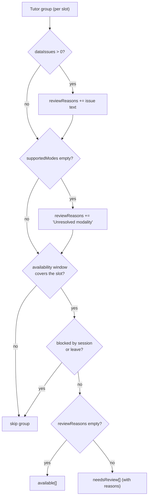
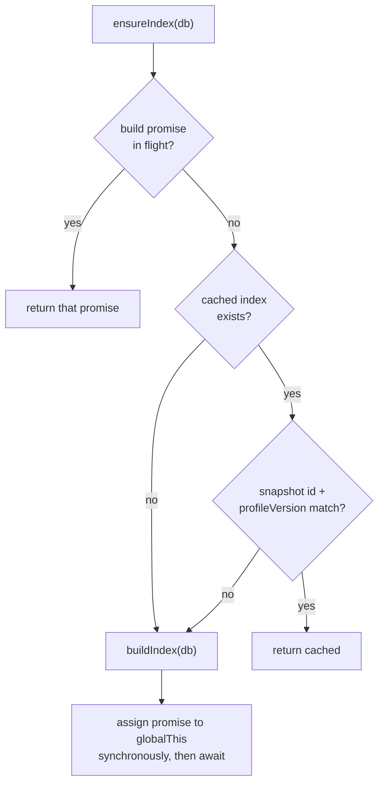

# Conventions

This page captures the handbook-level conventions you need **before** touching code. It is deliberately short.

**The exhaustive, file:line-cited breakdown lives in the GSD source:**

> [`.planning/codebase/CONVENTIONS.md`](../../.planning/codebase/CONVENTIONS.md) — full treatment of naming, imports, error handling, validation, logging, comments, and function/module/component patterns.

This page does **not** fork that document. It records the load-bearing rules, verifies each one against HEAD, and links back for the detail. When the two disagree, **trust the code**.

> **On counts.** The GSD source is a point-in-time snapshot, and this repo grows fast — its inventory numbers drift between passes. Its *rules* are durable; its *counts* are not. Every number on this page was re-measured against HEAD, but for authoritative inventories go to [`reference/`](../reference/) — [endpoints](../reference/api/index.md), [tables](../reference/database/index.md), [crons](../reference/crons.md), [env](../reference/env.md). **This page owns rules, not inventories.**

---

## The rules that matter

| Rule | What it means | Verified at |
|---|---|---|
| **kebab-case files** | Every source file is kebab-case: `session-colors.ts`, `payout-window-health.ts`, `week-overview.tsx`. `.tsx` for components, `.ts` for logic/types. Zero exceptions repo-wide. | every basename under `src/**` matches `^[a-z0-9]+(-[a-z0-9]+)*` |
| **Tests in a sibling `__tests__/`** | `{module}.test.ts(x)`, never colocated beside the module. All 369 test files obey this; 12 carry the `.integration.test.ts` suffix and run in a separate serial Vitest project. | `vitest.config.ts:25-51`; zero `*.test.ts*` outside a `__tests__/` dir |
| **Named exports only** | No `export default` anywhere in `src/lib`, `src/components`, or `src/hooks`. Defaults appear *only* where Next.js requires them (`page.tsx`, `route.ts`, `layout.tsx`, `middleware.ts`, `next.config.ts`). No barrel files — import the specific module. | `grep -rn "export default" src/lib src/components src/hooks` → empty |
| **Zod at route boundaries** | A module-scope Zod schema validates the request body before any business logic runs. 107 non-test `.safeParse()` sites. | `src/app/api/compare/route.ts:24-31,125-131` |
| **Fail-closed defaults** | Unknown session status → blocking. Unresolved identity/modality/qualification → "Needs Review", never "Available". Never guess. | `src/lib/normalization/sessions.ts:46-51`, `src/lib/search/engine.ts:83-92,142-146` |
| **Asia/Bangkok time** | Every IANA zone reference in `src/**` is `"Asia/Bangkok"` — 91 occurrences across 62 non-test files, **zero other zones**. Never the runtime clock (Vercel runs UTC). | `src/lib/normalization/timezone.ts:3`, `src/lib/bangkok-time.ts:1` |
| **Lazy DB singleton** | `getDb()` builds the Neon-HTTP client once and pins it to `globalThis` so it survives Next.js HMR. | `src/lib/db/index.ts:16-27` |
| **Lazy index singleton** | `ensureIndex()` returns the in-memory `SearchIndex`, rebuilding only when the active snapshot id or the tutor-profile version changes — with in-flight coalescing. | `src/lib/search/index.ts:94-97,354-401` |

The rest of this page expands the four non-obvious ones. For variable casing, comment style, component patterns, and function-design heuristics, go straight to the GSD source.

---

## Zod at route boundaries

Schemas are declared as `const` at module scope, above the handler. Beyond that, **two dialects coexist and both are correct.** Recognize both when reading; pick by which auth model the feature uses.

### Dialect A — classic four-step (auth → JSON → `safeParse` → try/catch)

The original pattern, used by routes that call `await auth()` directly (94 of 178 `route.ts` files):

```typescript
// src/app/api/compare/route.ts:112-133
export async function POST(request: NextRequest) {
  const session = await auth();
  if (!session) {
    return NextResponse.json({ error: "Unauthorized" }, { status: 401 });
  }

  let body: unknown;
  try { body = await request.json(); }
  catch { return NextResponse.json({ error: "Invalid JSON" }, { status: 400 }); }

  const parsed = compareRequestSchema.safeParse(body);
  if (!parsed.success) {
    return NextResponse.json(
      { error: "Invalid request", details: parsed.error.flatten() },
      { status: 400 },
    );
  }

  try { /* … */ } catch (err) { /* 500 with err.message */ }
}
```

### Dialect B — guard + typed errors + centralized mapper

Subsystems with richer role models replaced the ceremony with a `require*` guard that **throws**, `Schema.parse()` (which also throws), and one `try/catch` that funnels everything through a shared error mapper. 64 route files use a `require*` guard; 20 use `Schema.parse()`:

```typescript
// src/app/api/post-class-feedback/review/route.ts:20-32
export async function POST(request: NextRequest) {
  try {
    const actor = await requirePostClassCapability("reviewer");
    const deduction = await applyPostClassReviewAction(actor, BodySchema.parse(await request.json()));
    return NextResponse.json({ ok: true, deduction });
  } catch (error) {
    return postClassFeedbackErrorResponse(
      "POST /api/post-class-feedback/review",
      error,
      "Could not update the review decision.",
    );
  }
}
```

`Schema.parse()` here is **not** a violation of the safeParse rule — the mapper catches `ZodError` and returns 400 (`src/lib/post-class-feedback/api.ts:35-37`). It never leaks a 500. The rule that actually binds: **never call `.parse()` in a route whose catch returns 500.**

Six feature families ship such a mapper:

| Helper | File:line | Signature |
|---|---|---|
| `postClassFeedbackErrorResponse` | `src/lib/post-class-feedback/api.ts:12` | `(route, error, fallback)` |
| `admissionsErrorResponse` | `src/lib/admissions/access.ts:256` | `(route, error, fallbackMessage)` |
| `progressTestsErrorResponse` | `src/lib/progress-tests/api.ts:74` | `(route, error, fallbackMessage)` |
| `creditControlErrorResponse` | `src/lib/credit-control/api.ts:17` | `(route, error, fallbackMessage)` |
| `studentPromotionErrorResponse` | `src/lib/student-promotions/api.ts:29` | `(route, error, fallbackMessage)` |
| `competitorIntelligenceErrorResponse` | `src/lib/competitor-intelligence/access.ts:32` | `(error, fallbackMessage)` — **no `route` arg**; the odd one out |

**Two non-obvious things every mapper does — copy them if you write a seventh:**

1. **Re-throw `HANGING_PROMISE_REJECTION`.** Next.js 16 with `cacheComponents: true` (`next.config.ts:4`) signals an un-awaited dynamic access by rejecting with a `digest` of `"HANGING_PROMISE_REJECTION"`. Swallowing it into a 500 hides a real framework bug, so every mapper re-throws it first (`src/lib/post-class-feedback/api.ts:13-20`).
2. **Do not serialize the raw error into the response.** `postClassFeedbackErrorResponse` logs only `error.name`, because DB and HTTP clients attach request params and response bodies that may carry private feedback text (`src/lib/post-class-feedback/api.ts:45-53`). Apply the same restraint on any surface handling parent-visible, payroll, or student data.

### Environment variables — read the caveat

`src/lib/env.ts` declares a 15-key Zod schema and eagerly validates at module load, throwing `"Invalid environment variables"` and logging **only** `fieldErrors`, never values (`src/lib/env.ts:28-37`).

**It is dead code.** A search across `src/` and `scripts/` returns **zero importers of `@/lib/env`**, so that schema never runs. Do not cite it as the boot-time guard — it isn't one. What is actually live: **61 distinct `process.env.X` variables** read at their point of use, each with an explicit fallback or feature gate.

The conventions that do bind:

- Read a feature-scoped var at its point of use with an explicit fallback (`process.env.APP_BASE_URL?.trim() || request.nextUrl.origin`) or a boolean gate (`Boolean(process.env.OPENAI_API_KEY?.trim())`).
- Treat an unset var as **off**, never as a permissive default.
- Never log an env value; never put one in a URL or an error body.

The declared-vs-actually-read variable list is owned by [`reference/env.md`](../reference/env.md). The dead module is tracked in [`OPEN-QUESTIONS.md`](../OPEN-QUESTIONS.md).

---

## Fail-closed defaults

The non-negotiable product rule — never show a tutor as available without proof — is enforced mechanically, not by convention alone.

**1. Session blocking — unknown status blocks.** Only an explicit allowlist is non-blocking; everything else, including `undefined`, blocks:

```typescript
// src/lib/normalization/sessions.ts:46-51
export function isBlockingStatus(status: string | undefined): boolean {
  if (!status) return true; // fail-closed
  const upper = status.toUpperCase();
  if (NON_BLOCKING_STATUSES.has(upper)) return false;
  return true; // Unknown statuses remain blocking (fail-closed)
}
```

The non-blocking set is `CANCELLED, CANCELED, COMPLETED, MISSED, NO_SHOW` (`src/lib/normalization/sessions.ts:34-40`) — note **both** spellings of "cancelled", because Wise emits both.

**2. Modality — never inferred from thin evidence.** `deriveModality` walks structural evidence → session-type evidence → location evidence and returns `"unresolved"` plus an issue rather than defaulting to onsite.

**3. Search engine — unresolved data routes to "Needs Review", never silently dropped.** A group accumulates `reviewReasons`; a non-empty list demotes it out of `available`:


```mermaid
flowchart TD
  G["Tutor group (per slot)"] --> DI{"dataIssues > 0?"}
  DI -- yes --> RR["reviewReasons += issue text"]
  DI -- no --> MOD
  RR --> MOD{"supportedModes empty?"}
  MOD -- yes --> RR2["reviewReasons += 'Unresolved modality'"]
  MOD -- no --> WIN{"availability window<br/>covers the slot?"}
  RR2 --> WIN
  WIN -- no --> SKIP["skip group"]
  WIN -- yes --> BLK{"blocked by session<br/>or leave?"}
  BLK -- yes --> SKIP
  BLK -- no --> OUT{"reviewReasons empty?"}
  OUT -- yes --> AVAIL["available[]"]
  OUT -- no --> REVIEW["needsReview[] (with reasons)"]
```

See `src/lib/search/engine.ts:83-92` (accumulate) and `142-146` (decide).

**4. Sign-in is fail-closed on the same principle.** `resolveUserAccess` walks admin → counselor → teacher → case member and returns `null` — sign-in denied — for an email matching none of them (`src/lib/auth-access.ts:39-55` documents the cascade in JSDoc).

**5. Cron routes are the only thing protecting `/api/internal/`.** That prefix is on the middleware public-route allowlist (`src/middleware.ts:18`), so the in-handler secret check is the sole gate. Comparison is **constant-time**, with an O(1) length pre-check that avoids the `RangeError` `timingSafeEqual` throws on mismatched buffer lengths (REL-07):

```typescript
// src/lib/internal/cron-auth.ts:12-14
const received = Buffer.from(authHeader);
const known = Buffer.from(`Bearer ${cronSecret}`);
const valid = received.length === known.length && timingSafeEqual(received, known);
```

A server *missing* its secret returns **500**, not 401 — misconfiguration is not an auth failure (`src/lib/internal/cron-auth.ts:22-24`). Never add a route under `/api/internal/` without this guard.

The *meaning* and product rationale of these rules belong to the feature docs ([tutor-search](../features/tutor-search.md), [tutor-compare](../features/tutor-compare.md)). This page records only that they are conventions you must not weaken.

---

## Asia/Bangkok time

91 occurrences across 62 non-test files, **zero other IANA zones**. The rule is not "always import a constant"; it is **never trust the runtime's local zone**. Three sanctioned spellings exist:

| Form | Use | Anchor |
|---|---|---|
| `TIMEZONE` + `toZonedTime` | Server-side date math: UTC→local conversion, weekday derivation, minute-of-day | `src/lib/normalization/timezone.ts:3-26` |
| `BANGKOK_TIME_ZONE` + `Intl.DateTimeFormat` | Display formatting shared across the UI | `src/lib/bangkok-time.ts:1-21` |
| `"+07:00"` ISO offset literal | Pinning a `YYYY-MM-DD` string to a Bangkok instant — safe because Thailand has no DST | `src/lib/bangkok-time.ts:32-34` |

An inline `timeZone: "Asia/Bangkok"` in a component's `Intl` options is common and acceptable; a bare `new Date().getDay()` in server code is not. Route-level "now in Bangkok" math imports `TIMEZONE` rather than a literal — see `getCurrentMonday()` at `src/app/api/compare/route.ts:33-41`, tagged `REL-08`.

Tests pin the same zone process-wide: `process.env.TZ = "Asia/Bangkok"` at `vitest.config.ts:4`.

---

## Lazy singletons (DB + search index)

Both heavy server resources are lazily constructed and pinned to `globalThis`, so re-evaluating a module on every dev-mode edit neither leaks connections nor rebuilds the index. These are the **only** two `declare global` blocks in the repo (`src/lib/db/index.ts:16`, `src/lib/search/index.ts:94`); no `let _db` style module singleton exists anywhere.

**DB** — construct once, reuse forever:

```typescript
// src/lib/db/index.ts:22-27
export function getDb(): DbInstance {
  if (!globalThis.__bgscheduler_db) {
    globalThis.__bgscheduler_db = createDb();
  }
  return globalThis.__bgscheduler_db;
}
```

`export type Database = ReturnType<typeof getDb>` (`src/lib/db/index.ts:29`) is what the codebase's dominant DI seam refers to: **223 non-test signatures end in `db: Database = getDb()`**. Production callers omit it; tests pass a fake. Always expose the seam.

**Search index** — the whole active snapshot held in memory; search/compare reads hit it instead of Postgres. `ensureIndex()` adds two behaviors beyond plain memoization:

- **Staleness check.** The cache is kept only if the active snapshot id *and* the tutor-profile version still match (`src/lib/search/index.ts:377-383`). A missing active snapshot returns the stale cache rather than erroring (`:384-386`) — staleness is a warning, never withheld data.
- **Race coalescing (`REL-02`).** The in-flight build promise is assigned to the `globalThis` singleton **synchronously**, before any `await` yields, so concurrent first-time callers share one rebuild (`src/lib/search/index.ts:391-400`).


```mermaid
flowchart TD
  C["ensureIndex(db)"] --> IF{"build promise<br/>in flight?"}
  IF -- yes --> RET["return that promise"]
  IF -- no --> CA{"cached index<br/>exists?"}
  CA -- no --> BUILD["buildIndex(db)"]
  CA -- yes --> FRESH{"snapshot id +<br/>profileVersion match?"}
  FRESH -- yes --> USE["return cached"]
  FRESH -- no --> BUILD
  BUILD --> PIN["assign promise to globalThis<br/>synchronously, then await"]
```

Access always goes through the four private accessors (`getCurrentIndex` / `setCurrentIndex` / `getBuildingPromise` / `setBuildingPromise`, `src/lib/search/index.ts:99-113`), never the global directly. `clearSearchIndex()` resets both (`:123-126`) — the hook used after a sync promotes a new snapshot.

### The transaction escape hatch

`getDb()` returns a **neon-http** client, which has **no transaction support**. Features needing atomicity fall back to a module-cached `pg` `Pool` (`max: 1`) with explicit `BEGIN`/`COMMIT`/`ROLLBACK`:

| Feature | File:line |
|---|---|
| Post-class feedback | `src/lib/post-class-feedback/transaction.ts:27-50` |
| Payroll sync | `src/lib/payroll/sync.ts:93-97,110` |
| Admissions audit | `src/lib/admissions/audit.ts:87-99` — `withAuditedTransaction`, with a lazy `import()` so `pg` never loads on read paths |

The post-class helper is the cleanest reference: it *tries* the neon transaction first and falls back only on the driver's specific `"No transactions support in neon-http driver"` message (`src/lib/post-class-feedback/transaction.ts:11-13,31-35`).

---

## Quick reminders (see GSD source for detail)

- **No formatter config.** 2-space indent, double quotes, trailing commas; semicolons in `src/lib/**` and `src/app/**`.
- **shadcn/ui primitives omit semicolons** — all 15 files in `src/components/ui/` have **zero** semicolon-terminated lines. They are regenerated by the shadcn CLI; leave them as-is.
- **ESLint 9 flat config, no custom rules** — `eslint-config-next/core-web-vitals` + `/typescript` only, plus re-declared default ignores (`eslint.config.mjs:5-16`). Lint and typecheck are separate scripts (`npm run lint`, `npm run typecheck`).
- **Path alias `@/*` → `./src/*`**, declared in *both* `tsconfig.json:21-23` and `vitest.config.ts:7-11` so tests resolve identically.
- **`console` only, no logger** — 73 `console.*` calls in non-test source and **zero** `console.warn`. Never log bodies, secrets, or env values.
- **No external client state library** — `useState`/`useCallback`/`useRef`/`useEffect` only. 146 files carry `"use client"`; 17 server-only lib modules carry `import "server-only"`.
- **Server-first reads, and no Server Actions.** `"use server"` appears **zero** times — every mutation goes through an API route. Next.js 16 `"use cache"` appears in exactly 9 files: the three `src/lib/data/*` helpers, `credit-control/service.ts`, `progress-tests/service.ts`, `sales-dashboard/data.ts`, `us-universities/data.ts`, and the two `admissions` pages.
- **`maxDuration` is the only per-route segment config** — exported by 42 routes. No `dynamic`/`revalidate`/`runtime` exports anywhere.
- **Zero `TODO`/`FIXME`/`HACK`** outside tests. Treat one as a defect, not a note.
- **Design-decision IDs are load-bearing** in comments — measured in non-test source: `CM-*` (637), `D-*` (72), `BOT-*` (37), `REC-*` (27), `REL-*` (26), `IDENT-*` (23), `MOD-*` (19), `PAST-*` (12). They tie code to `.planning/` documents and `docs/casemanagementsystem_design.md`; preserve them when editing nearby code.
- **Two section-header comment styles coexist** — em-dash bars `// ── Name ──` (123 files, dominant in `src/lib`) and hyphen blocks `// -----` (79 files, dominant in `src/components` and newer libs). Match whichever the file already uses.

---

## Automated enforcement

Conventions a reviewer would otherwise catch by eye are wired into `npm run verify:release`, which chains typecheck → unit tests → build → typecheck → `git diff --check` → route-surface guard (`package.json`):

- **`guard:production-route-surface`** (`scripts/check-production-route-surface.mjs`) walks `src/app/**` for `page.tsx` / `route.ts` and diffs the discovered route list against the checked-in manifest `docs/reference/production-route-surface.json`. A new public surface cannot ship silently.
- **`guard:sales-dashboard-scope`** (`scripts/check-sales-dashboard-scope.mjs:3-11`) confines one external collaborator's changes to five `sales-dashboard` path prefixes.
- **`deploy:prod`** chains `verify:release` with `scripts/assert-production-deploy-ready.mjs`. See [`operations/runbook.md`](../operations/runbook.md) for the deploy path — and note that a bare `vercel --prod` from an unlinked worktree creates a stray Vercel project instead of deploying.

---

_Verified against HEAD + uncommitted WIP on 2026-05-31._
