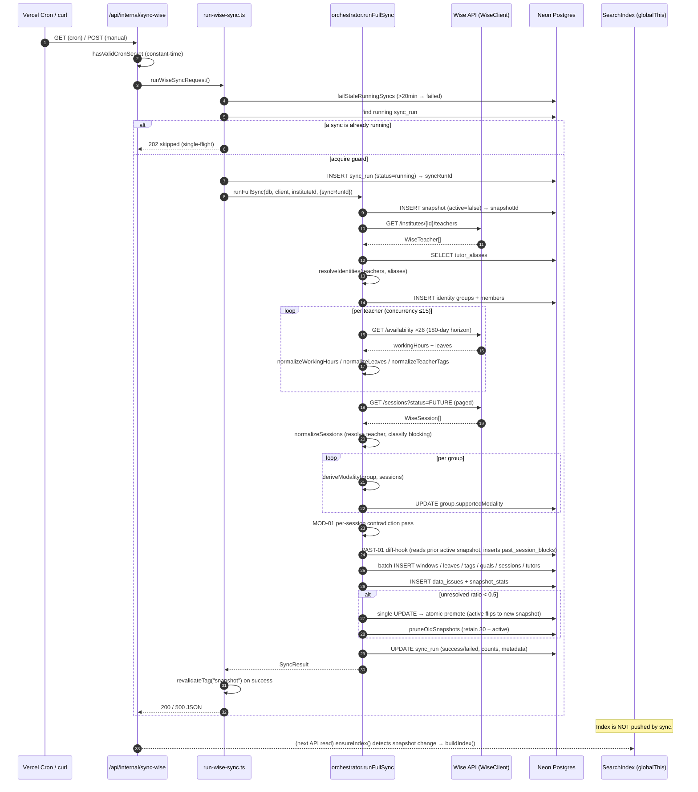

# Data Flow (ETL)

**Status: stable**

## Purpose

This document traces the **Wise snapshot sync** — the single ETL pipeline that turns the live Wise scheduling platform into the normalized, versioned, in-memory data that every search and compare query reads. It is the backbone of the application's "source of truth" rule: production truth comes from the Wise API only, is fetched on a schedule, normalized through six domain modules, written into a fresh immutable snapshot, validated, and atomically promoted. Search and compare never call Wise directly — they read a process-global index built from the active snapshot.

The pipeline's single entry point is `runFullSync()` in `src/lib/sync/orchestrator.ts:50`. It is triggered by a Vercel cron every 30 minutes (`vercel.json`, path `/api/internal/sync-wise`, schedule `*/30 * * * *`) and can also be triggered manually. A single-flight guard ensures only one sync runs at a time.

> **Scope note.** This is the *tutor-availability* snapshot sync. Other staggered crons (Wise Activity audit, Sales Dashboard, Credit Control, Leave Requests, class-assignment emails — all listed in `vercel.json`) are separate pipelines documented with their own features. They share the `WiseClient` but not the snapshot/promotion machinery described here.

## The stage map

The full pipeline, end to end:

```
Trigger (cron GET / manual POST)
  └─ run-wise-sync.ts: single-flight guard → acquire syncRunId
       └─ orchestrator.ts: runFullSync()
            1.  Create / adopt sync_run row (status=running)
            2.  Create candidate snapshot (active=false)
            3.  Fetch all teachers ........................... Wise GET /teachers
            4.  Load tutor_aliases (DB)
            5.  Resolve identities .......................... normalization/identity
            6.  Persist identity groups + members (DB write)
            7.  Per teacher: fetch availability + leaves .... Wise GET /availability ×26
                  → normalize working hours, leaves, tags, qualifications
            8.  Fetch all FUTURE sessions ................... Wise GET /sessions (paged)
                  → normalize session blocks
            9.  Derive modality per group ................... normalization/modality
                  → MOD-01 per-session contradiction pass
            9.5 PAST-01 diff-hook: capture dropped past sessions (DB write)
            10. Batch-insert windows/leaves/tags/quals/sessions/tutors (DB write)
            11. Insert data_issues + snapshot_stats (DB write)
            12. Validate (unresolved ratio) → atomic promote (single UPDATE)
                  → on success: prune old snapshots, mark sync_run success
       └─ run-wise-sync.ts: revalidateTag("snapshot") on success
  ... later, on first read ...
  └─ ensureIndex(): staleness check → buildIndex() rebuilds the in-memory SearchIndex
```

A note on numbering: the comment numbers in the orchestrator source (`// 1.` … `// 12.`) are followed throughout this document so the prose and the code line up. Step 9.5 (the diff-hook) is interleaved between the modality work and the bulk insert; the section below explains why.

## Sequence diagram



## Trigger and entry (steps before runFullSync)

### Authentication and dispatch

The HTTP entry point is `src/app/api/internal/sync-wise/route.ts`. Both verbs route through one `handleSync` helper:

- **`GET`** is what Vercel cron invokes; it accepts only the `CRON_SECRET` bearer token (`allowSessionAuth: false`, `route.ts:57`–`59`).
- **`POST`** additionally accepts an authenticated Auth.js admin session, so a logged-in admin can trigger a manual sync from the browser, and `curl -X POST` with the secret still works (`route.ts:62`–`64`).

The secret check is constant-time. It length-pre-checks before calling `crypto.timingSafeEqual` to avoid the `RangeError` that function throws on length-mismatched buffers (REL-07, `route.ts:10`–`28`). A missing `CRON_SECRET` env var returns `500 Server misconfigured` rather than silently allowing the call (`route.ts:49`–`51`).

`maxDuration = 800` (`route.ts:6`) gives the function up to ~13 minutes on the Vercel Pro plan — headroom over the ~4.5-minute production sync time.

### Single-flight guard

`runWiseSyncRequest()` in `src/lib/sync/run-wise-sync.ts:142` constructs the `WiseClient` and resolves the institute id (defaulting to `696e1f4d90102225641cc413`, `run-wise-sync.ts:145`), then acquires a guard before doing any work. `acquireSyncRun` (`run-wise-sync.ts:88`) does three things in order:

1. **Fail abandoned runs.** Any `sync_run` still in `running` state older than 20 minutes (`STALE_RUNNING_SYNC_MS`, `run-wise-sync.ts:10`) is forced to `failed` with an explanatory `errorSummary` (`failStaleRunningSyncs`, `run-wise-sync.ts:51`). This recovers from a function that timed out or was aborted mid-sync without leaving the guard permanently stuck.
2. **Check for a live run.** If a `running` row still exists, the request short-circuits with a `202` and a `SkippedSyncResult` (`run-wise-sync.ts:95`–`97`, `120`–`140`). No second sync starts.
3. **Insert the guard row.** Otherwise it inserts a fresh `sync_run` (`status=running`) and passes its id into `runFullSync` as `options.syncRunId` (`run-wise-sync.ts:100`–`105`, `152`). A unique-violation (`23505`) on insert is treated as a lost race and also resolves to the skipped result (`run-wise-sync.ts:106`–`117`).

Because `runFullSync` accepts a pre-acquired `syncRunId`, the orchestrator skips its own `sync_run` creation when the guard already made one (`orchestrator.ts:62`–`68`).

## The Wise client (transport layer)

Every Wise call goes through `WiseClient` (`src/lib/wise/client.ts`). Two cross-cutting behaviors matter for the ETL:

- **Auth headers** are computed per request: HTTP Basic (`base64(userId:apiKey)`), plus `x-api-key`, `x-wise-namespace`, and a `user-agent: VendorIntegrations/{namespace}` (`client.ts:52`–`61`).
- **Concurrency limiter.** A queue caps in-flight requests at `maxConcurrency` (`client.ts:136`–`156`). The production factory `createWiseClient()` sets this to **15** (`client.ts:159`–`166`), versus the class default of 5 — this is what lets the per-teacher availability fan-out (one teacher = 26 windowed calls) complete inside the function timeout.
- **Retry/backoff.** `fetchWithRetry` retries up to `maxRetries` (default 3) with exponential backoff of 1s/2s/4s, but **only** for transient failures: network errors and the status set `{408, 429, 500, 502, 503, 504}` (`RETRYABLE_STATUS_CODES`, `client.ts:23`–`30`, `91`–`134`). Permanent 4xx (401/403/404/422) fail fast with a thrown `Wise API {status}` error — no retry budget wasted (REL-05, `client.ts:121`–`124`).

A thrown client error propagates differently depending on where it occurs: a failure inside the per-teacher loop is caught and downgraded to a data issue (see step 7); a failure in the teacher list (step 3) or session fetch (step 8) is uncaught and aborts the whole sync into the `catch` block (step 12, failure path).

For the exact endpoint signatures and fetcher contracts, see [docs/reference/wise-api.md](../reference/wise-api.md).

## Step 1–2: Sync run + candidate snapshot

`runFullSync` opens by ensuring a `sync_run` row exists (created here only if the caller did not pass one, `orchestrator.ts:62`–`68`), then **always** inserts a fresh `snapshot` with `active = false` (`orchestrator.ts:71`–`75`) and links it onto the `sync_run` via `snapshotId` (`orchestrator.ts:78`–`81`). The candidate snapshot is the write target for every subsequent insert; nothing it contains is visible to readers until promotion (step 12). The prior active snapshot stays active and serves all reads throughout the sync.

## Step 3–6: Identity resolution

### Fetch and inputs

`fetchAllTeachers` (`src/lib/wise/fetchers.ts:29`) pulls the full teacher roster in one call (`GET /institutes/{id}/teachers`). The alias overrides are loaded from the `tutor_aliases` table (`orchestrator.ts:87`–`91`) and passed alongside.

### The 5-step cascade

`resolveIdentities` (`src/lib/normalization/identity.ts:72`) collapses the raw Wise teacher records — which split each real person into separate online and onsite teacher rows — into logical **identity groups**. The resolution order:

1. **Nickname extraction.** Pull the parenthetical from the display name: `"Chinnakrit (Celeste) Channiti" → "Celeste"` (`extractNickname`, `identity.ts:43`–`46`).
2. **Alias override.** Lower-case the nickname and look it up in the alias map; the alias's `toKey` becomes the canonical key, else the nickname itself is used (`identity.ts:96`–`100`).
3. **Online/offline pair merge.** Teachers are grouped by lower-cased canonical key. The `Online` suffix is detected (`isOnlineVariant`, `identity.ts:52`–`54`) and the display name is taken from the non-online member when available (`identity.ts:127`–`133`). A clean group is exactly one solo entry, or exactly one online + one offline pair.
4. **Collision detection.** A canonical key matching more than two teachers — or two that are *not* a clean online+offline pair — is flagged as an `identity_collision` alias issue, but the group is **still kept** so its members appear in Needs Review for manual disambiguation (REL-03, `identity.ts:153`–`170`).
5. **Unresolved fallback.** A teacher with no extractable nickname and no alias match gets an `alias` data issue *and* is still wrapped in a solo group so it surfaces in Needs Review rather than vanishing (`identity.ts:177`–`204`).

This is the first expression of the **fail-closed** rule: unresolved identity never drops a teacher silently; it routes them to review.

### Persistence

The orchestrator inserts one `tutor_identity_groups` row per group (with `supportedModality` provisionally set to `"unresolved"` — corrected in step 9) and accumulates member rows for a chunked batch insert into `tutor_identity_group_members` (`orchestrator.ts:111`–`139`). A `groupIdMap` (canonical key → DB id) and a `teacherToGroupId` map are built so later stages can attach availability, sessions, and qualifications to the right group without re-querying (`orchestrator.ts:108`, `142`–`148`). Identity issues are collected into the shared `allIssues` array, classified `critical` (`orchestrator.ts:97`–`105`).

For the column definitions of the identity tables, see [docs/reference/database.md](../reference/database/index.md). The *why* of identity grouping lives in [docs/features/tutor-search.md](../features/tutor-search.md).

## Step 7: Availability, leaves, and qualifications (per teacher)

This is the fan-out stage. The orchestrator loops over every teacher (`orchestrator.ts:156`–`260`). For each:

### Guard: missing Wise user id

A teacher whose Wise `userId` cannot be resolved cannot have availability fetched. That emits a `completeness` data issue (severity `high`) and the teacher is skipped for this stage (`orchestrator.ts:162`–`173`).

### Fetch (180-day horizon, 26 windows)

`fetchTeacherFullAvailability` (`src/lib/wise/fetchers.ts:61`) is the heaviest external call pattern in the pipeline. The Wise availability endpoint is windowed, so to cover a 180-day horizon it issues `ceil(180/7) = 26` seven-day requests per teacher:

- The **first window** returns both `workingHours` (the recurring weekly schedule) and the first batch of `leaves` (`fetchers.ts:74`–`83`).
- The **remaining 25 windows** are fired in parallel (`Promise.all`) and contribute leaves only; `workingHours` is assumed stable and taken from the first window (`fetchers.ts:86`–`102`).

With ~130 teachers this is on the order of 3,000+ availability calls, which is exactly why the client concurrency is raised to 15.

### Normalize

Three normalizers run on the fetched data:

- **Working hours → recurring windows** (`normalizeWorkingHours`, `src/lib/normalization/availability.ts:33`). Wise slots carry a weekday (numeric `0=Sun..6=Sat` or a weekday name, mapped at `availability.ts:10`–`26`) and `HH:mm` times. Times are parsed to minutes-since-midnight; zero-length or inverted windows (`start >= end`) are dropped (`availability.ts:44`–`54`). Working hours are **already in Asia/Bangkok**, so no timezone conversion is applied (`availability.ts:30`–`31`). Overlapping windows on the same weekday are sorted and merged (`deduplicateWindows`, `availability.ts:62`–`92`). The rows are queued with `modality = "unresolved"` — a placeholder resolved in step 9 (`orchestrator.ts:184`–`194`).
- **Leaves** (`normalizeLeaves`, `src/lib/normalization/leaves.ts:14`). Each leave's `startTime`/`endTime` is **converted UTC → Asia/Bangkok** via `toLocalTime` (`leaves.ts:17`–`21`), then overlapping/adjacent leaves are merged (`deduplicateLeaves`, `leaves.ts:29`–`54`).
- **Tags → qualifications** (`normalizeTeacherTags`, `src/lib/normalization/qualifications.ts:71`). Every raw tag is stored verbatim into `raw_teacher_tags` (`orchestrator.ts:209`–`218`). In parallel, each tag is matched against the pattern `Subject (Curriculum) Level` (`TAG_PATTERN`, `qualifications.ts:31`); the curriculum token is canonicalized via `CURRICULUM_MAP` (`int.`/`int`/`international → International`, `th`/`thai → Thai`, `examprep`/`exam prep → ExamPrep`, `qualifications.ts:33`–`41`). An `ExamPrep` curriculum copies the level into a dedicated `examPrep` field (`qualifications.ts:61`–`63`). A tag that does not match the pattern produces a `tag` data issue (`Unmapped Wise tag`, `qualifications.ts:87`–`93`) — again, fail-closed: an unmapped tag never silently becomes a fabricated qualification.

### Error isolation

The fetch + normalize for each teacher is wrapped in a `try/catch`. A thrown error (e.g. a Wise 5xx that exhausted retries for that teacher) becomes a `completeness` data issue and the loop continues to the next teacher (`orchestrator.ts:249`–`259`). One teacher's failure never aborts the sync. (Contrast: the teacher-list fetch and the session fetch are *not* individually wrapped, so their failure does abort.)

Timezone conversion throughout the pipeline uses `Asia/Bangkok` via `date-fns-tz`, on the documented assumption that Thailand has had no DST since 1941 (`src/lib/normalization/timezone.ts:1`–`11`).

## Step 8: Future sessions

`fetchAllFutureSessions` (`src/lib/wise/fetchers.ts:108`) calls the generic `fetchAllInstituteSessions` with `status: "FUTURE"`, paginating `GET /institutes/{id}/sessions` at `page_size = 1000` until a short or empty page is returned (`fetchers.ts:115`–`145`). Wise's `FUTURE` filter is the reason past sessions are not returned by this endpoint — a constraint that motivates the diff-hook in step 9.5 and the compare feature's weekday fallback.

`normalizeSessions` (`src/lib/normalization/sessions.ts:57`) transforms each Wise session into a `NormalizedSessionBlock`. The orchestrator supplies a teacher resolver closure that maps a session's Wise user id back to a teacher `_id` via a pre-built `wiseUserIdToTeacherId` map (`orchestrator.ts:264`–`275`); a session whose teacher cannot be resolved is dropped. For each retained session:

- `startTime`/`endTime` are converted UTC → Asia/Bangkok, and `weekday`/`startMinute`/`endMinute` are derived in that timezone (`sessions.ts:67`–`79`).
- **Blocking classification** is fail-closed. `isBlockingStatus` (`sessions.ts:46`–`51`) treats a defined `NON_BLOCKING_STATUSES` set (`CANCELLED`, `CANCELED`, `COMPLETED`, `MISSED`, `NO_SHOW`, `sessions.ts:34`–`40`) as non-blocking; a missing status or any unknown status is **blocking** by default. This is the rule that guarantees a cancelled session never makes a tutor appear busy, while an unrecognized status never makes a busy tutor appear free.
- Session metadata (`title`, `type`, `location`, `studentCount`, class name/subject/type via the `classId` helpers, and `metadata.recurrenceId`) is carried onto the block (`sessions.ts:80`–`90`).

Session blocks are then attached to their group (skipping any block whose teacher is not in a group) and queued into `future_session_blocks` rows (`orchestrator.ts:277`–`305`).

## Step 9: Modality derivation + per-session contradiction pass

`deriveModality` (`src/lib/normalization/modality.ts:23`) assigns each group a modality with a strict precedence — structure first, never a guess:

1. **Structural evidence.** Online + offline members → `both`; online only → `online` (`modality.ts:27`–`36`).
2. **Session-type / location evidence.** For groups without a clear pair, the group's sessions are scanned for online vs onsite signals in `sessionType`/`location` (`modality.ts:38`–`63`).
3. **Single offline record, no evidence → `unresolved`** with a modality issue (fail-closed; the code comments note onsite would be the naive default but is deliberately *not* assumed, `modality.ts:65`–`79`).
4. **Otherwise `unresolved`** with an issue (`modality.ts:81`–`91`).

For each group the orchestrator writes the resolved modality back onto the `tutor_identity_groups` row (`UPDATE supportedModality`, `orchestrator.ts:326`–`329`), records a per-teacher modality so the placeholder availability windows can be finalized (`orchestrator.ts:331`–`337`, applied at `orchestrator.ts:420`–`422`), and builds a `tutors` display row whose `supportedModes` array reflects the modality (`orchestrator.ts:351`–`362`). The resolved modality is cached in an in-memory `groupSupportedModality` map (`orchestrator.ts:312`, `324`) specifically so the next pass needs no per-session DB read.

**MOD-01 contradiction pass** (`orchestrator.ts:367`–`398`). A second loop checks every session against its group's resolved modality using `detectSessionModalityConflict` (`src/lib/search/compare.ts:185`). That helper flags cases where a teacher record's `isOnlineVariant` disagrees with the session's `sessionType` (e.g. an online-variant record teaching an `offline` session). The online/onsite vocabulary is defined by `ONLINE_SESSION_TYPES = {online, virtual, scheduled}` and `ONSITE_SESSION_TYPES = {onsite, in-person, offline}` (`compare.ts:6`–`7`). A contradiction emits a `conflict_model` data issue carrying structured metadata (`orchestrator.ts:381`–`396`). Like the availability loop, this pass isolates errors per session and never aborts the sync.

The meaning of modality and how it gates search results is covered in [docs/features/tutor-search.md](../features/tutor-search.md) and [docs/features/tutor-compare.md](../features/tutor-compare.md).

## Step 9.5: PAST-01 diff-hook

`runPastSessionsDiffHook` (`src/lib/sync/past-sessions-diff-hook.ts:66`) captures sessions that have aged out of Wise's `FUTURE` response into the cross-snapshot `past_session_blocks` table, so the compare view can still show a representative of a recurring session on a past day.

The ordering constraint is the reason this runs *before* promotion (step 12): the hook reads the **prior active snapshot** (`active = true AND id != newSnapshotId`, `past-sessions-diff-hook.ts:75`–`84`), which is only still active because promotion hasn't happened yet. On the first-ever sync there is no prior snapshot, so the hook is a no-op (`past-sessions-diff-hook.ts:86`–`89`).

The "dropped" set is computed as: a prior `future_session_blocks` row whose `wiseSessionId` is **not** in the newly fetched FUTURE list **and** whose `startTime` is already in the past (`past-sessions-diff-hook.ts:115`–`131`). Those rows are inserted with `onConflictDoNothing` on the unique `wiseSessionId` (`past-sessions-diff-hook.ts:155`–`165`). Idempotency here is critical because the **Neon HTTP driver has no transaction support** — a sync that crashes mid-insert can safely re-run on the next cron tick, and a session observed as "dropped" across two snapshots produces exactly one row (D-03, `past-sessions-diff-hook.ts:15`–`16`, `57`–`61`). A group whose canonical key can't be resolved produces a `completeness` issue and is skipped, never throwing (`past-sessions-diff-hook.ts:120`–`132`). The hook returns its captured count and duration, which are folded into the `sync_run` metadata (`orchestrator.ts:503`–`506`).

The lack of DB transactions is a defining property of this pipeline: there is no rollback. Every stage either writes idempotently or writes into the *not-yet-active* candidate snapshot, and atomicity is achieved only at the promotion step.

## Step 10–11: Bulk persistence and stats

After modality finalization, six row sets are inserted in parallel, each chunked at 250 rows (`INSERT_CHUNK_SIZE`, `orchestrator.ts:38`; `insertInChunks`, `orchestrator.ts:40`–`48`): recurring availability windows, dated leaves, raw tags, qualifications, future session blocks, and tutor display rows (`orchestrator.ts:424`–`443`). All `allIssues` accumulated across every stage are then inserted into `data_issues` (`orchestrator.ts:446`–`450`).

A `snapshot_stats` row is computed in the same pass for the data-health dashboard: total teachers, total/resolved/unresolved groups, qualification/window/leave/session counts, total issues, and an `issuesByType` histogram (`orchestrator.ts:452`–`470`). Note `resolvedGroups` is derived by excluding groups that appear in `identityIssues` (`orchestrator.ts:462`), and `unresolvedGroups` is simply the identity-issue count (`orchestrator.ts:463`).

Column-level detail for all snapshot tables lives in [docs/reference/database.md](../reference/database/index.md). The dashboard that surfaces `snapshot_stats` and `data_issues` is [docs/features/data-health.md](../features/data-health.md).

## Step 12: Validate and atomic promote

### The validation gate

The only promotion gate is the **unresolved-identity ratio**: `identityIssues.length / max(groups.length, 1)`. Promotion proceeds only if this is `< 0.5` (`shouldPromote`, `orchestrator.ts:473`–`476`). In other words, a snapshot is promoted unless more than half of all identity groups failed to resolve — a catastrophic-data guard, not a per-record one. Individual unresolved tutors are tolerated (they show up in Needs Review); a wholesale identity-resolution failure is not.

### Atomic promotion

Promotion is a **single `UPDATE`** that sets `active = (id == snapshotId)` over a bounded `WHERE` matching either the currently-active row(s) or the new candidate (`orchestrator.ts:488`–`498`):

```sql
UPDATE snapshots
SET active = (snapshots.id = $newSnapshotId)
WHERE active = true OR snapshots.id = $newSnapshotId
```

This is the linchpin of the whole no-transaction design. Because PostgreSQL evaluates one statement under MVCC with a row-level lock, a concurrent reader sees either the old active row or the new one — there is never an instant where zero rows satisfy `active = true` (REL-01, `orchestrator.ts:480`–`487`). The bounded `WHERE` also avoids rewriting every snapshot row on each promote. If `shouldPromote` is false, no UPDATE runs, the candidate snapshot stays `active = false`, and the **previous active snapshot continues to serve reads** — failed/rejected syncs are non-destructive.

### Finalize the sync run

`promotedSnapshotId` is set to the candidate id on a successful promote, else `null`. The `sync_run` is updated to `success` with `finishedAt`, `promotedSnapshotId`, `teacherCount`, and metadata (`orchestrator.ts:508`–`518`). The function returns a `SyncResult` (`orchestrator.ts:550`–`560`).

### Post-promotion pruning

Only when a promotion happened does `pruneOldSnapshots` run (`orchestrator.ts:520`–`548`; `src/lib/sync/snapshot-pruning.ts:49`). It retains the most recent `SNAPSHOT_RETENTION_COUNT = 30` snapshots by `createdAt`, plus the active one unconditionally (`snapshot-pruning.ts:5`, `64`–`70`), and hard-deletes everything older across all snapshot-scoped tables (and nullifies `sync_runs.snapshotId` / `promotedSnapshotId` references first, `snapshot-pruning.ts:88`–`179`). Pruning is best-effort: a failure is caught, logged, and recorded into `sync_run.metadata` but does **not** fail the sync (`orchestrator.ts:525`–`547`).

### Failure path

If anything throws outside the per-stage `try/catch` islands (e.g. the teacher-list fetch in step 3, the session fetch in step 8, or any DB write before promotion), control falls to the outer `catch` (`orchestrator.ts:561`–`599`). The `sync_run` is marked `failed` with the error message; if even that cleanup write fails it is logged but swallowed so the original error is not masked (REL-06, `orchestrator.ts:564`–`586`). The candidate snapshot is left orphaned and inactive — it will be cleaned up by a future prune — and the prior active snapshot is untouched. A failure returns a `SyncResult` with `success: false`.

## After the sync: cache invalidation and index rebuild

A subtlety worth stating plainly: **the in-memory `SearchIndex` is not pushed by the sync.** The orchestrator never calls `buildIndex` or touches the index singleton. Instead:

1. On a successful sync, `runWiseSyncRequest` calls `revalidateTag("snapshot", { expire: 0 })` (`run-wise-sync.ts:160`–`162`). This invalidates the Next.js `"use cache"`-tagged read functions — the filters and tutors endpoints that read snapshot tables directly — so they re-read on next request.
2. The **search index itself rebuilds lazily** on the next API read. `ensureIndex` (`src/lib/search/index.ts:354`) is called by every search/compare/range route (`src/app/api/search/route.ts:54`, `src/app/api/compare/route.ts:138`, `src/app/api/compare/discover/route.ts:57`, `src/lib/search/range-search.ts:115`). On each call it compares the cached index's `snapshotId` (and a `profileVersion` token) against the DB's current `active` snapshot; if they differ, it calls `buildIndex` (`index.ts:365`–`389`). `buildIndex` loads the entire active snapshot — groups, members, qualifications, windows, leaves, sessions, issues, business profiles — in parallel and assembles one denormalized `IndexedTutorGroup` per tutor plus a `byWeekday` lookup (`index.ts:142`–`344`).

This means a freshly promoted snapshot becomes visible to search the first time any user hits a search/compare endpoint after promotion — there is no warm-up call in the sync itself. Concurrent first-time rebuilds are coalesced onto a single in-flight promise anchored on `globalThis` (REL-02, `index.ts:354`–`401`), and the index survives HMR in development because it is stored on `globalThis` rather than a module-level `let` (`index.ts:92`–`126`).

How the index is consumed lives in [docs/features/tutor-search.md](../features/tutor-search.md); the staleness model is also surfaced to users via warnings on the search response.

## Defining properties (summary)

- **One pipeline, one entry point.** `runFullSync` is the only writer of snapshot data; everything else reads.
- **Snapshot immutability + atomic promote.** Writes land in an inactive candidate; a single `UPDATE` flips `active`. No transaction is needed and none is available (Neon HTTP).
- **Fail-closed at every normalizer.** Unknown session status → blocking; unresolved identity/modality/tag → data issue + Needs Review, never silent omission and never fabricated availability.
- **Error isolation vs. abort.** Per-teacher, per-session-contradiction, and diff-hook errors degrade to data issues. Whole-roster fetches (teachers, sessions) and pre-promotion DB writes abort the sync and preserve the prior snapshot.
- **Lazy, pull-based index.** Sync invalidates a cache tag and updates the DB; the in-memory index self-heals on the next read via `ensureIndex` staleness detection.

## Related references

- [docs/reference/wise-api.md](../reference/wise-api.md) — Wise client and fetcher endpoint contracts.
- [docs/reference/database.md](../reference/database/index.md) — column-level schema for snapshot, sync, identity, qualification, availability, leave, session, issue, and stats tables.
- [docs/features/tutor-search.md](../features/tutor-search.md) — how the index is built and queried; modality and Needs Review semantics.
- [docs/features/tutor-compare.md](../features/tutor-compare.md) — weekday fallback and past-session usage that the diff-hook feeds.
- [docs/features/data-health.md](../features/data-health.md) — surfacing of `data_issues`, `snapshot_stats`, and sync history.

## Open questions

- `fetchTeacherFullAvailability` assumes `workingHours` is identical across all 26 windows and only reads it from the first window (`fetchers.ts:82`). A teacher whose recurring schedule legitimately differs in a later week would not have that captured — confirm with the Wise contract whether `workingHours` can vary by window.
- `snapshot_stats.resolvedGroups` counts groups whose `canonicalKey` is absent from `identityIssues.entityId` (`orchestrator.ts:462`), but unresolved-fallback groups are created with `canonicalKey = displayName` while their issue uses `entityType: "teacher"` / `entityId: teacher._id` (`identity.ts:182`–`189`). Verify the resolved/unresolved counts line up as intended for the solo-fallback case.

_Verified against HEAD + uncommitted WIP on 2026-05-31._
