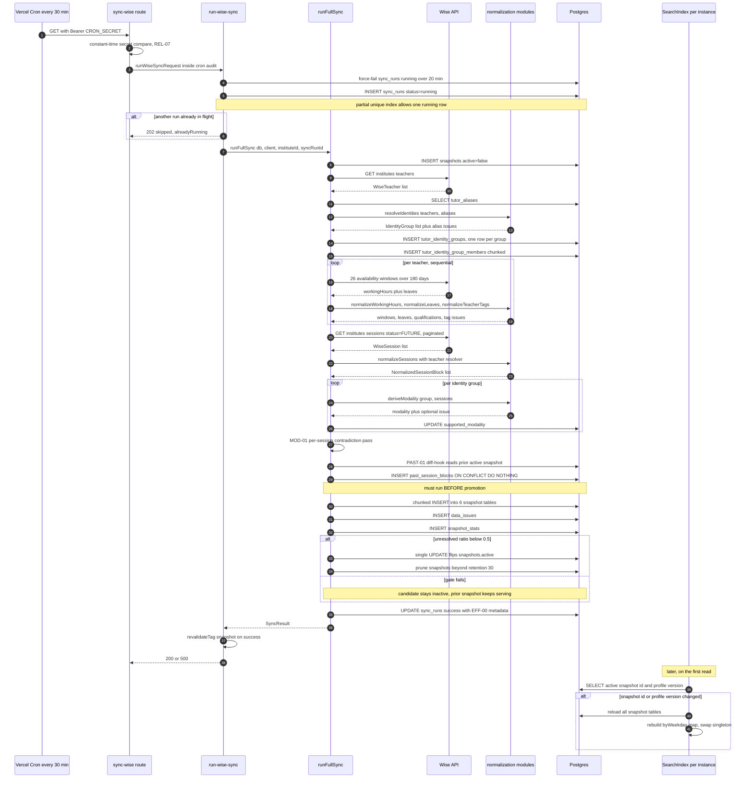
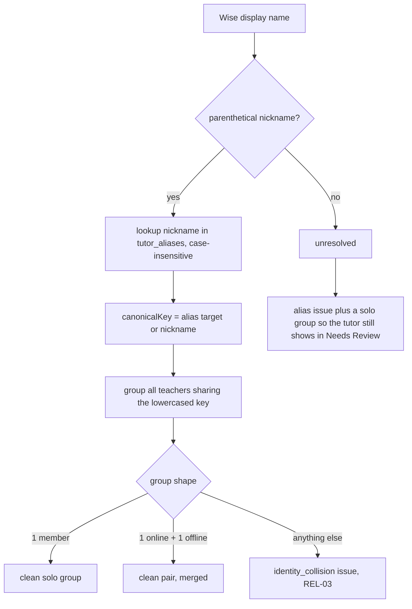
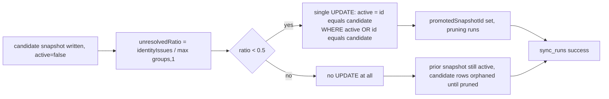

# Data Flow (ETL)

How tutor data travels from the Wise API into the in-memory index that `/search` and `/compare` read. This is the load-bearing pipeline of the application: every availability answer the product gives is derived from artifacts written here, and the fail-closed guarantees are enforced at **write** time, not read time.

The whole pipeline is one function — `runFullSync()` at [`src/lib/sync/orchestrator.ts:50`](../../src/lib/sync/orchestrator.ts) — wrapped by a single-flight guard in [`src/lib/sync/run-wise-sync.ts:142`](../../src/lib/sync/run-wise-sync.ts). There is exactly one production call site (`run-wise-sync.ts:152`). There is no CLI entry point, no partial-sync mode, and no incremental path: **every run is a full rebuild.**

**Scope.** This page documents the *tutor-availability snapshot* sync only. `vercel.json` registers **19** cron entries; the other 18 belong to independent subsystems (sales dashboard, unearned revenue, onsite foot traffic, credit control, Wise activity audit, progress tests, post-class feedback collection / backfill / payout accrual, leave requests, class-assignment morning + admin email, competitor intelligence, student promotions, admissions notifications, the LINE credit digest, and the cron watchdog). Those pipelines share the `WiseClient` but not the snapshot/promotion machinery described here — they keep their own `*_sync_runs` ledgers. See the [cron reference](../reference/crons.md).

**Consumers.** The features this pipeline feeds are **Tutor Search** (stable) and **Tutor Compare** (engine live; `/compare` is a legacy client-side redirect into `/search`). Modality, qualification, and identity artifacts written here are also read by the AI Scheduler (experimental), Proposals (experimental), Room Capacity (stable for utilization), and the LINE operational planner (stable, scheduler write-path flag-gated) — all via `ensureIndex()`, never by re-querying Wise.

---

## 1. Design shape

Wise is the slowest dependency in the system and is rate-limited, so it is never on the request path for tutor search. Instead:

1. A background job pulls **everything** from Wise.
2. Normalization converts Wise's loosely-typed payloads into a fail-closed domain model.
3. Results are written to Postgres tables keyed by an immutable `snapshot_id`, with `active = false`.
4. A validation gate decides whether the candidate snapshot is fit to serve.
5. A single `UPDATE` flips `active`; readers see either the old snapshot or the new one, never neither.
6. Each web instance lazily notices that the active snapshot id changed and rebuilds its in-process index.

The consequence worth internalizing: **a failed sync is a no-op for readers.** No row is deleted, nothing is mutated in place, and the previously-active snapshot keeps serving traffic until a *successful* run replaces it (`orchestrator.ts:568-609` returns a failure result without touching `snapshots.active`).

Two structural facts shape everything below:

- **The Neon HTTP driver has no transactions.** `getDb()` returns a `drizzle/neon-http` instance ([`src/lib/db/index.ts:10-11`](../../src/lib/db/index.ts)). The sync therefore has *no* rollback: it achieves atomicity-for-readers by never mutating live data and flipping one boolean at the end, and it achieves idempotency in the one cross-snapshot table via a unique index plus `ON CONFLICT DO NOTHING`.
- **Everything is buffered then chunk-inserted.** Rows accumulate in JS arrays and flush in batches of `INSERT_CHUNK_SIZE = 250` (`orchestrator.ts:38-48`), with one exception (identity groups, stage 6) noted below.

---

## 2. Entry points, auth, and the single-flight guard

| Entry | Auth | Notes |
|---|---|---|
| `GET /api/internal/sync-wise` | `CRON_SECRET`, constant-time compare | The Vercel cron path. `allowSessionAuth: false` ([`route.ts:69-71`](../../src/app/api/internal/sync-wise/route.ts)) |
| `POST /api/internal/sync-wise` | `CRON_SECRET` **or** an Auth.js session | Manual `curl` or admin trigger (`route.ts:74-76`) |
| `POST /api/admin/sync-wise` | Auth.js session only | Admin UI path ([`route.ts:8-23`](../../src/app/api/admin/sync-wise/route.ts)) |

All three set `maxDuration = 800` (`sync-wise/route.ts:7`, `admin/sync-wise/route.ts:6`) — Vercel Pro headroom for a full Wise sync — and all three wrap the call in `withCronInvocationAudit({ jobKey: "wise_snapshot", … })`, which writes a `cron_invocations` row for Data Health.

Secret comparison is constant-time with a length pre-check to avoid the `RangeError` that `timingSafeEqual` throws on mismatched buffer lengths (`sync-wise/route.ts:11-29`, marked REL-07). A missing `CRON_SECRET` returns **500 "Server misconfigured"**, not 401 (`route.ts:61-63`) — a deliberate distinction between "you are not authorized" and "this deployment is broken".

### Single-flight

`acquireSyncRun()` (`run-wise-sync.ts:88-118`) runs three steps before any Wise traffic:

1. **Reap stale runs.** Any `sync_runs` row still `running` after `STALE_RUNNING_SYNC_MS = 20 minutes` (`run-wise-sync.ts:10`) is force-failed with a fixed explanatory `errorSummary` (`run-wise-sync.ts:39-40, 51-72`). Without this, one timed-out invocation would wedge the pipeline forever.
2. **Check for a live run.** If a `running` row survives the reap, the request returns **HTTP 202** with `skipped: true`, `alreadyRunning: true`, and the in-flight run's id (`run-wise-sync.ts:120-140, 148-150`). 202 rather than 409: a skipped tick is a normal outcome, not an error.
3. **Insert the guard row.** The guard is enforced in Postgres, not in application code: `sync_runs` carries a partial unique index over `status` restricted to `status = 'running'` ([`schema.ts:473-475`](../../src/lib/db/schema.ts)). A losing racer sees SQLSTATE `23505`, is recognized by `isUniqueViolation()` (`run-wise-sync.ts:42-49`), and degrades to the same 202 skip rather than throwing.

`runFullSync` accepts the already-acquired `syncRunId` and only creates its own row when called without one (`orchestrator.ts:62-68`) — which is what lets the guard own the row's lifetime.

---

## 3. Stage map

| # | Stage | Code | Writes |
|---|---|---|---|
| — | Auth, invocation audit, single-flight | `sync-wise/route.ts:32-66`; `run-wise-sync.ts:88-118, 142-154` | `cron_invocations`, `sync_runs` (`running`) |
| 1 | Create or adopt the sync run | `orchestrator.ts:62-68` | `sync_runs` |
| 2 | Create the candidate snapshot | `orchestrator.ts:71-81` | `snapshots` (`active=false`), `sync_runs.snapshot_id` |
| 3 | Fetch all teachers | `orchestrator.ts:84` | — |
| 4 | Load alias overrides | `orchestrator.ts:87-91` | — |
| 5 | Resolve identities | `orchestrator.ts:94-105` | — (issues buffered) |
| 6 | Persist groups + members | `orchestrator.ts:111-139` | `tutor_identity_groups`, `tutor_identity_group_members` |
| 7 | Per-teacher availability, leaves, tags, qualifications | `orchestrator.ts:156-260` | buffered |
| 8 | Fetch + normalize future sessions | `orchestrator.ts:263-305` | buffered |
| 9 | Derive modality; MOD-01 contradiction pass | `orchestrator.ts:307-398` | `tutor_identity_groups.supported_modality` |
| 9.5 | PAST-01 diff-hook | `orchestrator.ts:400-418` → `past-sessions-diff-hook.ts:66` | `past_session_blocks` |
| 10 | Flush buffered rows, then issues | `orchestrator.ts:420-450` | 6 snapshot tables + `data_issues` |
| 11 | Compute snapshot stats | `orchestrator.ts:452-470` | `snapshot_stats` |
| 12 | Validate + atomic promote | `orchestrator.ts:472-501` | `snapshots.active` |
| 13 | Persist run metadata; prune old snapshots | `orchestrator.ts:503-555` | `sync_runs`, cascade deletes |
| 14 | Invalidate the `snapshot` cache tag | `run-wise-sync.ts:160-162` | Next.js `"use cache"` entries |
| 15 | Lazy index rebuild (read path, per instance) | `search/index.ts:354-401` | `globalThis.__bgscheduler_searchIndex` |

Column-level detail for every table named here lives in the [database reference](../reference/database/index.md) and the [core ERD](../reference/database/erd-core.md); this page does not restate columns.

---

## 4. Sequence


```mermaid
sequenceDiagram
    autonumber
    participant Cron as Vercel Cron every 30 min
    participant Route as sync-wise route
    participant Guard as run-wise-sync
    participant Orch as runFullSync
    participant Wise as Wise API
    participant Norm as normalization modules
    participant PG as Postgres
    participant Idx as SearchIndex per instance

    Cron->>Route: GET with Bearer CRON_SECRET
    Route->>Route: constant-time secret compare, REL-07
    Route->>Guard: runWiseSyncRequest inside cron audit
    Guard->>PG: force-fail sync_runs running over 20 min
    Guard->>PG: INSERT sync_runs status=running
    Note over Guard,PG: partial unique index allows one running row
    alt another run already in flight
        Guard-->>Route: 202 skipped, alreadyRunning
    end
    Guard->>Orch: runFullSync db, client, instituteId, syncRunId

    Orch->>PG: INSERT snapshots active=false
    Orch->>Wise: GET institutes teachers
    Wise-->>Orch: WiseTeacher list
    Orch->>PG: SELECT tutor_aliases
    Orch->>Norm: resolveIdentities teachers, aliases
    Norm-->>Orch: IdentityGroup list plus alias issues
    Orch->>PG: INSERT tutor_identity_groups, one row per group
    Orch->>PG: INSERT tutor_identity_group_members chunked

    loop per teacher, sequential
        Orch->>Wise: 26 availability windows over 180 days
        Wise-->>Orch: workingHours plus leaves
        Orch->>Norm: normalizeWorkingHours, normalizeLeaves, normalizeTeacherTags
        Norm-->>Orch: windows, leaves, qualifications, tag issues
    end

    Orch->>Wise: GET institutes sessions status=FUTURE, paginated
    Wise-->>Orch: WiseSession list
    Orch->>Norm: normalizeSessions with teacher resolver
    Norm-->>Orch: NormalizedSessionBlock list

    loop per identity group
        Orch->>Norm: deriveModality group, sessions
        Norm-->>Orch: modality plus optional issue
        Orch->>PG: UPDATE supported_modality
    end
    Orch->>Orch: MOD-01 per-session contradiction pass

    Orch->>PG: PAST-01 diff-hook reads prior active snapshot
    Orch->>PG: INSERT past_session_blocks ON CONFLICT DO NOTHING
    Note over Orch,PG: must run BEFORE promotion

    Orch->>PG: chunked INSERT into 6 snapshot tables
    Orch->>PG: INSERT data_issues
    Orch->>PG: INSERT snapshot_stats

    alt unresolved ratio below 0.5
        Orch->>PG: single UPDATE flips snapshots.active
        Orch->>PG: prune snapshots beyond retention 30
    else gate fails
        Note over Orch,PG: candidate stays inactive, prior snapshot keeps serving
    end
    Orch->>PG: UPDATE sync_runs success with EFF-00 metadata
    Orch-->>Guard: SyncResult
    Guard->>Guard: revalidateTag snapshot on success
    Guard-->>Route: 200 or 500

    Note over Idx: later, on the first read
    Idx->>PG: SELECT active snapshot id and profile version
    alt snapshot id or profile version changed
        Idx->>PG: reload all snapshot tables
        Idx->>Idx: rebuild byWeekday map, swap singleton
    end
```

---

## 5. The Wise client

[`src/lib/wise/client.ts`](../../src/lib/wise/client.ts) is the only module that talks HTTP to Wise, and it imports nothing from the rest of the app — the dependency arrow points strictly outward.

- **Auth headers** are assembled per request (`client.ts:69-78`): HTTP Basic from `base64(userId:apiKey)`, plus `x-api-key`, `x-wise-namespace`, and a `user-agent` of `VendorIntegrations/{namespace}`. Base URL defaults to `https://api.wiseapp.live` (`client.ts:64`).
- **Concurrency** is a hand-rolled queue (`client.ts:179-199`): requests park in an array and are dequeued as slots free. The class default is 5 (`client.ts:65`), but `createWiseClient()` — the factory the sync uses — raises it to **15** (`client.ts:219`).
- **Retries** are exponential with `2^attempt × 1000 ms` (1s, 2s, 4s) up to `maxRetries = 3` (`client.ts:66, 151, 172`). Crucially, retries are **allowlisted by status**: only 408, 429, 500, 502, 503, 504 are retried (`client.ts:37-44`, REL-05). Every other non-OK status — including 401/403/404/422 — throws immediately, so a misconfigured credential fails in milliseconds instead of burning the retry budget. Network-level failures (DNS, `ECONNRESET`, a `fetch` `TypeError`) are retried on the same schedule (`client.ts:148-156`).
- **Call accounting** (EFF-00): each logical call increments a per-instance tally bucketed by a normalized path, where 24-hex Mongo object-id segments collapse to `{id}` (`client.ts:85-96`). The orchestrator persists `wiseCallCount` and the top-10 busiest paths into `sync_runs.metadata` (`client.ts:206-212`, `orchestrator.ts:506-513`). Note the tally is incremented in `get`/`post`/`put` **before** the retry loop, so it counts logical calls, not wire requests.

### Fetch shapes used by this pipeline

| Fetcher | Wise call | Pagination |
|---|---|---|
| `fetchAllTeachers` (`fetchers.ts:31-37`) | `GET /institutes/{id}/teachers` | **None** — one call, `res.data.teachers ?? []` |
| `fetchTeacherAvailability` (`fetchers.ts:42-57`) | `GET /institutes/{id}/teachers/{userId}/availability` with ISO `startTime`/`endTime` | one 7-day window per call |
| `fetchTeacherFullAvailability` (`fetchers.ts:63-105`) | the above, ×26 | see below |
| `fetchAllFutureSessions` (`fetchers.ts:110-115`) | `GET /institutes/{id}/sessions?status=FUTURE` | `paginateBy=COUNT`, `page_size=1000` (`fetchers.ts:24`), loops to `page_count` (`fetchers.ts:126-144`) |

`fetchTeacherFullAvailability` covers a 180-day horizon as `Math.ceil(180 / 7) = 26` seven-day windows (`fetchers.ts:72-73`). The first window is awaited alone because it is the only one whose `workingHours` are kept (`fetchers.ts:76-85`); the remaining 25 are issued through `Promise.all` for **leaves only** (`fetchers.ts:88-102`). So availability costs ~26 requests per teacher, and the outer per-teacher loop in the orchestrator is sequential (`orchestrator.ts:156`) — meaning total availability wall-time scales linearly with teacher count even though 15 requests are in flight at a time. This is the dominant term in sync duration and the reason `maxDuration = 800` exists.

---

## 6. Normalization

Six pure modules under [`src/lib/normalization/`](../../src/lib/normalization/). They depend only on `@/lib/wise/types` — never on the DB, the orchestrator, or Next.js — which is what makes them unit-testable in isolation. Each returns plain data plus, where relevant, an `issues` array the orchestrator forwards to `data_issues`.

### 6.1 Identity — `identity.ts`

Wise models one human tutor as one or two teacher records (an onsite record and an "… Online" twin). `resolveIdentities(wiseTeachers, aliases)` (`identity.ts:72`) collapses them:


```mermaid
flowchart TD
    A[Wise display name] --> B{parenthetical nickname?}
    B -- no --> F[unresolved]
    B -- yes --> C[lookup nickname in tutor_aliases, case-insensitive]
    C --> D[canonicalKey = alias target or nickname]
    D --> E[group all teachers sharing the lowercased key]
    E --> G{group shape}
    G -- 1 member --> H[clean solo group]
    G -- 1 online + 1 offline --> I[clean pair, merged]
    G -- anything else --> J[identity_collision issue, REL-03]
    F --> K[alias issue plus a solo group so the tutor still shows in Needs Review]
```

Mechanics worth knowing:

- **Nickname extraction** is the first parenthetical in the display name: `/\(([^)]+)\)/` (`identity.ts:43-46`). `"Chinnakrit (Celeste) Channiti"` → `Celeste`.
- **Online detection** is a trailing-word regex, `/\bOnline\s*$/i` (`identity.ts:52-54`). There is also a `getBaseName()` helper that strips the suffix (`identity.ts:59-61`), exported but not used by `resolveIdentities` itself.
- **Alias overrides** come from the `tutor_aliases` table, loaded once per run (`orchestrator.ts:87-91`) and keyed lowercase (`identity.ts:76-79`). This is the manual escape hatch for tutors whose two Wise records do not share a nickname.
- **Display name** for a merged group prefers the non-online entry (`identity.ts:129`), and `canonicalKey === displayName` — the canonical key is a human-readable nickname, not a synthetic id. That is exactly why it survives snapshot rotation and anchors `past_session_blocks`.
- **Collision detection (REL-03)** fires when a key matches neither "solo" nor "one online + one offline" (`identity.ts:153-170`). The group is still created; the issue routes it to Needs Review instead of dropping the tutor.
- **Unresolvable teachers** — no nickname, no alias — get an `alias` issue *and* a solo group built from the raw display name (`identity.ts:178-204`), so they remain visible rather than silently vanishing.

Both issue kinds are stored with `severity: "critical"` (`orchestrator.ts:97-105`), the only critical severity the pipeline emits.

### 6.2 Availability — `availability.ts`

`normalizeWorkingHours(slots)` (`availability.ts:33`) maps Wise `workingHours.slots` to `{ weekday, startMinute, endMinute }`:

- Weekday accepts either a 0–6 number or a weekday **name**, via `WEEKDAY_MAP` (`availability.ts:10-26`); anything else is dropped.
- Times are `"HH:mm"` parsed to minutes-since-midnight by `parseTimeToMinutes` (`timezone.ts:31-34`).
- Zero-length and inverted windows are skipped (`availability.ts:47`).
- `deduplicateWindows` sorts per weekday and merges any window starting at or before the running end (`availability.ts:62-91`).

Wise working hours are already Bangkok-local, so **no timezone conversion happens here** (`availability.ts:30-32`).

### 6.3 Leaves — `leaves.ts`

`normalizeLeaves` converts Wise's UTC ISO instants through `toLocalTime` and merges overlaps (`leaves.ts:14-53`). The merge mutates the last accumulated entry in place (`leaves.ts:45-47`), extending its `endTime` — so callers must not retain references to the input objects.

### 6.4 Sessions — `sessions.ts`

`normalizeSessions(wiseSessions, teacherIdResolver)` (`sessions.ts:57`) is where the fail-closed rule is most visible. Each session is mapped to a `NormalizedSessionBlock` carrying both the instants and the derived `weekday` / `startMinute` / `endMinute`, plus the Wise-side descriptive fields the compare view renders.

- **Teacher resolution is injected.** The orchestrator passes a closure that maps `session.userId` (or `session.teacherId`, via `getWiseSessionTeacherUserId`, [`types.ts:322-326`](../../src/lib/wise/types.ts)) through a `wiseUserId → wiseTeacherId` map built from the teacher list (`orchestrator.ts:264-275`). A session whose teacher cannot be resolved is **dropped** (`sessions.ts:64-65`) — it never becomes a block, and no issue is emitted for it.
- **Blocking classification.** `isBlockingStatus` returns `false` only for an explicit allowlist of five statuses — `CANCELLED`, `CANCELED`, `COMPLETED`, `MISSED`, `NO_SHOW` (`sessions.ts:34-40`). A missing status, or any status not in that set, is **blocking** (`sessions.ts:46-51`). Both spellings of "cancelled" are listed deliberately.
- **`wiseStatus`** falls back to the literal string `"UNKNOWN"` when `meetingStatus` is absent (`sessions.ts:80`), which keeps the column non-null and makes the gap auditable.

### 6.5 Qualifications — `qualifications.ts`

Wise tags are free-text; `TAG_PATTERN = /^(.+?)\s*\(([^)]+)\)\s*(.+)$/` (`qualifications.ts:31`) parses `Subject (Curriculum) Level`. The curriculum token is canonicalized through `CURRICULUM_MAP` (`qualifications.ts:33-41`, e.g. `int.` / `int` / `international` → `International`), and an `ExamPrep` curriculum copies the level into `examPrep` (`qualifications.ts:61-63`). Anything that fails the pattern produces a `tag` issue naming the offending string (`qualifications.ts:87-94`) — unmapped tags are surfaced, never guessed at.

### 6.6 Modality — `modality.ts`

`deriveModality(group, sessions)` (`modality.ts:23`) is an ordered evidence cascade:

1. **Structure.** Members include both an online and an offline record → `both`; online only → `online` (`modality.ts:28-36`). This is the strongest signal and short-circuits everything else.
2. **Session evidence.** Otherwise, look at the group's sessions: `sessionType` in {`online`} or `location` in {`online`, `virtual`} counts as online evidence; `sessionType` in {`onsite`, `in-person`, `offline`} or `location` `onsite` counts as onsite evidence (`modality.ts:42-63`). Both → `both`; one → that one.
3. **Fail closed.** No sufficient evidence → `unresolved` plus a `modality` issue (`modality.ts:65-91`). The two `unresolved` exits differ only in message text — a single-offline-member group says "no online variant and insufficient session evidence", everything else says "insufficient evidence".

Note what is deliberately absent: there is **no** "assume onsite" fallback. The comment at `modality.ts:65-67` announces the alternative and then rejects it.

### 6.7 Timezone — `timezone.ts`

Everything is `Asia/Bangkok` (`timezone.ts:3`). `toLocalTime()` wraps `date-fns-tz`'s `toZonedTime` (`timezone.ts:8-11`), which returns a `Date` **shifted so that local getters read Bangkok wall-clock**. `getLocalWeekday` and `getLocalMinuteOfDay` then read `.getDay()` / `.getHours()` off that shifted value (`timezone.ts:16-26`), which is why weekday and minute-of-day come out correct regardless of the host's own timezone.

The consequence to hold onto: **the shifted `Date` is what gets stored** into the `timestamptz` columns of `dated_leaves` and `future_session_blocks` (`orchestrator.ts:202-205, 289-290`). The only `TZ` pin in the repo is for tests (`vitest.config.ts:4`); nothing pins the runtime, so on Vercel's UTC hosts the stored instant is Bangkok wall-clock stamped as if UTC — seven hours ahead of the true instant. Readers follow the same convention (`getStartOfTodayBkk` builds its boundary from `toZonedTime` components through a local `Date` constructor, [`compare.ts:36-39`](../../src/lib/search/compare.ts); one-time blocking slices calendar days with `toISOString().slice(0,10)`, [`engine.ts:180-186`](../../src/lib/search/engine.ts)), so comparisons stay apples-to-apples. The one place the convention is mixed is the diff-hook — see §8 and the open questions.

---

## 7. Persistence: what gets written, and how

### 7.1 Identity groups (stage 6) — the one un-batched write

Groups are inserted **one row at a time** inside a `for` loop, because the loop needs each generated `id` back to build `groupIdMap` and the member rows (`orchestrator.ts:111-135`). Members are then chunk-inserted (`orchestrator.ts:137-139`). So group insertion costs one round trip per identity group, while every other table costs `ceil(rows / 250)`.

### 7.2 The per-teacher loop (stage 7)

For each Wise teacher mapped to a group (`orchestrator.ts:156-260`):

- A teacher with no resolvable Wise user id gets a `completeness` / `high` issue and is skipped before any HTTP call (`orchestrator.ts:162-173`).
- Availability + leaves are fetched, normalized, and buffered. Availability rows are written with `modality: "unresolved"` as a placeholder (`orchestrator.ts:192`) and back-filled after modality derivation (`orchestrator.ts:420-422`) — the rows are only inserted once, with final values.
- Raw tags are preserved verbatim into `raw_teacher_tags` (both the extracted name and the original JSON, `orchestrator.ts:210-218`) *alongside* the parsed qualifications, so a parser change can be re-litigated against what Wise actually said.
- **Error isolation:** the whole body is wrapped in `try/catch`; a failure for one teacher becomes a `completeness` issue carrying the error message and the loop continues (`orchestrator.ts:249-259`). One flaky teacher never aborts a sync.

### 7.3 Sessions (stage 8)

Normalized blocks whose `wiseTeacherId` maps to no group are dropped silently (`orchestrator.ts:279-280`) — a second, quieter filter after the resolver-based drop in `normalizeSessions`.

### 7.4 Modality + the MOD-01 contradiction pass (stage 9)

The first loop derives modality per group, `UPDATE`s `tutor_identity_groups.supported_modality`, records a per-teacher modality (an online variant is always `online`; for a `both` group the non-online member resolves to `onsite`, `orchestrator.ts:332-337`), and builds the `tutors` row whose `supportedModes` is `["online","onsite"]` for `both`, `[]` for `unresolved` (`orchestrator.ts:352-361`).

A second loop (D-07 / D-08, `orchestrator.ts:364-398`) then checks every session against its group's modality using `detectSessionModalityConflict` ([`compare.ts:185-223`](../../src/lib/search/compare.ts)) and emits `conflict_model` issues with structured `metadata`. The group's modality is read from the `groupSupportedModality` map hoisted in the first loop (`orchestrator.ts:312, 324, 370`) specifically so this pass performs **no per-session `SELECT`**. The detector's vocabulary is worth noting: `ONLINE_SESSION_TYPES = {online, virtual, scheduled}` and `ONSITE_SESSION_TYPES = {onsite, in-person, offline}` (`compare.ts:6-7`) — a wider set than `deriveModality` uses, so `scheduled` can trigger a contradiction while never having contributed to the derivation.

### 7.5 The PAST-01 diff-hook (stage 9.5)

Wise's `status: "FUTURE"` endpoint does not return past sessions, so once a session slips into the past it is unrecoverable from Wise. [`past-sessions-diff-hook.ts`](../../src/lib/sync/past-sessions-diff-hook.ts) captures those rows before they are lost:

1. Find the currently-active snapshot, excluding the candidate (`diff-hook:75-89`). No prior active snapshot → nothing to diff, return empty.
2. Batch-load that snapshot's `groupId → canonicalKey` map, and all of its `future_session_blocks` (`diff-hook:92-107`) — two queries, not N.
3. A prior block is "dropped" when its `wiseSessionId` is absent from the new Wise response **and** `prior.startTime < now` (`diff-hook:110-119`).
4. Dropped rows are written to `past_session_blocks` keyed by the durable `group_canonical_key`, chunked, with `onConflictDoNothing` on the unique index `psb_wise_session_id_idx` ([`schema.ts:2292`](../../src/lib/db/schema.ts)) — first observation wins, forever (`diff-hook:155-165`).
5. A prior block whose `groupId` no longer resolves emits a `completeness` / `medium` issue and is skipped; the hook never throws (`diff-hook:120-132`).

Two ordering constraints are load-bearing and called out in the code: it **must run before promotion** so the prior snapshot is still `active = true` (`orchestrator.ts:400-407`, `diff-hook:56-58`), and idempotency rests entirely on the unique index because the HTTP driver cannot give it a transaction (`diff-hook:59-62`).

`past_session_blocks` is the **only** cross-snapshot tutor table. It is never pruned by `pruneOldSnapshots`, and `capturedInSnapshotId` is deliberately *not* a foreign key so snapshots can be deleted underneath it (`schema.ts:2266-2268`). Its read path is a separate cached fetcher, [`src/lib/data/past-sessions.ts`](../../src/lib/data/past-sessions.ts), tagged `past-sessions` — explicitly **not** `snapshot` — so a sync's cache sweep does not discard immutable history.

### 7.6 Flush and stats (stages 10–11)

Six chunked inserts run concurrently under one `Promise.all` (`orchestrator.ts:424-443`): availability windows, leaves, raw tags, qualifications, future session blocks, tutors. Then all buffered issues (`orchestrator.ts:446-450`), then one `snapshot_stats` row with counts and an `issuesByType` histogram (`orchestrator.ts:453-470`), unique per snapshot (`schema.ts` index `ss_snapshot_idx`).

Read `snapshot_stats` with one caveat: `unresolvedGroups` is `identityIssues.length` — an **issue** count, not a group count — and `resolvedGroups` counts groups no identity issue matched *by `entityId === canonicalKey`* (`orchestrator.ts:462-463`). Since the unresolvable-teacher issue uses the teacher's `_id` as `entityId` (`identity.ts:186`), a solo group created for an unresolvable teacher is still counted as resolved. The two figures answer slightly different questions and do not have to sum to `totalIdentityGroups`.

---

## 8. Validation and atomic promotion (stage 12)


```mermaid
flowchart LR
    A[candidate snapshot written, active=false] --> B[unresolvedRatio = identityIssues / max groups,1]
    B --> C{ratio < 0.5}
    C -- yes --> D[single UPDATE: active = id equals candidate<br/>WHERE active OR id equals candidate]
    D --> E[promotedSnapshotId set, pruning runs]
    C -- no --> F[no UPDATE at all]
    F --> G[prior snapshot still active, candidate rows orphaned until pruned]
    E --> H[sync_runs success]
    G --> H
```

The gate is one line: `unresolvedRatio = identityIssues.length / Math.max(groups.length, 1)`, promote if `< 0.5` (`orchestrator.ts:473-476`). Note it divides *issues* by groups, so a run with many collision issues can exceed 0.5 even when most groups are fine — a deliberately conservative reading.

The promotion itself is a **single** `UPDATE` (REL-01, `orchestrator.ts:488-498`):

```
SET    active = (snapshots.id = :candidate)
WHERE  active = true OR snapshots.id = :candidate
```

One statement means one transaction: PostgreSQL MVCC guarantees a concurrent reader sees either the prior-active row or the new one, never a window with zero rows matching `active = true`. The bounded `WHERE` also keeps the rewrite to at most the old active row plus the candidate rather than the whole table. The code comment records that this replaced an earlier two-`UPDATE` sequence.

**A failed gate is silent for readers.** No `UPDATE` runs, `promotedSnapshotId` stays `null`, and the run is still recorded as `status: "success"` (`orchestrator.ts:516-525`) — success means "the pipeline completed", not "the snapshot was promoted". Data Health, and anyone reading `sync_runs`, must check `promoted_snapshot_id` to distinguish the two.

### Metadata and pruning (stage 13)

The successful run writes `sync_runs.metadata` with `durationMs`, `wiseCallCount`, `wiseTopPaths`, plus the diff-hook's duration and captured count (EFF-00, `orchestrator.ts:503-513`). Only after a promotion does `pruneOldSnapshots` run (`orchestrator.ts:527-541`), keeping the newest `SNAPSHOT_RETENTION_COUNT = 30` snapshots plus any snapshot marked active ([`snapshot-pruning.ts:5, 64-70`](../../src/lib/sync/snapshot-pruning.ts)). It nulls the two `sync_runs` FK columns first, then deletes child rows in FK-safe order across 10 child tables before deleting the snapshots themselves (`snapshot-pruning.ts:88-179`), returning per-table row counts.

Pruning is explicitly non-fatal: a throw is caught, logged, and recorded as `{ attempted: true, failed: true, error }` in the metadata; even the metadata update is wrapped so its own failure cannot demote a successful sync (`orchestrator.ts:532-554`).

---

## 9. Cache invalidation and index rebuild (stages 14–15)

On success the guard calls `revalidateTag("snapshot", { expire: 0 })` (`run-wise-sync.ts:160-162`). Only two cached server functions carry that tag — [`src/lib/data/tutors.ts:82`](../../src/lib/data/tutors.ts) and [`src/lib/data/filters.ts:54`](../../src/lib/data/filters.ts) — so the sweep is narrow by design.

The in-memory index is **not** pushed to; it is pulled, lazily, per serverless instance:

- The index is a `globalThis`-anchored singleton, `__bgscheduler_searchIndex`, with a companion in-flight build promise (`index.ts:94-113`). Anchoring on `globalThis` rather than a module-level `let` is what makes it survive HMR in dev and module re-evaluation in production.
- `ensureIndex(db)` (`index.ts:354`) checks the in-flight promise **first**, before any other work, so a concurrent caller arriving mid-build reuses it (`index.ts:358-359`). The promise is assigned to the singleton synchronously in the same tick that starts the work (`index.ts:396-399`, REL-02) — that ordering is the whole point of the pattern and is why the comment warns against reordering it.
- Staleness is detected on two axes: the active `snapshot_id` and a `profileVersion` string computed as `count:max(updatedAt)` over `tutor_business_profiles` (`index.ts:128-137, 368-383`). Either changing forces a rebuild, which is how an editorial tutor-profile edit reaches search without a Wise sync.
- If **no** snapshot is active but a cached index exists, the cached index is kept (`index.ts:384-386`) — a defensive choice: serve slightly stale data rather than nothing. On a cold instance with no active snapshot, `buildIndex` throws `"No active snapshot found"` (`index.ts:150-152`).
- `buildIndex` loads the groups, then eight datasets in one `Promise.all` (`index.ts:169-222`), buckets them by `groupId`, and materializes `IndexedTutorGroup[]` plus a `byWeekday: Map<number, IndexedTutorGroup[]>` derived from availability windows (`index.ts:322-331`) — the O(1) candidate lookup the search engine relies on.
- `canonicalKey` is denormalized onto each indexed group (D-04, `index.ts:66-71, 263`) so `/api/compare` can fetch cross-snapshot past sessions without an extra query. Past sessions themselves stay **out** of the index.
- `syncedAt` is taken from the `finishedAt` of the successful run that promoted this snapshot, falling back to the snapshot's `createdAt` (`index.ts:155-166`) — that is the timestamp the staleness warning is computed from.

Eight call sites reach the index through `ensureIndex`: the search, compare, compare-discover and proposals routes, range search, room-capacity data, the AI scheduler service, and the LINE operational planner (which alone tolerates failure with `.catch(() => null)`).

### Where fail-closed lands on the read side

The engine converts pipeline artifacts into product behavior (`engine.ts:60-149`): **any** `data_issue` attached to a group pushes it into `needsReview` with the issue text as the reason (`engine.ts:86-88`), and an empty `supportedModes` — i.e. `unresolved` modality — adds "Unresolved modality" (`engine.ts:92-93`). A group reaches `available` only when it clears every check with zero review reasons (`engine.ts:143-147`). Staleness is a *warning*, never withheld data: `API_STALE_THRESHOLD_MS` is 90 minutes ([`src/lib/ops/stale.ts:2`](../../src/lib/ops/stale.ts)), tuned for a 30-minute cron plus recovery headroom, with a separate 2-hour threshold for the UI banner.

Note how issues are attached to groups at index build: an issue matches a group if its `entityId` equals the group's `canonicalKey` **or** the group's `id`, **or** its `entityName` equals the group's `displayName` (`index.ts:232-247`). Because canonical keys are human nicknames, this is a fuzzy join by construction — it errs toward attaching, which is the fail-closed direction.

---

## 10. Failure taxonomy

| Failure | Where | Effect |
|---|---|---|
| Another sync running | `run-wise-sync.ts:95-97, 107-117` | HTTP 202, no work, no snapshot |
| Prior run wedged in `running` > 20 min | `run-wise-sync.ts:51-72` | Force-failed, this run proceeds |
| Wise 4xx (not 429) | `client.ts:166-168` | Throws immediately, no retry |
| Wise 5xx / 408 / 429 | `client.ts:170-176` | 3 retries at 1s/2s/4s, then throws |
| Teacher missing Wise user id | `orchestrator.ts:162-173` | `completeness` issue, teacher skipped, sync continues |
| Availability fetch fails for one teacher | `orchestrator.ts:249-259` | `completeness` issue, sync continues |
| Session teacher unresolvable | `sessions.ts:64-65`, `orchestrator.ts:279-280` | Session dropped silently |
| Unmapped Wise tag | `qualifications.ts:87-94` | `tag` issue; tutor still indexed, routed to Needs Review |
| Modality underdetermined | `modality.ts:65-91` | `unresolved` + `modality` issue → never "Available" |
| Session contradicts group modality | `orchestrator.ts:375-397` | `conflict_model` issue with metadata |
| Diff-hook group lookup fails | `diff-hook:120-132` | `completeness` issue, that row skipped, hook returns normally |
| ≥50% unresolved ratio | `orchestrator.ts:473-476` | **No promotion.** Run still `success`, `promotedSnapshotId` null |
| Anything else throws | `orchestrator.ts:568-597` | `sync_runs` → `failed` with `errorSummary`; prior snapshot untouched; HTTP 500 |
| Cleanup of the failed row itself fails | `orchestrator.ts:584-596` | REL-06: logged to `console.error`, original error still returned |
| Pruning throws | `orchestrator.ts:532-541` | Logged, recorded in metadata, run stays successful |

The pattern: **fail-isolated inside the pipeline, fail-loud at the boundary, fail-closed at the data layer.**

---

## 11. Cost model

| Term | Count | Source |
|---|---|---|
| Teacher list | 1 request | `fetchers.ts:35` |
| Availability + leaves | `26 × teacherCount` requests | `fetchers.ts:72-102` |
| Future sessions | `ceil(sessions / 1000)` requests | `fetchers.ts:24, 126-144` |
| Wise concurrency | 15 in flight | `client.ts:219` |
| Group inserts | 1 round trip per identity group | `orchestrator.ts:112-120` |
| Everything else | `ceil(rows / 250)` per table | `orchestrator.ts:38-48` |
| Function budget | 800 s | `sync-wise/route.ts:7` |
| Guard timeout | 20 min | `run-wise-sync.ts:10` |
| Snapshot retention | 30 + active | `snapshot-pruning.ts:5` |

Every completed run records its own `durationMs`, `wiseCallCount`, and top Wise paths in `sync_runs.metadata`, so "is this sync API-bound?" is answerable from data rather than inference (`orchestrator.ts:506-513`).

---

## 12. Tests

- [`src/lib/sync/__tests__/orchestrator.integration.test.ts`](../../src/lib/sync/__tests__/orchestrator.integration.test.ts) runs `runFullSync` against a real Postgres via `testcontainers` and pins four behaviors: happy-path persistence with exactly one active snapshot; pruning after a promoted sync; a promoted sync staying successful when the pruning-metadata update fails; and **no promotion at a ≥50% unresolved ratio**.
- `past-sessions-diff-hook.integration.test.ts` and `snapshot-pruning.integration.test.ts` cover stages 9.5 and 13 against real Postgres.
- `orchestrator-modality-conflict.test.ts` is the unit-level MOD-01 pass.
- Per-module normalization tests live under `src/lib/normalization/__tests__/`.
- `vitest.config.ts:4` pins `process.env.TZ = "Asia/Bangkok"` at config load, which makes date assertions deterministic — and, as noted in §6.7, means the suite does **not** exercise the production host timezone.

---

## 13. Open questions

- **Diff-hook clock mixing.** `diff-hook:113,119` compares `prior.startTime` — stored under the Bangkok-wall-clock-as-instant convention (§6.7) — against a raw `new Date()`. On a UTC host that makes a session look ~7 hours "not yet started". Because the candidate snapshot contains only sessions Wise still returns, a session skipped this run is absent from the *next* run's prior snapshot too, so the deferral may be a permanent miss rather than a delay. Whether this is observable depends on how long Wise keeps a session in the `FUTURE` list after its start time — which the repo cannot attest. Should the comparison use `toLocalTime(new Date())`?
- **`fetchAllTeachers` does not paginate.** `fetchers.ts:31-37` issues one request and reads `data.teachers`. Every other institute-scoped fetcher in the same file paginates. If Wise ever caps that response, teachers would silently disappear from a snapshot — and a large enough loss would show up as a *low* unresolved ratio, so the promotion gate would not catch it. Is the endpoint contractually unpaginated?
- **`snapshot_stats.unresolvedGroups` counts issues, not groups** (`orchestrator.ts:462-463`, §7.6). Dashboards reading it as a group count will over-report when one group emits several issues. Intentional?
- **`scheduled` as an online session type.** `compare.ts:6` treats `scheduled` as online evidence for contradiction detection, while `modality.ts:46-52` does not consider it at all. Is the divergence deliberate, or should the two vocabularies be shared?
- **Silent session drops.** A future session whose teacher cannot be resolved is discarded with no `data_issue` (`sessions.ts:64-65`, `orchestrator.ts:279-280`), unlike every other unresolvable entity in the pipeline. Should this emit a `completeness` issue so the loss is countable?
- **`sync_runs.status = "success"` with `promotedSnapshotId = null`** is a real and non-obvious state (§8). Is any alerting keyed on `status` alone rather than on promotion?

---

_Verified against main@0cd1e81 (clean tree) on 2026-09-02._
