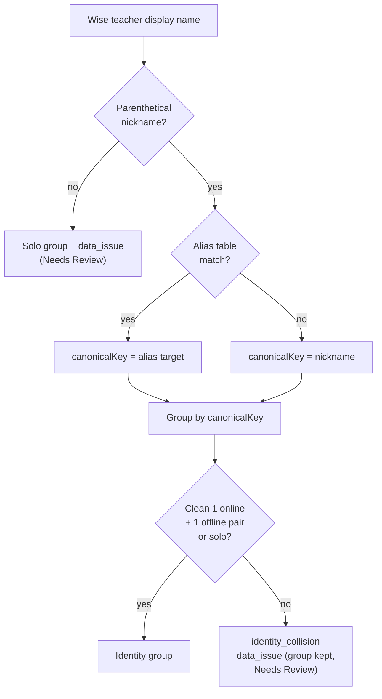
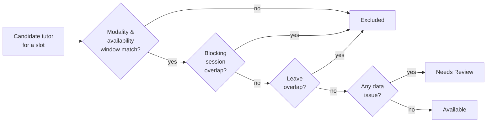

# Glossary

The domain vocabulary of BGScheduler, one line each, grounded in the code that defines or enforces the term. When a definition has subtlety, the "Mechanics" note below the table expands it. Every claim is cited `file:line` against HEAD; when the prose and the code disagree, trust the code.

> **Where to read more.** This page owns *meaning* — the shortest true definition plus the file that is the source of truth. It does **not** restate column lists or full endpoint signatures; for that, follow the feature-doc link in the last column (feature docs own purpose/flow; reference docs under `docs/reference/` own mechanical detail).

---

## Core terms

| Term | One-line definition | Defined / enforced at | More |
| --- | --- | --- | --- |
| **Snapshot** | A versioned, point-in-time capture of all normalized tutor data; almost every tutor row carries a `snapshotId` so a whole world of tutors can be swapped atomically. | `snapshots` table `src/lib/db/schema.ts:198-202`; rows written across `src/lib/sync/orchestrator.ts` | [data-health](../features/data-health.md) |
| **Active snapshot** | The single snapshot with `active = true` — the one the search index loads and every query reads from. Exactly one is active at a time. | loaded `src/lib/search/index.ts:144-152`; promoted `src/lib/sync/orchestrator.ts:488-500` | [data-health](../features/data-health.md) |
| **Identity group** | A logical merge of one or more Wise teacher records that represent the same real person (typically an online variant + an onsite variant), keyed by a `canonicalKey`. | `IdentityGroup` `src/lib/normalization/identity.ts:7-18`; resolved by `resolveIdentities` `identity.ts:72-207` | [tutor-search](../features/tutor-search.md) |
| **Alias** | A nickname-override mapping (`fromKey → toKey`) applied during identity resolution so two spellings collapse to one canonical person (e.g. `Kev → Kevin`). | `AliasMapping` `src/lib/normalization/identity.ts:20-23`; applied `identity.ts:76-99` | [tutor-search](../features/tutor-search.md) |
| **Modality (online / onsite)** | Whether a tutor (or a single session) is taught remotely or in person. Group-level modality is `online`, `onsite`, `both`, or `unresolved`. | `Modality` type `src/lib/normalization/modality.ts:4`; derived by `deriveModality` `modality.ts:23-92` | [tutor-compare](../features/tutor-compare.md) |
| **Qualification** | A tutor's teachable competency parsed from a Wise tag into `subject` / `curriculum` / `level` (+ optional `examPrep`). | `NormalizedQualification` `src/lib/normalization/qualifications.ts:3-9`; parsed by `normalizeTag` `qualifications.ts:43-66` | [tutor-search](../features/tutor-search.md) |
| **Subject** | The teaching-domain segment of a qualification (e.g. `Math`, `Science`, `EFL`) — the text before the parenthetical in a Wise tag. | `src/lib/normalization/qualifications.ts:48-49` | [tutor-search](../features/tutor-search.md) |
| **Curriculum** | The framework segment of a qualification, normalized to `International` / `Thai` / `ExamPrep` via a lookup map (raw `Int.`, `Th`, etc. collapse). | `CURRICULUM_MAP` `src/lib/normalization/qualifications.ts:33-51` | [tutor-search](../features/tutor-search.md) |
| **Level** | The grade-band / target segment of a qualification (e.g. `Y2-8`, `SAT`) — the text after the parenthetical. | `src/lib/normalization/qualifications.ts:52` | [tutor-search](../features/tutor-search.md) |
| **examPrep** | The exam name carried as a distinct field only when `curriculum === "ExamPrep"` (its value mirrors `level`, e.g. `SAT`). | `src/lib/normalization/qualifications.ts:61-63` | [tutor-search](../features/tutor-search.md) |
| **Recurring mode** | Search/compare mode where a tutor is blocked if *any* future session overlaps the same **weekday + time**, regardless of date. | `SearchMode` `src/lib/search/types.ts:6`; `isBlockedRecurring` `src/lib/search/engine.ts:155-168` | [tutor-search](../features/tutor-search.md) |
| **One-time mode** | Search/compare mode where a tutor is blocked only by a session on the **exact calendar date + time** — lets drop-in slots on a normally-busy weekday show as free. | `isBlockedOneTime` `src/lib/search/engine.ts:173-188` | [tutor-search](../features/tutor-search.md) |
| **Slot** | A single requested teaching window: weekday-or-date + `start`/`end` (`HH:mm`) + desired mode. The unit a search is evaluated against. | `SearchSlot` `src/lib/search/types.ts:8-15` | [tutor-search](../features/tutor-search.md) |
| **Sub-slot** | A fixed-duration candidate window the **range search** generates by stepping through a wide time band in non-overlapping `durationMinutes` increments. | `generateSubSlots` `src/lib/search/range-search.ts:41-65` | [tutor-search](../features/tutor-search.md) |
| **Availability window** | A recurring `weekday` + `startMinute`–`endMinute` band (Bangkok minutes-of-day) parsed from Wise `workingHours`, overlap-merged; a tutor must have one covering a slot to be a candidate. | `RecurringWindow` `src/lib/normalization/availability.ts:4-8`; `normalizeWorkingHours` `availability.ts:33-57` | [tutor-search](../features/tutor-search.md) |
| **Leave** | A dated time-off window for a tutor (UTC→Bangkok converted, overlapping ranges merged) that blocks availability in **both** recurring and one-time modes. | `NormalizedLeave` `src/lib/normalization/leaves.ts:4-8`; blocking check `src/lib/search/engine.ts:251-309` | [tutor-search](../features/tutor-search.md) |
| **Blocking session** | A future Wise session whose status makes the tutor unavailable. The default is **fail-closed**: any status not on the non-blocking allowlist blocks. | `isBlockingStatus` `src/lib/normalization/sessions.ts:46-51`; allowlist `sessions.ts:34-40` | [tutor-search](../features/tutor-search.md) |
| **Tutor tier** | A payroll pay-band normalized from a Wise tag to `BG0`/`BG1`/`BG2`/`BG3`/`Unassigned`; drives rate-card lookup. (Not a scheduling concept.) | `normalizeTierLabel` `src/lib/payroll/domain.ts:109-117`; `PayrollTier` `src/lib/payroll/types.ts:1` | [payroll](../features/payroll.md) |
| **OA (LINE Official Account)** | A LINE business account identified by `lineOaAccountId`, the first path segment parsed out of a `https://chat.line.biz/{oaAccountId}/chat/{userId}` admin chat URL. | `parseLineOaChatUrl` `src/lib/line/oa-resolver.ts:344-359` | [line-integration](../features/line-integration.md) |
| **Namespace** | The Wise tenant identifier (`begifted-education`) sent on every Wise request as the `x-wise-namespace` header and embedded in the `user-agent`. | `src/lib/wise/client.ts:58-59`; default `src/lib/env.ts:10` | — |
| **Institute** | The Wise organization ID (`696e1f4d…`) that scopes every Wise resource path (`/institutes/{instituteId}/…`). | path usage `src/lib/wise/fetchers.ts:33,48`; default `src/lib/env.ts:11` | — |
| **Needs Review** | The fail-closed bucket: a tutor with unresolved identity/modality/qualification (or any logged data issue) is routed here, **never** silently shown as Available. | `src/lib/search/engine.ts:83-97,142-146` | [data-health](../features/data-health.md) |

---

## Mechanics worth knowing

These definitions hide non-obvious behavior. The rest of the table is self-contained.

### Snapshot — what carries the version, and where "synced at" comes from

The `snapshots` table itself is deliberately tiny — just `id`, `active`, and `createdAt` (`src/lib/db/schema.ts:198-202`). It is the **foreign key**, not the row, that does the work: each per-tutor table (members, qualifications, availability windows, leaves, future-session blocks, data issues) carries a `snapshotId`, and `buildIndex` reads every one of them `where snapshotId = <active id>` (`src/lib/search/index.ts:169-222`). The snapshot row stores no "last synced" timestamp; the index derives `syncedAt` from the most recent **successful** `sync_runs` row whose `promotedSnapshotId` equals the active id, falling back to the snapshot's `createdAt` (`index.ts:155-166`). Staleness is then a pure function of that timestamp versus a threshold, surfaced as a *warning*, never as withheld data (`engine.ts:30-39`).

### Active snapshot — promotion is a single atomic UPDATE

There is never a window with zero active snapshots. Promotion flips the old and new rows in one statement: `active` is set to the boolean expression `(snapshots.id = newId)`, scoped by a `WHERE active = true OR id = newId` clause, so PostgreSQL MVCC guarantees every concurrent reader sees either the prior-active row or the new one — never neither (`src/lib/sync/orchestrator.ts:488-500`). A sync only promotes if the unresolved-identity ratio is **under 50%** (`unresolvedRatio = identityIssues / max(groups,1)`, `orchestrator.ts:473-480`); otherwise the candidate snapshot is left `active = false` and the previous active snapshot is preserved. The in-memory index detects the swap by comparing its cached `snapshotId` (plus a tutor-profile version string) against the DB on each `ensureIndex` call, rebuilding only on a mismatch (`src/lib/search/index.ts:354-401`).

### Identity group — the 5-step resolution cascade

`resolveIdentities` walks each Wise teacher display name through: (1) extract a nickname from a parenthetical, e.g. `"Chinnakrit (Celeste) Channiti" → "Celeste"` (`identity.ts:43-46`); (2) apply the alias table to that nickname (`identity.ts:96-99`); (3) group by canonical key and merge a clean online+offline pair (`identity.ts:127-156`); (4) flag an *identity collision* (`>2` members, or 2 members that aren't a clean 1-online/1-offline pair) as a high-severity data issue while still keeping the group visible (`identity.ts:153-170`); (5) any teacher with no nickname and no alias match becomes a solo group **plus** a data issue so it surfaces in Needs Review (`identity.ts:177-204`).

The online-vs-onsite split that this cascade merges comes from the display-name suffix: `isOnlineVariant` treats a trailing `Online` token as the online record (`identity.ts:52-54`), and `deriveModality` later reads each member's `isOnlineVariant` flag as its primary modality signal.

### Modality — derived, never guessed (fail-closed)

`deriveModality` uses evidence in strict precedence: (1) structural — a group with both an online member and an offline member is `both`; an online-only group is `online` (`modality.ts:27-36`); (2) session-type / location evidence on the group's sessions (`modality.ts:38-63`); (3) a lone offline record with no session evidence does **not** default to onsite — it returns `unresolved` with an issue (`modality.ts:65-79`); (4) otherwise `unresolved` (`modality.ts:81-91`). The index maps group `supportedModality`: `both → ["online","onsite"]`, `unresolved → []` (empty = no supported modes), else the single value (`src/lib/search/index.ts:265-270`). An empty `supportedModes` is precisely what routes a tutor to Needs Review (`engine.ts:91-92`). Note that `SearchSlot.mode` adds a third request-side option, `either`, which skips the modality filter (`src/lib/search/types.ts:14`, `engine.ts:93-97`).

### Blocking session vs leave — two independent gates, both fail-closed

A search candidate must clear *both* a session check and a leave check before it counts as Available (`engine.ts:114-125`). Sessions: only `CANCELLED`, `CANCELED`, `COMPLETED`, `MISSED`, `NO_SHOW` are non-blocking; everything else — including a missing/unknown status — blocks (`sessions.ts:34-51`). Leaves: a leave longer than 24h is treated as a **full-day** block on every weekday it touches (no minute-of-day math on middle days), while a single-day leave uses exact minute-of-day overlap (`engine.ts:251-289`).

### Timezone — one zone, everywhere

Every UTC instant from Wise is converted to **`Asia/Bangkok`** before any weekday or minute-of-day is computed; `TIMEZONE` is a single constant and the conversion helpers (`toLocalTime`, `getLocalWeekday`, `getLocalMinuteOfDay`) all route through it (`src/lib/normalization/timezone.ts:3-26`). This is why session blocks, leaves, and availability windows can all be compared as plain `weekday + startMinute/endMinute` integers downstream — the zone has already been normalized away. `parseTimeToMinutes` is the inverse boundary helper that turns a `"HH:mm"` request string into minutes-of-day (`timezone.ts:31-34`).

---

## Naming note

Two unrelated things are spelled "tier" in this codebase. The **tutor tier** above is the payroll pay-band (`payroll_teacher_tiers`, `BG0–BG3`, `src/lib/payroll/types.ts:1`). A separate `tier` field exists on the tutor-profile importer (`src/lib/tutor-profile-import.ts:36`), but it is only folded into free-text `internalNotes` (`tutor-profile-import.ts:485`) and is **not** a structured, queryable attribute — so it is not a domain term in its own right.

---

_Verified against HEAD `d4fe6d3` on 2026-06-05._
