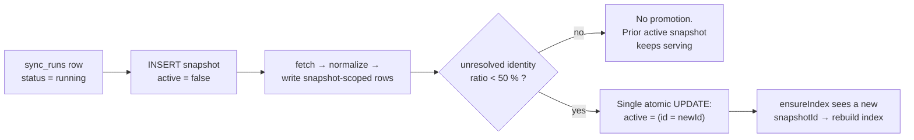
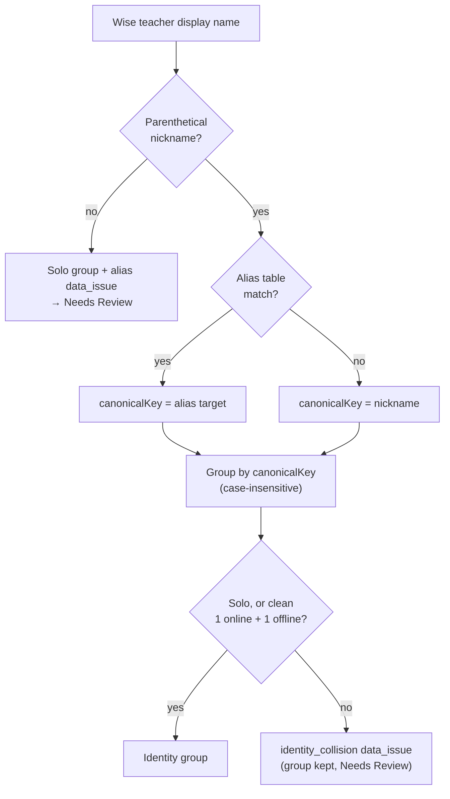
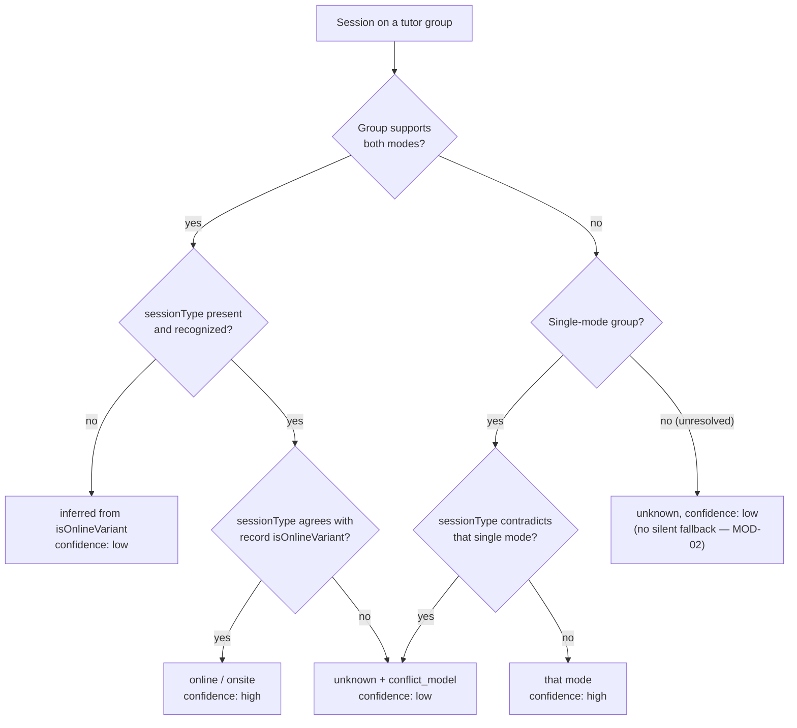
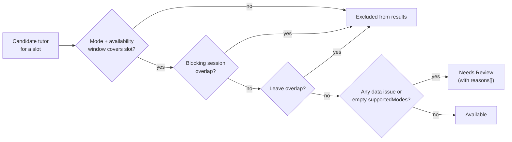
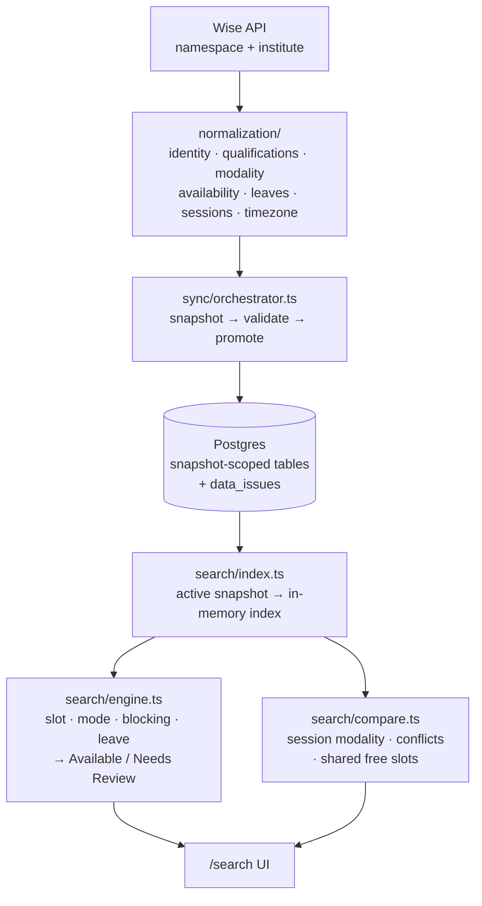

# Glossary

The domain vocabulary of BGScheduler, one line each, grounded in the code that defines or
enforces the term. Where a one-liner hides real behavior, a **Mechanics** section expands it
with the exact rule and a diagram. Every non-obvious claim carries a `file:line` citation
against HEAD — **when this page and the code disagree, the code wins.**

> **Canonical home.** This page owns *meaning*: the shortest true definition plus the single
> file that is the source of truth for it. It does **not** own column lists or endpoint
> signatures — those live in [`reference/database/index.md`](../reference/database/index.md)
> and [`reference/api/index.md`](../reference/api/index.md). It does not own feature rules or
> flows either — those live in [`features/`](../features/). Follow the "More" column.

---

## At a glance

| Term | One-line definition | Defined / enforced at | More |
| --- | --- | --- | --- |
| **Snapshot** | An immutable, point-in-time capture of all normalized tutor data; nearly every tutor row carries a `snapshotId`, so a whole world of tutors can be replaced in one flip. | `snapshots` table `src/lib/db/schema.ts:456-460`; created inactive `src/lib/sync/orchestrator.ts:70-75` | [data-health](../features/data-health.md) |
| **Active snapshot** | The single snapshot row with `active = true` — the one the in-memory index loads and every search/compare read serves from. Exactly one is active at a time. | loaded `src/lib/search/index.ts:144-152`; promoted `src/lib/sync/orchestrator.ts:481-500` | [data-health](../features/data-health.md) |
| **Identity group** | A logical merge of the one-or-more Wise teacher records that represent the same real person (typically an onsite record plus its "Online" twin), keyed by `canonicalKey`. | `IdentityGroup` `src/lib/normalization/identity.ts:7-18`; built by `resolveIdentities` `identity.ts:72-207` | [tutor-search](../features/tutor-search.md) |
| **Alias** | A nickname-override row (`fromKey → toKey`) applied during identity resolution so two spellings of one person collapse onto a single canonical key. | `AliasMapping` `src/lib/normalization/identity.ts:20-23`; applied `identity.ts:76-100`; stored in `tutor_aliases` `schema.ts:1540-1547` | [tutor-search](../features/tutor-search.md) |
| **Modality (online / onsite)** | Whether teaching happens remotely or in person. A *group's* modality is `online`, `onsite`, `both`, or `unresolved`; a single *session* resolves to `online`, `onsite`, or `unknown` with a confidence grade. | `Modality` `src/lib/normalization/modality.ts:4`; `modality` pgEnum `schema.ts:43-48`; per-session `resolveSessionModality` `src/lib/search/compare.ts:97-172` | [tutor-compare](../features/tutor-compare.md) |
| **Qualification** | A tutor's teachable competency, parsed out of a free-text Wise tag into `subject` / `curriculum` / `level` (+ `examPrep` when applicable). | `NormalizedQualification` `src/lib/normalization/qualifications.ts:3-9`; parsed by `normalizeTag` `qualifications.ts:43-66` | [tutor-search](../features/tutor-search.md) |
| **Subject** | The teaching-domain segment of a qualification (`Math`, `Science`, `EFL`) — the text *before* the parenthetical in the Wise tag. | `qualifications.ts:31,48-49` | [tutor-search](../features/tutor-search.md) |
| **Curriculum** | The framework segment, normalized through a lookup map to `International` / `Thai` / `ExamPrep`; unrecognized values pass through verbatim. | `CURRICULUM_MAP` `qualifications.ts:33-41`; applied `qualifications.ts:50-51` | [tutor-search](../features/tutor-search.md) |
| **Level** | The grade-band or target segment (`Y2-8`, `SAT`) — the text *after* the parenthetical. | `qualifications.ts:52` | [tutor-search](../features/tutor-search.md) |
| **examPrep** | A separate field set **only** when `curriculum === "ExamPrep"`; its value mirrors `level` (e.g. `SAT`). Absent otherwise. | `qualifications.ts:61-63`; column `subject_level_qualifications.exam_prep` `schema.ts:1580` | [tutor-search](../features/tutor-search.md) |
| **Recurring mode** | Search/compare mode in which *any* future blocking session on the same **weekday + clock time** blocks the tutor, regardless of which date it falls on. | `SearchMode` `src/lib/search/types.ts:6`; `isBlockedRecurring` `src/lib/search/engine.ts:155-168` | [tutor-search](../features/tutor-search.md) |
| **One-time mode** | Search/compare mode in which only a blocking session on the **exact calendar day + time** blocks — so a drop-in slot on an otherwise-busy weekday can still read as free. | `isBlockedOneTime` `src/lib/search/engine.ts:173-188` | [tutor-search](../features/tutor-search.md) |
| **Slot** | One requested teaching window: weekday-or-date + `start`/`end` in `"HH:mm"` + desired mode (`online` / `onsite` / `either`). The unit a search is evaluated against. | `SearchSlot` `src/lib/search/types.ts:8-15`; evaluated by `searchSlot` `engine.ts:60-150` | [tutor-search](../features/tutor-search.md) |
| **Leave** | A dated time-off window for a tutor (UTC→Bangkok converted, overlapping ranges merged) that blocks availability in **both** recurring and one-time modes. | `NormalizedLeave` `src/lib/normalization/leaves.ts:4-8`; blocking checks `engine.ts:251-309`; `dated_leaves` `schema.ts:1603-1613` | [tutor-search](../features/tutor-search.md) |
| **Blocking session** | A Wise session whose status makes the tutor unavailable. Fail-closed by construction: anything not on the short non-blocking allowlist — including a missing status — blocks. | `isBlockingStatus` `src/lib/normalization/sessions.ts:46-51`; allowlist `sessions.ts:34-40` | [tutor-search](../features/tutor-search.md) |
| **Tutor tier** | A **payroll** pay-band normalized from a `Tier N` Wise tag to `BG0` / `BG1` / `BG2` / `BG3` / `Unassigned`; it keys the rate-card lookup. Not a scheduling concept. | `PayrollTier` `src/lib/payroll/types.ts:1`; `normalizeTierLabel` `src/lib/payroll/domain.ts:109-117`; tag extraction `domain.ts:119-125` | [payroll](../features/payroll.md) |
| **OA (LINE Official Account)** | The BeGifted business account on LINE that families message. Identified by `lineOaAccountId` — the first path segment of a `https://chat.line.biz/{oaAccountId}/chat/{userId}` admin URL. | `parseLineOaChatUrl` `src/lib/line/oa-resolver.ts:344-360`; self-mention gate `src/lib/line/mentions.ts:1-17` | [line-integration](../features/line-integration.md) |
| **Namespace** | The Wise tenant identifier (`begifted-education`), sent on every Wise request as the `x-wise-namespace` header and embedded in the `user-agent`. | header build `src/lib/wise/client.ts:53-61`; env default `src/lib/env.ts:10` | [wise-api](../reference/wise-api.md) |
| **Institute** | The Wise organization ID (`696e1f4d…`) that scopes every Wise resource path — `/institutes/{instituteId}/…`. | path usage `src/lib/wise/fetchers.ts:35,50`; env default `src/lib/env.ts:11` | [wise-api](../reference/wise-api.md) |
| **Needs Review** | The fail-closed bucket: a tutor who *matches* the slot but carries an unresolved identity/modality/qualification (or any logged data issue) is surfaced here — never silently as Available. | `engine.ts:83-97,142-146`; rendered `src/components/search/availability-grid.tsx:272-275` | [data-health](../features/data-health.md) |

---

## Mechanics worth knowing

### Snapshot and active snapshot

A snapshot is created **inactive** at the start of a sync (`orchestrator.ts:70-75`) and only
becomes the active one at the very end, after validation. Promotion is a *single* `UPDATE` that
sets `active` to the boolean expression `(snapshots.id = newId)` under a
`WHERE active = true OR id = newId` clause, so PostgreSQL MVCC guarantees every concurrent
reader sees either the prior-active row or the new one — never a moment with zero active
snapshots (`orchestrator.ts:481-500`). The gate is quantitative: promotion happens only when the
unresolved-identity ratio is **under 50 %** (`orchestrator.ts:473-476`); otherwise the candidate
snapshot is written and left inactive, and the previous world keeps serving. After a successful
promotion the run prunes old snapshots down to the newest `SNAPSHOT_RETENTION_COUNT = 30`
(`src/lib/sync/snapshot-pruning.ts:5`, invoked `orchestrator.ts:520-528`).

The in-memory index notices a promotion lazily: `ensureIndex` re-reads the active snapshot id
(plus a tutor-profile version string) and rebuilds only when either changed, coalescing
concurrent first-time builds onto one promise (`src/lib/search/index.ts:354-401`). The sync
wrapper additionally expires the `snapshot` cache tag on success
(`src/lib/sync/run-wise-sync.ts:161`).

```mermaid
flowchart LR
    A["sync_runs row<br/>status = running"] --> B["INSERT snapshot<br/>active = false"]
    B --> C["fetch → normalize →<br/>write snapshot-scoped rows"]
    C --> D{"unresolved identity<br/>ratio &lt; 50 % ?"}
    D -- no --> E["No promotion.<br/>Prior active snapshot<br/>keeps serving"]
    D -- yes --> F["Single atomic UPDATE:<br/>active = (id = newId)"]
    F --> G["ensureIndex sees a new<br/>snapshotId → rebuild index"]
```

### Identity group, canonical key, and alias

`resolveIdentities` runs one cascade per Wise teacher display name (the name itself comes from
the linked Wise user, falling back to `teacher.name` then the raw id —
`getWiseTeacherDisplayName` `src/lib/wise/types.ts:318-320`):

1. **Nickname extraction** — pull the parenthetical, e.g. `"Chinnakrit (Celeste) Channiti" → "Celeste"` (`identity.ts:43-46`).
2. **Alias override** — look the nickname up case-insensitively in the `tutor_aliases` map (loaded `orchestrator.ts:86-91`); the alias target wins if present (`identity.ts:76-79,96-100`).
3. **Pair merge** — group all teachers sharing a canonical key; a trailing `"Online"` marks the online variant (`isOnlineVariant`, `identity.ts:52-54`), and the *non-online* member supplies the display name (`identity.ts:110-133`).
4. **Collision guard (REL-03)** — a key that gathers more than two members, or exactly two that are not a clean 1-online + 1-offline pair, emits an `identity_collision` data issue. The group is still kept so admins can see and disambiguate it (`identity.ts:148-170`).
5. **Unresolved fallback** — a teacher with no nickname and no alias match becomes a *solo* group **plus** a data issue, so it surfaces in Needs Review rather than disappearing (`identity.ts:177-204`).

`canonicalKey` is the group's stable business identity (the display name chosen in step 3,
`identity.ts:129-136`) and is the tutor key that survives snapshot rotation — it anchors
cross-snapshot data like `past_session_blocks.group_canonical_key` (`schema.ts:2255-2260`) and
the editorial tutor profiles, and it is denormalized onto the in-memory group to avoid an extra
query (`src/lib/search/index.ts:67-71,263`). All identity issues are stored at `critical`
severity (`orchestrator.ts:96-105`).

```mermaid
flowchart TD
    A["Wise teacher display name"] --> B{"Parenthetical<br/>nickname?"}
    B -- no --> Z["Solo group + alias data_issue<br/>→ Needs Review"]
    B -- yes --> C{"Alias table<br/>match?"}
    C -- yes --> D["canonicalKey = alias target"]
    C -- no --> E["canonicalKey = nickname"]
    D --> F["Group by canonicalKey<br/>(case-insensitive)"]
    E --> F
    F --> G{"Solo, or clean<br/>1 online + 1 offline?"}
    G -- yes --> H["Identity group"]
    G -- no --> I["identity_collision data_issue<br/>(group kept, Needs Review)"]
```

### Modality — derived, never guessed

Two resolvers exist, and they answer two different questions.

**Group modality** (`deriveModality`, `modality.ts:23-92`) answers "what can this tutor do?" in
strict evidence precedence:

1. Structural — both an online and an offline member → `both`; online members only → `online` (`modality.ts:27-36`).
2. Session evidence — `sessionType` / `location` strings on the group's sessions; both kinds of evidence → `both`, otherwise the one that appears (`modality.ts:38-63`).
3. A lone offline record with no session evidence does **not** default to onsite — it returns `unresolved` plus an issue (`modality.ts:65-79`).
4. Anything else → `unresolved` (`modality.ts:81-91`).

The derived value is written to `tutor_identity_groups.supported_modality`
(`orchestrator.ts:326-329`) and fanned out per teacher onto each availability window: the online
variant's windows become `online`, the other members' windows become `onsite` when the group is
`both`, else they inherit the group value (`orchestrator.ts:331-337`, applied
`orchestrator.ts:420-421`). The index then translates the stored group value into
`supportedModes`: `both → ["online","onsite"]`, `unresolved → []`, else the single value
(`src/lib/search/index.ts:265-270`). An **empty** `supportedModes` is exactly what routes a tutor
to Needs Review (`engine.ts:91-92`).

**Session modality** (`resolveSessionModality`, `compare.ts:97-172`) answers "how is *this* class
taught?" and grades its own confidence (`high` / `medium` / `low`, rubric documented at
`compare.ts:64-82`). For a paired group it requires `sessionType` to corroborate the teacher
record's online/offline flag: agreement → `high`, missing `sessionType` → the inference is kept
but marked `low`, disagreement → `{ modality: "unknown", confidence: "low" }` plus a
contradiction (`compare.ts:116-138`). `medium` is reserved and never emitted. The session-type
vocabulary is two small sets — `online|virtual|scheduled` vs `onsite|in-person|offline`
(`compare.ts:6-7`). The same contradiction test runs at sync time so the disagreement lands in
`data_issues` as a `conflict_model` row (`detectSessionModalityConflict`, `compare.ts:185-223`,
called from `orchestrator.ts:375`).

```mermaid
flowchart TD
    S["Session on a tutor group"] --> P{"Group supports<br/>both modes?"}
    P -- yes --> T{"sessionType present<br/>and recognized?"}
    T -- no --> L1["inferred from isOnlineVariant<br/>confidence: low"]
    T -- yes --> A{"sessionType agrees with<br/>record isOnlineVariant?"}
    A -- yes --> H["online / onsite<br/>confidence: high"]
    A -- no --> U["unknown + conflict_model<br/>confidence: low"]
    P -- no --> Q{"Single-mode group?"}
    Q -- yes --> R{"sessionType contradicts<br/>that single mode?"}
    R -- no --> H2["that mode<br/>confidence: high"]
    R -- yes --> U
    Q -- "no (unresolved)" --> U2["unknown, confidence: low<br/>(no silent fallback — MOD-02)"]
```

### Qualification: subject / curriculum / level / examPrep

One regex does the parsing — `^(.+?)\s*\(([^)]+)\)\s*(.+)$` (`qualifications.ts:31`) — so a Wise
tag must have the shape `Subject (Curriculum) Level` to be understood at all. Anything that does
not match becomes a `tag` data issue naming the unmapped tag (`normalizeTeacherTags`,
`qualifications.ts:71-98`), which is itself a Needs-Review trigger.

| Wise tag | subject | curriculum | level | examPrep |
| --- | --- | --- | --- | --- |
| `Math (Int.) Y2-8` | `Math` | `International` | `Y2-8` | — |
| `Math (Thai) Y2-8` | `Math` | `Thai` | `Y2-8` | — |
| `Math (ExamPrep) SAT` | `Math` | `ExamPrep` | `SAT` | `SAT` |

_(Examples are the ones documented on the parser itself, `qualifications.ts:19-28`; the
curriculum collapse `int.`/`int`/`international` → `International`, `th`/`thai` → `Thai`,
`examprep`/`exam prep` → `ExamPrep` is `CURRICULUM_MAP`, `qualifications.ts:33-41`.)_

Search filters match qualifications case-insensitively and require **one** qualification row to
satisfy every supplied filter simultaneously — subject *and* curriculum *and* level on the same
row, not spread across rows (`matchesFilters`, `engine.ts:311-321`).

### Slot, sub-slot, and the two search modes

A **slot** is what the user asks for. A **sub-slot** is what the range search generates:
`generateSubSlots` walks a wide time band in *non-overlapping* steps of exactly
`durationMinutes` (60/90/120) and stops when the next full step would exceed the band
(`range-search.ts:41-68`); a band too short for one step is a hard error
(`range-search.ts:111-113`). Each sub-slot becomes an ordinary `SearchSlot` and is run through
the same engine, then the results are pivoted into a per-tutor availability row
(`range-search.ts:118-127,217-223`, `RangeGridRow` `types.ts:93-100`).

The mode only changes the *blocking* comparison:

| | Recurring | One-time |
| --- | --- | --- |
| Blocks when | a blocking session shares the **weekday** and overlaps the time (`engine.ts:161-167`) | a blocking session falls on the **same calendar day** and overlaps the time (`engine.ts:182-187`) |
| Leave check | weekday-based, with a multi-day special case (below) — `engine.ts:251-289` | interval overlap against the concrete date/time — `engine.ts:294-309` |
| Typical use | "who is free every Tuesday 16:00–17:30?" | "who is free on this one date?" |

When a search carries multiple slots, `intersection` returns only the tutors available in **all**
of them (`computeIntersection`, `engine.ts:323-342`).

### Leave and blocking session — two independent gates

A candidate must clear *both* gates, in this order, before it can be labelled Available
(`engine.ts:113-125`).

- **Sessions.** Only `CANCELLED`, `CANCELED`, `COMPLETED`, `MISSED`, `NO_SHOW` are non-blocking; every other status — and a missing status — blocks (`sessions.ts:34-51`). The verdict is frozen into `isBlocking` at normalization time (`sessions.ts:80-81`), persisted (`schema.ts:1629`) and carried through the index (`search/index.ts:299`).
- **Leaves.** A leave longer than 24 h is treated as a **full-day** block on every weekday it touches, with no minute-of-day math on the middle days; a single-day leave uses exact minute-of-day overlap. This asymmetry is deliberate and documented as REL-04 (`engine.ts:240-289`).

Leaves themselves are de-duplicated at normalization: overlapping or touching windows are merged
into one (`deduplicateLeaves`, `leaves.ts:29-54`), the same treatment availability windows get
per weekday (`deduplicateWindows`, `availability.ts:62-92`).

A third, local-only blocker exists on the range-search grid: an active **proposal hold**
overwrites an otherwise-available cell with a `kind: "proposal_hold"` entry
(`range-search.ts:144-168`, `BlockingSessionInfo.kind` `types.ts:68`). Holds are BGScheduler's
own tentative reservations and are never written back to Wise — see
[proposals](../features/proposals.md).

```mermaid
flowchart LR
    S["Candidate tutor<br/>for a slot"] --> M{"Mode + availability<br/>window covers slot?"}
    M -- no --> X["Excluded from results"]
    M -- yes --> B{"Blocking session<br/>overlap?"}
    B -- yes --> X
    B -- no --> L{"Leave overlap?"}
    L -- yes --> X
    L -- no --> R{"Any data issue or<br/>empty supportedModes?"}
    R -- yes --> NR["Needs Review<br/>(with reasons[])"]
    R -- no --> AV["Available"]
```

### Needs Review

Needs Review is not an error state — it is the *honest* state. The engine collects
`reviewReasons` from two sources: every `data_issue` attached to the group (rendered as
`"{type}: {message}"`) and an empty `supportedModes` (rendered as `"Unresolved modality"`)
(`engine.ts:83-97`). A tutor that passes every availability gate but has at least one reason goes
into `needsReview` instead of `available` (`engine.ts:142-146`), and the UI renders it as a
separate, badge-labelled table below the grid
(`src/components/search/availability-grid.tsx:272-297`). The reasons array is part of the API
contract (`TutorReviewResult`, `types.ts:46-48`).

Issues reach a group by a deliberately loose match — `entityId` equal to the group's canonical
key **or** its row id, or `entityName` equal to the display name
(`src/lib/search/index.ts:232-247`). The issues themselves are typed
`alias | modality | tag | completeness | conflict_model | sync` and graded
`critical | high | medium | low` (`schema.ts:27-41`, columns `schema.ts:2688-2689`).

### Tutor tier

`tier` is a **payroll** term, not a scheduling one. Payroll sync reads the teacher's Wise tags,
picks the first one matching `/^Tier\s+/i` as `rawTier` (`domain.ts:119-125`), and normalizes
`Tier 0/1/2/3` to `BG0`–`BG3`, with everything else — including a missing tag — becoming
`Unassigned` (`domain.ts:109-117`, stored `payroll/sync.ts:293,308`). The tier then keys the
rate-card lookup together with student band and normalized course (`rateRuleKey`,
`src/lib/payroll/rate-card.ts:170-176`); one source column can feed several tiers, e.g.
`Tier 0-2` populates `BG0`, `BG1` and `BG2` rules (`rate-card.ts:23-27`). `Unassigned` is a hard
blocker: reconciliation raises a `missing_tier` issue for both the session side and the invoice
side (`payroll/data.ts:316-323,369-377`) and the promotions audit reports
`missing_teacher_tier` (`src/lib/student-promotions/data.ts:1186`).

### OA, namespace, institute — the three external identifiers

| Identifier | System | What it scopes | Where it enters the code |
| --- | --- | --- | --- |
| **Namespace** (`begifted-education`) | Wise | The tenant. Sent as `x-wise-namespace` and in `user-agent: VendorIntegrations/{namespace}` on every request, alongside Basic auth and `x-api-key`. | `src/lib/wise/client.ts:53-61`; env default `src/lib/env.ts:10` |
| **Institute** (`696e1f4d…`) | Wise | The organization inside the tenant. Every resource path is `/institutes/{instituteId}/…` — teachers, availability, sessions, locations. | `src/lib/wise/fetchers.ts:35,50,135,213`; env default `src/lib/env.ts:11` |
| **OA account id** | LINE | The Official Account whose chats/followers a LINE user id belongs to. Parsed out of the admin chat URL alongside the user id. | `parseLineOaChatUrl` `src/lib/line/oa-resolver.ts:344-360`; column `line_oa_resolver_rows.line_oa_account_id` `schema.ts:2645` |

Two OA facts are load-bearing. First, a LINE `userId` is only meaningful **within** the OA
channel that issued it — that is why the follower re-anchor job exists, to seed
correct-namespace contacts from the OA's own follower list
(`src/lib/line/student-links.ts:753-762`). Second, a group-chat mention of the OA is detected via
LINE's native `isSelf` flag on `message.mention.mentionees`, not by a regex over the OA's display
name — so renaming the OA cannot break the bot, and typing the literal characters `@BeGifted`
(which produces no mention object) correctly does nothing (`src/lib/line/mentions.ts:1-17`).

---

## Adjacent vocabulary

Terms you will hit within minutes of reading any of the above.

| Term | One-line definition | Defined at |
| --- | --- | --- |
| **Canonical key** | The identity group's stable business key; the tutor identifier that survives snapshot rotation. | `tutor_identity_groups.canonical_key` `schema.ts:1519`; denormalized `src/lib/search/index.ts:67-71` |
| **Data issue** | A typed, severity-graded normalization defect written per snapshot; the fuel for Needs Review and `/data-health`. | `schema.ts:27-41,2685-2695` |
| **Availability window** | A recurring `weekday + startMinute + endMinute` band with a modality (Wise's `workingHours` are already Bangkok-local, so no UTC conversion), overlaps merged. | `RecurringWindow` `src/lib/normalization/availability.ts:4-8`; `normalizeWorkingHours` `availability.ts:28-57`; table `schema.ts:1589-1601` |
| **Search index** | The `globalThis`-anchored in-memory projection of the active snapshot, with an O(1) `byWeekday` bucket per day. | `SearchIndex` `src/lib/search/index.ts:83-90`; buckets `index.ts:322-331` |
| **Conflict (compare)** | Two *different* compared tutors holding overlapping sessions for the **same student name** on the same weekday — i.e. the student cannot attend both. | `detectConflicts` `src/lib/search/compare.ts:322-359`; `Conflict` `types.ts:154-161` |
| **Shared free slot** | The interval intersection of every compared tutor's availability minus their blocking sessions, per weekday; only intervals **≥ 30 minutes** are emitted, and one tutor with no free time that day kills the day entirely. | `findSharedFreeSlots` `compare.ts:361-405` (30-minute floor `compare.ts:401`, empty-tutor short-circuit `compare.ts:397`) |
| **Weekday fallback** | When a compared week has no data for a weekday, `buildCompareTutor` shows the nearest *future* occurrence of that weekday's sessions (deduped by `recurrenceId`) — but only for today-or-future days; past days render honestly empty. | `compare.ts:251-291` |
| **Proposal hold** | A local-only tentative reservation of a tutor slot (`pending` or `confirmed`, optionally expiring); blocks the search grid but is never written to Wise. | `ProposalHoldSummary` `src/lib/proposals/types.ts:12-36`; active statuses `src/lib/proposals/overlap.ts:9` |
| **Past session block** | A session captured as it dropped out of Wise's `FUTURE` window, stored cross-snapshot under `group_canonical_key` so history is not lost (PAST-01). | `schema.ts:2255-2264`; capture hook `src/lib/sync/orchestrator.ts:400-407` |
| **Stale** | Snapshot age past a threshold: 90 minutes adds an API warning, 2 hours raises the in-app banner. Staleness warns; it never withholds data. | `src/lib/ops/stale.ts:2-7`; applied `engine.ts:30-38` |
| **Fail-closed** | The house rule: unproven availability is never rendered as Available. Unknown session status blocks; unresolved identity/modality/qualification routes to Needs Review. | `sessions.ts:46-51`; `modality.ts:65-91`; `engine.ts:83-97` |

---

## Timezone convention (read this before comparing timestamps)

`TIMEZONE = "Asia/Bangkok"` and every conversion goes through one module
(`src/lib/normalization/timezone.ts:3-34`). Thailand has had no DST since 1941, which is why
fixed-offset reasoning is safe here (noted at `src/lib/search/compare.ts:33`).

The contract the codebase locks in is behavioral, not representational: after
`toLocalTime`/`toZonedTime`, the date accessors return **Bangkok wall-clock** values — that is
what the REL-08 round-trip test asserts (`src/lib/normalization/__tests__/timezone.test.ts:38-56`).
Weekday and minute-of-day are additionally frozen into integer columns at normalization time
(`sessions.ts:77-79`), so the hot search path never re-derives them, and the shifted `Date` is
what gets persisted into `future_session_blocks.start_time` / `end_time`
(`orchestrator.ts:289-290`).

Downstream code relies on that normalization when it slices a calendar day: one-time blocking
compares `startTime.toISOString().slice(0, 10)` against the requested date
(`engine.ts:179-185`), and the discover route spells the assumption out — "SearchIndex timestamps
are normalized to Bangkok wall-clock values before indexing. UTC accessors keep that normalized
date stable under any host TZ" (`src/app/api/compare/discover/route.ts:249-256`). Note that the
test harness pins the process to Bangkok (`vitest.config.ts:4`) while Vercel runs UTC — see the
open question at the end of this page before relying on day-slicing in a new code path.

---

## One word, two meanings

| Word | Meaning A | Meaning B |
| --- | --- | --- |
| **Tier** | **Tutor tier** — payroll pay-band `BG0`–`BG3` (`payroll/domain.ts:109-117`). | A free-text `tier` column on the tutor-profile importer that is only folded into `internalNotes` prose (`src/lib/tutor-profile-import.ts:36,485`) — not a queryable attribute, and not the same vocabulary. |
| **Leave** | **Normalized leave** — a Wise-sourced time-off window that blocks availability (`normalization/leaves.ts:4-8`). | **Leave request** — a Google-Sheet form submission in the Leave Requests feature, with its own `ok` / `needs_review` normalization status (`src/lib/leave-requests/parser.ts:7`). One is data the search engine enforces; the other is a workflow item awaiting admin action. |
| **Needs review** | **Needs Review** — the search engine's fail-closed tutor bucket (`engine.ts:142-146`). | A same-named status label in unrelated features (leave-request rows, classroom assignment, student promotions, room capacity). Same phrase, different state machines. |
| **Mode** | **Search mode** — `recurring` vs `one_time` (`types.ts:6`). | **Slot mode / modality filter** — `online` \| `onsite` \| `either` on a `SearchSlot` (`types.ts:14`). |
| **Namespace** | **Wise namespace** — the tenant header (`wise/client.ts:58`). | **LINE namespace** — informal shorthand for "user ids are only valid within the issuing OA channel" (`src/lib/line/student-links.ts:753-756`). |
| **Confidence** | **Modality confidence** — `high`/`medium`/`low` on a compared session (`compare.ts:64-82`). | **Recommendation confidence** — the `Best fit` / `Strong fit` / `Good fit` label on ranked slots (`src/lib/search/recommend.ts:44`). |

---

## Where each term is enforced

```mermaid
flowchart TD
    W["Wise API<br/>namespace + institute"] --> N["normalization/<br/>identity · qualifications · modality<br/>availability · leaves · sessions · timezone"]
    N --> O["sync/orchestrator.ts<br/>snapshot → validate → promote"]
    O --> DB[("Postgres<br/>snapshot-scoped tables<br/>+ data_issues")]
    DB --> IX["search/index.ts<br/>active snapshot → in-memory index"]
    IX --> EN["search/engine.ts<br/>slot · mode · blocking · leave<br/>→ Available / Needs Review"]
    IX --> CP["search/compare.ts<br/>session modality · conflicts<br/>· shared free slots"]
    EN --> UI["/search UI"]
    CP --> UI
```

---

_Verified against HEAD + uncommitted WIP on 2026-05-31._
