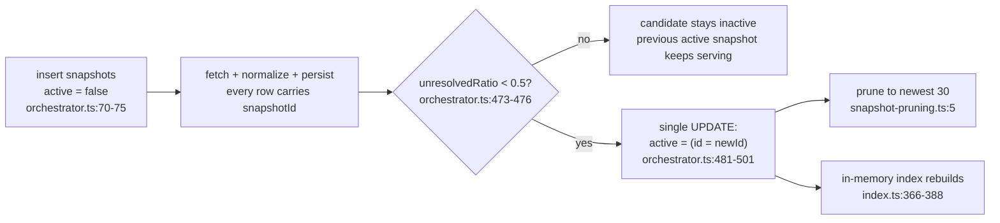
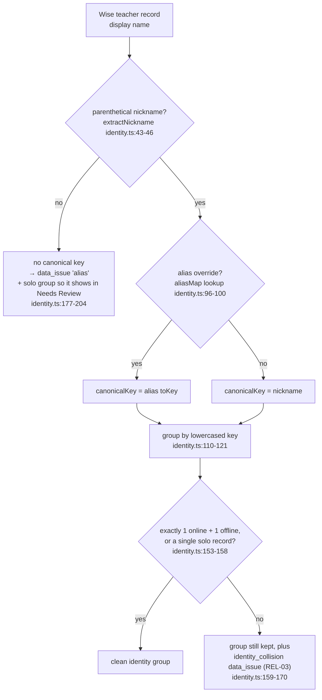
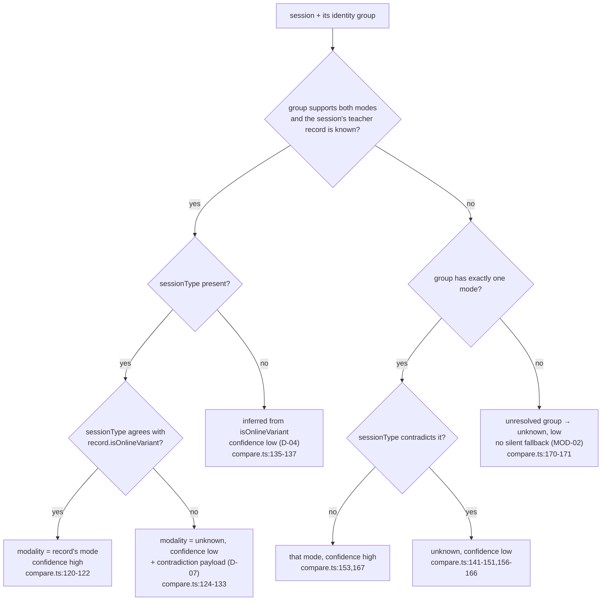
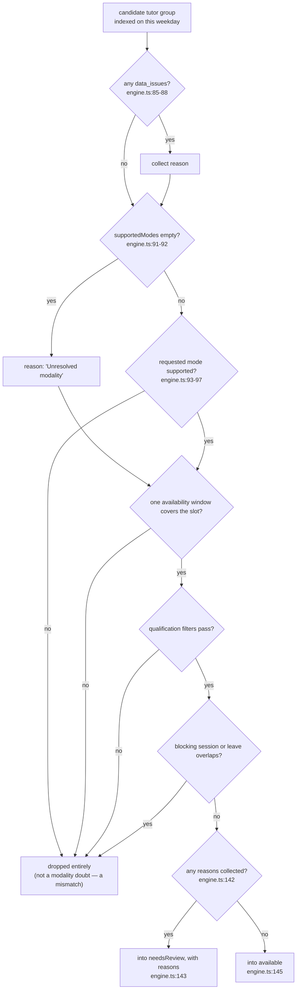

# Glossary

The domain vocabulary of BGScheduler, one line each, grounded in the code that defines or
enforces the term. Where a one-liner hides real behavior, a **Mechanics** section expands it
with the exact rule and a diagram. Every non-obvious claim carries a `file:line` citation —
**when this page and the code disagree, the code wins.**

> **Canonical home.** This page owns *meaning*: the shortest true definition plus the single
> file that is the source of truth for it. It does **not** own column lists or endpoint
> signatures — those live in [`reference/database/index.md`](../reference/database/index.md)
> and [`reference/api/index.md`](../reference/api/index.md). It does not own feature rules or
> flows either — those live in [`features/`](../features/). Follow the "More" column.

---

## At a glance

| Term | One-line definition | Defined / enforced at | More |
| --- | --- | --- | --- |
| **Snapshot** | An immutable, point-in-time capture of all normalized tutor data; every tutor-side row carries a `snapshotId`, so one flip replaces a whole world of tutors at once. | `snapshots` table `src/lib/db/schema.ts:456-460`; created inactive `src/lib/sync/orchestrator.ts:70-75` | [data-flow](./data-flow.md) |
| **Active snapshot** | The single `snapshots` row with `active = true` — the one the in-memory index loads and every search/compare read serves from. Exactly one is active at a time. | loaded `src/lib/search/index.ts:142-152`; promoted `src/lib/sync/orchestrator.ts:481-501` | [data-flow](./data-flow.md) |
| **Identity group** | A logical merge of the one-or-more Wise teacher records that represent the same real person (typically an onsite record plus its "Online" twin), keyed by `canonicalKey`. | `IdentityGroup` `src/lib/normalization/identity.ts:7-11`; built by `resolveIdentities` `identity.ts:72-207`; persisted `tutor_identity_groups` `schema.ts:1519-1528` | [tutor-search](../features/tutor-search.md) |
| **Alias** | A nickname-override row (`fromKey → toKey`) applied during identity resolution so two spellings of one person collapse onto a single canonical key. Case-insensitive, one target per source. | `AliasMapping` `identity.ts:20-23`; applied `identity.ts:76-79,96-100`; `tutor_aliases` `schema.ts:1543-1550`; loaded `orchestrator.ts:86-91` | [tutor-search](../features/tutor-search.md) |
| **Modality (online / onsite)** | Whether teaching happens remotely or in person. A *group's* modality is `online`, `onsite`, `both`, or `unresolved`; a single *session* resolves to `online`, `onsite`, or `unknown` with a confidence grade. Never guessed. | `Modality` `src/lib/normalization/modality.ts:4`; `modality` pgEnum `schema.ts:43-48`; per-session `resolveSessionModality` `src/lib/search/compare.ts:97-171` | [tutor-compare](../features/tutor-compare.md) |
| **Qualification** | A tutor's teachable competency, parsed out of a free-text Wise tag into `subject` / `curriculum` / `level` (+ `examPrep` when applicable). | `NormalizedQualification` `src/lib/normalization/qualifications.ts:3-9`; parsed by `normalizeTag` `qualifications.ts:43-66` | [tutor-search](../features/tutor-search.md) |
| **Subject** | The teaching-domain segment of a qualification (`Math`, `Science`, `EFL`) — the text *before* the parenthetical in the Wise tag. | `TAG_PATTERN` `qualifications.ts:31`; extracted `qualifications.ts:48-49` | [tutor-search](../features/tutor-search.md) |
| **Curriculum** | The framework segment, normalized through a lookup map to `International` / `Thai` / `ExamPrep`; an unrecognized value passes through verbatim rather than being dropped. | `CURRICULUM_MAP` `qualifications.ts:33-41`; applied `qualifications.ts:50-51` | [tutor-search](../features/tutor-search.md) |
| **Level** | The grade-band or target segment (`Y2-8`, `SAT`) — the text *after* the parenthetical. | `qualifications.ts:52` | [tutor-search](../features/tutor-search.md) |
| **examPrep** | A separate optional field set **only** when `curriculum === "ExamPrep"`; its value mirrors `level` (e.g. `SAT`). Absent otherwise. | `qualifications.ts:61-63`; column `subject_level_qualifications.exam_prep` | [database/erd-core](../reference/database/erd-core.md) |
| **Recurring mode** | Search/compare mode in which *any* future blocking session on the same **weekday + clock time** blocks the tutor, whichever date it falls on. | `SearchMode` `src/lib/search/types.ts:6`; `isBlockedRecurring` `src/lib/search/engine.ts:155-168` | [tutor-search](../features/tutor-search.md) |
| **One-time mode** | Search/compare mode in which only a blocking session on the **exact calendar day + time** blocks — so a drop-in slot on an otherwise-busy weekday can still read as free. | `isBlockedOneTime` `engine.ts:173-188` | [tutor-search](../features/tutor-search.md) |
| **Slot** | One requested teaching window: weekday-or-date + `start`/`end` as `"HH:mm"` + desired mode (`online` / `onsite` / `either`). The unit a search is evaluated against. | `SearchSlot` `src/lib/search/types.ts:8-15`; evaluated by `searchSlot` `engine.ts:60-150` | [tutor-search](../features/tutor-search.md) |
| **Leave** | A dated time-off window for a tutor (UTC→Bangkok converted, overlapping ranges merged) that blocks availability in **both** recurring and one-time modes. | `NormalizedLeave` `src/lib/normalization/leaves.ts:4-8`; blocking checks `engine.ts:251-309`; `dated_leaves` `schema.ts:1606-1616` | [tutor-search](../features/tutor-search.md) |
| **Blocking session** | A Wise session whose status makes the tutor unavailable. Fail-closed by construction: anything not on the short non-blocking allowlist — a missing status included — blocks. | `isBlockingStatus` `src/lib/normalization/sessions.ts:46-51`; allowlist `sessions.ts:34-40`; frozen into `future_session_blocks.is_blocking` `schema.ts:1632` | [tutor-search](../features/tutor-search.md) |
| **Tutor tier** | A **payroll** pay-band normalized from a `Tier N` Wise tag to `BG0` / `BG1` / `BG2` / `BG3` / `Unassigned`; it keys the rate-card lookup. Not a scheduling concept. | `PayrollTier` `src/lib/payroll/types.ts:1`; `normalizeTierLabel` `src/lib/payroll/domain.ts:109-117`; tag extraction `domain.ts:119-125` | [payroll](../features/payroll.md) |
| **OA (LINE Official Account)** | The BeGifted business account on LINE that families message and that the bot answers as. Identified by `lineOaAccountId` — the first path segment of a `https://chat.line.biz/{oaAccountId}/chat/{userId}` admin URL. | `parseLineOaChatUrl` `src/lib/line/oa-resolver.ts:344-360`; self-mention gate `src/lib/line/mentions.ts:1-17`; column `line_oa_resolver_rows.line_oa_account_id` `schema.ts:2648` | [line-integration](../features/line-integration.md) |
| **Namespace** | The Wise tenant identifier (`begifted-education`), sent on every Wise request as the `x-wise-namespace` header and embedded in the `user-agent`. | header build `src/lib/wise/client.ts:68-77`; env default `src/lib/env.ts:10`; client factory `client.ts:214-221` | [wise-api](../reference/wise-api.md) |
| **Institute** | The Wise organization ID (`696e1f4d…`) that scopes every Wise resource path — `/institutes/{instituteId}/…`. Threaded through `runFullSync` as an explicit argument, not read from env inside the client. | path usage `src/lib/wise/fetchers.ts:35,50,135,213`; env default `src/lib/env.ts:11`; passed in `src/lib/sync/run-wise-sync.ts:145,152`; parameter `orchestrator.ts:50-55` | [wise-api](../reference/wise-api.md) |
| **Needs Review** | The fail-closed bucket: a tutor who *matches* the slot but carries an unresolved identity/modality/qualification — or any logged data issue — is surfaced here, never silently as Available. | `engine.ts:85-92,142-146`; rendered `src/components/search/availability-grid.tsx:275`, `src/components/search/results-view.tsx:104` | [tutor-search](../features/tutor-search.md), [data-health](../features/data-health.md) |

---

## Mechanics worth knowing

### Snapshot and active snapshot

A snapshot is created **inactive** at the start of a sync (`orchestrator.ts:70-75`) and only
becomes the active one at the very end, after validation. The promotion gate is quantitative:
it happens only when the unresolved-identity ratio is **under 50 %**
(`orchestrator.ts:473-476`); otherwise the candidate snapshot is written and left inactive, and
the previous world keeps serving.

Promotion itself is a *single* `UPDATE` that sets `active` to the boolean expression
`(snapshots.id = newId)` under a `WHERE active = true OR id = newId` clause, so PostgreSQL MVCC
guarantees every concurrent reader sees either the prior-active row or the new one — never a
moment with zero active snapshots (`orchestrator.ts:481-501`, design id REL-01). After a
successful promotion the run prunes old snapshots down to the newest
`SNAPSHOT_RETENTION_COUNT = 30` (`src/lib/sync/snapshot-pruning.ts:5`, invoked
`orchestrator.ts:527-533`).


```mermaid
flowchart LR
  A["insert snapshots<br/>active = false<br/>orchestrator.ts:70-75"] --> B["fetch + normalize + persist<br/>every row carries snapshotId"]
  B --> C{"unresolvedRatio &lt; 0.5?<br/>orchestrator.ts:473-476"}
  C -- no --> D["candidate stays inactive<br/>previous active snapshot keeps serving"]
  C -- yes --> E["single UPDATE:<br/>active = (id = newId)<br/>orchestrator.ts:481-501"]
  E --> F["prune to newest 30<br/>snapshot-pruning.ts:5"]
  E --> G["in-memory index rebuilds<br/>index.ts:366-388"]
```

Two grains coexist. **Snapshot-scoped** tables carry a `snapshotId` FK and are rewritten
wholesale each run; readers only ever see rows belonging to `snapshots.active = true`.
**Snapshot-independent** tables are keyed by a durable natural key and deliberately survive
rotation — `tutor_aliases` is keyed by `from_key` with no `snapshotId` at all
(`schema.ts:1543-1550`), and `past_session_blocks` is anchored on `group_canonical_key` with a
nullable, deliberately non-FK `captured_in_snapshot_id` so snapshots can be pruned without
cascading (`schema.ts:2258-2268`).

The in-memory index is the read-side consequence. `buildIndex` refuses to run without an active
snapshot — `throw new Error("No active snapshot found")` (`index.ts:150-152`) — and `ensureIndex`
treats a *changed* active snapshot id (or a changed tutor-profile version) as the staleness
signal that forces a rebuild, while coalescing concurrent callers onto one build promise
(`index.ts:354-401`).

### Identity group, alias, canonical key

`resolveIdentities` is a four-step cascade over the raw Wise teacher list
(`identity.ts:63-71` documents it; `72-207` implements it):


```mermaid
flowchart TD
  T["Wise teacher record<br/>display name"] --> N{"parenthetical nickname?<br/>extractNickname identity.ts:43-46"}
  N -- no --> U["no canonical key<br/>→ data_issue 'alias'<br/>+ solo group so it shows in Needs Review<br/>identity.ts:177-204"]
  N -- yes --> A{"alias override?<br/>aliasMap lookup identity.ts:96-100"}
  A -- yes --> K["canonicalKey = alias toKey"]
  A -- no --> K2["canonicalKey = nickname"]
  K --> G["group by lowercased key<br/>identity.ts:110-121"]
  K2 --> G
  G --> P{"exactly 1 online + 1 offline,<br/>or a single solo record?<br/>identity.ts:153-158"}
  P -- yes --> OK["clean identity group"]
  P -- no --> C["group still kept, plus<br/>identity_collision data_issue (REL-03)<br/>identity.ts:159-170"]
```

Details that matter in practice:

- **The nickname is the parenthetical.** `extractNickname` takes the first `(...)` group, so
  `"Chinnakrit (Celeste) Channiti"` → `Celeste` (`identity.ts:43-46`).
- **"Online" is a suffix test, not a substring test.** `isOnlineVariant` requires the word at the
  end of the trimmed name (`/\bOnline\s*$/i`, `identity.ts:52-54`), which is what makes the
  online/offline pair merge safe.
- **Alias matching is case-insensitive but the stored casing wins.** Both the map keys and the
  lookup are lowercased (`identity.ts:78,98`), while the value written into `canonicalKey` is the
  alias row's `toKey` verbatim. `tutor_aliases` has a unique index on `from_key`, so a source
  nickname has exactly one target (`schema.ts:1549`).
- **`canonicalKey` and `displayName` are the same string** on a resolved group — both come from
  the non-online member's canonical key, falling back to its nickname, then to the raw Wise
  display name (`identity.ts:128-136`).
- **A collision is not silently merged away.** More than two members, or two members that are not
  a clean online+offline pair, keep the group *and* emit a high-severity `alias` issue naming
  every member, which is what drives the tutor into Needs Review downstream
  (`identity.ts:148-170`).
- **`canonicalKey` is the cross-snapshot anchor (D-04).** It is denormalized onto the in-memory
  group so compare can fetch `past_session_blocks` without a second query
  (`src/lib/search/index.ts:67-71`).

### Modality — three different resolvers, one rule

"Modality" answers *online or onsite?* at three different grains, and the three implementations
do not share code. What they do share is the fail-closed rule: an unresolved or contradicted
signal produces `unresolved` / `unknown`, never a guess.

| Grain | Function | Output |
| --- | --- | --- |
| Identity group (per sync) | `deriveModality` `src/lib/normalization/modality.ts:23-92` | `online` \| `onsite` \| `both` \| `unresolved` |
| One compare session | `resolveSessionModality` `src/lib/search/compare.ts:97-171` | `online` \| `onsite` \| `unknown` + `high`/`medium`/`low` confidence |
| One student-schedule row | `deriveSessionModality` `src/lib/student-schedule/data.ts:116-121` | `online` \| `onsite` \| `unknown` |

**Group level.** `deriveModality` walks structural evidence first: an identity group holding both
an online-variant and a non-online member is `both`; online-only members give `online`
(`modality.ts:27-36`). Only then does it look at session evidence — `sessionType` and `location`
token sets (`modality.ts:38-63`). A lone offline record with no session evidence is explicitly
**not** assumed onsite; the comment says so and the code returns `unresolved` with an issue
(`modality.ts:65-79`). The persisted result is `tutor_identity_groups.supported_modality`
(`schema.ts:1524`), which the index expands into the `supportedModes` array the search engine
reads — `both` → `["online","onsite"]`, `unresolved` → `[]`
(`src/lib/search/index.ts:265-270`).

An empty `supportedModes` is therefore the machine-readable form of "unresolved modality", and it
is exactly what pushes a tutor into Needs Review (`engine.ts:91-92`).

Per-teacher window modality is derived from the same group answer: an online-variant member's
windows are `online`, and for a `both` group the non-online member's windows are `onsite`
(`orchestrator.ts:331-336`).

**Session level.** `resolveSessionModality` grades confidence instead of collapsing the answer:


```mermaid
flowchart TD
  S["session + its identity group"] --> P{"group supports both modes<br/>and the session's teacher record is known?"}
  P -- yes --> PT{"sessionType present?"}
  PT -- yes --> AG{"sessionType agrees with<br/>record.isOnlineVariant?"}
  AG -- yes --> H["modality = record's mode<br/>confidence high<br/>compare.ts:120-122"]
  AG -- no --> X["modality = unknown, confidence low<br/>+ contradiction payload (D-07)<br/>compare.ts:124-133"]
  PT -- no --> L["inferred from isOnlineVariant<br/>confidence low (D-04)<br/>compare.ts:135-137"]
  P -- no --> SR{"group has exactly one mode?"}
  SR -- yes --> SC{"sessionType contradicts it?"}
  SC -- no --> H2["that mode, confidence high<br/>compare.ts:153,167"]
  SC -- yes --> X2["unknown, confidence low<br/>compare.ts:141-151,156-166"]
  SR -- no --> U["unresolved group → unknown, low<br/>no silent fallback (MOD-02)<br/>compare.ts:170-171"]
```

The token allowlists are small and explicit: `{"online","virtual","scheduled"}` and
`{"onsite","in-person","offline"}` (`compare.ts:6-7`). A near-identical pair lives in
`src/lib/classrooms/session-mode.ts:1-2` for room assignment — same members, independent
declaration.

**Student-schedule level.** That table has no `session_type` or `location` column, so modality is
read off the Wise title prefix instead: `^online|live` → online, `^in-person|on-site` → onsite,
anything else → `unknown` (`src/lib/student-schedule/data.ts:98-121`). The docstring records the
2026-08-11 cross-join against the tutor snapshot that validated the prefixes at >99.5 % agreement
with Wise's own field, and notes that "Live" is BeGifted's other word for an online class
(`data.ts:101-115`).

### Qualification: subject / curriculum / level / examPrep

One free-text Wise tag becomes one qualification through a single regex,
`^(.+?)\s*\(([^)]+)\)\s*(.+)$` (`qualifications.ts:31`) — greedy-minimal subject, parenthetical
curriculum, everything after as level:

| Wise tag | subject | curriculum | level | examPrep |
| --- | --- | --- | --- | --- |
| `Math (Int.) Y2-8` | `Math` | `International` | `Y2-8` | — |
| `Math (Thai) Y2-8` | `Math` | `Thai` | `Y2-8` | — |
| `Math (ExamPrep) SAT` | `Math` | `ExamPrep` | `SAT` | `SAT` |

(Examples are the ones carried in the module docstring, `qualifications.ts:19-28`.)

`CURRICULUM_MAP` folds the known spellings — `int.`, `int`, `international` → `International`;
`th`, `thai` → `Thai`; `examprep`, `exam prep` → `ExamPrep` (`qualifications.ts:33-41`). A
curriculum outside the map is **kept verbatim**, not discarded (`qualifications.ts:51`).
`examPrep` is set only on the `ExamPrep` branch and simply mirrors `level`
(`qualifications.ts:61-63`).

A tag the regex cannot parse produces no qualification and one `tag` data issue carrying the raw
tag text (`qualifications.ts:87-93`) — the third fail-closed input alongside identity and
modality.

### Recurring vs one-time mode

The same `SearchSlot` shape serves both; the mode changes only what counts as a collision.

| | Recurring | One-time |
| --- | --- | --- |
| Slot carries | `dayOfWeek` (0=Sun…6=Sat) | `date` (ISO) |
| Session blocks when | `weekday` matches **and** minutes overlap — any date (`engine.ts:155-168`) | the session's calendar day matches **and** minutes overlap (`engine.ts:173-188`) |
| Leave blocks when | a multi-day leave touches that weekday (whole day blocked, no minute math) or a single-day leave overlaps the minutes (`engine.ts:251-292`) | the leave interval overlaps the concrete datetime range (`engine.ts:294-309`) |
| Proposal hold blocks when | the hold is `recurring` on the same weekday (`src/lib/proposals/overlap.ts:98-100`) | a recurring hold on that weekday, or a dated hold on that exact date (`overlap.ts:102-106`) |

Note the asymmetry in the leave rule: a **multi-day** leave in recurring mode blocks the whole
weekday it touches, deliberately skipping minute-of-day math (`engine.ts:263-275`).

### Slot, sub-slot, and the other things called "slot"

`SearchSlot` (`types.ts:8-15`) is the request unit. Around it:

- **Sub-slot** — range search takes a wide window plus a class duration and chops it into
  **non-overlapping** consecutive candidate slots (`cursor = slotEnd`), so `09:00–12:00` at 60 min
  yields three, not five (`generateSubSlots` `src/lib/search/range-search.ts:41-68`). Each becomes
  a synthetic `SearchSlot` with id `range-{i}` (`range-search.ts:118-125`), and the grid's
  `availability` array is positional against `subSlots` (`types.ts:99`).
- **Availability window** — a tutor's own recurring working-hours band (`weekday`,
  `startMinute`, `endMinute`), merged for overlaps at normalization time
  (`src/lib/normalization/availability.ts:4-8,62-92`). Wise `workingHours` are already local time,
  so they receive no UTC conversion (`availability.ts:28-32`).
- **Shared free slot** — compare's intersection of several tutors' unbooked time
  (`SharedFreeSlot` `types.ts:163-167`).
- **Proposal hold** — a local-only tentative booking that blocks like a session but never reaches
  Wise; it appears in results as `BlockingSessionInfo.kind === "proposal_hold"`
  (`types.ts:67-78`, `range-search.ts:70-81`). Proposals is an *experimental* feature — see
  [proposals](../features/proposals.md).

A slot passes only if a single availability window fully contains it (`w.startMinute <= start &&
w.endMinute >= end`) — two adjacent windows do not stitch together to cover one slot
(`engine.ts:100-105`).

### Blocking session

Blocking is decided once, at normalization time, and frozen into
`future_session_blocks.is_blocking` (`schema.ts:1632`); the search engine never re-derives it, it
just filters on the boolean (`engine.ts:163,183`).

```
NON_BLOCKING_STATUSES = { CANCELLED, CANCELED, COMPLETED, MISSED, NO_SHOW }   sessions.ts:34-40
```

Everything else blocks, **including a missing status** — `isBlockingStatus` returns `true` for
`undefined` before it even uppercases (`sessions.ts:46-51`), and the persisted `wiseStatus`
defaults to the literal `"UNKNOWN"` when Wise sends none (`sessions.ts:80-81`). Both spellings of
"cancelled" are listed, so a US/UK variation cannot silently turn a cancelled class into a
blocker. This is the encoding of the non-negotiable rule that a cancelled session must not block
while an unrecognized one must.

Times are normalized here too: `startTime`/`endTime` are converted UTC→`Asia/Bangkok`, and
`weekday`/`startMinute`/`endMinute` are precomputed from the Bangkok-local instant
(`sessions.ts:67-79`, via `src/lib/normalization/timezone.ts:16-26`). `TIMEZONE` is a single
constant, `"Asia/Bangkok"` (`timezone.ts:3`), and `parseTimeToMinutes` is the one parser turning
`"HH:mm"` into minutes-since-midnight (`timezone.ts:31-34`) — the shared unit that lets windows,
sessions, leaves and slots be compared as plain integers.

### Needs Review

Needs Review is not an error state — it is the fail-closed *routing* of a tutor whose data the
system cannot fully vouch for. A candidate can leave `searchSlot` three ways:


```mermaid
flowchart TD
  C["candidate tutor group<br/>indexed on this weekday"] --> D{"any data_issues?<br/>engine.ts:85-88"}
  D -- yes --> R1["collect reason"]
  D -- no --> M
  R1 --> M{"supportedModes empty?<br/>engine.ts:91-92"}
  M -- yes --> R2["reason: 'Unresolved modality'"]
  M -- no --> MM{"requested mode supported?<br/>engine.ts:93-97"}
  MM -- no --> SKIP["dropped entirely<br/>(not a modality doubt — a mismatch)"]
  R2 --> W
  MM -- yes --> W{"one availability window covers the slot?"}
  W -- no --> SKIP
  W -- yes --> F{"qualification filters pass?"}
  F -- no --> SKIP
  F -- yes --> B{"blocking session or leave overlaps?"}
  B -- yes --> SKIP
  B -- no --> OUT{"any reasons collected?<br/>engine.ts:142"}
  OUT -- yes --> NR["into needsReview, with reasons<br/>engine.ts:143"]
  OUT -- no --> AV["into available<br/>engine.ts:145"]
```

The distinction the diagram makes explicit: a tutor who simply *cannot* do the requested mode is
dropped, whereas a tutor whose mode is *unknown* is surfaced for a human. Reasons are strings
formatted `"{type}: {message}"` from the group's data issues (`engine.ts:87`), so the review
table shows the same text the sync wrote. The three issue types that feed it — `alias`,
`modality`, `tag` — are three of the six values of the `data_issue_type` enum
(`schema.ts:27-34`), stored at `severity: "high"` by default (`schema.ts:2692`).

The same phrase appears in unrelated subsystems (class assignments, wise-activity, leave
requests) with their own meanings; only the search/compare usage is this fail-closed bucket.

### Tutor tier

Tier is **payroll vocabulary only** — nothing in search, compare or the snapshot index reads it.
The Wise teacher tag is free text starting with `Tier ` (`TIER_RE = /^Tier\s+/i`,
`src/lib/payroll/domain.ts:14`, extracted by `extractTierTag` `domain.ts:119-125`), and
`normalizeTierLabel` folds it to the internal band (`domain.ts:109-117`):

| Wise tag prefix | Normalized | Notes |
| --- | --- | --- |
| `Tier 0…` | `BG0` | matches `Tier 0` and `Tier 0-1`-style labels (prefix test, no word boundary) |
| `Tier 1` | `BG1` | word-boundary test |
| `Tier 2` | `BG2` | |
| `Tier 3` | `BG3` | |
| anything else / empty | `Unassigned` | the fail-closed default (`domain.ts:111,116`) |

The rate card is keyed by the triple `studentBand | normalizedCourseKey | tierKey`
(`src/lib/payroll/rate-card.ts:170-176`), and one source column can feed several bands — the
sheet's `Tier 0-2` column expands to `BG0`, `BG1`, `BG2` with a priority that makes narrower
columns win (`rate-card.ts:23-27`). A tutor with no recognizable tag lands on `Unassigned` and
raises a `missing_tier` payroll issue (`src/lib/payroll/types.ts:3-12`).

### Namespace and institute

Two different Wise identifiers, easy to confuse:

- **Namespace** is the *tenant*. It rides on every request as `x-wise-namespace` and is also
  interpolated into the `user-agent` as `VendorIntegrations/{namespace}`
  (`src/lib/wise/client.ts:68-77`). Its default is `begifted-education`, declared both in the env
  schema (`src/lib/env.ts:10`) and again in the client factory (`client.ts:214-221`).
- **Institute** is the *organization inside that tenant*, and it is a path segment:
  `/institutes/{id}/teachers`, `/institutes/{id}/teachers/{userId}/availability`,
  `/institutes/{id}/sessions`, `/institutes/{id}/locations`
  (`src/lib/wise/fetchers.ts:35,50,135,213`). Because it is a 24-hex Mongo-style object id, the
  request-stats histogram collapses it to `{id}` along with every other id segment so one bucket
  means one endpoint shape (`client.ts:80-90`).

The institute id is never read from `process.env` inside the client — it is resolved once at the
sync entry point (`src/lib/sync/run-wise-sync.ts:145`) and passed to `runFullSync` as an explicit
third argument (`orchestrator.ts:50-55`), which is what makes the orchestrator testable against a
fake institute.

### OA (LINE Official Account)

The OA is the BeGifted business account on LINE: parents message it, the webhook receives its
events, and the bots reply as it. Three code-level handles on the same thing:

- **Credentials.** `LINE_CHANNEL_SECRET` + `LINE_CHANNEL_ACCESS_TOKEN` are the channel's identity;
  `lineSchedulerEnabled()` requires both to be non-empty *and* `ENABLE_LINE_SCHEDULER !== "false"`
  (`src/lib/line/client.ts:19-23`).
- **`lineOaAccountId`.** The admin console URL `https://chat.line.biz/{oaAccountId}/chat/{userId}`
  is parsed strictly — https only, host `chat.line.biz`, `chat` as the middle segment, and both
  ids matched against the LINE id pattern — otherwise `null` (`oa-resolver.ts:344-360`). This is
  how the OA-resolver harvests a parent's `lineUserId` from a chat the staff already have open.
- **Self-mention.** In a group chat the bot acts only when LINE's own `mentionees[].isSelf` flag
  is set, never on a regex over the OA's display name; renaming the OA therefore cannot break the
  gate, and typing the literal characters `@BeGifted` produces no mention object at all
  (`src/lib/line/mentions.ts:1-17`).

---

## Adjacent vocabulary

| Term | Meaning | Source |
| --- | --- | --- |
| **Canonical key** | The durable, snapshot-independent name for a tutor (`Celeste`), used as the cross-snapshot join key (design id D-04). Equal to `displayName` on a resolved group. | `identity.ts:128-136`; denormalized onto the index `src/lib/search/index.ts:67-71` |
| **Identity group member** | One underlying Wise teacher record inside a group, carrying `wiseTeacherId`, `wiseUserId` and the `isOnlineVariant` flag. | `IdentityGroupMember` `identity.ts:13-18`; `tutor_identity_group_members` `schema.ts:1530-1541` |
| **Data issue** | A typed, severity-graded note attached to a snapshot when normalization cannot resolve something. Six types: `alias`, `modality`, `tag`, `completeness`, `conflict_model`, `sync`. | `data_issue_type` `schema.ts:27-34`; `data_issues` `schema.ts:2688-2702` |
| **Supported modes** | The array form of a group's modality that the search engine actually reads; empty array means unresolved. | `src/lib/search/index.ts:265-270`; consumed `engine.ts:91-97` |
| **Stale** | A read-time warning, never withheld data: search flags `stale` past 90 minutes since the promoting sync, and the app banner appears past 2 hours. | `API_STALE_THRESHOLD_MS` / `APP_STALE_BANNER_THRESHOLD_MS` `src/lib/ops/stale.ts:2-3`; applied `engine.ts:30-38` |
| **Snapshot meta** | The `{ snapshotId, syncedAt, stale }` triple stamped onto every search/compare/range response so a result can be traced to the world it came from. | `SnapshotMeta` `types.ts:30-34` |
| **Conflict** | Compare's cross-tutor finding: the **same student** booked with two different tutors in overlapping minutes. | `Conflict` `types.ts:154-161`; matched on a lowercased student name across different tutors `compare.ts:322-359` |
| **Past session block** | The one cross-snapshot tutor table — first-observation-wins history keyed by `group_canonical_key`, kept so compare can render days Wise's FUTURE-only API no longer returns. | `schema.ts:2258-2268` |
| **Sub-slot** | A duration-sized, non-overlapping candidate window carved out of a range search's wide time band. | `generateSubSlots` `src/lib/search/range-search.ts:41-68` |

---

## Words that mean different things in different places

- **"Modality"** — three independent resolvers at three grains (group, compare session,
  student-schedule row); see the table above. Do not assume one implementation's answer is
  available to another.
- **"Tier"** — the payroll pay-band here. It is unrelated to any scheduling or seniority concept
  and does not appear in the snapshot schema.
- **"Slot"** — a search request unit (`SearchSlot`), a generated sub-slot, a tutor availability
  window, or a shared free slot, depending on the module. The types are distinct
  (`types.ts:8-15`, `range-search.ts:41-68`, `availability.ts:4-8`, `types.ts:163-167`).
- **"Session"** — a Wise teaching session everywhere in this glossary; not an auth session
  (Auth.js) and not a Claude/agent session.
- **"Needs Review"** — the search fail-closed bucket here, but also an unrelated status label in
  class assignments, wise-activity and leave requests.
- **"Online"** — a modality value, *and* a suffix convention in Wise display names that drives
  identity pairing (`identity.ts:52-54`). The second is why a tutor can have two Wise records.

---

## Open questions

- **`medium` modality confidence is declared but never emitted.** The rubric documents
  `high | medium | low` (`compare.ts:69`, type `types.ts:130`), and no branch of
  `resolveSessionModality` returns `medium` — the docstring calls it "reserved for future phases
  (no emission in MOD-01)". Whether it is a planned signal or dead vocabulary is a product call.
- **Two independent copies of the session-type token sets.** `compare.ts:6-7` and
  `classrooms/session-mode.ts:1-2` declare the same six tokens separately; a future Wise value
  would have to be added in both places. Intentional decoupling or drift risk is unrecorded.
- **`deriveModality` step 3 is a no-op branch.** The single-offline-member case
  (`modality.ts:65-79`) and the general fallback (`modality.ts:81-91`) both return `unresolved`
  with a near-identical issue; only the message differs. Whether the split is worth keeping is a
  cleanup question, not a behavior one.
- **Non-blocking statuses include completed work.** `COMPLETED`, `MISSED` and `NO_SHOW` sit
  alongside the two cancellation spellings (`sessions.ts:34-40`). For a *future*-session feed
  these should be rare; whether they can legitimately appear is a Wise-contract question.
- **Three feature areas named in the documentation program have no `docs/features/` page** —
  student report, LINE credit bot, and post-class payout. This glossary links only to pages that
  exist; those three are covered inside [post-class-feedback](../features/post-class-feedback.md)
  and [line-integration](../features/line-integration.md) instead.

---

_Verified against main@0cd1e81 (clean tree) on 2026-09-02._
