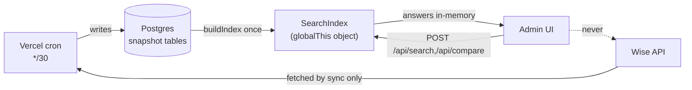
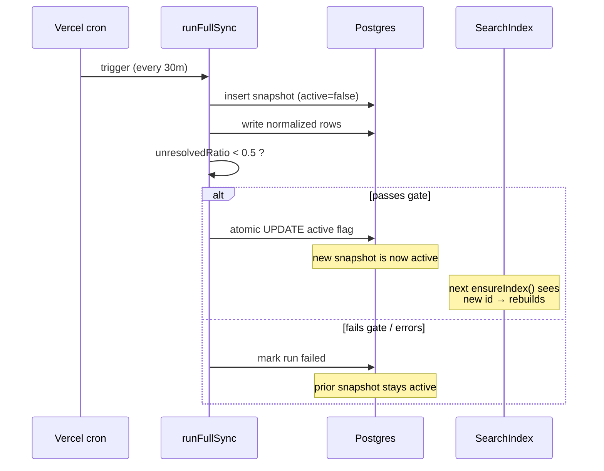

# Not the Next.js You Know

> First-read gotchas. If you've written Next.js apps before, the architecture here will violate a few assumptions you didn't know you had. Read this before touching `src/lib/search/` or `src/lib/sync/`.

The repo's `AGENTS.md` opens with a blunt warning:

> **This is NOT the Next.js you know.** This version has breaking changes — APIs, conventions, and file structure may all differ from your training data.

That warning is real, and it's broader than the framework. This page elevates it into the five surprises that actually bite, each verified against code.

---

## TL;DR — the five surprises

| # | Surprise | Why it bites |
|---|----------|--------------|
| 1 | **Reads never call Wise.** Search/compare answer from an in-memory object. | If the index is empty or stale, you get a 500 or old data — not a live fetch. |
| 2 | **Reads are pinned to one snapshot.** Every query reads `WHERE snapshot_id = <active>`. | Mixed-snapshot reads are impossible by construction. Promotion is the only way data changes. |
| 3 | **Sync must run before serve.** No active snapshot → reads throw. | A fresh DB serves nothing until the first successful sync promotes a snapshot. |
| 4 | **Fail-closed is the default, not a feature.** Unknown/unresolved → blocked or "Needs Review". | A tutor is never "Available" unless the data *proves* it. Silence means blocked. |
| 5 | **Next.js 16 cache + runtime conventions.** `cacheComponents`, `"use cache"`, `revalidateTag(tag, { expire })`, `globalThis` singletons, `maxDuration = 800`. | Patterns from Next 13/14 muscle memory are wrong or incomplete here. |

---

## 1. Reads never hit Wise live

The mental model you probably have — "API route → query the data source → return" — is wrong here. Every search and compare request answers from a **module-level object held in server memory**. The Wise API is touched *only* by the sync job.

The index is anchored on `globalThis`, not a plain module variable, so it survives Hot Module Replacement in dev (`src/lib/search/index.ts:94-97`):

```ts
declare global {
  var __bgscheduler_searchIndex: SearchIndex | null;
  var __bgscheduler_searchIndexBuildPromise: Promise<SearchIndex> | null;
}
```

`SearchIndex` is a fully denormalized aggregate — every tutor group with its qualifications, availability windows, leaves, session blocks, and data issues already joined in memory, plus a `byWeekday` map for O(1) day lookup (`src/lib/search/index.ts:65-90`). It's built once and queried many times.

**Proof that reads are pure in-memory:**

- `executeSearch(index, request)` takes the index as an argument and iterates `index.byWeekday` / `group.sessionBlocks` / `group.leaves` — no DB, no HTTP (`src/lib/search/engine.ts:22-150`).
- The search engine module imports nothing from `@/lib/wise/*` and nothing from `@/lib/db` — only the index types and timezone/ops helpers (`src/lib/search/engine.ts:1-17`).
- The `/api/compare` route's only data source is `await ensureIndex(db)` (`src/app/api/compare/route.ts:138`); conflict and free-slot detection run against the returned `index.tutorGroups` (`src/app/api/compare/route.ts:200-227`).
- The **only** files that import the Wise client/fetchers are the sync orchestrator and its helpers (`src/lib/sync/orchestrator.ts:4-11`).

So the entire `@/lib/wise/*` surface — client, fetchers, retry/backoff — exists to feed the sync pipeline, never to serve a user request.



> **Gotcha:** debugging "why is this tutor showing the wrong schedule?" — do **not** look at a live Wise call. There isn't one. Look at the last promoted snapshot's rows and the in-memory index built from them.

### Who else reads the index

`ensureIndex(db)` is the single read entry point and it has many callers besides search/compare — range search, discovery, proposals, room capacity, the LINE operational flow, and the AI scheduler service all read from the same singleton (verified callers: `src/app/api/search/route.ts:54`, `src/app/api/compare/route.ts:138`, `src/app/api/compare/discover/route.ts:57`, `src/app/api/proposals/route.ts:64`, `src/lib/search/range-search.ts:115`, `src/lib/room-capacity/data.ts:409`, `src/lib/line/operational.ts:527`, `src/lib/ai/scheduler-service.ts:60`). One object, many readers. None of them call Wise.

---

## 2. Reads are pinned to one snapshot

All tutor data is versioned under a `snapshot_id`, and exactly one snapshot is `active = true` at a time. `buildIndex` finds that active snapshot and loads **only its rows** — every parallel query is filtered `WHERE snapshotId = <active>` (`src/lib/search/index.ts:142-222`):

```ts
const [activeSnapshot] = await db
  .select().from(schema.snapshots)
  .where(eq(schema.snapshots.active, true)).limit(1);
// ...all subsequent loads: .where(eq(<table>.snapshotId, snapshotId))
```

This is why a query can never see a half-written or mixed-version dataset: the candidate snapshot a sync is *writing* has `active = false`, so the index never loads it until promotion flips the flag.

### Staleness = the snapshot id (or profile version) changed

`ensureIndex` doesn't poll Wise or time out the cache. On each call it compares the cached index's `snapshotId` and `profileVersion` against the DB's current active snapshot. If both match, it returns the cached object untouched (`src/lib/search/index.ts:366-389`):

```ts
if (activeSnapshot
    && activeSnapshot.id === cached.snapshotId
    && profileVersion === cached.profileVersion) {
  return cached;            // serve from memory, no rebuild
}
```

So the index is invalidated by a **promotion** (new active snapshot id) or a **tutor-business-profile edit** (profile version string changes — see `getTutorProfileVersion`, `src/lib/search/index.ts:128-137`). Profile edits force an explicit `clearSearchIndex()` (`src/app/api/tutor-profiles/[canonicalKey]/route.ts:51`, `src/app/api/tutor-profiles/import-commit/route.ts:61`).

> **Concurrency note:** first-time concurrent callers don't both rebuild. `ensureIndex` stores the in-flight build promise on `globalThis` synchronously, before any `await`, so a second caller arriving mid-build returns the same promise (the singleton-promise pattern, `src/lib/search/index.ts:354-401`).

### "Stale" in API responses is a *different*, softer notion

Don't confuse index-invalidation with the `stale` flag in responses. That flag is purely an **age check** against the last sync's wall-clock time — it never triggers a rebuild, it just adds a warning string (`src/app/api/compare/route.ts:142-149`, `src/lib/search/engine.ts:30-38`):

```ts
stale: Date.now() - index.syncedAt.getTime() > API_STALE_THRESHOLD_MS
```

`API_STALE_THRESHOLD_MS` is **90 minutes** (`src/lib/ops/stale.ts:2`) — three missed 30-minute crons of headroom. A separate banner threshold of **2 hours** lives at `src/lib/ops/stale.ts:3`. Stale data is still served; the user just sees a warning.

---

## 3. Sync-before-serve: no snapshot, no answers

A fresh database serves **nothing**. `buildIndex` throws if no snapshot is active (`src/lib/search/index.ts:150-152`):

```ts
if (!activeSnapshot) {
  throw new Error("No active snapshot found");
}
```

There is no eager build on boot and no lazy "fetch from Wise if empty" fallback. `buildIndex` is reached *only* through `ensureIndex` (no other caller exists in `src/`). So until a sync has promoted a first snapshot, every read route 500s. The system genuinely is **sync-first**.

### How a snapshot becomes servable

The sync orchestrator runs the full ETL — fetch teachers → resolve identities → fetch availability/leaves/sessions → normalize → write to the candidate snapshot (`active = false`) → validate → **promote** (`src/lib/sync/orchestrator.ts:50-560`). Two safety gates stand between "written" and "servable":

**Completeness gate.** If more than 50% of identity groups are unresolved, the snapshot is *not* promoted and the previous active snapshot keeps serving (`src/lib/sync/orchestrator.ts:473-476`):

```ts
const unresolvedRatio = identityIssues.length / Math.max(groups.length, 1);
const shouldPromote = unresolvedRatio < 0.5;   // >50% unresolved = don't promote
```

**Atomic promotion.** Promotion is a *single* `UPDATE` that clears the old active row and sets the new one in one statement, so a concurrent reader sees either the old or the new active snapshot — never zero (`src/lib/sync/orchestrator.ts:488-498`):

```ts
await db.update(schema.snapshots)
  .set({ active: sql`(${schema.snapshots.id} = ${snapshotId})` })
  .where(or(
    eq(schema.snapshots.active, true),
    eq(schema.snapshots.id, snapshotId),
  ));
```

A failed sync never reaches this line — it lands in the `catch`, marks the run `failed`, and leaves the prior snapshot active (`src/lib/sync/orchestrator.ts:561-599`).



### Single-flight: syncs don't stack

Crons fire every 30 minutes (`vercel.json`), but a slow sync won't overlap with the next trigger. `runWiseSyncRequest` acquires a guard: it first fails any `running` row older than 20 minutes (abandoned/timed-out), then refuses to start if another sync is genuinely running, returning HTTP 202 instead (`src/lib/sync/run-wise-sync.ts:88-167`, stale cutoff at `:10`). On success it nudges the Next cache: `revalidateTag("snapshot", { expire: 0 })` (`src/lib/sync/run-wise-sync.ts:160-162`) — see surprise 5 for what that tag actually feeds.

---

## 4. Fail-closed is the default posture

The non-negotiable product rule (`AGENTS.md`): *never return a tutor as available unless the system can prove availability from normalized Wise data.* This is enforced in two places, and both default to "block" on uncertainty.

**Unknown session status → blocking.** Only an explicit allowlist of statuses is non-blocking; everything else — including a missing status — blocks (`src/lib/normalization/sessions.ts:33-51`):

```ts
const NON_BLOCKING_STATUSES = new Set([
  "CANCELLED", "CANCELED", "COMPLETED", "MISSED", "NO_SHOW",
]);

export function isBlockingStatus(status: string | undefined): boolean {
  if (!status) return true;                 // fail-closed
  if (NON_BLOCKING_STATUSES.has(status.toUpperCase())) return false;
  return true;                              // unknown → still blocks
}
```

So a brand-new Wise status value the parser has never seen will block availability rather than leak a false "free" slot. Cancelled sessions, correctly, do **not** block.

**Unresolved identity/modality/qualification → "Needs Review", never "Available".** In the search engine, any tutor group carrying data issues, or with no resolved modality, is routed to the `needsReview` bucket instead of `available` (`src/lib/search/engine.ts:83-97, 142-146`):

```ts
if (group.dataIssues.length > 0) {
  reviewReasons.push(...group.dataIssues.map((i) => `${i.type}: ${i.message}`));
}
if (group.supportedModes.length === 0) {
  reviewReasons.push("Unresolved modality");
}
// ...later:
if (reviewReasons.length > 0) needsReview.push({ ...result, reasons: reviewReasons });
else available.push(result);
```

`supportedModes` is empty precisely when the group's modality resolved to `"unresolved"` (`src/lib/search/index.ts:265-270`), which is the orchestrator's safe default until modality is derived (`src/lib/sync/orchestrator.ts:118`).

> **Gotcha:** if you "fix" a tutor not appearing as available by loosening one of these checks, you are weakening a documented non-negotiable rule. `AGENTS.md` → Change Control forbids it without explicit approval.

---

## 5. Next.js 16 specifics

`AGENTS.md` tells you to read `node_modules/next/dist/docs/` before writing code. Here's what's actually in play (Next.js **16.2.2**, confirmed via `node_modules/next/package.json`). Skim any one of these and you'll write Next-13-era code that's subtly wrong.

### `cacheComponents` is on

`next.config.ts` enables it project-wide:

```ts
const nextConfig: NextConfig = { cacheComponents: true };
```

This turns on the `"use cache"` directive family. The codebase uses it for the *cacheable data-fetch layer* — not for the in-memory index. Examples: `src/lib/credit-control/service.ts:28-30` and `src/lib/sales-dashboard/data.ts:886-888` mark functions `"use cache"` then call `cacheTag(...)` + `cacheLife({ stale, revalidate, expire })`.

### The `"snapshot"` cache tag ≠ the SearchIndex

This is the easiest thing to get wrong. The `revalidateTag("snapshot", { expire: 0 })` call after a successful sync (`src/lib/sync/run-wise-sync.ts:161`) does **not** invalidate the in-memory `SearchIndex` — that object is plain `globalThis` state, invalidated lazily by the snapshot-id comparison in surprise 2. The `"snapshot"` tag instead feeds the `"use cache"` data layer behind `/api/filters` and `/api/tutors` (`src/lib/data/filters.ts:54`, `src/lib/data/tutors.ts:82`). Two independent caching mechanisms, same trigger.

Also note the **Next 16 signature**: `revalidateTag(tag, { expire: 0 })` and `revalidateTag(tag, "max")` take a second profile/options argument that older Next versions don't have (used at `src/lib/sales-dashboard/data.ts:91`). Tests assert the exact shape `revalidateTag("snapshot", { expire: 0 })` (`src/app/api/internal/sync-wise/__tests__/route.test.ts:183`).

### `globalThis`-anchored singletons (not module-scope)

Both the DB client and the search index are stored on `globalThis`, deliberately, so they survive HMR in dev (`src/lib/db/index.ts:16-27`, `src/lib/search/index.ts:94-113`). If you add another expensive singleton, follow this pattern — a bare `let _x` module variable gets wiped on every hot reload.

### Route-handler runtime knobs

- **`maxDuration = 800`** on the sync route — Pro-plan headroom for a full Wise sync (`src/app/api/internal/sync-wise/route.ts:6`). The cron hits `GET`; manual triggers use `POST` with either a session or the `CRON_SECRET` bearer (constant-time compared, `:10-28`).
- **Auth gate is edge middleware**, not per-route boilerplate. `src/middleware.ts` runs `edgeAuth` on every non-static request, redirects unauthenticated users to `/login`, and exempts an explicit public-route allowlist — note `/api/internal/*` is public to middleware because those routes do their own `CRON_SECRET`/session check (`src/middleware.ts:4-36`).

### Other locked conventions

- **Neon HTTP driver**, not a pooled TCP client: `drizzle(drizzle-orm/neon-http)` over `neon(DATABASE_URL)` (`src/lib/db/index.ts:1-12`). Each query is a stateless HTTPS round-trip — relevant when you reason about transactions.
- **All time is `Asia/Bangkok`.** `TIMEZONE = "Asia/Bangkok"` is the single constant the normalization and "now" math key off (`src/lib/normalization/timezone.ts:3`; compare's "current Monday" uses `toZonedTime(..., TIMEZONE)`, `src/app/api/compare/route.ts:33-41`). Do not introduce a second clock.

---

## Where to go next

- In-memory index internals → `src/lib/search/index.ts`
- Read-path query logic → `src/lib/search/engine.ts`, `src/lib/search/compare.ts`
- ETL + promotion → `src/lib/sync/orchestrator.ts`, single-flight guard → `src/lib/sync/run-wise-sync.ts`
- Cron schedule + function limits → `vercel.json`, `src/app/api/internal/sync-wise/route.ts`

_Verified against HEAD + uncommitted WIP on 2026-05-31._
