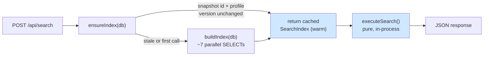
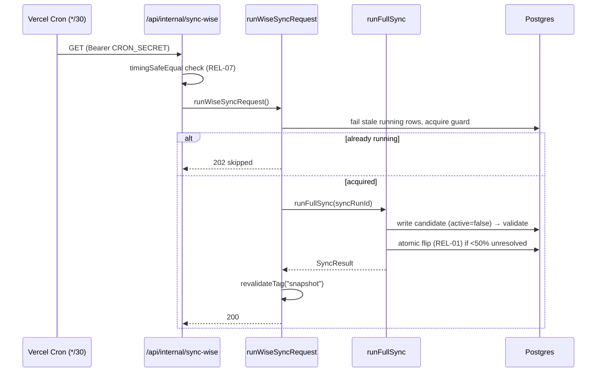

# Not the Next.js You Know

> First-read gotchas. The single sentence at the top of [`AGENTS.md`](../../AGENTS.md) — _"This is NOT the Next.js you know"_ — is load-bearing. This page elevates it into the five surprises that bite hardest, each verified against code. Read it before you touch a route, a page, or the sync pipeline.

If you remember one thing: **the request path never talks to Wise.** Reads serve a process-global, in-memory index that was built from a Postgres snapshot that a background cron wrote. Get that mental model and most of the codebase stops surprising you.

---

## 1. Reads never hit Wise live — they hit an in-memory singleton

There is no `fetch("api.wiseapp.live")` on the request path. A search reads a `globalThis`-anchored `SearchIndex` object that already lives in the serverless function's memory.

The singleton is two globals, declared and accessed only through helpers — **never** a module-level `let _index` (that wouldn't survive HMR in dev, and the convention is explicit about anchoring on `globalThis`):

```ts
// src/lib/search/index.ts:94-97
declare global {
  var __bgscheduler_searchIndex: SearchIndex | null;
  var __bgscheduler_searchIndexBuildPromise: Promise<SearchIndex> | null;
}
```

The search route is the proof. Its entire data path is `ensureIndex(db)` → `executeSearch(index, …)`. No Wise client is imported; `executeSearch` is a **pure, synchronous** function over the in-memory index ([`src/lib/search/engine.ts:22`](../../src/lib/search/engine.ts) — note the signature returns `SearchResponse`, not a `Promise`):

```ts
// src/app/api/search/route.ts:51-56
const db = getDb();
try {
  const index = await ensureIndex(db);
  const result = executeSearch(index, parsed.data);
  return NextResponse.json(result);
}
```

`ensureIndex` ([`src/lib/search/index.ts:354`](../../src/lib/search/index.ts)) returns the cached index immediately on the warm path and only rebuilds from Postgres when the snapshot id or the tutor-profile version changed ([`index.ts:377-383`](../../src/lib/search/index.ts)). The rebuild is itself coalesced: the in-flight build promise is assigned to the global **synchronously, before any `await`** ([`index.ts:396-400`](../../src/lib/search/index.ts)), so a thundering herd of concurrent first-time callers shares one rebuild instead of each kicking off their own (REL-02).



**Why it exists:** Wise is slow and rate-limited, so it is never on the read path. **What bites you:** if you "just add a Wise call" inside a route to get fresher data, you've broken the whole performance model and the rate-limit budget. New data comes from the sync, full stop — see §3.

The DB connection is the same shape of global ([`src/lib/db/index.ts:16-27`](../../src/lib/db/index.ts), `__bgscheduler_db`), using the Neon **HTTP** driver — which means **no transactions** on this connection. Anything that needs a real transaction (payroll) reaches for `pg`/`node-postgres` separately; do not assume `getDb()` can `BEGIN`.

---

## 2. Reads are snapshot-versioned — exactly one snapshot is `active`

Every tutor read is scoped to one immutable `snapshot_id`. `buildIndex` starts by finding the single active snapshot and throws if there is none ([`src/lib/search/index.ts:144-152`](../../src/lib/search/index.ts)); every subsequent SELECT filters on that `snapshotId` ([`index.ts:169-222`](../../src/lib/search/index.ts)). The server-side data helpers do the same through `getActiveSnapshotIdOrThrow` ([`src/lib/data/active-snapshot.ts:5`](../../src/lib/data/active-snapshot.ts)), used by `loadTutorList`/`loadFilterOptions`.

A new sync does **not** mutate the live snapshot. It writes an entirely new candidate snapshot (`active: false`, [`src/lib/sync/orchestrator.ts:71-75`](../../src/lib/sync/orchestrator.ts)) and only at the very end flips the flag — in **one atomic UPDATE** that sets `active` true for the candidate and false for the prior active row in the same statement:

```ts
// src/lib/sync/orchestrator.ts:488-498
await db
  .update(schema.snapshots)
  .set({ active: sql`(${schema.snapshots.id} = ${snapshotId})` })
  .where(or(
    eq(schema.snapshots.active, true),
    eq(schema.snapshots.id, snapshotId),
  ));
```

Postgres MVCC guarantees a concurrent reader sees either the old active row or the new one — **never a window with zero active snapshots** (REL-01, [`orchestrator.ts:481-487`](../../src/lib/sync/orchestrator.ts)). A failed sync simply never reaches this line, so the previous snapshot stays active untouched.

**The one exception:** `past_session_blocks` is the *only* cross-snapshot data table — keyed by `group_canonical_key`, not `snapshot_id`. That is why `IndexedTutorGroup` denormalizes `canonicalKey` onto the in-memory group (D-04, [`src/lib/search/index.ts:67-71`](../../src/lib/search/index.ts)): the compare route can fetch a tutor's past sessions across snapshots without an extra DB round-trip.

**What bites you:** never write tutor data without a `snapshot_id`, and never "update the active snapshot in place." The model is immutable-write-then-flip. If you need a column to survive snapshot rotation, it belongs in a cross-snapshot table, not a snapshot-scoped one.

---

## 3. Sync-before-serve — a background cron is the only writer

Fresh Wise data arrives exactly one way: the orchestrator runs, writes a candidate snapshot, validates, promotes. Reads then pick it up.

The pipeline is one `runFullSync()` in a single try/catch ([`src/lib/sync/orchestrator.ts:50`](../../src/lib/sync/orchestrator.ts)): create sync-run row → create candidate snapshot → fetch teachers → resolve identities → per-teacher availability/leaves/tags → fetch future sessions → derive modality → capture dropped sessions into `past_session_blocks` (PAST-01, must run **before** promotion while the prior snapshot is still active, [`orchestrator.ts:400-407`](../../src/lib/sync/orchestrator.ts)) → bulk insert → stats → promote.

Two safety gates worth knowing cold:

- **Promotion is gated on identity health.** If more than 50% of identity groups are unresolved, the candidate is **not** promoted ([`orchestrator.ts:473-476`](../../src/lib/sync/orchestrator.ts): `shouldPromote = unresolvedRatio < 0.5`). A catastrophically-broken sync leaves the old snapshot live rather than serving garbage.
- **Errors are fail-isolated.** A single teacher's availability fetch failing pushes a `completeness` data_issue and `continue`s ([`orchestrator.ts:249-259`](../../src/lib/sync/orchestrator.ts)) — it does not abort the run. Only a top-level throw flips the sync-run to `failed` ([`orchestrator.ts:561-572`](../../src/lib/sync/orchestrator.ts)), and that path never promotes.

The cron route and the wrapper add the operational discipline the orchestrator does not:

- **Auth is constant-time.** `/api/internal/sync-wise` compares `CRON_SECRET` with `timingSafeEqual` plus a length pre-check (REL-07, [`src/app/api/internal/sync-wise/route.ts:11-29`](../../src/app/api/internal/sync-wise/route.ts)) — never `===`. The route also carries `maxDuration = 800` for Pro-plan headroom ([`route.ts:7`](../../src/app/api/internal/sync-wise/route.ts)). Schedule is `*/30 * * * *` ([`vercel.json`](../../vercel.json)).
- **Single-flight guard.** `runWiseSyncRequest` first fails any `running` row older than 20 minutes ([`src/lib/sync/run-wise-sync.ts:51-72`](../../src/lib/sync/run-wise-sync.ts)), then refuses to start a second concurrent run — returning **HTTP 202** with `skipped: true` instead of racing ([`run-wise-sync.ts:142-150`](../../src/lib/sync/run-wise-sync.ts)).
- **Index invalidation is a tag sweep, not a manual rebuild.** On success the wrapper calls `revalidateTag("snapshot", { expire: 0 })` ([`run-wise-sync.ts:160-162`](../../src/lib/sync/run-wise-sync.ts)). The `"use cache"` server helpers (`getTutorList`, `getFilterOptions`) are tagged `"snapshot"` ([`src/lib/data/tutors.ts:80-86`](../../src/lib/data/tutors.ts), [`src/lib/data/filters.ts:52-58`](../../src/lib/data/filters.ts)), so they refresh automatically. The in-memory `SearchIndex` is **not** invalidated by the tag — it re-detects staleness on the next `ensureIndex` call via the snapshot-id check (§1).



> **Deliberate non-sweep:** the compare view's past-session cache is tagged `"past-sessions"` with `cacheLife("days")` ([`src/lib/data/past-sessions.ts:87-89`](../../src/lib/data/past-sessions.ts)) — a **different** tag, intentionally *not* cleared by the snapshot sweep. Past data doesn't change when a new snapshot lands, so re-fetching it would be wasted work.

---

## 4. Fail-closed: unresolved → "Needs Review", never "Available"

This is a product rule with teeth, enforced in the read engine. The system never returns a tutor as `available` unless it can prove availability from normalized data. The proof obligations live in `searchSlot` ([`src/lib/search/engine.ts:60`](../../src/lib/search/engine.ts)):

- **Any data issue → review.** A group with one or more `dataIssues` collects review reasons ([`engine.ts:85-88`](../../src/lib/search/engine.ts)).
- **Unresolved modality → review.** A group whose `supportedModes` is empty (the in-memory mapping of `supportedModality === "unresolved"` → `[]`, [`src/lib/search/index.ts:265-270`](../../src/lib/search/index.ts)) is flagged `"Unresolved modality"` ([`engine.ts:90-92`](../../src/lib/search/engine.ts)).
- **The split is the last step.** Only a candidate that cleared availability windows, blocking sessions, and leaves is bucketed — and even then, if it accumulated any review reason it goes to `needsReview`, otherwise `available` ([`engine.ts:142-146`](../../src/lib/search/engine.ts)).

```ts
// src/lib/search/engine.ts:142-146
if (reviewReasons.length > 0) {
  needsReview.push({ ...result, reasons: reviewReasons });
} else {
  available.push(result);
}
```

Fail-closed also governs the inputs. Sessions with an **unknown** Wise status normalize to *blocking* (only `CANCELLED`/`CANCELED` are non-blocking); modality contradictions emit `unknown` + low confidence rather than guessing; the orchestrator seeds modality as `"unresolved"` and only resolves it from evidence ([`orchestrator.ts:118-119`, `192`](../../src/lib/sync/orchestrator.ts)). The upstream rules are documented in the fail-closed convention in [`CLAUDE.md`](../../CLAUDE.md) and detailed in [`docs/features/tutor-search.md`](../features/tutor-search.md).

**What bites you:** if you add a new normalization step or a new filter, the safe default is *block / Needs Review*, not *Available*. Do not "optimistically" surface a tutor to clear a review queue. This is a change-control item — see the Non-Negotiable Product Rules in `AGENTS.md`.

---

## 5. Next.js 16 specifics — the file structure and APIs differ from training data

The warning is not rhetorical. This repo runs Next.js `16.2.2` ([`package.json`](../../package.json)) with App Router and Cache Components. Concrete differences you will trip over if you write from memory:

**`cacheComponents: true` is the only custom config** ([`next.config.ts:3-5`](../../next.config.ts)). This is the v16 successor to the old `experimental.dynamicIO` flag — same engine, renamed ([version-16 upgrade guide](../../node_modules/next/dist/docs/01-app/02-guides/upgrading/version-16.md), "experimental.dynamicIO"). It is also how PPR is opted into now; the route-level `experimental_ppr` segment config was removed in 16.

**`"use cache"` + `cacheTag`/`cacheLife` are the caching primitives** — and they are **stable**, with no `unstable_` prefix. Import them plainly from `next/cache`:

```ts
// src/lib/data/tutors.ts:80-85
export async function getTutorList(): Promise<TutorListItem[]> {
  "use cache";
  cacheTag("snapshot");
  cacheLife("hours");
  return loadTutorList(getDb());
}
```

The v16 upgrade guide is explicit that `cacheLife`/`cacheTag` dropped the `unstable_` prefix ([version-16 guide, "cacheLife and cacheTag"](../../node_modules/next/dist/docs/01-app/02-guides/upgrading/version-16.md)). If your muscle memory reaches for `unstable_cacheTag`, that's the old API.

**Server Components must opt into runtime with `await connection()`** before behaving dynamically. The search page does exactly this before its cached fetches ([`src/app/(app)/search/page.tsx:8-12`](../../src/app/(app)/search/page.tsx)):

```ts
export default async function SearchPage() {
  await connection();
  const filterOptions = await getFilterOptions();
  const tutorList = await getTutorList();
  // …wrapped in <Suspense fallback={<SearchSkeleton/>}>
}
```

Under `cacheComponents`, `connection()` (from `next/server`) marks the boundary where runtime/request-time work is allowed — the guide recommends it before reading `process.env` at runtime ([version-16 guide, "Runtime Configuration"](../../node_modules/next/dist/docs/01-app/02-guides/upgrading/version-16.md)). The page pattern across the app is: async Server Component fetches via `"use cache"` data helpers, then hands props to a `"use client"` shell inside `<Suspense>`. Clients hydrate from those props and call API routes for anything interactive — they never read the index directly.

**Other v16 footguns the upgrade guide flags** (verify in [the bundled docs](../../node_modules/next/dist/docs/01-app/02-guides/upgrading/version-16.md), not from memory):

- **Async request APIs are mandatory.** `cookies()`, `headers()`, `draftMode()`, and `params`/`searchParams` are Promise-only — synchronous access was fully removed in 16.
- **`middleware` → `proxy`.** The `middleware` filename/convention is deprecated in favor of `proxy` (Node runtime; the edge runtime is not supported there). This repo still ships `src/middleware.ts` for the edge auth gate — if you migrate it, that's a deliberate decision, not a free rename.
- **Turbopack is the default** for `dev` and `build`; a stray `webpack` config now **fails** the build.
- **`next lint` is removed.** Use ESLint directly; `next build` no longer lints.

**The actual rule from `AGENTS.md`:** read `node_modules/next/dist/docs/` before writing Next code. The docs are vendored into the repo precisely so you check the installed version's behavior instead of guessing. The upgrade guide lives at [`node_modules/next/dist/docs/01-app/02-guides/upgrading/version-16.md`](../../node_modules/next/dist/docs/01-app/02-guides/upgrading/version-16.md).

---

## TL;DR cheat sheet

| Surprise | The reflex it overrides | Where it's enforced |
|---|---|---|
| Reads serve an in-memory singleton | "add a Wise call for fresh data" | `src/lib/search/index.ts`, `src/app/api/search/route.ts` |
| Exactly one `active` snapshot, immutable | "update the active snapshot in place" | `src/lib/sync/orchestrator.ts:488` |
| A cron is the only writer | "write tutor data from a route" | `src/lib/sync/run-wise-sync.ts`, `vercel.json` |
| Unresolved → Needs Review | "optimistically mark Available" | `src/lib/search/engine.ts:142` |
| Next 16 ≠ your training data | `unstable_*`, sync `cookies()`, `webpack` | `next.config.ts`, `node_modules/next/dist/docs/` |

_Verified against HEAD `d4fe6d3` on 2026-06-05._
