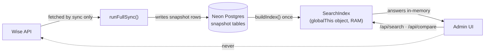
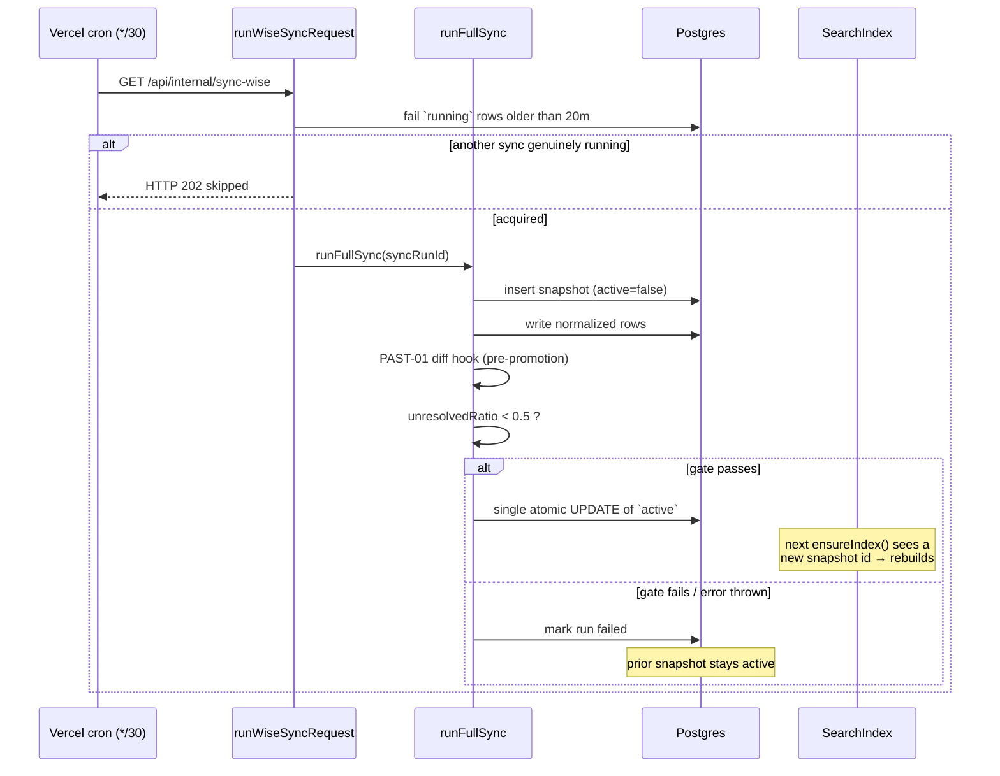

# Not the Next.js You Know

> First-read gotchas. If you've shipped Next.js apps before, this codebase violates assumptions you
> didn't know you had. Read this before touching `src/lib/search/` or `src/lib/sync/`.

`AGENTS.md` opens with a blunt warning:

> **This is NOT the Next.js you know.** This version has breaking changes — APIs, conventions, and
> file structure may all differ from your training data. Read the relevant guide in
> `node_modules/next/dist/docs/` before writing any code. Heed deprecation notices.

That warning is literal — the bundled docs tree really ships (`node_modules/next/dist/docs/` contains
`01-app`, `02-pages`, `03-architecture`, `04-community`, `index.md`), and Next is **16.2.2**
(`package.json:48`). But the warning is also *narrower than the real problem*: most of what will trip
you up here is architectural, not framework. Below are the five surprises that actually bite, each
verified against code.

---

## TL;DR

| # | Surprise | Why it bites |
|---|----------|--------------|
| 1 | **Tutor search/compare reads never call Wise.** They answer from an in-memory object. | Debugging "wrong schedule" by hunting for a live API call finds nothing. There isn't one. |
| 2 | **Reads are pinned to one snapshot.** Every load is `WHERE snapshot_id = <active>`. | Mixed-version reads are impossible by construction. Promotion is the only way data changes. |
| 3 | **Sync must run before serve.** No active snapshot → `buildIndex` throws. | A fresh DB serves 500s until the first sync promotes a snapshot. |
| 4 | **Fail-closed is the default posture, not a feature flag.** Unknown → blocked / "Needs Review". | A tutor is never "Available" unless the data *proves* it. Loosening a check breaks a Change-Control rule. |
| 5 | **Next.js 16 conventions.** `cacheComponents`, `"use cache"`, `revalidateTag(tag, opts)`, `connection()`, async `params`, `middleware` deprecated. | Next 13/14/15 muscle memory produces code that is quietly wrong here. |

---

## 1. The tutor read path never hits Wise live

The mental model you probably have — *API route → query the data source → return* — is wrong for
search and compare. Both answer from a **denormalized aggregate held in server memory**. The Wise API
is touched only by sync pipelines.

The index is anchored on `globalThis`, not a module-scope `let`, so it survives Hot Module
Replacement in dev (`src/lib/search/index.ts:94-97`):

```ts
declare global {
  var __bgscheduler_searchIndex: SearchIndex | null;
  var __bgscheduler_searchIndexBuildPromise: Promise<SearchIndex> | null;
}
```

`SearchIndex` carries every tutor group with its qualifications, availability windows, leaves,
session blocks, data issues, and business profile already joined — plus a `byWeekday` map for O(1)
day lookup (`src/lib/search/index.ts:65-90`, built at `:322-331`). Built once, queried many times.

**Proof the hot path is pure in-memory:**

- `executeSearch(index, request)` takes the index as an argument and iterates `index.byWeekday` /
  `group.sessionBlocks` / `group.leaves` — no DB, no HTTP (`src/lib/search/engine.ts:22-58`,
  `:60-150`).
- No file under `src/lib/search/**` or `src/lib/data/**` imports `@/lib/wise/*` at all.
  `src/lib/search/compare.ts` imports exactly three things: `date-fns-tz`, index types, compare types
  (`src/lib/search/compare.ts:1-3`).
- `/api/search`'s entire data acquisition is `await ensureIndex(db)` before calling the engine
  (`src/app/api/search/route.ts:51-56`). `/api/compare` is the same shape
  (`src/app/api/compare/route.ts:138`).
- Even the normalization layer imports **only Wise *types***, never the client —
  `src/lib/normalization/sessions.ts:1-8`, `src/lib/normalization/availability.ts:1`. A grep for
  `wise/client|wise/fetchers` across `src/lib/normalization/` returns nothing.


```mermaid
flowchart LR
  Wise["Wise API"] -->|"fetched by sync only"| Orch["runFullSync()"]
  Orch -->|writes snapshot rows| PG[("Neon Postgres<br/>snapshot tables")]
  PG -->|"buildIndex() once"| IDX["SearchIndex<br/>(globalThis object, RAM)"]
  UI["Admin UI"] -->|"/api/search · /api/compare"| IDX
  IDX -->|"answers in-memory"| UI
  UI -. never .-> Wise
```

### One index, many readers

`ensureIndex(db)` is the single read entry point, and search/compare are not its only callers — range
search, compare discovery, proposals, room capacity, the LINE operational planner, and the AI
scheduler all read the same singleton:

| Caller | Line |
|---|---|
| `src/app/api/search/route.ts` | `:54` |
| `src/app/api/compare/route.ts` | `:138` |
| `src/app/api/compare/discover/route.ts` | `:57` |
| `src/app/api/proposals/route.ts` | `:64` |
| `src/lib/search/range-search.ts` | `:115` |
| `src/lib/room-capacity/data.ts` | `:409` |
| `src/lib/line/operational.ts` | `:527` |
| `src/lib/ai/scheduler-service.ts` | `:60` |

None of them call Wise. One of them degrades instead of throwing: the LINE planner wraps the call in
`.catch(() => null)` and returns no suggestions if the index is unavailable
(`src/lib/line/operational.ts:527`).

### The scope caveat you must not over-generalize

"Reads never hit Wise" is a property of the **tutor search/compare path**, not of the app. Other
subsystems own their own Wise-calling lineages, and at least one calls Wise inside an
admin-triggered request: classroom assignment fetches live future sessions during a run
(`src/lib/classrooms/data.ts:889`, `:993`; client built from env at `:1151-1158`; reached from
`POST /api/class-assignments/run` → `runClassroomAssignment`,
`src/app/api/class-assignments/run/route.ts:39`). Payroll, credit control, Wise activity, progress
tests, post-class feedback, room utilization, and student promotions likewise construct a Wise client
directly. **Check the subsystem before assuming its reads are offline.**

> **Gotcha:** debugging "why does this tutor show the wrong schedule?" — do not hunt for a live Wise
> call in the search path. Look at the last promoted snapshot's rows and the index built from them.

---

## 2. Reads are pinned to exactly one snapshot

All tutor data is versioned by `snapshot_id`, and exactly one snapshot has `active = true`.
`buildIndex` finds that snapshot and loads **only its rows** — every parallel query is filtered
`WHERE snapshotId = <active>` (`src/lib/search/index.ts:142-222`):

```ts
const [activeSnapshot] = await db
  .select().from(schema.snapshots)
  .where(eq(schema.snapshots.active, true)).limit(1);
// ...every subsequent load: .where(eq(<table>.snapshotId, snapshotId))
```

That is why a query can never observe a half-written dataset: the snapshot a sync is *writing* is
inserted with `active: false` (`src/lib/sync/orchestrator.ts:71-75`), so the index cannot load it
until promotion flips the flag.

**Corollary that surprises people: tutor group ids are snapshot-scoped, not stable.** A `tutorGroupId`
a client held five minutes ago may not exist in the new active snapshot. `/api/compare` handles this
by falling back to `canonical_key` — it looks the stale id up in `tutor_identity_groups`, maps to the
canonical key, and re-resolves against the active snapshot, warning
`"Tutor selection was refreshed after the latest Wise sync"`
(`src/app/api/compare/route.ts:60-108`, warning emitted at `:157-159`). `canonicalKey` is denormalized
onto the in-memory group (D-04) exactly so this needs no extra DB round-trip
(`src/lib/search/index.ts:67-71`, `:260-263`).

### "Stale index" means the snapshot id (or profile version) changed

`ensureIndex` does not poll and does not time out. Each call compares the cached index's `snapshotId`
**and** `profileVersion` against the DB. Both match → the cached object is returned untouched
(`src/lib/search/index.ts:377-383`):

```ts
if (activeSnapshot
    && activeSnapshot.id === cached.snapshotId
    && profileVersion === cached.profileVersion) {
  return cached;            // serve from memory, no rebuild
}
```

So the index is invalidated by a **promotion** (new active snapshot id) or a **tutor-business-profile
edit** — `profileVersion` is a `count:maxUpdatedAt` string over `tutor_business_profiles`
(`src/lib/search/index.ts:128-137`). Profile mutations additionally force an eager
`clearSearchIndex()` (`src/app/api/tutor-profiles/[canonicalKey]/route.ts:51`,
`src/app/api/tutor-profiles/import-commit/route.ts:61`; the clear itself at
`src/lib/search/index.ts:123-126`) — but that only clears *the serverless instance that handled the
mutation*. Every other instance self-heals on its next `ensureIndex` via the `profileVersion` compare.
That two-tier design is deliberate; don't "fix" it by adding cross-instance signalling.

If the DB reports *no* active snapshot but a cached index exists, `ensureIndex` keeps serving the
cache rather than throwing (`src/lib/search/index.ts:384-386`).

> **Concurrency:** concurrent first-time callers do not both rebuild. `ensureIndex` assigns the
> in-flight build promise to `globalThis` **synchronously, before any `await`**, so a second caller
> arriving mid-build returns the same promise — the singleton-promise pattern, documented inline as
> REL-02 (`src/lib/search/index.ts:354-401`, assignment at `:396-399`).

### `stale` in an API response is a *different*, softer notion

Don't conflate index invalidation with the `stale` flag in responses. That flag is a pure wall-clock
age check against the last promoted sync's `finishedAt` (`src/lib/search/index.ts:155-166`). It never
triggers a rebuild — it just appends a warning string (`src/lib/search/engine.ts:30-38`,
`src/app/api/compare/route.ts:143-149`):

```ts
stale: Date.now() - index.syncedAt.getTime() > API_STALE_THRESHOLD_MS
```

`API_STALE_THRESHOLD_MS` is **90 minutes** — three missed 30-minute crons of headroom — and a separate
UI banner threshold sits at **2 hours** (`src/lib/ops/stale.ts:2-3`). Stale data is still served; the
user just sees a warning.

---

## 3. Sync-before-serve: no snapshot, no answers

A fresh database serves **nothing**. `buildIndex` throws (`src/lib/search/index.ts:150-152`):

```ts
if (!activeSnapshot) {
  throw new Error("No active snapshot found");
}
```

There is no eager build at boot and no "fetch from Wise if empty" fallback. `buildIndex` has exactly
one caller in `src/` — `ensureIndex` (`src/lib/search/index.ts:388`). So until a sync promotes a first
snapshot, `/api/search` returns 500 with that message (`src/app/api/search/route.ts:57-59`). The
system genuinely is sync-first.

### How a snapshot becomes servable

`runFullSync` is one try/catch spanning fetch → resolve identities → fetch availability/leaves → fetch
future sessions → normalize → write candidate rows → validate → promote
(`src/lib/sync/orchestrator.ts:50-600`). Two gates stand between "written" and "servable".

**Completeness gate.** More than 50% unresolved identity groups → no promotion; the previous active
snapshot keeps serving (`src/lib/sync/orchestrator.ts:473-476`):

```ts
const unresolvedRatio = identityIssues.length / Math.max(groups.length, 1);
const shouldPromote = unresolvedRatio < 0.5;   // >50% unresolved = don't promote
```

**Atomic promotion.** Promotion is a *single* `UPDATE` that clears the old active row and sets the new
one in one statement, so a concurrent reader sees either the old or the new active snapshot — never
zero (REL-01, `src/lib/sync/orchestrator.ts:488-498`):

```ts
await db.update(schema.snapshots)
  .set({ active: sql`(${schema.snapshots.id} = ${snapshotId})` })
  .where(or(
    eq(schema.snapshots.active, true),
    eq(schema.snapshots.id, snapshotId),
  ));
```

A failed sync never reaches that line: it lands in the `catch`, marks the run `failed`, and leaves the
prior snapshot active (`src/lib/sync/orchestrator.ts:561-599`).

Ordering constraint worth knowing: the PAST-01 diff hook — which captures sessions that dropped out of
Wise's FUTURE response into the cross-snapshot `past_session_blocks` table — **must run before
promotion**, while the prior snapshot is still `active = true`
(`src/lib/sync/orchestrator.ts:400-418`; rationale at `src/lib/sync/past-sessions-diff-hook.ts:6-25`).
Post-promotion, old snapshots are pruned to a retention window of **30**
(`src/lib/sync/snapshot-pruning.ts:5`, invoked at `src/lib/sync/orchestrator.ts:526`), with the active
snapshot always protected (`src/lib/sync/snapshot-pruning.ts:64-70`). Pruning failures are logged and
recorded in `sync_runs.metadata`, never fatal (`src/lib/sync/orchestrator.ts:520-548`).


```mermaid
sequenceDiagram
  participant Cron as Vercel cron (*/30)
  participant Guard as runWiseSyncRequest
  participant Orch as runFullSync
  participant PG as Postgres
  participant IDX as SearchIndex
  Cron->>Guard: GET /api/internal/sync-wise
  Guard->>PG: fail `running` rows older than 20m
  alt another sync genuinely running
    Guard-->>Cron: HTTP 202 skipped
  else acquired
    Guard->>Orch: runFullSync(syncRunId)
    Orch->>PG: insert snapshot (active=false)
    Orch->>PG: write normalized rows
    Orch->>Orch: PAST-01 diff hook (pre-promotion)
    Orch->>Orch: unresolvedRatio < 0.5 ?
    alt gate passes
      Orch->>PG: single atomic UPDATE of `active`
      Note over IDX: next ensureIndex() sees a<br/>new snapshot id → rebuilds
    else gate fails / error thrown
      Orch->>PG: mark run failed
      Note over PG: prior snapshot stays active
    end
  end
```

### Single-flight: syncs do not stack

The Wise snapshot cron fires every 30 minutes (`vercel.json:3-6`), but a slow run will not overlap the
next trigger. `runWiseSyncRequest` first fails any `running` row older than **20 minutes**
(abandoned/timed-out — `src/lib/sync/run-wise-sync.ts:10`, `:51-72`), then refuses to start if another
sync is genuinely running, returning **HTTP 202** with a `skipped` body rather than an error
(`src/lib/sync/run-wise-sync.ts:88-118`, `:148-150`). A unique-violation on insert is treated as the
same "already running" case (`:106-117`).

On success it nudges the Next cache — `revalidateTag("snapshot", { expire: 0 })`
(`src/lib/sync/run-wise-sync.ts:160-162`). See surprise 5 for what that tag actually feeds (hint: not
the index).

---

## 4. Fail-closed is the default posture

The non-negotiable rule from `AGENTS.md`: *never return a tutor as available unless the system can
prove availability from normalized Wise data.* Two enforcement points, both defaulting to "block".

**Unknown session status → blocking.** Only an explicit allowlist is non-blocking; everything else,
including a missing status, blocks (`src/lib/normalization/sessions.ts:33-51`):

```ts
const NON_BLOCKING_STATUSES = new Set([
  "CANCELLED", "CANCELED", "COMPLETED", "MISSED", "NO_SHOW",
]);

export function isBlockingStatus(status: string | undefined): boolean {
  if (!status) return true;                          // fail-closed
  if (NON_BLOCKING_STATUSES.has(status.toUpperCase())) return false;
  return true;                                       // unknown → still blocks
}
```

A brand-new Wise status the parser has never seen blocks availability rather than leaking a false
"free" slot. Cancelled sessions, correctly, do **not** block.

**Unresolved identity / modality / qualification → "Needs Review", never "Available".** Any group
carrying data issues, or with no resolved modality, is routed to the `needsReview` bucket
(`src/lib/search/engine.ts:83-97`, `:142-147`):

```ts
if (group.dataIssues.length > 0) {
  reviewReasons.push(...group.dataIssues.map((i) => `${i.type}: ${i.message}`));
}
if (group.supportedModes.length === 0) {
  reviewReasons.push("Unresolved modality");
}
// ...later:
if (reviewReasons.length > 0) needsReview.push({ ...result, reasons: reviewReasons });
else available.push(result);
```

`supportedModes` is empty precisely when the group's modality is `"unresolved"`
(`src/lib/search/index.ts:265-270`) — which is the orchestrator's *initial* value for every group,
before modality is derived (`src/lib/sync/orchestrator.ts:118`, derived at `:315-337`).

Note the asymmetry between the two blocking modes, since it surprises people:

- **Recurring** — any blocking session on the same weekday/time overlaps, regardless of date
  (`src/lib/search/engine.ts:155-168`).
- **One-time** — only a blocking session on the same calendar day overlaps
  (`src/lib/search/engine.ts:173-188`).

> **Gotcha:** if you "fix" a tutor not showing as available by loosening one of these checks, you are
> weakening a documented non-negotiable rule. `AGENTS.md` → Change Control forbids that without
> explicit approval.

---

## 5. Next.js 16 specifics

Next **16.2.2** (`package.json:48`). Skip any of these and you'll write Next-13-era code that is
quietly wrong. Every claim below is checkable in the bundled docs tree.

### `cacheComponents` is on, project-wide

`next.config.ts` sets exactly one option (`next.config.ts:3-5`):

```ts
const nextConfig: NextConfig = { cacheComponents: true };
```

Two things follow. First, `cacheComponents` **replaces** `experimental.ppr` / `experimental.useCache`
/ `experimental.dynamicIO` as a single unified flag — the route-level `experimental_ppr` segment
option is gone
(`node_modules/next/dist/docs/01-app/03-api-reference/05-config/01-next-config-js/cacheComponents.md:52`;
`.../02-guides/upgrading/version-16.md:587`). Second, data fetching in Server Components is
**excluded from prerender unless explicitly cached** — that's the whole point of the flag
(`cacheComponents.md:6`).

The codebase uses `"use cache"` for the cacheable data-fetch layer — never for the in-memory index.
Canonical shape (`src/lib/data/filters.ts:52-58`, `src/lib/data/tutors.ts:80-86`):

```ts
export async function getFilterOptions(): Promise<FilterOptions> {
  "use cache";
  cacheTag("snapshot");
  cacheLife("hours");
  return loadFilterOptions(getDb());
}
```

`cacheLife` accepts named profiles (`"hours"`, `"days"` — `src/lib/data/past-sessions.ts:87-89`) or an
explicit object (`cacheLife({ stale: 60, revalidate: 60, expire: 300 })`,
`src/lib/credit-control/service.ts:31-33`).

> **Less obvious:** with `cacheComponents` on, Next uses React `<Activity>` to keep the previous
> route **mounted and hidden** during client-side navigation instead of unmounting it
> (`cacheComponents.md:32-45`). Client state survives back/forward navigation. If a component assumes
> "unmount = reset", it will misbehave here.

### The `"snapshot"` cache tag ≠ the SearchIndex

The easiest thing to get wrong. `revalidateTag("snapshot", { expire: 0 })` after a successful sync
(`src/lib/sync/run-wise-sync.ts:161`) does **not** invalidate the in-memory `SearchIndex` — that is
plain `globalThis` state, invalidated lazily by the snapshot-id comparison in surprise 2. The tag
feeds the `"use cache"` data layer only: `src/lib/data/filters.ts:54` and
`src/lib/data/tutors.ts:82`. Two independent caching mechanisms, one trigger.

Note also that `past-sessions` is a **separate tag** the sync deliberately does not sweep, because
captured past data is immutable once written (`src/lib/data/past-sessions.ts:11-16`, `:88`; the hook's
matching no-invalidation note at `src/lib/sync/past-sessions-diff-hook.ts:21-25`).

### `revalidateTag` takes a second argument now

Calling `revalidateTag(tag)` bare is **deprecated** in Next 16
(`node_modules/next/dist/docs/01-app/03-api-reference/04-functions/revalidateTag.md:22`); the
signature is `revalidateTag(tag, profile: string | { expire?: number })` (`revalidateTag.md:29`).
Both forms are in use here — `{ expire: 0 }` for the webhook-style immediate case
(`src/lib/sync/run-wise-sync.ts:161`, which is the documented pattern for external callers,
`revalidateTag.md:136`) and `"max"` for stale-while-revalidate
(`src/lib/sales-dashboard/data.ts:99`). Tests assert the exact call shape, so drift fails CI
(`src/app/api/internal/sync-wise/__tests__/route.test.ts:183`, `:202`).

### Request APIs are async — no synchronous escape hatch left

Next 15's temporary sync compatibility for `cookies`, `headers`, `draftMode`, `params`, and
`searchParams` is **fully removed** in 16 (`version-16.md:294-305`). In-repo that means route/page
params are Promises you must await: `params: Promise<{ caseId: string }>`
(`src/app/(app)/admissions/[caseId]/page.tsx:267`), `searchParams: Promise<SearchParamsShape>`
(`src/app/(app)/us-universities/[unitId]/page.tsx:118-122`).

### `connection()` opts a page out of prerender

With `cacheComponents` on, a Server Component that must run per-request awaits `connection()` from
`next/server` before its work — see `/search`, whose whole body is gated on it
(`src/app/(app)/search/page.tsx:1-22`). `connection()` replaces `unstable_noStore`
(`node_modules/next/dist/docs/01-app/03-api-reference/04-functions/connection.md:50`). There is zero
`unstable_cache` usage in `src/`; don't reintroduce it.

### `middleware.ts` is a deprecated filename — and staying anyway

Next 16 renamed the file convention to `proxy.ts`
(`node_modules/next/dist/docs/01-app/03-api-reference/03-file-conventions/proxy.md:11`,
`version-16.md:617`). This repo still ships `src/middleware.ts` **on purpose**: `proxy` runs on
`nodejs` and the edge runtime is *not* supported there, and the docs say to keep `middleware` if you
need edge (`version-16.md:619`). The auth gate is an edge Auth.js instance with a DB-free `jwt`
callback built precisely for that constraint (`src/lib/auth-edge.ts:4`, comment at `:23-24`).

So: do **not** run the `middleware-to-proxy` codemod here without solving the edge-runtime question
first. What the file does:

- `edgeAuth` wraps every non-static request; unauthenticated → redirect to `/login` with a
  `callbackUrl` (`src/middleware.ts:63-77`, matcher at `:93-95`).
- Per-user page scoping: `allowedPages === null` means full access, otherwise the pathname must match
  an allowed prefix as a page *or* as its `/api` namespace; API misses get 403, page misses get
  redirected to the user's landing page (`src/middleware.ts:22-61`, `:78-88`).
- `/api/internal/*` is exempt from the gate (`src/middleware.ts:18`) because those routes do their own
  `CRON_SECRET` check.

### Route-handler runtime knobs live in the route file

- **`maxDuration` is per-route**, not in `vercel.json`. The Wise sync route sets
  `export const maxDuration = 800` (`src/app/api/internal/sync-wise/route.ts:7`). `vercel.json` holds
  only the 15 cron entries — see [`../reference/crons.md`](../reference/crons.md).
- The cron hits **`GET`**; manual triggers use **`POST`** with either an Auth.js session or the
  `CRON_SECRET` bearer, compared in **constant time** with a length pre-check (REL-07,
  `src/app/api/internal/sync-wise/route.ts:11-29`, `:69-76`). The shared helper for other cron routes
  is `src/lib/internal/cron-auth.ts:6-17`.

### Two more locked conventions

- **`globalThis`-anchored singletons, not module-scope `let`.** Both the DB client and the search
  index live on `globalThis` so they survive HMR (`src/lib/db/index.ts:16-27`,
  `src/lib/search/index.ts:94-113`). A bare `let _x` is wiped on every hot reload.
- **Neon HTTP driver, not a pooled TCP client.** `drizzle(drizzle-orm/neon-http)` over
  `neon(DATABASE_URL)` (`src/lib/db/index.ts:1-11`). Each query is a stateless HTTPS round-trip, so
  there are **no transactions** on this client; subsystems that need them reach for `pg` separately.
- **All time is `Asia/Bangkok`.** `TIMEZONE = "Asia/Bangkok"` is the single constant normalization and
  "now" math key off (`src/lib/normalization/timezone.ts:3`; compare's "current Monday" is
  `toZonedTime(new Date(), TIMEZONE)`, `src/app/api/compare/route.ts:33-41`). Do not introduce a
  second clock.

---

## Where to go next

| You want | Go to |
|---|---|
| Index internals + stale detection | `src/lib/search/index.ts` |
| Read-path query logic | `src/lib/search/engine.ts`, `src/lib/search/compare.ts`, `src/lib/search/range-search.ts` |
| ETL + promotion | `src/lib/sync/orchestrator.ts` |
| Single-flight guard + cache sweep | `src/lib/sync/run-wise-sync.ts` |
| Cron schedule | `vercel.json`, plus [`../reference/crons.md`](../reference/crons.md) |
| The whole-system model | [`architecture.md`](./architecture.md), [`data-flow.md`](./data-flow.md) |
| House style + naming rules | [`conventions.md`](./conventions.md) |
| Vocabulary (snapshot, identity group, modality) | [`glossary.md`](./glossary.md) |

_Verified against HEAD + uncommitted WIP on 2026-05-31._
