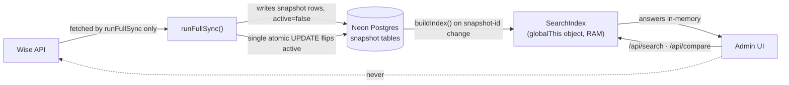
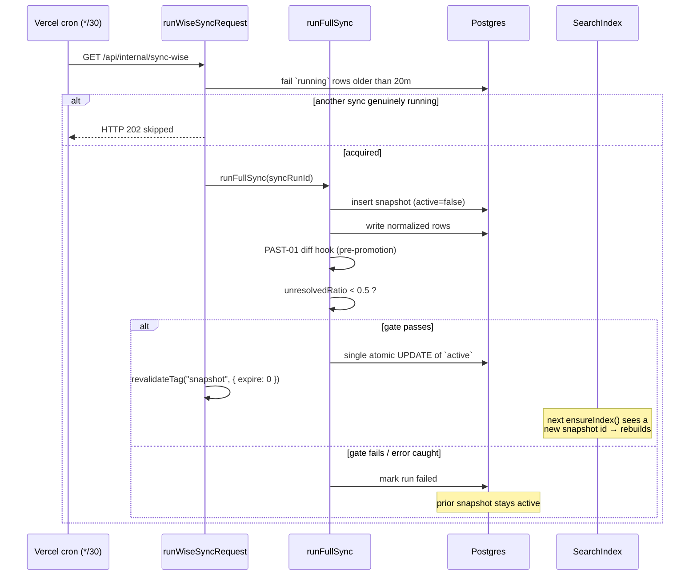

# Not the Next.js You Know

> First-read gotchas. If you have shipped Next.js apps before, this codebase violates assumptions you
> did not know you had. Read this before touching `src/lib/search/`, `src/lib/sync/`, or any
> `"use cache"` function.

`AGENTS.md` opens with a blunt, auto-generated banner (`AGENTS.md:1-5`):

> **This is NOT the Next.js you know.** This version has breaking changes — APIs, conventions, and
> file structure may all differ from your training data. Read the relevant guide in
> `node_modules/next/dist/docs/` before writing any code. Heed deprecation notices.

The banner is literal: that docs tree really ships (`node_modules/next/dist/docs/` holds `01-app`,
`02-pages`, `03-architecture`, `04-community`, `index.md`), and Next is pinned to **16.2.2** with
React **19.2.4** (`package.json:52`, `:55-56`).

But the banner is also *narrower than the real problem*. Most of what will trip you up here is
**architectural, not framework**. Five surprises, each verified against code.

---

## TL;DR

| # | Surprise | Why it bites |
|---|----------|--------------|
| 1 | **Tutor search/compare reads never call Wise.** They answer from an in-memory object on `globalThis`. | Debugging "wrong schedule" by hunting for a live API call finds nothing. There is none on that path. |
| 2 | **Reads are pinned to one snapshot.** Every load is `WHERE snapshot_id = <active>`; tutor group ids are snapshot-scoped, not stable. | Mixed-version reads are impossible by construction. Promotion is the only way served data changes. |
| 3 | **Sync must run before serve.** No active snapshot → the API *and* the page both throw. | A fresh DB serves 500s until the first sync promotes. There is no "fetch from Wise if empty" fallback. |
| 4 | **Fail-closed is the default posture, not a flag.** Unknown status → blocked; unresolved data → "Needs Review". | A tutor is never "Available" unless the data *proves* it. Loosening a check breaks a Change-Control rule. |
| 5 | **Next.js 16 conventions.** `cacheComponents`, `"use cache"`, two-arg `revalidateTag`, `connection()`, async `params`, deprecated-but-kept `middleware.ts`. | Next 13/14/15 muscle memory produces code that is quietly wrong here. |

---

## 1. The tutor read path never hits Wise live

The mental model you probably have — *API route → query the data source → return* — is wrong for
search and compare. Both answer from a **denormalized aggregate held in server memory**. Wise is
touched by sync pipelines and by a handful of other subsystems (see the caveat), never by the tutor
search hot path.

The index lives on `globalThis`, not a module-scope `let`, so it survives Hot Module Replacement in
dev (`src/lib/search/index.ts:94-97`):

```ts
declare global {
  var __bgscheduler_searchIndex: SearchIndex | null;
  var __bgscheduler_searchIndexBuildPromise: Promise<SearchIndex> | null;
}
```

`IndexedTutorGroup` carries qualifications, Wise member records, availability windows, leaves,
session blocks, data issues, and the business profile **already joined**
(`src/lib/search/index.ts:65-81`), and `SearchIndex` adds a `byWeekday` map for O(1) day lookup
(`:83-90`, built at `:322-331`). Built once, queried many times.

**Proof the hot path is pure in-memory:**

- `executeSearch(index, request)` takes the index as an argument and iterates `index.byWeekday` /
  `group.availabilityWindows` / `group.sessionBlocks` / `group.leaves` — no DB, no HTTP
  (`src/lib/search/engine.ts:22-58`; per-candidate loop `:79-147`, candidate lookup `:74`).
- `src/lib/search/compare.ts` imports exactly three things: `date-fns-tz`, index types, and compare
  types (`src/lib/search/compare.ts:1-3`).
- **Nothing under `src/lib/search/**` or `src/lib/data/**` imports `@/lib/wise/*`** — `grep -rn
  "lib/wise" src/lib/search/ src/lib/data/` returns zero hits at HEAD.
- `/api/search`'s entire data acquisition is `await ensureIndex(db)` followed by the engine call
  (`src/app/api/search/route.ts:54-55`). `/api/compare` has the same shape
  (`src/app/api/compare/route.ts:138`).
- Even the normalization layer imports only `@/lib/wise/types` — a module with **no imports of its
  own** and no `fetch` (`src/lib/normalization/availability.ts:1`, `leaves.ts:1`,
  `qualifications.ts:1`). `modality.ts` imports nothing from Wise at all (`:1-2`).


```mermaid
flowchart LR
  Wise["Wise API"] -->|"fetched by runFullSync only"| Orch["runFullSync()"]
  Orch -->|"writes snapshot rows, active=false"| PG[("Neon Postgres<br/>snapshot tables")]
  Orch -->|"single atomic UPDATE flips active"| PG
  PG -->|"buildIndex() on snapshot-id change"| IDX["SearchIndex<br/>(globalThis object, RAM)"]
  UI["Admin UI"] -->|"/api/search · /api/compare"| IDX
  IDX -->|"answers in-memory"| UI
  UI -. never .-> Wise
```

### One index, many readers

`ensureIndex(db)` is the single read entry point, and search/compare are not its only callers. Eight
non-test call sites at HEAD:

| Caller | Line |
|---|---|
| `src/app/api/search/route.ts` | `:54` |
| `src/app/api/compare/route.ts` | `:138` |
| `src/app/api/compare/discover/route.ts` | `:57` |
| `src/app/api/proposals/route.ts` | `:64` |
| `src/lib/search/range-search.ts` | `:115` |
| `src/lib/room-capacity/data.ts` | `:409` |
| `src/lib/line/operational.ts` | `:527` |
| `src/lib/ai/scheduler-service.ts` | `:60` |

None of them call Wise. One degrades instead of throwing: the LINE operational planner wraps the call
in `.catch(() => null)` so an unavailable index yields no suggestions rather than an error
(`src/lib/line/operational.ts:527`).

### The scope caveat you must not over-generalize

"Reads never hit Wise" is a property of the **tutor search/compare path**, not of the app. Other
subsystems own their own Wise-calling lineages, and several call Wise *inside an admin-triggered
request*. `createWiseClient()` has 16 non-test call sites, including payroll
(`src/app/api/payroll/sync/route.ts:36`), credit control
(`src/lib/credit-control/run-sync-request.ts:140`), progress tests
(`src/lib/progress-tests/run-sync-request.ts:141`, `booking.ts:263`, `:310`), room utilization
(`src/lib/room-capacity/utilization.ts:436`), Wise activity
(`src/lib/wise-activity/reconciliation.ts:780`, `:807`), post-class feedback
(`src/lib/post-class-feedback/sync.ts:1058`), student schedule live mode
(`src/lib/student-schedule/live.ts:110`), and classroom morning automation
(`src/lib/classrooms/morning-automation.ts:190`). Classroom assignment builds its own client from env
and fetches live future sessions during a run (`src/lib/classrooms/data.ts:1151-1158`, used at `:889`,
`:993`, `:1496`).

**Check the subsystem before assuming its reads are offline.**

> **Gotcha:** debugging "why does this tutor show the wrong schedule?" — do not hunt for a live Wise
> call in the search path. Look at the last promoted snapshot's rows and the index built from them.

---

## 2. Reads are pinned to exactly one snapshot

All tutor data is versioned by `snapshot_id`, and exactly one snapshot has `active = true`
(`snapshots.active` is `notNull().default(false)`, `src/lib/db/schema.ts:456-460`). `buildIndex`
finds that snapshot and loads **only its rows** — every parallel query is filtered
`WHERE snapshotId = <active>` (`src/lib/search/index.ts:144-148`; the eight-way `Promise.all` at
`:175-222`):

```ts
const [activeSnapshot] = await db
  .select().from(schema.snapshots)
  .where(eq(schema.snapshots.active, true)).limit(1);
// ...every subsequent load: .where(eq(<table>.snapshotId, snapshotId))
```

That is why a query can never observe a half-written dataset: the snapshot a sync is *writing* is
inserted with `active: false` (`src/lib/sync/orchestrator.ts:71-75`), so the index cannot load it
until promotion flips the flag.

**Corollary that surprises people: tutor group ids are snapshot-scoped, not stable.** A
`tutorGroupId` a client held five minutes ago may not exist in the new active snapshot.
`/api/compare` handles this by falling back to `canonical_key`: it looks unmatched UUIDs up in
`tutor_identity_groups`, maps each to its canonical key, re-resolves against the active snapshot, and
warns `"Tutor selection was refreshed after the latest Wise sync"`
(`src/app/api/compare/route.ts:61-110`; UUID guard `:59`, stale lookup `:83-89`, re-resolution loop
`:98-107`, warning `:157-159`). `canonicalKey` is denormalized onto the in-memory group (**D-04**)
exactly so this needs no extra DB round-trip (`src/lib/search/index.ts:67-71`, `:260-263`).

### "Stale index" means the snapshot id (or profile version) changed

`ensureIndex` does not poll and does not time out. Each call compares the cached index's `snapshotId`
**and** `profileVersion` against the DB. Both match → the cached object is returned untouched
(`src/lib/search/index.ts:377-383`):

```ts
if (activeSnapshot
    && activeSnapshot.id === cached.snapshotId
    && profileVersion === cached.profileVersion) {
  return cached;            // serve from memory, no rebuild
}
```

So the index is invalidated by a **promotion** (new active snapshot id) or a **tutor-business-profile
edit** — `profileVersion` is a `count:maxUpdatedAt` string over `tutor_business_profiles`
(`src/lib/search/index.ts:128-137`). Profile mutations additionally force an eager
`clearSearchIndex()` (`src/app/api/tutor-profiles/[canonicalKey]/route.ts:51`,
`src/app/api/tutor-profiles/import-commit/route.ts:61`; the clear itself at
`src/lib/search/index.ts:123-126`) — but that only clears *the serverless instance that handled the
mutation*. Every other instance self-heals on its next `ensureIndex` via the `profileVersion`
compare. That two-tier design is deliberate; do not "fix" it by adding cross-instance signalling.

If the DB reports *no* active snapshot but a cached index exists, `ensureIndex` keeps serving the
cache rather than throwing (`src/lib/search/index.ts:384-386`).

> **Concurrency (REL-02):** concurrent first-time callers do not both rebuild. `ensureIndex` assigns
> the in-flight build promise to `globalThis` **synchronously, before any `await`**, so a second
> caller arriving mid-build returns the same promise — the singleton-promise pattern, documented
> inline (`src/lib/search/index.ts:346-353`, assignment at `:396-399`, early return at `:358-359`)
> and pinned by a select-count test (`src/lib/search/__tests__/index.test.ts:148-161`).

### `stale` in an API response is a *different*, softer notion

Do not conflate index invalidation with the `stale` flag in responses. That flag is a pure wall-clock
age check against `index.syncedAt` — itself the `finishedAt` of the last **successful, promoting**
sync run (`src/lib/search/index.ts:155-166`). It never triggers a rebuild; it appends a warning
string (`src/lib/search/engine.ts:30-38`, mirrored at `src/app/api/compare/route.ts:141-149`):

```ts
stale: Date.now() - index.syncedAt.getTime() > staleThresholdMs
```

`API_STALE_THRESHOLD_MS` is **90 minutes** — three missed 30-minute crons of headroom — and a
separate UI banner threshold sits at **2 hours** (`src/lib/ops/stale.ts:2-3`). Stale data is still
served; the user just sees a warning.

---

## 3. Sync-before-serve: no snapshot, no answers

A fresh database serves **nothing**. `buildIndex` throws (`src/lib/search/index.ts:150-152`):

```ts
if (!activeSnapshot) {
  throw new Error("No active snapshot found");
}
```

There is no eager build at boot and no "fetch from Wise if empty" fallback. `buildIndex` has exactly
one caller in `src/` — `ensureIndex` (`src/lib/search/index.ts:388`). Until a sync promotes a first
snapshot, `/api/search` returns 500 carrying that message (`src/app/api/search/route.ts:53-60`).

The same wall exists one layer up. The `/search` page's Server Component awaits `getFilterOptions()`
and `getTutorList()` (`src/app/(app)/search/page.tsx:11-12`), both of which call
`getActiveSnapshotIdOrThrow` (`src/lib/data/filters.ts:38`, `src/lib/data/tutors.ts:56`), which
throws the identical error (`src/lib/data/active-snapshot.ts:12-14`). The page render fails too, not
just the API. The system genuinely is sync-first.

### How a snapshot becomes servable

`runFullSync` is **one try/catch** spanning fetch teachers → resolve identities → fetch
availability/leaves per teacher → fetch future sessions → derive modality → MOD-01 contradiction pass
→ PAST-01 diff hook → write rows → stats → validate → promote (`src/lib/sync/orchestrator.ts:50-611`;
`try` opens at `:60`). Two gates stand between "written" and "servable".

**Completeness gate.** More than 50% unresolved identity groups → no promotion; the previous active
snapshot keeps serving (`src/lib/sync/orchestrator.ts:473-476`):

```ts
const unresolvedRatio = identityIssues.length / Math.max(groups.length, 1);
const shouldPromote = unresolvedRatio < 0.5;   // >50% unresolved = don't promote
```

**Atomic promotion (REL-01).** Promotion is a *single* `UPDATE` that clears the old active row and
sets the new one in one statement, so a concurrent reader sees either the old or the new active
snapshot — never zero (`src/lib/sync/orchestrator.ts:488-498`, rationale `:481-487`):

```ts
await db.update(schema.snapshots)
  .set({ active: sql`(${schema.snapshots.id} = ${snapshotId})` })
  .where(or(
    eq(schema.snapshots.active, true),
    eq(schema.snapshots.id, snapshotId),
  ));
```

A failed sync never reaches that line. Note the shape: `runFullSync` **does not re-throw** — it lands
in the `catch`, marks the run `failed`, returns `success: false`, and leaves the prior snapshot
active (`src/lib/sync/orchestrator.ts:568-609`). Per-teacher fetch failures do not even get that far
— they become `completeness` data issues and the loop continues (`:249-259`).

Ordering constraint worth knowing: the **PAST-01 diff hook** — which captures sessions that dropped
out of Wise's FUTURE response into the cross-snapshot `past_session_blocks` table — **must run before
promotion**, while the prior snapshot is still `active = true`
(`src/lib/sync/orchestrator.ts:400-407`; rationale at `src/lib/sync/past-sessions-diff-hook.ts:6-25`).
Post-promotion, old snapshots are pruned to a retention count of **30**
(`src/lib/sync/snapshot-pruning.ts:5`, invoked at `src/lib/sync/orchestrator.ts:533`), with the
active snapshot always protected regardless of age (`src/lib/sync/snapshot-pruning.ts:68-70`).
Pruning failures are logged and recorded in `sync_runs.metadata`, never fatal
(`src/lib/sync/orchestrator.ts:532-554`).


```mermaid
sequenceDiagram
  participant Cron as Vercel cron (*/30)
  participant Guard as runWiseSyncRequest
  participant Orch as runFullSync
  participant PG as Postgres
  participant IDX as SearchIndex
  Cron->>Guard: GET /api/internal/sync-wise
  Guard->>PG: fail `running` rows older than 20m
  alt another sync genuinely running
    Guard-->>Cron: HTTP 202 skipped
  else acquired
    Guard->>Orch: runFullSync(syncRunId)
    Orch->>PG: insert snapshot (active=false)
    Orch->>PG: write normalized rows
    Orch->>Orch: PAST-01 diff hook (pre-promotion)
    Orch->>Orch: unresolvedRatio < 0.5 ?
    alt gate passes
      Orch->>PG: single atomic UPDATE of `active`
      Guard->>Guard: revalidateTag("snapshot", { expire: 0 })
      Note over IDX: next ensureIndex() sees a<br/>new snapshot id → rebuilds
    else gate fails / error caught
      Orch->>PG: mark run failed
      Note over PG: prior snapshot stays active
    end
  end
```

### Single-flight: syncs do not stack

The Wise snapshot cron fires every 30 minutes (`vercel.json:4-7`), but a slow run will not overlap
the next trigger. `runWiseSyncRequest` first fails any `running` row older than **20 minutes**
(`src/lib/sync/run-wise-sync.ts:10`, `:51-72`), then refuses to start if another sync is genuinely
running, returning **HTTP 202** with a `skipped` body rather than an error (`:88-118`, `:148-150`). A
unique-violation on insert is treated as the same "already running" case (`:42-49`, `:106-117`) — the
guard is enforced **in Postgres** by a partial unique index on `sync_runs.status = 'running'`
(`src/lib/db/schema.ts:472-475`), not only in application code.

On success it nudges the Next cache — `revalidateTag("snapshot", { expire: 0 })`
(`src/lib/sync/run-wise-sync.ts:160-162`). See surprise 5 for what that tag actually feeds (hint:
not the index).

The same handler is reachable three ways, all funnelling through the same guard: cron `GET` with
`CRON_SECRET`, manual `POST` with either the secret or an Auth.js session
(`src/app/api/internal/sync-wise/route.ts:68-76`), and the admin-only `POST /api/admin/sync-wise`.

---

## 4. Fail-closed is the default posture

The non-negotiable rule from `AGENTS.md`: *never return a tutor as available unless the system can
prove availability from normalized Wise data.* Two enforcement points, both defaulting to "block".

**Unknown session status → blocking.** Only an explicit allowlist is non-blocking; everything else,
including a missing status, blocks (`src/lib/normalization/sessions.ts:33-51`):

```ts
const NON_BLOCKING_STATUSES = new Set([
  "CANCELLED", "CANCELED", "COMPLETED", "MISSED", "NO_SHOW",
]);

export function isBlockingStatus(status: string | undefined): boolean {
  if (!status) return true;                          // fail-closed
  const upper = status.toUpperCase();
  if (NON_BLOCKING_STATUSES.has(upper)) return false;
  return true;                                       // unknown → still blocks
}
```

A brand-new Wise status the parser has never seen blocks availability rather than leaking a false
"free" slot. Cancelled sessions, correctly, do **not** block.

**Unresolved identity / modality / qualification → "Needs Review", never "Available".** Any group
carrying data issues, or with no resolved modality, is routed to the `needsReview` bucket after it
has otherwise passed every check (`src/lib/search/engine.ts:83-97`, decision at `:142-146`):

```ts
if (group.dataIssues.length > 0) {
  reviewReasons.push(...group.dataIssues.map((i) => `${i.type}: ${i.message}`));
}
if (group.supportedModes.length === 0) {
  reviewReasons.push("Unresolved modality");
} else if (slot.mode !== "either") {
  if (!group.supportedModes.includes(slot.mode)) continue;   // hard drop
}
// ...window check, filters, session blocking, leave blocking, then:
if (reviewReasons.length > 0) needsReview.push({ ...result, reasons: reviewReasons });
else available.push(result);
```

Read that `else if` carefully — it is the fail-closed hinge. A group with **unresolved** modality
skips the mode filter entirely, so it is *surfaced for review* rather than silently dropped. Only a
group whose modality *is* resolved can be `continue`d away.

`supportedModes` is empty precisely when the group's modality is `"unresolved"`
(`src/lib/search/index.ts:265-270`) — which is the orchestrator's *initial* value for every group
(`src/lib/sync/orchestrator.ts:118`), overwritten only once `deriveModality` has run (`:321-329`).

Three more asymmetries in the same function that surprise people:

- **Availability windows require containment, not overlap.** A window matches only if
  `w.startMinute <= startMinute && w.endMinute >= endMinute` — a partially-overlapping window does
  not qualify the tutor (`src/lib/search/engine.ts:100-108`).
- **Recurring vs one-time blocking differ.** Recurring: any blocking session on the same
  weekday/time overlaps, regardless of date (`:155-168`). One-time: only a blocking session on the
  same calendar day (`:173-188`).
- **Leaves are checked after sessions**, with the same recurring/one-time split
  (`:121-125`; `hasRecurringLeaveConflict` `:251`, `hasOneTimeLeaveConflict` `:294`).

> **Gotcha:** if you "fix" a tutor not showing as available by loosening one of these checks, you are
> weakening a documented non-negotiable rule. `AGENTS.md` → Change Control forbids that without
> explicit approval.

---

## 5. Next.js 16 specifics

Next **16.2.2** (`package.json:52`). Skip any of these and you will write Next-13-era code that is
quietly wrong. Every framework claim below is checkable in the bundled docs tree.

### `cacheComponents` is on, project-wide

`next.config.ts` sets exactly one option (`next.config.ts:3-5`):

```ts
const nextConfig: NextConfig = { cacheComponents: true };
```

Three things follow:

1. `cacheComponents` is the single unified flag that **replaced** `experimental.ppr`,
   `experimental.useCache`, and `experimental.dynamicIO`; the route-level `experimental_ppr` segment
   option is **removed**
   (`node_modules/next/dist/docs/01-app/03-api-reference/05-config/01-next-config-js/cacheComponents.md:52`;
   `node_modules/next/dist/docs/01-app/02-guides/upgrading/version-16.md:587-589`, `:1203`). A grep
   for `experimental_ppr` in `src/` returns nothing.
2. Data fetching in Server Components is **excluded from prerender unless explicitly cached** — that
   is the whole point of the flag (`cacheComponents.md:6`).
3. With the flag on, Next uses React `<Activity>` to keep the previous route **mounted and hidden**
   during client-side navigation instead of unmounting it (`cacheComponents.md:32-36`). Client state
   survives back/forward navigation; a component that assumes "unmount = reset" will misbehave here.

The codebase uses `"use cache"` for the cacheable data-fetch layer — **never** for the in-memory
index. Canonical shape (`src/lib/data/filters.ts:52-58`, `src/lib/data/tutors.ts:80-86`):

```ts
export async function getFilterOptions(): Promise<FilterOptions> {
  "use cache";
  cacheTag("snapshot");
  cacheLife("hours");
  return loadFilterOptions(getDb());
}
```

`cacheLife` accepts named profiles (`"hours"`, `"days"` — `src/lib/data/past-sessions.ts:89`) or an
explicit `{ stale, revalidate, expire }` object (`src/lib/credit-control/service.ts:33`). Two rules
the directive imposes that Next 14 code never had to think about: arguments and return values must be
**serializable**
(`node_modules/next/dist/docs/01-app/03-api-reference/01-directives/use-cache.md:103`), and
`cookies()`/`headers()` must be read **outside** the cached scope and passed in (`use-cache.md:21`,
`:196`). That is why every cached function here takes plain values or nothing and opens its own
`getDb()`.

### The `"snapshot"` cache tag ≠ the SearchIndex

The easiest thing to get wrong. `revalidateTag("snapshot", { expire: 0 })` after a successful sync
(`src/lib/sync/run-wise-sync.ts:161`) does **not** invalidate the in-memory `SearchIndex` — that is
plain `globalThis` state, invalidated lazily by the snapshot-id comparison in surprise 2. The tag
feeds the `"use cache"` data layer only: `src/lib/data/filters.ts:54` and
`src/lib/data/tutors.ts:82`. **Two independent caching mechanisms, one trigger.**

Note also that `past-sessions` is a **separate tag the sync deliberately does not sweep**, because
captured past data is immutable once written (`src/lib/data/past-sessions.ts:11-16`, `:88`; the
hook's matching no-invalidation note at `src/lib/sync/past-sessions-diff-hook.ts:22-25`).

### `revalidateTag` takes a second argument now

Calling `revalidateTag(tag)` bare is **deprecated** in Next 16
(`node_modules/next/dist/docs/01-app/03-api-reference/04-functions/revalidateTag.md:22`, `:55`); the
signature is `revalidateTag(tag, profile: string | { expire?: number })` (`revalidateTag.md:29`,
`:33`; upgrade note at `version-16.md:455-457`). Both forms are in use here — `{ expire: 0 }` for the
immediate case, which is the documented pattern for **external callers hitting a Route Handler**
(`revalidateTag.md:136`), and `"max"` for stale-while-revalidate (`revalidateTag.md:20`). Tests
assert the exact call shape, so drift fails CI
(`src/app/api/internal/sync-wise/__tests__/route.test.ts:183`, `:202`, and the negative cases at
`:233`, `:262`).

### Request APIs are async — no synchronous escape hatch left

Next 15's temporary sync compatibility for `cookies`, `headers`, `draftMode`, `params`, and
`searchParams` is **fully removed** in 16 (`version-16.md:296-298`). In-repo that means route/page
params are Promises you must await: `params: Promise<{ caseId: string }>`
(`src/app/(app)/admissions/[caseId]/page.tsx:67`, `:267`), and
`params: Promise<{ unitId: string }>` alongside `searchParams: Promise<SearchParamsShape>`
(`src/app/(app)/us-universities/[unitId]/page.tsx:118-119`, awaited at `:121-122`).

### `connection()` opts a page out of prerender

With `cacheComponents` on, a Server Component that must run per-request awaits `connection()` from
`next/server` before its work — see `/search`, whose whole body is gated on it
(`src/app/(app)/search/page.tsx:2`, `:9`). `connection()` **replaces `unstable_noStore`**
(`node_modules/next/dist/docs/01-app/03-api-reference/04-functions/connection.md:50`; what it
excludes at `:6-8`). There is **zero** `unstable_cache` or `unstable_noStore` usage in `src/` at
HEAD; do not reintroduce either.

### `middleware.ts` is a deprecated filename — and staying anyway

Next 16 renamed the file convention to `proxy.ts`
(`node_modules/next/dist/docs/01-app/03-api-reference/03-file-conventions/proxy.md:11`,
`version-16.md:615-617`). This repo still ships `src/middleware.ts` **on purpose** and has no
`src/proxy.ts`. The reason is one sentence in the upgrade guide: *"The `edge` runtime is **NOT**
supported in `proxy`… If you want to continue using the `edge` runtime, keep using `middleware`"*
(`version-16.md:619`). The auth gate is an edge Auth.js instance with a deliberately DB-free `jwt`
callback built for exactly that constraint (`src/lib/auth-edge.ts:4`, comment at `:22-25`); the
Node-side callback that actually resolves `allowedPages` — once, at sign-in — lives in
`src/lib/auth.ts:59-63`.

So: do **not** run the `middleware`-to-`proxy` codemod here without solving the edge-runtime question
first. What the file does, in order (`src/middleware.ts:69-113`):

- **Maintenance gate first**, deliberately *above* the public-route allowlist so it can also close
  `/api/line/webhook` (`:72-82`; `MAINTENANCE_MODE` must be exactly `"true"`).
- Public routes pass through untouched (`isPublicRoute`, `:10-26`) — including all of
  `/api/internal/*`, because those routes do their own `CRON_SECRET` check.
- Everything else: unauthenticated → redirect to `/login` with a `callbackUrl` (`:89-93`).
- Per-user page scoping: `allowedPages === null` means full access, otherwise the pathname must match
  an allowed prefix as a page *or* as its `/api` namespace; API misses get 403, page misses get
  redirected to the user's landing page, guarded against a redirect loop (`isPathAllowed` `:36-67`;
  enforcement `:95-106`). Three namespaces are carved out because they re-check a **fresh database
  grant** downstream rather than trusting the JWT prefix list: `/api/home/summary` (`:38`),
  post-class feedback (`:41-46`), and Learning Plans pages — but explicitly *not* the Learning Plans
  API (`:50-57`).
- Matcher excludes only `_next/static`, `_next/image`, and `favicon.ico` (`:111-113`).

### Route-handler runtime knobs live in the route file

- **`maxDuration` is per-route**, not in `vercel.json`. Both Wise sync routes set
  `export const maxDuration = 800` (`src/app/api/internal/sync-wise/route.ts:7`,
  `src/app/api/admin/sync-wise/route.ts:6`). `vercel.json` holds only `regions` and the cron entries
  — **17** at HEAD (`vercel.json:1-73`), pinned by
  `src/__tests__/vercel-crons.test.ts:100`, `:103`. See [`../reference/crons.md`](../reference/crons.md).
- **No route exports `runtime`** — a grep for `export const runtime` in `src/` is empty, so every
  handler runs on the default Node runtime.
- The cron hits **`GET`**; manual triggers use **`POST`** with either an Auth.js session or the
  `CRON_SECRET` bearer, compared in **constant time** with a length pre-check (**REL-07**,
  `src/app/api/internal/sync-wise/route.ts:11-29`, dispatch at `:68-76`). The shared helper for the
  other internal cron routes is `src/lib/internal/cron-auth.ts:6-17`.

### Three more locked conventions

- **`globalThis`-anchored singletons, not module-scope `let`.** Both the DB client and the search
  index live on `globalThis` so they survive HMR (`src/lib/db/index.ts:16-27`,
  `src/lib/search/index.ts:94-113`). A bare `let _x` is wiped on every hot reload.
- **Neon HTTP driver, not a pooled TCP client.** `drizzle-orm/neon-http` over `neon(DATABASE_URL)`
  (`src/lib/db/index.ts:1-11`). Each query is a stateless HTTPS round-trip, so there are **no
  transactions** on this client. The three subsystems that need them detect the driver's
  `"No transactions support in neon-http driver"` error and fall back to a `pg` connection
  (`src/lib/payroll/sync.ts:90`, `src/lib/post-class-feedback/transaction.ts:12`,
  `src/lib/admissions/audit.ts:54`). Do not add a fourth pattern.
- **All time is `Asia/Bangkok`.** `TIMEZONE = "Asia/Bangkok"` is the single constant normalization
  and "now" math key off (`src/lib/normalization/timezone.ts:3`; compare's "current Monday" is
  `toZonedTime(new Date(), TIMEZONE)` under **REL-08**, `src/app/api/compare/route.ts:35-36`), and
  Vitest pins `process.env.TZ` to the same zone so date assertions are deterministic
  (`vitest.config.ts:4`). Do not introduce a second clock.

---

## Where to go next

| You want | Go to |
|---|---|
| Index internals + stale detection | `src/lib/search/index.ts` |
| Read-path query logic | `src/lib/search/engine.ts`, `src/lib/search/compare.ts`, `src/lib/search/range-search.ts` |
| ETL + promotion | `src/lib/sync/orchestrator.ts` |
| Single-flight guard + cache sweep | `src/lib/sync/run-wise-sync.ts` |
| Cron schedule | `vercel.json`, plus [`../reference/crons.md`](../reference/crons.md) |
| The whole-system model | [`architecture.md`](./architecture.md), [`data-flow.md`](./data-flow.md) |
| House style + naming rules | [`conventions.md`](./conventions.md) |
| Vocabulary (snapshot, identity group, modality) | [`glossary.md`](./glossary.md) |
| Feature meaning and rules | [`../features/tutor-search.md`](../features/tutor-search.md) (**stable**), [`../features/tutor-compare.md`](../features/tutor-compare.md) (**legacy-redirect** — `/compare` is a client-side redirect to `/search`, `src/app/(app)/compare/page.tsx:10-17`; the engine and both API routes are live) |

_Verified against main@0cd1e81 (clean tree) on 2026-09-02._
