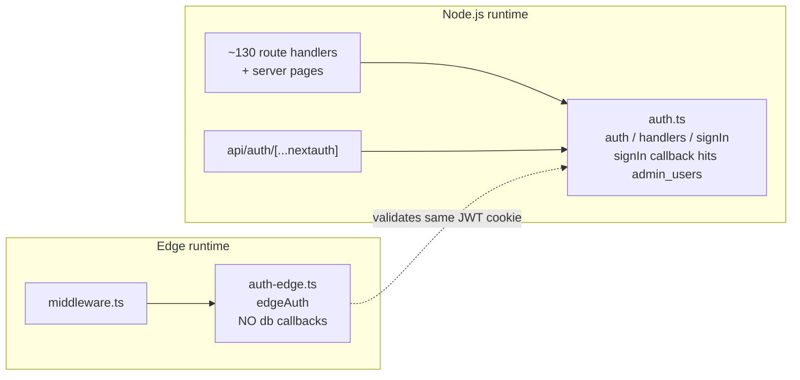

# Auth & Access

How BGScheduler decides who may use the app. There are exactly two gates, and a request must clear both to reach protected data:

1. **The middleware gate** (`src/middleware.ts`) — runs on the **Edge runtime** for every request, decides _is there a valid session?_ and redirects to `/login` if not.
2. **The allowlist check** (`signIn` callback in `src/lib/auth.ts`) — runs once **at login time** on the **Node.js runtime**, decides _is this Google identity permitted?_ by looking the email up in the `admin_users` table.

Identity comes from **Auth.js v5 (NextAuth)** with a single **Google** OAuth provider. The package is `next-auth@5.0.0-beta.30` (`package.json:40`).

> Maturity: **Active.** This is the live auth path for production (`https://bgscheduler.vercel.app`).

---

## The big picture

```mermaid
flowchart TD
    A[Incoming request] --> B{middleware.ts<br/>isPublicRoute?}
    B -- yes --> Z[NextResponse.next - pass through]
    B -- no --> C{req.auth present?<br/>valid session cookie}
    C -- no --> D[302 redirect to /login<br/>callbackUrl preserved]
    C -- yes --> E[NextResponse.next - reach route/page]
    E --> F{Route handler / server page}
    F --> G[await auth from @/lib/auth<br/>re-checks session, 401 or redirect]

    D --> H[/login page]
    H --> I[signIn google]
    I --> J[Google OAuth consent]
    J --> K[signIn callback in src/lib/auth.ts]
    K --> L{email in admin_users?}
    L -- no --> M[return false<br/>error=AccessDenied -> back to /login]
    L -- yes --> N[store Google OAuth tokens<br/>then session issued JWT cookie]
    N --> E
```

Two distinct decisions, made in two different places:

- **"Are you logged in?"** is answered by the **session cookie**, checked at the edge on every request (`src/middleware.ts:25`) and re-checked inside each route/page.
- **"Are you allowed?"** is answered **only once, at sign-in**, by the `signIn` callback's `admin_users` lookup (`src/lib/auth.ts:43-50`). After that, the session cookie is the proof of allowed-ness — there is no per-request DB allowlist check.

---

## Layer 1 — Auth.js (NextAuth) with Google

Two NextAuth instances are configured. They are **deliberately split** by runtime (see [The auth vs auth-edge split](#the-auth-vs-auth-edge-split)).

### The Node-runtime instance — `src/lib/auth.ts`

`NextAuth({...})` here exports `handlers`, `signIn`, `signOut`, and `auth` (`src/lib/auth.ts:25`). This is the full configuration:

- **Provider**: Google, configured with `AUTH_GOOGLE_ID` / `AUTH_GOOGLE_SECRET` (`src/lib/auth.ts:27-36`).
- **OAuth scope**: `openid email profile https://www.googleapis.com/auth/spreadsheets` with `access_type: "offline"` (`src/lib/auth.ts:32-33`). The Sheets **write** scope and offline access are requested because the same Google grant is reused to drive Google Sheets integrations (sales dashboard, leave-requests), not just to identify the user.
- **Custom pages**: both `signIn` and `error` point at `/login` (`src/lib/auth.ts:38-41`), so OAuth errors land back on the login screen rather than a NextAuth default page.
- **`signIn` callback** (`src/lib/auth.ts:43-50`): this is the access-control gate. It calls `signInCallback({ user })`; if the user is allowed **and** has an email, it stores the Google OAuth token for that user (`storeGoogleOAuthTokenForUser`, imported lazily from `@/lib/sales-dashboard/google-oauth`) and then returns the allow/deny boolean. **Returning `false` aborts sign-in** — NextAuth redirects back to `/login?error=AccessDenied`.
- **`session` callback** (`src/lib/auth.ts:51-53`): pass-through; it returns the session unchanged.

> Note the side effect: a successful sign-in also **persists encrypted Google OAuth tokens** (`storeGoogleOAuthTokenForUser`, `src/lib/auth.ts:46-47`). Token encryption is keyed off `AUTH_SECRET` (`src/lib/sales-dashboard/google-oauth.ts:37-41`). So `AUTH_SECRET` protects both session cookies and stored OAuth refresh tokens.

### The allowlist callback — `signInCallback`

`signInCallback({ user })` (`src/lib/auth.ts:7-23`) is the single source of truth for "may this person in":

1. Normalize the email: `user.email?.trim().toLowerCase()` (`src/lib/auth.ts:12`). Casing and surrounding whitespace are stripped before lookup.
2. If there is no email, return `false` **without touching the database** (`src/lib/auth.ts:13`).
3. Otherwise query `admin_users` for an exact email match, `limit(1)` (`src/lib/auth.ts:15-20`).
4. Return `true` iff a row exists (`src/lib/auth.ts:22`).

This behavior is locked by `src/lib/auth/__tests__/signin-callback.test.ts`: it asserts an allowlisted email is admitted, casing/whitespace is normalized before the lookup (`eq` called with the normalized string, test line 59), a non-allowlisted email is rejected, and a missing email returns `false` without calling `getDb()` (test lines 78-88).

This is a **fail-closed allowlist**: unknown or empty identities are denied, never admitted.

### NextAuth route handler — `src/app/api/auth/[...nextauth]`

The OAuth callback/sign-in/sign-out endpoints are mounted by re-exporting the Node-instance handlers:

```ts
// src/app/api/auth/[...nextauth]/route.ts
import { handlers } from "@/lib/auth";
export const { GET, POST } = handlers;
```

That is the entire file (`src/app/api/auth/[...nextauth]/route.ts:1-3`). All of `/api/auth/*` (provider callbacks, CSRF, session, sign-out) is served here on the Node runtime, which is why the middleware must let `/api/auth/*` through unauthenticated (the OAuth handshake happens before any session exists).

### Session strategy

Neither NextAuth config sets a `session.strategy` and **no database adapter is configured** (no `adapter:` key in either file; `@auth/drizzle-adapter` is not a dependency in `package.json`). With no adapter, Auth.js v5 defaults to a **JWT session** stored in an encrypted cookie. This is what makes the edge gate possible: the middleware can validate the session cookie at the edge without a database round-trip (see below). The `admin_users` table is consulted only at the moment of sign-in, never on subsequent requests.

---

## Layer 2 — The middleware gate

`src/middleware.ts` wraps the **edge** auth instance and runs on (almost) every request.

### What bypasses auth

`isPublicRoute(pathname)` (`src/middleware.ts:4-15`) returns `true` — i.e. the request skips the session check — for these paths:

| Public path (matches `isPublicRoute`) | Why it is public |
| --- | --- |
| `/login` (prefix) | The sign-in screen itself; redirecting it to itself would loop. |
| `/api/auth/*` (prefix) | The OAuth handshake runs before any session exists. |
| `/api/internal/*` (prefix) | Cron/internal endpoints; gated by `CRON_SECRET` in their own handlers, not by session. |
| `/api/search/assistant` (exact) | Bypasses the *redirect* so the route can return a JSON API auth error instead. |
| `/api/classrooms/floor-plan-map` (exact) | Public asset endpoint. |
| `/api/line/webhook` (exact) | LINE posts signed webhook events; verified by signature, not session. |
| `/api/line/contacts/oa-resolver/worklist` (exact) | Driven by extension token auth, not a browser session. |
| `/api/line/contacts/oa-resolver/runs/{id}/rows` (regex `^/api/line/contacts/oa-resolver/runs/[^/]+/rows$`) | Same extension-token path; only the `…/rows` sub-route is public. |

> **Documentation correction (for the parent task):** the task brief states the bypass list as exactly `/login`, `/api/auth/*`, `/api/internal/*`. The code (`src/middleware.ts:4-15`) bypasses **eight** path patterns, not three — the five additional entries above (`/api/search/assistant`, `/api/classrooms/floor-plan-map`, `/api/line/webhook`, the LINE OA-resolver worklist, and the regex-matched `…/runs/{id}/rows`) are public too. The three named in the brief are a subset. See Open Questions.

A subtlety worth calling out: most of the LINE OA-resolver namespace is **not** public. Only `…/worklist` and the exact `…/runs/{id}/rows` shape bypass auth; `…/runs` and `…/runs/{id}/commit` still require a session (`src/__tests__/middleware.test.ts:69-87`). The regex is anchored (`^…$`) precisely so it cannot match those sibling routes.

### What happens on a non-public route

For everything else (`src/middleware.ts:17-32`):

- If `req.auth` is falsy (no valid session), build a redirect to `/login` and **preserve the original destination** as `callbackUrl=${pathname}${search}` (`src/middleware.ts:25-28`). The query string is preserved too, so e.g. `/search?tutors=g1,g2` round-trips through login (`src/__tests__/middleware.test.ts:97-104`).
- Otherwise call `NextResponse.next()` and let the request proceed (`src/middleware.ts:31`).

`req.auth` is populated by wrapping the handler in `edgeAuth(...)` (`src/middleware.ts:17`) — the edge instance reads and validates the JWT session cookie.

### The matcher

```ts
// src/middleware.ts:34-36
export const config = {
  matcher: ["/((?!_next/static|_next/image|favicon.ico).*)"],
};
```

The middleware runs on all paths **except** Next.js static assets (`_next/static`, `_next/image`) and `favicon.ico`. Everything else — pages and API routes alike — passes through the gate, then is filtered by `isPublicRoute`.

The bypass behavior is regression-tested in `src/__tests__/middleware.test.ts` (e.g. `/login`, `/api/auth/callback/google`, and `/api/internal/sync-wise` bypass; `/search` redirects with `307` and a preserved `callbackUrl`).

---

## The auth vs auth-edge split

Two NextAuth configs exist because **Vercel runs middleware on the Edge runtime**, which cannot open a Postgres connection, but the allowlist check and token storage **need** the database.



| | `src/lib/auth-edge.ts` (`edgeAuth`) | `src/lib/auth.ts` (`auth`, `handlers`, `signIn`, `signOut`) |
| --- | --- | --- |
| Runtime | Edge | Node.js |
| Exports | only `auth` (aliased `edgeAuth`) (`src/lib/auth-edge.ts:4`) | `handlers`, `signIn`, `signOut`, `auth` (`src/lib/auth.ts:25`) |
| `signIn` callback | **none** — no `admin_users` lookup, no DB access | present — runs the allowlist + token storage (`src/lib/auth.ts:43-50`) |
| `session` callback | pass-through (`src/lib/auth-edge.ts:21-25`) | pass-through (`src/lib/auth.ts:51-53`) |
| Google scope | `…/spreadsheets.readonly` (`src/lib/auth-edge.ts:11`) | `…/spreadsheets` (write) (`src/lib/auth.ts:32`) |
| Imported by | `src/middleware.ts` **only** | ~130 route handlers + server pages (e.g. `src/app/api/filters/route.ts:2`, `src/app/(app)/scheduler/page.tsx:3`) |

The key idea: the edge instance is a **stripped-down validator**. It has no callbacks that touch the database, so it can run in the constrained edge environment and still verify the JWT session cookie that the Node instance issued. Both configs use the same Google provider and the same `AUTH_SECRET` (implicitly, via NextAuth), so the cookie minted on the Node side is readable on the edge side.

> The scope difference between the two files (`spreadsheets` vs `spreadsheets.readonly`) is a real divergence in the source. The edge instance never initiates sign-in (the middleware only validates), so its narrower scope is not exercised during the OAuth grant — the grant always flows through the Node instance's handler. Flagged in Open Questions in case the intent was for both to match.

### How protected routes consume the session

- **API routes**: call `await auth()` and return `401` when there is no session. Representative pattern (`src/app/api/filters/route.ts:5-9`):
  ```ts
  const session = await auth();
  if (!session) return NextResponse.json({ error: "Unauthorized" }, { status: 401 });
  ```
- **Server pages**: call `await auth()` and `redirect("/login")` when unauthenticated, e.g. `src/app/(app)/scheduler/page.tsx:9-12`. Note the `(app)` route-group layout (`src/app/(app)/layout.tsx`) does **not** guard auth itself — it only renders nav/chrome; each page (and the middleware) does the guarding.

This is **defence in depth**: the middleware already blocks unauthenticated traffic, but every protected route/page re-checks the session independently rather than trusting the gate alone.

---

## The admin allowlist (`admin_users`)

### Where the table lives

`admin_users` is a Drizzle table (`src/lib/db/schema.ts:247-254`): `id` (uuid PK), `email` (text, not null), `name` (text, nullable), `createdAt`. A unique index `admin_users_email_idx` enforces one row per email. For the full column reference see `src/lib/db/schema.ts` (canonical home for schema mechanics).

### How rows get there — there is no hardcoded list

The allowlist is **populated entirely at deploy/seed time from an environment variable**. `src/lib/db/seed.ts:31` reads `process.env.SEED_ADMIN_EMAILS`, splits on `,`, drops empties, and inserts each (trimmed) email with `onConflictDoNothing` on the email index (`src/lib/db/seed.ts:31-43`). If `SEED_ADMIN_EMAILS` is unset, the seed **skips admin seeding entirely** and logs `"No SEED_ADMIN_EMAILS set, skipping admin user seed"` (`src/lib/db/seed.ts:41-42`). The seed is run via `npm run db:seed` (`package.json:18`, `tsx src/lib/db/seed.ts`).

### Allowlist count — NOT verifiable from code

**The number of allowlisted admins cannot be derived from the repository.** The emails are not in the schema, not in the seed script (only the *env-var name* is), and `SEED_ADMIN_EMAILS` is **not** documented in `.env.example` (which lists only `AUTH_GOOGLE_ID`, `AUTH_GOOGLE_SECRET`, `AUTH_SECRET`, `CRON_SECRET`, etc.). The true count lives only in the production database / the deployer's environment.

For reference, the in-repo prose is **internally inconsistent**: `AGENTS.md` says "8 allowlisted admin emails" in one line and lists "9 allowlisted" admin emails elsewhere; `CLAUDE.md` references "9 allowlisted". **None of these is code-grounded** — treat them as stale. The only code-verified facts are: (a) the list is supplied via `SEED_ADMIN_EMAILS`, and (b) `kevhsh7@gmail.com` appears as the allowed email **in test fixtures** (`src/lib/auth/__tests__/signin-callback.test.ts:42`, `src/__tests__/middleware.test.ts:15`), which is a test value, not a production allowlist entry. See Open Questions for how to confirm the live count.

### Who else reads `admin_users`

The allowlist table doubles as the **notification recipient list** for several features (these read it but do not gate auth):
- Leave-request new-submission emails (`src/lib/leave-requests/sync.ts:190-192`).
- Admin daily-schedule emails (`src/lib/classrooms/admin-schedule-email.ts:203-204`; logs "No admin_users email recipients are configured." when empty, lines 428/440).
- LINE link-validation reviewer resolution (`src/lib/line/link-validation.ts:292-293, 403-404, 531-532`).

So adding/removing an `admin_users` row affects both **who can log in** and **who receives operational email**.

---

## Login UX

`/login` (`src/app/login/page.tsx`) is a client component. It reads `callbackUrl` (default `/search`) and `error` from the query string (`src/app/login/page.tsx:11-12`), shows a single "Sign in with Google" button that calls `signIn("google", { callbackUrl })` (`src/app/login/page.tsx:33`), and renders an inline error banner. The denial case is friendly: `error === "AccessDenied"` shows **"Access denied. Your email is not on the admin allowlist."** (`src/app/login/page.tsx:26-28`) — this is the message a non-allowlisted Google user sees after the `signIn` callback returns `false`.

---

## Relevant environment variables

Validated at startup by `src/lib/env.ts` (Zod `safeParse`; throws "Invalid environment variables" on failure, `src/lib/env.ts:20-27`):

| Variable | Role in auth | Required? |
| --- | --- | --- |
| `AUTH_GOOGLE_ID` | Google OAuth client ID (`src/lib/auth.ts:28`, `auth-edge.ts:7`) | yes (`env.ts:5`) |
| `AUTH_GOOGLE_SECRET` | Google OAuth client secret (`src/lib/auth.ts:29`, `auth-edge.ts:8`) | yes (`env.ts:6`) |
| `AUTH_SECRET` | Signs/encrypts the JWT session cookie; also the key for encrypting stored Google OAuth tokens (`google-oauth.ts:37-41`) | yes (`env.ts:7`) |
| `CRON_SECRET` | Gates `/api/internal/*` (which the middleware lets through) | yes (`env.ts:12`) |
| `SEED_ADMIN_EMAILS` | Comma-separated allowlist, consumed **only** by `src/lib/db/seed.ts:31` | not in `env.ts` schema; **not** in `.env.example` |

> `SEED_ADMIN_EMAILS` is a seed-time-only variable: it is read once by the seed script and never by the running app. The app's allowlist source of truth at runtime is the `admin_users` **table**, not the variable.

---

## Open Questions

- The task brief lists the middleware bypass set as `/login`, `/api/auth/*`, `/api/internal/*`. The code bypasses five additional paths (`/api/search/assistant`, `/api/classrooms/floor-plan-map`, `/api/line/webhook`, `/api/line/contacts/oa-resolver/worklist`, and the regex `…/runs/{id}/rows`) per `src/middleware.ts:4-15`. Should the brief's list be treated as illustrative, or is one of those extra bypasses unintended and worth security review?
- **Allowlist count is unverifiable from the repo.** AGENTS.md says both "8" and "9"; CLAUDE.md says "9". The real value is whatever `SEED_ADMIN_EMAILS` held at seed time / whatever rows now exist in `admin_users`. To get the authoritative count, query the production DB: `SELECT count(*) FROM admin_users;`. Which number (if any) should the docs cite?
- The Node and edge configs request **different Google scopes** (`spreadsheets` write vs `spreadsheets.readonly`; `src/lib/auth.ts:32` vs `src/lib/auth-edge.ts:11`). Since only the Node instance ever runs the OAuth grant, the edge scope appears inert — is the divergence intentional, or should both be `spreadsheets`?
- `SEED_ADMIN_EMAILS` is undocumented in `.env.example` despite being the only way to populate the allowlist. Worth adding so a fresh deployment doesn't ship with an empty (lock-everyone-out) allowlist.
- The `session` callback is a pass-through in both configs (`src/lib/auth.ts:51-53`, `src/lib/auth-edge.ts:21-25`), so the session object carries only NextAuth defaults (no DB-derived role/name enrichment). Pages read `session.user.email`/`name` directly. Confirm no downstream code expects custom session fields.

_Verified against HEAD + uncommitted WIP on 2026-05-31._
