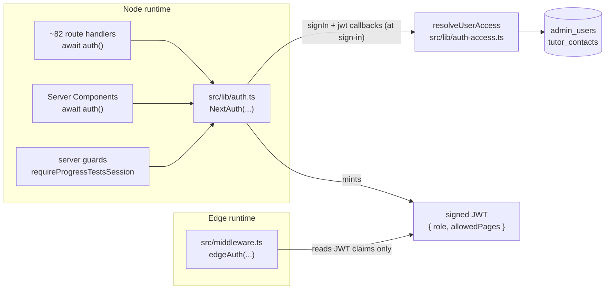
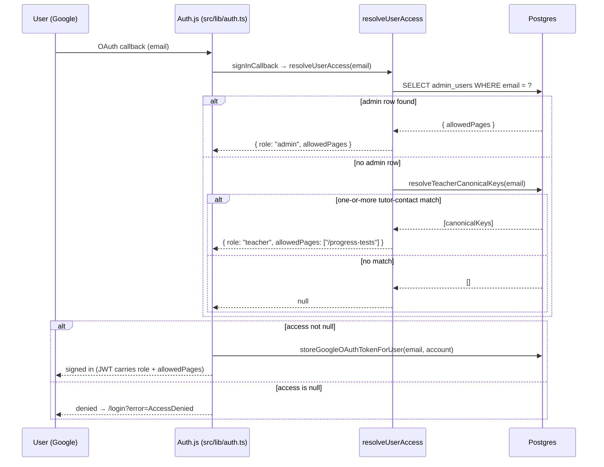
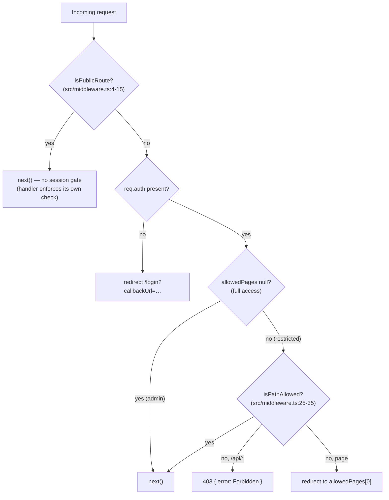

# Auth & Access

> **Operations doc.** How a request is authenticated and authorized in BGScheduler: the Auth.js (NextAuth v5) Google provider, the `admin_users` allowlist, the two-role (`admin`/`teacher`) access model, the middleware gate (and which paths bypass it), and the deliberate split between the Node `auth` config and the edge `auth-edge` config. Mechanical env-var detail lives in [`docs/reference/env.md`](../reference/env.md); cron-secret mechanics are shared with [`docs/reference/crons.md`](../reference/crons.md).

## Summary

Authentication is **Google OAuth via Auth.js (NextAuth v5 beta)**, stored as a JWT session (no database session table). Sign-in is **fail-closed**: a Google account is admitted only if `resolveUserAccess` resolves it to a role, otherwise the `signIn` callback returns `false` and Auth.js denies access (`src/lib/auth.ts:34-41`).

Two roles exist (`src/lib/auth-access.ts:21`):

- **`admin`** — email present in the `admin_users` table. Full access by default; optionally **page-restricted** when the row carries a non-null `allowed_pages` list.
- **`teacher`** — not an admin, but the email matches an **active tutor contact**. Restricted to `/progress-tests`, read-only and scoped to the teacher's own students.

Authorization is enforced at three layers (defense-in-depth): the **edge middleware** gate on every request, an in-handler `auth()` check in route handlers (82 handlers under `src/app/api/**` call `await auth()`), and **server-side role guards** in sensitive domains (e.g. `requireProgressTestsSession` / `requireProgressTestsAdminSession`).

## The two NextAuth configs (Node vs edge)

NextAuth is instantiated **twice**, because the middleware runs in the Vercel **edge runtime** (no Node APIs, no database driver) while route handlers and Server Components run in the **Node runtime**.

| | Node config | Edge config |
|---|---|---|
| File | `src/lib/auth.ts` | `src/lib/auth-edge.ts` |
| Export used elsewhere | `handlers`, `signIn`, `signOut`, `auth` | `edgeAuth` |
| Consumed by | API route `/api/auth/[...nextauth]` (`src/app/api/auth/[...nextauth]/route.ts`), every route handler / Server Component via `auth()` | `src/middleware.ts` only |
| DB access at request time | Yes (`signIn` + `jwt` callbacks call `resolveUserAccess`, which reads `admin_users` + tutor contacts) | **No** — the `jwt` callback is a pass-through; it only reads token claims (`src/lib/auth-edge.ts:22-26`) |
| Google scope requested | `openid email profile …/auth/spreadsheets` (read/write) — `src/lib/auth.ts:23` | `openid email profile …/auth/spreadsheets.readonly` — `src/lib/auth-edge.ts:11` |

**Why the split matters.** The role + page-access decision is a database operation, so it can only happen in the Node config. The Node `jwt` callback runs **once at sign-in** (when `user` is present), resolves `allowedPages` and `role`, and persists them onto the JWT (`src/lib/auth.ts:42-51`). Every subsequent request — including the edge middleware — reads those claims off the already-signed token without touching the database (`src/lib/auth-edge.ts:27-31`, `src/middleware.ts:52`). This is what keeps the middleware fast and edge-compatible.

> **Note (potential drift):** the two configs request **different OAuth scopes** — the Node config asks for full `spreadsheets`, the edge config asks for `spreadsheets.readonly`. The token's granted scope is whatever was consented to during the OAuth flow that actually minted it; the scope string on a config only matters for the provider config that drives the consent screen (the Node `/api/auth/[...nextauth]` handler). The edge config never initiates a sign-in (middleware only verifies tokens), so its narrower scope string is effectively inert. Flagged below in [Open questions](#open-questions) in case the intent was for both to match.



## Sign-in flow (who is admitted)

The Google provider is the only provider (`src/lib/auth.ts:17-28`). On a successful Google handshake, Auth.js runs the `signIn` callback:

1. `signInCallback({ user })` calls `resolveUserAccess(user.email)` (`src/lib/auth.ts:34-35`, `src/lib/auth.ts:5-14`).
2. `resolveUserAccess` (`src/lib/auth-access.ts:39-59`):
   - normalizes the email (`trim().toLowerCase()`); empty → `null`;
   - looks up `admin_users` by normalized email → if found, returns `{ role: "admin", allowedPages: row.allowed_pages ?? null }` (**admins take precedence**);
   - otherwise calls `resolveTeacherCanonicalKeys(email)`; if it returns ≥1 canonicalKey, returns `{ role: "teacher", allowedPages: ["/progress-tests"] }`;
   - otherwise returns `null`.
3. Back in the callback, a `null` result means the email is neither admin nor known teacher → the callback returns `false` and **sign-in is denied** (`src/lib/auth.ts:13`, `src/lib/auth.ts:36-40`). The user is bounced to `/login?error=AccessDenied`; the login page renders "Access denied. Your email is not on the admin allowlist." (`src/app/login/page.tsx:26-28`).
4. If admitted **and** the email is present, the callback fires `storeGoogleOAuthTokenForUser(email, account)` to persist the Google OAuth token for downstream Sheets access (`src/lib/auth.ts:36-39`).

This is the same fail-closed posture as the original admin-only allowlist, now widened to also admit teachers matched against live tutor data (`src/lib/auth-access.ts:6-8`).



### Teacher resolution

`resolveTeacherCanonicalKeys` (`src/lib/progress-tests/teacher-access.ts:41-114`) matches the login email against **active** `tutor_contacts` rows by normalized onsite **or** online email, seeds the result with those rows' canonicalKeys, then bridges any split online/onsite Wise identities via the active snapshot's identity groups. An empty result is fail-closed (no rows / access denied). This same function is used both at sign-in (eligibility) and per-request by the progress-tests dashboard, so a fresh snapshot is reflected immediately. Feature-level meaning lives in [`docs/features/student-promotions.md`](../features/student-promotions.md) (cross-check the route-vs-doc-name note in [Open questions](#open-questions)).

## The `admin_users` allowlist

Table `admin_users` (`src/lib/db/schema.ts:302-312`):

| Column | Type | Meaning |
|---|---|---|
| `id` | `uuid` PK | — |
| `email` | `text NOT NULL` | unique (`admin_users_email_idx`, `src/lib/db/schema.ts:311`); compared case-insensitively against the normalized login email |
| `name` | `text` | optional display name |
| `allowed_pages` | `jsonb` (`string[]` or `null`) | **`null` = full access** (all unrestricted admins); a non-null list = page-restricted to those route prefixes (`src/lib/db/schema.ts:306-308`) |
| `created_at` | `timestamptz` | defaults `now()` |

`admin_users` is **snapshot-independent** — it survives snapshot rotation (it is in the Core/Auth domain, not scoped to a `snapshot_id`).

### How many admins? (Not hardcoded — do not trust prose counts)

**There is no admin-email list, and no admin count, anywhere in the source tree.** The allowlist is **data**, populated into `admin_users` at seed time from the `SEED_ADMIN_EMAILS` environment variable:

```text
src/lib/db/seed.ts:31    const adminEmails = process.env.SEED_ADMIN_EMAILS?.split(",").filter(Boolean) ?? [];
src/lib/db/seed.ts:32-40 → INSERT … onConflictDoNothing(email) for each
```

So the authoritative count is a **runtime property of the `admin_users` table in the target database**, set by whoever ran `db:seed` with which `SEED_ADMIN_EMAILS` value (and any rows added directly since). The seed command form is:

```bash
DATABASE_URL=... SEED_ADMIN_EMAILS=email1,email2 npm run db:seed
```

To read the live count, query the database directly — e.g. `SELECT count(*) FROM admin_users WHERE allowed_pages IS NULL;` for full admins, or drop the `WHERE` for all rows including restricted users.

> Any fixed number of admin emails appearing in prose docs (e.g. an "N allowlisted" line in `AGENTS.md`) is **not derived from code** and may be stale. This document deliberately does not restate such a count.

### The one hardcoded entry: a restricted user

The seed script **does** hardcode a single **restricted** (page-limited) user, distinct from the env-driven admin set (`src/lib/db/seed.ts:46-60`):

```text
{ email: "m.giftwan@gmail.com", allowedPages: ["/progress-tests"] }
```

This row is upserted with `onConflictDoUpdate` so its `allowed_pages` is always reset to `["/progress-tests"]`. It is intentionally **not** in `SEED_ADMIN_EMAILS` (which would grant full access) — it is an `admin_users` row of role `admin` but restricted by `allowed_pages` to the progress-tests surface only (`src/lib/db/seed.ts:45-49`).

## The middleware gate

`src/middleware.ts` wraps the request in `edgeAuth(...)` (`src/middleware.ts:37`). Order of operations:

1. **Public-route bypass** — if `isPublicRoute(pathname)` matches, return `NextResponse.next()` with no auth (`src/middleware.ts:40-42`).
2. **Require a session** — otherwise, if `!req.auth`, redirect to `/login`, preserving the original path+query as `callbackUrl` (`src/middleware.ts:45-49`).
3. **Page-level access control** — read `allowedPages` off the token (`null` = full access). For a restricted user whose path is not allowed (`!isPathAllowed`): API paths get a **403 JSON** `{ error: "Forbidden" }`; page paths get a **redirect** to the user's landing page `allowedPages[0]`, guarded against a redirect loop (`src/middleware.ts:51-62`).
4. Otherwise `NextResponse.next()`.

**Matcher** (`src/middleware.ts:67-69`): runs on everything except `_next/static`, `_next/image`, and `favicon.ico`.

### Paths that bypass auth (`isPublicRoute`)

The bypass set is broader than just login/auth/internal. The **authoritative list is the code** (`src/middleware.ts:4-15`):

| Match | Rule in `isPublicRoute` |
|---|---|
| `/login`, `/login/...` | `pathname.startsWith("/login")` |
| `/api/auth`, `/api/auth/...` | `pathname.startsWith("/api/auth")` (Auth.js catch-all) |
| `/api/search/assistant` | exact (`pathname === …`) — public NL search assistant |
| `/api/classrooms/floor-plan-map` | exact — public floor-plan map |
| `/api/line/webhook` | exact — LINE webhook (verified in-handler by LINE signature) |
| `/api/line/contacts/oa-resolver/worklist` | exact |
| `/api/line/contacts/oa-resolver/runs/{id}/rows` | regex `^/api/line/contacts/oa-resolver/runs/[^/]+/rows$` |
| `/api/internal/`, `/api/internal/...` | `pathname.startsWith("/api/internal/")` — all cron jobs |

> **Bypass is not the same as unauthenticated in effect.** A path that bypasses the *session* middleware still enforces its own check inside the handler: `/api/internal/*` requires a constant-time `CRON_SECRET` (below); `/api/line/webhook` verifies the LINE channel signature; the public search/floor-plan/OA-resolver endpoints are intentionally open read surfaces. Bypassing the middleware only means "the JWT session gate does not apply here."



### Page-level access matching (`isPathAllowed`)

For a restricted user, the path is allowed when it matches an allowed prefix **as a page or as that prefix's API namespace** (`src/middleware.ts:25-35`). For each `page` in `allowedPages`, the path is allowed if it equals `page`, starts with `page/`, equals `/api{page}`, or starts with `/api{page}/`. So `allowedPages: ["/progress-tests"]` admits `/progress-tests`, `/progress-tests/...`, `/api/progress-tests`, and `/api/progress-tests/...` — and nothing else.

## In-handler and server-side guards (defense-in-depth)

The middleware is **not** the only gate. Route handlers and Server Components independently call `auth()`:

- **Route handlers** follow the standard contract — `await auth()`, and on a falsy session return **401** `{ error: "Unauthorized" }` before any work. Canonical example (`src/app/api/filters/route.ts:5-9`). Across `src/app/api/**`, **82 route handlers** call `await auth()`.
- **Server Components** read `auth()` to drive UI. The `(app)` layout resolves the session and passes `allowedPages` to the nav so links are filtered to what the user may reach (`src/app/(app)/layout.tsx:11-13`), wrapped in `<Suspense>` so the uncached `auth()` call does not block the route group under Next 16 `cacheComponents`.

### Role guards for `/progress-tests`

The progress-tests surface adds an explicit **role** gate on top of page access (`src/lib/progress-tests/api.ts`):

- `requireProgressTestsSession()` — reads `auth()`, throws `"Unauthorized"` if email/name missing, throws `"Forbidden"` if `hasPageAccess(allowedPages, "/progress-tests")` is false, then returns `{ email, name, role }` where `role` is `"teacher"` only when the token's role is `"teacher"`, else `"admin"` (`src/lib/progress-tests/api.ts:32-47`).
- `requireProgressTestsAdminSession()` — wraps the above and additionally throws `"Forbidden"` unless `role === "admin"`. **Every mutating progress-tests route uses this**, so a teacher session is rejected with 403 before any write — that is what makes the teacher view read-only (`src/lib/progress-tests/api.ts:49-63`).
- `hasPageAccess(allowedPages, route)` mirrors the middleware's `isPathAllowed` for the page form (`null` = full access; else prefix match) and is documented as "defense-in-depth alongside middleware" (`src/lib/progress-tests/api.ts:8-21`).

The page itself (`src/app/(app)/progress-tests/page.tsx:6-18`) calls `requireProgressTestsSession()` and redirects to `/login` on `"Unauthorized"`.

## Cron / internal auth (`CRON_SECRET`)

Internal jobs under `/api/internal/*` bypass the session middleware and instead require a **constant-time bearer secret** comparison (design ID **REL-07**). The shared helper is `src/lib/internal/cron-auth.ts`:

- `getCronSecretStatus(request)` returns `"valid" | "invalid" | "missing-secret"`. It builds `Bearer ${CRON_SECRET}`, does a **length pre-check** (avoids the `RangeError` `timingSafeEqual` throws on length-mismatched buffers, and is itself O(1) so it does not leak the secret length via timing), then `timingSafeEqual`.
- `rejectInvalidCronSecret(request)` returns a `NextResponse` to short-circuit (500 when the secret is unset, 401 when the header is wrong) or `null` when valid.

The Wise snapshot sync route demonstrates the pattern and a dual-auth twist (`src/app/api/internal/sync-wise/route.ts`):

- It **inlines its own** copy of the constant-time check (`hasValidCronSecret`, `src/app/api/internal/sync-wise/route.ts:11-29`) rather than importing the shared helper — behaviorally identical, but a duplicate worth knowing about (see [Open questions](#open-questions)).
- **`GET`** (Vercel cron) accepts the cron secret only (`allowSessionAuth: false`, `src/app/api/internal/sync-wise/route.ts:69-71`).
- **`POST`** accepts the cron secret **or** a logged-in Auth.js session (`allowSessionAuth: true`) so an admin can trigger a manual sync from the browser, falling through to `auth()` when the secret is absent (`src/app/api/internal/sync-wise/route.ts:45-58`, `:73-76`). The trigger source (`cron` vs `admin`, with `actorEmail`) is recorded via `withCronInvocationAudit`.
- `maxDuration = 800` (Vercel Pro headroom) is set on the route module (`src/app/api/internal/sync-wise/route.ts:7`).

A separate admin-session-only trigger exists at `POST /api/admin/sync-wise`, which gates purely on `auth()` → 401 (`src/app/api/admin/sync-wise/route.ts:8-12`).

## Session shape (token claims)

The JWT and session are augmented in `src/types/next-auth.d.ts` (the `JWT` re-export there is load-bearing — without it the `declare module "next-auth/jwt"` augmentation does not merge; `src/types/next-auth.d.ts:9-18`):

- `session.user.allowedPages?: string[] | null` and `session.user.role?: "admin" | "teacher" | null` (`src/types/next-auth.d.ts:20-27`).
- `JWT.allowedPages` and `JWT.role` carry the same (`src/types/next-auth.d.ts:29-34`).

These claims are written once in the Node `jwt` callback at sign-in and read everywhere else; the Node `session` callback copies them onto `session.user` (`src/lib/auth.ts:52-56`), and the edge `session` callback does the same for middleware (`src/lib/auth-edge.ts:27-31`).

## Required environment variables (auth-relevant)

Validated at startup by `src/lib/env.ts` (Zod; throws on invalid). Auth-relevant subset:

| Var | Schema (`src/lib/env.ts`) | Role |
|---|---|---|
| `AUTH_GOOGLE_ID` | `z.string().min(1)` (`:5`) | Google OAuth client ID |
| `AUTH_GOOGLE_SECRET` | `z.string().min(1)` (`:6`) | Google OAuth client secret |
| `AUTH_SECRET` | `z.string().min(1)` (`:7`) | Auth.js JWT/session signing key |
| `CRON_SECRET` | `z.string().min(1)` (`:12`) | bearer secret for `/api/internal/*` |
| `DATABASE_URL` | `z.string().url()` (`:4`) | backs `admin_users` + tutor-contact lookups |

`SEED_ADMIN_EMAILS` is **not** in the env schema — it is read directly in the seed script (`src/lib/db/seed.ts:31`) and is only relevant at seed time, not at runtime. Full env reference: [`docs/reference/env.md`](../reference/env.md).

## Open questions

- **Scope mismatch between configs.** `src/lib/auth.ts:23` requests full `…/auth/spreadsheets`; `src/lib/auth-edge.ts:11` requests `…/auth/spreadsheets.readonly`. The edge config never drives a sign-in (middleware only verifies), so its scope string is effectively unused — but it is unclear whether the divergence is intentional or leftover. Confirm which scope the production OAuth consent screen actually grants.
- **Duplicated cron-secret check.** `src/app/api/internal/sync-wise/route.ts:11-29` reimplements the constant-time comparison instead of importing `rejectInvalidCronSecret` / `getCronSecretStatus` from `src/lib/internal/cron-auth.ts`. Behaviorally equivalent today; a candidate for consolidation so REL-07 has a single source of truth.
- **Live admin count is data, not code.** Confirm the actual `admin_users` population (full admins where `allowed_pages IS NULL`, plus restricted rows) against the target database; it cannot be derived from the source tree, and prose counts elsewhere may be stale.
- **Teacher feature doc naming.** Teacher access targets `/progress-tests` (`src/lib/auth-access.ts:19`, `src/lib/db/seed.ts:48`), while the on-disk feature doc is `docs/features/student-promotions.md`. Verify these describe the same surface (route vs. doc name) and align the cross-link if they have diverged.

_Verified against HEAD `d4fe6d3` on 2026-06-05._
