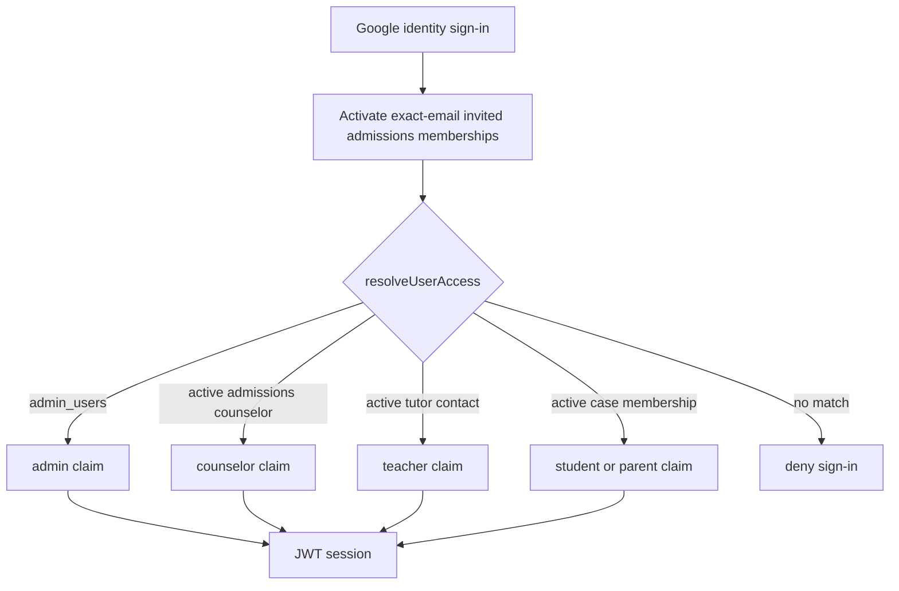

# Auth and access

BGScheduler uses Auth.js v5 with Google identity. Authentication establishes who the user is; authorization is resolved from Postgres and, for University Admissions, rechecked against the requested case on every request.

The live model has five roles:

| Role | Identity source | Page scope |
|---|---|---|
| `admin` | `admin_users` | `allowed_pages` from the row; null means full application access |
| `counselor` | active `admissions_counselors` row | `/admissions` only |
| `teacher` | active tutor contact | `/progress-tests` only |
| `student` | active admissions case membership | `/admissions` only |
| `parent` | active admissions case membership | `/admissions` only |

Unknown identities are denied. The role claim controls navigation and route-prefix access, not case-level authority.

## Sign-in flow


```mermaid
flowchart TD
    A["Google identity sign-in"] --> B["Activate exact-email invited admissions memberships"]
    B --> C{"resolveUserAccess"}
    C -->|admin_users| D["admin claim"]
    C -->|active admissions counselor| E["counselor claim"]
    C -->|active tutor contact| F["teacher claim"]
    C -->|active case membership| G["student or parent claim"]
    C -->|no match| H["deny sign-in"]
    D --> I["JWT session"]
    E --> I
    F --> I
    G --> I
```

`resolveUserAccess` applies this precedence:

1. `admin_users`;
2. active `admissions_counselors`;
3. active tutor contact;
4. active `admissions_case_members`.

If an email is a student on one case and a parent on another, the JWT receives the higher-precedence `student` claim. Per-case access still comes from that case's membership row, so the global claim does not grant student rights on the parent-linked case.

At sign-in, `activateMembershipsForEmail` changes matching invited/bounced admissions memberships to active before access resolution. The exact email must match; an invitation link is not a bearer credential and grants no access by itself.

The role-neutral login page is `/login`. Its default destination is `/admissions`, and invitations link to:

```text
https://bgscheduler.vercel.app/login?callbackUrl=/admissions
```

## Google OAuth scopes

Ordinary sign-in is identity-only in both Auth.js configurations:

```text
openid email profile
```

It does not request Google Sheets access and does not persist a Google token.

Sheets consent is an explicit, in-context staff action such as **Connect Google Sheets** in Sales Dashboard or **Connect Sheets** in the admissions import wizard. The action restarts Google OAuth with a Sheets scope and `prompt=consent`. `shouldPersistGoogleSheetsToken` stores the token only when all of the following are true:

- the resolved role is `admin` or `counselor`;
- the provider is Google;
- the granted scope includes `spreadsheets` or `spreadsheets.readonly`.

Student and parent tokens are never stored, even if a crafted request asks Google for a Sheets scope. Stored access/refresh tokens are encrypted with AES-256-GCM using a key derived from `AUTH_SECRET`.

Token persistence rechecks a current `admin_users` row or active counselor row
inside the write transaction. A transaction-scoped advisory lock serializes
that write with counselor activation/deactivation; deactivation removes a
counselor-only token in the same transaction, while an independently
allowlisted admin keeps it. Token reads and refresh writes repeat the live
owner check, so a stale session cannot use a revoked counselor's connection.

Admissions imports use a read-only Sheets grant. Leave-request status writeback and other existing write integrations require the full Sheets scope.

## Middleware and session gate

`src/middleware.ts` uses the edge-safe Auth.js instance to validate the JWT cookie. It also enforces the token's `allowedPages` prefixes. Restricted users can reach their allowed page and matching `/api` namespace; `/api/home/summary` is shared.

Admissions staff guards also reload the admin row's current `allowedPages` or
the counselor registry state from Postgres on every request. Removing
`/admissions` or deactivating a counselor therefore takes effect before the
JWT expires.

Unauthenticated page requests redirect to `/login?callbackUrl=…`. Unauthenticated API handlers also defend themselves with a session check.

The middleware intentionally bypasses session auth for:

- `/login`;
- `/api/auth/*`;
- `/api/internal/*`, which enforce `CRON_SECRET` in the handler;
- the public search assistant and classroom floor-plan asset;
- the LINE webhook and the two token-gated OA-resolver routes.

Public middleware status never means an endpoint is unauthenticated in practice: cron, LINE, and extension routes verify their own bearer/signature contract.

## Admissions case authorization

Every case-scoped admissions request calls `requireCaseAccess(email, caseId, minRole)`. It:

1. validates the email and UUID-shaped case id;
2. checks `admin_users` (admins may access every existing non-deleted case);
3. loads the case and its lifecycle/family-portal state;
4. requires an active membership for this exact case for non-admins;
5. requires an active global counselor registry row for counselor memberships;
6. applies family portal and lifecycle rules;
7. enforces `parent < student < counselor < admin`.

For non-admins, an invalid, missing, deleted, or unassigned case returns Forbidden rather than revealing whether the case exists. Membership revocation and counselor deactivation take effect on the next request; the JWT claim is not trusted for these checks.

Cross-case staff endpoints use `requireCounselorOrAdmin`; cohort/counselor/template administration uses `requireAdmissionsAdmin`.

### Family portal and lifecycle

Family access is opt-in per case. `family_portal_open` defaults to false.

| Case state | Student/parent access |
|---|---|
| Portal closed | denied |
| `active`, portal open | normal role-shaped access |
| `committed`, portal open | normal role-shaped access |
| `completed`, portal open | read-only; mutation routes call `assertCaseMutationAllowed` |
| `withdrawn` | denied, regardless of membership/portal state |
| `archived` | denied, regardless of membership/portal state |

Closing a portal immediately denies family deep links and APIs. It does not delete or revoke memberships. Staff access remains governed by assignment and registry status.

The valid staff-controlled lifecycle is:

- `active → committed`;
- `active → withdrawn`;
- `committed → completed`;
- `completed → archived`;
- `withdrawn → archived`.

Same-state and invalid transitions return Conflict. Recording the committed-college event writes the event, committed pointer, and `committed` case status atomically. Completed, withdrawn, and archived remain explicit staff actions.

## Admissions write ownership

| Surface | Student | Assigned counselor | Admin | Parent |
|---|---:|---:|---:|---:|
| Own self-report/profile answers | edit | edit/review with attribution | edit/review | no |
| Activities, awards, essays, test sittings | edit allowed fields | edit/verify/release | edit/verify/release | no |
| College research and interest events | edit | edit | edit | no |
| Student-owned college requirement status | edit | edit/verify | edit/verify | no |
| Academics, college list/rounds, official application events | view | edit | edit | no |
| Decisions, committed college, financial-aid outcomes | view | edit | edit | no |
| Members, portal state, lifecycle, meetings, notes, direct messages, import | no | edit assigned case | edit | no |
| Cohorts, counselor registry, checklist templates | no | read where supported | edit | no |

All mutation routes parse and validate after authorization. Completed-family mutation attempts are rejected before request-body parsing.

## Parent data boundary

Parents never receive the staff case-detail DTO. `buildParentDashboard` constructs a closed object field-by-field and is the only parent case projection.

Approved families of data include:

- profile and explicitly shared About You fields;
- academic records;
- checklist/progress/deadlines;
- colleges, rounds, majors, application state, decision dates, completeness, and generic requirements;
- recommenders and submission state;
- essay metadata, with a Google Docs link only when that essay is explicitly shared;
- activities and awards, excluding internal award notes;
- test milestones, with scores/details only when `scoreReleasedToParent` is true;
- scholarships and financial-aid comparison totals;
- announcements and `shared_with_family` notes.

Forbidden by construction: staff-only notes, audit history, member emails, internal IDs, `wiseStudentKey`, Google/OAuth tokens, accommodations, unreleased score values/details, private self-reflection, internal award notes, and unshared essay links. Family-facing links are also revalidated while projecting the payload; unsafe legacy URLs or URLs with embedded credentials are returned as `null`/omitted rather than rendered.

`GET /api/admissions/family-cases` is parent-only and returns safe route hrefs plus child display fields. It lists only active parent memberships on open, non-deleted `active`/`committed`/`completed` cases. The destination route rechecks access.

## People, invitations, and revocation

Staff use the case's People & Access surface to add/reassign counselors, add parents, change a member email, revoke, reactivate, and resend.

- Counselor memberships are active immediately but still require an active counselor registry row.
- Family memberships begin invited.
- Opening a portal queues invites for eligible student/parent memberships.
- Adding a family member or changing their email while the portal is open queues a new invite.
- Reactivation and resend create new audited invitation attempts.
- Revoked memberships fail the next per-request check.

Invitation rows are inserted into `admissions_notification_outbox` in the same transaction as the membership/portal mutation. Delivery is attempted after commit; a failure never rolls back the business change. The admissions-notifications cron retries due failed/pending rows. A unique dedupe key plus Resend idempotency prevents duplicate delivery.

Counselor direct messages follow the same rule: a client-generated UUID makes
the request idempotent, and the outbox row plus `queue` audit event commit
before delivery. Provider errors are returned as a visible queued/retryable
state. The worker discards a stale family message rather than sending when the
portal closes, membership/email changes, or the case leaves active/committed.

## Notification preferences

An active case member may manage digest preferences for announcements, tasks, and comments. Values are default, digest, or off at the API; defaults are represented by an absent stored key. Deadline reminders do not have a preference key and cannot be disabled.

## Audit and concurrency

Sensitive admissions mutations use `withAuditedTransaction`: the domain write and append-only audit row commit or roll back together. Shared records accept `expectedUpdatedAt` and return Conflict on stale edits. The admin casework view reads the append-only audit history; no update/delete route exists for audit rows.

## Operational checks

Use the [admissions rollout and recovery runbook](./admissions-import-rollout.md) for production migration, invitation-delivery, import, and containment procedures.

Important environment variables:

| Variable | Purpose |
|---|---|
| `AUTH_GOOGLE_ID`, `AUTH_GOOGLE_SECRET` | Google provider configuration |
| `AUTH_SECRET` | JWT/session secret and Google-token encryption root |
| `CRON_SECRET` | Protects `/api/internal/*`, including admissions notifications |
| `RESEND_API_KEY` | Admissions email transport |
| `ADMISSIONS_EMAIL_FROM` | Verified admissions sender |
| `ADMISSIONS_EMAIL_REPLY_TO` | Monitored reply address |

_Verified against the admissions parity branch on 2026-07-10._
