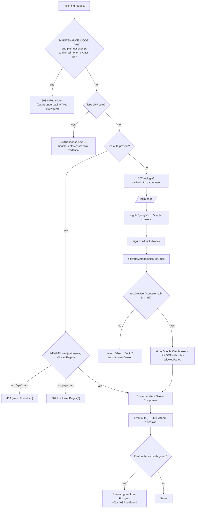
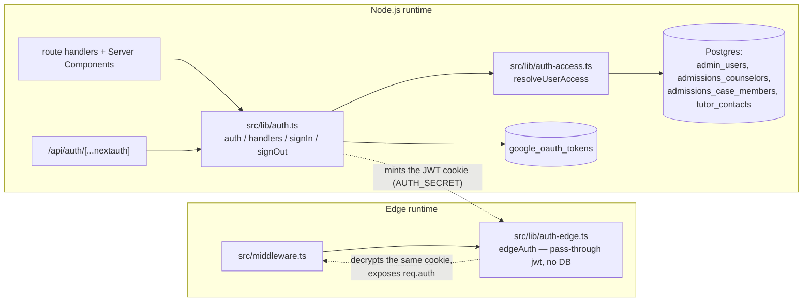

# Auth & Access

How BGScheduler decides **who may sign in** and **what they may reach once signed in**.

Identity comes from **Auth.js v5 (NextAuth)** with a single **Google** OAuth provider
(`next-auth: 5.0.0-beta.30`, `package.json:53`). There is no password login, no second
provider, and no database session adapter — the session is a JWT cookie.

This page owns the *model*: the sign-in gate, the JWT claims, the middleware, the fresh
per-feature guards, the `admin_users` allowlist, and the non-session credentials that cron,
LINE, the parent schedule link, and the OA-resolver extension use instead. Mechanical detail
lives elsewhere and is linked, not restated:

| Need | Canonical home |
|---|---|
| The auth tier of a specific endpoint | [`../reference/api/index.md`](../reference/api/index.md) |
| Columns of `admin_users` and the grant tables | [`../reference/database/index.md`](../reference/database/index.md) |
| Every environment variable | [`../reference/env.md`](../reference/env.md) |
| Cron schedules and the `CRON_SECRET` mechanics | [`../reference/crons.md`](../reference/crons.md) |
| Turning maintenance mode on and off | [`runbook.md`](./runbook.md) |

---

## The big picture

Access is decided in four layers, in this order:

1. **Sign-in gate** — the Auth.js `signIn` callback (`src/lib/auth.ts:50-57`) delegates to
   `resolveUserAccess` (`src/lib/auth-access.ts:56-85`). Node runtime, reads Postgres, runs
   **once per login**. Returns a role + `allowedPages`, or denies the login outright.
2. **JWT claims** — the resolved `role` and `allowedPages` are written onto the token
   (`src/lib/auth.ts:58-67`) and copied onto the session (`src/lib/auth.ts:68-72`). They stay
   frozen until the user signs out and back in.
3. **Middleware gate** — `src/middleware.ts` runs for every non-static request: maintenance
   gate → public-route allowlist → "is there a session?" → page-prefix check against
   `allowedPages`.
4. **Per-feature fresh guards** — several features re-resolve authorization from Postgres on
   **every** request, deliberately not trusting the (possibly stale) JWT claim. See
   [Layer 4](#layer-4--per-feature-fresh-guards).


```mermaid
flowchart TD
    A[Incoming request] --> M{"MAINTENANCE_MODE === 'true'<br/>and path not exempt<br/>and email not on bypass list?"}
    M -- yes --> M503["503 + Retry-After<br/>(JSON under /api, HTML elsewhere)"]
    M -- no --> B{isPublicRoute?}
    B -- yes --> Z[NextResponse.next — handler enforces its own credential]
    B -- no --> C{req.auth present?}
    C -- no --> D["307 to /login?callbackUrl=path+query"]
    C -- yes --> P{"isPathAllowed(pathname, allowedPages)"}
    P -- "no, /api/* path" --> F403["403 {error: Forbidden}"]
    P -- "no, page path" --> RL["307 to allowedPages[0]"]
    P -- yes --> E[Route handler / Server Component]
    E --> G["await auth() — 401 without a session"]
    G --> H{Feature has a fresh guard?}
    H -- yes --> I["Re-read grant from Postgres<br/>401 / 403 / notFound"]
    H -- no --> J[Serve]

    D --> L[/login page/]
    L --> N["signIn('google') → Google consent"]
    N --> O["signIn callback (Node)"]
    O --> Q[activateMembershipsForEmail]
    Q --> R{"resolveUserAccess(email) !== null?"}
    R -- no --> S["return false → /login?error=AccessDenied"]
    R -- yes --> T["store Google OAuth tokens;<br/>mint JWT with role + allowedPages"]
    T --> E
```

Three different questions, answered in three different places:

| Question | Answered by | When | Runtime |
|---|---|---|---|
| "May this Google identity exist here at all?" | `resolveUserAccess` inside the `signIn` callback | once, at login | Node |
| "Is there a valid session, and is this path in your lane?" | `src/middleware.ts` | every request | Edge (see [the split](#the-auth-vs-auth-edge-split)) |
| "Do you still hold this feature's grant right now?" | per-feature guard (Postgres read) | every request | Node |

---

## Layer 1 — Auth.js configuration

Two NextAuth instances exist, split by runtime. Only the Node one is described here; the edge
one is covered in [The auth vs auth-edge split](#the-auth-vs-auth-edge-split).

### Node instance — `src/lib/auth.ts`

`NextAuth({...})` at `src/lib/auth.ts:32-74` exports `handlers`, `signIn`, `signOut`, `auth`.

- **Provider**: Google, keyed by `AUTH_GOOGLE_ID` / `AUTH_GOOGLE_SECRET`
  (`src/lib/auth.ts:34-43`).
- **Scope**: `openid email profile https://www.googleapis.com/auth/spreadsheets
  https://www.googleapis.com/auth/drive.file`, with `access_type: "offline"` so Google issues
  a refresh token (`src/lib/auth.ts:39-40`). The Sheets **write** scope and the per-file
  Drive scope are requested because the same Google grant is reused for the Sheets/Drive
  integrations, not merely to identify the user.
- **Pages**: both `signIn` and `error` point at `/login` (`src/lib/auth.ts:45-48`), so OAuth
  failures land back on the app's own login screen.
- **`signIn` callback** (`src/lib/auth.ts:50-57`): runs `signInCallback({ user })`; when it
  returns `true` **and** the user has an email, it persists the Google OAuth tokens via a
  lazily imported `storeGoogleOAuthTokenForUser`, then returns the boolean. Returning `false`
  makes Auth.js abort the login and redirect to `/login?error=AccessDenied`.
- **`jwt` callback** (`src/lib/auth.ts:58-67`): `user` is only present at sign-in, so
  `resolveUserAccess` runs once more there and its `allowedPages` + `role` are frozen onto the
  token. The comment is explicit: "subsequent requests need no DB call". That is the design
  reason Layer 4 exists.
- **`session` callback** (`src/lib/auth.ts:68-72`): copies both claims onto `session.user`.

The claim shape is declared by module augmentation in `src/types/next-auth.d.ts:25-39`. It
imports the `UserRole` union from `src/lib/auth-access.ts` so the claim type cannot drift from
the resolver (`src/types/next-auth.d.ts:10-11, 21`). The file's `JWT` import/re-export is
load-bearing and documented as such (`src/types/next-auth.d.ts:13-17`).

### Session strategy and lifetime

Neither config sets `session.strategy`, `session.maxAge`, or an `adapter` — neither
`src/lib/auth.ts` nor `src/lib/auth-edge.ts` contains any of those keys. Auth.js therefore
applies its defaults: the strategy is `"jwt"` whenever no adapter is configured, and the
session is idle-expiring rather than server-tracked. Neither file passes a `secret:` option
either, so Auth.js reads `AUTH_SECRET` from the environment implicitly.

Consequences:

- The middleware can validate a session without a Postgres round-trip, which is what lets it
  run on the Edge runtime.
- `role` and `allowedPages` are **sticky**: a promotion, a demotion, or a deleted `admin_users`
  row takes effect only after sign-out and sign-in. Only the Layer-4 guards read live state.

### NextAuth route handler — `src/app/api/auth/[...nextauth]/route.ts`

The whole file is three lines: `import { handlers } from "@/lib/auth"; export const { GET,
POST } = handlers;` (`route.ts:1-3`). All of `/api/auth/*` — provider redirect, callback,
CSRF, session, sign-out — is served by the **Node** instance. The middleware must let
`/api/auth/*` through unauthenticated because the OAuth handshake happens before any session
exists.

### Side effect: Google tokens are stored at sign-in

`storeGoogleOAuthTokenForUser` (`src/lib/sales-dashboard/google-oauth.ts:95-139`) upserts a
`google_oauth_tokens` row keyed by lowercased email. The encryption key is
`sha256(AUTH_SECRET)` (`google-oauth.ts:41-45`); values are AES-256-GCM with a random 12-byte
IV and the auth tag stored alongside (`google-oauth.ts:47-58`). A refresh token is never
overwritten with `null` — when Google omits one on re-consent, the previously stored ciphertext
is kept (`google-oauth.ts:115-117, 128-130`).

So `AUTH_SECRET` protects **both** the session cookie and every stored refresh token. Rotating
it signs everyone out *and* invalidates every stored Google token.

Several workspaces call `signIn("google", { callbackUrl: … })` again from inside the app to
reconnect Google (sales dashboard, leave requests, post-class feedback). That re-runs the same
`signIn` callback, so the token row is refreshed through the same path.

---

## The auth vs auth-edge split

The middleware runs on the Edge runtime, which has no Postgres driver. But the sign-in decision
and the token write **need** the database. Hence two NextAuth configs that share one cookie.


```mermaid
flowchart LR
    subgraph Edge["Edge runtime"]
      MW["src/middleware.ts"] --> EA["src/lib/auth-edge.ts<br/>edgeAuth — pass-through jwt, no DB"]
    end
    subgraph Node["Node.js runtime"]
      RT["route handlers + Server Components"] --> NA["src/lib/auth.ts<br/>auth / handlers / signIn / signOut"]
      NX["/api/auth/[...nextauth]"] --> NA
      NA --> AA["src/lib/auth-access.ts<br/>resolveUserAccess"]
      AA --> DB[("Postgres:<br/>admin_users, admissions_counselors,<br/>admissions_case_members, tutor_contacts")]
      NA --> GT[("google_oauth_tokens")]
    end
    NA -. "mints the JWT cookie (AUTH_SECRET)" .-> EA
    EA -. "decrypts the same cookie,<br/>exposes req.auth" .-> MW
```

| | `src/lib/auth-edge.ts` (`edgeAuth`) | `src/lib/auth.ts` (`auth`, `handlers`, `signIn`, `signOut`) |
|---|---|---|
| Runtime | Edge | Node.js |
| Exports | only `auth`, aliased `edgeAuth` (`auth-edge.ts:4`) | `handlers`, `signIn`, `signOut`, `auth` (`auth.ts:32`) |
| `signIn` callback | **none** — no allowlist lookup | present (`auth.ts:50-57`) |
| `jwt` callback | pass-through, commented "Edge runtime: no DB access" (`auth-edge.ts:22-26`) | resolves role + allowedPages once at sign-in (`auth.ts:58-67`) |
| `session` callback | maps token claims onto `session.user` (`auth-edge.ts:27-31`) | same mapping (`auth.ts:68-72`) |
| Google scope | `…/spreadsheets.readonly` (`auth-edge.ts:11`) | `…/spreadsheets` + `…/drive.file` (`auth.ts:39`) |
| Imports `auth-access` | never (`src/lib/auth-access.ts:18-19`) | yes (`auth.ts:3`) |
| Imported by | `src/middleware.ts:1` and its test — **nothing else** in `src/` | 90 of the 158 non-internal `route.ts` files directly, 5 internal sync routes, the Auth.js catch-all, 22 `page.tsx` files plus `(app)/layout.tsx`, and the domain guard modules in `src/lib/*/access.ts` / `api.ts` |

The edge instance is a **stripped-down validator**. It never runs a consent flow and never
writes anything; it exists so the middleware can decrypt the cookie the Node instance minted
and read `allowedPages` / `role` off it. Both instances read the same `AUTH_SECRET`, which is
what makes one cookie readable on both sides.

The **scope divergence** is real in the source. Because only `/api/auth/*` (Node) ever runs the
consent flow, the narrower edge scope is inert today. Flagged in
[Open questions](#open-questions).

> **Next.js 16 note.** The repo uses the `middleware.ts` file convention (`src/middleware.ts`,
> default export at `:69`). Next 16 documents that convention as deprecated and renamed to
> `proxy.ts` (`node_modules/next/dist/docs/01-app/03-api-reference/03-file-conventions/proxy.md:11`).
> The same doc records why the runtime split exists: "Middleware defaults to run at the Edge
> Runtime" (`proxy.md:743`) whereas "Proxy defaults to using the Node.js runtime"
> (`proxy.md:219`). A migration to `proxy.ts` would change the runtime this file runs on and
> would therefore reopen the question of whether `auth-edge.ts` is still needed.

---

## Layer 2 — The sign-in decision

### `signInCallback` — `src/lib/auth.ts:5-30`

Two steps, in a deliberate order:

1. **Admissions invite activation** (`src/lib/auth.ts:16-23`). If the user has an email,
   `activateMembershipsForEmail` flips that email's `invited` / `bounced`
   `admissions_case_members` rows to `active`. It runs **before** access resolution so a freshly
   invited student or parent passes the active-only membership filter on their very first
   sign-in. Failures are caught, logged with `console.error`, and never block the login.
2. **Access resolution** (`src/lib/auth.ts:28-29`). `resolveUserAccess(user.email)` returns
   `UserAccess | null`; the callback returns `access !== null`.

The isolation is tested: when activation throws, an **existing** admin still signs in, but an
**invited-only** email is still denied — fail-closed
(`src/lib/auth/__tests__/signin-callback.test.ts:90-111`). The activate-before-resolve order is
pinned at `:72-88`.

### `resolveUserAccess` — `src/lib/auth-access.ts:56-85`

Node-only: it does DB work, and the header states the edge config never imports it
(`src/lib/auth-access.ts:18-19`). The email is trimmed and lowercased first; an empty email
returns `null` with no lookup (`:60-61`).


```mermaid
flowchart TD
    S[normalized email] --> A{admin_users row?}
    A -- yes --> A1["role: admin<br/>allowedPages = row.allowed_pages<br/>(null = full access)"]
    A -- no --> B{active admissions_counselors row?}
    B -- yes --> B1["role: counselor<br/>allowedPages: ['/admissions']"]
    B -- no --> C{email matches an active tutor_contacts row?}
    C -- yes --> C1["role: teacher<br/>allowedPages: ['/progress-tests']"]
    C -- no --> D{active admissions_case_members row?}
    D -- student --> D1["role: student<br/>allowedPages: ['/admissions']"]
    D -- parent --> D2["role: parent<br/>allowedPages: ['/admissions']"]
    D -- none --> E["null → sign-in DENIED"]
```

Five roles exist (`UserRole`, `src/lib/auth-access.ts:31`), resolved first-match-wins:

| # | Role | Source of truth | `allowedPages` | Code |
|---|---|---|---|---|
| 1 | `admin` | any `admin_users` row — the table has no `active` flag | the row's `allowed_pages`; `null` = full access | `auth-access.ts:63-68` |
| 2 | `counselor` | `admissions_counselors` with `active = true` | `["/admissions"]` | `auth-access.ts:70-73` |
| 3 | `teacher` | ≥1 active `tutor_contacts` row whose onsite **or** online email matches | `["/progress-tests"]` | `auth-access.ts:75-78` |
| 4 | `student` | active `admissions_case_members` with role `student` | `["/admissions"]` | `auth-access.ts:80-82` |
| 5 | `parent` | active `admissions_case_members` with role `parent` | `["/admissions"]` | `auth-access.ts:80-82` |
| — | *denied* | none of the above | — | `auth-access.ts:84` |

Two ordering subtleties, both pinned by `src/lib/__tests__/auth-access.test.ts`:

- **Admin wins over everything.** An admin who also appears as a tutor contact or a case
  member keeps their admin view; the test asserts the two later lookups are not even called
  (`auth-access.test.ts:31-37`).
- **Teacher beats student/parent.** `resolveAdmissionsRole` runs *before* the teacher lookup so
  the counselor branch can short-circuit, but a non-counselor admissions result is **held** until
  the teacher check loses (`auth-access.ts:70-82`; test `:78-85`).

`resolveAdmissionsRole` (`src/lib/admissions/access.ts:37-61`) checks the active counselor
registry first, then active case memberships across all cases, preferring `student` over
`parent` for the global claim. Per-case rights are re-derived later by `requireCaseAccess`.

The teacher lookup is the non-trivial one. A tutor often has two Wise identities (onsite plus
"… Online"); `resolveTeacherCanonicalKeys` matches `tutor_contacts` by either email
(`src/lib/progress-tests/teacher-access.ts:59-64`), then bridges split identities through the
active snapshot's identity-group display names (`:76-111`) so one login covers both accounts.
An unknown email returns `[]`, which the caller treats as "not a teacher".

---

## Layer 3 — The middleware gate

`src/middleware.ts` wraps the edge auth instance (`export default edgeAuth((req) => …)`,
`:69`) and runs for every request the matcher admits.

### The matcher

```ts
// src/middleware.ts:111-113
export const config = {
  matcher: ["/((?!_next/static|_next/image|favicon.ico).*)"],
};
```

Everything except Next.js static assets and the favicon passes through — pages **and** API
routes alike.

### Order of checks

The handler body (`src/middleware.ts:69-109`) evaluates four things in a fixed order. The
order is load-bearing and commented in the source.

| # | Check | Outcome | Lines |
|---|---|---|---|
| 1 | **Maintenance gate** — `MAINTENANCE_MODE === "true"`, path not exempt, signed-in email not on `MAINTENANCE_BYPASS_EMAILS` | `503` with `Retry-After: 3600`; JSON under `/api/`, an inline-styled HTML page elsewhere | `:76-82`, `src/lib/maintenance.ts:120-134` |
| 2 | **Public route** — `isPublicRoute(pathname)` | `NextResponse.next()`; no session check, no `allowedPages` check | `:84-86` |
| 3 | **No session** — `!req.auth` | `307` to `/login` with `callbackUrl=<pathname><search>` | `:89-93` |
| 4 | **Restricted user off-lane** — `allowedPages` non-null and `!isPathAllowed(...)` | `/api/*` → `403 {"error":"Forbidden"}`; page → `307` to `allowedPages[0]` (guarded against a self-redirect loop) | `:96-106` |

Check 1 sits **above** the public allowlist on purpose (MAINT-04): the allowlist passes
`/api/line/webhook`, so a gate placed after it would wave the one path maintenance mode is meant
to close straight through (`src/middleware.ts:72-75`, `src/lib/maintenance.ts:22-27`). The test
at `src/__tests__/middleware.test.ts:386-395` proves it.

### What bypasses auth entirely

`isPublicRoute` (`src/middleware.ts:10-26`) matches **nine** patterns. A match returns
`NextResponse.next()` immediately. `/login`, `/api/auth/*`, and `/api/internal/*` are the three
most often cited, but they are a subset — the full list matters, because six other paths also
skip the session check.

| Pattern | Match | Why it is public | Credential the handler enforces instead |
|---|---|---|---|
| `/login` | prefix (`:12`) | The sign-in screen; gating it would loop | none |
| `/api/auth/*` | prefix (`:13`) | The OAuth handshake predates any session | Auth.js CSRF/state |
| `/api/search/assistant` | exact (`:14`) | Bypasses the *redirect* so the handler can answer JSON | `auth()` in-handler → `401` (`src/app/api/search/assistant/route.ts:136-138`) |
| `/api/classrooms/floor-plan-map` | exact (`:15`) | Renders an SVG from the `rooms` query param only; cached `public, max-age=3600` | **none** — the handler has no auth check at all (`src/app/api/classrooms/floor-plan-map/route.ts:1-16`) |
| `/api/line/webhook` | exact (`:16`) | LINE posts server-to-server | HMAC-SHA256 `x-line-signature`, constant-time (`src/lib/line/signature.ts:3-20`) |
| `/schedule/*` | prefix **with trailing slash** (`:21`) | Parent schedule links open from a LINE message with no session. The trailing slash keeps the authenticated `/student-schedule` admin page out of the allowlist (`:17-20`) | 32-byte capability token in the path (`src/lib/student-schedule/links.ts:1-14`) |
| `/api/line/contacts/oa-resolver/worklist` | exact (`:22`) | Called by the browser extension | `Authorization: Bearer <resolver token>` (`src/app/api/line/contacts/oa-resolver/worklist/route.ts:11-31`) |
| `/api/line/contacts/oa-resolver/runs/{runId}/rows` | anchored regex (`:23`) | Same extension | same token |
| `/api/internal/*` | prefix (`:24`) | Vercel Cron and manual job triggers | `Authorization: Bearer $CRON_SECRET`, constant-time (`src/lib/internal/cron-auth.ts:6-17`) |

The OA-resolver regex is anchored (`^…$`), so `…/runs` and `…/runs/{id}/commit` still require
a session (`src/__tests__/middleware.test.ts:69-87`).

### Unauthenticated, non-public request

```ts
// src/middleware.ts:89-93
if (!req.auth) {
  const loginUrl = new URL("/login", req.url);
  loginUrl.searchParams.set("callbackUrl", `${pathname}${search}`);
  return NextResponse.redirect(loginUrl);
}
```

A `307` to `/login` carrying the full destination — query string included — as `callbackUrl`
(`src/__tests__/middleware.test.ts:110-117`). This applies to API paths too: an unauthenticated
`POST /api/admissions/cases` gets the redirect, not a `401` (`middleware.test.ts:276-284`).
Handlers that want a JSON `401` for unauthenticated callers must therefore sit on the public
allowlist — which is exactly why `/api/search/assistant` is there.

### Authenticated: the page-prefix check

`isPathAllowed(pathname, allowedPages)` (`src/middleware.ts:36-67`) applies these rules in
source order:

| # | Rule | Result | Line |
|---|---|---|---|
| 1 | `allowedPages` is null | allow — full-access admin | `:37` |
| 2 | `/api/home/summary` | allow — every signed-in user needs the home payload | `:38` |
| 3 | `/post-class-feedback`, `/post-class-feedback/*`, `/api/post-class-feedback`, `/api/post-class-feedback/*` | allow — coarse pass; the real decision is a fresh DB capability (Layer 4) | `:41-46` |
| 4 | `/learning-plans`, `/learning-plans/*` | allow — coarse pass; the real decision is a fresh DB grant in the Server Component | `:50-53` |
| 5 | `/api/learning-plans`, `/api/learning-plans/*` | **deny** — the page exception must not extend to the API namespace | `:54-57` |
| 6 | `/` when `allowedPages.length > 1` | allow — the home hub is meaningful only with more than one lane | `:58` |
| 7 | otherwise | allow iff some `page` in `allowedPages` satisfies `pathname === page`, `pathname.startsWith(page + "/")`, `pathname === "/api" + page`, or `pathname.startsWith("/api" + page + "/")` | `:59-66` |

Rule 5 is the non-obvious one: a user whose `allowedPages` is exactly `["/learning-plans"]` is
allowed the page but **403'd on `/api/learning-plans`**, because rule 5 fires before the generic
prefix match of rule 7 (`middleware.test.ts:170-182`).

Rule 7's `/api` mirroring is what makes a single `/admissions` grant cover both the page and
`/api/admissions/*` (`middleware.test.ts:237-244`). Prefix matching is not substring matching:
`/learning-plans-extra` does not match `/learning-plans` (`middleware.test.ts:161-169`).

A single-lane restricted user who requests `/` falls through rule 6 to rule 7, fails it, and is
redirected to their one page (`middleware.test.ts:198-206`).

### Maintenance mode (MAINT-01 … MAINT-05)

`src/lib/maintenance.ts` is the in-app off switch for the staff UI; Vercel's Pause Project
cannot serve this purpose because pausing also stops the crons that target the same deployment
(`src/lib/maintenance.ts:3-7`). The rules, each with its design ID:

- **MAINT-01 — fail-open flag.** Engages only on the exact string `"true"`; unset, empty,
  `"TRUE"`, or a typo all leave the site up (`maintenance.ts:59-61`,
  `middleware.test.ts:318-327`).
- **MAINT-02 — exempt prefixes.** `/api/internal/`, `/schedule/`, `/api/auth/`, `/login`
  (`maintenance.ts:43-48`, matched exact-or-prefix at `:69-73`). Everything else is gated,
  **including** `/api/line/webhook` — a deliberate choice with a real cost, since LINE does not
  redeliver by default (`maintenance.ts:22-27`).
- **MAINT-03 — bypass allowlist.** `MAINTENANCE_BYPASS_EMAILS` is comma-separated,
  case-insensitive, and fail-closed: unset or empty means nobody bypasses
  (`maintenance.ts:79-101`, `middleware.test.ts:438-447`).
- **MAINT-04 — gate ordering.** Runs before the public allowlist (above).
- **MAINT-05 — response shape.** `503` + `Retry-After: 3600`; JSON under `/api/`, a
  self-contained HTML page elsewhere because a middleware response never loads the app shell
  (`maintenance.ts:120-134`).

`MAINTENANCE_MODE` and `MAINTENANCE_BYPASS_EMAILS` are declared in `src/lib/env.ts:32, 35` for
inventory parity only; the middleware reads `process.env` directly. Operating procedure:
[`runbook.md`](./runbook.md).

---

## Layer 4 — Per-feature fresh guards

Because `role` and `allowedPages` are frozen in the JWT at sign-in, any feature that needs
**live** grant or revocation re-reads Postgres per request. Where such a guard exists it is
the authority; the middleware is only a coarse first pass.

| Feature | Guard | Source of truth per request | Failure mode |
|---|---|---|---|
| Progress Tests | `requireProgressTestsSession` (`src/lib/progress-tests/api.ts:35-56`); `requireProgressTestsAdminSession` for every mutating route | JWT `role` + `allowedPages`; teachers additionally get their canonical keys re-resolved on each dashboard `GET` | throws `Unauthorized` / `Forbidden`; the page redirects `Unauthorized` to `/login` |
| University Admissions | `requireAdmissionsSession` (`src/lib/admissions/access.ts:76-97`) then `requireCaseAccess` (`:117-172`), `requireCounselorOrAdmin` (`:196-219`), or `requireAdmissionsAdmin` (`:234-248`) | `admin_users`, `admissions_cases`, `admissions_case_members`, `admissions_counselors` — "the JWT role claim shapes nav only, never rights" (`:222-226`) | non-admins get `Forbidden`, never `NotFound`, so case existence does not leak (`:141-146`); a deactivated counselor is denied even with an active membership (`:160-167`) |
| Learning Plans | `requireLearningPlansAccess` (`src/lib/learning-plans/access.ts:149-157`), called by the page and both print-report entry points | `learning_plan_access_grants` (`access.ts:99`) and, for teachers, an active `tutor_contacts` row (`:102-104`); any DB failure returns `false` (`:110-112`) | unauthenticated → `redirect("/login")`; unauthorized → `notFound()` |
| Post-Class Feedback | `requirePostClassCapability(capability)` (`src/lib/post-class-feedback/access.ts:153-176`) | `post_class_access_grants` joined to `admin_users` on lowercased, trimmed email (`access.ts:136-145`) | `PostClassAccessError` `401` / `403` |
| Competitor Intelligence | `requireCompetitorIntelligenceSession` (`src/lib/competitor-intelligence/access.ts:19-30`) | JWT only — `hasCompetitorIntelligenceAccess` (`access-policy.ts:3-13`) | any explicit non-admin role fails closed (`access-policy.ts:7`); **not** a fresh DB read |

Shared traits:

- **An explicit non-admin role always loses.** `requirePostClassCapability` treats a missing
  `role` as a legacy admin session but rejects any present non-admin role
  (`src/lib/post-class-feedback/access.ts:163-168`). `requireProgressTestsSession` and
  `requireAdmissionsSession` (`src/lib/admissions/access.ts:89-96`) apply the same
  "never guess upward" rule.
- **`hasPageAccess`** (`src/lib/progress-tests/api.ts:15-21`) is the shared helper: `null`
  `allowedPages` = full access, otherwise exact-or-prefix match. `canAccessHref`
  (`src/lib/navigation/tools.ts:266-270`) is its nav twin and adds the `/` rule (home visible
  only with more than one allowed page).
- **Post-Class grants require an `admin_users` row.** The capability query joins
  `admin_users`, so a grant row alone admits nobody (`access.ts:136-145`).
- **Learning Plans grants are deliberately outside `admin_users`.** `learning_plan_access_grants`
  was created with three seeded rows (`drizzle/0056_learning_plan_access_grants.sql:9-13`) so a
  teacher can hold the feature without joining the admin recipient lists described below. Full
  admins bypass the grant; a teacher must also still match an active tutor contact, so
  revoking the contact takes effect without waiting for the JWT to expire
  (`src/lib/learning-plans/access-policy.ts`, `access.ts:97-114`).

Two lighter guards are worth naming because they are **not** fresh and check email presence
only: `requireCreditControlSession` (`src/lib/credit-control/api.ts`) and
`requireStudentPromotionSession` (`src/lib/student-promotions/api.ts`). Both rely on the
middleware's `allowedPages` filter for lane enforcement.

### How guards are distributed across the API

Of the 180 `route.ts` files under `src/app/api/`:

| Bucket | Files | Credential |
|---|---:|---|
| `/api/internal/*` | 22 | `CRON_SECRET` (5 also accept a session fallback — see below) |
| Auth.js catch-all | 1 | Auth.js internals |
| Direct `auth()` from `@/lib/auth` | 90 | Auth.js session |
| Domain guard in `src/lib/*` | 63 | admissions 21, post-class-feedback 13, competitor-intelligence 8, student-promotions 8, credit-control 7, progress-tests 6 |
| Session-less public handlers | 4 | `floor-plan-map` (none), `line/webhook` (HMAC), two OA-resolver token endpoints |
| **Total** | **180** | |

Per-endpoint tiers: [`../reference/api/index.md`](../reference/api/index.md).

### Nav, layout, and home

`src/app/(app)/layout.tsx:13-28` resolves the session, the post-class capability set, and the
Learning Plans grant inside a `<Suspense>`-wrapped async component, then hands them to
`AppNav`, which additively re-adds `/post-class-feedback` and `/learning-plans` for restricted
users holding the respective grant (`src/components/layout/app-nav.tsx:116-131`). The layout
**does not gate** anything — it only renders chrome; every page re-checks.

The home page (`src/app/(app)/page.tsx:9-12`) redirects an unauthenticated session to `/login`
and a single-lane restricted user straight to their one page.

---

## The `admin_users` allowlist

### The table

`admin_users` is defined at `src/lib/db/schema.ts:575-585`: `id` (uuid PK), `email` (text,
not null), `name` (text, nullable), `allowedPages` (`jsonb`, typed `string[] | null`),
`createdAt`. A unique index `admin_users_email_idx` enforces one row per email
(`schema.ts:584`). It was created in the first migration
(`drizzle/0000_tidy_black_bolt.sql:5, 171`); `allowed_pages` was added by
`drizzle/0038_cynical_karma.sql:151`. Column-level detail:
[`../reference/database/index.md`](../reference/database/index.md).

`null` `allowed_pages` = full access. A non-null array = a page-restricted admin
(`schema.ts:579-581`). There is **no** `active` / `disabled` column — deactivation means
deleting the row.

### How rows get there — there is no hardcoded list of full admins

The allowlist is populated at **seed time from an environment variable**. `src/lib/db/seed.ts:31`
reads `process.env.SEED_ADMIN_EMAILS`, splits on `,`, drops empties, and inserts each trimmed
email with `onConflictDoNothing` on the email index (`seed.ts:31-40`). When the variable is
unset the script logs `No SEED_ADMIN_EMAILS set, skipping admin user seed` (`seed.ts:41-43`).
Run via `npm run db:seed` → `tsx src/lib/db/seed.ts` (`package.json:18`).

The seed additionally upserts a **restricted** user list — one entry, `m.giftwan@gmail.com`
with `allowedPages: ["/progress-tests"]` (`seed.ts:47-49`) — using `onConflictDoUpdate` so the
restriction is re-applied on every seed (`seed.ts:51-59`). The block is commented as
intentionally *not* belonging in `SEED_ADMIN_EMAILS`, which grants full access
(`seed.ts:45-46`).

### Allowlist count — what the code can and cannot attest

Verified against schema, seed, and migrations at this revision:

| Fact | Evidence |
|---|---|
| Full-access admin emails hardcoded anywhere in the repo | **0**. `seed.ts:31` takes them only from `SEED_ADMIN_EMAILS`. |
| Restricted (`allowed_pages` non-null) rows hardcoded in the repo | **1** — `m.giftwan@gmail.com` → `["/progress-tests"]` (`seed.ts:48`). |
| Migrations that `INSERT INTO admin_users` | **none**. The one migration that names the table *reads* it, to backfill `post_class_access_grants` for full-access admins (`drizzle/0055_post_class_feedback.sql:655-659`). |
| `SEED_ADMIN_EMAILS` declared in `src/lib/env.ts` | no — the schema at `env.ts:3-36` has no such key |
| `SEED_ADMIN_EMAILS` present in `.env.example` | no — the file lists the three `AUTH_*` vars at `:5-7` and nothing for seeding |

So the **live number of allowlisted admins is a runtime fact this repository cannot attest**.
It is whatever `SEED_ADMIN_EMAILS` held when the seed last ran, plus any rows inserted directly
since, minus any deleted. The "9 allowlisted admin emails" list carried in `AGENTS.md` and
`CLAUDE.md` is prose with no code backing and should be treated as unverified. To get the real
figure: `SELECT count(*) FROM admin_users;` (add `WHERE allowed_pages IS NULL` for full admins
only).

Emails that *do* appear in code are not `admin_users` seeds: `kevhsh7@gmail.com` receives all
four post-class capability grants in `drizzle/0055_post_class_feedback.sql:661-666`, three
emails are seeded into `learning_plan_access_grants` by `drizzle/0056`, and
`kevhsh7@gmail.com` + `kevinhsieh711@gmail.com` are the hardcoded LINE validation-lead fallback
(`src/lib/line/link-validation.ts:122-125`).

### `admin_users` doubles as an operational recipient and eligibility list

Rows in this table gate login **and** feed several other lists. Adding or removing a row
changes both *who can log in* and *who gets paged*.

| Consumer | Query | Filter |
|---|---|---|
| Cron-watchdog alert recipients | `src/lib/internal/cron-watchdog.ts:262-269` | **full-access admins only** (`isNull(allowedPages)`, `:266`) |
| Leave-request submission emails | `src/lib/leave-requests/sync.ts` | all rows |
| Admin daily-schedule emails | `src/lib/classrooms/admin-schedule-email.ts` | all rows |
| Progress-tests admin digest | `src/lib/progress-tests/admin-digest.ts` | all rows |
| LINE link-validation reviewer pools | `src/lib/line/link-validation.ts` | all rows / named reviewers |
| Post-class roles matrix, digest recipients, settings audit | `src/lib/post-class-feedback/access.ts`, `settings.ts` | all rows; grants and recipients join to it |
| Admissions admin bypass | `src/lib/admissions/access.ts:127-132, 203-208, 241-246` | row existence = admin |
| Post-class viewer backfill (one-time) | `drizzle/0055_post_class_feedback.sql:655-659` | `allowed_pages IS NULL` |

This coupling is the stated reason Learning Plans and Post-Class Feedback keep separate grant
tables rather than adding people to `admin_users`.

---

## Non-session credentials

Requests that bypass the middleware still have to prove something — except one.

| Surface | Credential | Verification |
|---|---|---|
| `/api/internal/*` (22 route handlers) | `Authorization: Bearer $CRON_SECRET` | Constant-time compare after a length pre-check (REL-07). Shared helper `src/lib/internal/cron-auth.ts:6-26`: missing secret → `500 Server misconfigured`, mismatch → `401`. |
| `/api/line/webhook` | `x-line-signature` | HMAC-SHA256 over the raw body with `LINE_CHANNEL_SECRET`, `timingSafeEqual` after a length check (`src/lib/line/signature.ts:3-20`). The route returns `503` before reading the body when the LINE scheduler is not configured (`src/app/api/line/webhook/route.ts:9-11`). |
| OA-resolver extension endpoints | `Authorization: Bearer <resolver token>` | The token is SHA-256-hashed (`src/lib/line/oa-resolver.ts:125`) and looked up against `line_oa_resolver_runs` with an unexpired `expires_at` (`:602`); tokens live 8 hours (`:111`). Unknown or expired → `401`. CORS is `*` on these two endpoints only. |
| `/schedule/{token}` | 32-byte capability token in the path | Only the SHA-256 hash is persisted (`src/lib/student-schedule/links.ts:38-39, 98`); the lookup requires not-revoked and not-expired, then a digest compare (`:121-147`). Expired, revoked, unknown, and malformed all return `null`, so the page cannot be used as an existence oracle (`links.ts:1-14`). |
| `/api/classrooms/floor-plan-map` | **none** | Renders an SVG from the `rooms` query parameter with a public one-hour cache header (`route.ts:1-16`). Flagged in [Open questions](#open-questions). |

**Cron-secret helper drift.** 16 of the 22 internal routes import the shared helper
(`src/lib/internal/cron-auth.ts`). The other six carry a local `hasValidCronSecret` copy
instead: `sync-wise` (`route.ts:11-30`), `sync-credit-control`, `sync-room-utilization`,
`sync-sales-dashboard`, `sync-competitor-intelligence`, and `student-promotions/july-1`. All
six perform the same length-prechecked `timingSafeEqual` — behavior is equivalent, but a
future fix would have to land in seven places.

**Session fallback on manual `POST`.** Six internal routes accept an Auth.js session when the
cron secret does not match, so an admin can trigger the job from the UI; the invocation is
audited with `triggerSource: "admin"` and the actor's email instead of `cron@begifted.local`.
Five import `auth` directly (`sync-wise` `route.ts:45-59`, `sync-credit-control`,
`sync-room-utilization`, `sync-sales-dashboard`, `sync-progress-tests`) and accept **any**
signed-in session; `sync-competitor-intelligence` is the only one that applies a role policy on
that path (`requireCompetitorIntelligenceSession`, `route.ts:32`). The middleware exempts all
of `/api/internal/*`, so `auth()` inside the handler is the only session check these fallbacks
get. `student-promotions/july-1` has no session fallback.

Separately, `POST /api/admin/sync-wise` is a **session-only** trigger for the same Wise sync
(`src/app/api/admin/sync-wise/route.ts:8-13`). It sits outside `/api/internal/*`, so the
middleware's lane filter applies, but the handler itself checks only that a session exists —
no role, no `allowedPages`.

Cron schedules and the per-job auth column: [`../reference/crons.md`](../reference/crons.md).

---

## Login UX

`/login` (`src/app/login/page.tsx`) is a client component wrapped in `<Suspense>`. It reads
`callbackUrl` (default `/search`) and `error` from the query string (`page.tsx:10-12`), renders
one "Sign in with Google" button calling `signIn("google", { callbackUrl })` (`page.tsx:33`),
and shows an inline error banner. The denial case is explicit: `error === "AccessDenied"`
renders **"Access denied. Your email is not on the admin allowlist."** (`page.tsx:26-28`) —
the message a non-resolvable Google user sees after `signInCallback` returns `false`.

That copy predates the four non-admin roles; a rejected would-be counselor, teacher, student,
or parent sees the same admin-centric wording. Noted in [Open questions](#open-questions).

---

## Environment variables

Validated at startup by `src/lib/env.ts` (Zod `safeParse`; throws and logs only `fieldErrors`).
Full inventory: [`../reference/env.md`](../reference/env.md).

| Variable | Role in auth | Declared in `env.ts`? | In `.env.example`? |
|---|---|---|---|
| `AUTH_GOOGLE_ID` | Google OAuth client ID (`auth.ts:35`, `auth-edge.ts:7`) | required (`env.ts:5`) | yes (`:5`) |
| `AUTH_GOOGLE_SECRET` | Google OAuth client secret (`auth.ts:36`, `auth-edge.ts:8`) | required (`env.ts:6`) | yes (`:6`) |
| `AUTH_SECRET` | Read implicitly by Auth.js for the session cookie; also `sha256`'d into the AES-256-GCM key for stored Google tokens (`google-oauth.ts:41-45`) | required (`env.ts:7`) | yes (`:7`) |
| `CRON_SECRET` | Bearer secret for `/api/internal/*` (`cron-auth.ts:8`) | required (`env.ts:12`) | yes (`:16`) |
| `LINE_CHANNEL_SECRET` | HMAC key for webhook signature verification | optional (`env.ts:13`) | yes (`:24`) |
| `MAINTENANCE_MODE` | Engages the maintenance gate on exactly `"true"` | optional, parity only (`env.ts:32`) | yes (`:55`) |
| `MAINTENANCE_BYPASS_EMAILS` | Comma-separated bypass allowlist, fail-closed | optional, parity only (`env.ts:35`) | yes (`:58`) |
| `SEED_ADMIN_EMAILS` | Comma-separated full-admin allowlist, read **only** by the seed script (`seed.ts:31`) | **no** | **no** |

`SEED_ADMIN_EMAILS` is seed-time only. At runtime the allowlist source of truth is the
`admin_users` **table**, never the variable.

---

## Test coverage

| Area | File | Notes |
|---|---|---|
| Sign-in delegation, invite activation ordering, failure isolation, fail-closed denial | `src/lib/auth/__tests__/signin-callback.test.ts` | 7 cases; NextAuth is stubbed, so this tests the callback contract only |
| Role resolution for all five roles, admin-first and teacher-before-student precedence, empty-email short-circuit | `src/lib/__tests__/auth-access.test.ts` | 9 cases against a chainable fake `db` |
| Public-route bypass, login redirect + `callbackUrl`, `allowedPages` 403/redirect, learning-plans page-vs-API asymmetry, prefix-not-substring, home-hub rules, admissions lane, maintenance gate on/off/bypass/exempt | `src/__tests__/middleware.test.ts` | 34 `it` / `it.each` blocks (the parameterized ones expand to more executed cases); `edgeAuth` is mocked to a pass-through so `req.auth` is supplied by the test |
| Per-case admissions access and role precedence | `src/lib/admissions/__tests__/access.test.ts` | |
| Teacher canonical-key bridging | `src/lib/progress-tests/__tests__/teacher-access.test.ts` | |
| Learning Plans policy + fresh guard | `src/lib/learning-plans/__tests__/` | |
| Post-class capability guard | `src/lib/post-class-feedback/__tests__/access.test.ts` | |
| Competitor Intelligence policy | `src/lib/competitor-intelligence/__tests__/` | |

There is no test for the `src/app/api/auth/[...nextauth]` handler itself (nothing under
`src/app/api/auth/__tests__/`); it is a two-export re-binding of Auth.js internals.

---

## Open questions

- **Allowlist count is unverifiable from the repo.** Full admins come only from
  `SEED_ADMIN_EMAILS`, which is in neither `src/lib/env.ts` nor `.env.example`, and no migration
  inserts into `admin_users`. `AGENTS.md`/`CLAUDE.md` cite "9 allowlisted" with no code backing.
  Should the docs cite a live `SELECT count(*) FROM admin_users`, or stop citing a number?
- **`SEED_ADMIN_EMAILS` is undocumented in `.env.example`** despite being the only code path
  that populates full admins. A fresh deployment without it seeds an empty full-admin list; the
  one restricted seed row (`m.giftwan@gmail.com`, `/progress-tests` only) would be the sole
  account able to sign in. Add it to `.env.example`?
- **`middleware.ts` is a deprecated convention in Next 16.** The shipped docs rename it to
  `proxy.ts`, which defaults to the Node.js runtime rather than Edge. Migrating would let the
  gate use the Node auth instance directly and retire `src/lib/auth-edge.ts` — or it would break
  the Edge assumptions in the middleware. Which is intended?
- **Scope divergence between the two NextAuth configs.** Node requests `spreadsheets` +
  `drive.file` (`src/lib/auth.ts:39`); edge requests `spreadsheets.readonly`
  (`src/lib/auth-edge.ts:11`). Only the Node instance runs the consent flow, so the edge scope is
  inert. Intentional, or drift?
- **`/api/classrooms/floor-plan-map` has no credential at all** — it renders an SVG from a
  user-supplied `rooms` list with a public cache header. Intended, or does it warrant a review?
  Likewise the two OA-resolver token endpoints serve `Access-Control-Allow-Origin: *`.
- **Cron-secret helper duplication.** Six internal routes carry a local `hasValidCronSecret`
  instead of importing `src/lib/internal/cron-auth.ts`. Behavior is identical today; should they
  be consolidated so a fix lands once?
- **Manual sync `POST`s accept any session.** Five of the six admin-fallback sync routes (all but
  `sync-competitor-intelligence`) and `POST /api/admin/sync-wise` check only that a session
  exists — no role, no `allowedPages`, and the middleware exempts `/api/internal/*` entirely.
  Confirm the intended blast radius for jobs that promote snapshots.
- **JWT claims are frozen until re-login.** Neither config sets `session.maxAge`, so the Auth.js
  default idle window applies. Promoting a teacher to admin, or deleting an `admin_users` row,
  takes effect only at the next sign-in except where a Layer-4 guard reads live state. Is a
  shorter `maxAge` or a claim-refresh path wanted?
- **`admin_users` has no `active` flag.** Unlike `admissions_counselors` and `tutor_contacts`,
  deactivation means deleting the row — which also silently removes the person from watchdog
  alerts, schedule emails, LINE reviewer pools, and the post-class roles matrix. Soft-disable
  column?
- **Login denial copy is admin-centric.** "Your email is not on the admin allowlist"
  (`src/app/login/page.tsx:27`) is wrong for four of the five roles. Reword?
- **Cron count drift in comments — RESOLVED 2026-09-02.** `src/lib/maintenance.ts:5` and
  `.env.example:48` said the maintenance gate keeps "15 Vercel Crons" running while `vercel.json`
  declared 17; both comments now read 17. The gate exempts all of `/api/internal/` by prefix, so
  behavior was never affected. See [`../reference/crons.md`](../reference/crons.md).

_Verified against main@0cd1e81 (clean tree) on 2026-09-02._
