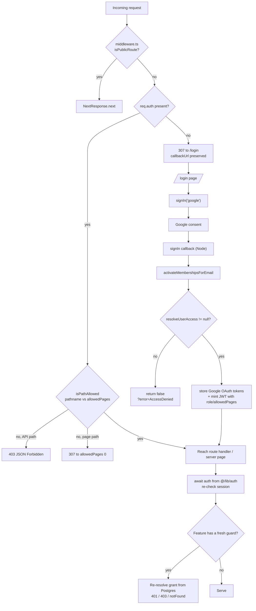
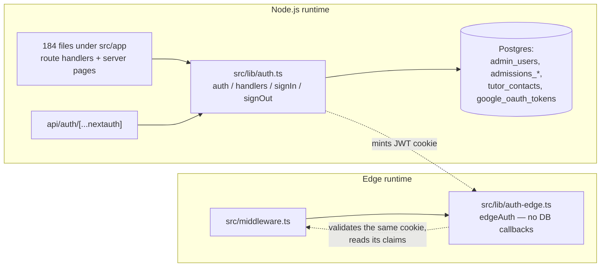
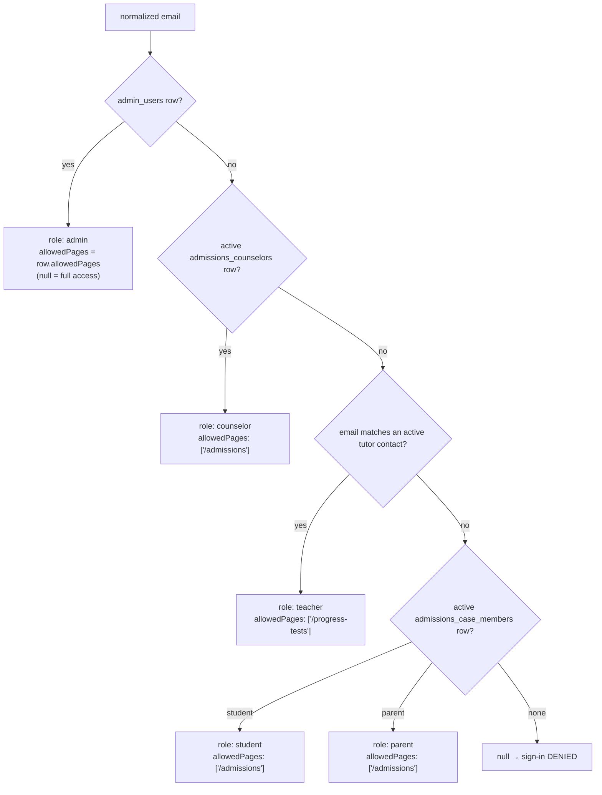

# Auth & Access

How BGScheduler decides **who may sign in** and **what they may reach once signed in**.

Identity comes from **Auth.js v5 (NextAuth)** with a single **Google** OAuth provider
(`next-auth: 5.0.0-beta.30`, `package.json:49`). There is no password login, no second
provider, and no database session adapter.

Access is decided in four places, in this order:

1. **Sign-in gate** — the `signIn` callback (`src/lib/auth.ts:50-57`) delegates to
   `resolveUserAccess` (`src/lib/auth-access.ts:56-85`). Node runtime, hits Postgres,
   runs **once per login**. Returns a role + `allowedPages`, or denies.
2. **JWT claims** — the resolved `role` and `allowedPages` are written onto the token
   (`src/lib/auth.ts:58-67`) and exposed on the session (`src/lib/auth.ts:68-72`).
3. **Middleware gate** — `src/middleware.ts` runs on the **Edge** runtime for every
   non-static request: allowlist bypass → session present? → page-prefix check.
4. **Per-feature fresh guards** — several features re-resolve authorization from Postgres
   on **every** request, deliberately ignoring the (possibly stale) JWT claim. See
   [Layer 4](#layer-4--per-feature-fresh-guards).

Requests that carry no session at all (cron, LINE, the parent schedule link, the OA-resolver
browser extension) use their own credentials — see
[Non-session credentials](#non-session-credentials).

---

## The big picture


```mermaid
flowchart TD
    A[Incoming request] --> B{middleware.ts<br/>isPublicRoute?}
    B -- yes --> Z[NextResponse.next]
    B -- no --> C{req.auth present?}
    C -- no --> D[307 to /login<br/>callbackUrl preserved]
    C -- yes --> P{isPathAllowed<br/>pathname vs allowedPages}
    P -- no, API path --> F403[403 JSON Forbidden]
    P -- no, page path --> RL[307 to allowedPages 0]
    P -- yes --> E[Reach route handler / server page]
    E --> G[await auth from @/lib/auth<br/>re-check session]
    G --> H{Feature has a fresh guard?}
    H -- yes --> I[Re-resolve grant from Postgres<br/>401 / 403 / notFound]
    H -- no --> J[Serve]

    D --> L[/login page/]
    L --> M["signIn('google')"]
    M --> N[Google consent]
    N --> O["signIn callback (Node)"]
    O --> Q[activateMembershipsForEmail]
    Q --> R{resolveUserAccess != null?}
    R -- no --> S[return false<br/>?error=AccessDenied]
    R -- yes --> T[store Google OAuth tokens<br/>+ mint JWT with role/allowedPages]
    T --> E
```

Three distinct questions, answered in three different places:

| Question | Answered by | When | Runtime |
|---|---|---|---|
| "May this Google identity exist here at all?" | `resolveUserAccess` → `signIn` callback | once, at login | Node |
| "Is there a valid session, and is this path in your lane?" | `src/middleware.ts` | every request | Edge |
| "Do you still hold this feature's grant right now?" | per-feature guard (Postgres read) | every request | Node |

---

## Layer 1 — Auth.js configuration

Two NextAuth instances are configured, split by runtime. See
[The auth vs auth-edge split](#the-auth-vs-auth-edge-split).

### Node instance — `src/lib/auth.ts`

Exports `handlers`, `signIn`, `signOut`, `auth` (`src/lib/auth.ts:32`).

- **Provider**: Google, keyed by `AUTH_GOOGLE_ID` / `AUTH_GOOGLE_SECRET`
  (`src/lib/auth.ts:34-43`).
- **Scope**: `openid email profile https://www.googleapis.com/auth/spreadsheets
  https://www.googleapis.com/auth/drive.file` with `access_type: "offline"`
  (`src/lib/auth.ts:39-40`). The Sheets **write** scope and the per-file Drive scope are
  requested because the same Google grant is reused to drive Sheets/Drive integrations
  (sales dashboard, leave requests, payout sheets) — not merely to identify the user.
  `drive.file` is deliberately narrower than full `drive`, which would require Google
  verification plus an annual security assessment
  (`src/lib/sales-dashboard/google-oauth.ts:9-12`).
- **Pages**: both `signIn` and `error` point at `/login` (`src/lib/auth.ts:45-48`), so OAuth
  failures land back on the login screen instead of a NextAuth default page.
- **`signIn` callback** (`src/lib/auth.ts:50-57`): runs `signInCallback({ user })`; on
  success **and** a non-empty email it persists the Google OAuth tokens
  (`storeGoogleOAuthTokenForUser`, lazily imported) and returns the boolean. Returning
  `false` aborts sign-in → NextAuth bounces to `/login?error=AccessDenied`.
- **`jwt` callback** (`src/lib/auth.ts:58-67`): `user` is only present at sign-in, so
  `resolveUserAccess` runs **once** and its `allowedPages` + `role` are frozen onto the
  token. Subsequent requests need no DB call — which is exactly why features that need
  live revocation add their own guard (Layer 4).
- **`session` callback** (`src/lib/auth.ts:68-72`): copies both claims onto
  `session.user`.

The claim shape is declared by module augmentation in `src/types/next-auth.d.ts`, which
imports the `UserRole` union from `src/lib/auth-access.ts` so the claim cannot drift from
the resolver (`src/types/next-auth.d.ts:21-39`). The file's `JWT` re-export is load-bearing
and documented as such (`src/types/next-auth.d.ts:13-17`).

> **Side effect worth knowing:** a successful sign-in writes encrypted Google OAuth tokens
> to `google_oauth_tokens` (`src/lib/sales-dashboard/google-oauth.ts:95-137`). The
> encryption key is derived from `AUTH_SECRET`
> (`src/lib/sales-dashboard/google-oauth.ts:41-45`), using AES-256-GCM with a per-value IV
> (`src/lib/sales-dashboard/google-oauth.ts:47-58`). So `AUTH_SECRET` protects both the
> session cookie **and** every stored refresh token — rotating it invalidates both. A
> refresh token is never overwritten with `null`: when Google omits one on re-consent the
> previously stored ciphertext is preserved (`google-oauth.ts:113-115`).

### Session strategy

Neither config sets `session.strategy`, and **no database adapter is configured** (no
`adapter:` key in either file; no `@auth/*-adapter` dependency in `package.json`). With no
adapter, Auth.js v5 defaults to a **JWT session in an encrypted cookie**. That is what lets
the Edge middleware validate a session without a Postgres round-trip — and what makes the
`role`/`allowedPages` claims sticky until the user signs out and back in.

### NextAuth route handler — `src/app/api/auth/[...nextauth]`

The whole file is three lines:

```ts
// src/app/api/auth/[...nextauth]/route.ts:1-3
import { handlers } from "@/lib/auth";

export const { GET, POST } = handlers;
```

All of `/api/auth/*` (provider redirect, callback, CSRF, session, sign-out) is served by
the **Node** instance. That is why the middleware must let `/api/auth/*` through
unauthenticated — the OAuth handshake happens before any session exists.

---

## The auth vs auth-edge split

Vercel runs middleware on the **Edge** runtime, which cannot open a Postgres connection.
But the sign-in decision and the token write **need** the database. Hence two configs.


```mermaid
flowchart LR
    subgraph Edge["Edge runtime"]
      MW["src/middleware.ts"] --> EA["src/lib/auth-edge.ts<br/>edgeAuth — no DB callbacks"]
    end
    subgraph Node["Node.js runtime"]
      RT["184 files under src/app<br/>route handlers + server pages"] --> NA["src/lib/auth.ts<br/>auth / handlers / signIn / signOut"]
      NX["api/auth/[...nextauth]"] --> NA
      NA --> DB[("Postgres:<br/>admin_users, admissions_*,<br/>tutor_contacts, google_oauth_tokens")]
    end
    NA -. "mints JWT cookie" .-> EA
    EA -. "validates the same cookie,<br/>reads its claims" .-> MW
```

| | `src/lib/auth-edge.ts` (`edgeAuth`) | `src/lib/auth.ts` (`auth`, `handlers`, `signIn`, `signOut`) |
|---|---|---|
| Runtime | Edge | Node.js |
| Exports | only `auth`, aliased `edgeAuth` (`auth-edge.ts:4`) | `handlers`, `signIn`, `signOut`, `auth` (`auth.ts:32`) |
| `signIn` callback | **none** — no DB access, no allowlist lookup | present (`auth.ts:50-57`) |
| `jwt` callback | pass-through, explicitly commented "Edge runtime: no DB access" (`auth-edge.ts:22-26`) | resolves role + allowedPages once at sign-in (`auth.ts:58-67`) |
| `session` callback | maps token claims onto `session.user` (`auth-edge.ts:27-31`) | same mapping (`auth.ts:68-72`) |
| Google scope | `…/spreadsheets.readonly` (`auth-edge.ts:11`) | `…/spreadsheets` + `…/drive.file` (`auth.ts:39`) |
| Imported by | `src/middleware.ts` **only** (plus its test) | 184 files under `src/app` (95 of the 178 `route.ts` handlers) |

The edge instance is a **stripped-down validator**. It never initiates an OAuth grant and
never writes anything; it exists so middleware can decrypt the cookie the Node instance
minted and read `allowedPages` / `role` off it. Both instances derive their cookie key from
the same `AUTH_SECRET`, which is what makes the cookie readable on both sides.

The **scope divergence** between the two files is real in the source. Because the edge
instance never runs the consent flow (only `/api/auth/*` on the Node side does), the
narrower edge scope is inert today. Flagged in [Open questions](#open-questions).

---

## Layer 2 — The sign-in decision

### `signInCallback` — `src/lib/auth.ts:5-30`

Two steps, in a deliberate order:

1. **Admissions invite activation** (`src/lib/auth.ts:16-23`). If the user has an email,
   `activateMembershipsForEmail` flips that email's `invited` / `bounced`
   `admissions_case_members` rows to `active` inside one audited transaction, re-checking
   the status in the `UPDATE` so a concurrent revoke is never overwritten
   (`src/lib/admissions/members.ts:566-600`). This runs **before** access resolution so a
   freshly invited student or parent passes the active-only membership filter on their very
   first sign-in. Failures are caught, logged with `console.error`, and never block sign-in.
2. **Access resolution** (`src/lib/auth.ts:28-29`). `resolveUserAccess(user.email)` returns
   `UserAccess | null`; the callback returns `access !== null`.

The isolation is intentional and tested: if activation throws, an **existing** user still
signs in, but an **invited-only** user is still denied — fail-closed
(`src/lib/auth/__tests__/signin-callback.test.ts:90-111`).

### `resolveUserAccess` — `src/lib/auth-access.ts:56-85`

Node-only (it does DB work). The edge config never imports it
(`src/lib/auth-access.ts:18-19`). The email is trimmed + lowercased first; an empty email
short-circuits to `null` without any lookup (`src/lib/auth-access.ts:60-61`).


```mermaid
flowchart TD
    S[normalized email] --> A{admin_users row?}
    A -- yes --> A1["role: admin<br/>allowedPages = row.allowedPages<br/>(null = full access)"]
    A -- no --> B{active admissions_counselors row?}
    B -- yes --> B1["role: counselor<br/>allowedPages: ['/admissions']"]
    B -- no --> C{email matches an active tutor contact?}
    C -- yes --> C1["role: teacher<br/>allowedPages: ['/progress-tests']"]
    C -- no --> D{active admissions_case_members row?}
    D -- student --> D1["role: student<br/>allowedPages: ['/admissions']"]
    D -- parent --> D2["role: parent<br/>allowedPages: ['/admissions']"]
    D -- none --> E["null → sign-in DENIED"]
```

Five roles exist (`src/lib/auth-access.ts:31`), resolved first-match-wins:

| # | Role | Source of truth | `allowedPages` | Code |
|---|---|---|---|---|
| 1 | `admin` | `admin_users` row (any row — the table has no `active` flag) | the row's `allowed_pages`; `null` = full access | `auth-access.ts:63-68` |
| 2 | `counselor` | `admissions_counselors` with `active = true` | `["/admissions"]` | `auth-access.ts:70-73` |
| 3 | `teacher` | ≥1 active `tutor_contacts` row matching onsite **or** online email | `["/progress-tests"]` | `auth-access.ts:75-78` |
| 4 | `student` | active `admissions_case_members` with role `student` | `["/admissions"]` | `auth-access.ts:80-82` |
| 5 | `parent` | active `admissions_case_members` with role `parent` | `["/admissions"]` | `auth-access.ts:80-82` |
| — | *denied* | none of the above | — | `auth-access.ts:84` |

Two ordering subtleties, both locked by tests:

- **Admin wins over everything.** An admin who is also a tutor contact or a case member
  keeps their admin view (`auth-access.ts:42-45`).
- **Teacher beats student/parent.** `resolveAdmissionsRole` is called *before* the teacher
  lookup (so the counselor branch can short-circuit), but a non-counselor admissions result
  is **held** until the teacher check loses (`auth-access.ts:46-49`, test
  `src/lib/__tests__/auth-access.test.ts:78`).

`resolveAdmissionsRole` itself (`src/lib/admissions/access.ts:38-61`) checks the active
counselor registry first, then active case memberships, preferring `student` over `parent`
for the global claim — per-case rights are still re-derived later by `requireCaseAccess`.

The teacher lookup is non-trivial: a tutor often has two Wise identities (onsite +
"… Online"). `resolveTeacherCanonicalKeys` matches `tutor_contacts` by either email, then
bridges split identities through the active snapshot's identity-group display names, so one
login covers both accounts (`src/lib/progress-tests/teacher-access.ts:24-45`). An unknown
email returns `[]` → fail-closed.

---

## Layer 3 — The middleware gate

`src/middleware.ts` wraps the **edge** auth instance (`src/middleware.ts:63`) and runs on
almost every request.

### The matcher

```ts
// src/middleware.ts:93-95
export const config = {
  matcher: ["/((?!_next/static|_next/image|favicon.ico).*)"],
};
```

Everything except Next.js static assets and the favicon passes through — pages **and** API
routes alike — and is then filtered by `isPublicRoute`.

### What bypasses auth entirely

`isPublicRoute(pathname)` (`src/middleware.ts:4-20`) matches **nine** patterns. A match
returns `NextResponse.next()` immediately (`src/middleware.ts:66-68`) — no session check,
no `allowedPages` check.

| Pattern | Match kind | Why it is public | Real credential |
|---|---|---|---|
| `/login` | prefix (`:5`) | The sign-in screen; gating it would loop. | none |
| `/api/auth/*` | prefix (`:6`) | The OAuth handshake predates any session. | Auth.js CSRF/state |
| `/api/search/assistant` | exact (`:8`) | Bypasses the *redirect* so the handler can answer with JSON. | `auth()` in-handler → 401 (`src/app/api/search/assistant/route.ts:136`) |
| `/api/classrooms/floor-plan-map` | exact (`:9`) | Renders a public SVG asset from query params only (`src/app/api/classrooms/floor-plan-map/route.ts:3-16`). | none |
| `/api/line/webhook` | exact (`:10`) | LINE posts server-to-server. | HMAC-SHA256 `x-line-signature`, constant-time (`src/lib/line/signature.ts:12-19`) |
| `/schedule/*` | prefix (`:15`) | Parent schedule links open from a LINE message with no session. **Note the trailing slash** — it keeps the authenticated `/student-schedule` admin page out of the allowlist (`src/middleware.ts:11-15`). | 32-byte capability token in the path (`src/lib/student-schedule/links.ts:1-14`) |
| `/api/line/contacts/oa-resolver/worklist` | exact (`:16`) | Called by a browser extension, not a session. | `Bearer` resolver token (`src/app/api/line/contacts/oa-resolver/worklist/route.ts:11-31`) |
| `/api/line/contacts/oa-resolver/runs/{id}/rows` | anchored regex (`:17`) | Same extension token path. | same resolver token |
| `/api/internal/*` | prefix (`:18`) | Cron and internal automation. | `CRON_SECRET`, constant-time (`src/lib/internal/cron-auth.ts:6-17`) |

> **Correction to the task brief.** The brief names the bypass set as `/login`,
> `/api/auth/*`, `/api/internal/*`. Those three are correct but are a **subset** — the code
> bypasses nine patterns. The six extras are listed above.

Most of the OA-resolver namespace is **not** public: the regex is anchored (`^…$`) so
`…/runs` and `…/runs/{id}/commit` still require a session
(`src/__tests__/middleware.test.ts:69-87`).

### Unauthenticated, non-public request

```ts
// src/middleware.ts:71-75
if (!req.auth) {
  const loginUrl = new URL("/login", req.url);
  loginUrl.searchParams.set("callbackUrl", `${pathname}${search}`);
  return NextResponse.redirect(loginUrl);
}
```

A `307` to `/login` with the full original destination — query string included — preserved
as `callbackUrl` (`src/__tests__/middleware.test.ts:110-117`). This applies to API paths
too: an unauthenticated `POST /api/admissions/cases` gets the redirect, not a 401
(`src/__tests__/middleware.test.ts:276-284`).

### Authenticated: the page-prefix check

`allowedPages` of `null` means full access and short-circuits
(`src/middleware.ts:31`). Otherwise `isPathAllowed` (`src/middleware.ts:30-61`) applies, in
source order:

| # | Rule | Result | Line |
|---|---|---|---|
| 1 | `allowedPages` is null/empty-falsy | allow (full-access admin) | `:31` |
| 2 | `/api/home/summary` | allow — every signed-in user needs the home payload | `:32` |
| 3 | `/post-class-feedback`, `/post-class-feedback/*`, `/api/post-class-feedback`, `/api/post-class-feedback/*` | allow — coarse pass; the real decision is a fresh DB capability | `:35-40` |
| 4 | `/learning-plans`, `/learning-plans/*` | allow — coarse pass; the real decision is a fresh DB grant in the Server Component | `:44-47` |
| 5 | `/api/learning-plans`, `/api/learning-plans/*` | **deny** — the page exception must not extend to the API namespace | `:48-51` |
| 6 | `/` when `allowedPages.length > 1` | allow (the home hub is meaningful only with >1 lane) | `:52` |
| 7 | otherwise | allow iff some `page` in `allowedPages` satisfies `pathname === page`, `pathname.startsWith(page + "/")`, `pathname === "/api" + page`, or `pathname.startsWith("/api" + page + "/")` | `:53-60` |

Rule 5 is the non-obvious one: a user whose `allowedPages` is exactly `["/learning-plans"]`
is allowed the page but **403'd on `/api/learning-plans`**, because rule 5 fires before the
generic prefix match of rule 7 (`src/__tests__/middleware.test.ts:171-182`).

Rule 7's `/api` mirroring is what makes a single prefix grant both `/admissions` and
`/api/admissions/*` (`src/__tests__/middleware.test.ts:237-244`).

On failure (`src/middleware.ts:79-88`):

- API path (`/api/…`) → `403 {"error":"Forbidden"}` JSON.
- Page path → `307` to `allowedPages[0]`, the user's landing page, with an explicit
  `pathname !== target` guard against a redirect loop.

Note that prefix matching is **not** substring matching: `/learning-plans-extra` does not
match `/learning-plans` (`src/__tests__/middleware.test.ts:161-169`).

---

## Layer 4 — Per-feature fresh guards

Because `role` and `allowedPages` are frozen in the JWT at sign-in, any feature that needs
**live** grant/revocation re-reads Postgres per request. These guards are the authority;
middleware is only a coarse first pass.

| Feature | Guard | Source of truth | Failure mode |
|---|---|---|---|
| Progress Tests | `requireProgressTestsSession` (`src/lib/progress-tests/api.ts:34-56`) / `requireProgressTestsAdminSession` (`:64-71`) | JWT `role` + `allowedPages` | throws `Unauthorized` / `Forbidden`; teachers are read-only, so every mutating route uses the admin variant |
| Admissions | `requireAdmissionsSession` (`src/lib/admissions/access.ts:76-95`) then `requireCaseAccess` (`:117-160`) | `admin_users`, `admissions_cases`, `admissions_case_members`, `admissions_counselors` | non-admins get `Forbidden`, never `NotFound` — they must not learn whether a case exists (`:141-147`) |
| Learning Plans | `requireLearningPlansAccess` (`src/lib/learning-plans/access.ts:149-157`) | `learning_plan_access_grants` + active `tutor_contacts` | unauthenticated → `redirect("/login")`; unauthorized → `notFound()` |
| Post-Class Feedback | `requirePostClassCapability` (`src/lib/post-class-feedback/access.ts:153-176`) | `post_class_access_grants` **inner-joined to** `admin_users` (`:136-143`) | `401` / `403` via `PostClassAccessError` |
| Competitor Intelligence | `hasCompetitorIntelligenceAccess` (`src/lib/competitor-intelligence/access-policy.ts:3-13`) | JWT `role` + `allowedPages` | any explicit non-admin role fails closed (`:7`) |

Shared traits across these guards:

- **An explicit non-admin role always loses.** `requirePostClassCapability` treats a missing
  `role` as a legacy admin session but rejects any present non-admin role
  (`src/lib/post-class-feedback/access.ts:163-168`). `requireProgressTestsSession`
  (`src/lib/progress-tests/api.ts:49-55`) and `requireAdmissionsSession`
  (`src/lib/admissions/access.ts:89-95`) apply the same "never guess upward" rule.
- **`hasPageAccess`** (`src/lib/progress-tests/api.ts:14-21`) is the shared helper: `null`
  `allowedPages` = full access, otherwise exact-or-prefix match. `canAccessHref`
  (`src/lib/navigation/tools.ts:258-262`) is its nav-rendering twin and adds the `/` rule
  (home is visible only with >1 allowed page).
- **Post-Class grants require an `admin_users` row.** The capability query inner-joins
  `admin_users` on lowercased, trimmed email (`src/lib/post-class-feedback/access.ts:139-142`),
  so a grant row alone cannot admit anyone.
- **Learning Plans grants are deliberately outside `admin_users`.** A separate
  `learning_plan_access_grants` table (created with three seeded rows in
  `drizzle/0056_learning_plan_access_grants.sql:9-12`) lets a teacher be granted the feature
  without joining the admin recipient lists described below. Full admins bypass the grant
  entirely; a teacher must additionally still match an active tutor contact, so revoking the
  contact takes effect without waiting for JWT expiry
  (`src/lib/learning-plans/access-policy.ts:3-24`, `src/lib/learning-plans/access.ts:60-70`).

Nav rendering follows the same claims: `src/app/(app)/layout.tsx:14-28` resolves the
session, post-class capabilities, and the Learning Plans grant, then passes them into
`AppNav`, which additively re-adds `/post-class-feedback` and `/learning-plans` for
restricted users holding the respective grant
(`src/components/layout/app-nav.tsx:104-131`). The `(app)` layout itself does **not** gate
auth — it only renders chrome; each page re-checks.

The home page redirects a single-lane restricted user straight to their one page
(`src/app/(app)/page.tsx:8-19`).

---

## The `admin_users` allowlist

### The table

`admin_users` is defined at `src/lib/db/schema.ts:575-585`: `id` (uuid PK), `email` (text,
not null), `name` (text, nullable), `allowedPages` (`jsonb`, `string[] | null`), `createdAt`.
A unique index `admin_users_email_idx` enforces one row per email. The `allowed_pages`
column was added by `drizzle/0038_cynical_karma.sql:151`. Column-level detail is owned by
[`../reference/database/index.md`](../reference/database/index.md).

`null` `allowed_pages` = full access. A non-null array = a page-restricted admin. There is
no `active`/`disabled` column — deactivation means deleting the row.

### How rows get there — there is no hardcoded list

The allowlist is populated at **seed time from an environment variable**:
`src/lib/db/seed.ts:31` reads `process.env.SEED_ADMIN_EMAILS`, splits on `,`, drops empties,
and inserts each trimmed email with `onConflictDoNothing` on the email index
(`src/lib/db/seed.ts:31-43`). If the variable is unset, admin seeding is skipped entirely and
the script logs `"No SEED_ADMIN_EMAILS set, skipping admin user seed"`
(`src/lib/db/seed.ts:41-42`). Run via `npm run db:seed` → `tsx src/lib/db/seed.ts`
(`package.json:18`).

The seed additionally upserts a **restricted** user list — one entry today,
`m.giftwan@gmail.com` with `allowedPages: ["/progress-tests"]`
(`src/lib/db/seed.ts:47-49`) — using `onConflictDoUpdate` so the restriction is re-applied on
every seed. That block is explicitly commented as *not* belonging in `SEED_ADMIN_EMAILS`,
which grants full access (`src/lib/db/seed.ts:45-46`).

### Allowlist count — not derivable from this repository

**The number of allowlisted admin emails cannot be verified from code.** Verified against
schema and seed:

- `src/lib/db/schema.ts:575-585` defines the table; it contains no data.
- `src/lib/db/seed.ts:31` supplies full admins **only** from `SEED_ADMIN_EMAILS`, which is
  absent from `.env.example` (65 lines, no such key) and absent from the Zod schema in
  `src/lib/env.ts`.
- No migration in `drizzle/` inserts into `admin_users`. The only migration that names the
  table *reads* it, to backfill `post_class_access_grants` for full-access admins
  (`drizzle/0055_post_class_feedback.sql:655-659`).
- The only email hardcoded anywhere in the seed path is `m.giftwan@gmail.com`, and it is a
  **restricted** user, not a full admin (`src/lib/db/seed.ts:48`).
- `kevhsh7@gmail.com` appears in `drizzle/0055_post_class_feedback.sql:661-666` (post-class
  capability grants) and in test fixtures (`src/__tests__/middleware.test.ts:15`) — neither
  is an `admin_users` seed.

So: **exactly one `admin_users` row is code-defined, and it is not a full-access admin.** The
live count is whatever `SEED_ADMIN_EMAILS` held at seed time, plus whatever has been inserted
directly since. The "9 allowlisted admin emails" figure in `AGENTS.md` / `CLAUDE.md` is prose,
not code-grounded — treat it as unverified. To get the real number:
`SELECT count(*) FROM admin_users;` (and `WHERE allowed_pages IS NULL` for full admins).

### `admin_users` doubles as an operational recipient list

Rows in this table gate login **and** feed several notification/eligibility lists:

| Consumer | Query | Filter |
|---|---|---|
| Cron watchdog alert recipients | `src/lib/internal/cron-watchdog.ts:257-260` | **full-access admins only** (`isNull(allowedPages)`) |
| Leave-request submission emails | `src/lib/leave-requests/sync.ts:272-274` | all rows |
| Admin daily-schedule emails | `src/lib/classrooms/admin-schedule-email.ts:203-204` | all rows |
| Progress-tests admin digest | `src/lib/progress-tests/admin-digest.ts:85-86` | all rows |
| LINE link-validation reviewer pool | `src/lib/line/link-validation.ts:645-646` | rows matching the configured reviewer emails |
| Post-class roles matrix / settings | `src/lib/post-class-feedback/access.ts:184-186`, `src/lib/post-class-feedback/settings.ts:219-220` | all rows |
| Post-class viewer backfill (one-time) | `drizzle/0055_post_class_feedback.sql:655-659` | `allowed_pages IS NULL` |
| Admissions admin bypass in `requireCaseAccess` | `src/lib/admissions/access.ts:127-132` | membership existence |

Adding or removing a row therefore changes both *who can log in* and *who gets paged*. This
is the stated reason Learning Plans and Post-Class Feedback keep separate grant tables.

LINE link validation additionally carries a hardcoded lead-reviewer fallback list of two
emails (`src/lib/line/link-validation.ts:122-125`) that is independent of `admin_users`.

---

## Non-session credentials

Requests that bypass the middleware still have to prove something.

| Surface | Credential | Verification |
|---|---|---|
| `/api/internal/*` (21 route handlers) | `Authorization: Bearer $CRON_SECRET` | Constant-time compare with a length pre-check (REL-07). Shared helper `rejectInvalidCronSecret` (`src/lib/internal/cron-auth.ts:19-26`); missing secret → `500 Server misconfigured`, mismatch → `401`. |
| `/api/line/webhook` | `x-line-signature` | HMAC-SHA256 over the raw body with `LINE_CHANNEL_SECRET`, `timingSafeEqual` after a length check (`src/lib/line/signature.ts:8-19`). The route also 503s when the LINE scheduler is not configured (`src/app/api/line/webhook/route.ts:11-13`). |
| OA-resolver extension endpoints | `Authorization: Bearer <resolver token>` | Token looked up per run; unknown/expired → `401` (`src/app/api/line/contacts/oa-resolver/worklist/route.ts:21-31`). CORS is `*` for these two endpoints only (`:5-9`). |
| `/schedule/{token}` | 32-byte capability token in the path | SHA-256 hash stored, raw token never persisted; constant-time digest compare (`src/lib/student-schedule/links.ts:44-51`); expired/revoked/unknown/malformed all return `null` so the page cannot be used as an existence oracle (`src/lib/student-schedule/links.ts:1-14`). |

**Cron-secret drift.** Fifteen of the 21 internal routes use the shared
`src/lib/internal/cron-auth.ts` helper (14 via `rejectInvalidCronSecret`, and
`sync-progress-tests` via `getCronSecretStatus`); the remaining six define a behaviorally
identical local `hasValidCronSecret` instead — `sync-wise`, `sync-credit-control`,
`sync-room-utilization`, `sync-sales-dashboard`, `sync-competitor-intelligence`,
`student-promotions/july-1`. All six perform the same constant-time comparison
(e.g. `src/app/api/internal/sync-sales-dashboard/route.ts:15-22`), so behavior is equivalent
— but the duplication is a maintenance hazard.

**Session fallback on two cron routes.** `sync-sales-dashboard` and
`sync-competitor-intelligence` accept an admin session when the cron secret does not match,
so an admin can trigger the job from the UI; the audit row records `triggerSource: "admin"`
and the actor's email instead of `cron@begifted.local`
(`src/app/api/internal/sync-sales-dashboard/route.ts:24-47`). Those two routes are reachable
without a session check by the middleware, but `auth()` inside the handler still gates the
fallback path.

Separately, `POST /api/admin/sync-wise` is the **session-authenticated** trigger for the
same Wise sync (`src/app/api/admin/sync-wise/route.ts:8-24`) — it sits outside
`/api/internal/*` and so is gated by the middleware plus its own `auth()` check. Any
signed-in session passes; there is no additional role check on that route.

Schedules and per-cron detail live in [`../reference/crons.md`](../reference/crons.md).

---

## Login UX

`/login` (`src/app/login/page.tsx`) is a client component wrapped in `<Suspense>`. It reads
`callbackUrl` (default `/search`) and `error` from the query string
(`src/app/login/page.tsx:11-12`), renders a single "Sign in with Google" button calling
`signIn("google", { callbackUrl })` (`src/app/login/page.tsx:31-33`), and shows an inline
error banner. The denial case is explicit: `error === "AccessDenied"` renders
**"Access denied. Your email is not on the admin allowlist."**
(`src/app/login/page.tsx:26-28`) — the message a non-resolvable Google user sees after
`signInCallback` returns `false`.

That copy predates the four non-admin roles; a rejected counselor/teacher/student/parent sees
the same admin-centric wording. Noted in [Open questions](#open-questions).

---

## Environment variables

Validated at startup by `src/lib/env.ts` (Zod `safeParse`; throws `"Invalid environment
variables"` and logs only `fieldErrors`, `src/lib/env.ts:29-34`). Full inventory:
[`../reference/env.md`](../reference/env.md).

| Variable | Role in auth | Declared in `env.ts`? |
|---|---|---|
| `AUTH_GOOGLE_ID` | Google OAuth client ID (`auth.ts:35`, `auth-edge.ts:7`) | yes, required (`env.ts:5`) |
| `AUTH_GOOGLE_SECRET` | Google OAuth client secret (`auth.ts:36`, `auth-edge.ts:8`) | yes, required (`env.ts:6`) |
| `AUTH_SECRET` | Signs/encrypts the JWT session cookie **and** keys the AES-256-GCM encryption of stored Google tokens (`google-oauth.ts:41-45`) | yes, required (`env.ts:7`) |
| `CRON_SECRET` | Bearer secret for `/api/internal/*` (`cron-auth.ts:8`) | yes, required (`env.ts:12`) |
| `LINE_CHANNEL_SECRET` | HMAC key for webhook signature verification | yes, optional (`env.ts:13`) |
| `SEED_ADMIN_EMAILS` | Comma-separated allowlist, read **only** by the seed script (`seed.ts:31`) | **no** — and not in `.env.example` |

`SEED_ADMIN_EMAILS` is seed-time-only. At runtime the allowlist source of truth is the
`admin_users` **table**, never the variable.

---

## Test coverage

| Area | File |
|---|---|
| Sign-in delegation, invite activation ordering, failure isolation, fail-closed denial | `src/lib/auth/__tests__/signin-callback.test.ts` |
| Role resolution for all five roles + precedence + empty-email short-circuit | `src/lib/__tests__/auth-access.test.ts` |
| Public-route bypass, login redirect + `callbackUrl`, `allowedPages` 403/redirect, learning-plans page-vs-API asymmetry, prefix-not-substring | `src/__tests__/middleware.test.ts` |
| Per-case admissions access | `src/lib/admissions/__tests__/access.test.ts` |
| Cron watchdog recipient filtering | `src/lib/internal/__tests__/cron-watchdog.test.ts` |

---

## Open questions

- **Allowlist count is unverifiable from the repo.** Full admins come from
  `SEED_ADMIN_EMAILS`, which is in neither `src/lib/env.ts` nor `.env.example`; no migration
  seeds `admin_users`. `AGENTS.md`/`CLAUDE.md` cite "9 allowlisted" with no code backing.
  Should the docs cite a live `SELECT count(*) FROM admin_users` result, or stop citing a
  number at all?
- **`SEED_ADMIN_EMAILS` is undocumented in `.env.example`** despite being the only way to
  populate the allowlist. A fresh deployment without it seeds an empty allowlist and locks
  everyone out (the one restricted seed row, `m.giftwan@gmail.com`, would be the sole
  account able to sign in — and only to `/progress-tests`). Add it to `.env.example`?
- **Scope divergence between the two NextAuth configs.** Node requests
  `spreadsheets` + `drive.file` (`src/lib/auth.ts:39`); edge requests
  `spreadsheets.readonly` (`src/lib/auth-edge.ts:11`). Only the Node instance ever runs the
  grant, so the edge scope is inert — intentional, or should they match to avoid confusing a
  future reader?
- **The task brief's bypass list is incomplete.** It names three patterns; the code has nine
  (`src/middleware.ts:4-20`). Are `/api/classrooms/floor-plan-map` (fully unauthenticated
  SVG rendering from user-supplied `rooms`) and the two OA-resolver token endpoints
  (CORS `*`) intended to stay public, or do they warrant a security review?
- **Cron-secret helper duplication.** Six internal routes carry a local copy of
  `hasValidCronSecret` instead of importing `src/lib/internal/cron-auth.ts`. Behavior is
  identical today; should they be consolidated so a future fix lands once?
- **Login denial copy is admin-centric.** "Your email is not on the admin allowlist"
  (`src/app/login/page.tsx:27`) is now wrong for four of the five roles. Reword?
- **JWT claims are frozen until re-login.** Promoting a teacher to admin, or revoking an
  `admin_users` row, does not take effect until the user signs out and back in — only the
  Layer-4 feature guards read live state. Is a shorter session max-age or a claim-refresh
  path wanted?
- **`admin_users` has no `active` flag.** Unlike `admissions_counselors` and
  `tutor_contacts`, deactivation means deleting the row — which also silently removes the
  person from cron-watchdog alerts, schedule emails, LINE reviewer pools, and the
  post-class roles matrix. Should a soft-disable column exist?
- **`POST /api/admin/sync-wise` accepts any authenticated session**
  (`src/app/api/admin/sync-wise/route.ts:11-13`) with no role or `allowedPages` check inside
  the handler. Middleware's prefix rule keeps restricted users out of `/api/admin/*` today,
  but the handler itself would admit a restricted session if that prefix were ever granted.
  Should it call a role guard directly?

_Verified against HEAD + uncommitted WIP on 2026-05-31._
