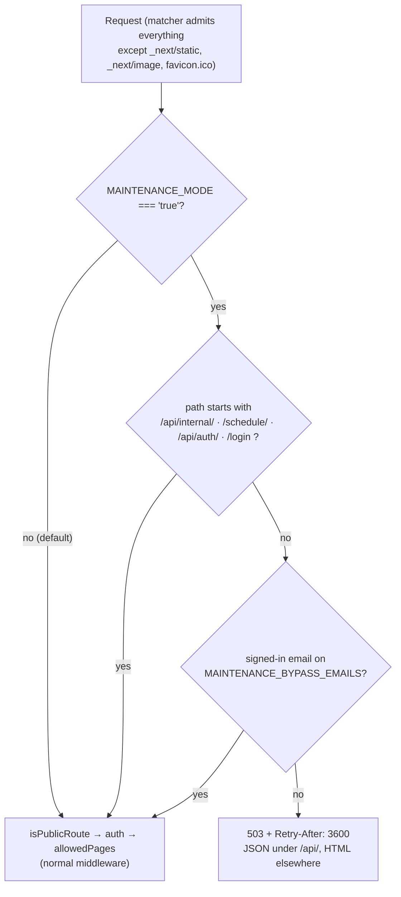

# Maintenance Mode

The in-app off switch for the staff UI. Setting one Vercel environment variable to the exact
string `"true"` and redeploying makes every human-facing page and API answer `503` — while all
**19** scheduled jobs keep running, so there is no data gap to backfill when the window closes.

This page owns the *procedure*: what the switch does, what it deliberately does **not** cover,
how to turn it on and off, and how to prove it worked. The access-control *model* it sits inside
— the four middleware checks, the public allowlist, `allowedPages` — lives in
[`auth-and-access.md`](./auth-and-access.md). Everything else operational lives in
[`runbook.md`](./runbook.md).

| Need | Canonical home |
|---|---|
| Where maintenance sits among the four middleware checks | [`auth-and-access.md` → Order of checks](./auth-and-access.md#order-of-checks) |
| The full public-route allowlist and each path's own credential | [`auth-and-access.md` → What bypasses auth entirely](./auth-and-access.md#what-bypasses-auth-entirely) |
| The two variables in the reconciled env inventory | [`../reference/env.md` → Optional](../reference/env.md#13-optional-11) |
| Other kill switches (`POST_CLASS_*`) | [`runbook.md` → §4.6](./runbook.md#46-kill-switches) |
| Cron schedules and `CRON_SECRET` mechanics | [`../reference/crons.md`](../reference/crons.md) |
| How a deploy reaches production at all | [`runbook.md` → §2.1](./runbook.md#21-two-ways-to-reach-production) |

Every non-obvious claim below carries a `file:line` reference.

---

## 1. Why this exists rather than Vercel's Pause Project

Pausing the Vercel project blocks the production deployment — and every cron in
[`vercel.json`](../../vercel.json) targets that same deployment, so pausing stops the syncs too
([`maintenance.ts:4-7`](../../src/lib/maintenance.ts)). Resuming would then leave hours of Wise,
credit-control, post-class and progress-test data to backfill.

Maintenance mode instead installs a gate **inside** the edge middleware, above the auth check, and
exempts the cron namespace. The human surface goes dark; the data plane keeps flowing.

All **19** `vercel.json` cron entries are paths under `/api/internal/` — verified by extracting
every `"path"` from [`vercel.json`](../../vercel.json): 19 entries, 0 outside that prefix. The
`/api/internal/` exemption therefore covers 100 % of scheduled jobs, with no per-job allowlist to
maintain.

## 2. The five rules

All five carry design IDs that are load-bearing in the source comments
([`maintenance.ts:9-31`](../../src/lib/maintenance.ts)) — preserve them when editing nearby code.

| ID | Rule | Implementation |
|---|---|---|
| **MAINT-01** | Fail-**open** flag — engages only on the exact string `"true"` | [`maintenance.ts:59-61`](../../src/lib/maintenance.ts) |
| **MAINT-02** | Four exempt prefixes keep crons, parent links and sign-in alive | [`maintenance.ts:43-48`](../../src/lib/maintenance.ts), matched at [`:69-73`](../../src/lib/maintenance.ts) |
| **MAINT-03** | Bypass allowlist is fail-**closed** — unset means nobody | [`maintenance.ts:79-88`, `:95-101`](../../src/lib/maintenance.ts) |
| **MAINT-04** | The gate runs **above** the public allowlist and the auth check | [`middleware.ts:72-82`](../../src/middleware.ts) |
| **MAINT-05** | `503` + `Retry-After: 3600`; JSON under `/api/`, self-contained HTML elsewhere | [`maintenance.ts:120-134`](../../src/lib/maintenance.ts) |

### 2.1 MAINT-01 — the flag is fail-open, and that is deliberate

```ts
// src/lib/maintenance.ts:59-61
export function isMaintenanceMode(raw = process.env.MAINTENANCE_MODE): boolean {
  return raw === "true";
}
```

Strict `===` against one lowercase literal. Unset, `""`, `"false"`, `"TRUE"`, `"True"`,
`" true "` (padded — there is no `.trim()`), `"1"`, `"yes"` and any typo all evaluate to `false`
and leave the site serving normally
([`maintenance.test.ts:17-29`](../../src/lib/__tests__/maintenance.test.ts)).

**Why fail-open is the right polarity here, when the same idiom is fail-closed elsewhere.** The
repo's other `=== "true"` gates — `WISE_SESSION_OPERATIONS_VERIFIED`, `WISE_SESSION_CREATE_VERIFIED`,
`WISE_SESSION_SUBJECT_UPDATE_VERIFIED`, `POST_CLASS_PAYOUT_WRITES_ENABLED`,
`POST_CLASS_AUTO_APPROVE_ENABLED` — guard *external writes*, so an unrecognised value must mean
"do nothing" ([`../reference/env.md` §3](../reference/env.md#3-flag-idioms--three-conventions-that-do-not-mean-the-same-thing)).
This flag guards *availability*, so the identical idiom inverts: the worst outcome of a bad value
is that the site stays up, never that a typo blacks out production
([`maintenance.ts:9-14`](../../src/lib/maintenance.ts),
[`maintenance.test.ts:31-36`](../../src/lib/__tests__/maintenance.test.ts)).

It is also the deliberate inverse of `ENABLE_STUDENT_SCHEDULE_LIVE`, which tests `!== "false"` —
that flag defaults **on** and opts out; this one defaults **off** and opts in
([`env.ts:20-23`](../../src/lib/env.ts)).

The practical consequence for an operator: **you cannot half-engage maintenance mode.** A value of
`TRUE`, `1`, or `true ` with a trailing space is silently a no-op, and the site will look
completely normal. Verify with §5.2 rather than trusting the Vercel dashboard's rendering of the
value.

### 2.2 MAINT-04 — the gate runs before the public allowlist *and* before auth

```ts
// src/middleware.ts:76-82
if (
  isMaintenanceMode() &&
  !isMaintenanceExempt(pathname) &&
  !isMaintenanceBypassEmail(req.auth?.user?.email)
) {
  return maintenanceResponse(pathname);
}
```

This block is the **first** thing the handler body does, ahead of `isPublicRoute(pathname)`
([`middleware.ts:84-86`](../../src/middleware.ts)) and the session check
([`:89-93`](../../src/middleware.ts)). Two separate consequences:



**Above the allowlist.** `isPublicRoute` matches `/api/line/webhook`
([`middleware.ts:16`](../../src/middleware.ts)), so a gate placed after it would wave through the
one path maintenance mode most needs to close. Ordering it first is what makes the webhook gated
([`middleware.ts:72-75`](../../src/middleware.ts),
[`middleware.test.ts:386-395`](../../src/__tests__/middleware.test.ts)). That is a deliberate choice
with a real, unrecoverable cost: **LINE does not redeliver by default, so inbound OA messages sent
during a window are lost, not queued** ([`maintenance.ts:25-27`](../../src/lib/maintenance.ts),
[`.env.example:53-54`](../../.env.example)). Keep windows short, or announce them in the OA first.

**Above auth.** An unauthenticated visitor to `/search` normally gets a `307` to `/login`; with the
gate on they get the `503` instead, never reaching the redirect
([`middleware.test.ts:331-339`](../../src/__tests__/middleware.test.ts)). The maintenance page is
therefore what an anonymous visitor sees, not a login screen — which is the point, since the login
screen would imply the app is working.

The matcher admits every path except `_next/static`, `_next/image` and `favicon.ico`
([`middleware.ts:111-113`](../../src/middleware.ts)). Static assets keep serving, but the `503`
response never loads the app shell, which is why the HTML body carries its own inline styles
(MAINT-05).

### 2.3 MAINT-02 — the four exempt prefixes

```ts
// src/lib/maintenance.ts:43-48
export const MAINTENANCE_EXEMPT_PREFIXES = [
  "/api/internal/",
  "/schedule/",
  "/api/auth/",
  "/login",
] as const;
```

Matched exact-or-prefix ([`:69-73`](../../src/lib/maintenance.ts)); the list is pinned by an
equality assertion so adding a fifth prefix breaks a test
([`maintenance.test.ts:79-86`](../../src/lib/__tests__/maintenance.test.ts)).

| Prefix | Keeps working | Why it must |
|---|---|---|
| `/api/internal/` | All **19** `vercel.json` crons and the 5 `manualOnly` registry jobs fired by curl | The whole reason this exists instead of Pause Project ([`maintenance.ts:15-16`](../../src/lib/maintenance.ts)); each route still enforces `CRON_SECRET` itself ([`cron-auth.ts:19-26`](../../src/lib/internal/cron-auth.ts)) |
| `/schedule/` | Public parent schedule links opened from a LINE message | Parents are not staff and did not ask for the window; the link is capability-token gated, so nothing widens ([`schedule/[token]/page.tsx:1-23`](../../src/app/schedule/%5Btoken%5D/page.tsx)) |
| `/api/auth/` | The Google OAuth handshake | A bypass admin who is not already signed in must be able to complete a login |
| `/login` | The sign-in screen | Same reason; gating it would strand every bypass admin outside |

**The trailing slash on `/schedule/` is load-bearing.** It exempts the public parent pages while
leaving the authenticated `/student-schedule` admin page gated
([`maintenance.ts:38-41`](../../src/lib/maintenance.ts);
[`maintenance.test.ts:65-69`](../../src/lib/__tests__/maintenance.test.ts),
[`middleware.test.ts:397-408`](../../src/__tests__/middleware.test.ts)). `src/middleware.ts:17-21`
uses the identical trick for its own allowlist. A bare `/schedule` with no token is **not** exempt
([`maintenance.test.ts:71-73`](../../src/lib/__tests__/maintenance.test.ts)) — harmless, since
`src/app/schedule/` contains only `[token]`.

Same story for `/api/internal/`: a path that merely *looks* like the cron namespace, such as
`/api/internal-tools`, is gated
([`maintenance.test.ts:75-77`](../../src/lib/__tests__/maintenance.test.ts)).

Two small imprecisions worth knowing, neither with a live consequence at this revision:

- `pathname === prefix` in [`:71`](../../src/lib/maintenance.ts) is subsumed by the
  `startsWith` on the same line — a string always starts with itself. It is documentation, not
  logic.
- `"/login"` has no trailing slash, so it would also exempt a hypothetical `/login-help`.
  `src/app/` ships exactly one matching route, `src/app/login/page.tsx`, so nothing is
  over-exempted today.

### 2.4 What goes dark

Everything not on the four prefixes, including four paths that are normally **public**:

| Path | Normal state | During a window | Cost |
|---|---|---|---|
| `/api/line/webhook` | public, HMAC-verified | `503` | **Inbound OA messages are lost** — LINE does not redeliver (MAINT-04) |
| `/api/search/assistant` | public in middleware, session-checked in handler | `503` | AI scheduler unavailable |
| `/api/classrooms/floor-plan-map` | public, no credential | `503` | Floor-plan SVGs stop rendering |
| `/api/line/contacts/oa-resolver/worklist` and `…/runs/{runId}/rows` | public, bearer-token | `503` | The browser extension cannot pull or post work |
| All 28 `(app)` pages and every non-internal API | session-gated | `503` | The staff UI, as intended |
| `POST /api/data-health/jobs/{jobKey}/run` | session-gated | `503` | **In-app job triggering is unavailable.** Fire jobs by curl against `/api/internal/*` instead ([`runbook.md` §4.5](./runbook.md#45-triggering-by-hand-with-curl)) |
| `POST /api/admin/sync-wise` | session-gated | `503` | Same — only `/api/internal/` is exempt |

The cron watchdog is exempt and keeps sweeping, so **alerting is not silenced by maintenance mode**:
a job that fails during a window still emails full-access admins
([`runbook.md` §1](./runbook.md#1-quick-reference)).

### 2.5 MAINT-03 — the bypass list is fail-closed

```ts
// src/lib/maintenance.ts:79-88
export function maintenanceBypassEmails(
  raw = process.env.MAINTENANCE_BYPASS_EMAILS,
): Set<string> {
  return new Set(
    (raw ?? "").split(",").map((entry) => entry.trim().toLowerCase()).filter(Boolean),
  );
}
```

Comma-separated; each entry trimmed and lowercased; blanks dropped. Unset, `""`, `"   "` and
`",,"` all yield an **empty set**, and an empty set admits nobody
([`maintenance.test.ts:90-98`](../../src/lib/__tests__/maintenance.test.ts)). This is the opposite
polarity to MAINT-01 on purpose, and mirrors `LINE_SCHEDULE_BOT_ADMIN_IDS`
([`maintenance.ts:19-21`](../../src/lib/maintenance.ts)).

The membership test also lowercases and trims the incoming address, and refuses `null`,
`undefined` and `""` before consulting the set
([`:95-101`](../../src/lib/maintenance.ts)). So:

- Turning maintenance on **without** setting `MAINTENANCE_BYPASS_EMAILS` locks out every admin,
  including whoever flipped the switch
  ([`middleware.test.ts:438-447`](../../src/__tests__/middleware.test.ts)). Set both variables in
  the same change.
- The email comes from `req.auth?.user?.email` — the JWT cookie
  ([`middleware.ts:79`](../../src/middleware.ts)). An admin already signed in before the window is
  admitted with no new login. An admin who is signed out must complete a full Google sign-in, which
  is why `/login` and `/api/auth/` are exempt.
- Matching is case-insensitive and whitespace-tolerant on both sides
  ([`maintenance.test.ts:113-115`](../../src/lib/__tests__/maintenance.test.ts)), so
  ` Kev@X.com ` in the env value matches `kev@x.com` on the token.
- A bypass admin reaches everything, pages and APIs alike — the gate simply does not fire for them
  ([`middleware.test.ts:422-436`](../../src/__tests__/middleware.test.ts)). The other three
  middleware checks still apply, so a page-restricted user stays inside their `allowedPages` lane.

## 3. What a blocked user actually sees

Both shapes carry `503 Service Unavailable` and `retry-after: 3600` — one hour, from
[`maintenance.ts:51`](../../src/lib/maintenance.ts). The branch is
`pathname.startsWith("/api/")` ([`:123`](../../src/lib/maintenance.ts)).

**A page path** (`/search`, `/payroll`, `/`) gets a self-contained HTML document
([`:103-115`, `:130-133`](../../src/lib/maintenance.ts)) with
`content-type: text/html; charset=utf-8`:

- Tab title: `BGScheduler — Down for maintenance`
- Heading: **BGScheduler is down for maintenance**
- Body: *Scheduled work is in progress. Nothing has been lost — please check back shortly.*
- `<meta name="robots" content="noindex, nofollow">` so a crawler cannot index the outage page as
  the site ([`:107`](../../src/lib/maintenance.ts);
  [`maintenance.test.ts:156-160`](../../src/lib/__tests__/maintenance.test.ts))
- A centred 28 rem column on the cream `#fdfcf8` ground, all styling inline

Every style is an inline `style=` attribute because a middleware response never loads the app
shell and therefore has no Tailwind ([`:29-31`](../../src/lib/maintenance.ts)). The copy names no
end time and no ticket — it says nothing has been lost, which is true, because the crons kept
running.

**An API path** gets `content-type: application/json` and exactly:

```json
{ "error": "Service unavailable — maintenance mode" }
```

([`:124-127`](../../src/lib/maintenance.ts);
[`maintenance.test.ts:136-145`](../../src/lib/__tests__/maintenance.test.ts)). Callers parse a body
instead of choking on HTML — which matters for the browser extension and any client-side fetch
still in flight when the window opens.

There is no in-app banner, countdown, or admin UI for this. The only surfaces are the two
environment variables; nothing in `src/` reads or renders maintenance state anywhere else —
[`src/middleware.ts:2-7`](../../src/middleware.ts) is the only non-test importer of
`src/lib/maintenance.ts`.

## 4. Turning it on

Both variables live only in Vercel's project environment — the repository ships them blank in
[`.env.example:55, :58`](../../.env.example) and declares them `.optional()` in
[`env.ts:32, :35`](../../src/lib/env.ts) for inventory parity only. `src/middleware.ts` runs on the
edge and reads `process.env` directly, because `src/lib/env.ts` throws on a partial environment
([`env.ts:28-31`](../../src/lib/env.ts)).

**An environment-variable change alone does nothing. It takes effect only on the next deployment**
([`.env.example:52`](../../.env.example); [`runbook.md` §2.8](./runbook.md#28-rolling-back-a-deploy)).

### 4.1 Procedure

1. **Announce it in the LINE OA first, if the window is more than a few minutes.** Inbound OA
   messages during the window are lost, not queued (§2.2).
2. **Set both variables together**, on the Vercel project's **Production** environment:
   - `MAINTENANCE_MODE` = `true` — lowercase, no quotes, no surrounding whitespace (§2.1).
   - `MAINTENANCE_BYPASS_EMAILS` = the comma-separated admins who must keep working, e.g. your own
     address. Leaving it blank locks everyone out, including you (§2.5).
3. **Redeploy production.** Either path in [`runbook.md` §2.1](./runbook.md#21-two-ways-to-reach-production)
   works; the fastest is Vercel's **Redeploy** on the current production deployment, which rebuilds
   the same commit against the new env values. No code change is needed, and none should be made —
   the switch is entirely env-side.
4. **Verify** with §5.
5. **Do not pause the Vercel project as well.** That would stop the crons and defeat the whole
   design (§1).

### 4.2 Turning it off

1. Clear `MAINTENANCE_MODE` (delete the variable, or set it to empty). Any value other than exactly
   `true` disengages it, but *empty* is the state `.env.example` documents as normal operation
   ([`.env.example:51-52`](../../.env.example)).
2. `MAINTENANCE_BYPASS_EMAILS` can be left in place — it is inert while the gate is off, since the
   bypass check runs only inside the `isMaintenanceMode()` branch
   ([`middleware.ts:76-82`](../../src/middleware.ts)).
3. **Redeploy production again.** Same rule: the env change is invisible until a deployment picks
   it up.
4. Verify with §5.3.

## 5. Verifying

All probes below are side-effect-free. Run them from a machine with **no session cookie** (a fresh
`curl`, or a private browser window) — a bypass-listed admin's browser will not show the gate.

```bash
BASE=https://bgscheduler.vercel.app
```

### 5.1 Baseline, before you flip anything

```bash
# Expect: 307 to /login?callbackUrl=%2Fsearch  (middleware.ts:89-93)
curl -s -o /dev/null -w '%{http_code} %{redirect_url}\n' "$BASE/search"
```

### 5.2 With maintenance ON — five checks

```bash
# 1. Staff page is dark: 503, text/html, retry-after 3600
curl -sI "$BASE/search" | grep -Ei 'HTTP|retry-after|content-type'

# 2. Staff API is dark and answers JSON, not HTML
curl -s -i "$BASE/api/compare" | head -12

# 3. Crons are ALIVE — probe without the secret, so nothing runs.
#    Expect 401 {"error":"Unauthorized"} from cron-auth.ts:25, NOT 503.
#    A 503 here means the exemption is broken.
curl -s -o /dev/null -w '%{http_code}\n' "$BASE/api/internal/cron-watchdog"

# 4. Parent links are ALIVE — a bogus token renders the ordinary
#    "unavailable" notice at 200 (schedule/[token]/page.tsx:106, :112), not 503.
curl -s -o /dev/null -w '%{http_code}\n' "$BASE/schedule/not-a-real-token"

# 5. Sign-in is ALIVE so a bypass admin can get in
curl -s -o /dev/null -w '%{http_code}\n' "$BASE/login"
```

Expected: `503 / 503 / 401 / 200 / 200`.

Check 3 is the important one. `rejectInvalidCronSecret` runs before any work in every internal
route ([`cron-watchdog/route.ts:9-11`](../../src/app/api/internal/cron-watchdog/route.ts)), so a
secretless request proves the path reached the handler without firing the job.

Then confirm the two halves of the access decision by hand:

- **Bypass works.** Sign in as a listed admin and load `/search`. It should render normally. If it
  `503`s, the email on your JWT does not match the list — check for a stray space or a different
  Google address, then re-check that the redeploy actually picked up the new value.
- **Non-bypass is blocked.** A signed-in admin *not* on the list still gets the `503`
  ([`middleware.test.ts:341-350`](../../src/__tests__/middleware.test.ts)).

Finally, confirm the data plane really is unaffected: after 30–60 minutes of window, `/data-health`
(reachable to a bypass admin) should show the sub-hourly jobs still succeeding, and `sync_runs`
should carry a fresh row ([`runbook.md` §1](./runbook.md#1-quick-reference)).

### 5.3 After turning it off

Re-run §5.1. A `307` to `/login` means the gate is disengaged. A `503` means the redeploy has not
landed yet, or `MAINTENANCE_MODE` is still exactly `true`.

## 6. Test coverage

The gate is covered by **66** cases across two files, all in the `unit` project:

| File | Cases | Covers |
|---|---:|---|
| [`src/lib/__tests__/maintenance.test.ts`](../../src/lib/__tests__/maintenance.test.ts) | 43 | The primitives in isolation — MAINT-01 polarity across 11 values, the exempt/gated path matrix, allowlist parsing and membership, and both response shapes including the `noindex` meta |
| [`src/__tests__/middleware.test.ts:287-448`](../../src/__tests__/middleware.test.ts) | 23 | The gate wired into the real middleware — OFF-by-default, the five fail-open values, gate-above-auth, gate-above-allowlist for `/api/line/webhook`, all four exemptions, bypass admit, and the unset-list lockout |

Two assertions are worth calling out as regression anchors:

- [`maintenance.test.ts:79-86`](../../src/lib/__tests__/maintenance.test.ts) asserts
  `MAINTENANCE_EXEMPT_PREFIXES` equals exactly those four strings, so widening the exemption cannot
  land silently.
- [`middleware.test.ts:386-395`](../../src/__tests__/middleware.test.ts) asserts
  `/api/line/webhook` returns `503`. Moving the gate below `isPublicRoute` fails this test — which
  is the only automated guard on MAINT-04's ordering.

Run them with:

```bash
npx vitest run --project unit src/lib/__tests__/maintenance.test.ts src/__tests__/middleware.test.ts
```

## 7. Gotchas

- **A near-miss value is a silent no-op.** `TRUE`, `True`, `1`, `yes`, or `true` with a trailing
  space all leave the site fully up (§2.1). Always verify with §5.2 rather than reading the
  dashboard.
- **Setting the flag without the bypass list locks you out too** (§2.5). Recovery is another env
  change plus another redeploy — a few minutes, not seconds.
- **Neither variable does anything until a redeploy** (§4). The most common failure is flipping the
  value, seeing no change, and flipping it again.
- **LINE OA messages sent during a window are gone.** Not delayed — gone (§2.2).
- **In-app job triggering is unavailable during a window** because `/api/data-health/jobs/…` is not
  exempt (§2.4). Use curl against `/api/internal/*`
  ([`runbook.md` §4.5](./runbook.md#45-triggering-by-hand-with-curl)).
- **The gate does not stop money movement.** The post-class payout accrual cron is under
  `/api/internal/` and keeps running, appending real deductions when its own flags are on. Those
  are separate switches: `POST_CLASS_PAYOUT_WRITES_ENABLED` and `POST_CLASS_AUTO_APPROVE_ENABLED`
  ([`runbook.md` §4.6](./runbook.md#46-kill-switches)).
- **Pausing the Vercel project on top of maintenance mode defeats the design** (§1).

## 8. Open questions

- **Stale cron count in two comments — RESOLVED 2026-09-02; inventory refreshed 2026-09-04.** [`maintenance.ts:5`](../../src/lib/maintenance.ts)
  and [`.env.example:48`](../../.env.example) originally said the gate keeps "15 Vercel Crons" running while
  `vercel.json` then declared **17**; both comments now follow the current **19**-entry inventory. Behavior was never affected — the
  exemption is a prefix, not a list. Previously cross-flagged
  in [`auth-and-access.md`](./auth-and-access.md#open-questions) and
  [`runbook.md`](./runbook.md#9-open-questions-surfaced-by-this-pass).
- **Whether the switch has ever been engaged in production is not knowable from the repository.**
  The current Vercel values of `MAINTENANCE_MODE` and `MAINTENANCE_BYPASS_EMAILS` are runtime
  facts; `git log -1 -- src/lib/maintenance.ts` shows only the commit that added the primitives
  (`5f25f68`). Nothing in `src/` logs or persists a maintenance window, so there is no in-app
  audit trail of when the site was last dark. Should the gate write a `cron_invocations`-style
  marker, or is the Vercel deployment history sufficient evidence?
- **`/api/line/webhook` message loss has no mitigation.** The cost is documented in three places
  but nothing queues, retries, or backfills the lost events. Would a maintenance-window exemption
  for the webhook (accepting the writes, deferring the processing) be safer than dropping them, or
  does accepting writes during maintenance defeat the purpose?
- **The bypass list is env-side, not database-side.** Every other allowlist in the app that gates
  humans — `admin_users`, the post-class capabilities, learning-plan grants — lives in Postgres and
  can be changed without a deploy. This one cannot, which is exactly what makes a lockout cost a
  redeploy. Intentional (an env-only switch cannot be changed by anyone who is locked out of the
  UI), or worth moving?
- **This page is not linked from the docs index.** [`docs/README.md`](../README.md) lists three
  operations pages plus the release checkpoint and does not yet mention `maintenance-mode.md`;
  [`auth-and-access.md:19`](./auth-and-access.md) still points "Turning maintenance mode on and
  off" at `runbook.md`. Both should be repointed here by whoever owns the index.

---

_Verified against main@0cd1e81 (clean tree) on 2026-09-02._
