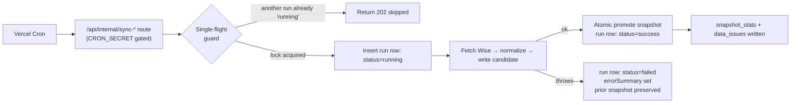
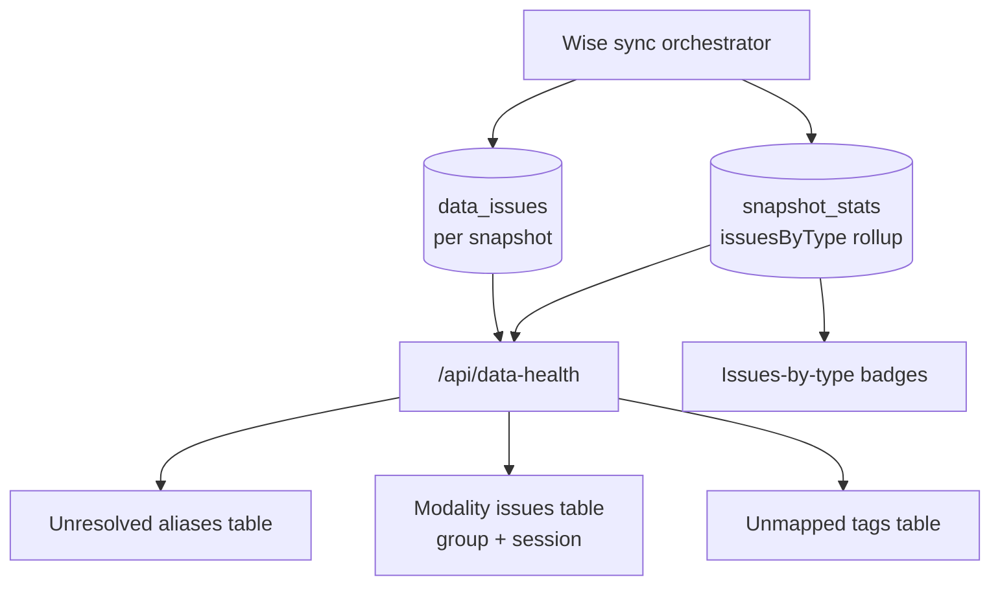
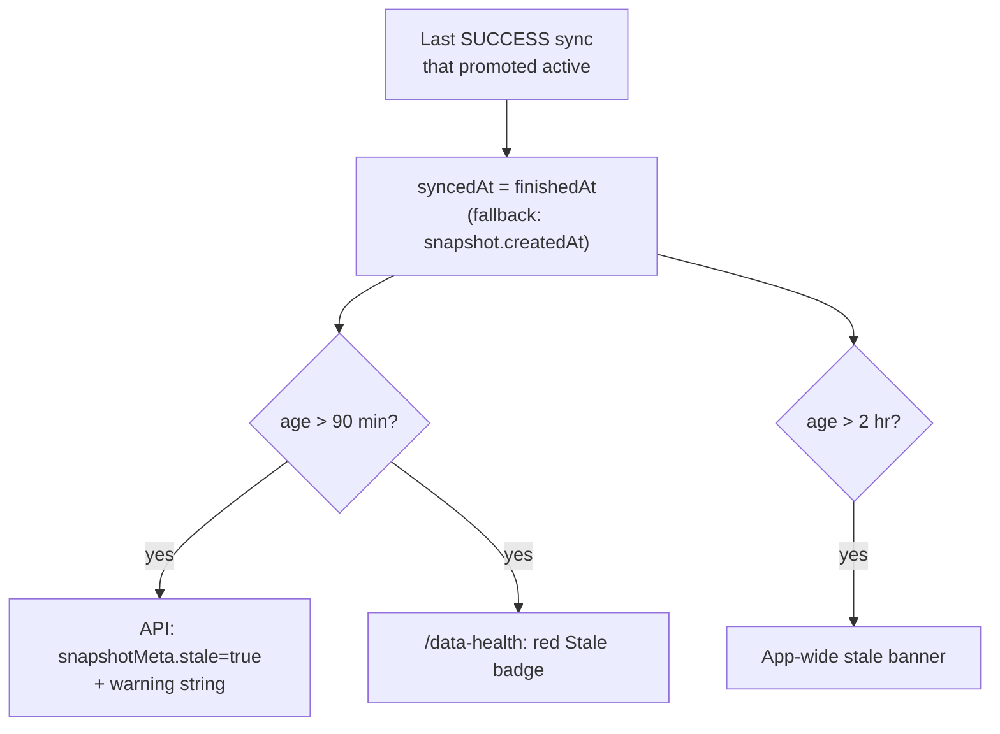

# Observability

**Status: stable**

> Note: the `docs/reference/database/*` and `docs/reference/api/*` targets referenced below are the canonical home for column-level and endpoint-signature detail. At the time of writing those targets are not all present in the repo (see [Open questions](#open-questions)); the links point at where that mechanical detail belongs.

## What this document covers

BGScheduler runs several independent ingestion pipelines, each backed by its own `*_sync_runs` ledger table. This runbook explains **how to tell whether the system is healthy** without shell access to the database:

- The four sync-run ledgers — `sync_runs`, `wise_activity_sync_runs`, `credit_control_sync_runs`, `payroll_sync_runs` — and what each row means.
- `snapshot_stats` and `data_issues`: the per-snapshot health counters and the categorised list of unresolved normalization problems.
- The `/data-health` surface, which is the one admin-facing screen for the Wise snapshot pipeline.
- The failure modes each ledger can land in, and how a wedged or abandoned run is automatically cleaned up.
- How a **stale snapshot** is detected and flagged — both in API responses and as a cross-app banner.

This is an operations runbook. The *meaning* of the Data Health screen (what each card is for, who reads it) lives in the feature doc, [`docs/features/data-health.md`](../features/data-health.md); the per-domain pipelines have their own feature docs ([credit-control](../features/credit-control.md), [payroll](../features/payroll.md), [wise-activity-audit](../features/wise-activity-audit.md)). Column-by-column table definitions belong in `docs/reference/database/*`. This document links to those rather than restating them.

## The mental model: snapshots vs. ledgers

Two different things are versioned, and conflating them is the most common source of confusion:

1. **Snapshots** (`snapshots`, `credit_control_snapshots`) are versioned *data*. Exactly one row has `active = true` at a time; the rest of the app reads only the active one. Promotion of a new snapshot is atomic.
2. **Sync runs** (`*_sync_runs`) are an *audit ledger* of ingestion attempts. A run row records when an attempt started, whether it finished, what it produced, and — on failure — why. A run may or may not promote a snapshot; a failed run leaves the previously-active snapshot in place.

A healthy system is one where the **most recent** run in each ledger is `success` and the active snapshot it promoted is recent enough that the staleness thresholds (below) have not tripped.

## The four sync-run ledgers

All four ledgers share the same `sync_status` enum — `running`, `success`, `failed` (`src/lib/db/schema.ts:19-23`) — and the same lifecycle skeleton: a row is inserted `running`, then transitioned to `success` or `failed` with `finishedAt` stamped. They differ in what they count and how they are triggered.

| Ledger table | Pipeline | Triggered by | Cron schedule | Single-flight guard |
|---|---|---|---|---|
| `sync_runs` | Wise tutor snapshot (the data Search/Compare run against) | Vercel cron + manual "Sync now" | `*/30 * * * *` | `sync_runs_single_running_idx` |
| `wise_activity_sync_runs` | Wise activity audit events | Vercel cron + manual backfill | `5,35 * * * *` | `wise_activity_sync_runs_single_running_idx` |
| `credit_control_sync_runs` | Credit-control snapshot | Vercel cron + manual | `20,50 * * * *` | `ccsr_single_running_idx` |
| `payroll_sync_runs` | Payroll month computation | **Manual only** (no cron) | — | `payroll_sync_runs_single_running_idx` |

Cron schedules are registered in `vercel.json`. Note that **payroll has no cron entry** — it is invoked on demand via `POST /api/payroll/sync` and every run row is stamped `triggerType: "manual"` (`src/lib/payroll/sync.ts:264`). The Wise snapshot sync runs on the Pro plan with a generous function ceiling: `export const maxDuration = 800` (`src/app/api/internal/sync-wise/route.ts:6`).

### `sync_runs` — Wise tutor snapshot

Defined at `src/lib/db/schema.ts:171-186`. Key columns for observability:

- `status`, `startedAt`, `finishedAt` — lifecycle.
- `snapshotId` — the *candidate* snapshot created for this run, set immediately after the run row (`src/lib/sync/orchestrator.ts:78-81`).
- `promotedSnapshotId` — set **only** if the candidate passed validation and was promoted to active (`orchestrator.ts:500`, `514`). A non-null `promotedSnapshotId` is the signal that this run actually changed what the app serves.
- `teacherCount` — how many Wise teachers were fetched.
- `errorSummary` — populated on the failure path only.
- `metadata` (jsonb) — carries the past-sessions diff-hook timings and snapshot-pruning result (`orchestrator.ts:503-506`, `539`).

The full lifecycle: insert `running` (`orchestrator.ts:62-68`), attach the candidate `snapshotId` (`78-81`), do all the work, then on the happy path update to `success` with `promotedSnapshotId`/`teacherCount`/`metadata` (`509-518`). On any thrown error the `catch` sets `status: "failed"`, `finishedAt`, and `errorSummary` (`561-586`). The cleanup `UPDATE` itself is wrapped in `.catch()` so that if the database is unreachable, the original error still surfaces and a log line explains why the row is stuck `running` (`orchestrator.ts:573-585`).

### `wise_activity_sync_runs` — activity audit

Defined at `src/lib/db/schema.ts:225-243`. This is a **read-only audit** pipeline (it never promotes a snapshot), so it has no `promotedSnapshotId`. Instead it records ingestion volume: `pagesFetched`, `eventsFetched`, `insertedCount`, and the `oldestEventTimestamp`/`newestEventTimestamp` window covered. `triggerType` distinguishes `cron` from `manual` backfills, which use different lookback/page caps (`src/lib/wise-activity/sync.ts:146-148`).

### `credit_control_sync_runs` — credit-control snapshot

Defined at `src/lib/db/schema.ts:459-477`. Mirrors `sync_runs`: it has both `snapshotId` and `promotedSnapshotId` (referencing `credit_control_snapshots`), plus domain counters `studentCount`, `packageCount`, `sessionCount`.

### `payroll_sync_runs` — payroll month

Defined at `src/lib/db/schema.ts:855-873`. Scoped by `payrollMonth` (a `date`), so several runs accumulate per month. Counters are `teacherCount`, `sessionCount`, `invoiceCount`. There is no snapshot concept here; the latest run for a month is the source of truth for that month's review.

## `snapshot_stats` — per-snapshot health counters

Defined at `src/lib/db/schema.ts:1762-1778`, one row per snapshot (unique on `snapshotId`). Written once, at the end of a successful Wise sync, just before promotion (`src/lib/sync/orchestrator.ts:458-470`). It is a denormalized rollup so the Data Health screen can render headline numbers without scanning the snapshot's data tables.

Fields:

- `totalWiseTeachers`, `totalIdentityGroups`, `resolvedGroups`, `unresolvedGroups` — identity-resolution health. `resolvedGroups` is computed as the groups *not* implicated in an identity issue (`orchestrator.ts:462`); `unresolvedGroups` equals the identity-issue count (`463`).
- `totalQualifications`, `totalAvailabilityWindows`, `totalLeaves`, `totalFutureSessions` — volume counters for the normalized tables.
- `totalDataIssues` — total issue count for the snapshot.
- `issuesByType` (jsonb) — a `Record<type, count>` map, built by tallying every issue's `type` (`orchestrator.ts:453-456`). This is what powers the "Issues by Type" badges on the dashboard.

Because `snapshot_stats` is written *only* on the success path, a snapshot that was never promoted has no stats row, and the Data Health screen falls back to `null` stats (`src/app/api/data-health/route.ts:65`, `122-131`).

## `data_issues` — categorised unresolved problems

Defined at `src/lib/db/schema.ts:1744-1758`. Every normalization problem the sync cannot resolve cleanly is recorded here, scoped to the snapshot that produced it (`snapshotId`, indexed at `1756-1757`). This is the fail-closed audit trail: rather than silently dropping a tutor, the pipeline writes an issue and routes the tutor to "Needs Review".

Each row carries a `type`, a `severity`, optional entity pointers (`entityType`/`entityId`/`entityName`), a human-readable `message`, and optional `metadata`.

### Issue types

The `data_issue_type` enum (`src/lib/db/schema.ts:25-32`) has six values. Where each originates during the Wise sync:

| `type` | Meaning | Emitted at |
|---|---|---|
| `alias` | A tutor identity could not be resolved (nickname/alias cascade failed). | `src/lib/sync/orchestrator.ts:97-100` (mapped from identity issues, severity `critical`) |
| `completeness` | Missing required field on a Wise record (e.g. teacher with no user ID), or a per-group fetch error that did not abort the sync. | `orchestrator.ts:165`, `252-253`, `343`; diff-hook issues `408-417` |
| `modality` | A tutor group's online/onsite modality could not be derived. | `orchestrator.ts` (group-level, via `deriveModality`) |
| `conflict_model` | A *session-level* contradiction between modality signals (a stronger, per-session check than the group-level `modality` issue). | `orchestrator.ts:384-385` (from `detectSessionModalityConflict`) |
| `tag` | A raw Wise tag could not be mapped to a subject/curriculum/level qualification. | qualification normalization |
| `sync` | Reserved sync-level issue category (enum member). | — |

### Severities

The `data_issue_severity` enum is `critical | high | medium | low` (`src/lib/db/schema.ts:34-39`), defaulting to `high`. In practice identity (`alias`) issues are written `critical` (`orchestrator.ts:100`) and completeness/modality/conflict issues `high` (`166`, `253`, `343`, `385`). Severity is stored but the current `/data-health` surface groups and counts by **type**, not severity (see below).

### How issues surface on `/data-health`

The route does not return raw issues wholesale. It filters the snapshot's issues into three drill-down lists plus a by-type histogram (`src/app/api/data-health/route.ts:82-101`):

- **Unresolved aliases** — `type === "alias"` (`route.ts:87-89`).
- **Modality issues** — a *combined* counter covering both group-level `modality` issues **and** session-level `conflict_model` issues, merged by the `selectModalityIssues` helper (`route.ts:97`, implemented in `src/app/api/data-health/modality-counter.ts`). The route's own JSDoc warns this number is expected to rise after the session-level check shipped — that is surface-of-reality, not a regression (`route.ts:8-23`).
- **Unmapped tags** — `type === "tag"` (`route.ts:99-101`).

The `issuesByType` map comes straight from `snapshot_stats.issuesByType` (`route.ts:79`), not recomputed from rows.

## The `/data-health` surface

`GET /api/data-health` (`src/app/api/data-health/route.ts`) is auth-gated (401 if no session, `route.ts:34-37`) and is **read-only** — it issues only `SELECT`s. It is scoped to the **Wise snapshot pipeline only** (`sync_runs` + `snapshots` + `snapshot_stats` + `data_issues`); it does **not** report on credit-control, payroll, or wise-activity runs.

What it returns (`route.ts:116-144`):

- `lastSuccessfulSync` / `lastFailedSync` — newest `finishedAt` for `status = success` / `failed` (`route.ts:43-56`).
- `lastFailureError` — `errorSummary` of the newest failed run (`route.ts:119`).
- `staleAgeMs` / `staleMinutes` — wall-clock age of the last successful sync (`route.ts:105-107`, `120-121`).
- `activeSnapshotId` — id of the `active = true` snapshot (`route.ts:59-63`).
- `stats` — the five headline counts from `snapshot_stats` (`route.ts:123-131`), or `null` if no stats row exists.
- `issuesByType`, `unresolvedAliases`, `unresolvedModality`, `unmappedTags` — as described above.
- `recentSyncs` — the last 10 runs by `startedAt` (`route.ts:110-114`, `136-143`), the rolling history table on the page.

The page (`src/app/(app)/data-health/page.tsx`) renders three status cards (last success, active snapshot, last failure), five stat cards, the by-type badges, the three drill-down tables, and the recent-history table. It also exposes the one operational lever — **Sync now** — and shows a red "Stale (Nm ago)" badge when `isApiSnapshotStale(staleAgeMs)` is true (`page.tsx:191`, `211-215`).

The other three pipelines surface their latest-run state inside their **own** feature screens rather than on `/data-health`:

- **Wise activity** exposes `lastSyncAt` / `lastSyncStatus` / `lastSyncInsertedCount` from the newest `wise_activity_sync_runs` row (`src/lib/wise-activity/data.ts:174-175`, `220-228`).
- **Payroll** exposes the newest run for the selected month as `lastSync` with `status`/`finishedAt`/`errorSummary` (`src/lib/payroll/data.ts:540-542`, `88-98`).
- **Credit control** reads its active snapshot and follow-up state for its own dashboard (`src/lib/credit-control/db.ts`).

## Failure modes

### 1. A run throws → `failed` with `errorSummary`

The universal failure path: the run row is updated to `status: "failed"`, `finishedAt` is stamped, and a short `errorSummary` is recorded. This is identical in shape across all four pipelines:

- Wise snapshot: `src/lib/sync/orchestrator.ts:561-586`.
- Wise activity: `src/lib/wise-activity/sync.ts:262-269`.
- Credit control: `src/lib/credit-control/sync.ts:585-587`.
- Payroll: `src/lib/payroll/sync.ts:441-443`.

Crucially, a failed Wise or credit-control sync **does not** promote its candidate snapshot, so the previously-active snapshot keeps serving. The app degrades to *stale-but-correct*, never *empty or wrong*.

### 2. Validation gate blocks promotion (Wise only)

Even without an exception, the Wise sync refuses to promote a catastrophically broken snapshot. If more than 50% of identity groups are unresolved, `shouldPromote` is false and the run finishes `success` with `promotedSnapshotId = null` (`src/lib/sync/orchestrator.ts:473-476`, `480`). The run "succeeded" in the sense that it completed cleanly, but it deliberately left the old snapshot active. Watch for a `success` run whose `promotedSnapshotId` is null — that is the validation gate firing.

### 3. Single-flight guard skips an overlapping run

Each ledger has a partial unique index that permits at most one `running` row (e.g. `sync_runs_single_running_idx`, `src/lib/db/schema.ts:182-184`). Before inserting a new `running` row, the guard checks for an existing one and, if found, returns a `202`-style skipped result instead of starting a second sync (`src/lib/sync/run-wise-sync.ts:93-97`, `120-140`). If two requests race past the check, the second `INSERT` hits the unique constraint (`23505`) and is converted into the same skipped result (`run-wise-sync.ts:106-117`). This prevents two crons (or a cron + a manual click) from clobbering each other.

### 4. Abandoned `running` row → force-failed after 20 minutes

If a function is killed mid-run (timeout, deploy, abort), its row is left dangling in `running` and would otherwise block all future syncs forever via the single-flight guard. Every pipeline guards against this by force-failing any `running` row older than **20 minutes** before acquiring a new one:

- Wise snapshot: `STALE_RUNNING_SYNC_MS = 20 * 60 * 1000` (`src/lib/sync/run-wise-sync.ts:10`); `failStaleRunningSyncs` flips stale rows to `failed` with an explanatory `errorSummary` (`run-wise-sync.ts:39-72`).
- Credit control: identical, `STALE_RUNNING_CREDIT_CONTROL_SYNC_MS` (`src/lib/credit-control/run-sync-request.ts:9`, `50-68`).
- Wise activity: `markAbandonedRuns` (`src/lib/wise-activity/sync.ts:117-129`).
- Payroll: `markAbandonedRuns` (`src/lib/payroll/sync.ts:117-137`).

A force-failed row's `errorSummary` reads, e.g., *"Sync marked failed because it was still running after 20 minutes; likely timed out or the request was aborted."* (`run-wise-sync.ts:39-40`). The count of rows reaped this way is returned as `staleRunningSyncsFailed` on the next run's response, so an operator triggering "Sync now" can see if a wedge was just cleared.

**Worth knowing:** the 20-minute cutoff is wider than the Wise sync's 800s (~13.3 min) function ceiling, so a legitimately-running sync can never be force-failed; the cutoff is purely a safety net for abandoned rows. The trade-off is that a genuinely wedged row blocks roughly 1.5 cron cycles (the 30-min Wise cadence) before the next invocation reaps it.

### 5. Route-level error

`/api/data-health` itself wraps its body in try/catch and returns `{ error }` with `500` on any failure (`src/app/api/data-health/route.ts:145-148`); a `401` is returned when unauthenticated (`34-37`). A failed Data Health *fetch* is a problem with the observability surface, not necessarily with the underlying syncs.

## How stale snapshots are flagged

Staleness is computed from the **age of the last successful sync**, not from any flag stored on the snapshot. There are two distinct thresholds, both centralized in `src/lib/ops/stale.ts`:

| Constant | Value | Effect |
|---|---|---|
| `API_STALE_THRESHOLD_MS` | 90 minutes (`stale.ts:2`) | API responses set `snapshotMeta.stale = true` and push a warning string. |
| `APP_STALE_BANNER_THRESHOLD_MS` | 2 hours (`stale.ts:3`) | The cross-app banner appears. |

The 90-minute API threshold is deliberately wider than the 30-minute Pro cron cadence to tolerate a couple of missed/recovering cycles before crying wolf (`stale.ts:1`).

### Where the flag is set

**Search/Compare API responses.** When the search engine builds a response it computes `stale: Date.now() - index.syncedAt.getTime() > staleThresholdMs` (default `API_STALE_THRESHOLD_MS`) and, if stale, appends `STALE_SEARCH_WARNING` to the `warnings` array (`src/lib/search/engine.ts:25`, `30-37`). The `SnapshotMeta` shape (`{ snapshotId, syncedAt, stale }`) is defined at `src/lib/search/types.ts:30-34`.

The `syncedAt` anchor is the `finishedAt` of the **successful sync that promoted the active snapshot** — found by matching `status = success AND promotedSnapshotId = <active>` (`src/lib/search/index.ts:155-165`) — falling back to the snapshot's `createdAt` if no such run is found (`index.ts:166`).

**The `/data-health` page.** It calls `isApiSnapshotStale(staleAgeMs)` (90-min threshold) to decide whether to show the red "Stale (Nm ago)" badge (`src/app/(app)/data-health/page.tsx:191`, `211-215`).

**The cross-app banner.** `StaleSnapshotBanner` fetches `/api/data-health`, reads `staleAgeMs`, and shows the banner when `shouldShowStaleBanner(staleAgeMs)` is true (2-hour threshold) (`src/components/layout/stale-snapshot-banner.tsx:58-66`). Dismissal is remembered per session (`stale-snapshot-banner.tsx:44`, `84`). The banner text and "View data health" deep link are also centralized in `stale.ts:6-9`.

### Index freshness vs. data staleness — not the same thing

Independent of the staleness *threshold*, the in-memory search index keeps itself pointed at the current active snapshot. `ensureIndex` compares the cached index's `snapshotId` (and tutor-profile version) against the live `active = true` snapshot on each call and rebuilds when they diverge (`src/lib/search/index.ts:354-401`, comparison at `377-383`). So a freshly-promoted snapshot is picked up automatically; the 90-minute/2-hour thresholds are about whether the *data itself* has gone unrefreshed for too long, not about index cache coherence.

## Quick operator checklist

- **Is tutor search fresh?** Open `/data-health`. Green if "Last Successful Sync" is recent and no Stale badge. The "Active Snapshot" short id should match the snapshot most recently promoted.
- **A sync failed — why?** Read `lastFailureError` (the failed run's `errorSummary`) on `/data-health`, or the newest `failed` row's `errorSummary` in the relevant `*_sync_runs` table.
- **A `success` run but data didn't change?** Check `promotedSnapshotId`; if null, the >50% unresolved-identity validation gate blocked promotion (Wise only).
- **Syncs seem stuck / "already running"?** A dangling `running` row is blocking the single-flight guard. It self-heals after 20 minutes; the next run's `staleRunningSyncsFailed` count confirms the reap. Manual "Sync now" triggers the reap immediately.
- **Too many issues?** The `issuesByType` badges and the alias/modality/tag drill-down tables on `/data-health` point at exactly which Wise source records need a human fix. Modality counts intentionally include both group- and session-level contradictions.

## Open questions

- **Reference targets not yet present.** This doc links column-level detail to `docs/reference/database/*` and endpoint signatures to `docs/reference/api/*`, but those files do not all exist yet. Should they be authored, or should the canonical home be reconsidered?
- **No unified observability surface for the non-Wise pipelines.** `/data-health` covers only `sync_runs`. Credit-control, payroll, and wise-activity each expose their latest-run state only inside their own feature screens. Is a single cross-pipeline health view desirable, or is per-feature surfacing intentional?
- **Severity is recorded but unused in the surface.** `data_issues.severity` (`critical`/`high`/`medium`/`low`) is stored but `/data-health` groups only by `type`. Should severity drive sorting or alerting?
- **`sync` issue type appears unused.** The `data_issue_type` enum includes `sync`, but no emission site for it was found during this pass. Is it reserved for future use or dead?
- **Stale-running cutoff vs. cron cadence.** The 20-minute abandoned-run cutoff is wider than the 800s function ceiling (safe) but also wider than the 30-minute Wise cron interval is short, so a wedged row can block up to ~1.5 cycles before cleanup. Acceptable today; flagged in case cron cadence tightens.

_Verified against HEAD + uncommitted WIP on 2026-05-31._
