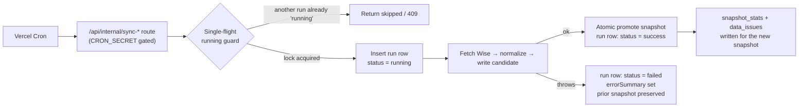
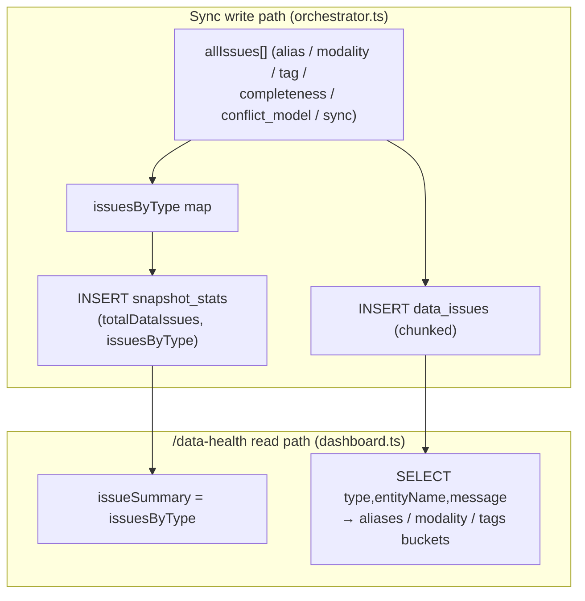
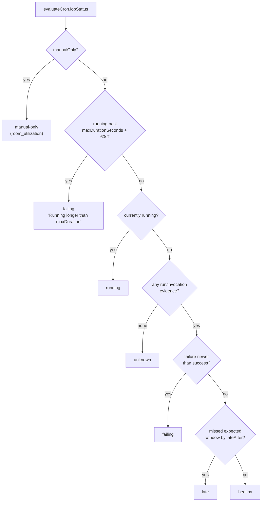
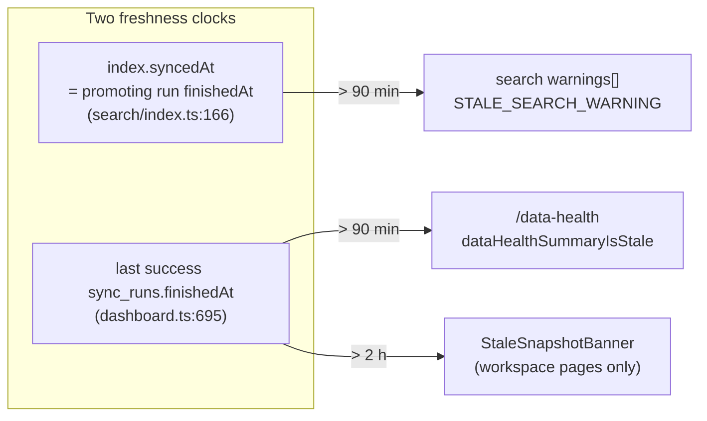

# Observability

**Status: stable**

> The `docs/reference/database/*` and `docs/reference/api/*` targets are the canonical home for column-level table definitions and endpoint signatures. This runbook explains how to *read* the health signals and what they mean; it links to reference for the mechanical detail rather than restating column lists.

## What this document covers

BGScheduler ingests data through several independent pipelines, each backed by its own `*_sync_runs` ledger table. This runbook explains **how to tell whether the system is healthy** — what the ledger tables record, how the `/data-health` surface assembles them into a single readout, what failure modes each pipeline can land in, and how a stale snapshot gets flagged.

Specifically:

- The sync-run ledgers — `sync_runs`, `wise_activity_sync_runs`, `credit_control_sync_runs`, `payroll_sync_runs` (and the sibling `leave_request_sync_runs` / `progress_test_sync_runs`) — and what a row in each means.
- `snapshot_stats` and `data_issues`: the per-snapshot health counters and the categorised list of unresolved normalization problems, broken down by **type** and **severity**.
- The `/data-health` API surface (`GET /api/data-health`), which is the one admin-facing screen that fuses every ledger plus a cron-invocation audit into an overall status.
- The failure modes each ledger can land in, and how a wedged or abandoned run is detected.
- How a **stale snapshot** is detected and flagged — in search API responses, in the dashboard payload, and as a cross-app banner.

This is an operations document. The *meaning* of the Data Health screen (what each card is for, who reads it) lives in the feature doc [`docs/features/data-health.md`](../features/data-health.md); the per-domain pipelines have their own feature docs ([credit-control](../features/credit-control.md), [payroll](../features/payroll.md), [wise-activity-audit](../features/wise-activity-audit.md)). Column-by-column table definitions belong in [`docs/reference/database/index.md`](../reference/database/index.md).

## Mental model: snapshots vs. ledgers

Two different things are versioned, and conflating them is the most common source of confusion:

1. **Snapshots** (`snapshots` at `src/lib/db/schema.ts:198`, `credit_control_snapshots`) are versioned *data*. Exactly one snapshot row carries `active = true` at a time, and the rest of the app reads only that one. Promotion of a new snapshot is a single atomic `UPDATE` (`src/lib/sync/orchestrator.ts:488`).
2. **Sync runs** (`*_sync_runs`) are an *audit ledger* of ingestion attempts. A run row records when an attempt started, whether it finished, what it produced, and — on failure — why (`errorSummary`). A run may or may not promote a snapshot; a failed run leaves the previously-active snapshot in place.

A healthy system is one where the **most recent** run in each ledger is `success`, and the active snapshot it promoted is recent enough that the staleness thresholds (below) have not tripped.



## The sync-status enum

Every `*_sync_runs.status` column is the same Postgres enum, `sync_status`, with exactly three values (`src/lib/db/schema.ts:19`):

| Value | Meaning |
|---|---|
| `running` | A run is in progress, or was left wedged (never reached a terminal state). |
| `success` | The run completed. For `sync_runs` this does **not** guarantee promotion — see the promotion gate below. |
| `failed` | The run threw; `errorSummary` carries the message. |

Every ledger defaults `status` to `running` on insert (e.g. `src/lib/db/schema.ts:206`), so the row exists *before* the work starts and is updated to a terminal state when it ends. A row stuck in `running` therefore means the process died mid-flight.

## The sync-run ledgers

All ledgers share the same backbone columns: `id`, `status` (the `sync_status` enum), `startedAt`, `finishedAt`, `errorSummary`, and a `metadata` JSONB. Each adds domain-specific counters and a partial unique index that enforces single-flight. The four tables named in this runbook's scope:

### `sync_runs` — Wise tutor snapshot (`src/lib/db/schema.ts:204`)

The primary pipeline, feeding tutor search and compare. Distinctive columns:

- `snapshotId` — the candidate snapshot this run wrote into.
- `promotedSnapshotId` — set **only if** the run actually promoted (passed the promotion gate). A `success` row with a null `promotedSnapshotId` means the run completed but was blocked from promotion.
- `teacherCount` — teachers fetched from Wise.
- `metadata` — on a promoting run, carries `diffHookDurationMs`, `pastSessionsCapturedCount`, and a `pruning` summary (`src/lib/sync/orchestrator.ts:503`, `:539`).

Single-flight is enforced by `sync_runs_single_running_idx`, a unique index on `status` filtered to `WHERE status = 'running'` (`src/lib/db/schema.ts:215`) — at most one `running` row can exist, so a concurrent cron tick cannot start a second sync.

### `wise_activity_sync_runs` — Wise Activity audit ingest (`src/lib/db/schema.ts:280`)

Read-only ingestion of Wise audit events. Distinctive columns: `triggerType`, `pagesFetched`, `eventsFetched`, `insertedCount`, `oldestEventTimestamp`, `newestEventTimestamp`. Single-flight via `wise_activity_sync_runs_single_running_idx` (`:294`). When a second run is attempted while one is `running`, the sync throws `WiseActivitySyncAlreadyRunningError`, which the manual path maps to HTTP 409 (`src/lib/data-health/run-job.ts:48`).

### `credit_control_sync_runs` — Credit Control snapshot (`src/lib/db/schema.ts:517`)

A second snapshot lineage (it references `creditControlSnapshots` via `snapshotId` / `promotedSnapshotId`). Distinctive counters: `studentCount`, `packageCount`, `sessionCount`. Single-flight via `ccsr_single_running_idx` (`:532`).

### `payroll_sync_runs` — Monthly payroll reconciliation (`src/lib/db/schema.ts:995`)

Keyed by `payrollMonth` (a `date`), so multiple months coexist. Distinctive columns: `triggerType` (defaults to `"manual"`), `teacherCount`, `sessionCount`, `invoiceCount`. Single-flight via `payroll_sync_runs_single_running_idx` on `status` (`:1008`) — note this is **global**, not per-month, so two different months cannot be syncing simultaneously. Downstream tables (`payrollReviews`, etc.) carry a `lastSyncRunId` / `syncRunId` FK back to this ledger (`:1023`, `:1034`).

> Two further ledgers follow the identical shape but fall outside the four-table scope of this runbook: `leave_request_sync_runs` (`src/lib/db/schema.ts:1325`; adds `scannedRowCount` / `insertedCount` / `updatedCount` / `notificationCount`) and `progress_test_sync_runs` (`:2185`; adds `ledgerRowCount` / `enrollmentCount` / `approachingCount` / `dueCount` / `notificationCount`). Both are surfaced on `/data-health` the same way.

### Reading a ledger

To answer "is pipeline X healthy?" without DB shell access, the rule the dashboard itself uses (`src/lib/data-health/dashboard.ts`):

- **Latest run** — the row with the greatest `startedAt`. If its `status` is `failed`, the pipeline is failing.
- **Latest success** — the most recent `status = success` row with a `finishedAt`. This is the freshness anchor (`latestSuccessful`, `src/lib/data-health/dashboard.ts:107`).
- **Latest failure after latest success** — if a failure is newer than the newest success, the domain is failing even if older successes exist (`hasRecentFailure`, `src/lib/data-health/status.ts:200`).
- **Running too long** — a `running` row older than the job's `maxDurationSeconds` (+60s buffer) is treated as wedged/failing (`src/lib/data-health/status.ts:203`).

## `snapshot_stats` — per-snapshot health counters

`snapshot_stats` (`src/lib/db/schema.ts:1913`) holds exactly one row per snapshot (`ss_snapshot_idx` is unique on `snapshotId`, `:1928`). It is written once at the end of a successful sync, before promotion (`src/lib/sync/orchestrator.ts:458`). Columns and how each is derived:

| Column | Source at write time (`orchestrator.ts:458`) |
|---|---|
| `totalWiseTeachers` | `wiseTeachers.length` — raw teacher records from Wise. |
| `totalIdentityGroups` | `groups.length` — identity groups after the 5-step cascade. |
| `resolvedGroups` | groups with no unresolved-identity issue (`:462`). |
| `unresolvedGroups` | `identityIssues.length` — groups that failed identity resolution. |
| `totalQualifications` | `qualificationRows.length`. |
| `totalAvailabilityWindows` | `recurringAvailabilityRows.length`. |
| `totalLeaves` | `datedLeaveRows.length`. |
| `totalFutureSessions` | `sessionBlocks.length`. |
| `totalDataIssues` | `allIssues.length` — every `data_issues` row for this snapshot. |
| `issuesByType` | JSONB map of `data_issue_type → count`, accumulated from `allIssues` (`:453`). |

`resolvedGroups + unresolvedGroups` and `unresolvedGroups / totalIdentityGroups` are the inputs to the **promotion gate** (below): the same `unresolvedRatio` that decides promotion is what these counters expose after the fact.

The dashboard reads this row only for the **active** snapshot (`src/lib/data-health/dashboard.ts:660`). If the active snapshot has no `snapshot_stats` row, the payload's `stats` is `null` and the Tutor Snapshot domain reads "No active snapshot" (`:345`).

## `data_issues` — categorised normalization problems

`data_issues` (`src/lib/db/schema.ts:1895`) is the itemised list behind the `totalDataIssues` counter. Each row is scoped to a snapshot (`snapshotId` FK, `:1897`) and classified along two axes.

### By type — `data_issue_type` enum (`src/lib/db/schema.ts:25`)

| Type | Emitted when |
|---|---|
| `alias` | Identity resolution could not match a teacher record (unresolved alias). Issues are seeded from `identityIssues` at `src/lib/sync/orchestrator.ts:97`. |
| `modality` | A tutor's online/onsite modality could not be resolved. |
| `tag` | A Wise qualification tag did not map to subject/curriculum/level/examPrep. |
| `completeness` | A per-group data-fetch failure during the past-sessions diff hook — emitted but never aborts the sync (`src/lib/sync/past-sessions-diff-hook.ts:19`). |
| `conflict_model` | A modality contradiction (fail-closed: emits `unknown` + low confidence rather than guessing; `orchestrator.ts:365`). |
| `sync` | A sync-level issue. |

### By severity — `data_issue_severity` enum (`src/lib/db/schema.ts:34`)

`critical`, `high`, `medium`, `low`. The column defaults to `high` (`:1899`).

### How the dashboard groups them

`/data-health` surfaces `data_issues` two ways:

1. **`issueSummary` / `issuesByType`** — the pre-aggregated `snapshot_stats.issuesByType` map (type → count). Cheap; no per-row scan.
2. **`issueDetails`** — a live `SELECT type, entityName, message` over `data_issues` for the active snapshot (`src/lib/data-health/dashboard.ts:681`), then bucketed by `issueDetailsFromIssues` (`:258`) into three reviewer-facing lists:
   - `unresolvedAliases` ← `type = 'alias'`
   - `unresolvedModality` ← `type IN ('modality', 'conflict_model')`
   - `unmappedTags` ← `type = 'tag'`

   Note that `completeness` and `sync` issues count toward `totalDataIssues` and `issuesByType` but are **not** broken out into a detail list. The `severity` column is stored but is **not** part of the dashboard payload — there is no severity filter on the screen today (see [Open questions](#open-questions)).



## The `/data-health` surface

`GET /api/data-health` (`src/app/api/data-health/route.ts`) is the single admin-facing observability endpoint. It requires an authenticated session — `auth()` → 401 if absent (`route.ts:15`) — and otherwise returns the output of `getDataHealthDashboardPayload()` (`route.ts:21`), or 500 on error. There is no `CRON_SECRET` tier here; this is an admin screen, not a cron route.

### What the payload contains

The shape is `DataHealthDashboardPayload` (`src/lib/data-health/types.ts:107`). Key sections:

- **`overall`** — a single fused status (`healthy` / `late` / `failing` / `running` / `unknown` / `manual-only`) plus per-status counts. Computed as the **worst** status across all non-manual cron jobs (`overallFromJobs`, `dashboard.ts:596`), using a severity ranking where `failing(5) > late(4) > running(3) > unknown(2) > manual-only(1) > healthy(0)` (`statusRank`, `src/lib/data-health/cron-registry.ts:214`).
- **`cronJobs[]`** — one `CronJobHealth` per registered job (next section).
- **`dataDomains[]`** — seven per-domain cards (Tutor Snapshot, Wise Activity Audit, Sales Dashboard, Credit Control, Leave Requests, Class Assignments, Room Utilization) with a freshness label, last-success time, record-count label, and issue count (`buildDomains`, `dashboard.ts:328`).
- **`wiseSnapshot`** — the Wise pipeline's `activeSnapshotId`, `lastSuccessfulSync`, `lastFailedSync` + `lastFailureError`, `staleAgeMs` / `staleMinutes`, and the `snapshot_stats` row (`dashboard.ts:699`).
- **`issueSummary`** + **`issueDetails`** — the `data_issues` rollups described above.
- **`recentRuns[]`** — the 30 most recent runs across all ledgers, interleaved and sorted by `startedAt` (`buildRecentRuns`, `dashboard.ts:443`, `:533`).
- **`recentSyncs[]`** — the last 8 Wise `sync_runs` specifically (`dashboard.ts:735`).
- **Top-level compatibility mirrors** — `lastSuccessfulSync`, `staleAgeMs`, `staleMinutes`, `stats`, `issuesByType`, `unresolvedAliases`, etc. are duplicated at the payload root for the stale-banner client and older tests (`types.ts:132`).

### How freshness is computed

The Wise freshness clock is driven by the **last successful `sync_runs` row**, not by the snapshot's own `createdAt`:

```text
staleAgeMs = now - lastSuccess.finishedAt     (dashboard.ts:695)
staleMinutes = round(staleAgeMs / 60000)
```

`lastSuccess` is the newest `sync_runs` row with `status = 'success'` ordered by `finishedAt` (`dashboard.ts:631`). If there has never been a successful sync, `staleAgeMs` is `null`.

### Data-fetch budget

`getDataHealthDashboardPayload` issues the ledger reads with `Promise.all` and a `RECENT_LIMIT` of 8 rows per ledger (`dashboard.ts:17`, `:538`). Cron-invocation rows are capped at 80 (`dashboard.ts:585`). The `cron_invocations` read is wrapped in a try/catch that downgrades a missing-table error to an empty list (`dashboard.ts:586`) so the dashboard still renders from run-table inference if that table has not been migrated yet.

## Cron health: proof sources, late detection, and stuck runs

`/data-health` does not just read run tables — it also reconciles them against a **cron-invocation audit** (`cron_invocations`, `src/lib/db/schema.ts:221`). Every internal/admin job is wrapped in `withCronInvocationAudit` (`src/lib/data-health/cron-audit.ts:144`), which inserts a `cron_invocations` row with `outcome = 'running'` before the work (`cron-audit.ts:91`) and updates it to a terminal outcome afterward. Outcomes are derived from the response (`determineOutcome`, `cron-audit.ts:61`): a body with `skipped === true` or an `"already running"` message → `skipped`; `ok === false` / `success === false` or HTTP ≥ 400 → `failed`; HTTP 202 → `skipped`; otherwise `success`.

Each cron job's status is then computed by `evaluateCronJobStatus` (`src/lib/data-health/status.ts:160`) from the **registry definition** (`CRON_JOBS`, `src/lib/data-health/cron-registry.ts:35`) plus the latest invocation and the latest run. The registry is the source of truth for each job's schedule, `lateAfterMinutes`, and `maxDurationSeconds`. The status precedence:



Two distinct "proof" sources feed this (`proof: "direct" | "inferred" | "none"`, `status.ts:185`): **direct** when a `cron_invocations` row confirms the route fired; **inferred** when only the run-table cadence is available (e.g. before the audit table accumulates rows). This is why a brand-new deployment can show `healthy` via "Run-table inference" before any cron-audit rows exist (`status.ts:313`).

### Registry cadence reference (for late detection)

`lateAfterMinutes` is how long past the expected window a scheduled job may go silent before it flips to `late` (`status.ts:282`). From `CRON_JOBS` (`cron-registry.ts:35`):

| Job key | Schedule (UTC cron) | Cadence | `lateAfterMinutes` | `maxDurationSeconds` |
|---|---|---|---|---|
| `wise_snapshot` | `*/30 * * * *` | Every 30 min | 45 | 800 |
| `wise_activity` | `5,35 * * * *` | Every 30 min | 45 | 800 |
| `sales_dashboard` | `10,40 * * * *` | Every 30 min | 45 | 800 |
| `credit_control` | `20,50 * * * *` | Every 30 min | 45 | 300 |
| `progress_tests` | `25,55 * * * *` | Every 30 min | 45 | 300 |
| `progress_tests_digest` | `35 0 * * *` | Daily 07:35 BKK | 60 | 300 |
| `leave_requests` | `15,45 * * * *` | Every 30 min | 45 | 800 |
| `classroom_morning` | `45 23 * * *` | Daily 06:45 BKK | 75 | 800 |
| `classroom_admin_email` | `0,10,20,30 0 * * *` | Daily 07:00–07:30 BKK | 30 | 300 |
| `student_promotions_july_1` | `5 17 30 6 *` | One-shot Jul 1 2026 | 1440 | 800 |
| `room_utilization` | — | Manual only | 0 | 800 |

> This table mirrors the registry; the cron *deployment* (entries in `vercel.json`) is documented in [`docs/reference/crons.md`](../reference/crons.md). `room_utilization` is `manualOnly` (no `schedule`) and is always reported as `manual-only`, never `late` (`status.ts:164`).

## Failure modes

### 1. A run fails (most common)

The orchestrator wraps fetch → normalize → persist → promote in one try/catch (`src/lib/sync/orchestrator.ts`). On any throw, the `sync_runs` row is updated to `status = 'failed'`, `finishedAt = now`, `errorSummary = <message>` (`orchestrator.ts:564`), and **no promotion happens** — the previously-active snapshot remains the one every reader sees. On `/data-health` this surfaces as `wiseSnapshot.lastFailedSync` + `lastFailureError`, and the cron job flips to `failing` because the failure is newer than the last success (`status.ts:200`).

The same pattern holds for the other ledgers: a thrown error lands the latest row in `failed`, and the domain card's `issueCount` ticks to 1 when its latest run is `failed` (e.g. `dashboard.ts:357` for Wise Activity, `:379` for Credit Control).

### 2. Promotion gate blocks an otherwise-successful run

A Wise sync can complete (`status = 'success'`) yet refuse to promote. The gate is identity-resolution quality: `unresolvedRatio = identityIssues.length / max(groups.length, 1)`, and promotion only happens when `unresolvedRatio < 0.5` (`orchestrator.ts:473`). If **≥ 50%** of identity groups are unresolved, `promotedSnapshotId` stays `null`, the candidate snapshot is written but never activated, and the old snapshot keeps serving. This is the fail-closed safety rule in action: a catastrophically-degraded fetch never replaces good data. Detect it by a `success` row whose `promotedSnapshotId` is null while `snapshot_stats.unresolvedGroups` is high.

### 3. A run is left wedged in `running`

If the serverless function is killed (timeout, OOM, deploy) after the run row is inserted but before it reaches a terminal state, the row stays `running`. Because the single-flight unique index only permits one `running` row, this can **block all future runs** of that pipeline until the stale row is cleared.

There is no scheduled sweeper inside this codebase that auto-fails abandoned rows; the cleanup paths are:

- **Detection on the dashboard** — `evaluateCronJobStatus` treats a `running` invocation/run older than `maxDurationSeconds + 60s` as `failing` with "Run appears stuck past maxDuration" (`status.ts:203`, `:207`). So a wedged Wise sync shows as `failing` once ~801s+ have elapsed, even though its row literally still says `running`.
- **Cleanup-failure visibility** — if the orchestrator's own `failed`-state write fails during error handling, it logs (but does not re-throw) so an operator can see why a row is stuck (`orchestrator.ts:573`, REL-06).

> The production claim that "abandoned `running` rows are failed after a timeout" (AGENTS.md) refers to behaviour in the single-flight wrappers (`run-wise-sync.ts` and the per-domain `run-sync-request` modules), not to the dashboard — the dashboard only *flags* stuck runs, it does not mutate them. See [Open questions](#open-questions).

### 4. `cron_invocations` table missing

If the audit table has not been migrated, the dashboard catches the "relation does not exist" error and proceeds with an empty invocation list (`dashboard.ts:586`). Cron statuses then fall back to run-table inference (`proof: "inferred"`). This is graceful degradation, not a failure — but it means cron `late`/`stuck` detection that depends on invocation timing is weaker until the table exists.

### 5. No active snapshot at all

If no snapshot has `active = true`, the search index throws "No active snapshot found" on build (`src/lib/search/index.ts:150`), and the dashboard's `stats` is `null` with the Tutor Snapshot card reading "No active snapshot" (`dashboard.ts:345`). This is the cold-start / total-failure state.

## Stale-snapshot detection and flagging

Staleness is treated as a **warning, never withheld data** — a stale snapshot still serves results, it just annotates them. There are two thresholds and they fire in three places, all anchored in `src/lib/ops/stale.ts`:

| Constant | Value | Meaning |
|---|---|---|
| `API_STALE_THRESHOLD_MS` | 90 min (`90 * 60 * 1000`) | Search results and the dashboard mark the snapshot "stale". |
| `APP_STALE_BANNER_THRESHOLD_MS` | 2 h (`2 * 60 * 60 * 1000`) | The cross-app warning banner appears. |

The 90-minute API threshold deliberately tolerates a missed 30-minute cron tick plus recovery headroom (comment, `src/lib/ops/stale.ts:1`).

### Where each fires

1. **Search API responses.** `executeSearch` computes `snapshotMeta.stale = (now - index.syncedAt) > API_STALE_THRESHOLD_MS` (`src/lib/search/engine.ts:33`). When stale, it pushes `STALE_SEARCH_WARNING` ("Search data may be stale — last sync was more than 90 minutes ago") into the response `warnings[]` (`engine.ts:37`). Here the clock is `index.syncedAt`, which is the **promoting** sync run's `finishedAt`, falling back to the snapshot's `createdAt` (`src/lib/search/index.ts:166`).
2. **`/data-health` payload.** `dataHealthSummaryIsStale(payload)` runs `isApiSnapshotStale(payload.staleAgeMs)` against the same 90-minute threshold (`dashboard.ts:746`). Here the clock is the last successful `sync_runs.finishedAt` (`dashboard.ts:695`).
3. **Cross-app banner.** `StaleSnapshotBanner` fetches `/api/data-health` and shows an amber "Tutor data may be outdated. Last successful sync was over 2 hours ago." bar when `shouldShowStaleBanner(staleAgeMs)` is true — i.e. `staleAgeMs > 2h` (`src/lib/ops/stale.ts`, `src/components/layout/stale-snapshot-banner.tsx:66`). The banner only renders on the search/scheduler/compare workspaces (`stale-snapshot-banner.tsx:18`) and is dismissable for the session via `sessionStorage` (`:84`).



> Subtlety: search staleness reads `index.syncedAt` (the in-memory index's anchor), while the dashboard and banner read the latest `sync_runs.finishedAt`. These can briefly diverge — e.g. immediately after a successful sync, the dashboard's clock resets but the in-memory index only resyncs its `syncedAt` once `ensureIndex` rebuilds (next section). In steady state they agree.

## How the in-memory index detects a changed snapshot

The search index is a `globalThis`-anchored singleton, not re-read per request. `ensureIndex` (`src/lib/search/index.ts:354`) decides whether to rebuild by comparing the cached snapshot id **and** the tutor-profile version against the current active snapshot (`index.ts:377`). If the active snapshot id changed (a new sync promoted) or the profile version changed, it rebuilds via `buildIndex`; otherwise it returns the cached index. Concurrent callers coalesce onto a single in-flight build promise to avoid a thundering herd (`index.ts:358`, `:396`). Notably, if there is suddenly **no** active snapshot, `ensureIndex` keeps serving the last cached index rather than erroring (`index.ts:384`) — a deliberate fail-soft.

This is why a freshly-promoted snapshot becomes visible to search on the next request that triggers a rebuild, and why the search-side staleness clock (`index.syncedAt`) updates only at that point.

## Operator quick-reference

- **"Is search data current?"** → `GET /api/data-health`, read `staleMinutes`. ≤ 90 → fine; > 90 → API marks stale; > 120 → banner shows.
- **"Did the last sync work?"** → `wiseSnapshot.lastSuccessfulSync` vs `lastFailedSync` + `lastFailureError`.
- **"Did it actually promote?"** → check the latest `sync_runs` row's `promotedSnapshotId`. Null on a `success` row ⇒ promotion gate blocked it (identity ≥ 50% unresolved).
- **"What's broken in normalization?"** → `issueSummary` (counts by type) and `issueDetails` (aliases / modality / tags).
- **"Is a pipeline wedged?"** → `cronJobs[]` entry shows `failing` with "Running longer than maxDuration" once a `running` row exceeds `maxDurationSeconds + 60s`.
- **"Which pipelines are late/failing overall?"** → `overall.status` and the per-status counts in `overall.detail`.

## Open questions

- **Where stale `running` rows are actually failed.** AGENTS.md states abandoned `running` rows "are failed after a timeout," but the auto-fail logic lives in the single-flight wrappers (`run-wise-sync.ts`, per-domain `run-sync-request.ts`), which were not read for this runbook. The dashboard only *detects and flags* stuck runs (`status.ts:203`); it does not clear them. The exact timeout and the table-clearing mechanism should be verified against those wrappers.
- **`severity` is stored but unused on the surface.** `data_issues.severity` (`schema.ts:1899`) is a 4-level enum, but no part of the `/data-health` payload reads or groups by it — issues are only bucketed by `type`. Is severity consumed anywhere (alerts, sorting), or is it dead metadata?
- **`completeness` / `sync` issues have no detail bucket.** They count toward `totalDataIssues` and `issuesByType` but are excluded from `issueDetails` (`dashboard.ts:258`), so a reviewer cannot see them on the surface. Intentional, or a gap?
- **Severity assignment at write time.** The orchestrator seeds `data_issues` from `identityIssues`/normalization output (`orchestrator.ts:97`); whether any path sets `severity` below the `high` default was not traced here.

_Verified against HEAD `d4fe6d3` on 2026-06-05._
